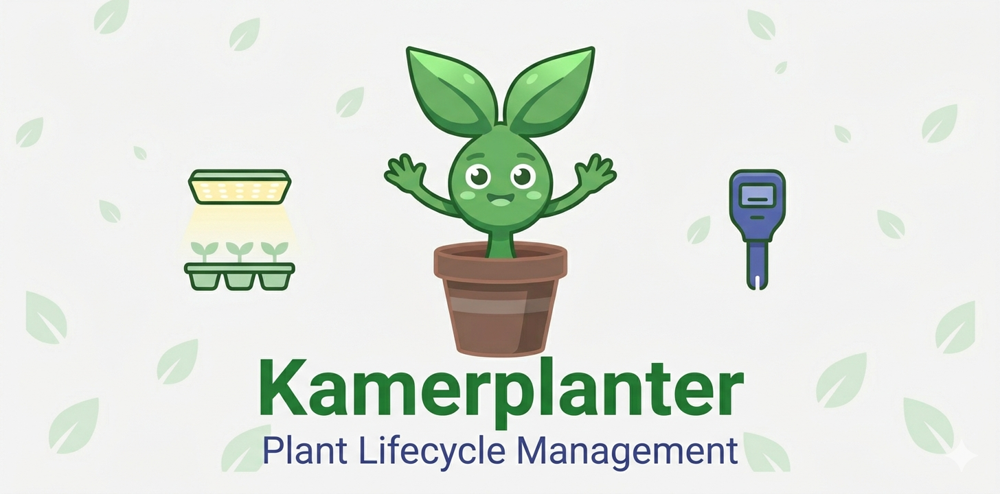

<p align="center">
  
</p>

# Kamerplanter

Kamerplanter is a plant lifecycle management system for indoor and outdoor growing — covering everything from seed to harvest. It supports vegetables, herbs, houseplants, and ornamentals with features like nutrient planning, phase tracking, sensor integration, and care reminders.

**This project started as a vibe coding experiment** — built almost entirely through conversational AI prompting with Claude Code. The specifications, architecture, domain models, backend, frontend, Helm charts, and tests were all developed in this style. What began as an exploration of AI-assisted development grew into a fully functional agricultural management platform.

## Features

- **Plant Master Data** — Species, cultivars, botanical families with companion planting and crop rotation graphs
- **Growth Phase Tracking** — State machine (Germination > Seedling > Vegetative > Flowering > Harvest) with GDD, VPD, and photoperiod targets
- **Nutrient Planning** — Fertilizer mixing with EC budgets, mixing order safety, flush protocols, and runoff analysis
- **Tank Management** — Water source configuration (tap/RO/mixed), tank state tracking, and automated dosage calculation
- **Planting Runs** — Batch management for plant groups with lifecycle tracking
- **Care Reminders** — Adaptive watering/feeding schedules with 9 care presets, seasonal awareness, and learning from confirmations
- **Task & Workflow Engine** — Template-based task generation with dependency resolution
- **IPM (Pest Management)** — Integrated pest/disease tracking with Karenz safety intervals blocking harvest
- **Harvest Management** — Quality scoring, yield metrics, and harvest readiness indicators
- **Calendar** — Aggregated view of tasks, phases, and events with iCal export (RFC 5545)
- **Sowing Calendar** — Frost-date-aware planting windows for outdoor growing
- **Onboarding Wizard** — 5-step setup with 9 starter kits for quick start
- **Experience Levels** — UI adapts complexity (beginner/intermediate/expert)
- **Multi-Tenancy** — Personal gardens, community gardens, and commercial operations with role-based access
- **Authentication** — Local accounts + OAuth2/OIDC federation (Google, GitHub, Apple)
- **i18n** — German and English, with German as default

## Tech Stack

| Layer | Technology |
|-------|------------|
| Backend | Python 3.14+, FastAPI, Celery, Authlib |
| Frontend | React 19, TypeScript 5.9, MUI 7, Redux Toolkit, Vite 6 |
| Primary DB | ArangoDB 3.11+ (documents + graph) |
| Time-Series DB | TimescaleDB 2.13+ (planned) |
| Cache / Queue | Redis 7.2+ |
| Orchestration | Kubernetes, Helm, Skaffold |

## Prerequisites

- [Docker](https://docs.docker.com/get-docker/) and Docker Compose — for the simple setup
- [Skaffold](https://skaffold.dev/) + a local Kubernetes cluster (e.g. minikube, k3s, Docker Desktop) — for the full dev workflow
- Node.js 25+ (managed via [asdf](https://asdf-vm.com/)) — for frontend development
- Python 3.14+ — for backend development

## Quick Start (Docker Compose)

### From Release (pre-built images)

Download the latest release assets from the [Releases page](https://github.com/nolte/kamerplante/releases):

```bash
# Download docker-compose and .env template (replace VERSION)
curl -LO https://github.com/nolte/kamerplante/releases/download/vVERSION/docker-compose-VERSION.yml
curl -LO https://github.com/nolte/kamerplante/releases/download/vVERSION/.env.example-VERSION

# Create your .env and set secure passwords
cp .env.example-VERSION .env
```

Edit `.env` and set secure passwords (at minimum `ARANGO_ROOT_PASSWORD` and `ARANGODB_PASSWORD`):

```bash
# Generate a secure password
openssl rand -base64 24

# Start all services
docker-compose -f docker-compose-VERSION.yml up -d
```

### From Source (local build)

```bash
# Copy the env template and set passwords
cp .env.example .env

# Start all services (builds from source)
docker-compose up --build
```

### Configuration

All credentials and settings are managed via a `.env` file. Docker Compose reads it automatically. See [`.env.example`](.env.example) for all available variables:

| Variable | Description | Default |
|----------|-------------|---------|
| `ARANGO_ROOT_PASSWORD` | ArangoDB root password | `changeme` |
| `ARANGODB_PASSWORD` | Password used by the application | `changeme` |
| `ARANGODB_DATABASE` | Database name | `kamerplanter` |
| `ARANGODB_USERNAME` | Database user | `root` |
| `REDIS_URL` | Valkey/Redis connection URL | `redis://valkey:6379/0` |
| `DEBUG` | Enable debug mode | `false` |
| `REQUIRE_EMAIL_VERIFICATION` | Require email verification on signup | `false` |
| `CORS_ORIGINS` | Allowed CORS origins (JSON array) | `["http://localhost:8080"]` |

### Services

Once running, these services are available:

| Service | URL |
|---------|-----|
| Frontend | http://localhost:8080 |
| Backend API | http://localhost:8000 |
| API Docs (Swagger) | http://localhost:8000/docs |
| ArangoDB UI | http://localhost:8529 |

The backend auto-creates the database, collections, and seeds demo data on first startup.

**Demo login:** `demo@kamerplanter.local` / `demo-passwort-2024`

## Development Setup (Skaffold + Kubernetes)

Skaffold is the primary development tool — it handles building, deploying, and hot-reloading:

```bash
# Full stack (manual trigger — rebuild only when you press 'r')
skaffold dev --trigger=manual --port-forward

# Backend only
skaffold dev --trigger=manual --port-forward -p backend-only

# Frontend only
skaffold dev --trigger=manual --port-forward -p frontend-only

# With debugpy enabled
skaffold debug --port-forward
```

Port forwards are configured automatically:

| Service | Local Port |
|---------|-----------|
| Frontend | 3000 |
| Backend API | 8000 |
| ArangoDB UI | 8529 |
| Home Assistant | 8123 |

## Contributing / Git Workflow

This project uses a branch-based workflow. The `main` branch is protected — all changes go through feature branches and pull requests.

1. **Create a feature branch** from `develop`:
   ```bash
   git checkout develop
   git pull origin develop
   git checkout -b feature/my-new-feature
   ```

2. **Develop and commit** your changes on the feature branch.

3. **Push and open a Pull Request** against `develop`:
   ```bash
   git push -u origin feature/my-new-feature
   ```
   Then open a PR on GitHub. Describe what the change does and link related issues or requirements (e.g. REQ-005).

4. **Review and merge** — after CI checks pass and the PR is approved, merge via GitHub. Avoid pushing directly to `main` or `develop`.

Branch naming conventions:

| Prefix | Purpose | Example |
|--------|---------|---------|
| `feature/` | New functionality | `feature/req005-sensor-integration` |
| `fix/` | Bug fixes | `fix/seed-data-validation` |
| `chore/` | Maintenance, CI, deps | `chore/update-helm-chart` |
| `docs/` | Documentation only | `docs/add-api-examples` |

## Running Tests

```bash
# Backend (pytest)
cd src/backend
pip install -r requirements-dev.txt
pytest

# Frontend (vitest)
cd src/frontend
npm install
npm test
```

## Project Structure

```
kamerplanter/
  spec/               # Specifications (German)
    req/              # 25 functional requirements (REQ-001 to REQ-027)
    nfr/              # 11 non-functional requirements
    stack.md          # Technology stack specification
  src/
    backend/          # Python/FastAPI backend
      app/
        api/v1/       # REST API routers
        domain/       # Business logic (models, engines, services)
        data_access/  # Repository implementations (ArangoDB)
        migrations/   # Seed data and schema migrations
        tasks/        # Celery background tasks
      tests/          # pytest test suite
    frontend/         # React/TypeScript frontend
      src/
        api/          # API client and types
        pages/        # Feature pages
        components/   # Shared components
        store/        # Redux slices
        i18n/         # Translations (de/en)
  helm/               # Helm charts (backend, frontend, ArangoDB)
  deploy/             # Kubernetes manifests
  docker-compose.yml  # Simple local setup
  skaffold.yaml       # Dev workflow orchestration
```

## Architecture

The system follows a strict 5-layer architecture:

```
Frontend (React) --> REST API (FastAPI) --> Services --> Engines --> Repositories --> ArangoDB
```

- **Engines** contain pure business logic (nutrient calculations, phase transitions, VPD formulas)
- **Services** orchestrate engines and repositories
- **Repositories** abstract database access behind interfaces
- ArangoDB serves as a multi-model database — documents for entities, graphs for relationships (companion planting, genetic lineage, crop rotation)

## License

This project is not yet licensed. All rights reserved.
