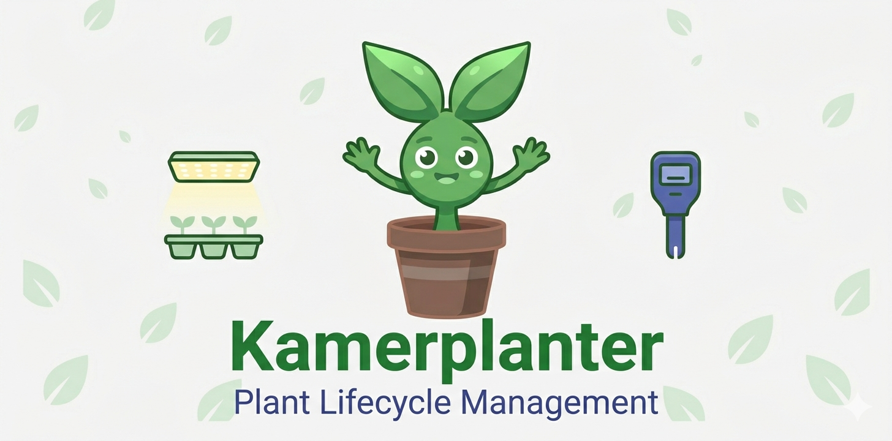

<p align="center">
  
</p>

# Kamerplanter

[](https://github.com/nolte/kamerplanter/actions/workflows/backend.yml)
[](https://github.com/nolte/kamerplanter/actions/workflows/frontend.yml)
[](https://github.com/nolte/kamerplanter/actions/workflows/docker-lint-build.yml)
[](https://github.com/nolte/kamerplanter/actions/workflows/skaffold-verify.yml)
[](LICENSE)
[](https://nolte.github.io/kamerplanter/)

Kamerplanter is a self-hosted plant lifecycle management system for indoor and outdoor growing — covering everything from seed to harvest.

Whether you're a **home grower** managing a grow tent, a **houseplant owner** trying to keep your plants alive, a **hobby gardener** planning raised beds and crop rotations, or running a **community garden** with shared responsibilities — Kamerplanter adapts to your experience level and scale. It supports vegetables, herbs, houseplants, and ornamentals with nutrient planning, growth phase tracking, adaptive care reminders, photo-based plant identification, a knowledge assistant, and Home Assistant integration.

## Why Kamerplanter?

- **One place for everything** — master data, growth tracking, nutrient plans, pest management, and harvest in a single system instead of scattered spreadsheets and notes
- **Knows your plants** — growth phase state machine with GDD (Growing Degree Days), VPD (Vapor Pressure Deficit), and photoperiod targets guides you through each stage. Perennial cycles and crop rotation built in.
- **Takes care of reminders** — adaptive care schedules learn from your confirmations, adjust to seasons and hemispheres, and cover 9 care presets from tropical to cactus
- **Calculates your nutrients** — fertilizer mixing with EC budgets, mixing order safety (CalMag before sulfates), flush protocols, tank management with tap/RO/mixed water sources
- **Protects your harvest** — integrated pest management with Karenz safety intervals that block premature harvest, resistance tracking to prevent overuse of treatments
- **Connects to your smart home** — Home Assistant custom integration for sensor data import and actuator control, closing the monitoring-to-action loop
- **Answers your questions** — RAG-based knowledge assistant with pluggable LLM backends (Anthropic, Ollama, OpenAI-compatible) for plant care advice grounded in your data
- **Scales from windowsill to community garden** — multi-tenancy with role-based access (admin/grower/viewer), personal and shared gardens, invitation system
- **Adapts to your skill level** — beginner/intermediate/expert modes control UI complexity, navigation depth, and form field visibility
- **Identifies plants from a photo** — snap a picture and Kamerplanter names the species (and diagnoses leaf diseases) in seconds, then links it to your master data. Built right into onboarding, so you go from photo to full care setup in under 30 seconds. Privacy-first and optional: a self-hosted recognition engine is the goal, with the Pl@ntNet free tier as a fallback — no cloud account required.
- **Enriches your data automatically** — GBIF and Perenual adapters fill in botanical details, CSV import for bulk data, iCal export for your calendar app
- **Self-hosted and private** — runs on your own hardware, no cloud dependency, GDPR-aware design with retention policies

## Tech Stack

| Layer | Technology |
|-------|------------|
| Backend | Python 3.14+, FastAPI, Celery, Authlib |
| Frontend | React 19, TypeScript 5.9, MUI 7, Redux Toolkit, Vite 6 |
| Knowledge Service | FastAPI, pgvector, ONNX embeddings, cross-encoder reranking |
| Plant Recognition | Pl@ntNet API, self-hosted DINOv2 image matching |
| Primary DB | ArangoDB 3.11+ (documents + graph) |
| Vector DB | PostgreSQL 18 + pgvector |
| Time-Series DB | TimescaleDB 2.13+ |
| Cache / Queue | Redis 7.2+ (Valkey) |
| Smart Home | Home Assistant custom integration |
| Orchestration | Kubernetes, Helm, Skaffold |
| Testing | pytest, vitest, Selenium E2E |

## Containers

Kamerplanter is composed of the following services. Core services start by default; optional services are enabled via [Docker Compose profiles](docker-compose.yml) (`vectordb`, `ollama`, `timescaledb`) or their dedicated Skaffold modules.

| Container | Image / Base | Role | Default |
|-----------|--------------|------|---------|
| `backend` | `kamerplanter-backend` (FastAPI) | REST API and business logic (5-layer architecture) | ✅ Core |
| `celery-worker` | `kamerplanter-backend` | Asynchronous background tasks (enrichment, care reminders, imports) | ✅ Core |
| `celery-beat` | `kamerplanter-backend` | Scheduler for periodic tasks (retention, watering, reminders) | ✅ Core |
| `frontend` | `kamerplanter-frontend` (React + nginx) | Web UI served as static assets via nginx | ✅ Core |
| `arangodb` | `arangodb:3.12` | Primary database — documents + graph (species, lineage, companion planting) | ✅ Core |
| `valkey` | `valkey/valkey:9` | Redis-compatible cache and Celery broker/result backend | ✅ Core |
| `vectordb` | `kamerplanter-vectordb` (PostgreSQL 18 + pgvector) | Vector store for RAG embeddings and image-match vectors | ⚙️ `vectordb` |
| `knowledge-service` | `kamerplanter-knowledge-service` (FastAPI) | RAG-based plant knowledge assistant with pluggable LLM backends | ⚙️ AI |
| `embedding-service` | `kamerplanter-embedding-service` (ONNX Runtime) | Text embedding generation for RAG (no PyTorch at runtime) | ⚙️ AI |
| `reranker-service` | `kamerplanter-reranker-service` (ONNX Runtime) | Cross-encoder reranking to improve RAG retrieval quality | ⚙️ `vectordb` |
| `inference-service` | `kamerplanter-inference-service` (ONNX Runtime) | Self-hosted DINOv2 image matching for plant & pest recognition | ⚙️ AI |
| `ollama` | `ollama/ollama` | Local LLM inference backend for the knowledge assistant | ⚙️ `ollama` |
| `timescaledb` | `timescale/timescaledb:2.28` | Time-series store for sensor data with automatic downsampling | ⚙️ `timescaledb` |
| `knowledge` | `kamerplanter-knowledge` (busybox) | Init container — copies knowledge-base YAMLs into a shared volume | ⚙️ Init |

## Quick Start

```bash
cp .env.example .env      # configure passwords
docker compose up --build  # start all core services
```

Open http://localhost:8080 and log in with `demo@kamerplanter.local` / `demo-passwort-2024`.

Optional services (AI assistant, time-series) can be enabled via [Docker Compose profiles](docker-compose.yml). For Kubernetes-based development with hot-reload, see the [Skaffold setup](#development) below.

## Development

Prerequisites: Docker, [Skaffold](https://skaffold.dev/), a local Kubernetes cluster (Kind/k3s/minikube), [Task](https://taskfile.dev/) (optional), Node.js 25+, Python 3.14+.

```bash
task setup                                        # create Kind cluster
skaffold dev --trigger=manual --port-forward      # full stack dev loop
```

Common tasks via [Taskfile](Taskfile.yaml):

```bash
task test:backend       # pytest (821+ tests)
task test:frontend      # vitest (198+ tests)
task test:e2e           # Selenium E2E
task lint:backend       # ruff
task lint:frontend      # ESLint
task ha:deploy          # deploy HA integration to pod
task docs:serve         # MkDocs local preview
task claude             # Claude Code + nolte portfolio plugins loaded
```

`task claude` starts Claude Code with the `nolte-shared` + `nolte-engineering`
portfolio plugins loaded from a local `claude-shared` checkout (override its path
with `NOLTE_CLAUDE_SHARED`). See [CLAUDE.md](CLAUDE.md) §"Claude Code plugin adoption".

## Documentation

Full documentation (architecture, API reference, guides) is available at **[nolte.github.io/kamerplanter](https://nolte.github.io/kamerplanter/)**.

## Contributing

Feature branches from `develop`, PRs against `develop`. Prefixes: `feature/`, `fix/`, `chore/`, `docs/`.

## Built with AI

This project is a vibe coding experiment — built almost entirely through conversational AI prompting with [Claude Code](https://claude.ai/code). The specifications, architecture, domain models, backend, frontend, Helm charts, E2E tests, and documentation were all developed this way.

## License

MIT License. See [LICENSE](LICENSE) for details.
