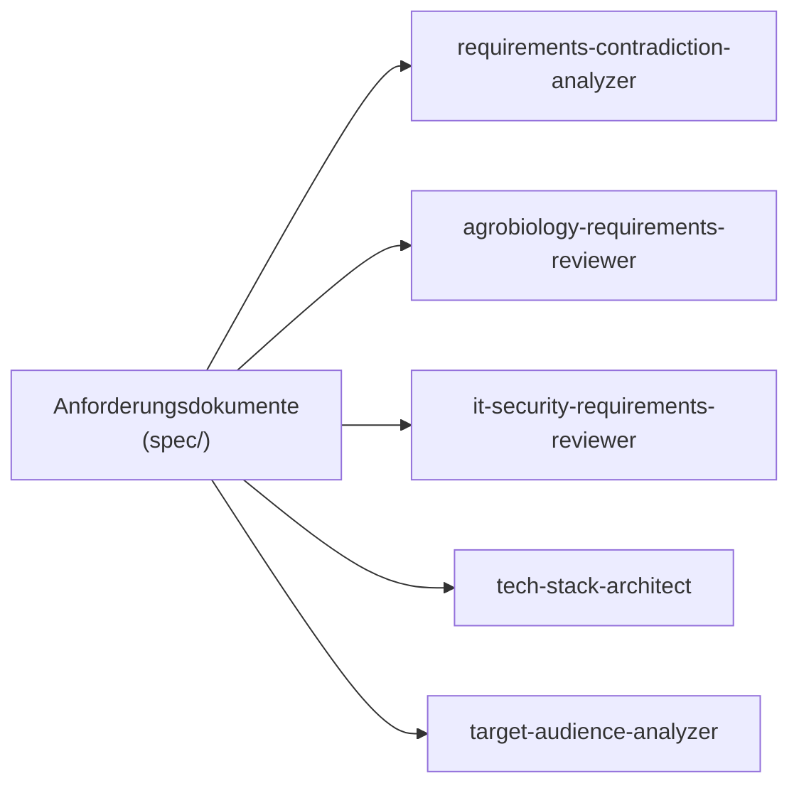
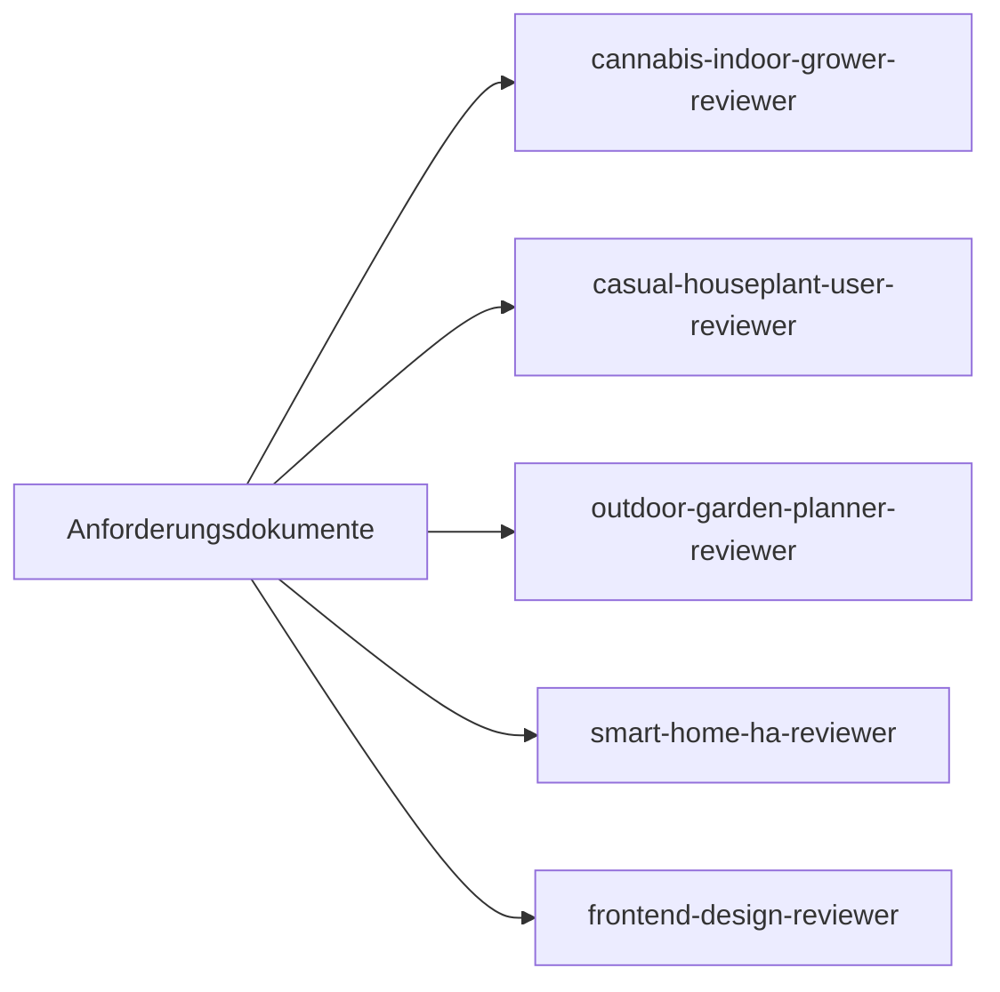
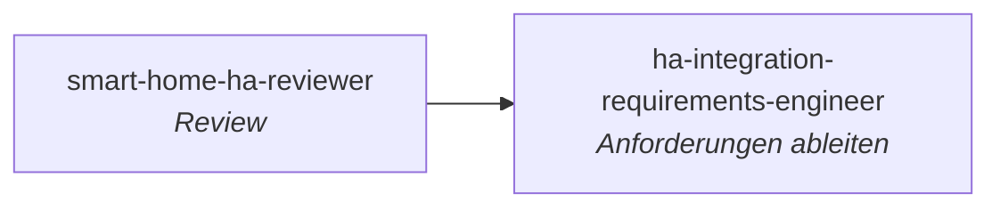
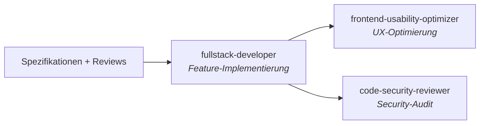
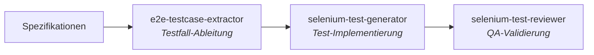
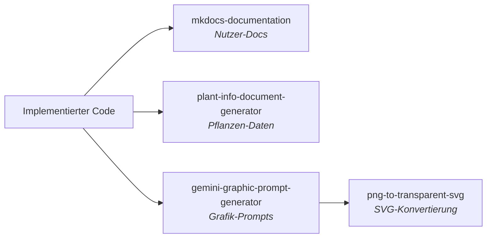

# Agent-Katalog

Uebersicht aller verfuegbaren Claude Code Agents im Kamerplanter-Projekt.
Jeder Agent ist ein spezialisierter KI-Assistent mit einer klar definierten Rolle, eigenem Workflow und spezifischen Werkzeugen.

!!! info "Stand: 17.03.2026 — 22 Agents registriert"
    Dieser Katalog wird vom `agent-catalog-generator` Agent automatisch erstellt.
    Aktualisierung: `/agent agent-catalog-generator`

---

## Schnellreferenz

| Agent | Modell | Aufgabe | Output |
|-------|:------:|---------|--------|
| `agrobiology-requirements-reviewer` | sonnet | Prueft botanische Korrektheit | Agrar-Review |
| `cannabis-indoor-grower-reviewer` | sonnet | Prueft Growzelt-Praxistauglichkeit | Grower-Review |
| `casual-houseplant-user-reviewer` | sonnet | Prueft Laien-Tauglichkeit | Casual-User-Review |
| `code-security-reviewer` | sonnet | Prueft Code auf Sicherheitsluecken | Security-Findings + Fixes |
| `e2e-testcase-extractor` | opus | Extrahiert E2E-Testfaelle aus Specs | Testfall-Dokumente |
| `frontend-design-reviewer` | sonnet | Bewertet UI/UX & Responsive Design | Design-Review |
| `frontend-usability-optimizer` | sonnet | Optimiert bestehende UI-Komponenten | Verbesserte React/MUI-Seiten |
| `fullstack-developer` | opus | Implementiert Features (Backend + Frontend) | Produktiver Code |
| `gemini-graphic-prompt-generator` | sonnet | Erstellt Bildgenerierungs-Prompts | Prompt-Dokumente |
| `ha-integration-requirements-engineer` | sonnet | Leitet HA-Integrationsanforderungen ab | HA-REQ-Dokumente |
| `it-security-requirements-reviewer` | sonnet | Prueft Anforderungen auf Security/DSGVO | Security-Review |
| `mkdocs-documentation` | opus | Erstellt mehrsprachige MkDocs-Doku | Dokumentations-Seiten |
| `outdoor-garden-planner-reviewer` | sonnet | Prueft Freiland-/Garten-Tauglichkeit | Garten-Review |
| `plant-info-document-generator` | sonnet | Generiert Pflanzen-Steckbriefe | Import-Dokumente |
| `png-to-transparent-svg` | — | Konvertiert PNG zu transparentem SVG | SVG-Dateien |
| `requirements-contradiction-analyzer` | sonnet | Prueft Anforderungen auf Widersprueche | Widerspruchs-Report |
| `selenium-test-generator` | sonnet | Generiert NFR-008-konforme Selenium-Tests | Python-Test-Code |
| `selenium-test-reviewer` | sonnet | Ueberprueft E2E-Tests auf NFR-008-Konformitaet | Compliance-Report |
| `smart-home-ha-reviewer` | sonnet | Prueft HA-Integrations-Architektur | HA-Review |
| `target-audience-analyzer` | sonnet | Analysiert Zielgruppen & Marktpotenziale | Zielgruppen-Report |
| `tech-stack-architect` | sonnet | Validiert Tech-Stack gegen Anforderungen | Stack-Review |
| `agent-catalog-generator` | haiku | Generiert Uebersicht aller Agents | Katalog-Markdown |

---

## Agents nach Kategorie

=== "Persona-Reviews"

    Spezialisierte Zielgruppen-Perspektiven, die Anforderungen aus Sicht eines konkreten Nutzertyps pruefen.

    | Agent | Persona | Fokus |
    |-------|---------|-------|
    | [`cannabis-indoor-grower-reviewer`](#cannabis-indoor-grower-reviewer) | Professioneller Indoor-Grower | Growzelt-Workflow, Ertrags-/Qualitaetsoptimierung |
    | [`casual-houseplant-user-reviewer`](#casual-houseplant-user-reviewer) | Planloser Zimmerpflanzen-Besitzer | Minimalaufwand, Verstaendlichkeit, Erinnerungen |
    | [`outdoor-garden-planner-reviewer`](#outdoor-garden-planner-reviewer) | Ambitionierte Gartenbesitzerin | Beetplanung, Fruchtfolge, Ueberwinterung |
    | [`smart-home-ha-reviewer`](#smart-home-ha-reviewer) | Smart-Home-Enthusiast | HA-Integration, MQTT, Sensoren, Aktoren |
    | [`frontend-design-reviewer`](#frontend-design-reviewer) | Frontend-Designer | Responsive Design, Kiosk-Modus, Barrierefreiheit |

=== "Fachliche Reviews"

    Experten-Reviews fuer spezifische Fachdisziplinen.

    | Agent | Fokus |
    |-------|-------|
    | [`agrobiology-requirements-reviewer`](#agrobiology-requirements-reviewer) | Botanische & agronomische Korrektheit |
    | [`it-security-requirements-reviewer`](#it-security-requirements-reviewer) | Datensparsamkeit, Auth, DSGVO, sichere Architektur |
    | [`requirements-contradiction-analyzer`](#requirements-contradiction-analyzer) | Widersprueche in Anforderungen |
    | [`tech-stack-architect`](#tech-stack-architect) | Technologie-Stack-Validierung |
    | [`target-audience-analyzer`](#target-audience-analyzer) | Zielgruppen & Marktpotenziale |

=== "Entwicklung"

    Agents die produktiven Code schreiben oder bestehenden Code verbessern.

    | Agent | Fokus |
    |-------|-------|
    | [`fullstack-developer`](#fullstack-developer) | Backend + Frontend Feature-Implementierung |
    | [`frontend-usability-optimizer`](#frontend-usability-optimizer) | Usability-Optimierung bestehender UI-Komponenten |
    | [`code-security-reviewer`](#code-security-reviewer) | Security-Audit und -Fixes im Code |

=== "Testing & QA"

    Testfall-Ableitung, Test-Generierung und Test-Review.

    | Agent | Fokus |
    |-------|-------|
    | [`e2e-testcase-extractor`](#e2e-testcase-extractor) | E2E-Testfall-Ableitung aus Specs |
    | [`selenium-test-generator`](#selenium-test-generator) | Selenium-Test-Code-Generierung |
    | [`selenium-test-reviewer`](#selenium-test-reviewer) | NFR-008-Compliance-Pruefung |

=== "Requirements Engineering"

    Ableitung und Spezifikation von Anforderungen.

    | Agent | Fokus |
    |-------|-------|
    | [`ha-integration-requirements-engineer`](#ha-integration-requirements-engineer) | HA-Integrationsanforderungen aus REQs ableiten |

=== "Dokumentation & Content"

    Dokumentation, Pflanzen-Steckbriefe und Katalog-Pflege.

    | Agent | Fokus |
    |-------|-------|
    | [`mkdocs-documentation`](#mkdocs-documentation) | Endnutzer- & Entwickler-Dokumentation |
    | [`plant-info-document-generator`](#plant-info-document-generator) | Pflanzen-Informationsdokumente |
    | [`agent-catalog-generator`](#agent-catalog-generator) | Agent-Katalog-Generierung |

=== "Grafik & Assets"

    Visuelle Assets erstellen und konvertieren.

    | Agent | Fokus |
    |-------|-------|
    | [`gemini-graphic-prompt-generator`](#gemini-graphic-prompt-generator) | Gemini-Bildgenerierungs-Prompts |
    | [`png-to-transparent-svg`](#png-to-transparent-svg) | PNG-zu-SVG-Konvertierung mit Transparenz |

---

## Agent-Details

### `agrobiology-requirements-reviewer`

| | |
|---|---|
| **Modell** | sonnet |
| **Tools** | Read, Write, Glob, Grep |
| **Output** | `spec/requirements-analysis/agrobiology-review.md` |

**Rolle:** Agrarbiologie-Experte mit 20+ Jahren Indoor-Anbau-Erfahrung (Zimmerpflanzen, Hydroponik, CEA), der Anforderungen auf botanische und agronomische Korrektheit prueft.

??? example "Wann einsetzen?"
    - Anforderungen auf biologische Korrektheit ueberpruefen
    - Licht-Parameter (PPFD vs. Lux) validieren
    - VPD, EC, pH-Spezifikationen ueberpruefen
    - Pflanzenschutz (IPM) und Toxizitaet bewerten
    - Datenquellen fuer botanische Inhalte validieren

**Workflow:**

1. Liest alle Anforderungsdokumente
2. Klassifiziert nach Anbaukontext (Indoor, Gewaechshaus, Outdoor, Hydroponik)
3. Prueft Taxonomie/Nomenklatur (wissenschaftliche Korrektheit)
4. Validiert Licht-Parameter (PPFD statt Lux, DLI, Photoperiodismus)
5. Prueft Klima-Spezifikationen (VPD, Temperatur-DIF, Luftfeuchtigkeit)
6. Ueberprueft Substrate, Bewaesserung, EC/pH
7. Bewertet Pflanzenschutz-Anforderungen (IPM, Schaedlinge, Krankheiten)
8. Erstellt Report mit fachlichen Fehlern, Unvollstaendigkeiten, Messbarkeit

---

### `cannabis-indoor-grower-reviewer`

| | |
|---|---|
| **Modell** | sonnet |
| **Tools** | Read, Write, Glob, Grep |
| **Output** | `spec/requirements-analysis/cannabis-indoor-grower-review.md` |

**Rolle:** Professioneller Indoor-Cannabis-Gaertner mit 10+ Jahren Growzelt-Erfahrung, der Anforderungen auf Praxistauglichkeit fuer den kompletten Grow-Zyklus (Keimung bis Cure) prueft.

??? example "Wann einsetzen?"
    - Pruefen ob der komplette Cannabis-Lebenszyklus abbildbar ist
    - Post-Harvest (Trocknung, Curing) Spezifikationen bewerten
    - Naehrstoff-Mixing-Workflow auf Praxistauglichkeit pruefen
    - Training-Methoden (Topping, LST, SCROG) als planbare Aktionen bewerten
    - Ertrags-Metriken (g/Watt, g/m2) und Run-Vergleich validieren
    - CanG-Compliance pruefen (Pflanzenzahl-Limits)

**Workflow:**

1. Liest alle Anforderungsdokumente
2. Ordnet Anforderungen 10 Grower-Workflows zu (Keimung, Veg, Bluete, Ernte, Cure, Naehrstoffe, Umgebung, IPM, Genetik, Tracking)
3. Prueft Grow-Lifecycle-Abdeckung (Keimung bis Cure komplett?)
4. Bewertet Naehrstoff-Workflow (Mixing, Runoff, Feeding-Charts)
5. Validiert Umgebungskontrolle (VPD-zentrisch, LED-spezifisch)
6. Prueft Genetik/Pheno-Hunting-Workflow und Run-Vergleich
7. Erstellt Report mit Workflow-Coverage-Matrix und Ertrags-Relevanz-Matrix

---

### `casual-houseplant-user-reviewer`

| | |
|---|---|
| **Modell** | sonnet |
| **Tools** | Read, Write, Glob, Grep |
| **Output** | `spec/requirements-analysis/casual-houseplant-user-review.md` |

**Rolle:** Planloser Zimmerpflanzen-Besitzer ohne gruenen Daumen, der die App nur nutzt um seine 3 Pflanzen am Leben zu erhalten. Prueft ob die App fuer die breite Masse alltagstauglich, verstaendlich und motivierend ist.

??? example "Wann einsetzen?"
    - Onboarding-Huerden fuer Laien identifizieren
    - Fachbegriffe auf Verstaendlichkeit pruefen
    - Aufwand-Nutzen-Verhaeltnis bewerten (>5 Min/Woche = zu viel)
    - Giess-Erinnerungen und 1-Tap-Bestaetigungen validieren
    - Overkill-Faktor bewerten (wie viele REQs sind fuer 3 Zimmerpflanzen irrelevant?)
    - Vergleich mit Konkurrenz (Planta, Greg)

**Workflow:**

1. Liest alle Anforderungsdokumente
2. Bewertet jede Anforderung: "Verstehe ich das? Brauche ich das? Kann ich das bedienen?"
3. Prueft Onboarding (<2 Min bis erste Pflanze), Giessen (Push + 1-Tap), Standort (keine PPFD-Werte)
4. Erstellt Fachbegriff-Audit (EC, VPD, Substrat, Cultivar etc.)
5. Bewertet Feature-Relevanz fuer Zimmerpflanzen-Laien (14 von 25 REQs als irrelevant erwartet)
6. Erstellt Report mit Aufwand-Analyse, Dealbreakern und Konkurrenz-Vergleich

---

### `code-security-reviewer`

| | |
|---|---|
| **Modell** | sonnet |
| **Tools** | Read, Edit, Bash, Glob, Grep |
| **Output** | `spec/requirements-analysis/code-security-review.md` + Fixes im Code |

**Rolle:** Application Security Engineer, der implementierten Backend- und Frontend-Code auf OWASP Top 10, Injection, Auth-Bypass, Tenant-Isolation, Secret Leaks und unsichere Kryptographie prueft und Schwachstellen direkt behebt.

??? example "Wann einsetzen?"
    - Implementierten Code auf Security-Probleme pruefen (nach Feature-Entwicklung)
    - AQL-Injection-Risiken in Repository-Queries finden
    - Tenant-Isolation-Verletzungen identifizieren
    - JWT/Passwort-Handling validieren
    - CORS, Security Headers, Error Responses pruefen
    - Frontend auf XSS, Token-Handling, Auth-Guards pruefen

**Workflow:**

1. Liest Referenz-Specs (REQ-023, REQ-024, NFR-001, NFR-006)
2. Scannt Backend: API-Router, Auth, Tenant-Guard, Repositories, Services
3. Scannt Frontend: API-Client, Redux State, Routing, Komponenten
4. Prueft 9 Kategorien: Injection, Auth, Access Control, Misconfiguration, Crypto, Input Validation, Rate Limiting, Logging, Frontend Security
5. Behebt P0/P1-Schwachstellen direkt im Code
6. Erstellt Report mit Tenant-Isolation-Matrix und priorisierten Findings

---

### `e2e-testcase-extractor`

| | |
|---|---|
| **Modell** | opus |
| **Tools** | Alle |
| **Output** | `spec/test-cases/TC-{REQ-ID}.md` |

**Rolle:** QA-Architekt, der Anforderungsdokumente systematisch auf testbare Szenarien analysiert und E2E-Testfall-Dokumente aus Nutzer-Perspektive ableitet.

??? example "Wann einsetzen?"
    - Testfaelle aus REQ-Dokumenten extrahieren
    - Testabdeckungs-Luecken identifizieren
    - Traceability zwischen Requirements und Tests etablieren
    - RAG-optimierte Testfall-Dokumentation erstellen

**Workflow:**

1. Liest Anforderungsdokumente (REQ-\*/NFR-\*)
2. Zerlegt Anforderungen in testbare Szenarien (Happy Path, Edge Cases, Fehler)
3. Leitet aus Nutzer-Sicht ab: Was sieht/klickt/erwartet der Anwender im Browser?
4. Strukturiert Testfaelle nach TC-ID, Prioritaet, Kategorie
5. Optimiert fuer RAG-Retrieval durch Semantics, Tags, Cross-References

---

### `frontend-design-reviewer`

| | |
|---|---|
| **Modell** | sonnet |
| **Tools** | Read, Write, Glob, Grep |
| **Output** | `spec/requirements-analysis/frontend-design-review.md` |

**Rolle:** Frontend-Designer mit 15+ Jahren Responsive-Design- und Touch-Expertise fuer raue Arbeitsumgebungen (Gewaechshaus, Growraum).

??? example "Wann einsetzen?"
    - UI/UX-Anforderungen auf Responsive Design pruefen (Mobile/Tablet/Desktop)
    - Kiosk-Modus-Tauglichkeit bewerten (verschmutzte Haende, Handschuhe, Nase)
    - Barrierefreiheit (WCAG 2.1 AA) ueberpruefen
    - Touch-Target-Dimensionierungen validieren
    - Design-System-Konformitaet pruefen

**Workflow:**

1. Liest alle Anforderungsdokumente und Frontend-Code
2. Klassifiziert nach Bedienkontext (Desktop/Mobile/Tablet/Kiosk)
3. Prueft Responsive Design (Breakpoints, Layout-Adaptation, Typografie)
4. Bewertet Kiosk-Modus: Touch-Targets (min. 64x64px), vereinfachte Interaktion
5. Validiert Barrierefreiheit (Tastatur, ARIA, Kontraste)
6. Erstellt Design-Review-Report mit Touch-Target-Audit

---

### `frontend-usability-optimizer`

| | |
|---|---|
| **Modell** | sonnet |
| **Tools** | Read, Write, Edit, Bash, Glob, Grep |
| **Output** | Optimierter React/MUI-Code + Compliance-Report |

**Rolle:** UX-Engineer und Frontend-Spezialist, der bestehende React/MUI-Formulare, Dialoge, Detail-Seiten und Listenansichten fuer maximale Usability optimiert. Arbeitet NUR auf bereits implementiertem Code.

??? example "Wann einsetzen?"
    - Feldanordnung, Gruppierung und Labels in Formularen verbessern
    - Hilfstexte, Einheiten und Validierungs-Feedback ergaenzen
    - Leerzustaende und Ladezustaende implementieren
    - Responsive Layout und Tab-Reihenfolge optimieren
    - UI-NFR-Compliance sicherstellen (nach Fullstack-Developer)

**Workflow:**

1. Liest bestehenden Code und zugehoerige UI-NFR-Specs
2. Identifiziert Usability-Probleme anhand Checklisten (Formulare, Darstellung, Accessibility, i18n)
3. Implementiert Verbesserungen direkt im Code (Edit/Write)
4. Ergaenzt i18n-Keys in DE + EN
5. Fuehrt UI-NFR-Compliance-Pruefung durch (MUSS/SOLL/KANN)
6. Verifiziert mit `tsc --noEmit` und `eslint`

---

### `fullstack-developer`

| | |
|---|---|
| **Modell** | opus |
| **Tools** | Read, Write, Edit, Bash, Glob, Grep |
| **Output** | Produktionsreifer Code |

**Rolle:** Senior Full-Stack-Entwickler mit vollstaendiger Produktions-Expertise im definierten Tech-Stack (Python/FastAPI/ArangoDB/React/Kubernetes).

??? example "Wann einsetzen?"
    - Features implementieren (Backend + Frontend komplett)
    - APIs entwerfen und bauen
    - React-Komponenten entwickeln
    - Datenbankschemas designen (ArangoDB/TimescaleDB)
    - Celery-Tasks und Helm-Charts erstellen
    - Bestehenden Code refactoren

**Workflow:**

1. Liest relevante Anforderungsdokumente und NFRs
2. Implementiert Backend: FastAPI-Router, Pydantic-Models, Services/Engines, ArangoDB-Repositories
3. Schreibt Fehlerbehandlung (NFR-006), Resilience-Patterns (NFR-007), Logging (structlog)
4. Implementiert Frontend: React-Komponenten mit TypeScript strict, Redux, MUI, i18n
5. Schreibt Tests (pytest Backend, vitest Frontend)
6. Erstellt Helm-Charts (bjw-s/common) mit Health Checks
7. Validiert Ruff/ESLint, TypeScript strict

---

### `gemini-graphic-prompt-generator`

| | |
|---|---|
| **Modell** | sonnet |
| **Tools** | Read, Write, Glob, Grep |
| **Output** | `spec/ref/graphic-prompts/<typ>_<name>.md` |

**Rolle:** Visual Design Director und Prompt Engineer, der praezise Gemini-Bildgenerierungs-Prompts im Kamerplanter Corporate Design erstellt (Primary Green #2e7d32/#66bb6a, Secondary Indigo #5c6bc0/#9fa8da).

??? example "Wann einsetzen?"
    - App-Icons, Logos, Feature-Icons erstellen
    - Illustrationen fuer Leerseiten, Onboarding, 404-Seiten
    - Hero-Banner und Marketing-Material
    - Badges, Patterns, Diagramme
    - Light/Dark-Mode-Varianten von Grafiken

**Workflow:**

1. Liest Kami-Charakter-Referenz (PFLICHT) und ggf. Theme-Dateien
2. Klassifiziert Grafiktyp (app-icon, illustration, empty-state, onboarding, hero, badge, etc.)
3. Konstruiert Prompt: Stil-Anweisung + exakte Hex-Farbwerte + Motivbeschreibung + Komposition + Negative Prompts
4. Erstellt Light/Dark-Varianten mit modusgerechtem Kontrast
5. Generiert Prompt-Dokument mit Nachbearbeitungs-Checkliste

---

### `ha-integration-requirements-engineer`

| | |
|---|---|
| **Modell** | sonnet |
| **Tools** | Read, Write, Glob, Grep |
| **Output** | `spec/ha-integration/HA-REQ-{nnn}_{kurztitel}.md` |

**Rolle:** Senior HA Custom Integration Entwickler mit Agrar-IoT-Spezialisierung, der aus bestehenden REQ-Dokumenten konkrete, implementierbare HA-Integrationsanforderungen ableitet. Nutzt das Drei-Seiten-Modell (A: KP->HA Export, B: HA->KP Import, C: KP->HA Aktorik).

??? example "Wann einsetzen?"
    - Aus REQ-Dokumenten HA-spezifische Entity-Mappings ableiten
    - Coordinator-Strukturen und Polling-Intervalle entwerfen
    - Event-Schemas (MQTT) fuer zeitkritische Zustandsaenderungen spezifizieren
    - Automation-Blueprints aus Domaenenlogik ableiten
    - Backend-API-Erweiterungen fuer HA-Integration identifizieren
    - HA-CUSTOM-INTEGRATION.md erweitern

**Workflow:**

1. Liest bestehende HA-Integrations-Spec und Review-Ergebnisse
2. Analysiert Ziel-REQ-Dokumente auf Domaenen-Events, berechnete Werte, Schwellwerte
3. Designed Entity-Taxonomie (sensor, binary_sensor, calendar, todo, button, number, select)
4. Prueft API-Abhaengigkeiten (existiert der Endpoint? Neuer noetig?)
5. Definiert Steuerungsgrenze (Seite C: KP steuert vs. HA regelt)
6. Erstellt Automation-Blueprints als YAML
7. Bewertet Optionalitaet und Degradationsverhalten

---

### `it-security-requirements-reviewer`

| | |
|---|---|
| **Modell** | sonnet |
| **Tools** | Read, Write, Glob, Grep |
| **Output** | `spec/requirements-analysis/it-security-review.md` |

**Rolle:** IT-Security-Architekt und Datenschutzexperte mit 15+ Jahren Praxis (OWASP, IAM, DSGVO, Kryptographie), der Anforderungsdokumente auf Sicherheitsluecken, fehlende Zugriffskontrollen und DSGVO-Konformitaet prueft.

??? example "Wann einsetzen?"
    - Datensparsamkeit (Art. 5 DSGVO) pruefen: Werden nur notwendige Daten erfasst?
    - Auth-Luecken finden: Endpunkte ohne definierte Zugriffskontrolle
    - RBAC-Vollstaendigkeit validieren: Berechtigungsmatrix lueckenlos?
    - DSGVO-Betroffenenrechte (Art. 12-22) auf Vollstaendigkeit pruefen
    - API-Sicherheit: Input-Validierung, CORS, Rate Limiting
    - Verschluesselung und Secret Management bewerten

**Workflow:**

1. Liest Referenz-Specs (REQ-023, REQ-024, NFR-001, NFR-006) als Soll-Zustand
2. Erstellt Sicherheitsindex aller Anforderungen (Daten, Zugriffskontrolle, Schnittstellen)
3. Prueft Datensparsamkeit, Authentifizierung, Autorisierung, API-Sicherheit
4. Prueft Verschluesselung, Secret Management, Infrastruktur
5. Validiert DSGVO-Konformitaet (Betroffenenrechte, Einwilligung, AVV)
6. Erstellt Report mit Datensparsamkeits-Matrix, Autorisierungs-Matrix, DSGVO-Checkliste

---

### `mkdocs-documentation`

| | |
|---|---|
| **Modell** | opus |
| **Tools** | Read, Write, Edit, Bash, Glob, Grep |
| **Output** | `docs/` (DE + EN) |

**Rolle:** Technical Writer mit MkDocs-Material-Expertise, der endnutzerfreundliche, mehrsprachige Dokumentation erstellt und pflegt.

??? example "Wann einsetzen?"
    - Endnutzer-Dokumentation (User Guides, Tutorials)
    - Architektur-Dokumentation (ADRs, Developer Guides)
    - API-Dokumentation aus Docstrings generieren
    - Dokumentations-Versionierung (mike)
    - Mehrsprachigkeit (DE/EN) verwalten

**Workflow:**

1. Liest Spezifikationen auf fachliche Inhalte
2. Erstellt Seitenstruktur (DE/EN parallel)
3. Schreibt aufgabenorientierte Endnutzer-Docs mit Screenshots
4. Erstellt Architecture Decision Records (ADRs)
5. Konfiguriert mkdocs.yml mit Material-Theme und Plugins
6. Setzt Versionierung mit mike auf

---

### `outdoor-garden-planner-reviewer`

| | |
|---|---|
| **Modell** | sonnet |
| **Tools** | Read, Write, Glob, Grep |
| **Output** | `spec/requirements-analysis/outdoor-garden-planner-review.md` |

**Rolle:** Passionierte Hobbygartnerin mit 400 m2 Hausgarten + 80 m2 Gemeinschaftsgarten-Parzelle (15 Jahre Erfahrung, ~120 Pflanzen), die Anforderungen auf Freiland-Tauglichkeit prueft.

??? example "Wann einsetzen?"
    - Beetplanung und 4-Jahres-Fruchtfolge validieren
    - Ueberwinterungsmanagement pruefen (Frostschutz, Knollen ausgraben, Kuebelpflanzen einraeumen)
    - Mehrjaehrige Pflanzen (Stauden, Obstbaeume, Beerensstraeucher) ueber Jahre verfolgen
    - Gemeinschaftsgarten-Koordination bewerten (Giessdienst, Aufgabenverteilung, Parzellen)
    - Saisonkalender und phaenologische Zeiger pruefen
    - Organische Duengung (Kompost, Brennnesseljauche) statt EC-Werte

**Workflow:**

1. Liest alle Anforderungsdokumente
2. Ordnet Anforderungen 8 Gartenalltags-Workflows zu (Jahresplanung, Voranzucht, Auspflanzen, Pflege, Ueberwinterung, Mehrjaehrige, Gemeinschaftsgarten, Dokumentation)
3. Prueft Beetplanung, Mischkultur, Fruchtfolge
4. Bewertet Ueberwinterungs-Features (Winterhaerte-Ampel, Frostwarnung, Knollen-Zyklus)
5. Validiert Gemeinschaftsgarten-Features (Multi-Tenancy, Giessdienst-Rotation)
6. Erstellt Report mit Saisonkalender, Ueberwinterungs-Checkliste, Gemeinschaftsgarten-Anforderungen

---

### `plant-info-document-generator`

| | |
|---|---|
| **Modell** | sonnet |
| **Tools** | Read, Write, Glob, Grep, WebSearch, WebFetch |
| **Output** | `spec/ref/plant-info/<scientific_name_snake_case>.md` |

**Rolle:** Agrar-Botaniker und Pflanzenberater mit 20+ Jahren Praxis, der detaillierte Pflanzen-Informationsdokumente fuer den Kamerplanter-Datenimport (REQ-012) generiert.

??? example "Wann einsetzen?"
    - Pflanzen-Steckbriefe fuer den Datenimport erstellen
    - Botanische Daten (Taxonomie, Phasen, Naehrstoffe) recherchieren
    - IPM-Informationen (Schaedlinge, Nuetzlinge, Behandlungen) zusammenstellen
    - Fruchtfolge- und Mischkultur-Empfehlungen dokumentieren
    - Pflegeprofile (CareProfile, OverwinteringProfile) fuer Arten erstellen
    - CSV-Import-Daten (REQ-012-kompatibel) generieren

**Workflow:**

1. Identifiziert Pflanzenart (wissenschaftlicher Name, Familie, Gattung)
2. Recherchiert via WebSearch: Taxonomie, Phasen, Naehrstoffe, IPM, Pflege, Mischkultur
3. Erstellt strukturiertes Dokument mit KA-Feldnamen-Referenzen
4. Dokumentiert Duengerprodukte (mineralisch + organisch, mit Marken)
5. Generiert CSV-Import-Zeilen fuer Species und Cultivars
6. Markiert Datenluecken mit `<!-- DATEN FEHLEN -->`

---

### `png-to-transparent-svg`

| | |
|---|---|
| **Modell** | — (erbt vom Parent) |
| **Tools** | Read, Write, Bash, Glob |
| **Output** | SVG-Dateien neben den Quell-PNGs |

**Rolle:** Bildverarbeitungs-Spezialist fuer die Konvertierung von PNG-Bildern mit eingebranntem Schachbrett-Hintergrund (fake transparency) in saubere SVGs mit echter Transparenz.

??? example "Wann einsetzen?"
    - PNGs aus KI-Bildgeneratoren (Gemini, DALL-E, Midjourney) konvertieren
    - Screenshots mit Schachbrett-Hintergrund bereinigen
    - PNGs mit einfarbigem Hintergrund transparent machen
    - Batch-Konvertierung mehrerer PNGs zu SVG

**Workflow:**

1. Analysiert PNG: Alpha-Kanal, Ecken-Analyse (Schachbrett? Einfarbig? Bereits transparent?)
2. Entfernt Schachbrett-Pixel (Spread<=8, Min-Brightness>195 → transparent)
3. Speichert bereinigtes PNG mit echtem Alpha-Kanal
4. Vektorisiert mit vtracer (color mode, stacked hierarchy)
5. Validiert SVG: Hintergrund-Pfad entfernt? Dateigroesse akzeptabel?
6. Erstellt Ergebnis-Report (Pixel entfernt, SVG-Groesse)

---

### `requirements-contradiction-analyzer`

| | |
|---|---|
| **Modell** | sonnet |
| **Tools** | Read, Write, Glob, Grep, Bash |
| **Output** | `spec/requirements-analysis/contradiction-report.md` + `requirements-index.json` |

**Rolle:** Requirements Engineer, der Anforderungsdokumente nach Widerspruechen, Luecken und Qualitaetsproblemen prueft.

??? example "Wann einsetzen?"
    - Anforderungen auf Konsistenz pruefen (FA vs. NFA)
    - Widersprueche zwischen Requirements und Stack identifizieren
    - Nicht messbare NFAs praezisieren
    - Anforderungsqualitaet sicherstellen vor Implementierung

**Workflow:**

1. Sammelt alle Dokumente (spec/req/, spec/nfr/, spec/ui-nfr/)
2. Klassifiziert Anforderungen (Funktional, Performance, Sicherheit, Usability)
3. Erstellt Anforderungs-Index mit eindeutigen IDs
4. Prueft auf 6 Widerspruchstypen (direkt, implizit, Priorisierung, Scope, zeitlich, zwischen NFAs)
5. Bewertet nach Schweregrad (Kritisch/Hoch/Mittel/Niedrig)
6. Erstellt Report mit Loesungsoptionen und maschinenlesbarem Index

---

### `selenium-test-generator`

| | |
|---|---|
| **Modell** | sonnet |
| **Tools** | Read, Write, Edit, Glob, Grep, Bash |
| **Output** | `tests/e2e/` (Python-Selenium-Tests) |

**Rolle:** QA-Ingenieur, der aus Testfall-Dokumenten oder Anforderungen NFR-008-konforme Python-Selenium-Tests mit Page-Object-Pattern generiert.

??? example "Wann einsetzen?"
    - Selenium-E2E-Tests generieren oder erweitern
    - Test-Code aus Testfall-Dokumenten erzeugen
    - Page Objects fuer neue Seiten/Workflows erstellen
    - Testprotokoll-Generierung implementieren

**Workflow:**

1. Liest NFR-008 und Anforderungsdokumente
2. Erstellt conftest.py mit Browser-Fixture und CLI-Optionen
3. Generiert ProtocolPlugin fuer Testprotokoll-Generierung
4. Erstellt BasePage und Feature-spezifische Page Objects
5. Schreibt Test-Klassen mit Screenshot-Checkpoints an 4 definierten Stellen
6. Validiert Struktur und Screenshot-Abdeckung

---

### `selenium-test-reviewer`

| | |
|---|---|
| **Modell** | sonnet |
| **Tools** | Read, Edit, Grep, Glob, Bash |
| **Output** | `test-reports/nfr-008-compliance-report.md` |

**Rolle:** Senior QA-Ingenieur, der existierende Selenium-Tests auf NFR-008-Konformitaet, Code-Qualitaet und Best Practices prueft.

??? example "Wann einsetzen?"
    - Existierende Tests auf NFR-008-Compliance ueberpruefen
    - Test-Code debuggen und reparieren
    - Anti-Patterns beheben (`time.sleep`, fragile Locators, direkte `find_element` in Tests)

**Workflow:**

1. Findet Tests unter `tests/e2e/`
2. Prueft Verzeichnisstruktur (conftest.py, protocol_plugin.py, base_page.py)
3. Validiert conftest.py auf CLI-Optionen, Browser-Fixture, Screenshot-Fixture
4. Prueft Kernfunktions-Abdeckung (REQ-001/002/003/009)
5. Auditet Screenshot-Checkpoints
6. Identifiziert Code-Anti-Patterns
7. Erstellt Compliance-Report

---

### `smart-home-ha-reviewer`

| | |
|---|---|
| **Modell** | sonnet |
| **Tools** | Read, Write, Glob, Grep |
| **Output** | `spec/requirements-analysis/smart-home-ha-integration-review.md` |

**Rolle:** Smart-Home-Enthusiast mit HA OS (300+ Entitaeten), 2 Growzelten und Gewaechshaus, der Anforderungen auf bidirektionale Home-Assistant-Integration prueft. Trennt klar zwischen Kamerplanter HA Custom Integration (HACS) und Kamerplanter-Backend-Anforderungen.

??? example "Wann einsetzen?"
    - HA-Integrationsarchitektur bewerten (Seite A/B/C)
    - Entitaeten-Export nach HA pruefen (Sensoren, Binary-Sensoren, Calendar)
    - Sensor-Import aus HA validieren (Entity-Mapping, Fallback)
    - Aktor-Steuerungsgrenze definieren (KP vs. HA)
    - Optionalitaet sicherstellen (alles ohne HA nutzbar?)
    - Ausfallverhalten bei HA-Offline bewerten

**Workflow:**

1. Liest alle Anforderungsdokumente
2. Ordnet jede Anforderung einer Integrationsrichtung zu (A: KP->HA, B: HA->KP, C: Aktoren, nicht HA-relevant)
3. Prueft API-Tauglichkeit fuer HA Custom Integration (Stabiliaet, Versionierung, Bulk-Endpoints)
4. Bewertet Sensor-Import (Entity-Mapping, Polling, Fallback, Daten-Provenance)
5. Definiert Steuerungsgrenze (Sollwert-Modell vs. Direktsteuerung)
6. Erstellt Report mit Entitaeten-Landkarte, Optionalitaets-Checkliste, Automation-Blueprints

---

### `target-audience-analyzer`

| | |
|---|---|
| **Modell** | sonnet |
| **Tools** | Read, Write, Glob, Grep |
| **Output** | `spec/requirements-analysis/target-audience-report.md` |

**Rolle:** Produkt-Stratege mit AgriTech-Expertise, der Anforderungsdokumente auf implizite und explizite Zielgruppen analysiert.

??? example "Wann einsetzen?"
    - Zielgruppen-Profile aus Anforderungen ableiten
    - Unterversorgte Nutzergruppen identifizieren
    - Neue Marktsegmente erkunden (Urban Farming, Vertical Farming, Hobbyanbau)
    - Nutzer-Personas entwickeln

**Workflow:**

1. Liest alle Anforderungsdokumente vollstaendig
2. Extrahiert explizite Zielgruppen-Signale (Rollenbezeichnungen)
3. Leitet implizite Zielgruppen ab (Komplexitaet, Skalierung, Automatisierungsgrad)
4. Erstellt Nutzergruppen-Profile mit Betriebsgroesse, technischer Affinitaet, Kernbeduerfnis
5. Identifiziert unterversorgte Gruppen (Betriebstyp, Domaene, Rolle)
6. Bewertet Potenziale nach Marktgroesse, Zahlungsbereitschaft, Anpassungsaufwand
7. Erstellt Zielgruppen x Anwendungsgebiete-Matrix

---

### `tech-stack-architect`

| | |
|---|---|
| **Modell** | sonnet |
| **Tools** | Read, Write, Glob, Grep, WebSearch, WebFetch |
| **Output** | `spec/requirements-analysis/tech-stack-review.md` |

**Rolle:** Software- und Infrastruktur-Architekt mit 15+ Jahren Erfahrung, der den Tech-Stack systematisch gegen alle Anforderungen validiert.

??? example "Wann einsetzen?"
    - Tech-Stack gegen funktionale und non-funktionale Anforderungen pruefen
    - Technologie-Luecken identifizieren
    - Versionskompatibilitaet ueberpruefen
    - Architektur-Risiken bewerten
    - Alternativen-Analysen durchfuehren

**Workflow:**

1. Liest alle Anforderungsdokumente und `spec/stack.md`
2. Erstellt Anforderungs-Register mit Stack-Implikationen
3. Prueft Abdeckungsmatrix (jede Anforderung <-> Technologie)
4. Bewertet jede Technologie nach Reife, Community, Betriebskomplexitaet, Security
5. Analysiert Architektur-Patterns (Schichtenarchitektur, Persistenz, Caching)
6. Identifiziert Risiken (Vendor Lock-in, EOL, Skill-Gaps)
7. Prueft Querschnittsthemen (Auth, Secret Management, Monitoring, Backup)
8. Erstellt Massnahmen-Plan mit Alternativen-Analysen

---

### `agent-catalog-generator`

| | |
|---|---|
| **Modell** | haiku |
| **Tools** | Read, Write, Glob, Grep |
| **Output** | `docs/agent-catalog.md` |

**Rolle:** Technical Writer, der alle Agent-Definitionen liest und ein kompaktes Katalogdokument generiert.

??? example "Wann einsetzen?"
    - Onboarding neuer Entwickler
    - Nach Hinzufuegen neuer Agents
    - Zur Pflege einer zentralen Agent-Referenz

**Workflow:**

1. Liest alle Agent-Definitionen aus `.claude/agents/*.md`
2. Extrahiert Metadaten (Name, Modell, Tools, Beschreibung)
3. Klassifiziert Agents nach Kategorie
4. Erstellt Schnellreferenz und Einsatz-Entscheidungshilfe
5. Generiert Katalogdokument mit Statistiken

---

## Einsatz-Entscheidungshilfe

!!! tip "Welchen Agent brauche ich?"

    | Ich moechte... | Agent |
    |----------------|-------|
    | ...ein Feature implementieren (Backend + Frontend) | `fullstack-developer` |
    | ...bestehende UI-Seiten benutzerfreundlicher machen | `frontend-usability-optimizer` |
    | ...implementierten Code auf Sicherheit pruefen | `code-security-reviewer` |
    | ...den Tech-Stack gegen Anforderungen pruefen | `tech-stack-architect` |
    | ...Anforderungen auf Widersprueche pruefen | `requirements-contradiction-analyzer` |
    | ...Anforderungen auf Security/DSGVO pruefen | `it-security-requirements-reviewer` |
    | ...fachliche Korrektheit (Botanik) pruefen | `agrobiology-requirements-reviewer` |
    | ...aus Sicht eines Indoor-Growers pruefen | `cannabis-indoor-grower-reviewer` |
    | ...aus Sicht eines Zimmerpflanzen-Laien pruefen | `casual-houseplant-user-reviewer` |
    | ...aus Sicht einer Gartenplanerin pruefen | `outdoor-garden-planner-reviewer` |
    | ...UI/UX und Kiosk-Modus pruefen | `frontend-design-reviewer` |
    | ...HA-Integrationsarchitektur pruefen | `smart-home-ha-reviewer` |
    | ...HA-Integrationsanforderungen ableiten | `ha-integration-requirements-engineer` |
    | ...Zielgruppen und Marktpotenziale analysieren | `target-audience-analyzer` |
    | ...E2E-Testfaelle aus Specs ableiten | `e2e-testcase-extractor` |
    | ...Selenium-Tests generieren | `selenium-test-generator` |
    | ...bestehende Selenium-Tests reviewen | `selenium-test-reviewer` |
    | ...Dokumentation erstellen/aktualisieren | `mkdocs-documentation` |
    | ...Pflanzen-Steckbriefe generieren | `plant-info-document-generator` |
    | ...Grafik-Prompts fuer Gemini erstellen | `gemini-graphic-prompt-generator` |
    | ...PNG mit Schachbrett in SVG konvertieren | `png-to-transparent-svg` |
    | ...eine Uebersicht aller Agents generieren | `agent-catalog-generator` |

---

## Workflow-Phasen: Typische Einsatzreihenfolge

### Phase 1: Spezifikation & Review



Die Analyse-Agents laufen **parallel** auf den Spezifikationen und identifizieren Luecken, Widersprueche und Risiken.

### Phase 2: Persona-Reviews



Persona-Reviews laufen **parallel** und pruefen ob alle Zielgruppen abgedeckt sind. Ergebnisse fliessen als Spec-Erweiterungen zurueck.

### Phase 3: HA-Integration



Der HA-Requirements-Engineer baut auf dem Review des Smart-Home-Reviewers auf.

### Phase 4: Implementierung



Fullstack-Developer implementiert, danach optimiert der Usability-Optimizer die UI und der Code-Security-Reviewer prueft die Sicherheit.

### Phase 5: Testing



Testfaelle werden aus Specs abgeleitet, als Selenium-Tests implementiert und dann auf Konformitaet geprueft.

### Phase 6: Dokumentation & Assets



---

## Hinweise fuer Entwickler

**Agent starten:**

```bash
# Im Claude Code Chat:
/agent <name>
```

**Report-Ablage:**

| Agent-Typ | Ablageort |
|-----------|-----------|
| Analyse-/Review-Agents | `spec/requirements-analysis/` |
| HA-Integration | `spec/ha-integration/` |
| Selenium-Test-Reports | `test-reports/` |
| Testfall-Dokumente | `spec/test-cases/` |
| Pflanzen-Steckbriefe | `spec/ref/plant-info/` |
| Grafik-Prompts | `spec/ref/graphic-prompts/` |
| Dokumentation | `docs/` |

**Modellwahl:**

| Modell | Staerke | Agents |
|--------|--------|--------|
| **opus** | Hoechste Qualitaet — Implementierung, komplexe Analyse | `fullstack-developer`, `e2e-testcase-extractor`, `mkdocs-documentation` |
| **sonnet** | Preis-Leistung — Reviews, Reports, Analysen, UX-Optimierung | 18 Agents |
| **haiku** | Schnell & guenstig — einfache, strukturierte Aufgaben | `agent-catalog-generator` |
| **—** (erbt) | Kein eigenes Modell, erbt vom Eltern-Kontext | `png-to-transparent-svg` |

---

## Statistik

| Metrik | Wert |
|--------|:----:|
| Gesamt Agents | **22** |
| Persona-Reviews | 5 |
| Fachliche Reviews | 5 |
| Entwicklung & Security | 3 |
| Testing & QA | 3 |
| Requirements Engineering | 1 |
| Dokumentation & Content | 3 |
| Grafik & Assets | 2 |
| Modell: opus | 3 |
| Modell: sonnet | 18 |
| Modell: haiku | 1 |
