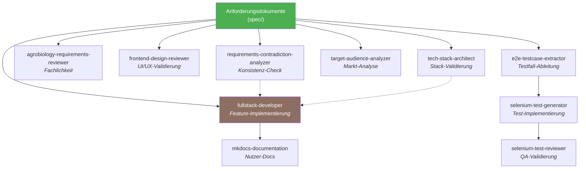

# Agent-Katalog

Übersicht aller verfügbaren Claude Code Agents im Kamerplanter-Projekt.
Jeder Agent ist ein spezialisierter KI-Assistent mit einer klar definierten Rolle, eigenem Workflow und spezifischen Werkzeugen.

!!! info "Stand: 27.02.2026 — 11 Agents registriert"
    Dieser Katalog wird vom `agent-catalog-generator` Agent automatisch erstellt.
    Aktualisierung: `/agent agent-catalog-generator`

---

## Schnellreferenz

| Agent | Modell | Aufgabe | Output |
|-------|:------:|---------|--------|
| `agent-catalog-generator` | haiku | Generiert Übersicht aller Agents | Katalog-Markdown |
| `agrobiology-requirements-reviewer` | sonnet | Prüft botanische Korrektheit | Agrar-Review |
| `e2e-testcase-extractor` | opus | Extrahiert E2E-Testfälle aus Specs | Testfall-Dokumente |
| `frontend-design-reviewer` | sonnet | Bewertet UI/UX & Responsive Design | Design-Review |
| `fullstack-developer` | opus | Implementiert Features (Backend + Frontend) | Produktiver Code |
| `mkdocs-documentation` | opus | Erstellt mehrsprachige MkDocs-Doku | Dokumentations-Seiten |
| `requirements-contradiction-analyzer` | sonnet | Prüft Anforderungen auf Widersprüche | Widerspruchs-Report |
| `selenium-test-generator` | sonnet | Generiert NFR-008-konforme Selenium-Tests | Python-Test-Code |
| `selenium-test-reviewer` | sonnet | Überprüft E2E-Tests auf NFR-008-Konformität | Compliance-Report |
| `target-audience-analyzer` | sonnet | Analysiert Zielgruppen & Marktpotenziale | Zielgruppen-Report |
| `tech-stack-architect` | sonnet | Validiert Tech-Stack gegen Anforderungen | Stack-Review |

---

## Agents nach Kategorie

=== "Analyse & Review"

    | Agent | Fokus |
    |-------|-------|
    | [`agrobiology-requirements-reviewer`](#agrobiology-requirements-reviewer) | Fachliche Korrektheit Agrarbiologie |
    | [`frontend-design-reviewer`](#frontend-design-reviewer) | UI/UX, Responsive Design & Kiosk-Modus |
    | [`requirements-contradiction-analyzer`](#requirements-contradiction-analyzer) | Widersprüche in Anforderungen |
    | [`selenium-test-reviewer`](#selenium-test-reviewer) | NFR-008-Konformität von Tests |
    | [`target-audience-analyzer`](#target-audience-analyzer) | Zielgruppen & Marktpotenziale |
    | [`tech-stack-architect`](#tech-stack-architect) | Technologie-Stack-Validierung |

=== "Entwicklung"

    | Agent | Fokus |
    |-------|-------|
    | [`fullstack-developer`](#fullstack-developer) | Backend + Frontend Feature-Implementierung |

=== "Testing & QA"

    | Agent | Fokus |
    |-------|-------|
    | [`e2e-testcase-extractor`](#e2e-testcase-extractor) | E2E-Testfall-Ableitung aus Specs |
    | [`selenium-test-generator`](#selenium-test-generator) | Selenium-Test-Code-Generierung |

=== "Dokumentation"

    | Agent | Fokus |
    |-------|-------|
    | [`agent-catalog-generator`](#agent-catalog-generator) | Agent-Katalog-Generierung |
    | [`mkdocs-documentation`](#mkdocs-documentation) | Endnutzer- & Entwickler-Dokumentation |

---

## Agent-Details

### `agrobiology-requirements-reviewer`

| | |
|---|---|
| **Modell** | sonnet |
| **Tools** | Read, Write, Glob, Grep |
| **Output** | `spec/requirements-analysis/agrobiology-review.md` |

**Rolle:** Agrarbiologie-Experte mit 20+ Jahren Indoor-Anbau-Erfahrung (Zimmerpflanzen, Hydroponik, CEA), der Anforderungen auf botanische und agronomische Korrektheit prüft.

??? example "Wann einsetzen?"
    - Anforderungen auf biologische Korrektheit überprüfen
    - Licht-Parameter (PPFD vs. Lux) validieren
    - VPD, EC, pH-Spezifikationen überprüfen
    - Pflanzenschutz (IPM) und Toxizität bewerten
    - Datenquellen für botanische Inhalte validieren

**Workflow:**

1. Liest alle Anforderungsdokumente
2. Klassifiziert nach Anbaukontext (Indoor, Gewächshaus, Outdoor, Hydroponik)
3. Prüft Taxonomie/Nomenklatur (wissenschaftliche Korrektheit)
4. Validiert Licht-Parameter (PPFD statt Lux, DLI, Photoperiodismus)
5. Prüft Klima-Spezifikationen (VPD, Temperatur-DIF, Luftfeuchtigkeit)
6. Überprüft Substrate, Bewässerung, EC/pH
7. Bewertet Pflanzenschutz-Anforderungen (IPM, Schädlinge, Krankheiten)
8. Erstellt Report mit fachlichen Fehlern, Unvollständigkeiten, Messbarkeit

---

### `agent-catalog-generator`

| | |
|---|---|
| **Modell** | haiku |
| **Tools** | Read, Write, Glob, Grep |
| **Output** | `docs/agent-catalog.md` |

**Rolle:** Technical Writer, der alle Agent-Definitionen liest und ein kompaktes Katalogdokument generiert.

??? example "Wann einsetzen?"
    - Onboarding neuer Entwickler
    - Nach Hinzufügen neuer Agents
    - Zur Pflege einer zentralen Agent-Referenz

**Workflow:**

1. Liest alle Agent-Definitionen aus `.claude/agents/*.md`
2. Extrahiert Metadaten (Name, Modell, Tools, Beschreibung)
3. Klassifiziert Agents nach Kategorie
4. Erstellt Schnellreferenz und Einsatz-Entscheidungshilfe
5. Generiert Katalogdokument mit Statistiken

---

### `e2e-testcase-extractor`

| | |
|---|---|
| **Modell** | opus |
| **Tools** | Read, Write, Glob, Grep |
| **Output** | `spec/test-cases/TC-{REQ-ID}.md` |

**Rolle:** QA-Architekt, der Anforderungsdokumente systematisch auf testbare Szenarien analysiert und E2E-Testfall-Dokumente aus Nutzer-Perspektive ableitet.

??? example "Wann einsetzen?"
    - Testfälle aus REQ-Dokumenten extrahieren
    - Testabdeckungs-Lücken identifizieren
    - Traceability zwischen Requirements und Tests etablieren
    - RAG-optimierte Testfall-Dokumentation erstellen

**Workflow:**

1. Liest Anforderungsdokumente (REQ-\*/NFR-\*)
2. Zerlegt Anforderungen in testbare Szenarien (Happy Path, Edge Cases, Fehler)
3. Leitet aus Nutzer-Sicht ab: Was sieht/klickt/erwartet der Anwender im Browser?
4. Strukturiert Testfälle nach TC-ID, Priorität, Kategorie
5. Optimiert für RAG-Retrieval durch Semantics, Tags, Cross-References

---

### `frontend-design-reviewer`

| | |
|---|---|
| **Modell** | sonnet |
| **Tools** | Read, Write, Glob, Grep |
| **Output** | `spec/requirements-analysis/frontend-design-review.md` |

**Rolle:** Frontend-Designer mit 15+ Jahren Responsive-Design- und Touch-Expertise für raue Arbeitsumgebungen (Gewächshaus, Growraum).

??? example "Wann einsetzen?"
    - UI/UX-Anforderungen auf Responsive Design prüfen (Mobile/Tablet/Desktop)
    - Kiosk-Modus-Tauglichkeit bewerten (verschmutzte Hände, Handschuhe, Nase)
    - Barrierefreiheit (WCAG 2.1 AA) überprüfen
    - Touch-Target-Dimensionierungen validieren
    - Design-System-Konformität prüfen

**Workflow:**

1. Liest alle Anforderungsdokumente und Frontend-Code
2. Klassifiziert nach Bedienkontext (Desktop/Mobile/Tablet/Kiosk)
3. Prüft Responsive Design (Breakpoints, Layout-Adaptation, Typografie)
4. Bewertet Kiosk-Modus: Touch-Targets (min. 64x64px), vereinfachte Interaktion, Umgebungsbedingungen
5. Validiert Barrierefreiheit (Tastatur, ARIA, Kontraste)
6. Prüft Mobile-Spezifika (Offline, Kamera, Bottom-Navigation)
7. Auditet Tablet-Szenarien (Landscape, Split-View)
8. Erstellt Design-Review-Report mit Wireframes und Touch-Target-Audit

---

### `fullstack-developer`

| | |
|---|---|
| **Modell** | opus |
| **Tools** | Read, Write, Edit, Bash, Glob, Grep |
| **Output** | Produktionsreifer Code |

**Rolle:** Senior Full-Stack-Entwickler mit vollständiger Produktions-Expertise im definierten Tech-Stack (Python/FastAPI/ArangoDB/React/Kubernetes).

??? example "Wann einsetzen?"
    - Features implementieren (Backend + Frontend komplett)
    - APIs entwerfen und bauen
    - React-Komponenten entwickeln
    - Datenbankschemas designen (ArangoDB/TimescaleDB)
    - Celery-Tasks und Helm-Charts erstellen
    - Bestehenden Code refactoren

**Workflow:**

1. Liest relevante Anforderungsdokumente und NFRs
2. Implementiert Backend: FastAPI-Router, Pydantic-Models, Services/Engines, ArangoDB-Repositories
3. Schreibt Fehlerbehandlung (NFR-006), Resilience-Patterns (NFR-007), Logging (structlog)
4. Implementiert Frontend: React-Komponenten mit TypeScript strict, Redux, MUI, i18n
5. Schreibt Tests (pytest Backend, vitest Frontend)
6. Erstellt Helm-Charts (bjw-s/common) mit Health Checks
7. Validiert Ruff/ESLint, TypeScript strict

---

### `mkdocs-documentation`

| | |
|---|---|
| **Modell** | opus |
| **Tools** | Read, Write, Edit, Bash, Glob, Grep |
| **Output** | `docs/` (DE + EN) |

**Rolle:** Technical Writer mit MkDocs-Material-Expertise, der endnutzerfreundliche, mehrsprachige Dokumentation erstellt und pflegt.

??? example "Wann einsetzen?"
    - Endnutzer-Dokumentation (User Guides, Tutorials)
    - Architektur-Dokumentation (ADRs, Developer Guides)
    - API-Dokumentation aus Docstrings generieren
    - Dokumentations-Versionierung (mike)
    - Mehrsprachigkeit (DE/EN) verwalten

**Workflow:**

1. Liest Spezifikationen auf fachliche Inhalte
2. Erstellt Seitenstruktur (DE/EN parallel)
3. Schreibt aufgabenorientierte Endnutzer-Docs mit Screenshots
4. Erstellt Architecture Decision Records (ADRs)
5. Konfiguriert mkdocs.yml mit Material-Theme und Plugins
6. Setzt Versionierung mit mike auf

---

### `requirements-contradiction-analyzer`

| | |
|---|---|
| **Modell** | sonnet |
| **Tools** | Read, Write, Glob, Grep, Bash |
| **Output** | `spec/requirements-analysis/contradiction-report.md` + `requirements-index.json` |

**Rolle:** Requirements Engineer, der Anforderungsdokumente nach Widersprüchen, Lücken und Qualitätsproblemen prüft.

??? example "Wann einsetzen?"
    - Anforderungen auf Konsistenz prüfen (FA vs. NFA)
    - Widersprüche zwischen Requirements und Stack identifizieren
    - Nicht messbare NFAs präzisieren
    - Anforderungsqualität sicherstellen vor Implementierung

**Workflow:**

1. Sammelt alle Dokumente (spec/req/, spec/nfr/, spec/ui-nfr/)
2. Klassifiziert Anforderungen (Funktional, Performance, Sicherheit, Usability)
3. Erstellt Anforderungs-Index mit eindeutigen IDs
4. Prüft auf 6 Widerspruchstypen (direkt, implizit, Priorisierung, Scope, zeitlich, zwischen NFAs)
5. Bewertet nach Schweregrad (Kritisch/Hoch/Mittel/Niedrig)
6. Erstellt Report mit Lösungsoptionen und maschinenlesbarem Index

---

### `selenium-test-generator`

| | |
|---|---|
| **Modell** | sonnet |
| **Tools** | Read, Write, Edit, Glob, Grep, Bash |
| **Output** | `tests/e2e/` (Python-Selenium-Tests) |

**Rolle:** QA-Ingenieur, der aus Testfall-Dokumenten oder Anforderungen NFR-008-konforme Python-Selenium-Tests mit Page-Object-Pattern generiert.

??? example "Wann einsetzen?"
    - Selenium-E2E-Tests generieren oder erweitern
    - Test-Code aus Testfall-Dokumenten erzeugen
    - Page Objects für neue Seiten/Workflows erstellen
    - Testprotokoll-Generierung implementieren

**Workflow:**

1. Liest NFR-008 und Anforderungsdokumente
2. Erstellt conftest.py mit Browser-Fixture und CLI-Optionen
3. Generiert ProtocolPlugin für Testprotokoll-Generierung
4. Erstellt BasePage und Feature-spezifische Page Objects
5. Schreibt Test-Klassen mit Screenshot-Checkpoints an 4 definierten Stellen
6. Validiert Struktur und Screenshot-Abdeckung

---

### `selenium-test-reviewer`

| | |
|---|---|
| **Modell** | sonnet |
| **Tools** | Read, Edit, Grep, Glob, Bash |
| **Output** | `test-reports/nfr-008-compliance-report.md` |

**Rolle:** Senior QA-Ingenieur, der existierende Selenium-Tests auf NFR-008-Konformität, Code-Qualität und Best Practices prüft.

??? example "Wann einsetzen?"
    - Existierende Tests auf NFR-008-Compliance überprüfen
    - Test-Code debuggen und reparieren
    - Anti-Patterns beheben (`time.sleep`, fragile Locators, direkte `find_element` in Tests)

**Workflow:**

1. Findet Tests unter `tests/e2e/`
2. Prüft Verzeichnisstruktur (conftest.py, protocol_plugin.py, base_page.py)
3. Validiert conftest.py auf CLI-Optionen, Browser-Fixture, Screenshot-Fixture
4. Prüft Kernfunktions-Abdeckung (REQ-001/002/003/009)
5. Auditet Screenshot-Checkpoints
6. Identifiziert Code-Anti-Patterns
7. Erstellt Compliance-Report

---

### `target-audience-analyzer`

| | |
|---|---|
| **Modell** | sonnet |
| **Tools** | Read, Write, Glob, Grep |
| **Output** | `spec/requirements-analysis/target-audience-report.md` |

**Rolle:** Produkt-Stratege mit AgriTech-Expertise, der Anforderungsdokumente auf implizite und explizite Zielgruppen analysiert.

??? example "Wann einsetzen?"
    - Zielgruppen-Profile aus Anforderungen ableiten
    - Unterversorgte Nutzergruppen identifizieren
    - Neue Marktsegmente erkunden (Urban Farming, Vertical Farming, Hobbyanbau)
    - Nutzer-Personas entwickeln

**Workflow:**

1. Liest alle Anforderungsdokumente vollständig
2. Extrahiert explizite Zielgruppen-Signale (Rollenbezeichnungen)
3. Leitet implizite Zielgruppen ab (Komplexität, Skalierung, Automatisierungsgrad)
4. Erstellt Nutzergruppen-Profile mit Betriebsgröße, technischer Affinität, Kernbedürfnis
5. Identifiziert unterversorgte Gruppen (Betriebstyp, Domäne, Rolle)
6. Bewertet Potenziale nach Marktgröße, Zahlungsbereitschaft, Anpassungsaufwand
7. Erstellt Zielgruppen x Anwendungsgebiete-Matrix

---

### `tech-stack-architect`

| | |
|---|---|
| **Modell** | sonnet |
| **Tools** | Read, Write, Glob, Grep, WebSearch, WebFetch |
| **Output** | `spec/requirements-analysis/tech-stack-review.md` |

**Rolle:** Software- und Infrastruktur-Architekt mit 15+ Jahren Erfahrung, der den Tech-Stack systematisch gegen alle Anforderungen validiert.

??? example "Wann einsetzen?"
    - Tech-Stack gegen funktionale und non-funktionale Anforderungen prüfen
    - Technologie-Lücken identifizieren
    - Versionskompatibilität überprüfen
    - Architektur-Risiken bewerten
    - Alternativen-Analysen durchführen

**Workflow:**

1. Liest alle Anforderungsdokumente und `spec/stack.md`
2. Erstellt Anforderungs-Register mit Stack-Implikationen
3. Prüft Abdeckungsmatrix (jede Anforderung <-> Technologie)
4. Bewertet jede Technologie nach Reife, Community, Betriebskomplexität, Security
5. Analysiert Architektur-Patterns (Schichtenarchitektur, Persistenz, Caching)
6. Identifiziert Risiken (Vendor Lock-in, EOL, Skill-Gaps)
7. Prüft Querschnittsthemen (Auth, Secret Management, Monitoring, Backup)
8. Erstellt Maßnahmen-Plan mit Alternativen-Analysen

---

## Einsatz-Entscheidungshilfe

!!! tip "Welchen Agent brauche ich?"

    | Ich möchte... | Agent |
    |----------------|-------|
    | ...den Tech-Stack gegen Anforderungen prüfen | `tech-stack-architect` |
    | ...Anforderungen auf Widersprüche prüfen | `requirements-contradiction-analyzer` |
    | ...E2E-Testfälle aus Specs ableiten | `e2e-testcase-extractor` |
    | ...Selenium-Tests generieren | `selenium-test-generator` |
    | ...bestehende Selenium-Tests reviewen | `selenium-test-reviewer` |
    | ...fachliche Korrektheit (Botanik) prüfen | `agrobiology-requirements-reviewer` |
    | ...UI/UX und Kiosk-Modus prüfen | `frontend-design-reviewer` |
    | ...Zielgruppen und Marktpotenziale analysieren | `target-audience-analyzer` |
    | ...Dokumentation erstellen/aktualisieren | `mkdocs-documentation` |
    | ...Features implementieren (Backend + Frontend) | `fullstack-developer` |
    | ...eine Übersicht aller Agents generieren | `agent-catalog-generator` |

---

## Agenten-Abhängigkeiten



---

## Hinweise für Entwickler

**Agent starten:**

```bash
# Im Claude Code Chat:
/agent <name>
```

**Report-Ablage:**

| Agent-Typ | Ablageort |
|-----------|-----------|
| Analyse-Agents | `spec/requirements-analysis/` |
| Selenium-Test-Reports | `test-reports/` |
| Testfall-Dokumente | `spec/test-cases/` |
| Dokumentation | `docs/` |

**Modellwahl:**

| Modell | Stärke | Agents |
|--------|--------|--------|
| **opus** | Höchste Qualität — Implementierung, komplexe Analyse | `fullstack-developer`, `e2e-testcase-extractor`, `mkdocs-documentation` |
| **sonnet** | Preis-Leistung — Reviews, Reports, Analysen | 7 Agents |
| **haiku** | Schnell & günstig — einfache, strukturierte Aufgaben | `agent-catalog-generator` |

---

## Statistik

| Metrik | Wert |
|--------|:----:|
| Gesamt Agents | **11** |
| Analyse & Review | 6 |
| Entwicklung | 1 |
| Testing & QA | 2 |
| Dokumentation | 2 |
| Modell: opus | 3 |
| Modell: sonnet | 7 |
| Modell: haiku | 1 |
