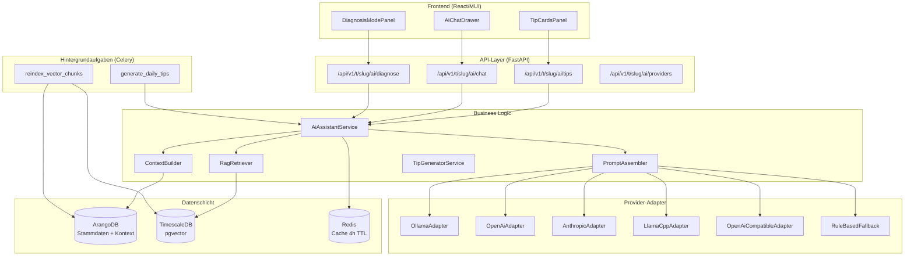

# KI-Architektur

Diese Seite beschreibt die technische Architektur des KI-Assistenten (REQ-031). Die Implementierung folgt dem Adapter-Pattern aus REQ-011 und integriert sich in die bestehende 5-Schicht-Architektur.

---

## Systemarchitektur



---

## IAiProvider — Adapter-Interface

Alle KI-Provider implementieren das `IAiProvider`-Interface. Neue Provider können hinzugefügt werden, ohne bestehenden Code zu ändern (Open/Closed Principle, analog zum `ExternalSourceAdapter` in REQ-011).

```python
# app/domain/interfaces/ai_provider.py

class IAiProvider(ABC):
    """Abstraktes Interface für KI-Provider-Adapter.

    Implementierungen: OllamaAdapter, OpenAiAdapter,
    AnthropicAdapter, LlamaCppAdapter, OpenAiCompatibleAdapter,
    RuleBasedFallback.
    """

    @abstractmethod
    async def chat(
        self,
        messages: list[ChatMessage],
        *,
        max_tokens: int = 1024,
        temperature: float = 0.3,
    ) -> AiResponse:
        """Vollständige Antwort (für Tipp-Karten)."""
        ...

    @abstractmethod
    async def chat_stream(
        self,
        messages: list[ChatMessage],
        *,
        max_tokens: int = 1024,
        temperature: float = 0.3,
    ) -> AsyncIterator[str]:
        """Token-für-Token-Streaming (für Chat, SSE)."""
        ...

    @abstractmethod
    async def health_check(self) -> bool:
        """Erreichbarkeit und Funktionsfähigkeit prüfen."""
        ...
```

### Provider-Registrierung

Provider werden über eine Registry aufgelöst, analog zum `AdapterRegistry`-Pattern in REQ-011:

```python
# app/data_access/ai_providers/registry.py

class AiProviderRegistry:
    _providers: dict[str, type[IAiProvider]] = {}

    @classmethod
    def register(cls, provider_type: str):
        """Dekorator zur Provider-Registrierung."""
        def decorator(klass):
            cls._providers[provider_type] = klass
            return klass
        return decorator

    @classmethod
    def resolve(cls, config: AiProviderConfig) -> IAiProvider:
        """Liefert eine initialisierte Provider-Instanz."""
        klass = cls._providers.get(config.provider_type)
        if klass is None:
            raise ValueError(f"Unknown provider type: {config.provider_type}")
        return klass(config)
```

---

## RAG-Pipeline

### Embedding-Modell

- **Modell:** `sentence-transformers/all-MiniLM-L6-v2`
- **Dimensionen:** 384
- **Modellgröße:** ~23 MB
- **Betrieb:** Lokal, kein API-Key, kein externer Dienst

Das Embedding-Modell läuft als Python-Prozess im Backend-Container. Es erzeugt Vektoren für:
- Neue oder aktualisierte Stammdaten-Dokumente (Celery-Task `reindex_vector_chunks`)
- Eingehende Nutzer-Anfragen zur Ähnlichkeitssuche

### Vektorspeicher (pgvector auf TimescaleDB)

```sql
CREATE TABLE ai_vector_chunks (
    id UUID PRIMARY KEY DEFAULT gen_random_uuid(),
    source_type VARCHAR(64) NOT NULL,
    -- 'species' | 'cultivar' | 'growth_phase' | 'care_rule' | 'pest' | 'disease'
    source_key VARCHAR(128) NOT NULL,
    chunk_index INT NOT NULL DEFAULT 0,
    chunk_text TEXT NOT NULL,
    embedding vector(384) NOT NULL,
    metadata JSONB DEFAULT '{}',
    created_at TIMESTAMPTZ NOT NULL DEFAULT now(),
    updated_at TIMESTAMPTZ NOT NULL DEFAULT now()
);

-- IVFFlat-Index für Cosine-Similarity-Suche
CREATE INDEX idx_ai_vector_chunks_embedding
    ON ai_vector_chunks USING ivfflat (embedding vector_cosine_ops)
    WITH (lists = 100);
```

TimescaleDB wurde als Vektorspeicher gewählt, da es bereits im Stack vorhanden ist (kein zusätzlicher Dienst wie Qdrant oder Chroma).

### Chunk-Konfiguration

| Parameter | Wert | Begründung |
|-----------|------|-----------|
| Chunk-Größe | 512 Tokens | Optimum aus Präzision und Kontext |
| Chunk-Overlap | 64 Tokens | Verhindert Informationsverlust an Grenzen |
| Top-K Retrieval | 5 Chunks | Balance aus Kontext und Prompt-Länge |
| Similarity-Schwelle | 0,65 | Cosine-Distanz; filtert irrelevante Chunks |

### Retrieval-Strategie

```python
# app/domain/engines/rag_retriever.py

class RagRetriever:
    async def retrieve(
        self,
        query: str,
        *,
        top_k: int = 5,
        source_type_filter: list[str] | None = None,
        metadata_filter: dict | None = None,
    ) -> list[RagChunk]:
        """Cosine-Ähnlichkeitssuche auf ai_vector_chunks.

        Args:
            query: Nutzer-Anfrage oder Kontext-Beschreibung.
            top_k: Anzahl zurückgegebener Chunks.
            source_type_filter: Optionale Einschränkung auf bestimmte
                Quelltypen (z.B. ['pest', 'disease'] für Diagnose).
            metadata_filter: Optionaler JSONB-Filter (z.B. Phase).
        """
        query_embedding = self._embed(query)
        # pgvector Cosine-Similarity: <=>
        # (1 - cosine_distance) >= similarity_threshold
        ...
```

---

## Context-Builder

Der ContextBuilder holt zur Laufzeit den aktuellen Zustand einer Pflanze oder eines Pflanzdurchlaufs aus ArangoDB und formatiert ihn als strukturierten Text für den System-Prompt.

```python
# app/domain/engines/ai_context_builder.py

class AiContextBuilder:
    async def build_plant_context(
        self,
        tenant_key: str,
        context_key: str,
        context_type: str,
    ) -> PlantContext:
        """Holt und formatiert den Pflanzen-Kontext.

        Returns:
            PlantContext mit: Pflanzenart, Sorte, aktuelle Phase,
            Phase-Tag, EC/pH/VPD (letzte Messung), aktive IPM-Events,
            letzte 3 Dünge-Ereignisse, Substrat-Typ.
        """
        ...
```

**Geholte Daten (AQL-Traversal):**

- `planting_runs` → aktuelle `growth_phase` → Ziel-EC, -pH, -VPD
- `plant_instances` → `cultivar` → `species` → Pflegeprofile
- `observation_readings` (TimescaleDB) → letzte Messwerte
- `ipm_inspections` → aktive Befälle und laufende Behandlungen
- `feeding_events` → letzte 3 Ereignisse mit Produkten und Mengen

---

## Prompt-Assembler

Der PromptAssembler kombiniert alle Informationen zu einem strukturierten System-Prompt:

```
[System-Rolle]
Du bist ein Pflanzenberatungs-Assistent für Kamerplanter. Du antwortest
ausschließlich auf Basis der bereitgestellten Kontext-Informationen.

[Aktueller Pflanzen-Kontext]
Art: Cannabis sativa | Sorte: Northern Lights
Phase: Flowering (Tag 21/56) | Substrat: Coco
EC-Ziel: 1.4–1.8 mS/cm | EC-Ist: 1.2 mS/cm
pH-Ziel: 5.8–6.2 | pH-Ist: 5.8
VPD-Ziel: 0.8–1.2 kPa | VPD-Ist: 1.1 kPa

[Wissensbasis-Chunks]
[Chunk 1 — species]: Cannabis sativa Flowering NPK-Profil...
[Chunk 2 — care_rule/diagnostik/naehrstoffmangel-symptome#mangel-stickstoff]:
  Stickstoff-Mangel: untere Blätter gelb...
[Chunk 3 — care_rule/phasen/bluete-management]:
  N-Bedarf sinkt ab Woche 3 der Blüte...

[Erfahrungsstufe des Nutzers]
intermediate — Technische Details zeigen, keine Code-Beispiele.

[Chat-Verlauf]
(letzte 5 Nachrichten)

[Nutzer-Anfrage]
Meine unteren Blätter werden gelb — was kann das sein?
```

### Prompt-Längen nach Feature

| Feature | Tokens Input | Tokens Output |
|---------|-------------|--------------|
| Tipp-Karten (JSON) | ~800 | ~200 |
| Chat-Einzelfrage | ~1.500 | ~300 |
| Chat mit 10 Nachrichten Verlauf | ~3.000 | ~400 |
| Diagnose-Anfrage | ~2.000 | ~500 |

---

## Caching-Strategie

### Redis (Hot-Cache)

Tipp-Karten werden in Redis mit 4 Stunden TTL gecacht. Cache-Key-Schema:

```
ai:tips:{tenant_key}:{context_type}:{context_key}
```

### Celery Batch-Task

Der tägliche Celery-Task `generate_daily_tips` (06:00 UTC) generiert Tipp-Karten für alle aktiven Pflanzdurchläufe im Hintergrund und schreibt sie in Redis und ArangoDB (`ai_tip_cache`-Collection).

```python
# app/tasks/ai_tasks.py

@celery_app.task(name="generate_daily_tips")
def generate_daily_tips():
    """Generiert Tipp-Karten für alle aktiven Pflanzdurchläufe.

    Läuft täglich um 06:00 UTC. Verarbeitet Runs sequentiell
    bei CPU-only Inference (max_concurrent_tips=1, konfigurierbar).
    """
    ...
```

### Cache-Invalidierung

Tipp-Karten werden sofort neu generiert bei:
- Phasenwechsel (`phase_transition`-Event)
- EC/pH außerhalb Toleranzband (±10 % vom Zielwert)
- Neuem IPM-Ereignis

---

## Consent-Middleware

Cloud-Provider (OpenAI, Anthropic) erfordern eine explizite DSGVO-Einwilligung (REQ-025). Die Consent-Middleware prüft vor jeder Anfrage, ob die Einwilligung vorliegt.

```python
# app/common/dependencies.py

async def require_ai_consent(
    provider_config: AiProviderConfig,
    current_user: User,
    consent_service: ConsentService,
) -> None:
    """Prüft DSGVO-Einwilligung für Cloud-AI-Provider.

    Raises:
        ConsentRequiredError: Wenn provider.requires_consent == True
            und keine gültige Einwilligung vorliegt.
    """
    if provider_config.requires_consent:
        consent = await consent_service.get_consent(
            user_key=current_user.key,
            purpose="ai_cloud_processing",
        )
        if not consent or not consent.is_valid:
            raise ConsentRequiredError(
                "Cloud-AI-Provider erfordert DSGVO-Einwilligung.",
                consent_purpose="ai_cloud_processing",
            )
```

Lokale Provider (`ollama`, `llamacpp`) haben `requires_consent: false` und benötigen keine Einwilligung.

---

## Eval-Framework

Die Antwortqualität wird automatisch evaluiert:

| Methode | Beschreibung |
|---------|-------------|
| **Topic-Match** | Sind die RAG-Chunks semantisch relevant für die Anfrage? (Cosine-Score > 0,70) |
| **LLM-as-Judge** | Ein zweites Modell bewertet Faktentreue und Handlungsrelevanz (1–5 Punkte) |
| **Benchmark-Suite** | 100 vordefinierte Fragen mit Referenzantworten; Regressionstest bei Modelländerungen |
| **A/B-Vergleich** | Bei neuen Modellen oder Guide-Versionen: automatischer Vergleich gegen Baseline |

---

## Datenmodell-Übersicht

### ArangoDB Collections

| Collection | Beschreibung | Retention |
|------------|-------------|-----------|
| `ai_provider_configs` | Provider-Konfigurationen pro Tenant | Dauerhaft |
| `ai_conversations` | Chat-Verläufe mit Nachrichtenhistorie | 90 Tage |
| `ai_tip_cache` | Gecachte Tipp-Karten | 7 Tage |

### TimescaleDB Tabellen

| Tabelle | Beschreibung |
|---------|-------------|
| `ai_vector_chunks` | Vektor-Index (384-dim, all-MiniLM-L6-v2) für RAG |

### Edge Collections (ArangoDB)

| Collection | Von → Nach | Zweck |
|------------|-----------|-------|
| `ai_tip_references_plant` | `ai_tip_cache` → `plant_instances` | Zuordnung Tip zu Pflanze |
| `ai_tip_references_run` | `ai_tip_cache` → `planting_runs` | Zuordnung Tip zu Durchlauf |
| `ai_conversation_about` | `ai_conversations` → `plant_instances / planting_runs` | Konversationskontext |

---

## Deployment-Konfiguration (Helm)

```yaml
# helm/kamerplanter/values.yaml — KI-Konfiguration

ollama:
  enabled: true          # Ollama als Sidecar oder eigener Pod
  controllers:
    main:
      containers:
        main:
          env:
            OLLAMA_MODELS: /models
            OLLAMA_NUM_PARALLEL: "1"
            OLLAMA_MAX_LOADED_MODELS: "1"
          resources:
            requests:
              cpu: 500m
              memory: 2Gi
            limits:
              cpu: "4"
              memory: 6Gi   # Für gemma3:4b Q4_K_M

backend:
  env:
    AI_DEFAULT_PROVIDER: ollama           # ollama | openai | anthropic | none
    AI_OLLAMA_BASE_URL: http://ollama:11434
    AI_OLLAMA_MODEL: gemma3:4b
    AI_TIP_CACHE_TTL_HOURS: "4"
    AI_MAX_CONCURRENT_TIPS: "5"           # 1 für CPU-only
    AI_EMBEDDING_MODEL: sentence-transformers/all-MiniLM-L6-v2
    AI_RAG_TOP_K: "5"
    AI_CONVERSATION_RETENTION_DAYS: "90"
```

---

## Referenzen

- [REQ-031 — KI-Assistent & Pflanzenberatung](../../../spec/req/REQ-031_KI-Assistent-Pflanzenberatung.md)
- [REQ-011 — Externe Stammdatenanreicherung (Adapter-Pattern)](../../../spec/req/REQ-011_Externe-Stammdatenanreicherung.md)
- [REQ-025 — Datenschutz & DSGVO](../../../spec/req/REQ-025_Datenschutz.md)
- [RAG-Wissensbasis verstehen](../guides/rag-knowledge-base.md)
- [KI-Assistent verwenden](../user-guide/ai-assistant.md)
- [pgvector Dokumentation](https://github.com/pgvector/pgvector)
- [sentence-transformers/all-MiniLM-L6-v2](https://huggingface.co/sentence-transformers/all-MiniLM-L6-v2)
