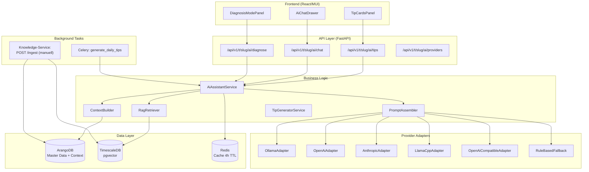
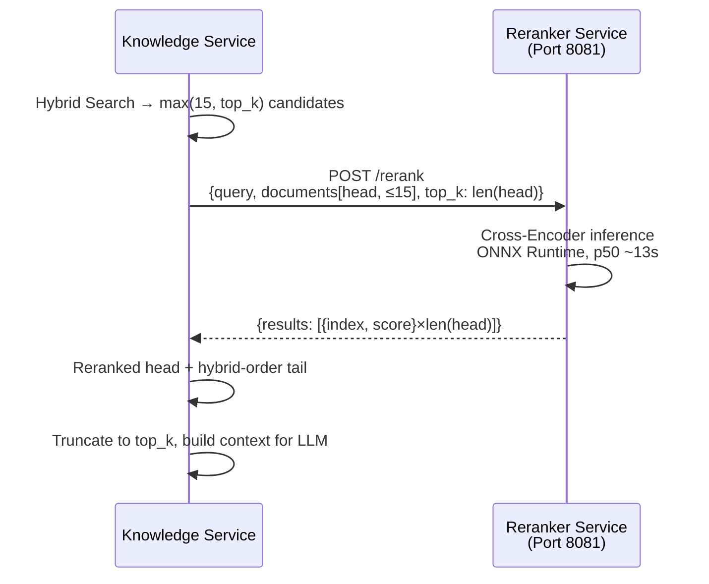
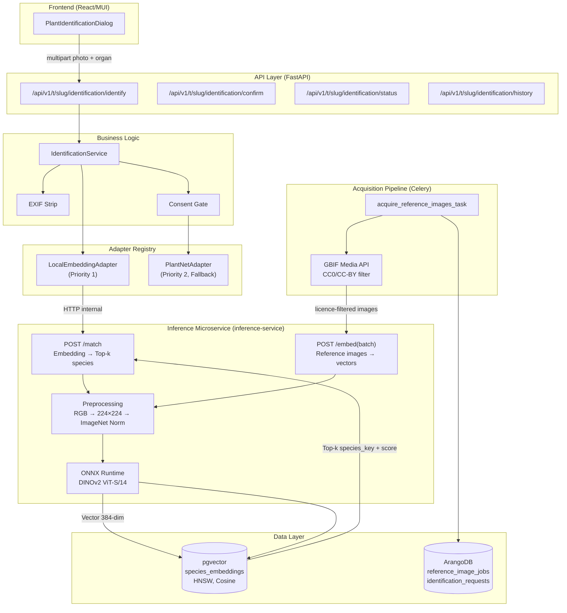

# KI-Architektur

Diese Seite beschreibt die technische Architektur des KI-Assistenten (REQ-031). Die Implementierung folgt dem Adapter-Pattern aus REQ-011 und integriert sich in die bestehende 5-Schicht-Architektur.

---

## Systemarchitektur

<!-- diagram-source: user-described — AI assistant system architecture across Frontend, API, Business Logic, Provider Adapters, Data Layer, and Celery background tasks -->

```mermaid
flowchart TB
    subgraph "Frontend (React/MUI)"
        TC[TipCardsPanel]
        CD[AiChatDrawer]
        DM[DiagnosisModePanel]
    end

    subgraph "API Layer (FastAPI)"
        AR["/api/v1/t/slug/ai/tips"]
        AC["/api/v1/t/slug/ai/chat"]
        AD["/api/v1/t/slug/ai/diagnose"]
        APC["/api/v1/t/slug/ai/providers"]
    end

    subgraph "Business Logic"
        AAS[AiAssistantService]
        CB[ContextBuilder]
        RR[RagRetriever]
        PA[PromptAssembler]
        TG[TipGeneratorService]
    end

    subgraph "Provider Adapters"
        OA[OllamaAdapter]
        OAI[OpenAiAdapter]
        ANT[AnthropicAdapter]
        LC[LlamaCppAdapter]
        OC[OpenAiCompatibleAdapter]
        FB[RuleBasedFallback]
    end

    subgraph "Data Layer"
        ARD[(ArangoDB<br/>Master Data + Context)]
        TS[(TimescaleDB<br/>pgvector)]
        RD[(Redis<br/>Cache 4h TTL)]
    end

    subgraph "Background Tasks"
        GDT[Celery: generate_daily_tips]
        RVC["Knowledge-Service:<br/>POST /ingest (manuell)"]
    end

    TC --> AR
    CD --> AC
    DM --> AD

    AR --> AAS
    AC --> AAS
    AD --> AAS

    AAS --> CB
    AAS --> RR
    AAS --> PA

    CB --> ARD
    RR --> TS
    PA --> OA
    PA --> OAI
    PA --> ANT
    PA --> LC
    PA --> OC
    PA --> FB

    AAS --> RD

    GDT --> AAS
    RVC --> TS
    RVC --> ARD
```

---

## IAiProvider — Adapter-Interface

Alle KI-Provider implementieren das `IAiProvider`-Interface. Neue Provider können hinzugefügt werden, ohne bestehenden Code zu ändern (Open/Closed Principle, analog zum `ExternalSourceAdapter` in REQ-011).

```python
# app/domain/interfaces/ai_provider.py

class IAiProvider(ABC):
    """Abstraktes Interface für KI-Provider-Adapter.

    Implementierungen: OllamaAdapter, OpenAiAdapter,
    AnthropicAdapter, LlamaCppAdapter, OpenAiCompatibleAdapter,
    RuleBasedFallback.
    """

    @abstractmethod
    async def chat(
        self,
        messages: list[ChatMessage],
        *,
        max_tokens: int = 1024,
        temperature: float = 0.3,
    ) -> AiResponse:
        """Vollständige Antwort (für Tipp-Karten)."""
        ...

    @abstractmethod
    async def chat_stream(
        self,
        messages: list[ChatMessage],
        *,
        max_tokens: int = 1024,
        temperature: float = 0.3,
    ) -> AsyncIterator[str]:
        """Token-für-Token-Streaming (für Chat, SSE)."""
        ...

    @abstractmethod
    async def health_check(self) -> bool:
        """Erreichbarkeit und Funktionsfähigkeit prüfen."""
        ...
```

### Provider-Registrierung

Provider werden über eine Registry aufgelöst, analog zum `AdapterRegistry`-Pattern in REQ-011:

```python
# app/data_access/ai_providers/registry.py

class AiProviderRegistry:
    _providers: dict[str, type[IAiProvider]] = {}

    @classmethod
    def register(cls, provider_type: str):
        """Dekorator zur Provider-Registrierung."""
        def decorator(klass):
            cls._providers[provider_type] = klass
            return klass
        return decorator

    @classmethod
    def resolve(cls, config: AiProviderConfig) -> IAiProvider:
        """Liefert eine initialisierte Provider-Instanz."""
        klass = cls._providers.get(config.provider_type)
        if klass is None:
            raise ValueError(f"Unknown provider type: {config.provider_type}")
        return klass(config)
```

---

## RAG-Pipeline (Retrieval-Augmented Generation)

### Embedding-Modell

- **Modell:** `multilingual-e5-large` (siehe [ADR-006](../adr/006-embedding-modell-e5-base-hybrid-search.md))
- **Dimensionen:** 1024
- **Betrieb:** Eigenständiger `embedding-service` (ONNX Runtime — Open Neural Network Exchange), kein API-Key, kein externer Dienst

Der Embedding-Service läuft als eigenständiger Microservice, den der Knowledge-Service über HTTP anspricht. Er erzeugt Vektoren für:
- Knowledge-YAML-Chunks beim Reindex (`POST /ingest` am Knowledge-Service)
- Eingehende Nutzer-Anfragen zur Ähnlichkeitssuche

!!! note "Modellwahl"
    ADR-006 hat ursprünglich `multilingual-e5-base` (768 Dimensionen) eingeführt; die Konfiguration wurde seither auf die größere `multilingual-e5-large`-Variante (1024 Dimensionen) angehoben. Das Präfix-Schema (`"query: "`/`"passage: "`) aus ADR-006 gilt unverändert.

!!! note "Modell-Pinning und Integritätsprüfung (seit 2026-09-24)"
    Alle vier auslieferbaren Modelle (`multilingual-e5-small`, `-base`, `-large` sowie das MiniLM-Modell) sind im Docker-Build auf eine feste Commit-Revision gepinnt; jede übernommene Datei wird zusätzlich per sha256-Prüfsumme verifiziert, bevor sie ins Image gelangt. Gemessen gegen das vorherige, ungepinnte Image: alle Dateien bit-identisch, erzeugte Embeddings identisch. Das MiniLM-Modell stammt aus einem Drittanbieter-Export (`Xenova/paraphrase-multilingual-MiniLM-L12-v2`), nicht aus dem Original-Repository der Modell-Autoren. Zur Laufzeit läuft der Service mit `HF_HUB_OFFLINE=1` und lädt daher nie unbemerkt ein Modell nach. Ebenfalls seit diesem Datum behoben: `--target e5-small` beantwortete zuvor jede `/embed`-Anfrage mit einem Fehler, weil dessen ONNX-Graph ein Eingabefeld (`token_type_ids`) erwartet, das der Tokenizer nicht liefert — die Eingabe wird jetzt aus den vom Graph deklarierten Feldern gebaut.

### Anfragelimits und Threading (Embedding-Service)

`POST /embed` begrenzt Anfragen und antwortet bei Überschreitung mit HTTP 422 (Validierungsfehler):

| Feld | Limit |
|------|-------|
| `texts` (Anzahl) | höchstens 64 |
| `texts[i]` (Zeichen je Text) | höchstens 16.384 |
| `prefix` (Zeichen) | höchstens 64 |
| `model` (Zeichen) | höchstens 128 |

Eine leere `texts`-Liste ist gültig und liefert HTTP 200 mit einer leeren Embedding-Liste. Der Knowledge-Service selbst sendet Embedding-Anfragen in Abschnitten von höchstens 16 Texten und bleibt damit unter dem Limit.

Vor der Validierung schützt eine ASGI-Middleware vor übergroßen Anfragen: ein Body über 12.650.752 Bytes (~12,7 MB, aus den obigen Limits abgeleitet) wird mit HTTP 413 abgelehnt, bevor er überhaupt geparst wird. Ein 422-Validierungsfehler enthält nur noch `loc`, `type` und `msg` je Fehler — die fehlerhafte Eingabe selbst wird nicht mehr gespiegelt. Da alle Anfragen dieselbe Inferenz-Sperre teilen, wartet eine Anfrage höchstens 60 Sekunden auf die Sperre (danach HTTP 503 `{"status": "busy"}` mit `Retry-After: 60`) und wird nach insgesamt höchstens 110 Sekunden abgebrochen (HTTP 503 `{"status": "timeout"}`). `/health` und `/ready` teilen die Sperre nicht und bleiben auch unter Last erreichbar.

Die Anzahl der Inferenz-Threads (`intra_op_num_threads`) richtet sich nach dem CPU-Kontingent des Containers (cgroup-Quota bzw. CPU-Affinität), nicht nach der Kernzahl des Host-Systems — sonst plant die ONNX-Runtime mehr Threads ein, als der Container tatsächlich nutzen darf, und der Kernel drosselt sie. Der Service verarbeitet je Anfrage einen Text nach dem anderen unter einer prozessweiten Sperre statt alle Texte in einem gepolsterten Batch; gemessen: identische Embeddings bei niedrigerem Speicherbedarf.

### Vektorspeicher (dedizierte PostgreSQL + pgvector-Instanz)

Die Vektoren liegen **nicht** in TimescaleDB, sondern in einer eigenen PostgreSQL-Instanz mit der `pgvector`-Extension (Datenbank `kamerplanter_vectors`, eigener Container/Pod `vectordb`). Das hält die Vektorsuche von der Sensor-Zeitreihen-Last auf TimescaleDB getrennt.

```sql
CREATE TABLE ai_vector_chunks (
    id UUID PRIMARY KEY DEFAULT gen_random_uuid(),
    source_type VARCHAR(64) NOT NULL,
    -- 'care_rule' (aktuell einziger Quelltyp aus den RAG-Guide-YAMLs)
    source_key VARCHAR(128) NOT NULL,
    title TEXT NOT NULL,
    content TEXT NOT NULL,
    embedding vector(1024) NOT NULL,
    search_text tsvector,
    metadata JSONB DEFAULT '{}',
    created_at TIMESTAMPTZ NOT NULL DEFAULT now(),
    updated_at TIMESTAMPTZ NOT NULL DEFAULT now()
);

-- HNSW-Index für Cosine-Similarity-Suche (löst IVFFlat ab, ADR-006)
CREATE INDEX idx_ai_chunks_embedding_hnsw
    ON ai_vector_chunks USING hnsw (embedding vector_cosine_ops)
    WITH (m = 16, ef_construction = 200);

-- GIN-Index für die Volltext-Komponente der Hybrid Search
CREATE INDEX idx_ai_chunks_search_text
    ON ai_vector_chunks USING gin(search_text);
```

Die Suche kombiniert Vektor-Ähnlichkeit und Volltext-Suche per Reciprocal Rank Fusion (Hybrid Search, siehe ADR-006) — reine Cosine-Similarity allein wird nicht mehr verwendet.

### Chunk-Konfiguration

| Parameter | Wert | Begründung |
|-----------|------|-----------|
| Chunk-Größe | 512 Tokens | Optimum aus Präzision und Kontext |
| Chunk-Overlap | 64 Tokens | Verhindert Informationsverlust an Grenzen |
| Top-K Retrieval | 5 Chunks | Balance aus Kontext und Prompt-Länge |
| Similarity-Schwelle | 0,65 | Cosine-Distanz; filtert irrelevante Chunks |

### Retrieval-Strategie

```python
# src/knowledge-service/app/vectordb/repository.py (vereinfacht)

class VectorChunkRepository:
    def hybrid_search(
        self,
        query: str,
        *,
        top_k: int = 5,
        source_type: str | None = None,
    ) -> list[dict]:
        """Hybrid Search: Vektor-Ähnlichkeit + Volltext-Suche, per RRF fusioniert.

        Args:
            query: Nutzer-Anfrage oder Kontext-Beschreibung (wird mit dem
                E5-Präfix "query: " eingebettet).
            top_k: Anzahl zurückgegebener Chunks.
            source_type: Optionale Einschränkung auf einen Quelltyp.
        """
        query_embedding = self._embedding.embed(query, prefix="query: ")
        # pgvector Cosine-Distanz (<=>) UND PostgreSQL Full-Text-Search
        # (tsvector/tsquery), Ranking-Fusion per Reciprocal Rank Fusion
        ...
```

---

## Re-Ranking-Stufe (Cross-Encoder)

!!! note "Optionale Komponente"
    Re-Ranking ist optional. Ohne konfigurierte `RERANKER_URL` arbeitet die Pipeline unverändert mit Hybrid-Search-only-Modus. Siehe [ADR-007](../adr/007-cross-encoder-reranking.md) für die Entscheidungsbegründung.

### Einordnung in die Pipeline

```text
Anfrage → Hybrid Search (max(RERANKER_INITIAL_K, top_k) Kandidaten) → Cross-Encoder bewertet nur die ersten RERANKER_INITIAL_K → Rest in Hybrid-Reihenfolge angehängt → oberste top_k an LLM
```

Der Re-Ranker sitzt **zwischen Retrieval und LLM-Generation**. Die Hybrid-Search liefert bewusst mehr Kandidaten, als letztlich neu bewertet werden (Over-Retrieval-Strategie): `max(RERANKER_INITIAL_K, top_k)` Kandidaten werden abgerufen. Von diesen werden nur die ersten `RERANKER_INITIAL_K` (Default 15) durch den Cross-Encoder nach semantischer Relevanz neu sortiert — mehr passt nicht in das Zeitbudget des Sidecars (siehe unten). Fragt ein Aufrufer mehr Ergebnisse an, als bewertet wurden — etwa der MCP-Endpunkt mit bis zu 20 oder `/search` mit bis zu 50 —, werden die restlichen Kandidaten unverändert in ihrer Hybrid-Reihenfolge angehängt. Diese Bewertungs-Obergrenze bestimmt also **nie**, wie viele Ergebnisse ein Aufrufer erhält, sondern nur, wie viele Kandidaten durch den Cross-Encoder laufen. Jeder bewertete Kandidat wird für den Cross-Encoder-Aufruf zusätzlich auf `RERANKER_MAX_DOCUMENT_CHARS` Zeichen gekürzt (Default 500, angewendet auf `titel\ninhalt`); der Chunk, der anschließend an den LLM-Kontext übergeben wird, behält seinen vollständigen Text — nur die Reranker-Eingabe wird verkürzt.

### Warum Cross-Encoder?

Bi-Encoder (E5-base) und BM25 ranken unabhängig voneinander. Keyword-reiche Chunks erhalten einen hohen BM25-Score, auch wenn sie semantisch nicht zur Anfrage passen. Der Cross-Encoder bewertet jedes Query-Chunk-Paar gemeinsam und erzeugt präzisere Relevanz-Scores. Das reduziert die dominierende Fehlerklasse **GENERATION_MISS** (LLM halluziniert wegen irrelevantem Kontext).

### Separater Microservice (ONNX Runtime)

Der Re-Ranker läuft als eigenständiger `reranker-service` — analog zum Embedding-Service:

- **Kein PyTorch** im Container — nur ONNX Runtime und die `tokenizers`-Bibliothek
- **Multi-Stage Dockerfile:** Modell-Download (bereits als ONNX vorliegend, gepinnt und sha256-verifiziert) in einem gecachten Build-Stage; kein ONNX-Export mehr zur Build-Zeit (siehe Nachtrag in [ADR-007](../adr/007-cross-encoder-reranking.md)); Runtime-Image bleibt schlank
- **Port 8081**, FastAPI mit drei Endpunkten: `/rerank` (POST), `/health` (GET) und `/ready` (GET)
- **Modell:** `BAAI/bge-reranker-v2-m3` — multilingual (DE/EN), 568M Parameter, Apache-2.0-Lizenz

<!-- diagram-source: user-described — sequence of the cross-encoder re-ranking call between Knowledge Service and Reranker Service -->

```mermaid
sequenceDiagram
    participant KS as Knowledge Service
    participant RE as Reranker Service<br/>(Port 8081)

    KS->>KS: Hybrid Search → max(15, top_k) candidates
    KS->>RE: POST /rerank<br/>{query, documents[head, ≤15], top_k: len(head)}
    RE->>RE: Cross-Encoder inference<br/>ONNX Runtime, p50 ~13s
    RE-->>KS: {results: [{index, score}×len(head)]}
    KS->>KS: Reranked head + hybrid-order tail
    KS->>KS: Truncate to top_k, build context for LLM
```

### Graceful Degradation

Ist `RERANKER_URL` leer oder nicht gesetzt, gibt `RerankerEngine.available` `False` zurück. In diesem Fall wird die ursprüngliche Chunk-Liste auf `top_k` Einträge gekürzt und direkt an den LLM-Kontext übergeben. Ein Timeout oder HTTP-Fehler des Re-Ranker-Service löst denselben Fallback für den bewerteten Kopf aus: `RerankerEngine.rerank()` liefert dann den unveränderten Kopf zurück, sodass das Gesamtergebnis von `KnowledgeService.search()` vollständig der ungerankten Hybrid-Reihenfolge entspricht — mit genau einem `WARNING`-Logeintrag (`reranker_fallback`).

### Fallback-Gründe und Zeitbudget {#fallback-gruende-und-zeitbudget}

Jeder Fallback loggt strukturiert genau eine `reranker_fallback`-Warnung mit den Feldern `reason`, `status_code`, `documents`, `elapsed_s` und `error`. `reason` stammt aus einer geschlossenen Menge von Werten:

| `reason` | Auslöser |
|----------|----------|
| `deadline` | Sidecar antwortet mit HTTP 503 `{"status": "timeout"}` — das serverseitige 25-Sekunden-Zeitlimit des Re-Ranker-Service ist abgelaufen. |
| `busy` | Sidecar antwortet mit HTTP 503 `{"status": "busy"}` — die Inferenz-Sperre wurde nicht innerhalb von 10 Sekunden erlangt. |
| `loading` | Sidecar antwortet mit HTTP 503, während das Modell noch lädt. |
| `http_status` | Jede andere Nicht-2xx-Antwort, einschließlich eines 503 mit unbekanntem oder nicht parsbarem Body. |
| `client_timeout` | Der eigene 30-Sekunden-Timeout des Knowledge-Service-Clients ist abgelaufen. |
| `transport` | Verbindungs-, DNS- oder Protokollfehler auf HTTP-Ebene. |
| `malformed_response` | Eine 2xx-Antwort, deren Body kein verwertbares `results`-Feld enthält. |

Ein erfolgreicher Re-Rank loggt stattdessen `reranker_complete` mit `elapsed_s`. Betreiber können z. B. die Häufigkeit von `reason=deadline` auswerten, um zu erkennen, wie oft das Zeitlimit tatsächlich greift.

Hintergrund des `deadline`-Falls (gemessen am 2026-09-25): `bge-reranker-v2-m3` kostet am 2-CPU-Limit des Helm-Charts rund 3 Sekunden je (Query, Dokument)-Paar mit 512 Tokens. Die Chunks im Korpus haben median rund 430 Tokens. Ein realer HTTP-Test über alle 100 Benchmark-Fragen bestätigt das für den ursprünglichen Default (`RERANKER_INITIAL_K=20`, volle Dokumente bis 512 Tokens): Jede Anfrage traf die serverseitige 25-Sekunden-Deadline (503 nach rund 27 Sekunden), rechnerisch entspräche das rund 54 Sekunden Gesamtaufwand — Re-Ranking lief in der Praxis nie durch, und jede Suche wartete rund 27 Sekunden lang auf nichts.

Mit den aktuellen Standardwerten `RERANKER_INITIAL_K=15` und `RERANKER_MAX_DOCUMENT_CHARS=500` (Paar-Median 166 Tokens, maximal 222) waren im selben Test alle 100 Anfragen erfolgreich — p50 12,9 Sekunden, p90 15,0 Sekunden, maximal 16,0 Sekunden, innerhalb des 25-Sekunden-Budgets. Beide Werte erfüllen zusammen exakt die Zeichenbudget-Grenze des Reranker-Service (`RERANKER_INITIAL_K × RERANKER_MAX_DOCUMENT_CHARS ≤ 7.500`, siehe [Umgebungsvariablen](../reference/environment-variables.md)); wer einen der beiden Werte darüber hinaus erhöht, muss die Latenz vorher neu messen.

Die Kontextqualität (Anteil der von der Benchmark erwarteten Themen im zurückgegebenen Kontext, gemessen über 54 Fragen in 9 Kategorien) hängt vom angeforderten `top_k` ab: Bei `top_k=5` — etwa beim KI-Fachbegriff-Glossar — steigt sie von 0,927 ohne Re-Ranking auf 0,974 mit den neuen Standardwerten (ein ungebremstes Re-Ranking aller Kandidaten läge bei 0,982, passt aber nicht in die Deadline). Beim Chat-Standardwert `top_k=10` ist der Gewinn deutlich kleiner: 0,978 ohne Re-Ranking gegenüber 0,979 mit den neuen Standardwerten (ungebremst 0,995). Der größere Nutzen des Re-Rankings liegt also bei Aufrufern, die wenige Chunks anfordern (Glossar `top_k=5`, Diagnose-Assistent `top_k=8`) — nicht beim Chat mit `top_k=10`.

### Anfragelimits und Threading (Reranker-Service)

`POST /rerank` begrenzt Anfragen und antwortet bei Überschreitung mit HTTP 422 (Validierungsfehler):

| Feld | Limit |
|------|-------|
| `query` (Zeichen) | höchstens 4.096 |
| `documents` (Anzahl) | höchstens 100 |
| `documents[i]` (Zeichen je Dokument) | höchstens 16.384 |
| `top_k` | 1 bis 50 (Default 5, unverändert) |

Eine leere `documents`-Liste ist gültig und liefert HTTP 200 mit einer leeren Ergebnisliste. Der Knowledge-Service sendet höchstens `reranker_initial_k` (Default 15) Dokumente pro Anfrage und kürzt jedes Dokument vorher auf `reranker_max_document_chars` Zeichen (Default 500) — beides bleibt weit unter den serverseitigen Limits von 100 Dokumenten bzw. 16.384 Zeichen je Dokument.

Vor der Validierung schützt eine ASGI-Middleware vor übergroßen Anfragen: ein Body über 19.775.488 Bytes (~19,8 MB, aus den obigen Limits abgeleitet) wird mit HTTP 413 abgelehnt, bevor er überhaupt geparst wird. Ein 422-Validierungsfehler enthält nur noch `loc`, `type` und `msg` je Fehler — die fehlerhafte Eingabe selbst wird nicht mehr gespiegelt. Da alle Anfragen dieselbe Inferenz-Sperre teilen, wartet eine Anfrage höchstens 10 Sekunden auf die Sperre (danach HTTP 503 `{"status": "busy"}` mit `Retry-After: 10`) und wird nach insgesamt höchstens 25 Sekunden abgebrochen (HTTP 503 `{"status": "timeout"}`). `/health` und `/ready` teilen die Sperre nicht und bleiben auch unter Last erreichbar. Der Knowledge-Service behandelt ein HTTP 503 des Re-Rankers wie jeden anderen Fehler und fällt auf die ungerankte Chunk-Liste zurück (siehe „Graceful Degradation" oben).

Wie beim Embedding-Service richtet sich die Anzahl der Inferenz-Threads (`intra_op_num_threads`) nach dem CPU-Kontingent des Containers (cgroup-Quota bzw. CPU-Affinität), nicht nach der Kernzahl des Host-Systems. Der Service verarbeitet je Anfrage ein Query-Dokument-Paar nach dem anderen unter einer prozessweiten Sperre statt alle Paare in einem gepolsterten Batch; gemessen: identisches Ranking bei niedrigerem Speicherbedarf.

### Ressourcenbedarf

| Szenario | RAM | CPU | Latenz/Query |
|----------|-----|-----|-------------|
| Re-Ranker aktiv (Bewertung ≤15 Kandidaten, gemessen 2026-09-25) | 1,5–4 GB | bis zu 2 Kerne (Chart-Limit) | p50 ~12,9s, p90 ~15s, max ~16s |
| Re-Ranker deaktiviert | 0 | 0 | 0ms |

!!! tip "Erster Docker-Build"
    Der erste Build des `reranker-service`-Images lädt das bereits als ONNX exportierte Modell `BAAI/bge-reranker-v2-m3` von Hugging Face herunter, gepinnt auf eine feste Commit-Revision und per sha256-Prüfsumme verifiziert — ein Export via `optimum` findet nicht mehr statt (siehe [ADR-007](../adr/007-cross-encoder-reranking.md)). Die Build-Zeit hängt danach vor allem von der Downloadgeschwindigkeit ab; Folge-Builds nutzen den gecachten Layer und sind in Sekunden abgeschlossen.

!!! info "Container-Härtung (embedding-service und reranker-service)"
    Beide ONNX-Sidecars laufen im Runtime-Image ohne Paketmanager: `pip` wird beim Image-Build aus dem Basis-Image entfernt, ein `uv` erreicht die Runtime-Stage ohnehin nie; Anwendungscode, Python-Umgebung und Modell-Dateien gehören `root` und sind für die Service-UID (1000) nur lesbar. Im Entwicklungs-Chart (`values-dev-ki.yaml`) laufen beide Container mit `readOnlyRootFilesystem: true`, `allowPrivilegeEscalation: false`, vollständig entzogenen Linux-Capabilities und `seccompProfile: RuntimeDefault`; ein memory-backed `/tmp`-emptyDir steht für Bibliotheken bereit, die zwingend eine Scratch-Datei brauchen. `docker-compose.yml` startet den Reranker-Service in derselben Form — schreibgeschützt, als UID 1000, ohne Capabilities, mit einem `/tmp`-tmpfs — und bindet dessen (nicht authentifizierten) Port nur an `127.0.0.1`, nicht an alle Netzwerkschnittstellen des Hosts.

---

## Context-Builder

Der ContextBuilder holt zur Laufzeit den aktuellen Zustand einer Pflanze oder eines Pflanzdurchlaufs aus ArangoDB und formatiert ihn als strukturierten Text für den System-Prompt.

```python
# app/domain/engines/ai_context_builder.py

class AiContextBuilder:
    async def build_plant_context(
        self,
        tenant_key: str,
        context_key: str,
        context_type: str,
    ) -> PlantContext:
        """Holt und formatiert den Pflanzen-Kontext.

        Returns:
            PlantContext mit: Pflanzenart, Sorte, aktuelle Phase,
            Phase-Tag, EC/pH/VPD (letzte Messung), aktive IPM-Events,
            letzte 3 Dünge-Ereignisse, Substrat-Typ.
        """
        ...
```

**Geholte Daten (AQL-Traversal):**

- `planting_runs` → aktuelle `growth_phase` → Ziel-EC, -pH, -VPD
- `plant_instances` → `cultivar` → `species` → Pflegeprofile
- `observation_readings` (TimescaleDB) → letzte Messwerte
- `ipm_inspections` → aktive Befälle und laufende Behandlungen
- `feeding_events` → letzte 3 Ereignisse mit Produkten und Mengen

---

## Prompt-Assembler

Der PromptAssembler kombiniert alle Informationen zu einem strukturierten System-Prompt:

```text
[System-Rolle]
Du bist ein Pflanzenberatungs-Assistent für Kamerplanter. Du antwortest
ausschließlich auf Basis der bereitgestellten Kontext-Informationen.

[Aktueller Pflanzen-Kontext]
Art: Cannabis sativa | Sorte: Northern Lights
Phase: Flowering (Tag 21/56) | Substrat: Coco
EC-Ziel: 1.4–1.8 mS/cm | EC-Ist: 1.2 mS/cm
pH-Ziel: 5.8–6.2 | pH-Ist: 5.8
VPD-Ziel: 0.8–1.2 kPa | VPD-Ist: 1.1 kPa

[Wissensbasis-Chunks]
[Chunk 1 — species]: Cannabis sativa Flowering NPK-Profil...
[Chunk 2 — care_rule/diagnostik/naehrstoffmangel-symptome#mangel-stickstoff]:
  Stickstoff-Mangel: untere Blätter gelb...
[Chunk 3 — care_rule/phasen/bluete-management]:
  N-Bedarf sinkt ab Woche 3 der Blüte...

[Erfahrungsstufe des Nutzers]
intermediate — Technische Details zeigen, keine Code-Beispiele.

[Chat-Verlauf]
(letzte 5 Nachrichten)

[Nutzer-Anfrage]
Meine unteren Blätter werden gelb — was kann das sein?
```

### Prompt-Längen nach Feature

| Feature | Tokens Input | Tokens Output |
|---------|-------------|--------------|
| Tipp-Karten (JSON) | ~800 | ~200 |
| Chat-Einzelfrage | ~1.500 | ~300 |
| Chat mit 10 Nachrichten Verlauf | ~3.000 | ~400 |
| Diagnose-Anfrage | ~2.000 | ~500 |

---

## Caching-Strategie

### Redis (Hot-Cache)

Tipp-Karten werden in Redis mit 4 Stunden TTL gecacht. Cache-Key-Schema:

```text
ai:tips:{tenant_key}:{context_type}:{context_key}
```

### Celery Batch-Task

Der tägliche Celery-Task `generate_daily_tips` (06:00 UTC) generiert Tipp-Karten für alle aktiven Pflanzdurchläufe im Hintergrund und schreibt sie in Redis und ArangoDB (`ai_tip_cache`-Collection).

```python
# app/tasks/ai_tasks.py

@celery_app.task(name="generate_daily_tips")
def generate_daily_tips():
    """Generiert Tipp-Karten für alle aktiven Pflanzdurchläufe.

    Läuft täglich um 06:00 UTC. Verarbeitet Runs sequentiell
    bei CPU-only Inference (max_concurrent_tips=1, konfigurierbar).
    """
    ...
```

### Cache-Invalidierung

Tipp-Karten werden sofort neu generiert bei:
- Phasenwechsel (`phase_transition`-Event)
- EC/pH außerhalb Toleranzband (±10 % vom Zielwert)
- Neuem IPM-Ereignis

---

## Consent-Middleware

Cloud-Provider (OpenAI, Anthropic) erfordern eine explizite DSGVO-Einwilligung (REQ-025). Die Consent-Middleware prüft vor jeder Anfrage, ob die Einwilligung vorliegt.

```python
# app/common/dependencies.py

async def require_ai_consent(
    provider_config: AiProviderConfig,
    current_user: User,
    consent_service: ConsentService,
) -> None:
    """Prüft DSGVO-Einwilligung für Cloud-AI-Provider.

    Raises:
        ConsentRequiredError: Wenn provider.requires_consent == True
            und keine gültige Einwilligung vorliegt.
    """
    if provider_config.requires_consent:
        consent = await consent_service.get_consent(
            user_key=current_user.key,
            purpose="ai_cloud_processing",
        )
        if not consent or not consent.is_valid:
            raise ConsentRequiredError(
                "Cloud-AI-Provider erfordert DSGVO-Einwilligung.",
                consent_purpose="ai_cloud_processing",
            )
```

Lokale Provider (`ollama`, `llamacpp`) haben `requires_consent: false` und benötigen keine Einwilligung.

---

## Eval-Framework

Die Antwortqualität wird automatisch evaluiert:

| Methode | Beschreibung |
|---------|-------------|
| **Topic-Match** | Sind die RAG-Chunks semantisch relevant für die Anfrage? (Cosine-Score > 0,70) |
| **LLM-as-Judge** | Ein zweites Modell bewertet Faktentreue und Handlungsrelevanz (1–5 Punkte) |
| **Benchmark-Suite** | 100 vordefinierte Fragen mit Referenzantworten; Regressionstest bei Modelländerungen |
| **A/B-Vergleich** | Bei neuen Modellen oder Guide-Versionen: automatischer Vergleich gegen Baseline |

---

## Datenmodell-Übersicht

### ArangoDB Collections

| Collection | Beschreibung | Retention |
|------------|-------------|-----------|
| `ai_provider_configs` | Provider-Konfigurationen pro Tenant | Dauerhaft |
| `ai_conversations` | Chat-Verläufe mit Nachrichtenhistorie | 90 Tage |
| `ai_tip_cache` | Gecachte Tipp-Karten | 7 Tage |

### VectorDB-Tabellen (dedizierte PostgreSQL + pgvector-Instanz)

| Tabelle | Beschreibung |
|---------|-------------|
| `ai_vector_chunks` | Vektor-Index (1024-dim, multilingual-e5-large) + `search_text`-Volltextindex für RAG Hybrid Search |

### Edge Collections (ArangoDB)

| Collection | Von → Nach | Zweck |
|------------|-----------|-------|
| `ai_tip_references_plant` | `ai_tip_cache` → `plant_instances` | Zuordnung Tipp zu Pflanze |
| `ai_tip_references_run` | `ai_tip_cache` → `planting_runs` | Zuordnung Tipp zu Durchlauf |
| `ai_conversation_about` | `ai_conversations` → `plant_instances / planting_runs` | Konversationskontext |

---

## Deployment-Konfiguration (Helm)

```yaml
# helm/kamerplanter/values.yaml — KI-Konfiguration

ollama:
  enabled: true          # Ollama als Sidecar oder eigener Pod
  controllers:
    main:
      containers:
        main:
          env:
            OLLAMA_MODELS: /models
            OLLAMA_NUM_PARALLEL: "1"
            OLLAMA_MAX_LOADED_MODELS: "1"
          resources:
            requests:
              cpu: 500m
              memory: 2Gi
            limits:
              cpu: "4"
              memory: 6Gi   # Für gemma3:4b Q4_K_M

backend:
  env:
    AI_DEFAULT_PROVIDER: ollama           # ollama | openai | anthropic | none
    AI_OLLAMA_BASE_URL: http://ollama:11434
    AI_OLLAMA_MODEL: gemma3:4b
    AI_TIP_CACHE_TTL_HOURS: "4"
    AI_MAX_CONCURRENT_TIPS: "5"           # 1 für CPU-only
    EMBEDDING_MODEL: multilingual-e5-large   # Knowledge-Service, 1024 Dimensionen
    AI_RAG_TOP_K: "5"
    AI_CONVERSATION_RETENTION_DAYS: "90"
```

---

## Bilderkennung (DINOv2) {#bilderkennung-dinov2}

Dieser Abschnitt beschreibt die Architektur der self-hosted Pflanzen-Bilderkennung (REQ-029-A). Die Bilderkennung ist eine optionale, eigenständige Komponente und beeinflusst den KI-Assistenten (RAG-Pipeline) nicht.

### Kernprinzip: Embedding-Matching statt Klassifikation

Die Erkennung basiert nicht auf einem klassischen Bildklassifikator mit fester Ausgabeklasse. Stattdessen:

1. Das Nutzerfoto wird durch das DINOv2-Modell in einen **Embedding-Vektor** (384 Dimensionen) umgerechnet.
2. Dieser Vektor wird gegen einen **Referenz-Index** (ebenfalls DINOv2-Embeddings aus kuratierten Artfotos) per Cosine-Ähnlichkeitssuche abgeglichen.
3. Die ähnlichsten Arten werden als Vorschlagsliste zurückgegeben.

Dieses Nearest-Neighbor-Matching ist **few-shot-tauglich**: Wenige Referenzbilder pro Art genügen. Neue Arten lassen sich durch Hinzufügen von Referenzbildern ohne Neutraining einbeziehen.

### Systemarchitektur

<!-- diagram-source: user-described — plant identification flow from Frontend through API and Business Logic to local/PlantNet adapters, inference microservice, and the pgvector/ArangoDB data layer plus the GBIF acquisition pipeline -->

```mermaid
flowchart TB
    subgraph "Frontend (React/MUI)"
        PID[PlantIdentificationDialog]
    end

    subgraph "API Layer (FastAPI)"
        RI["/api/v1/t/slug/identification/identify"]
        RC["/api/v1/t/slug/identification/confirm"]
        RS["/api/v1/t/slug/identification/status"]
        RH["/api/v1/t/slug/identification/history"]
    end

    subgraph "Business Logic"
        IS[IdentificationService]
        EXIF[EXIF Strip]
        CGATE[Consent Gate]
    end

    subgraph "Adapter Registry"
        LEA["LocalEmbeddingAdapter<br/>(Priority 1)"]
        PNA["PlantNetAdapter<br/>(Priority 2, Fallback)"]
    end

    subgraph "Inference Microservice (inference-service)"
        ONNX["ONNX Runtime<br/>DINOv2 ViT-S/14"]
        PRE["Preprocessing<br/>RGB → 224×224 → ImageNet Norm"]
        MATCH["POST /match<br/>Embedding → Top-k species"]
        EMBED["POST /embed(batch)<br/>Reference images → vectors"]
    end

    subgraph "Data Layer"
        PGV[("pgvector<br/>species_embeddings<br/>HNSW, Cosine")]
        ARD[("ArangoDB<br/>reference_image_jobs<br/>identification_requests")]
    end

    subgraph "Acquisition Pipeline (Celery)"
        GBIF["GBIF Media API<br/>CC0/CC-BY filter"]
        ACQ["acquire_reference_images_task"]
    end

    PID -->|"multipart photo + organ"| RI
    RI --> IS
    IS --> EXIF
    IS --> CGATE
    IS --> LEA
    CGATE --> PNA

    LEA -->|"HTTP internal"| MATCH
    MATCH --> PRE
    PRE --> ONNX
    ONNX -->|"Vector 384-dim"| PGV
    PGV -->|"Top-k species_key + score"| MATCH

    ACQ --> GBIF
    GBIF -->|"licence-filtered images"| EMBED
    EMBED --> PRE
    ONNX --> PGV
    ACQ --> ARD
```

### Adapter-Registry und Fallback-Kette

Die `IdentificationAdapterRegistry` folgt demselben Pattern wie die `ExternalSourceAdapterRegistry` aus REQ-011:

| Priorität | Adapter | Voraussetzung | Datenschutz |
|:---------:|---------|--------------|-------------|
| 1 | `LocalEmbeddingAdapter` | `INFERENCE_SERVICE_ENABLED=true`, Index befüllt | Foto verlässt Instanz nicht |
| 2 | `PlantNetAdapter` | Pl@ntNet-Key + Nutzer-Consent `plant_identification` | Foto geht an Pl@ntNet (Frankreich, EU) |

Die Fallback-Kette greift, wenn der `LocalEmbeddingAdapter` eine Konfidenz unterhalb des `CONFIDENCE_AUTO_ACCEPT`-Schwellenwerts (Standard: 0,85) liefert — oder wenn `INFERENCE_SERVICE_ENABLED=false` ist.

```python
# Pseudocode — IdentificationService.identify()
result = await local_adapter.identify(image_bytes, organ=organ)

if result.top_confidence < settings.confidence_auto_accept:
    if plantnet_adapter.available and user_has_consent("plant_identification"):
        plantnet_result = await plantnet_adapter.identify(image_bytes, organ=organ)
        result = merge_results(result, plantnet_result)
```

### Preprocessing-Contract

> **Kritisch:** Referenzbilder und Nutzerfotos müssen **exakt gleich** vorverarbeitet werden. Jede Abweichung macht das Matching unbrauchbar.

```python
# src/inference-service/app/preprocessing.py — verbindlich für Index UND Query
IMAGENET_MEAN = (0.485, 0.456, 0.406)
IMAGENET_STD  = (0.229, 0.224, 0.225)
INPUT_SIZE    = 224  # Vielfaches der DINOv2-Patch-Größe 14

# Schritte (beide Pfade):
# 1. EXIF-Strip + RGB-Konvertierung (Orientierung anwenden)
# 2. Resize: kürzere Kante auf INPUT_SIZE, dann Center-Crop INPUT_SIZE×INPUT_SIZE
# 3. /255.0, (x − MEAN) / STD
# 4. HWC → CHW, Batch-Dim, float32
```

### Modellwahl

| Variante | Parameter | Embedding-Dim | Footprint | Status |
|----------|:---------:|:-------------:|-----------|--------|
| DINOv2 ViT-S/14 | ~21 M | 384 | CPU, schnell | **MVP-Default** |
| DINOv2 ViT-B/14 | ~86 M | 768 | CPU ok, genauer | Ausbau |
| DINOv2 ViT-L/14 | ~300 M | 1024 | GPU empfohlen | Auf Anfrage |

**Verbindlich:** Ausschließlich das Apache-2.0-lizenzierte Basis-Backbone (`facebookresearch/dinov2`). PlantCLEF-Fine-tune-Gewichte (CC-BY-NC) sind explizit ausgeschlossen.

### Referenzbild-Beschaffungs-Pipeline

Die Pipeline läuft als Celery-Task (`acquire_reference_images_task`) und ist idempotent:

```text
Für jede Art (scientific_name) aus REQ-001-Stammdaten:
  1. GBIF Occurrence/Media-API → Kandidatenbilder mit Lizenzmetadaten
  2. Lizenz-Filter: NUR CC0 / CC-BY → verwerfe CC-BY-NC, CC-BY-SA, unklar
  3. Qualitäts-Kuratierung: min. 224px, Seitenverhältnis ≤ 3:1
  4. EXIF-Strip → Preprocessing-Contract → inference-service /embed/batch
  5. Embedding + Provenienz → pgvector (species_embeddings)
  6. Abdeckungs-Report → ArangoDB (reference_image_jobs)
  KEIN Originalbild wird persistiert.
```

### Konfidenz-Kalibrierung

Cosine-Ähnlichkeit ist keine Wahrscheinlichkeit. Die Umrechnung in angezeigte Konfidenzwerte (0–100 %) erfolgt über kalibrierte Schwellen, die aus der Eigen-Evaluierung an den ~210 Arten stammen:

| Einstellung | Standard | Bedeutung |
|-------------|:-------:|-----------|
| `CONFIDENCE_AUTO_ACCEPT` | 0,85 | Art direkt vorschlagen (hohes Vertrauen) |
| `CONFIDENCE_SHOW_RESULTS` | 0,10 | Minimum für Anzeige in der Liste |
| Darunter | — | "Nicht erkennbar" + Fallback anbieten |

### Datenmodell (pgvector)

```sql
-- Tabelle: species_embeddings (im kamerplanter_vectors-Schema)
CREATE TABLE species_embeddings (
    id          UUID PRIMARY KEY DEFAULT gen_random_uuid(),
    species_key VARCHAR(128) NOT NULL,      -- Fremdschlüssel zu ArangoDB species
    scientific_name VARCHAR(256) NOT NULL,
    organ       VARCHAR(64),               -- 'leaf' | 'flower' | 'fruit' | ...
    embedding   vector(384) NOT NULL,      -- DINOv2 ViT-S/14
    model       VARCHAR(64) NOT NULL,      -- 'dinov2_vits14'
    source      VARCHAR(64) NOT NULL,      -- 'gbif' | 'wikimedia'
    license     VARCHAR(64) NOT NULL,      -- 'CC0' | 'CC-BY'
    attribution TEXT,                      -- Urheber (CC-BY-Pflicht)
    source_url  TEXT,
    indexed_at  TIMESTAMPTZ NOT NULL DEFAULT now()
);

-- HNSW-Index für schnelle Cosine-Ähnlichkeitssuche
CREATE INDEX idx_species_embeddings_hnsw
    ON species_embeddings USING hnsw (embedding vector_cosine_ops);
```

### DSGVO-Konformität

| Aspekt | Maßnahme |
|--------|---------|
| Nutzerfoto nicht persistiert | Bild nur im RAM während Embedding-Berechnung |
| EXIF-Strip | Vor jeder Verarbeitung (Pillow `getexif()`) |
| Primärpfad lokal | Kein Drittland-Transfer, kein AVV nötig |
| Fallback-Consent | Pl@ntNet-Nutzung erfordert `plant_identification`-Consent (REQ-025) |
| Referenzbild-Provenienz | Quelle/Lizenz/Urheber in `species_embeddings` mitgeführt |

---

## Referenzen

- REQ-031 — KI-Assistent & Pflanzenberatung (`spec/req/REQ-031_KI-Assistent-Pflanzenberatung.md`)
- REQ-029-A — Self-Hosted Bilderkennung (`spec/req/REQ-029-A_Self-Hosted-Bilderkennung-Referenzbild-Beschaffung.md`)
- REQ-011 — Externe Stammdatenanreicherung (`spec/req/REQ-011_Externe-Stammdatenanreicherung.md`)
- REQ-025 — Datenschutz & DSGVO (`spec/req/REQ-025_Datenschutz-Betroffenenrechte.md`)
- [ADR-006 — Embedding-Modell E5-base und Hybrid Search](../adr/006-embedding-modell-e5-base-hybrid-search.md)
- [ADR-007 — Cross-Encoder Re-Ranking für RAG-Pipeline](../adr/007-cross-encoder-reranking.md)
- [RAG-Wissensbasis verstehen](../guides/rag-knowledge-base.md)
- [KI-Assistent verwenden](../user-guide/ai-assistant.md)
- [Pflanzen-Bilderkennung verwenden](../user-guide/plant-identification.md)
- [Bilderkennung in Betrieb nehmen](../deployment/inference-service.md)
- [pgvector Dokumentation](https://github.com/pgvector/pgvector)
- [BAAI/bge-reranker-v2-m3](https://huggingface.co/BAAI/bge-reranker-v2-m3)
- [intfloat/multilingual-e5-large](https://huggingface.co/intfloat/multilingual-e5-large)
- [facebookresearch/dinov2](https://github.com/facebookresearch/dinov2)
