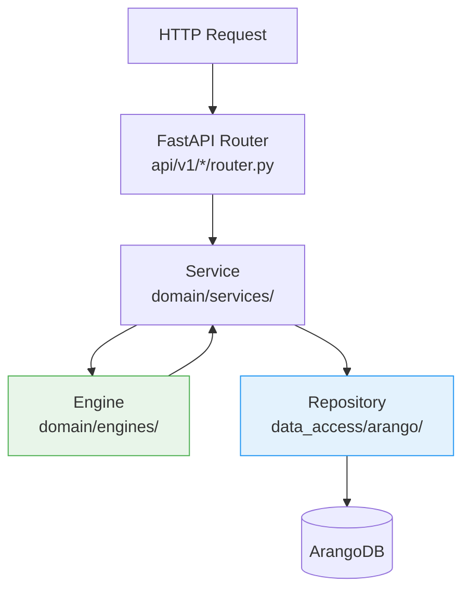

# Backend-Architektur

Das Backend ist in Python 3.14+ mit FastAPI implementiert. Es folgt einer Domain-Driven-Design-Struktur mit strikter Schichtentrennung: API-Router delegieren an Services, Services orchestrieren Engines und Repositories, Engines enthalten ausschließlich reine Domänenlogik ohne Datenbankzugriff.

---

## Verzeichnisstruktur

```
src/backend/app/
├── api/
│   └── v1/                  # FastAPI-Router (ein Paket pro Domain)
│       ├── router.py        # Root-Router, registriert alle Sub-Router
│       ├── auth/            # Login, Register, Token-Refresh
│       ├── botanical_families/
│       ├── species/
│       ├── cultivars/
│       ├── sites/
│       ├── planting_runs/
│       ├── tanks/
│       ├── fertilizers/
│       ├── nutrient_plans/
│       ├── feeding_events/
│       ├── ipm/
│       ├── harvest/
│       ├── tasks/
│       ├── calendar/
│       ├── onboarding/
│       ├── tenants/
│       └── tenant_scoped/   # Tenant-isolierte Endpunkte (/t/{slug}/...)
├── domain/
│   ├── models/              # Pydantic v2 Datenmodelle
│   ├── services/            # Orchestrierungsschicht
│   ├── engines/             # Reine Domänenlogik (keine DB-Aufrufe)
│   └── interfaces/          # Repository-ABCs + Adapter-Interfaces
├── data_access/
│   ├── arango/              # Repository-Implementierungen (python-arango)
│   └── external/            # Externe Adapter (GBIF, Perenual)
├── common/
│   ├── auth.py              # FastAPI-Depends für Auth + Tenant-Guard
│   ├── dependencies.py      # Dependency-Injection-Wiring
│   ├── exceptions.py        # Anwendungsweite Exception-Klassen
│   └── error_handlers.py    # FastAPI Exception Handler
├── config/
│   ├── settings.py          # Pydantic-Settings (Env-Variablen)
│   └── logging.py           # structlog-Konfiguration
├── migrations/              # Seed-Daten (idempotent, beim Start ausgeführt)
└── tasks/                   # Celery Background- und Beat-Tasks
```

## Schichtenmodell



**Router** nehmen HTTP-Requests entgegen, validieren Eingaben per Pydantic und delegieren sofort an den Service. Kein Domänen-Code in Routern.

**Services** orchestrieren: Sie rufen Engines für Berechnungen und Validierungen auf und Repositories für Datenbankzugriffe. Services kennen den Anwendungskontext (aktueller Nutzer, Tenant).

**Engines** implementieren reine Domänenlogik — Zustandsautomaten, Berechnungen, Validierungsregeln. Sie erhalten alle Daten als Parameter und haben keinen Datenbankzugriff. Das macht sie einfach testbar.

**Repositories** kapseln alle ArangoDB-Abfragen (AQL). Sie implementieren das Repository-Interface (ABC aus `domain/interfaces/`) und sind austauschbar.

## Wichtige Engines

| Engine | Aufgabe |
|--------|---------|
| `phase_transition_engine` | Pflanzenphasen-Zustandsautomat — prüft erlaubte Übergänge |
| `nutrient_engine` | EC-Berechnung, Mischreigenfolge (CalMag vor Sulfaten) |
| `watering_schedule_engine` | Bestimmt Gießtage anhand Wochentag-/Intervall-Modus |
| `safety_interval_engine` | Karenz-Gate: blockiert Ernte bei aktiven IPM-Behandlungen |
| `onboarding_engine` | Validiert Starter-Kit-Anwendung, erstellt Entity-Plan |
| `tank_engine` | Tank-Zustands-Management, EC/pH-Delta-Berechnung |
| `care_reminder_engine` | 9 Pflegestil-Presets, Saison-Multiplikatoren, adaptives Lernen |
| `enrichment_engine` | Automatisches Befüllen leerer Felder aus externen Quellen |
| `companion_planting_engine` | Graph-basierte Mischkultur-Empfehlung |
| `crop_rotation_validator` | 4-Jahres-Fruchtfolge-Validierung per Pflanzenfamilie |

## Celery Background-Tasks

Hintergrundaufgaben laufen in separaten Celery-Worker-Prozessen. Valkey (Redis-kompatibel) dient als Broker und Result-Backend.

```
src/backend/app/tasks/
├── auth_tasks.py          # Token-Cleanup, Session-Expiry
├── care_tasks.py          # Tägliche Pflegeerinnerungen generieren
├── dormancy_checks.py     # Ruhephase-Erkennung für Pflanzen
├── enrichment_tasks.py    # Stammdaten-Anreicherung (GBIF, Perenual)
├── phase_transitions.py   # Automatische Phasenübergänge (GDD-basiert)
├── tank_maintenance_tasks.py  # Tank-Wartungsplan-Generierung
├── tenant_tasks.py        # Einladungs-Expiry, Tenant-Cleanup
├── vernalization_updates.py   # Vernalisierungsstunden aktualisieren
└── watering_tasks.py      # Tägliche Gießaufgaben aus Gießplan
```

### Beat-Zeitplan (Auswahl)

| Task | Intervall | Aufgabe |
|------|-----------|---------|
| `generate_due_care_reminders` | täglich 06:00 | Pflegeerinnerungen erstellen |
| `watering-generate-tasks-daily` | täglich 05:00 | Gießaufgaben aus Wochenplänen |
| `auto-phase-transitions` | täglich 04:00 | GDD-basierte Phasenübergänge prüfen |
| `enrichment-sync` | wöchentlich | Stammdaten aus GBIF/Perenual aktualisieren |
| `cleanup-expired-tokens` | stündlich | Abgelaufene Refresh-Tokens löschen |

## Authentifizierung

Das Backend unterstützt zwei Auth-Provider, die über `KAMERPLANTER_MODE` ausgewählt werden:

- **`FullAuthProvider`** (Full-Modus): JWT Bearer-Token (HS256, 15 min Ablauf) + HttpOnly-Cookie für Refresh-Token (30 Tage, rotierend). Lokale Accounts mit bcrypt und federated Login via OIDC (Authlib).
- **`LightAuthProvider`** (Light-Modus): Kein Login erforderlich. Alle Requests werden automatisch dem Platform-Tenant zugeordnet.

JWT-Tokens werden mit `authlib.jose` erstellt und validiert. Rate-Limiting auf Login-Endpunkten via `slowapi`.

## Fehlerbehandlung

Alle Domänen-Exceptions erben von `KamerplanterError` und werden von einem zentralen Exception Handler in strukturierte JSON-Responses umgewandelt:

```json
{
  "error_id": "550e8400-e29b-41d4-a716-446655440000",
  "error_code": "PLANT_NOT_FOUND",
  "message": "Plant instance 'xyz' not found.",
  "details": {}
}
```

HTTP-Statuscodes folgen REST-Konventionen: 404 für nicht gefundene Ressourcen, 409 für Konflikte (z.B. doppelte Slugs), 422 für Validierungsfehler und Karenz-Verletzungen, 403 für fehlende Berechtigungen.

## Logging

Strukturiertes Logging via `structlog` im JSON-Format (Produktion) bzw. farbiger Konsolenausgabe (Entwicklung). Jeder Log-Eintrag enthält mindestens `timestamp`, `level`, `event` und relevante Kontextfelder wie `tenant_slug`, `user_key`, `request_id`.

## OpenAPI

FastAPI generiert automatisch eine OpenAPI 3.1-Spezifikation unter `/api/v1/docs` (Swagger UI) und `/api/v1/openapi.json`. Alle Schemas, Enums und Fehlertypen sind vollständig dokumentiert.

## Seed-Daten

Beim Start prüft `main.py` in der `lifespan`-Funktion, ob Basis-Daten vorhanden sind, und führt idempotente Seed-Skripte aus:

- Botanische Familien, Arten, Kultivare (YAML-Dateien unter `migrations/seed_data/`)
- 9 Starter-Kits für den Onboarding-Wizard
- Standort-Typen (Beet, Gewächshaus, Topf, ...)
- Pflanzenschutz-Aktivitäten
- Demo-Nutzer (`demo@kamerplanter.local`) bei aktiviertem Light-Modus

## Sicherheits-Header

Das Backend setzt folgende HTTP-Security-Header auf alle Responses:

| Header | Wert |
|--------|------|
| `X-Content-Type-Options` | `nosniff` |
| `X-Frame-Options` | `DENY` |
| `Referrer-Policy` | `strict-origin-when-cross-origin` |
| `Permissions-Policy` | `camera=(), microphone=(), geolocation=()` |
| `Strict-Transport-Security` | `max-age=63072000` (nur Produktion) |

## Siehe auch

- [Datenbankarchitektur](database.md)
- [Infrastruktur](infrastructure.md)
- [Architektur-Überblick](overview.md)
