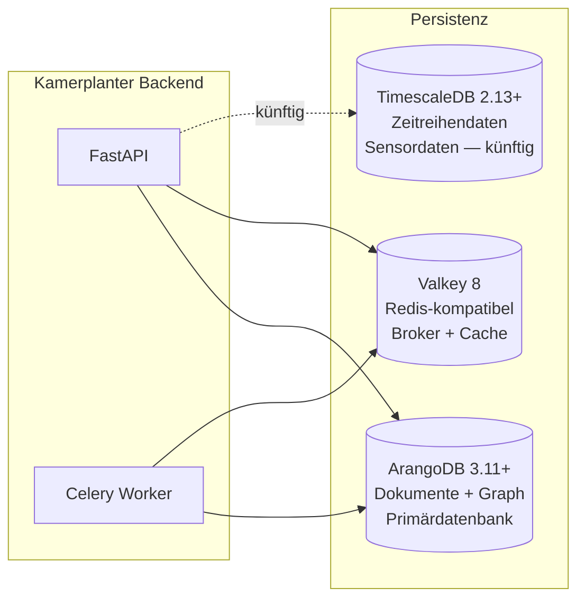
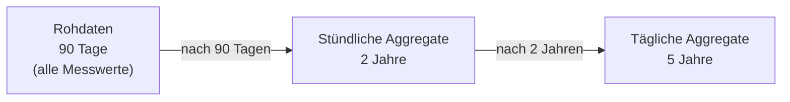

# Datenbankarchitektur

Kamerplanter nutzt polyglotte Persistenz: drei Datenbanktypen mit klar getrennten Verantwortlichkeiten. ArangoDB ist die primäre Datenbank und trägt sowohl Dokument- als auch Graph-Workloads. TimescaleDB ist für Zeitreihendaten (Sensordaten) vorgesehen und wird in einer zukünftigen Version aktiviert. Valkey (Redis-kompatibel) dient als Celery-Broker und Cache.

---

## Persistenz-Übersicht



| Datenbank | Version | Verwendung |
|-----------|---------|-----------|
| ArangoDB | 3.11+ | Stammdaten, Pflanzen, Runs, Auth, Tenants, Graph-Beziehungen |
| TimescaleDB | 2.13+ | Sensordaten mit automatischem Downsampling (künftig) |
| Valkey | 8 | Celery-Task-Broker, Session-Cache |

---

## ArangoDB — Primärdatenbank

ArangoDB ist eine Multi-Modell-Datenbank: Sie kann Dokumente (wie MongoDB) und Graph-Kanten (wie Neo4j) im selben System verwalten und mit AQL (ArangoDB Query Language) gemeinsam abfragen.

### Named Graph

Der gesamte Graph heißt `kamerplanter_graph` und enthält alle Kanten-Collections.

### Dokument-Collections

Die Datenbank enthält **44 Dokument-Collections**. Ausgewählte Collections nach Domäne:

**Stammdaten (REQ-001)**

| Collection | Inhalt |
|-----------|--------|
| `botanical_families` | Pflanzenfamilien (Solanaceae, Cucurbitaceae, ...) |
| `species` | Arten mit Wachstumsparametern, Frostempfindlichkeit, Aussaatzeiten |
| `cultivars` | Sorten mit sortenspezifischen Eigenschaften |
| `lifecycle_configs` | Lebenszyklusdefinitionen pro Kulturpflanze |
| `growth_phases` | Einzelne Wachstumsphasen (Keimung, Sämling, Vegetativ, Blüte) |

**Standorte & Infrastruktur (REQ-002, REQ-014, REQ-019)**

| Collection | Inhalt |
|-----------|--------|
| `sites` | Standorte (Gewächshaus, Gartenbeet, ...) mit Wasserquelldaten |
| `locations` | Beete, Reihen, Zonen — rekursive Hierarchie |
| `slots` | Einzelne Pflanzplätze |
| `substrates` | Substrat-Definitionen mit pH/EC-Grenzwerten |
| `tanks` | Bewässerungstanks |
| `tank_states` | Tank-Zustandssnapshots |

**Pflanzen & Durchläufe (REQ-013)**

| Collection | Inhalt |
|-----------|--------|
| `plant_instances` | Einzelpflanzen mit Phasen-State |
| `planting_runs` | Gruppenmanagement für mehrere Pflanzen gleichzeitig |
| `planting_run_entries` | Einzelpflanzen innerhalb eines Durchlaufs |
| `phase_histories` | Historische Phasenwechsel mit Timestamps |

**Düngung & Bewässerung (REQ-004)**

| Collection | Inhalt |
|-----------|--------|
| `fertilizers` | Düngemittel mit Nährstoffprofil (NPK, Ca, Mg, ...) |
| `nutrient_plans` | Nährstoffpläne mit Phaseneinträgen |
| `feeding_events` | Protokollierte Düngeereignisse |
| `watering_events` | Bewässerungsereignisse |
| `watering_logs` | Vereinheitlichtes Gießprotokoll |

**IPM / Pflanzenschutz (REQ-010)**

| Collection | Inhalt |
|-----------|--------|
| `pests` | Schädlingsdatenbank |
| `diseases` | Krankheitsdatenbank |
| `treatments` | Behandlungsmittel mit Karenzzeiten |
| `inspections` | Kontrollprotokolle |
| `treatment_applications` | Durchgeführte Behandlungen |

**Ernte (REQ-007)**

| Collection | Inhalt |
|-----------|--------|
| `harvest_batches` | Ernte-Chargen |
| `quality_assessments` | Qualitätsbewertungen |
| `yield_metrics` | Ertragsdaten |

**Authentifizierung & Mandanten (REQ-023, REQ-024)**

| Collection | Inhalt |
|-----------|--------|
| `users` | Benutzerkonten (lokal + federated) |
| `tenants` | Mandanten (Gärten, Gemeinschaftsgärten) |
| `memberships` | User-Tenant-Zuordnungen mit Rollen |
| `refresh_tokens` | Aktive Refresh-Token |
| `api_keys` | Service-Account-API-Keys |

### Kanten-Collections (Graph-Beziehungen)

Der Graph enthält **über 75 Kanten-Collections**. Die wichtigsten nach Domäne:

**Taxonomie & Genetik**

```
belongs_to_family    Species ──→ BotanicalFamily
has_cultivar         Species ──→ Cultivar
cloned_from          PlantInstance ──→ PlantInstance
```

**Mischkultur & Fruchtfolge**

```
compatible_with      Species ──→ Species      (Mischkulturpartner)
incompatible_with    Species ──→ Species      (unverträgliche Kombination)
rotation_after       Species ──→ Species      (Fruchtfolge)
adjacent_to          Location ──→ Location    (räumliche Nachbarschaft)
```

**Standort-Hierarchie**

```
contains             Location ──→ Location    (rekursive Hierarchie: Beet → Reihe → Slot)
has_slot             Location ──→ Slot
placed_in            PlantInstance ──→ Slot
grown_in             PlantingRun ──→ Location
```

**Phasen-Zustandsautomat**

```
current_phase        PlantInstance ──→ GrowthPhase
next_phase           GrowthPhase ──→ GrowthPhase
phase_history_edge   PhaseHistory ──→ PlantInstance
```

**Bewässerung & Düngung**

```
follows_plan         PlantingRun ──→ NutrientPlan
fed_by               PlantInstance ──→ FeedingEvent
watered_plant        WateringEvent ──→ PlantInstance
```

**Mandanten-Isolation**

```
belongs_to_tenant    <jede Ressource> ──→ Tenant
has_membership       Tenant ──→ Membership
membership_in        Membership ──→ User
```

### Graph-Abfrage-Beispiele

AQL ermöglicht es, Dokument- und Graph-Queries zu kombinieren:

```aql
-- Alle Begleitzpflanzen einer Art (Mischkultur)
FOR partner IN 1..1 OUTBOUND 'species/tomato' compatible_with
  RETURN partner.name

-- Genetische Herkunft einer Pflanze (Klonkette)
FOR ancestor IN 1..10 INBOUND 'plant_instances/plant-42' cloned_from
  RETURN ancestor

-- Alle Pflanzen in einem Standort-Teilbaum
FOR slot IN 1..5 OUTBOUND 'locations/greenhouse-east' contains, has_slot
  FILTER slot._id LIKE 'slots/%'
  FOR plant IN 1..1 INBOUND slot._id placed_in
    RETURN plant
```

---

## TimescaleDB — Zeitreihendaten (künftig aktiv)

TimescaleDB ist eine PostgreSQL-Erweiterung, die automatisches Partitionieren und Downsampling für Zeitreihendaten bietet. Sie ist für REQ-005 (Hybrid-Sensorik) vorgesehen, aber noch nicht aktiviert.

### Geplantes Downsampling-Schema

Sensordaten werden in drei Stufen komprimiert, um Speicherplatz zu sparen ohne Langzeittrends zu verlieren:



### Geplante Hypertabellen

| Tabelle | Granularität | Retention |
|---------|-------------|-----------|
| `sensor_readings_raw` | Einzelmesswerte | 90 Tage |
| `sensor_readings_hourly` | Stündliche Mittelwerte | 2 Jahre |
| `sensor_readings_daily` | Tägliche Mittelwerte | 5 Jahre |

---

## Valkey — Cache & Message Broker

Valkey ist ein Redis-kompatibler Key-Value-Store (Apache 2.0 Lizenz). Kamerplanter nutzt ihn als:

**Celery-Broker**: Tasks werden als Messages in Valkey enqueued. Worker holen Tasks ab und führen sie aus. Celery Beat schreibt den Zeitplan ebenfalls in Valkey.

**Session-Cache**: Kurzlebige Daten wie Login-Throttling-Zähler und OIDC-State-Parameter werden in Valkey mit TTL gespeichert.

### Verbindungskonfiguration

```
REDIS_URL=redis://kamerplanter-valkey:6379/0
```

In der Kubernetes-Umgebung läuft Valkey als eigener Deployment im selben Namespace.

---

## Datenisolierung (Multi-Tenancy)

Alle mandantengebundenen Collections enthalten ein `tenant_key`-Feld. Queries filtern immer nach `tenant_key`, sodass Daten verschiedener Mandanten niemals vermischt werden:

```aql
FOR doc IN plant_instances
  FILTER doc.tenant_key == @tenant_key
  RETURN doc
```

Globale Collections (Stammdaten wie `species`, `botanical_families`, IPM-Datenbanken) gehören keinem Tenant und sind für alle lesbar.

---

## Backup & Betrieb

ArangoDB-Daten werden über ein Kubernetes `PersistentVolumeClaim` (PVC) persistiert. Das PVC überlebt Pod-Neustarts und -Deployments.

Für Produktionsbackups empfiehlt sich `arangodump` via Kubernetes CronJob oder ein externes Backup-Tool auf PVC-Ebene (Velero, Longhorn-Snapshots).

## Siehe auch

- [Backend-Architektur](backend.md)
- [Architektur-Überblick](overview.md)
- [Infrastruktur](infrastructure.md)
