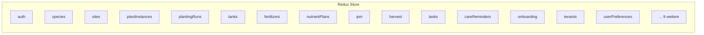

# Frontend-Architektur

Das Frontend ist eine Single-Page-Application in React 19 mit TypeScript 5.9 (strict mode). Es kommuniziert ausschließlich über REST-API mit dem Backend — keine direkte Datenbankverbindung. Die Benutzeroberfläche ist zweisprachig (Deutsch/Englisch) und unterstützt Light- und Dark-Theme.

---

## Tech Stack

| Technologie | Version | Aufgabe |
|------------|---------|---------|
| React | 19 | UI-Framework |
| TypeScript | 5.9 (strict) | Typsicherheit |
| MUI (Material UI) | 7 | Komponentenbibliothek |
| Redux Toolkit | aktuell | State Management |
| react-router-dom | v7 | Client-seitiges Routing |
| react-i18next | aktuell | Internationalisierung (DE/EN) |
| Vite | 6 | Build-Tool, Dev-Server |
| Axios | aktuell | HTTP-Client |
| Vitest | aktuell | Unit-Tests |

## Verzeichnisstruktur

```
src/frontend/src/
├── api/
│   ├── client.ts            # Axios-Instanzen (global + tenant-scoped)
│   ├── types.ts             # Gemeinsame API-Typen
│   ├── errors.ts            # ApiError-Klasse
│   └── endpoints/           # Eine Datei pro Domain (sites.ts, species.ts, ...)
├── components/
│   ├── common/              # Wiederverwendbare UI-Bausteine
│   └── layout/              # PageTitle, Breadcrumbs, Sidebar
├── config/
│   └── fieldConfigs.ts      # Deklarative Feld-Sichtbarkeit (REQ-021)
├── hooks/                   # Custom React Hooks
├── i18n/
│   └── locales/
│       ├── de/translation.json
│       └── en/translation.json
├── layouts/
│   └── Sidebar.tsx          # Navigations-Sidebar (tiered by Erfahrungsstufe)
├── pages/                   # Seiten, nach Domain gegliedert
│   ├── stammdaten/          # Botanische Familien, Arten, Kultivare
│   ├── standorte/           # Sites, Locations, Slots, Substrate, Tanks
│   ├── pflanzen/            # Pflanzeninstanzen, Wachstumsphasen
│   ├── durchlaeufe/         # Pflanzdurchläufe
│   ├── duengung/            # Dünger, Nährstoffpläne, Fütterungsereignisse
│   ├── ernte/               # Ernte-Batches
│   ├── aufgaben/            # Aufgaben, Workflows
│   ├── pflanzenschutz/      # IPM-Schädlinge, Behandlungen
│   ├── pflege/              # Pflegeerinnerungen
│   ├── kalender/            # Kalenderansicht
│   ├── giessprotokoll/      # Gießprotokoll
│   ├── onboarding/          # Onboarding-Wizard (REQ-020)
│   ├── auth/                # Login, Registrierung, Kontoeinstellungen
│   ├── admin/               # Platform-Admin
│   └── tenants/             # Mandanten-Verwaltung
├── routes/
│   ├── AppRoutes.tsx        # Route-Definitionen
│   └── breadcrumbs.ts       # Breadcrumb-Mapping
├── store/
│   ├── store.ts             # Redux-Store-Konfiguration
│   ├── hooks.ts             # useAppDispatch, useAppSelector
│   └── slices/              # Redux Slices (ein Slice pro Domain)
├── theme/                   # MUI-Theme (Farben, Typografie)
└── validation/              # Zod-Validierungsschemas
```

## State Management (Redux Toolkit)

Der Redux-Store enthält 24 Slices, je einen pro Domänenbereich:



Jeder Slice verwaltet seinen eigenen Lade-, Fehler- und Datenzustand. Async-Operationen nutzen `createAsyncThunk` mit `pending/fulfilled/rejected`-States.

## API-Clients

Es gibt zwei Axios-Instanzen:

**`client`** — für globale Endpunkte (`/api/v1/...`):
```
/api/v1/species/
/api/v1/botanical-families/
/api/v1/auth/login
```

**`tenantClient`** — für tenant-isolierte Endpunkte: Setzt automatisch `/t/{slug}` als URL-Präfix, wobei `slug` aus `localStorage` (`kp_active_tenant_slug`) gelesen wird:
```
/api/v1/t/mein-garten/sites/
/api/v1/t/mein-garten/planting-runs/
```

Beide Clients haben einen Response-Interceptor, der strukturierte `ApiError`-Objekte aus Backend-Fehlerantworten erstellt.

## Routing

react-router-dom v7 mit verschachtelten Routes. Alle Routen sind in `AppRoutes.tsx` zentralisiert. Breadcrumbs werden aus `breadcrumbs.ts` gemappt.

```
/                          → Dashboard
/stammdaten/               → Stammdaten-Übersicht
/stammdaten/species/:key   → Artdetail
/standorte/                → Standorte
/standorte/sites/:key      → Site-Detail
/pflanzen/:key             → Pflanzeninstanz-Detail
/durchlaeufe/:key          → Pflanzdurchlauf-Detail
/duengung/                 → Dünge-Übersicht
/ernte/                    → Ernte-Übersicht
/aufgaben/                 → Aufgaben
/onboarding                → Onboarding-Wizard
/settings/account          → Kontoeinstellungen (5 Tabs)
/admin/                    → Platform-Admin (nur Platform-Admins)
/t/:slug/settings          → Tenant-Einstellungen
```

## Erfahrungsstufen (REQ-021)

Die Sidebar und Formulare passen sich an die Erfahrungsstufe des Nutzers an:

- **Einsteiger**: 5 Navigationseinträge, vereinfachte Formulare
- **Fortgeschrittener**: 8 Navigationseinträge, erweiterte Felder sichtbar
- **Experte**: Vollständige Navigation, alle Felder

Die Feldsteuerung erfolgt über `fieldConfigs.ts` — eine deklarative Konfiguration, die pro Feld definiert, ab welcher Erfahrungsstufe es angezeigt wird. `ExpertiseFieldWrapper` und `ShowAllFieldsToggle` setzen das im UI um. Die Einstellung wird in `UserPreferences` gespeichert und via `userPreferencesSlice` verwaltet.

## Internationalisierung

Alle sichtbaren Texte liegen als i18n-Keys vor. Deutsch ist die Standardsprache. Schlüssel-Schema:

| Kontext | Schema | Beispiel |
|---------|--------|---------|
| Seitentexte | `pages.<section>.<key>` | `pages.stammdaten.title` |
| Enum-Werte | `enums.<enum>.<value>` | `enums.plantPhase.flowering` |
| Allgemein | `common.<key>` | `common.save` |

## Theme & Branding

MUI 7 mit einem angepassten Theme:

- **Primärfarbe**: `#4CAF50` (Lebendiges Grün, UI-NFR-009)
- **Akzentfarbe**: `#8D6E63` (Erdton/Terracotta)
- **Light-/Dark-Mode**: Umschaltbar, gespeichert in `localStorage`
- **Typografie**: Roboto (Text), Roboto Mono (Code)

## Testing

Tests mit Vitest und React Testing Library. 198 Tests, ESLint clean, TypeScript strict clean.

Wichtige Konventionen für Tests:

- Test-Hilfsfunktionen in `src/test/helpers.tsx`
- Mock-Handler (MSW) in `src/test/mocks/handlers.ts`
- Jede Komponente, die `useExpertiseLevel` verwendet, benötigt den `userPreferences`-Reducer im Test-Store
- Custom Hooks, die Objekte/Arrays zurückgeben, MÜSSEN den Rückgabewert mit `useMemo` stabilisieren

## Build & Dev-Server

```bash
# Entwicklung (Vite Dev-Server, Port 5173)
npm run dev

# Produktions-Build
npm run build

# Tests
npm run test
```

Der Vite Dev-Server proxyt `/api`-Anfragen automatisch zu `localhost:8000` (Backend).

## Siehe auch

- [Architektur-Überblick](overview.md)
- [Backend-Architektur](backend.md)
