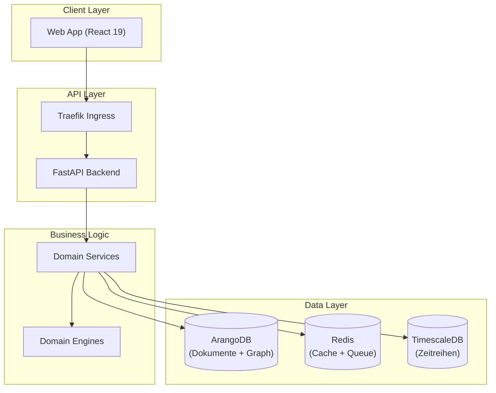

# Architektur

Kamerplanter folgt einer strikten 5-Schichten-Architektur und nutzt polyglotte Persistenz.

## Architekturüberblick

## In diesem Abschnitt

- [Überblick](overview.md) — Schichtenmodell und Designprinzipien
- [Backend](backend.md) — FastAPI, Celery, Domain-Modelle
- [Frontend](frontend.md) — React, Redux, MUI
- [Datenbank](database.md) — ArangoDB Collections und Graph-Schema
- [Infrastruktur](infrastructure.md) — Kubernetes, Helm, Netzwerk
