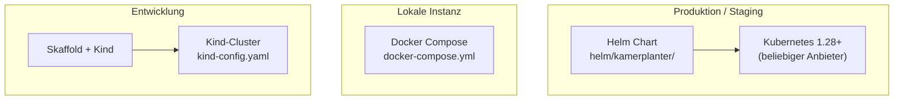
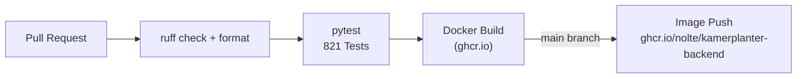
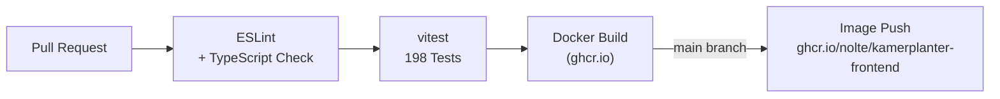
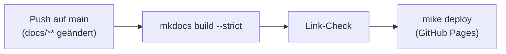

# Infrastruktur

Kamerplanter läuft auf Kubernetes und kann alternativ mit Docker Compose betrieben werden. Für die Entwicklung ist Skaffold mit einem lokalen Kind-Cluster der primäre Workflow. Dieses Dokument beschreibt alle Betriebsvarianten und die CI/CD-Pipeline.

---

## Deployment-Varianten im Überblick



---

## Kubernetes (Produktion)

### Helm-Chart

Der Helm-Chart liegt unter `helm/kamerplanter/` und basiert auf der [bjw-s common library](https://bjw-s-helm-charts.pages.dev/docs/common-library/). Diese Library vereinheitlicht Deployment-Definitionen und vermeidet Boilerplate.

```
helm/kamerplanter/
├── Chart.yaml
├── Chart.lock
├── values.yaml          # Produktions-Defaults
├── values-dev.yaml      # Entwicklungs-Overrides (Skaffold)
├── charts/              # Abhängigkeiten (bjw-s common, ArangoDB, Valkey)
└── templates/           # Helm-Templates (Ingress, ConfigMaps, ...)
```

### Container-Images

| Komponente | Image |
|-----------|-------|
| Backend | `ghcr.io/nolte/kamerplanter-backend:latest` |
| Frontend | `ghcr.io/nolte/kamerplanter-frontend:latest` |

Images werden über GitHub Actions gebaut und in der GitHub Container Registry (ghcr.io) veröffentlicht.

### Kubernetes-Ressourcen

Pro Komponente werden deployt:

**Backend (FastAPI)**
- `Deployment` mit 2 Replicas, RollingUpdate (1 Surge, 0 Unavailable)
- Liveness-Probe: `GET /api/v1/health/live`
- Readiness-Probe: `GET /api/v1/health/ready`
- Ressourcen: 250m CPU / 256Mi Memory (Request), 1 CPU / 512Mi (Limit)

**Frontend (nginx)**
- `Deployment` mit 2 Replicas, RollingUpdate
- Liveness-Probe: `GET /`
- Ressourcen: 50m CPU / 64Mi Memory (Request), 200m / 128Mi (Limit)

**ArangoDB**
- `StatefulSet` mit `PersistentVolumeClaim` für Datenpersistenz
- Port 8529

**Valkey**
- `StatefulSet` mit `PersistentVolumeClaim` (1Gi in Dev)
- Port 6379

**Celery Worker + Beat**
- Je ein `Deployment` ohne Replika-Skalierung (Worker: 1, Beat: 1)
- Gleiche Image wie Backend, anderer Startbefehl (`celery ... worker` bzw. `celery ... beat`)

### Ingress (Traefik)

Traefik übernimmt TLS-Terminierung und Routing:

```
https://kamerplanter.example.com        → Frontend (Port 80)
https://kamerplanter.example.com/api/  → Backend (Port 8000)
```

TLS-Zertifikate werden via cert-manager oder manuell bereitgestellt.

### Health-Endpunkte

| Endpunkt | Zweck |
|---------|-------|
| `GET /api/v1/health/live` | Liveness: Backend-Prozess läuft |
| `GET /api/v1/health/ready` | Readiness: ArangoDB verbunden, Daten geladen |
| `GET /api/health` | Root-Level-Health für M2M-Clients (Home Assistant) |

---

## Docker Compose (einfacher Start)

Für schnelle Evaluierungen und lokale Einzelinstallationen ohne Kubernetes. Alle 6 Dienste in einer Datei:

```yaml
# Dienste in docker-compose.yml
arangodb        # Port 8529
valkey          # Port 6379
backend         # Port 8000 (FastAPI, KAMERPLANTER_MODE=light)
celery-worker   # Hintergrundaufgaben
celery-beat     # Zeitgesteuerte Aufgaben
frontend        # Port 8080 (nginx)
```

### Schnellstart

```bash
cp .env.example .env     # Passwörter setzen
docker-compose up -d     # Alle Dienste starten
# Frontend erreichbar unter http://localhost:8080
```

Credentials werden aus `.env` gelesen — keine hartcodierten Passwörter in der `docker-compose.yml`.

---

## Skaffold + Kind (Entwicklung)

### Voraussetzungen

- [Skaffold](https://skaffold.dev/) >= v2
- [Kind](https://kind.sigs.k8s.io/) (Kubernetes in Docker)
- Docker oder Podman
- Node.js 25.1.0 (asdf `.tool-versions` im Frontend-Verzeichnis)

### Cluster erstellen

```bash
kind create cluster --config kind-config.yaml
```

### Entwicklungsworkflow

```bash
# Alle Komponenten starten (Backend + Frontend)
skaffold dev

# Nur Backend
skaffold dev --profile=backend-only

# Nur Frontend
skaffold dev --profile=frontend-only

# Debug-Modus (debugpy aktiviert)
skaffold debug
```

Skaffold übernimmt:
1. Docker-Images lokal bauen (`Dockerfile.dev`)
2. Images in den Kind-Cluster laden (kein Push zu einer Registry nötig)
3. Helm-Chart deployen (`helm/kamerplanter/values-dev.yaml`)
4. Datei-Sync: Geänderte `.py`-, `.ts`- und `.tsx`-Dateien werden direkt in die laufenden Container kopiert — kein komplettes Rebuild nötig

### Port-Forwarding

Skaffold richtet folgende Port-Forwardings ein:

| Dienst | Cluster-Port | Lokaler Port |
|--------|-------------|-------------|
| Backend | 8000 | 8000 |
| Frontend | 5173 | 3000 |
| ArangoDB | 8529 | 8529 |
| Home Assistant | 8123 | 8123 |

### Skaffold-Profile und -Module

Die `skaffold.yaml` enthält zwei Konfigurationen: die Hauptkonfiguration (Backend + Frontend) mit Profilen und ein separates **KI-Modul** fuer den Knowledge/AI-Stack.

| Profil / Modul | Befehl | Komponenten |
|----------------|--------|-------------|
| (default) | `skaffold dev` | Backend + Frontend |
| `backend-only` | `skaffold dev -p backend-only` | Nur Backend, kein Frontend-Image-Build |
| `frontend-only` | `skaffold dev -p frontend-only` | Nur Frontend, kein Backend-Image-Build |
| `debug` | `skaffold debug` | Backend mit debugpy (Remote-Debugging Port 5678) |
| **`ki`** (Modul) | `skaffold dev -m ki` | Knowledge-Service, Embedding-Service, VectorDB (TimescaleDB + pgvector) |

#### KI-Modul

Das KI-Modul (`-m ki`) ist eine eigenstaendige Skaffold-Konfiguration im selben `skaffold.yaml`. Es deployt den RAG/AI-Stack unabhaengig von der Hauptapplikation:

- **Knowledge-Service** — RAG-API mit Wissensbasis-Ingestion (Port `8090`)
- **Embedding-Service** — Vektor-Embedding via ONNX (Port `8080`)
- **VectorDB** — TimescaleDB mit pgvector-Extension (Port `5433`)

```bash
# Hauptapp + KI-Stack gleichzeitig starten
skaffold dev -m kamerplanter,ki --port-forward

# Nur KI-Stack (z.B. fuer RAG-Entwicklung)
skaffold dev -m ki --port-forward
```

| Dienst | Cluster-Port | Lokaler Port |
|--------|-------------|-------------|
| VectorDB (TimescaleDB) | 5432 | 5433 |
| Knowledge-Service | 8000 | 8090 |
| Embedding-Service | 8080 | 8080 |

!!! warning "Skaffold ist der einzige Entwicklungsworkflow"
    Kein manuelles `docker build`, `docker push` oder `kubectl apply`. Skaffold übernimmt alles. Direktes `kubectl`-Patching von Deployments wird beim nächsten `skaffold dev`-Lauf überschrieben.

---

## Home-Assistant-Integration

Die HA-Custom-Component liegt unter `src/ha-integration/custom_components/kamerplanter/`. Sie wird **nicht** automatisch per Skaffold deployt, da sie in den HA-Pod kopiert werden muss:

```bash
# 1. Dateien in den Pod kopieren
kubectl cp src/ha-integration/custom_components/kamerplanter/ \
  default/homeassistant-0:/config/custom_components/kamerplanter/

# 2. Python-Cache löschen (wichtig! sonst lädt HA alten Bytecode)
kubectl exec -n default homeassistant-0 -- \
  rm -rf /config/custom_components/kamerplanter/__pycache__

# 3. Pod neustarten (PVC bleibt erhalten)
kubectl delete pod homeassistant-0 -n default
```

---

## CI/CD (GitHub Actions)

### Workflows

```
.github/workflows/
├── docs.yml      # Dokumentation bauen und deployen
├── backend.yml   # pytest, ruff, Docker-Image-Build
└── frontend.yml  # vitest, ESLint, Docker-Image-Build
```

### Backend-Pipeline



### Frontend-Pipeline



### Dokumentations-Pipeline



---

## Umgebungsvariablen

Alle Konfiguration erfolgt über Umgebungsvariablen. Die wichtigsten:

| Variable | Standard | Beschreibung |
|---------|---------|-------------|
| `ARANGODB_HOST` | `localhost` | ArangoDB-Hostname |
| `ARANGODB_PORT` | `8529` | ArangoDB-Port |
| `ARANGODB_DATABASE` | `kamerplanter` | Datenbankname |
| `REDIS_URL` | `redis://localhost:6379/0` | Valkey/Redis-URL |
| `KAMERPLANTER_MODE` | `full` | `full` oder `light` |
| `JWT_SECRET_KEY` | (kein Default!) | JWT-Signing-Key — in Produktion setzen! |
| `CORS_ORIGINS` | `["http://localhost:3000"]` | Erlaubte CORS-Origins (JSON-Array) |
| `DEBUG` | `false` | Debug-Modus (kein HSTS, farbige Logs) |
| `REQUIRE_EMAIL_VERIFICATION` | `false` | E-Mail-Verifizierung erzwingen |
| `PERENUAL_API_KEY` | `""` | API-Key für Perenual-Stammdatenanreicherung |

!!! danger "JWT_SECRET_KEY in Produktion setzen"
    Der Default-Wert `change-me-in-production-use-openssl-rand-hex-32` darf in Produktionsumgebungen niemals verwendet werden. Einen sicheren Key generieren:
    ```bash
    openssl rand -hex 32
    ```

---

## Renovate (Dependency-Updates)

Dependency-Updates werden automatisch via [Renovate](https://github.com/renovatebot/renovate) als Pull Requests erstellt. Die Konfiguration liegt in `renovate.json5`.

## Siehe auch

- [Lokale Entwicklung](../development/local-setup.md)
- [Kubernetes-Deployment](../deployment/kubernetes.md)
- [Architektur-Überblick](overview.md)
