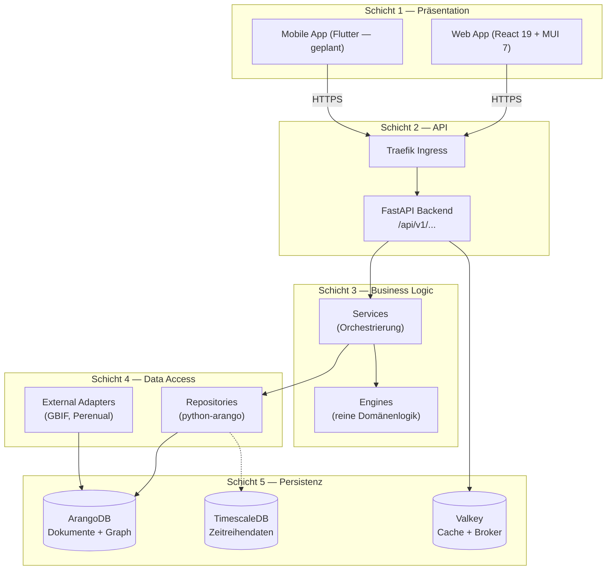
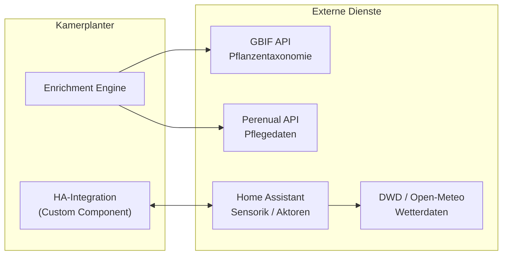

# Architektur-Überblick

Kamerplanter ist eine agrotech-orientierte Plattform für das Pflanzenwachstums-Management. Die Architektur ist auf Erweiterbarkeit, Datensicherheit und klare Verantwortlichkeitstrennung ausgelegt. Dieses Dokument beschreibt das Gesamtbild — die Detailseiten gehen auf die einzelnen Schichten ein.

---

## 5-Schichten-Architektur (NFR-001)

Das System folgt einer strikten 5-Schichten-Architektur. Jede Schicht kennt nur die direkt darunter liegende — überspringende Aufrufe sind nicht erlaubt. Das Frontend greift **niemals** direkt auf die Datenbank zu.



## Laufzeitkomponenten

| Komponente | Technologie | Aufgabe |
|-----------|------------|---------|
| Web-App | React 19, TypeScript 5.9, MUI 7 | Benutzeroberfläche |
| Backend API | Python 3.14+, FastAPI >= 0.115 | REST-Endpunkte, JWT-Auth, OpenAPI |
| Celery Worker | Celery >= 5.4 | Hintergrundaufgaben (Anreicherung, Erinnerungen) |
| Celery Beat | Celery Beat | Zeitgesteuerte Aufgaben (täglich, stündlich) |
| ArangoDB | ArangoDB 3.11+ | Primäre Datenbank — Dokumente und Graph |
| TimescaleDB | TimescaleDB 2.13+ | Sensordaten (Zeitreihen, künftig) |
| Valkey | Valkey 8 (Redis-kompatibel) | Celery-Broker + Cache |
| Traefik | Traefik Ingress | TLS-Terminierung, Routing |

## Deployment-Varianten

### Kubernetes (Produktion)

Container-Images aus `ghcr.io/nolte/kamerplanter-{backend,frontend}`, deployt via Helm-Chart auf Basis der [bjw-s common library](https://bjw-s-helm-charts.pages.dev/docs/common-library/). Der Chart liegt unter `helm/kamerplanter/`.

### Docker Compose (einfacher Start)

Für schnelle lokale Instanzen ohne Kubernetes. Alle Dienste in einer `docker-compose.yml` — ideal für Demos und Evaluierung.

### Skaffold + Kind (Entwicklung)

Der primäre Entwicklungsworkflow. Skaffold übernimmt Image-Building, Hot-Reload via Datei-Sync und Deployment in einen lokalen Kind-Cluster. Kein manuelles `kubectl apply` nötig.

## Authentifizierung & Multi-Tenancy

Kamerplanter unterstützt mehrere Betriebsmodi:

- **Full-Modus**: Vollständige Auth mit JWT-Tokens (15 min Ablauf), HttpOnly-Cookie für Refresh-Token (30 Tage). Lokale Accounts (bcrypt) und federated Login (OIDC). Multi-Tenant-Routing unter `/api/v1/t/{tenant_slug}/`.
- **Light-Modus** (REQ-027): Für lokale Einzelinstallationen ohne Auth-Overhead. Ein Platform-Tenant wird automatisch erstellt.

## Betriebsmodi-Schalter

Der Modus wird über die Umgebungsvariable `KAMERPLANTER_MODE` gesteuert:

```
KAMERPLANTER_MODE=light   # Anonymer Zugang, kein Login
KAMERPLANTER_MODE=full    # Vollständige Auth (Standard)
```

## Externe Integrationen



## Siehe auch

- [Backend-Architektur](backend.md) — Schichtenaufbau, Engines, Celery
- [Frontend-Architektur](frontend.md) — React, Redux, Routing
- [Datenbankarchitektur](database.md) — ArangoDB-Graph, Polyglot Persistence
- [Infrastruktur](infrastructure.md) — Kubernetes, Helm, Skaffold, CI/CD
