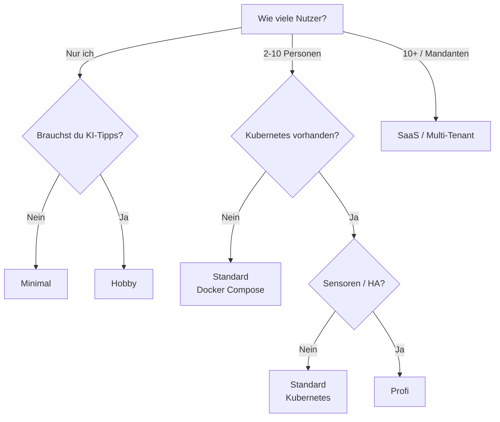

# Betriebsprofile

Kamerplanter ist modular aufgebaut. Du entscheidest selbst, welche Komponenten du brauchst — von einer schlanken Installation auf dem Raspberry Pi bis zum vollstaendigen Multi-Tenant-Setup auf Kubernetes. Diese Seite hilft dir, das richtige Profil fuer deinen Anwendungsfall zu finden.

---

## Komponentenuebersicht

Jede Kamerplanter-Installation besteht aus einem **Kern** (immer erforderlich) und **optionalen Komponenten**, die du je nach Bedarf aktivierst.

### Kern (immer aktiv)

| Komponente | Aufgabe |
|------------|---------|
| **Backend** (FastAPI) | REST-API, Geschaeftslogik, Phasensteuerung, Duengeplaene |
| **Frontend** (React) | Web-Oberflaeche |
| **ArangoDB** | Primaere Datenbank (Dokumente + Graph-Abfragen) |
| **Valkey** (Redis-kompatibel) | Cache und Celery-Broker |
| **Celery Worker + Beat** | Hintergrundaufgaben (Pflegeerinnerungen, Datenanreicherung, KI-Tipps) |

### Optionale Komponenten

| Komponente | Aufgabe | Ressourcenbedarf | Konfiguration |
|------------|---------|------------------|---------------|
| **Betriebsmodus** | `light` = kein Login, ein Nutzer; `full` = JWT-Auth, Multi-Tenant | — | `KAMERPLANTER_MODE` |
| **KI-Assistent** | Pflegetipps, Diagnosen, Empfehlungen per Sprachmodell | 2--8 GB RAM (lokal) | `AI_DEFAULT_PROVIDER` |
| **Ollama** | Lokale Ausfuehrung von Sprachmodellen (kein Datentransfer) | 4--16 GB RAM, optional GPU | Docker-Profil `ollama` |
| **Knowledge Service** | RAG-Pipeline: Wissensbasis durchsuchen, Kontext anreichern | 512 MB RAM | Eigenes Deployment |
| **VectorDB** (pgvector) | Vektorspeicher fuer RAG-Embeddings | 256 MB RAM | `VECTORDB_ENABLED` |
| **Embedding Service** | ONNX-basierte Embedding-Berechnung (kein PyTorch) | 512 MB RAM | Eigenes Deployment |
| **TimescaleDB** | Zeitreihendaten von Sensoren, automatisches Downsampling | 256--512 MB RAM | `TIMESCALEDB_ENABLED` |
| **Home Assistant** | Sensor- und Aktor-Integration (Temperatur, Luftfeuchte, Lampen) | Extern | `HA_URL` + `HA_ACCESS_TOKEN` |
| **Externe Datenanreicherung** | Pflanzendaten von GBIF und Perenual automatisch ergaenzen | — | `PERENUAL_API_KEY` |

---

## Profile im Ueberblick

Die folgende Matrix zeigt fuenf vordefinierte Profile. Jedes Profil ist eine Empfehlung — du kannst jederzeit einzelne Komponenten hinzufuegen oder weglassen.

| | Minimal | Hobby | Standard | Profi | SaaS |
|---|:---:|:---:|:---:|:---:|:---:|
| **Infrastruktur** | Docker Compose | Docker Compose | Docker Compose / K8s | Kubernetes | Kubernetes |
| **Betriebsmodus** | Light | Light | Full | Full | Full |
| **KI-Assistent** | — | Ollama (lokal) | Ollama (lokal) | Ollama + Cloud-Fallback | Cloud (OpenAI / Anthropic) |
| **Knowledge Service + RAG** | — | — | Optional | Ja | Ja |
| **TimescaleDB** | — | — | Optional | Ja | Ja |
| **Home Assistant** | — | Optional | Optional | Ja | Optional |
| **Externe Anreicherung** | — | Optional | Ja | Ja | Ja |
| **Celery Worker** | Ja | Ja | Ja | Ja | Ja |
| **Zielgruppe** | Raspberry Pi, Ausprobieren | Hobby-Gaertner, Home-Server | Engagierte Hobbyisten, kleine Gemeinschaftsgaerten | Indoor-Growing, grosse Gemeinschaftsgaerten | Managed Hosting, mehrere Mandanten |
| **RAM gesamt** | ~1 GB | ~3 GB | ~4 GB | ~6 GB | ~8 GB |

---

## Minimal

### Zielgruppe

Du willst Kamerplanter schnell ausprobieren oder hast nur wenige Zimmerpflanzen. Ein Raspberry Pi 4/5 oder ein alter Laptop reicht aus. Du brauchst weder Login noch KI.

### Voraussetzungen

- Docker + Docker Compose
- 1 GB freier RAM, 2 GB Speicherplatz
- Raspberry Pi 4 (2 GB), Raspberry Pi 5, NUC, Laptop

### Aktivierte Komponenten

- [x] Backend + Frontend
- [x] ArangoDB + Valkey
- [x] Celery Worker + Beat
- [ ] KI-Assistent
- [ ] TimescaleDB
- [ ] Home Assistant
- [ ] Knowledge Service / RAG

### Beispielkonfiguration

```yaml title="docker-compose.yml (Auszug)"
services:
  arangodb:
    image: arangodb:3.11
    # ...

  valkey:
    image: valkey/valkey:8-alpine
    # ...

  backend:
    build: ./src/backend
    environment:
      KAMERPLANTER_MODE: light
      AI_DEFAULT_PROVIDER: none
      TIMESCALEDB_ENABLED: "false"
      VECTORDB_ENABLED: "false"
    depends_on: [arangodb, valkey]

  celery-worker:
    build: ./src/backend
    command: celery -A app.tasks worker --loglevel=info
    depends_on: [arangodb, valkey]

  celery-beat:
    build: ./src/backend
    command: celery -A app.tasks beat --loglevel=info
    depends_on: [arangodb, valkey]

  frontend:
    build: ./src/frontend
    environment:
      KAMERPLANTER_MODE: light
    depends_on: [backend]
```

### Was fehlt im Vergleich zum naechsten Profil?

Ohne KI-Assistent bekommst du keine automatischen Pflegetipps und Diagnosen. Du kannst Ollama jederzeit spaeter hinzufuegen, ohne Daten zu verlieren.

---

## Hobby

### Zielgruppe

Du hast 10--50 Pflanzen und einen Home-Server (NAS, alter Desktop, NUC). Du moechtest KI-gestuetzte Pflegetipps, aber deine Daten sollen dein Netzwerk nicht verlassen. Login brauchst du nicht — du bist der einzige Nutzer.

### Voraussetzungen

- Docker + Docker Compose
- 4 GB freier RAM (8 GB mit 7B-Modell), optional GPU
- Home-Server, NUC, Desktop-PC

### Aktivierte Komponenten

- [x] Backend + Frontend
- [x] ArangoDB + Valkey
- [x] Celery Worker + Beat
- [x] Ollama (lokales Sprachmodell)
- [ ] Knowledge Service / RAG (optional aktivierbar)
- [ ] TimescaleDB
- [ ] Home Assistant (optional)
- [ ] Externe Anreicherung (optional)

### Beispielkonfiguration

```yaml title="docker-compose.yml (Auszug)"
services:
  # ... Kern wie Minimal ...

  backend:
    build: ./src/backend
    environment:
      KAMERPLANTER_MODE: light
      AI_DEFAULT_PROVIDER: ollama
      AI_OLLAMA_URL: http://ollama:11434
      AI_OLLAMA_MODEL: gemma3:4b
      TIMESCALEDB_ENABLED: "false"
    depends_on: [arangodb, valkey]

  ollama:
    image: ollama/ollama:latest
    volumes:
      - ollama_models:/models
    # GPU-Passthrough (optional):
    # deploy:
    #   resources:
    #     reservations:
    #       devices:
    #         - capabilities: [gpu]
```

!!! tip "Modellwahl"
    Starte mit `gemma3:4b` — das laeuft auf den meisten Rechnern ab 2020 ohne GPU. Details zur Modellwahl findest du unter [KI-Provider einrichten](../user-guide/ai-providers.md#ollama-lokal-empfohlen).

### Was fehlt im Vergleich zum naechsten Profil?

Ohne Full-Modus kannst du keine weiteren Nutzer einladen. Ohne TimescaleDB werden Sensordaten nicht langfristig gespeichert. Beides laesst sich spaeter aktivieren.

---

## Standard

### Zielgruppe

Du bist engagierter Hobbyist oder betreibst einen kleinen Gemeinschaftsgarten. Mehrere Personen sollen eigene Konten haben. Du moechtest KI-Tipps und optional Sensordaten langfristig speichern.

### Voraussetzungen

- Docker Compose oder Kubernetes-Cluster
- 4--6 GB freier RAM
- Server, NUC oder kleiner K8s-Cluster

### Aktivierte Komponenten

- [x] Backend + Frontend
- [x] ArangoDB + Valkey
- [x] Celery Worker + Beat
- [x] Ollama (lokales Sprachmodell)
- [x] Externe Anreicherung (GBIF + Perenual)
- [ ] Knowledge Service / RAG (optional)
- [ ] TimescaleDB (optional)
- [ ] Home Assistant (optional)

### Beispielkonfiguration

=== "Docker Compose"

    ```yaml title="docker-compose.yml (Auszug)"
    services:
      # ... Kern + Ollama ...

      backend:
        build: ./src/backend
        environment:
          KAMERPLANTER_MODE: full
          AI_DEFAULT_PROVIDER: ollama
          AI_OLLAMA_URL: http://ollama:11434
          AI_OLLAMA_MODEL: gemma3:4b
          JWT_SECRET_KEY: ${JWT_SECRET_KEY}  # openssl rand -hex 32
          PERENUAL_API_KEY: ${PERENUAL_API_KEY}
          TIMESCALEDB_ENABLED: ${TIMESCALEDB_ENABLED:-false}
        depends_on: [arangodb, valkey]
    ```

=== "Helm Values"

    ```yaml title="values.yaml (Auszug)"
    controllers:
      backend:
        containers:
          main:
            env:
              KAMERPLANTER_MODE: full
              AI_DEFAULT_PROVIDER: ollama
              AI_OLLAMA_URL: http://ollama:11434
              AI_OLLAMA_MODEL: gemma3:4b
              TIMESCALEDB_ENABLED: "false"
    ```

!!! note "TimescaleDB nur bei Sensoren noetig"
    Wenn du keine Sensoren oder Home-Assistant-Anbindung planst, kannst du TimescaleDB weglassen. Manuelle Messwerte werden in ArangoDB gespeichert. TimescaleDB lohnt sich erst bei automatischer, hochfrequenter Datenerfassung.

### Was fehlt im Vergleich zum naechsten Profil?

Ohne TimescaleDB kein automatisches Downsampling von Sensordaten. Ohne Home Assistant keine automatische Sensorerfassung und Aktorsteuerung. Ohne Knowledge Service / RAG keine kontextangereicherten KI-Antworten aus der Wissensbasis.

---

## Profi

### Zielgruppe

Du betreibst professionelles Indoor-Growing oder einen grossen Gemeinschaftsgarten mit Rollenverwaltung. Sensoren und Aktoren sind ueber Home Assistant angebunden. Du willst lueckenlose Zeitreihen, KI-gestuetzte Diagnosen mit RAG-Kontext und Cloud-Fallback fuer das Sprachmodell.

### Voraussetzungen

- Kubernetes-Cluster (3+ Nodes empfohlen)
- 6--8 GB RAM fuer Kamerplanter-Pods
- Home Assistant Instanz im Netzwerk
- Optional: GPU-Node fuer schnellere KI-Inferenz

### Aktivierte Komponenten

- [x] Backend + Frontend
- [x] ArangoDB + Valkey
- [x] Celery Worker + Beat
- [x] Ollama + Cloud-Fallback (OpenAI oder Anthropic)
- [x] Knowledge Service + VectorDB + Embedding Service
- [x] TimescaleDB
- [x] Home Assistant
- [x] Externe Anreicherung (GBIF + Perenual)

### Beispielkonfiguration

```yaml title="values.yaml (Auszug)"
controllers:
  backend:
    containers:
      main:
        env:
          KAMERPLANTER_MODE: full
          AI_DEFAULT_PROVIDER: ollama
          AI_OLLAMA_URL: http://ollama:11434
          AI_OLLAMA_MODEL: mistral:7b
          AI_FALLBACK_PROVIDER: openai
          AI_OPENAI_API_KEY:
            secretKeyRef:
              name: kamerplanter-secrets
              key: openai-api-key
          TIMESCALEDB_ENABLED: "true"
          TIMESCALEDB_HOST: timescaledb
          HA_URL: http://homeassistant.home:8123
          HA_ACCESS_TOKEN:
            secretKeyRef:
              name: kamerplanter-secrets
              key: ha-access-token
          PERENUAL_API_KEY:
            secretKeyRef:
              name: kamerplanter-secrets
              key: perenual-api-key

  timescaledb:
    enabled: true

  knowledge-service:
    enabled: true

  embedding-service:
    enabled: true

  vectordb:
    enabled: true
```

!!! warning "Secrets nicht in values.yaml"
    API-Keys und Tokens gehoeren in Kubernetes Secrets oder einen externen Secret-Manager (z.B. Sealed Secrets, External Secrets Operator). Verwende `secretKeyRef` in den Helm Values.

### Was fehlt im Vergleich zum naechsten Profil?

Im Profi-Profil betreibst du eine einzelne Instanz fuer deine Organisation. Das SaaS-Profil fuegt Multi-Mandanten-Isolation, horizontale Skalierung und Cloud-KI als Primaerprovider hinzu.

---

## SaaS / Multi-Tenant

### Zielgruppe

Du betreibst Kamerplanter als Plattform fuer mehrere unabhaengige Mandanten (Gaerten, Betriebe, Gemeinschaften). Jeder Mandant hat eigene Daten, Rollen und Einstellungen. Du brauchst horizontale Skalierung und zuverlaessige Cloud-KI.

### Voraussetzungen

- Kubernetes-Cluster mit Autoscaling
- 8+ GB RAM fuer Kamerplanter-Pods
- Managed-Datenbank-Dienste empfohlen (ArangoDB Oasis, Managed PostgreSQL)
- Cloud-KI-Provider-Konto (OpenAI oder Anthropic)

### Aktivierte Komponenten

- [x] Backend + Frontend (mehrere Replicas)
- [x] ArangoDB + Valkey
- [x] Celery Worker (mehrere Replicas) + Beat
- [x] Cloud-KI (OpenAI / Anthropic)
- [x] Knowledge Service + VectorDB + Embedding Service
- [x] TimescaleDB
- [x] Externe Anreicherung (GBIF + Perenual)
- [ ] Home Assistant (optional, mandantenspezifisch)

### Beispielkonfiguration

```yaml title="values.yaml (Auszug)"
controllers:
  backend:
    replicas: 3
    containers:
      main:
        env:
          KAMERPLANTER_MODE: full
          AI_DEFAULT_PROVIDER: openai
          AI_OPENAI_MODEL: gpt-4o-mini
          TIMESCALEDB_ENABLED: "true"

  celery-worker:
    replicas: 2

  frontend:
    replicas: 2
```

!!! tip "Managed Datenbanken"
    Im SaaS-Betrieb empfiehlt sich der Einsatz von Managed-Datenbank-Diensten statt selbst betriebener Container. Das reduziert den Betriebsaufwand fuer Backups, Updates und Hochverfuegbarkeit erheblich.

---

## Eigenes Profil zusammenstellen

Die Profile oben sind Empfehlungen. Du kannst jede Komponente einzeln aktivieren oder deaktivieren, indem du die entsprechenden Umgebungsvariablen setzt:

| Entscheidung | Variable | Werte |
|-------------|----------|-------|
| Login und Multi-Tenant? | `KAMERPLANTER_MODE` | `light` / `full` |
| KI-Pflegetipps? | `AI_DEFAULT_PROVIDER` | `ollama`, `llamacpp`, `openai`, `anthropic`, `openai-compatible`, `none` |
| Sensordaten-Zeitreihen? | `TIMESCALEDB_ENABLED` | `true` / `false` |
| RAG-Wissensbasis? | `VECTORDB_ENABLED` | `true` / `false` |
| Home Assistant? | `HA_URL` + `HA_ACCESS_TOKEN` | URL + Token (leer = deaktiviert) |
| Pflanzendaten-Anreicherung? | `PERENUAL_API_KEY` | API-Key (leer = nur GBIF) |

In Docker Compose aktivierst du optionale Dienste ueber Profile:

```bash
# Nur Kern:
docker compose up -d

# Mit Ollama und TimescaleDB:
docker compose --profile ollama --profile timescaledb up -d

# Mit allem:
docker compose --profile ollama --profile timescaledb --profile vectordb up -d
```

Eine vollstaendige Liste aller Umgebungsvariablen findest du unter [Umgebungsvariablen](../reference/environment-variables.md).

---

## Entscheidungshilfe

Das folgende Flussdiagramm hilft dir, ein passendes Profil zu finden:



---

## Haeufige Fragen

### Kann ich spaeter auf ein groesseres Profil wechseln?

Ja. Alle Profile nutzen dieselbe Datenbank. Du kannst jederzeit Komponenten hinzufuegen (z.B. Ollama aktivieren, TimescaleDB starten, von Light auf Full wechseln), ohne Daten zu verlieren. Beim Wechsel von Light auf Full musst du einmalig ein Passwort fuer den bestehenden System-Benutzer setzen.

### Kann ich Ollama auf einem Raspberry Pi ausfuehren?

Ja, ab dem Raspberry Pi 5 mit 8 GB RAM. Verwende ein kleines Modell wie `llama3.2:3b`. Die Antwortzeiten liegen bei 15--30 Sekunden pro Tipp — akzeptabel, aber nicht schnell. Auf dem Raspberry Pi 4 ist die Leistung fuer groessere Modelle nicht ausreichend.

### Brauche ich TimescaleDB, wenn ich keine Sensoren habe?

Nein. Ohne automatische Sensordatenerfassung (IoT/MQTT oder Home Assistant) bringt TimescaleDB keinen Vorteil. Manuelle Messwerte (pH, EC) werden in ArangoDB gespeichert. Du kannst TimescaleDB spaeter aktivieren, wenn du Sensoren anbindest.

### Was passiert, wenn ich keinen KI-Provider konfiguriere?

Kamerplanter funktioniert vollstaendig ohne KI. Wenn `AI_DEFAULT_PROVIDER=none` gesetzt ist (oder kein Provider konfiguriert), werden die KI-Tipp-Karten in der Oberflaeche nicht angezeigt. Alle regelbasierten Funktionen (Phasensteuerung, Duengeplaene, Pflegeerinnerungen) arbeiten unabhaengig vom KI-Provider.

---

## Siehe auch

- [Light-Modus](../user-guide/light-mode.md) — Details zum Betrieb ohne Authentifizierung
- [KI-Provider einrichten](../user-guide/ai-providers.md) — Ollama, OpenAI, Anthropic und andere Provider konfigurieren
- [Home Assistant Integration](../guides/home-assistant-integration.md) — Sensor- und Aktor-Anbindung
- [Umgebungsvariablen](../reference/environment-variables.md) — Vollstaendige Variablenreferenz
- [Kubernetes](kubernetes.md) — Cluster-Setup und Deployment
- [Infrastruktur — Skaffold-Profile](../architecture/infrastructure.md#skaffold-profile-und-module) — Skaffold-Module (`-m ki`) fuer den KI-Stack
