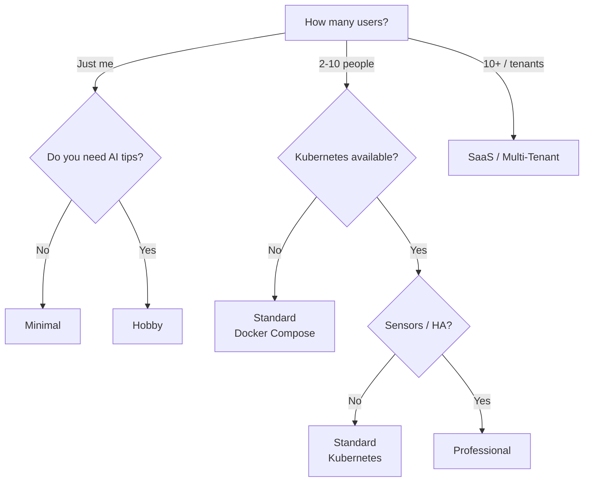

# Betriebsprofile

Kamerplanter ist modular aufgebaut. Du entscheidest selbst, welche Komponenten du brauchst — von einer schlanken Installation auf dem Raspberry Pi bis zum vollständigen Multi-Tenant-Setup auf Kubernetes. Diese Seite hilft dir, das richtige **Bündel** aus Komponenten für deinen Anwendungsfall zu finden.

!!! tip "Vollständige Feature-für-Feature-Referenz"
    Diese Seite zeigt fünf empfohlene Bündel für typische Anwendungsfälle. Für eine erschöpfende Tabelle aller ~40 Funktionen mit exakter Umgebungsvariable, Pflicht-Secrets und Ressourcenauswirkung siehe die [Konfigurationsmatrix](konfigurationsmatrix.md).

---

## Komponentenübersicht

Jede Kamerplanter-Installation besteht aus einem **Kern** (immer erforderlich) und **optionalen Komponenten**, die du je nach Bedarf aktivierst.

### Kern (immer aktiv)

| Komponente | Aufgabe |
|------------|---------|
| **Backend** (FastAPI) | REST-API, Geschäftslogik, Phasensteuerung, Düngeplanе |
| **Frontend** (React) | Web-Oberfläche |
| **ArangoDB** | Primäre Datenbank (Dokumente + Graph-Abfragen) |
| **Valkey** (Redis-kompatibel) | Cache und Celery-Broker |
| **Celery Worker + Beat** | Hintergrundaufgaben (Pflegeerinnerungen, Datenanreicherung, KI-Tipps) |

### Optionale Komponenten

| Komponente | Aufgabe | Ressourcenbedarf | Konfiguration |
|------------|---------|------------------|---------------|
| **Betriebsmodus** | `light` = kein Login, ein Nutzer; `full` = JWT-Auth, Multi-Tenant | — | `KAMERPLANTER_MODE` |
| **KI-Assistent** (Backend-Seite) | Freischaltung der `/ai/*`-Endpunkte, Pflegetipps, Diagnosen, Glossar | 128 MB – 2 GB RAM (Backend, ohne LLM) | `AI_FEATURES_ENABLED` + `KNOWLEDGE_SERVICE_ENABLED`/`KNOWLEDGE_SERVICE_URL` |
| **Ollama** | Lokale Ausführung von Sprachmodellen (kein Datentransfer) | 4--16 GB RAM, optional GPU | Docker-Profil `ollama`; `LLM_PROVIDER=ollama` **am Knowledge Service** |
| **Knowledge Service** | RAG-Pipeline: Wissensbasis durchsuchen, LLM-Provider anbinden, Kontext anreichern | 128 MB – 512 MB RAM | Eigener Helm-Controller (`controllers.knowledge-service`), kein vorgefertigtes `enabled`-Flag in `values.yaml` — Operator liefert den vollständigen Block |
| **VectorDB** (pgvector) | Vektorspeicher für RAG-Embeddings **und** für den Bilderkennungs-Referenzindex (REQ-029-A) | 128 MB – 512 MB RAM | `controllers.vectordb.enabled` (in `values.yaml` vordefiniert, Default `false`) |
| **Embedding Service** | ONNX-basierte Embedding-Berechnung (kein PyTorch) | 1,5–4 GB RAM | Eigener Helm-Controller (`controllers.embedding-service`), kein vorgefertigtes `enabled`-Flag |
| **Reranker Service** | Cross-Encoder Re-Ranking für höhere RAG-Präzision (ADR-007) | 1,5–4 GB RAM | `RERANKER_URL` **am Knowledge Service** (leer = deaktiviert) |
| **TimescaleDB** | Zeitreihendaten von Sensoren, automatisches Downsampling | 256--512 MB RAM | `TIMESCALEDB_ENABLED` |
| **Home Assistant** | Sensor- und Aktor-Integration (Temperatur, Luftfeuchte, Lampen) | Extern | `HA_URL` + `HA_ACCESS_TOKEN` |
| **Externe Datenanreicherung** | Pflanzendaten von GBIF und Perenual automatisch ergänzen | — | `PERENUAL_API_KEY` |

!!! info "KI-Assistent — Betreiber-Schalter und Provider-Wahl sind getrennt"
    `AI_FEATURES_ENABLED` ist ein reiner **Backend-Schalter** (Stufe 1 des dreistufigen Freischalt-Mechanismus, siehe [Für technische Nutzer / Self-Hoster](../user-guide/ai-assistant.md#fuer-technische-nutzer-self-hoster)): `false` lässt alle `/ai/*`-Endpunkte mit HTTP 404 antworten. Er bestimmt **nicht**, welches Sprachmodell verwendet wird — das ist `LLM_PROVIDER` (`ollama`, `anthropic`, `openai_compatible`) **am eigenständigen Knowledge Service** (`src/knowledge-service/`), nicht am Backend. Es gibt kein `AI_DEFAULT_PROVIDER`, kein `AI_OLLAMA_URL`/`AI_OLLAMA_MODEL` und kein `AI_FALLBACK_PROVIDER` im Backend — diese früher hier dokumentierten Variablen existieren im Code nicht. Details: [KI-Provider einrichten](../user-guide/ai-providers.md), [Umgebungsvariablen — KI-Assistent](../reference/environment-variables.md#ki-assistent).

---

## Profile im Überblick

Die folgende Matrix zeigt fünf vordefinierte Profile. Jedes Profil ist eine Empfehlung — du kannst jederzeit einzelne Komponenten hinzufügen oder weglassen.

| | Minimal | Hobby | Standard | Profi | SaaS |
|---|:---:|:---:|:---:|:---:|:---:|
| **Infrastruktur** | Docker Compose | Docker Compose | Docker Compose / K8s | Kubernetes | Kubernetes |
| **Betriebsmodus** | Light | Light | Full | Full | Full |
| **KI-Assistent** | — | Ollama (lokal) | Ollama (lokal) | Ollama (lokal) | Cloud (OpenAI / Anthropic) |
| **Knowledge Service + Embedding Service + VectorDB** | — | Ja (Pflicht-Bündel für Ollama) | Ja (Pflicht-Bündel für Ollama) | Ja | Ja |
| **Reranker Service** | — | — | Optional | Optional | Ja |
| **TimescaleDB** | — | — | Optional | Ja | Ja |
| **Home Assistant** | — | Optional | Optional | Ja | Optional |
| **Externe Anreicherung** | — | Optional | Ja | Ja | Ja |
| **Celery Worker** | Ja | Ja | Ja | Ja | Ja |
| **Zielgruppe** | Raspberry Pi, Ausprobieren | Hobby-Gärtner, Home-Server | Engagierte Hobbyisten, kleine Gemeinschaftsgärten | Indoor-Growing, große Gemeinschaftsgärten | Managed Hosting, mehrere Mandanten |
| **RAM gesamt** | ~1 GB | ~3 GB | ~4 GB | ~6 GB | ~8 GB |

---

## Minimal

### Zielgruppe

Du willst Kamerplanter schnell ausprobieren oder hast nur wenige Zimmerpflanzen. Ein Raspberry Pi 4/5 oder ein alter Laptop reicht aus. Du brauchst weder Login noch KI.

### Voraussetzungen

- Docker + Docker Compose
- 1 GB freier RAM, 2 GB Speicherplatz
- Raspberry Pi 4 (2 GB), Raspberry Pi 5, NUC, Laptop

### Aktivierte Komponenten

- [x] Backend + Frontend
- [x] ArangoDB + Valkey
- [x] Celery Worker + Beat
- [ ] KI-Assistent
- [ ] TimescaleDB
- [ ] Home Assistant
- [ ] Knowledge Service / RAG

### Beispielkonfiguration

```yaml title="docker-compose.yml (Auszug)"
services:
  arangodb:
    image: arangodb:3.11
    # ...

  valkey:
    image: valkey/valkey:8-alpine
    # ...

  backend:
    build: ./src/backend
    environment:
      KAMERPLANTER_MODE: light
      AI_FEATURES_ENABLED: "false"
      TIMESCALEDB_ENABLED: "false"
    depends_on: [arangodb, valkey]

  celery-worker:
    build: ./src/backend
    command: celery -A app.tasks worker --loglevel=info
    depends_on: [arangodb, valkey]

  celery-beat:
    build: ./src/backend
    command: celery -A app.tasks beat --loglevel=info
    depends_on: [arangodb, valkey]

  frontend:
    build: ./src/frontend
    environment:
      KAMERPLANTER_MODE: light
    depends_on: [backend]
```

### Was fehlt im Vergleich zum nächsten Profil?

Ohne KI-Assistent bekommst du keine automatischen Pflegetipps und Diagnosen. Du kannst Ollama jederzeit später hinzufügen, ohne Daten zu verlieren.

---

## Hobby

### Zielgruppe

Du hast 10--50 Pflanzen und einen Home-Server (NAS, alter Desktop, NUC). Du möchtest KI-gestützte Pflegetipps, aber deine Daten sollen dein Netzwerk nicht verlassen. Login brauchst du nicht — du bist der einzige Nutzer.

### Voraussetzungen

- Docker + Docker Compose
- 6–8 GB freier RAM für den KI-Stack (Ollama-Modell + Knowledge/Embedding-Service/VectorDB-Overhead — siehe [Konfigurationsmatrix](konfigurationsmatrix.md#ki-assistent-req-031)), mehr bei einem 7B-Modell, optional GPU
- Home-Server, NUC, Desktop-PC

### Aktivierte Komponenten

- [x] Backend + Frontend
- [x] ArangoDB + Valkey
- [x] Celery Worker + Beat
- [x] Ollama (lokales Sprachmodell)
- [x] Knowledge Service + Embedding Service + VectorDB (nötig, damit Ollama vom KI-Assistenten überhaupt erreicht wird)
- [ ] TimescaleDB
- [ ] Home Assistant (optional)
- [ ] Externe Anreicherung (optional)

!!! note "Ollama allein reicht nicht"
    Das Backend spricht **nie** direkt mit Ollama. Die Provider-Anbindung (`LLM_PROVIDER`) liegt am **Knowledge Service** — er ruft Ollama auf und liefert das Ergebnis über `KNOWLEDGE_SERVICE_URL` an das Backend zurück. Ohne laufenden Knowledge Service (+ Embedding Service für die Ähnlichkeitssuche, + VectorDB als Vektorspeicher) bleiben die KI-Endpunkte funktionslos, selbst wenn Ollama läuft.

### Beispielkonfiguration

```yaml title="docker-compose.yml (Auszug)"
services:
  # ... Kern wie Minimal ...

  backend:
    build: ./src/backend
    environment:
      KAMERPLANTER_MODE: light
      AI_FEATURES_ENABLED: "true"
      KNOWLEDGE_SERVICE_ENABLED: "true"
      KNOWLEDGE_SERVICE_URL: http://knowledge-service:8000
      INTERNAL_SERVICE_TOKEN: ${INTERNAL_SERVICE_TOKEN}  # openssl rand -hex 32
      TIMESCALEDB_ENABLED: "false"
    depends_on: [arangodb, valkey]

  knowledge-service:
    build: ./src/knowledge-service
    environment:
      LLM_PROVIDER: ollama
      LLM_API_URL: http://ollama:11434
      LLM_MODEL: gemma3:4b
      EMBEDDING_SERVICE_URL: http://embedding-service:8080
      VECTORDB_HOST: vectordb
      INTERNAL_SERVICE_TOKEN: ${INTERNAL_SERVICE_TOKEN}
    depends_on: [ollama, embedding-service, vectordb]

  embedding-service:
    build: ./docker/embedding-service

  vectordb:
    build: ./docker/vectordb

  ollama:
    image: ollama/ollama:latest
    volumes:
      - ollama_models:/models
    # GPU-Passthrough (optional):
    # deploy:
    #   resources:
    #     reservations:
    #       devices:
    #         - capabilities: [gpu]
```

!!! tip "Modellwahl"
    Starte mit `gemma3:4b` — das läuft auf den meisten Rechnern ab 2020 ohne GPU. Details zur Modellwahl findest du unter [KI-Provider einrichten](../user-guide/ai-providers.md#ollama-lokal-empfohlen).

### Was fehlt im Vergleich zum nächsten Profil?

Ohne Full-Modus kannst du keine weiteren Nutzer einladen. Ohne TimescaleDB werden Sensordaten nicht langfristig gespeichert. Beides lässt sich später aktivieren.

---

## Standard

### Zielgruppe

Du bist engagierter Hobbyist oder betreibst einen kleinen Gemeinschaftsgarten. Mehrere Personen sollen eigene Konten haben. Du möchtest KI-Tipps und optional Sensordaten langfristig speichern.

### Voraussetzungen

- Docker Compose oder Kubernetes-Cluster
- 6--8 GB freier RAM (KI-Stack wie im Hobby-Profil, siehe oben)
- Server, NUC oder kleiner K8s-Cluster

### Aktivierte Komponenten

- [x] Backend + Frontend
- [x] ArangoDB + Valkey
- [x] Celery Worker + Beat
- [x] Ollama + Knowledge Service + Embedding Service + VectorDB (KI-Stack als Bündel, siehe Hobby-Profil)
- [x] Externe Anreicherung (GBIF + Perenual)
- [ ] Reranker Service (optional — höhere RAG-Präzision)
- [ ] TimescaleDB (optional)
- [ ] Home Assistant (optional)

### Beispielkonfiguration

=== "Docker Compose"

    ```yaml title="docker-compose.yml (Auszug)"
    services:
      # ... Kern + Ollama + Knowledge Service + Embedding Service + VectorDB (siehe Hobby-Profil) ...

      backend:
        build: ./src/backend
        environment:
          KAMERPLANTER_MODE: full
          AI_FEATURES_ENABLED: "true"
          KNOWLEDGE_SERVICE_ENABLED: "true"
          KNOWLEDGE_SERVICE_URL: http://knowledge-service:8000
          INTERNAL_SERVICE_TOKEN: ${INTERNAL_SERVICE_TOKEN}
          JWT_SECRET_KEY: ${JWT_SECRET_KEY}  # openssl rand -hex 32
          PERENUAL_API_KEY: ${PERENUAL_API_KEY}
          TIMESCALEDB_ENABLED: ${TIMESCALEDB_ENABLED:-false}
        depends_on: [arangodb, valkey]
    ```

=== "Helm Values"

    ```yaml title="values.yaml (Auszug)"
    controllers:
      backend:
        containers:
          main:
            env:
              KAMERPLANTER_MODE: full
              AI_FEATURES_ENABLED: "true"
              KNOWLEDGE_SERVICE_ENABLED: "true"
              KNOWLEDGE_SERVICE_URL: "http://kamerplanter-knowledge-service:8000"
              TIMESCALEDB_ENABLED: "false"
      knowledge-service:
        enabled: true
        containers:
          main:
            env:
              LLM_PROVIDER: ollama
              LLM_API_URL: "http://kamerplanter-ollama:11434"
              LLM_MODEL: gemma3:4b
    ```

!!! note "TimescaleDB nur bei Sensoren nötig"
    Wenn du keine Sensoren oder Home-Assistant-Anbindung planst, kannst du TimescaleDB weglassen. Manuelle Messwerte werden in ArangoDB gespeichert. TimescaleDB lohnt sich erst bei automatischer, hochfrequenter Datenerfassung.

### Was fehlt im Vergleich zum nächsten Profil?

Ohne TimescaleDB kein automatisches Downsampling von Sensordaten. Ohne Home Assistant keine automatische Sensorerfassung und Aktorsteuerung. Ohne Reranker Service ist die Trefferqualität der RAG-Antworten etwas niedriger (reine Hybrid-Search statt Cross-Encoder-Re-Ranking).

---

## Profi

### Zielgruppe

Du betreibst professionelles Indoor-Growing oder einen großen Gemeinschaftsgarten mit Rollenverwaltung. Sensoren und Aktoren sind über Home Assistant angebunden. Du willst lückenlose Zeitreihen und KI-gestützte Diagnosen mit vollem RAG-Kontext (Re-Ranking für höhere Trefferqualität).

!!! info "Kein automatischer Cloud-Fallback"
    Der Knowledge Service verwendet **einen** konfigurierten `LLM_PROVIDER` (`ollama`, `anthropic` oder `openai_compatible`) — es gibt keinen automatischen Laufzeit-Fallback von Ollama auf einen Cloud-Provider bei Nichterreichbarkeit. Ein Wechsel des Providers ist eine bewusste Konfigurationsänderung (Redeploy des Knowledge Service). Ist Ollama nicht erreichbar, meldet der KI-Assistent einen Fehler — die übrige Anwendung bleibt unbeeinflusst.

### Voraussetzungen

- Kubernetes-Cluster (3+ Nodes empfohlen)
- 6--8 GB RAM für Kamerplanter-Pods
- Home Assistant Instanz im Netzwerk
- Optional: GPU-Node für schnellere KI-Inferenz

### Aktivierte Komponenten

- [x] Backend + Frontend
- [x] ArangoDB + Valkey
- [x] Celery Worker + Beat
- [x] Ollama (lokales Sprachmodell, `mistral:7b`)
- [x] Knowledge Service + VectorDB + Embedding Service
- [x] Reranker Service (Cross-Encoder Re-Ranking)
- [x] TimescaleDB
- [x] Home Assistant
- [x] Externe Anreicherung (GBIF + Perenual)

### Beispielkonfiguration

```yaml title="values.yaml (Auszug)"
controllers:
  backend:
    containers:
      main:
        env:
          KAMERPLANTER_MODE: full
          AI_FEATURES_ENABLED: "true"
          KNOWLEDGE_SERVICE_ENABLED: "true"
          KNOWLEDGE_SERVICE_URL: "http://kamerplanter-knowledge-service:8000"
          TIMESCALEDB_ENABLED: "true"
          TIMESCALEDB_HOST: timescaledb
          HA_URL: http://homeassistant.home:8123
          HA_ACCESS_TOKEN:
            secretKeyRef:
              name: kamerplanter-secrets
              key: ha-access-token
          PERENUAL_API_KEY:
            secretKeyRef:
              name: kamerplanter-secrets
              key: perenual-api-key
        envFrom:
          - secret: kamerplanter-secrets  # trägt u.a. INTERNAL_SERVICE_TOKEN (Pflicht ab hier)

  timescaledb:
    enabled: true

  knowledge-service:
    enabled: true
    containers:
      main:
        env:
          LLM_PROVIDER: ollama
          LLM_API_URL: "http://kamerplanter-ollama:11434"
          LLM_MODEL: mistral:7b
          RERANKER_URL: "http://kamerplanter-reranker-service:8081"
          RERANKER_INITIAL_K: "20"
          RERANKER_TOP_K: "5"

  reranker-service:
    enabled: true
    containers:
      main:
        env:
          RERANKER_MODEL: "bge-reranker-v2-m3"

  embedding-service:
    enabled: true

  vectordb:
    enabled: true
```

!!! warning "Secrets nicht in values.yaml"
    API-Keys und Tokens gehören in Kubernetes Secrets oder einen externen Secret-Manager (z.B. Sealed Secrets, External Secrets Operator). Verwende `secretKeyRef` in den Helm Values.

### Was fehlt im Vergleich zum nächsten Profil?

Im Profi-Profil betreibst du eine einzelne Instanz für deine Organisation und ein lokales Sprachmodell. Das SaaS-Profil fügt Multi-Mandanten-Isolation, horizontale Skalierung und einen Cloud-Sprachmodell-Provider anstelle von Ollama hinzu.

---

## SaaS / Multi-Tenant

### Zielgruppe

Du betreibst Kamerplanter als Plattform für mehrere unabhängige Mandanten (Gärten, Betriebe, Gemeinschaften). Jeder Mandant hat eigene Daten, Rollen und Einstellungen. Du brauchst horizontale Skalierung und zuverlässige Cloud-KI.

### Voraussetzungen

- Kubernetes-Cluster mit Autoscaling
- 8+ GB RAM für Kamerplanter-Pods
- Managed-Datenbank-Dienste empfohlen (ArangoDB Oasis, Managed PostgreSQL)
- Cloud-KI-Provider-Konto (OpenAI oder Anthropic)

### Aktivierte Komponenten

- [x] Backend + Frontend (mehrere Replicas)
- [x] ArangoDB + Valkey
- [x] Celery Worker (mehrere Replicas) + Beat
- [x] Cloud-Sprachmodell (Anthropic oder OpenAI-kompatibler Endpunkt) statt Ollama
- [x] Knowledge Service + VectorDB + Embedding Service
- [x] TimescaleDB
- [x] Externe Anreicherung (GBIF + Perenual)
- [ ] Home Assistant (optional, mandantenspezifisch)

### Beispielkonfiguration

```yaml title="values.yaml (Auszug)"
controllers:
  backend:
    replicas: 3
    containers:
      main:
        env:
          KAMERPLANTER_MODE: full
          AI_FEATURES_ENABLED: "true"
          KNOWLEDGE_SERVICE_ENABLED: "true"
          KNOWLEDGE_SERVICE_URL: "http://kamerplanter-knowledge-service:8000"
          TIMESCALEDB_ENABLED: "true"

  knowledge-service:
    enabled: true
    containers:
      main:
        env:
          LLM_PROVIDER: openai_compatible
          LLM_API_URL: "https://api.openai.com/v1"
          LLM_MODEL: gpt-4o-mini
          LLM_API_KEY:
            secretKeyRef:
              name: kamerplanter-secrets
              key: llm-api-key

  celery-worker:
    replicas: 2

  frontend:
    replicas: 2
```

!!! note "Anthropic als Alternative"
    Für Anthropic direkt (statt eines OpenAI-kompatiblen Endpunkts) `LLM_PROVIDER: anthropic` setzen — `LLM_API_URL` entfällt dann, `LLM_API_KEY` bleibt Pflicht. Gültige Werte für `LLM_PROVIDER` sind ausschließlich `ollama`, `anthropic` und `openai_compatible`; ein bloßes `openai` ist **kein** gültiger Wert.

!!! tip "Managed Datenbanken"
    Im SaaS-Betrieb empfiehlt sich der Einsatz von Managed-Datenbank-Diensten statt selbst betriebener Container. Das reduziert den Betriebsaufwand für Backups, Updates und Hochverfügbarkeit erheblich.

---

## Eigenes Profil zusammenstellen

Die Profile oben sind Empfehlungen. Du kannst jede Komponente einzeln aktivieren oder deaktivieren, indem du die entsprechenden Umgebungsvariablen setzt:

| Entscheidung | Variable | Werte |
|-------------|----------|-------|
| Login und Multi-Tenant? | `KAMERPLANTER_MODE` | `light` / `full` |
| KI-Assistent instanzweit freischalten? (Backend) | `AI_FEATURES_ENABLED` | `true` / `false` |
| KI-Assistent mit dem Knowledge Service verbinden? (Backend) | `KNOWLEDGE_SERVICE_ENABLED` + `KNOWLEDGE_SERVICE_URL` | `true`/`false` + HTTP-URL |
| Welches Sprachmodell? (Knowledge Service, **nicht** Backend) | `LLM_PROVIDER` | `ollama`, `anthropic`, `openai_compatible` |
| Sensordaten-Zeitreihen? | `TIMESCALEDB_ENABLED` | `true` / `false` |
| Re-Ranking (höhere Präzision)? (Knowledge Service) | `RERANKER_URL` | HTTP-URL des Reranker-Service (leer = deaktiviert) |
| Home Assistant? | `HA_URL` + `HA_ACCESS_TOKEN` | URL + Token (leer = deaktiviert) |
| Pflanzendaten-Anreicherung? | `PERENUAL_API_KEY` | API-Key (leer = nur GBIF) |

!!! warning "`VECTORDB_ENABLED` ist kein Backend-Schalter"
    `VECTORDB_ENABLED` taucht in `.env.example` als **reines Docker-Compose-Profil-Flag** auf (`docker-compose --profile vectordb up`) — es ist keine vom Kamerplanter-Backend gelesene Umgebungsvariable und steuert dort nichts. Das Backend aktiviert die Anbindung an die KI-/RAG-Kette ausschließlich über `KNOWLEDGE_SERVICE_ENABLED` (KI-Assistent) und `INFERENCE_SERVICE_ENABLED` (Pflanzen-/Schädlings-Bilderkennung, siehe [Bilderkennung in Betrieb nehmen](inference-service.md)).

In Docker Compose aktivierst du optionale Dienste über Profile:

```bash
# Nur Kern:
docker compose up -d

# Mit Ollama und TimescaleDB:
docker compose --profile ollama --profile timescaledb up -d

# Mit RAG (Knowledge Service + VectorDB + Reranker):
docker compose --profile ollama --profile timescaledb --profile vectordb up -d
```

!!! note "Reranker im Docker-Compose-Profil `vectordb`"
    Der `reranker-service` ist dem Docker-Compose-Profil `vectordb` zugeordnet und wird zusammen mit Knowledge Service und VectorDB gestartet. Der Reranker ist ressourcenintensiver als Embedding Service und VectorDB — auf schwacher Hardware kann `RERANKER_URL` leer gelassen werden, um nur Hybrid Search ohne Re-Ranking zu nutzen.

Eine vollständige Liste aller Umgebungsvariablen findest du unter [Umgebungsvariablen](../reference/environment-variables.md).

---

## Entscheidungshilfe

Das folgende Flussdiagramm hilft dir, ein passendes Profil zu finden:

<!-- diagram-source: user-described — decision tree selecting a deployment profile by user count and feature needs -->

```mermaid
flowchart TD
    A[How many users?] -->|Just me| B{Do you need AI tips?}
    A -->|2-10 people| D{Kubernetes available?}
    A -->|10+ / tenants| G[SaaS / Multi-Tenant]

    B -->|No| C[Minimal]
    B -->|Yes| E[Hobby]

    D -->|No| F[Standard<br/>Docker Compose]
    D -->|Yes| H{Sensors / HA?}

    H -->|No| F2[Standard<br/>Kubernetes]
    H -->|Yes| I[Professional]
```

---

## Häufige Fragen

### Kann ich später auf ein größeres Profil wechseln?

Ja. Alle Profile nutzen dieselbe Datenbank. Du kannst jederzeit Komponenten hinzufügen (z.B. Ollama aktivieren, TimescaleDB starten, von Light auf Full wechseln), ohne Daten zu verlieren. Beim Wechsel von Light auf Full musst du einmalig ein Passwort für den bestehenden System-Benutzer setzen.

### Kann ich Ollama auf einem Raspberry Pi ausführen?

Ja, ab dem Raspberry Pi 5 mit 8 GB RAM. Verwende ein kleines Modell wie `llama3.2:3b`. Die Antwortzeiten liegen bei 15--30 Sekunden pro Tipp — akzeptabel, aber nicht schnell. Auf dem Raspberry Pi 4 ist die Leistung für größere Modelle nicht ausreichend.

### Brauche ich TimescaleDB, wenn ich keine Sensoren habe?

Nein. Ohne automatische Sensordatenerfassung (IoT/MQTT oder Home Assistant) bringt TimescaleDB keinen Vorteil. Manuelle Messwerte (pH, EC) werden in ArangoDB gespeichert. Du kannst TimescaleDB später aktivieren, wenn du Sensoren anbindest.

### Was passiert, wenn ich keinen KI-Provider konfiguriere?

Kamerplanter funktioniert vollständig ohne KI. Der Standardwert `AI_FEATURES_ENABLED=false` lässt sämtliche `/ai/*`-Endpunkte mit HTTP 404 antworten, als gäbe es sie nicht — die KI-Tipp-Karten, das Glossar und die KI-Diagnose erscheinen dann nicht in der Oberfläche. Alle regelbasierten Funktionen (Phasensteuerung, Düngepläne, Pflegeerinnerungen) arbeiten unabhängig davon.

---

## Siehe auch

- [Konfigurationsmatrix](konfigurationsmatrix.md) — Erschöpfende Referenz aller Funktionen mit Schalter, Pflicht-Secrets und Ressourcenauswirkung
- [Light-Modus](../user-guide/light-mode.md) — Details zum Betrieb ohne Authentifizierung
- [KI-Provider einrichten](../user-guide/ai-providers.md) — Ollama, OpenAI, Anthropic und andere Provider konfigurieren
- [Home Assistant Integration](../guides/home-assistant-integration.md) — Sensor- und Aktor-Anbindung
- [Umgebungsvariablen](../reference/environment-variables.md) — Vollständige Variablenreferenz
- [Kubernetes](kubernetes.md) — Cluster-Setup und Deployment
- [Infrastruktur — Skaffold-Profile](../architecture/infrastructure.md#skaffold-profile-und-module) — Skaffold-Module (`-m ki`) für den KI-Stack
