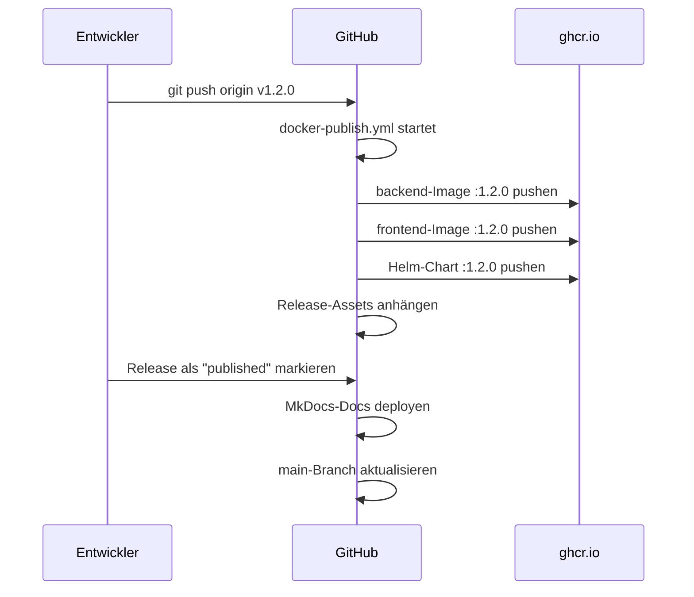

# CI/CD-Pipeline

Die Kamerplanter-CI/CD-Pipeline läuft vollständig auf **GitHub Actions**. Sie umfasst automatische Qualitätsprüfungen für Backend und Frontend, das Bauen und Veröffentlichen von Container-Images sowie die automatisierte Helm-Chart-Publikation. Releases werden durch Git-Tags ausgelöst und führen alle Schritte in der richtigen Reihenfolge aus.

---

## Voraussetzungen

- Schreibzugriff auf das GitHub-Repository (`nolte/kamerplanter`)
- Kein manuelles Einrichten von Secrets notwendig — alle Workflows nutzen das automatisch verfügbare `GITHUB_TOKEN`
- Container-Images werden in die **GitHub Container Registry (GHCR)** unter `ghcr.io/nolte/` gepusht

---

## Branch-Strategie

```
feature/* ──► develop ──► (Release-Tag v*) ──► main
```

| Branch | Zweck |
|--------|-------|
| `feature/*` | Entwicklungsarbeit; CI läuft bei Pull Requests auf `develop` |
| `develop` | Integrationsbranch; löst CI und Image-Build aus |
| `main` | Repräsentiert den aktuell stabilen Release-Stand; wird nach jedem Release automatisch aktualisiert |

!!! note "Hinweis"
    `main` wird nicht direkt für die Entwicklung verwendet. Commits landen über `develop` und Git-Tags auf `main`. Der Workflow `release-cd-refresh-master.yml` übernimmt diesen Schritt automatisch nach einem veröffentlichten Release.

---

## Übersicht der Workflows

| Datei | Auslöser | Zweck |
|-------|---------|-------|
| `backend.yml` | Push/PR auf `develop`, Pfad `src/backend/**` | Lint + Tests Backend |
| `frontend.yml` | Push/PR auf `develop`, Pfad `src/frontend/**` | Lint + Tests + Build Frontend |
| `docker-publish.yml` | Push auf `develop` oder `v*`-Tag | Container-Images + Helm-Chart bauen und publizieren |
| `skaffold-verify.yml` | PR auf `develop`, Pfad `skaffold.yaml`, `helm/**`, Dockerfiles | Helm-Lint + Skaffold-Diagnose |
| `release-drafter.yml` | Push auf `develop` | Release-Notes-Entwurf automatisch aktualisieren |
| `release-cd-deliver-docs.yml` | Veröffentlichtes Release | MkDocs-Dokumentation auf GitHub Pages deployen |
| `release-cd-refresh-master.yml` | Veröffentlichtes Release | `main`-Branch auf den Release-Stand aktualisieren |

---

## Backend-CI (`backend.yml`)

Der Backend-CI-Workflow läuft bei jedem Push auf `develop` und bei Pull Requests, sofern Dateien unter `src/backend/` geändert wurden.

### Was geprüft wird

1. **Ruff Lint** — prüft den Python-Code auf Stil- und Qualitätsprobleme (`ruff check .`)
2. **Ruff Format** — stellt sicher, dass der Code korrekt formatiert ist (`ruff format --check .`)
3. **Unit-Tests** — führt alle Tests unter `tests/unit/` mit pytest aus

```yaml title=".github/workflows/backend.yml (vereinfacht)"
jobs:
  lint-test:
    runs-on: ubuntu-latest
    steps:
      - uses: actions/setup-python@v5
        with:
          python-version: '3.14'
          allow-prereleases: true

      - name: Install dependencies
        run: pip install -e ".[dev]"

      - name: Ruff lint
        run: ruff check .

      - name: Ruff format check
        run: ruff format --check .

      - name: Unit tests
        run: pytest tests/unit/ -v --tb=short
```

!!! tip "Lokale Prüfung vor dem Push"
    ```bash
    cd src/backend
    ruff check .
    ruff format --check .
    pytest tests/unit/ -v --tb=short
    ```

### Abhängigkeiten installieren

Die Backend-Abhängigkeiten werden aus `pyproject.toml` installiert. Der `[dev]`-Extra enthält pytest, ruff und weitere Entwicklungswerkzeuge:

```bash
pip install -e ".[dev]"
```

---

## Frontend-CI (`frontend.yml`)

Der Frontend-CI-Workflow läuft bei jedem Push auf `develop` und bei Pull Requests, sofern Dateien unter `src/frontend/` geändert wurden.

### Was geprüft wird

1. **TypeScript-Prüfung** — strikter Typen-Check ohne Ausgabe (`tsc --noEmit`)
2. **ESLint** — Qualitätsprüfung des TypeScript/React-Codes
3. **Vitest** — alle Unit- und Komponenten-Tests
4. **Vite-Build** — stellt sicher, dass der Produktions-Build fehlerfrei kompiliert

```yaml title=".github/workflows/frontend.yml (vereinfacht)"
jobs:
  lint-test-build:
    runs-on: ubuntu-latest
    steps:
      - uses: actions/setup-node@v4
        with:
          node-version: 22
          cache: npm
          cache-dependency-path: src/frontend/package-lock.json

      - run: npm ci
      - run: npx tsc --noEmit
      - run: npm run lint
      - run: npm run test
      - run: npm run build
```

!!! tip "Lokale Prüfung vor dem Push"
    ```bash
    cd src/frontend
    npx tsc --noEmit
    npm run lint
    npm run test
    npm run build
    ```

### Build-Artefakt

Bei einem Push auf `develop` (nicht bei PRs) wird das fertige `dist/`-Verzeichnis als GitHub Actions Artefakt hochgeladen und für 7 Tage aufbewahrt. Das ermöglicht eine schnelle Inspektion des Build-Ergebnisses ohne lokales Kompilieren.

---

## Container-Build und -Publikation (`docker-publish.yml`)

Dieser Workflow baut und publiziert alle Container-Images sowie den Helm-Chart. Er wird ausgelöst durch:

- Push auf `develop` (wenn Backend-, Frontend- oder Helm-Dateien geändert wurden)
- Push eines `v*`-Tags (Release) — dann werden alle Komponenten gebaut, unabhängig von Pfadänderungen
- Manuell über `workflow_dispatch`

### Pfad-basiertes Filtern

Damit nicht bei jeder Änderung alle Images neu gebaut werden, ermittelt ein `changes`-Job zuerst, welche Komponenten betroffen sind:

```
src/backend/**  →  build-backend
src/frontend/** →  build-frontend
helm/**         →  publish-helm-charts
```

Bei einem `v*`-Tag oder manuellem Auslösen wird das Filtern übersprungen — es werden immer alle Komponenten gebaut.

### Backend-Image

Das Backend-Image basiert auf `python:3.14-slim` und wird als Single-Stage-Build erstellt:

```dockerfile title="src/backend/Dockerfile"
FROM python:3.14-slim AS base
WORKDIR /app
COPY pyproject.toml .
RUN pip install --no-cache-dir .
COPY . .
EXPOSE 8000
CMD ["uvicorn", "app.main:app", "--host", "0.0.0.0", "--port", "8000"]
```

Das Image wird nach `ghcr.io/nolte/kamerplanter-backend` gepusht.

### Frontend-Image

Das Frontend-Image verwendet einen zweistufigen Multi-Stage-Build: Zuerst wird die React-App mit Node.js 22 gebaut, dann werden die statischen Dateien in ein schlankes nginx-Image kopiert:

```dockerfile title="src/frontend/Dockerfile"
FROM node:22-alpine AS build
WORKDIR /app
COPY package.json package-lock.json ./
RUN npm ci
COPY . .
RUN npm run build

FROM nginx:1.27-alpine
COPY --from=build /app/dist /usr/share/nginx/html
COPY nginx.conf /etc/nginx/conf.d/default.conf
EXPOSE 80
```

Das Image wird nach `ghcr.io/nolte/kamerplanter-frontend` gepusht.

### Image-Tags

Docker-Metadata wird automatisch per `docker/metadata-action` erzeugt:

| Tag-Schema | Beispiel | Wann |
|-----------|---------|------|
| `latest` | `kamerplanter-backend:latest` | Push auf `develop` |
| Commit-SHA | `kamerplanter-backend:a3f7c2b` | Immer |
| Branch-Name | `kamerplanter-backend:develop` | Push auf Branch |
| Semantic Version | `kamerplanter-backend:1.2.0` | `v1.2.0`-Tag |
| Major.Minor | `kamerplanter-backend:1.2` | `v1.2.0`-Tag |

### Helm-Chart

Das Helm-Chart für Kamerplanter liegt unter `helm/kamerplanter/` und wird als OCI-Artefakt gepusht:

```
oci://ghcr.io/nolte/charts/kamerplanter
```

Bei einem Release-Tag wird die `version` und `appVersion` in `Chart.yaml` automatisch auf die Release-Version gesetzt, bevor das Chart gepackt wird. Gleichzeitig werden die Image-Tags in `values.yaml` von `latest` auf die konkrete Version umgestellt.

```bash
# Chart direkt verwenden
helm pull oci://ghcr.io/nolte/charts/kamerplanter --version 1.2.0
```

### Layer-Caching

Alle Image-Builds nutzen den GitHub Actions Cache (`type=gha`) für Docker-Layer. Das beschleunigt Folge-Builds erheblich, wenn sich nur wenige Schichten ändern.

---

## Skaffold-Verify (`skaffold-verify.yml`)

Dieser Workflow läuft bei Pull Requests auf `develop`, wenn `skaffold.yaml`, Helm-Dateien oder Dockerfiles geändert wurden. Er stellt sicher, dass die lokale Entwicklungsumgebung weiterhin funktionsfähig ist.

### Was geprüft wird

1. **`helm dependency build`** — lädt die Chart-Abhängigkeiten herunter (bjw-s common chart, valkey)
2. **`helm lint`** — prüft das Helm-Chart auf Syntaxfehler mit den Dev-Values
3. **`helm template`** — rendert alle Kubernetes-Manifeste und prüft die Templating-Logik
4. **`skaffold diagnose`** — validiert die Skaffold-Konfiguration
5. **`skaffold render`** — erzeugt gerenderte Manifeste und lädt sie als Artefakt hoch

!!! note "Skaffold ist nur für die lokale Entwicklung"
    Skaffold wird ausschließlich für die lokale Entwicklungsumgebung (Kind-Cluster) verwendet. Produktions-Deployments laufen nicht über Skaffold, sondern über den `docker-publish`-Workflow in Kombination mit dem Helm-Chart.

---

## Release-Prozess

Ein vollständiger Release besteht aus mehreren automatischen Schritten, die durch das Veröffentlichen eines GitHub-Releases ausgelöst werden.

### Schritt 1: Release-Entwurf vorbereiten (automatisch)

Der `release-drafter`-Workflow aktualisiert bei jedem Push auf `develop` automatisch einen Release-Entwurf mit den Änderungen seit dem letzten Tag.

### Schritt 2: Release-Tag setzen

```bash
git tag v1.2.0
git push origin v1.2.0
```

Das Tag löst `docker-publish.yml` aus und baut alle Images und den Helm-Chart mit der korrekten Versionsnummer.

### Schritt 3: Release veröffentlichen

Wenn das GitHub-Release als "published" markiert wird, laufen zwei weitere Workflows an:

**`release-cd-deliver-docs.yml`** — deployt die MkDocs-Dokumentation auf GitHub Pages über einen wiederverwendbaren Workflow aus `nolte/gh-plumbing`.

**`release-cd-refresh-master.yml`** — aktualisiert den `main`-Branch auf den Stand des neuen Release-Tags. `main` zeigt damit immer auf den zuletzt veröffentlichten stabilen Stand.

### Schritt 4: Release-Assets (automatisch)

Der `update-release-assets`-Job im `docker-publish`-Workflow hängt am Release folgende Dateien an:

- `docker-compose-1.2.0.yml` — versionierte Docker-Compose-Datei für Self-Hosting
- `.env.example-1.2.0` — Vorlage für Umgebungsvariablen
- Container-Image-Referenzen und Helm-Pull-Befehl im Release-Text

### Zusammenfassung Release-Ablauf



---

## GHCR-Pakete abrufen

Alle Images sind öffentlich lesbar. Für lokale Tests:

=== "Backend"

    ```bash
    docker pull ghcr.io/nolte/kamerplanter-backend:latest
    docker pull ghcr.io/nolte/kamerplanter-backend:1.2.0
    ```

=== "Frontend"

    ```bash
    docker pull ghcr.io/nolte/kamerplanter-frontend:latest
    docker pull ghcr.io/nolte/kamerplanter-frontend:1.2.0
    ```

=== "Helm-Chart"

    ```bash
    helm pull oci://ghcr.io/nolte/charts/kamerplanter --version 1.2.0
    helm install kamerplanter oci://ghcr.io/nolte/charts/kamerplanter --version 1.2.0
    ```

---

## Häufige Fragen

??? question "Warum schlägt der Backend-CI fehl, obwohl die Tests lokal laufen?"
    Stelle sicher, dass du Python 3.14 verwendest (`python --version`). Die CI verwendet explizit `python-version: '3.14'` mit `allow-prereleases: true`. Abweichende Python-Versionen können zu unterschiedlichem Verhalten führen. Prüfe auch, ob alle Abhängigkeiten mit `pip install -e ".[dev]"` installiert wurden.

??? question "Warum wird kein neues Image gebaut, obwohl ich auf develop gepusht habe?"
    Das Pfad-Filtern in `docker-publish.yml` stellt sicher, dass nur tatsächlich betroffene Komponenten gebaut werden. Wenn du z. B. nur eine Spec-Datei geändert hast, wird kein Image gebaut. Bei `v*`-Tags wird das Filtern umgangen.

??? question "Wie aktualisiere ich das Helm-Chart manuell?"
    Du kannst `docker-publish.yml` über `workflow_dispatch` manuell auslösen. Navigiere dazu in GitHub zu **Actions → Build & Publish Container Images → Run workflow**.

??? question "Wann wird main aktualisiert?"
    `main` wird ausschließlich automatisch durch `release-cd-refresh-master.yml` nach einem veröffentlichten Release aktualisiert. Direkte Pushes auf `main` sind nicht vorgesehen.

??? question "Wie sehe ich, welche Image-Version gerade läuft?"
    Die Image-Digest-Labels (`org.opencontainers.image.*`) sind in jedem Image eingebettet. Du kannst sie mit `docker inspect <image>` auslesen oder im GHCR-Package-Tab auf GitHub nachsehen.

---

## Siehe auch

- [Kubernetes-Deployment](kubernetes.md)
- [Helm-Chart-Konfiguration](helm.md)
- [Lokale Entwicklungsumgebung](../development/local-setup.md)
