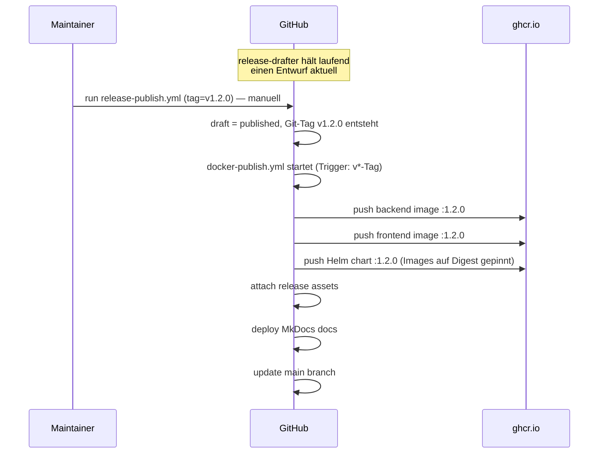
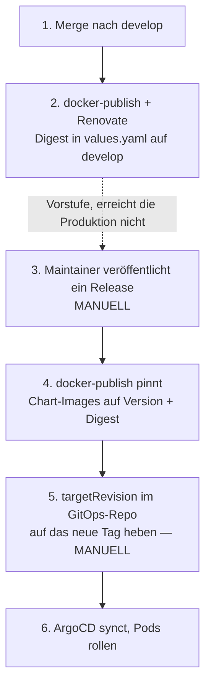

# CI/CD-Pipeline

Die Kamerplanter-CI/CD-Pipeline läuft vollständig auf **GitHub Actions**. Sie umfasst automatische Qualitätsprüfungen für Backend und Frontend, das Bauen und Veröffentlichen von Container-Images sowie die automatisierte Helm-Chart-Publikation. Ein Release stößt ein Maintainer von Hand an; danach laufen alle Schritte automatisch in der richtigen Reihenfolge ab.

---

## Voraussetzungen

- Schreibzugriff auf das GitHub-Repository (`nolte/kamerplanter`)
- Kein manuelles Einrichten von Secrets notwendig — alle Workflows nutzen das automatisch verfügbare `GITHUB_TOKEN`
- Container-Images werden in die **GitHub Container Registry (GHCR)** unter `ghcr.io/nolte/` gepusht

---

## Branch-Strategie

```
feature/* ──► develop ──► (Release-Tag v*) ──► main
```

| Branch | Zweck |
|--------|-------|
| `feature/*` | Entwicklungsarbeit; CI läuft bei Pull Requests auf `develop` |
| `develop` | Integrationsbranch; löst CI und Image-Build aus |
| `main` | Repräsentiert den aktuell stabilen Release-Stand; wird nach jedem Release automatisch aktualisiert |

!!! note "Hinweis"
    `main` wird nicht direkt für die Entwicklung verwendet. Commits landen über `develop` und Git-Tags auf `main`. Der Workflow `release-cd-refresh-master.yml` übernimmt diesen Schritt automatisch nach einem veröffentlichten Release.

---

## Übersicht der Workflows

| Datei | Auslöser | Zweck |
|-------|---------|-------|
| `backend.yml` | Push/PR auf `develop`, Pfad `src/backend/**` | Lint + Tests Backend |
| `frontend.yml` | Push/PR auf `develop`, Pfad `src/frontend/**` | Lint + Tests + Build Frontend |
| `docker-publish.yml` | Push auf `develop` oder `v*`-Tag | Container-Images + Helm-Chart bauen und publizieren |
| `skaffold-verify.yml` | PR auf `develop`, Pfad `skaffold.yaml`, `helm/**`, Dockerfiles | Helm-Lint + Skaffold-Diagnose |
| `release-drafter.yml` | Push auf `develop` | Release-Notes-Entwurf automatisch aktualisieren |
| `release-publish.yml` | **Nur manuell** (`workflow_dispatch`) | Einen Release-Entwurf veröffentlichen — der einzige Schritt, der ein Release entstehen lässt |
| `release-cd-deliver-docs.yml` | Veröffentlichtes Release | MkDocs-Dokumentation auf GitHub Pages deployen |
| `release-cd-refresh-master.yml` | Veröffentlichtes Release | `main`-Branch auf den Release-Stand aktualisieren |
| `chart-image-digest-freshness.yml` | Zeitplan, täglich 06:00 UTC | Meldet, wenn die Digests in `helm/kamerplanter/values.yaml` veraltet sind |
| `release-lag.yml` | Zeitplan, täglich 09:00 UTC (+ manuell) | Meldet, wenn `develop` Commits trägt, die kein **veröffentlichtes** Release enthält |

---

## Backend-CI (`backend.yml`)

Der Backend-CI-Workflow läuft bei jedem Push auf `develop` und bei Pull Requests, sofern Dateien unter `src/backend/` geändert wurden.

### Was geprüft wird

1. **Ruff Lint** — prüft den Python-Code auf Stil- und Qualitätsprobleme (`ruff check .`)
2. **Ruff Format** — stellt sicher, dass der Code korrekt formatiert ist (`ruff format --check .`)
3. **Unit-Tests** — führt alle Tests unter `tests/unit/` mit pytest aus

```yaml title=".github/workflows/backend.yml (vereinfacht)"
jobs:
  lint-test:
    runs-on: ubuntu-latest
    steps:
      - uses: actions/setup-python@v5
        with:
          python-version: '3.14'
          allow-prereleases: true

      - name: Install dependencies
        run: pip install -e ".[dev]"

      - name: Ruff lint
        run: ruff check .

      - name: Ruff format check
        run: ruff format --check .

      - name: Unit tests
        run: pytest tests/unit/ -v --tb=short
```

!!! tip "Lokale Prüfung vor dem Push"
    ```bash
    cd src/backend
    ruff check .
    ruff format --check .
    pytest tests/unit/ -v --tb=short
    ```

### Abhängigkeiten installieren

Die Backend-Abhängigkeiten werden aus `pyproject.toml` installiert. Der `[dev]`-Extra enthält pytest, ruff und weitere Entwicklungswerkzeuge:

```bash
pip install -e ".[dev]"
```

---

## Frontend-CI (`frontend.yml`)

Der Frontend-CI-Workflow läuft bei jedem Push auf `develop` und bei Pull Requests, sofern Dateien unter `src/frontend/` geändert wurden.

### Was geprüft wird

1. **TypeScript-Prüfung** — strikter Typen-Check ohne Ausgabe (`tsc --noEmit`)
2. **ESLint** — Qualitätsprüfung des TypeScript/React-Codes
3. **Vitest** — alle Unit- und Komponenten-Tests
4. **Vite-Build** — stellt sicher, dass der Produktions-Build fehlerfrei kompiliert

```yaml title=".github/workflows/frontend.yml (vereinfacht)"
jobs:
  lint-test-build:
    runs-on: ubuntu-latest
    steps:
      - uses: actions/setup-node@v4
        with:
          node-version: 22    # (1)!
          cache: npm
          cache-dependency-path: src/frontend/package-lock.json

      - run: npm ci
      - run: npx tsc --noEmit
      - run: npm run lint
      - run: npm run test
      - run: npm run build
```

1. Nur der `lint-test-build`-Job nutzt Node 22. Die `bundle-budget`- und `lighthouse`-Jobs im selben Workflow laufen auf Node 24 — passend zum Frontend-Dockerfile, das mit `node:24-alpine` baut (siehe [Frontend-Image](#frontend-image) unten).

!!! tip "Lokale Prüfung vor dem Push"
    ```bash
    cd src/frontend
    npx tsc --noEmit
    npm run lint
    npm run test
    npm run build
    ```

### Build-Artefakt

Bei einem Push auf `develop` (nicht bei PRs) wird das fertige `dist/`-Verzeichnis als GitHub Actions Artefakt hochgeladen und für 7 Tage aufbewahrt. Das ermöglicht eine schnelle Inspektion des Build-Ergebnisses ohne lokales Kompilieren.

### Performance-Budgets & CI-Gates (`bundle-budget`, `lighthouse`)

Zusätzlich zu `lint-test-build` laufen im selben Workflow zwei eigenständige Jobs, die die Frontend-Ladeperformance überwachen (interne Referenz: UI-NFR-003). Beide berühren nicht den required Check `static` — ein Verstoß fällt sichtbar auf, blockiert aber nicht den Automerge.

**`bundle-budget` — hartes Gate.** Der Job baut das Frontend und prüft danach mit `npm run bundle:check` (Skript `scripts/check-bundle-budget.mjs`) das initiale JavaScript- und CSS-Bundle sowie den dedizierten `/dashboard`-Route-Chunk gegen die Budgets in `bundle-budget.json`:

| Prüfung | Budget (gzip) | Gemessener IST-Wert |
|---|---|---|
| Initiales JavaScript-Bundle | 490 KB | ~471,8 KB |
| Initiales CSS-Bundle | 50 KB | unter Budget |
| `/dashboard`-Route-Chunk | 12 KB | unter Budget |

Eine Überschreitung lässt den Job fehlschlagen; der Bundle-Analyzer-Report (Treemap via `rollup-plugin-visualizer`) wird als Artefakt `bundle-stats` hochgeladen. Möglich wird dieses Budget durch eine `manualChunks`-Vendor-Strategie in `vite.config.ts`: React, MUI-Core, Redux Toolkit und react-i18next werden eager in stabile, langlebige Vendor-Chunks gruppiert, während schwere routen-gebundene Bibliotheken (`recharts`, `@mui/x-*`, `react-grid-layout`) lazy bleiben.

!!! note "300-KB-Ziel noch nicht erreicht"
    UI-NFR-003 formuliert für das initiale JavaScript-Bundle einen Zielwert von 300 KB gzip. Das aktuelle Budget von 490 KB sichert lediglich den gemessenen Ist-Stand gegen unbemerktes weiteres Wachstum ab, erreicht das Ziel aber noch nicht. Haupttreiber ist das eager geladene i18n-Übersetzungsbundle (~160 KB gzip). Das Erreichen des 300-KB-Ziels erfordert Lazy-Loading der Übersetzungen und ist als offener Folgeschritt vorgesehen. <!-- UI-NFR-003 R-013 -->

!!! tip "Lokale Prüfung vor dem Push"
    ```bash
    cd src/frontend
    npm run build
    npm run bundle:check
    ```

**`lighthouse` — Report-only.** Der Job führt `npm run lhci` (Lighthouse CI, mobile Emulation mit gedrosseltem 4G-Netzwerk) gegen den gebauten `dist/`-Ordner aus und prüft die Core-Web-Vitals-Schwellenwerte aus UI-NFR-003 (First Contentful Paint < 1,5 s, Largest Contentful Paint < 2,5 s, Time to Interactive < 3,5 s, Cumulative Layout Shift < 0,1, Total Blocking Time < 200 ms) sowie den Performance- und Accessibility-Score (≥ 0,9). Alle Assertions in `lighthouserc.json` sind auf `warn`-Stufe konfiguriert — der Job blockiert den Build also nicht, macht Regressionen aber im Report sichtbar. Der vollständige Bericht wird als Artefakt `lighthouse-report` hochgeladen.

---

## Container-Build und -Publikation (`docker-publish.yml`)

Dieser Workflow baut und publiziert alle Container-Images sowie den Helm-Chart. Er wird ausgelöst durch:

- Push auf `develop` (wenn Backend-, Frontend- oder Helm-Dateien geändert wurden)
- Push eines `v*`-Tags (Release) — dann werden alle Komponenten gebaut, unabhängig von Pfadänderungen
- Manuell über `workflow_dispatch`

### Pfad-basiertes Filtern

Damit nicht bei jeder Änderung alle Images neu gebaut werden, ermittelt ein `changes`-Job zuerst, welche Komponenten betroffen sind:

```
src/backend/**  →  build-backend
src/frontend/** →  build-frontend
helm/**         →  publish-helm-charts
```

Bei einem `v*`-Tag oder manuellem Auslösen wird das Filtern übersprungen — es werden immer alle Komponenten gebaut.

### Backend-Image

Das Backend-Image basiert auf `python:3.14-slim` und nutzt ein Multi-Stage-Dockerfile mit einer gemeinsamen `base`-Stage sowie getrennten `dev`- und `prod`-Zielen (`docker build .` ohne `--target` baut standardmäßig `prod`, da es die letzte Stage ist). Die `dev`-Stage läuft als root für Skaffold-Hot-Reload; die `prod`-Stage läuft als nicht-root Nutzer (UID 1000):

```dockerfile title="src/backend/Dockerfile (vereinfacht, prod-Stage)"
FROM python:3.14-slim AS base
WORKDIR /app
COPY pyproject.toml requirements.txt requirements-dev.txt ./

FROM base AS prod
RUN pip install --no-cache-dir --require-hashes -r requirements.txt \
    && pip install --no-cache-dir --no-deps .
COPY . .
RUN groupadd -g 1000 app && useradd -u 1000 -g 1000 -d /app -s /usr/sbin/nologin app \
    && chown -R 1000:1000 /app
USER 1000
EXPOSE 8000
CMD ["uvicorn", "app.main:app", "--host", "0.0.0.0", "--port", "8000"]
```

Das Image wird nach `ghcr.io/nolte/kamerplanter-backend` gepusht. Abhängigkeiten kommen ausschließlich aus den Hash-gepinnten `requirements*.txt`-Locks (NFR-009), nicht direkt aus `pyproject.toml`.

### Frontend-Image {#frontend-image}

Das Frontend-Image verwendet ebenfalls ein Multi-Stage-Dockerfile: Zuerst wird die React-App mit Node.js 24 gebaut, dann werden die statischen Dateien in ein schlankes, **unprivilegiertes** nginx-Image kopiert (läuft nicht als root, kompatibel mit `runAsNonRoot`):

```dockerfile title="src/frontend/Dockerfile (vereinfacht)"
FROM node:24-alpine AS build
WORKDIR /app
COPY package.json package-lock.json ./
RUN npm ci
COPY . .
RUN npm run build

FROM nginxinc/nginx-unprivileged:1.31-alpine AS prod
COPY --from=build /app/dist /usr/share/nginx/html
COPY nginx.conf /etc/nginx/conf.d/default.conf
EXPOSE 8080
```

Das Image wird nach `ghcr.io/nolte/kamerplanter-frontend` gepusht. Der interne Port ist `8080` (unprivilegiertes nginx darf nicht an Port 80 binden), gemappt auf den öffentlichen Port 8080 in Docker Compose bzw. Port 80 im Helm-Chart-Service.

### Image-Tags

Docker-Metadata wird automatisch per `docker/metadata-action` erzeugt:

| Tag-Schema | Beispiel | Wann |
|-----------|---------|------|
| `latest` | `kamerplanter-backend:latest` | Push auf `develop` |
| Commit-SHA | `kamerplanter-backend:a3f7c2b` | Immer |
| Branch-Name | `kamerplanter-backend:develop` | Push auf Branch |
| Semantic Version | `kamerplanter-backend:1.2.0` | `v1.2.0`-Tag |
| Major.Minor | `kamerplanter-backend:1.2` | `v1.2.0`-Tag |

!!! warning "`latest` ist eine bewegliche Referenz"

    `latest` wird bei jedem Push auf `develop` überschrieben und zeigt danach auf
    andere Bytes. Für alles, was reproduzierbar sein muss — Deployments,
    Rollbacks, Fehleranalyse — brauchst du eine Referenz, die stehen bleibt. Das
    Helm-Chart benutzt deshalb seit #987 keinen beweglichen Tag mehr, sondern
    einen unveränderlichen Digest: [Deployment und Rollback](#deployment-und-rollback).

    Wie teuer das ohne Digest ist, ist gemessen und nicht behauptet: mit
    `pullPolicy: IfNotPresent` — genau der Wert, den das Chart setzt — liefert
    ein Node nach `rollout restart` **weiter das alte Image**, obwohl die
    Registry unter demselben Tag längst andere Bytes ausliefert. Kubernetes
    erzwingt `Always` für ein `:latest` nur, solange `imagePullPolicy` *nicht*
    gesetzt ist; ein explizit gesetztes `IfNotPresent` gewinnt. So hat der
    `inference-service` wochenlang ein Image ohne die `/pest/*`-Routen bedient.

### Was jedes Artefakt absichert

Jede Artefaktklasse, die dieses Projekt ausliefert, braucht eine benannte Stage,
die sie absichert — sonst wird eine Lücke erst dann sichtbar, wenn sie ausgenutzt
wird. Die folgende Matrix ist die Antwort auf die Frage „was garantiert
eigentlich wer?" und wird beim Ändern der Pipeline mitgepflegt.

| Artefaktklasse | Sichernde Stage | Garantien |
|---|---|---|
| Container-Images (8 Stück) | `build-*` in `docker-publish.yml` | aus der Quelle gebaut, Integrität (Digest), Provenance (signiert) |
| Helm-Chart (OCI) | `publish-helm-charts` | aus der Quelle gebaut, Integrität (Digest), Provenance (signiert) |
| `openapi.json` (Release-Asset) | `openapi-asset` in `release-publish.yml` | aus der Quelle gebaut, Anhang wird nach dem Upload verifiziert |
| `docker-compose-<version>.yml`, `.env.example-<version>` | `update-release-assets` | aus der Quelle gebaut |
| Python-Abhängigkeiten | `pip-audit`, `pip-licenses`, `lock-staleness` in `backend.yml` | Policy geprüft (CVE, Lizenz, Lock-Integrität) |

**Bekannte Lücken** — bewusst offen, nicht übersehen:

- Die drei Release-Assets tragen **keine** Provenance. Für die von GitHub
  gehosteten Release-Dateien gibt es keinen Verifikationspfad, der dem
  Registry-Attest entspricht.
- Für JavaScript-Abhängigkeiten gibt es noch keine eigene Policy-Stage; Trivy
  deckt sie nur auf Stufe `CRITICAL` ab.

#### Provenance prüfen

Images und Chart tragen von der Plattform erzeugte und signierte Build-Provenance
(`actions/attest-build-provenance`). Vor einem Deployment prüfbar mit:

```bash
gh attestation verify \
  oci://ghcr.io/nolte/kamerplanter-backend:1.2.0 \
  --repo nolte/kamerplanter
```

Was das aussagt und was nicht: Provenance belegt die **Herkunft** — welcher
Commit, welcher Workflow-Lauf, welche gepinnten Eingaben. Sie ist **keine**
Aussage darüber, dass ein Artefakt sicher ist. Sicherheitsbefunde bleiben Sache
der Supply-Chain-Stages.

### Helm-Chart

Das Helm-Chart für Kamerplanter liegt unter `helm/kamerplanter/` und wird als OCI-Artefakt gepusht:

```
oci://ghcr.io/nolte/charts/kamerplanter
```

Bei einem Release-Tag werden `version` und `appVersion` in `Chart.yaml` automatisch auf die Release-Version gesetzt, bevor das Chart gepackt wird. Auf jedem anderen Ref greift dieser Rewrite **nicht** — dort wird die Version gepackt, die im Baum steht, und `develop` hat dafür einen eigenen Kanal (siehe [Zwei Kanäle](#zwei-kanaele)). Gleichzeitig pinnt `scripts/ci/pin_chart_image_digests.sh` jedes Kamerplanter-Image in `values.yaml` auf `<version>@sha256:<digest>` — adressiert über den YAML-Pfad, nicht über eine Textersetzung des Literals `tag: latest`. Derselbe Lauf liest die Datei anschließend erneut und bricht das Release ab, falls ein Kamerplanter-Image die Umstellung überlebt hat.

Der Digest wird dabei aus der Registry aufgelöst, nicht aus den Build-Jobs durchgereicht. Das prüft nebenbei, dass `<image>:<version>` überhaupt existiert — deshalb hängt `publish-helm-charts` seit #987 per `needs:` hinter den Image-Builds. Und es ist der Unterschied zwischen „unveränderlich" und „unveränderlich per Konvention": ein Versions-Tag lässt sich neu pushen, ein Digest nicht.

!!! info "Warum nicht nur die Version?"

    Bis #987 pinnte dieser Schritt den nackten Versions-Tag. Das war besser als
    das `:latest` im develop-Stand, aber ein Tag bleibt eine Referenz auf einen
    Namen: wird der Publish-Workflow für ein bestehendes Tag erneut ausgeführt,
    zeigt derselbe Name auf andere Bytes, und kein Konsument kann das bemerken.

#### Zwei Kanäle: `develop` und Release {#zwei-kanaele}

Unter derselben OCI-Adresse liegen zwei Sorten von Tags, und sie bedeuten
Verschiedenes:

| Kanal | Version im Baum | Veröffentlichter OCI-Tag | Lebensdauer |
|-------|-----------------|--------------------------|-------------|
| `develop` | eine Vorabversion mit dem Zusatz `-dev`, derzeit `0.2.1-dev` | `charts/kamerplanter:0.2.1-dev` | wird bei **jedem** `helm/`-Merge überschrieben |
| Release | reine Version, vom Tag gesetzt | `charts/kamerplanter:0.1.0` | gehört genau einem Release und wird nicht neu gepusht — mit einer gemessenen Ausnahme, siehe unten |

<!-- Quelle: helm/kamerplanter/Chart.yaml, scripts/check_chart_develop_version.py, scripts/ci/determine_chart_version.sh -->

Zwei Dinge, die die Tabelle nicht sagt und die man leicht falsch liest:

- **Am `-dev`-Wert ist nur der Bezeichner `dev` erzwungen, nicht die Nummer
  davor.** `0.2.1-dev` benennt das beabsichtigte nächste Release, ist aber keine
  Zusage: Sobald `v0.2.1` erscheint, sortiert `0.2.1-dev` *unter* dem Release,
  und kein Turnus hebt den Wert an. Nötig ist das auch nicht — die Kollision
  bleibt bei jeder `-dev`-Nummer unmöglich, und genau das ist der Grund, warum
  die Prüfung nichts Stärkeres verlangt.
- **Der Beispiel-Tag in der Release-Zeile ist `0.1.0` und nicht `0.2.0`.**
  `0.1.0` trägt im Manifest noch den Zeitstempel seines Releases (`created`
  06.08.2026 um 13:38:04 UTC, 15 Sekunden nach der Veröffentlichung von
  `v0.1.0`), `0.2.0` dagegen den eines `develop`-Builds. `0.2.0` ist damit der
  eine Release-Tag, für den die Spalte „Lebensdauer" nicht gilt — der Vorfall
  weiter unten, unrepariert und deshalb kein Beispiel für die Regel.
  <!-- #1222 -->

Die beiden Kanäle sind **disjunkt**, und das wird an beiden Enden erzwungen —
nicht als Konvention, sondern als Prüfung:

- `scripts/check_chart_develop_version.py` läuft als Hook im Pflicht-Check
  `static` und weist jede Chart-Version im Baum zurück, deren erster
  Vorab-Bezeichner nicht exakt `dev` lautet. Der `develop`-Baum kann damit keine
  Version tragen, die ein Release je publizieren würde.
- `scripts/ci/determine_chart_version.sh` weist umgekehrt ein Release-Tag ab,
  das den Vorab-Bezeichner `dev` trägt, und zwar bevor gepackt und gepusht wird.
  `v0.3.0-dev` ist deshalb kein gültiges Release-Tag. `v0.3.0-rc1` und
  `v0.3.0-beta.1` bleiben erlaubt — sie können mit dem `develop`-Kanal nicht
  kollidieren.

!!! danger "Kein Deployment zeigt auf den `-dev`-Kanal"

    Der `-dev`-Tag wird bei jedem `helm/`-Merge nach `develop` mit anderen Bytes
    überschrieben. Das ist sein Zweck, kein Defekt. Ein `targetRevision`, ein
    `--version` oder ein `image.tag`, der darauf zeigt, ist deshalb kein fester
    Stand: Der ausgerollte Inhalt ändert sich, ohne dass sich im
    GitOps-Repository irgendetwas ändert — und niemand sieht einen Diff.
    Verankere ausschließlich eine reine Release-Version oder den
    Manifest-Digest.

    Warum es diese Trennung gibt, gemessen: Bis zum 18.08.2026 trug der
    `develop`-Baum die Version `0.2.0` — die Version eines *veröffentlichten*
    Releases. Der Chart-Tag `charts/kamerplanter:0.2.0` wurde am 13.08.2026 mit
    dem Release `v0.2.0` publiziert und fünf Tage später aus `develop` erneut
    überschrieben, mit anderem Inhalt unter derselben Versionsreferenz. Ein
    Konsument konnte das nicht bemerken; sichtbar wurde es erst beim Vergleich
    des Zeitstempels `org.opencontainers.image.created` am OCI-Manifest mit dem
    Veröffentlichungsdatum des Releases.
    <!-- #1222 -->

```bash
# Chart direkt verwenden — immer eine veröffentlichte Version, nie eine -dev
helm pull oci://ghcr.io/nolte/charts/kamerplanter --version 1.2.0
```

### Layer-Caching

Alle Image-Builds nutzen den GitHub Actions Cache (`type=gha`) für Docker-Layer. Das beschleunigt Folge-Builds erheblich, wenn sich nur wenige Schichten ändern.

---

## Skaffold-Verify (`skaffold-verify.yml`)

Dieser Workflow läuft bei Pull Requests auf `develop`, wenn `skaffold.yaml`, Helm-Dateien oder Dockerfiles geändert wurden. Er stellt sicher, dass die lokale Entwicklungsumgebung weiterhin funktionsfähig ist.

### Was geprüft wird

1. **`helm dependency build`** — lädt die Chart-Abhängigkeiten herunter (bjw-s common chart, valkey)
2. **`helm lint`** — prüft das Helm-Chart auf Syntaxfehler mit den Dev-Values
3. **`helm template`** — rendert alle Kubernetes-Manifeste und prüft die Templating-Logik
4. **`skaffold diagnose`** — validiert die Skaffold-Konfiguration
5. **`skaffold render`** — erzeugt gerenderte Manifeste und lädt sie als Artefakt hoch

!!! note "Skaffold ist nur für die lokale Entwicklung"
    Skaffold wird ausschließlich für die lokale Entwicklungsumgebung (Kind-Cluster) verwendet. Produktions-Deployments laufen nicht über Skaffold, sondern über den `docker-publish`-Workflow in Kombination mit dem Helm-Chart.

---

## Release-Prozess

Ein Release ist der Schritt, mit dem aus einem Stand auf `develop` eine ausgelieferte Version wird. Er läuft **nicht** automatisch an: Ein Mensch stößt ihn an, und alles danach ist automatisch.

!!! danger "Ein Entwurf ist keine Auslieferung"

    `release-drafter.yml` läuft bei **jedem** Push auf `develop` und hält einen
    Release-Entwurf aktuell. `release-publish.yml` läuft dagegen **nur** über
    `workflow_dispatch`. Das sichtbarste Release-Artefakt des Repositories ist
    deshalb dauerhaft ein *Entwurf* — er trägt eine Versionsnummer, listet die
    Änderungen und liest sich wie ein fertiges Release, hat aber kein Git-Tag,
    ist über die API nicht als Release abrufbar und liegt auf keinem
    Auslieferungspfad. Solange niemand ihn veröffentlicht, ist kein einziger
    Commit ausgeliefert.

    Genau diese Lage ist gemessen worden: Ein Entwurf `v0.2.1` existierte seit
    dem 13.08.2026; am 14.08. wurde eine Fehlerbehebung nach `develop` gemergt;
    am 16.08. lief in der Instanz weiterhin der Stand von davor. Das jüngste
    *veröffentlichte* Release war die ganze Zeit `v0.2.0`. Beobachtet wird das
    seitdem von [`release-lag.yml`](#pruefungen-auslieferungskette).

    War der Entwurf absichtlich zurückgehalten? Nein — das ist inzwischen
    aktenkundig beantwortet. Der von `release-lag.yml` erzeugte Alarm (#1229)
    feuerte am 19.08.2026; `v0.2.1` wurde noch am selben Tag veröffentlicht, und
    #1229 schloss sich am 20.08.2026 automatisch, weil die Prüfung danach
    wieder grün war. Das war ein **Versäumnis im Ablauf**, kein absichtliches
    Zurückhalten.
    <!-- #1210 -->

### Schritt 1: Release-Entwurf vorbereiten (automatisch)

Der `release-drafter`-Workflow aktualisiert bei jedem Push auf `develop` automatisch einen Release-Entwurf mit den Änderungen seit dem letzten Tag. Er schlägt dabei auch die nächste Versionsnummer vor.

### Schritt 2: Release veröffentlichen (manuell — der eine Handgriff)

Ein Maintainer startet `release-publish.yml` von Hand: **Actions → Release Publish → Run workflow**, mit dem Tag des offenen Entwurfs. Sinnvollerweise zuerst mit `dry_run: true` — das validiert, ohne den Entwurf umzustellen.

```bash
# Äquivalent über die CLI
gh workflow run release-publish.yml -f tag=v1.2.0 -f dry_run=true
gh workflow run release-publish.yml -f tag=v1.2.0
```

Das Veröffentlichen ist der Moment, in dem das Git-Tag überhaupt erst entsteht — ein Entwurf hat keins.

### Schritt 3: Was am veröffentlichten Release hängt (automatisch)

Das entstehende `v*`-Tag löst `docker-publish.yml` aus: Alle Images und der Helm-Chart werden mit der Release-Versionsnummer gebaut, und `scripts/ci/pin_chart_image_digests.sh` pinnt jedes Kamerplanter-Image in den Chart-Values auf `<version>@sha256:<digest>`.

Parallel starten am Ereignis „Release veröffentlicht" zwei weitere Workflows:

**`release-cd-deliver-docs.yml`** — deployt die MkDocs-Dokumentation auf GitHub Pages über einen wiederverwendbaren Workflow aus `nolte/gh-plumbing`.

**`release-cd-refresh-master.yml`** — aktualisiert den `main`-Branch auf den Stand des neuen Release-Tags. `main` zeigt damit immer auf den zuletzt veröffentlichten stabilen Stand.

### Schritt 4: Release-Assets (automatisch)

Der `update-release-assets`-Job im `docker-publish`-Workflow hängt am Release folgende Dateien an:

- `docker-compose-1.2.0.yml` — versionierte Docker-Compose-Datei für Self-Hosting
- `.env.example-1.2.0` — Vorlage für Umgebungsvariablen
- Container-Image-Referenzen und Helm-Pull-Befehl im Release-Text

### Zusammenfassung Release-Ablauf

<!-- diagram-source: measured against .github/workflows/release-publish.yml (workflow_dispatch only), release-drafter.yml, docker-publish.yml (tags: v*), release-cd-*.yml -->

```mermaid
sequenceDiagram
    participant Dev as Maintainer
    participant GH as GitHub
    participant GHCR as ghcr.io

    Note over GH: release-drafter hält laufend<br/>einen Entwurf aktuell
    Dev->>GH: run release-publish.yml (tag=v1.2.0) — manuell
    GH->>GH: draft = published, Git-Tag v1.2.0 entsteht
    GH->>GH: docker-publish.yml startet (Trigger: v*-Tag)
    GH->>GHCR: push backend image :1.2.0
    GH->>GHCR: push frontend image :1.2.0
    GH->>GHCR: push Helm chart :1.2.0 (Images auf Digest gepinnt)
    GH->>GH: attach release assets
    GH->>GH: deploy MkDocs docs
    GH->>GH: update main branch
```

---

## Deployment und Rollback

Ein Cluster erfährt **nicht** dadurch von einer neuen Version, dass ein Tag umgebogen wird. Das Chart referenziert jedes Kamerplanter-Image über einen unveränderlichen Digest:

```yaml
image:
  repository: ghcr.io/nolte/kamerplanter-backend
  tag: latest@sha256:af9bec…   # (1)!
  pullPolicy: IfNotPresent      # (2)!
```

1. Entscheidend ist der Teil **nach** dem `@`. Der Digest ist inhaltsadressiert und kann sich nicht bewegen. Das `latest` davor ist hier keine bewegliche Referenz, sondern ein Etikett, aus welchem Kanal der Digest stammt — aufgelöst wird es von niemandem. Es steht in derselben Zeile, weil Renovate genau diese Schreibweise pflegt (siehe unten). Im Release-Chart steht an dieser Stelle die Release-Version statt `latest`, weil `pin_chart_image_digests.sh` sie beim Packen einsetzt — der Digest dahinter bleibt das Entscheidende.
2. Bleibt bewusst `IfNotPresent`. Ein Digest ist inhaltsadressiert: Ein Image, das auf dem Node liegt, **ist** das angeforderte — ein erneuter Pull könnte das nur bestätigen. `Always` würde jeden Pod-Start von der Erreichbarkeit der GHCR abhängig machen und nichts gewinnen.

### So kommt eine neue Version in die Produktion {#so-kommt-eine-neue-version-in-die-produktion}

Die Produktions-Instanz rollt **ausschließlich Release-Versionen** aus. Das ist eine Betriebsentscheidung und nicht bloß der zufällige Ist-Zustand: Die ArgoCD-`Application` verankert den Chart an einem Release-Tag, nicht an einem Branch.


```mermaid
graph TD
    A[1. Merge nach develop] --> B[2. docker-publish + Renovate<br/>Digest in values.yaml auf develop]
    B -.Vorstufe, erreicht die Produktion nicht.-> C
    C[3. Maintainer veröffentlicht ein Release<br/>MANUELL] --> D[4. docker-publish pinnt<br/>Chart-Images auf Version + Digest]
    D --> E[5. targetRevision im GitOps-Repo<br/>auf das neue Tag heben — MANUELL]
    E --> F[6. ArgoCD synct, Pods rollen]
```

Ausgeschrieben sind das sechs Sprünge, und jeder gehört einem anderen Akteur:

1. **Merge nach `develop`** — der Commit, der den Code ändert. Ein Mensch.
2. **`docker-publish.yml`** baut die Images und pusht sie; **Renovate** schreibt
   die neuen Digests über den gruppierten Pull Request `kamerplanter images`
   nach `helm/kamerplanter/values.yaml` auf `develop`. Das ist die **Vorstufe**:
   Sie hält den Entwicklungsstand konsistent, **erreicht die Produktion aber
   nicht**.
3. **Ein Maintainer schneidet ein Release** — von Hand, über
   `release-publish.yml`. **Der erste manuelle Sprung.** Passiert er nicht, ist
   nichts von Schritt 1 und 2 ausgeliefert, egal wie lange es her ist.
4. **`docker-publish.yml`** läuft auf dem entstandenen `v*`-Tag und pinnt über
   `scripts/ci/pin_chart_image_digests.sh` jedes Kamerplanter-Image in den
   Chart-Values auf `<version>@sha256:<digest>`.
5. **`targetRevision` im GitOps-Repository wird auf das neue Tag gehoben** —
   ebenfalls von Hand, in `nolte/k8s-home-lab`, also **außerhalb dieses
   Repositories**. **Der zweite manuelle Sprung**, und der einzige, den kein
   Workflow dieses Repositories überhaupt sehen kann.
6. **ArgoCD** synct den neuen Stand. Die Pods rollen, weil sich die Pod-Spec
   geändert hat — nicht, weil jemand einen Neustart ausgelöst hat.

!!! warning "Zwei der sechs Sprünge tut ein Mensch"

    Sprung 3 (Release veröffentlichen) und Sprung 5 (`targetRevision` heben)
    sind keine Automatik. Beide sind Handgriffe eines Maintainers, beide können
    vergessen werden, und beide sehen von außen aus wie nichts — es gibt keinen
    roten Lauf, keine offene Pull Request, kein Artefakt, das fehlt. Ein
    gemergter Fix ist deshalb **kein ausgelieferter Fix**.

    Wie weit das auseinanderlaufen kann, ist messbar: Am 17.08.2026 verankerte
    die Produktions-`Application` das Chart auf `v0.1.0` (veröffentlicht am
    06.08.), während das jüngste veröffentlichte Release bereits `v0.2.0` war.

Der Deploy selbst ist also ein **Commit** — im GitOps-Repository —, kein Handgriff am Cluster. Dass die Digests in den Chart-Values überhaupt vorhanden und wohlgeformt sind, sichert `scripts/check_chart_image_digests.py` im Pflicht-Check `static` ab; ob sie noch *aktuell* sind, beantwortet erst der tägliche Lauf von `chart-image-digest-freshness.yml` (siehe [Prüfungen entlang der Auslieferungskette](#pruefungen-auslieferungskette)).

### Rollback

Ein Rollback ist ein Commit im **GitOps-Repository**: `targetRevision` zurück auf das vorherige Release-Tag setzen.

```yaml
- path: helm/kamerplanter
  repoURL: https://github.com/nolte/kamerplanter.git
  targetRevision: v0.1.0   # statt v0.2.0
```

ArgoCD synct das Chart aus dem älteren Tag — mitsamt der Digests, die dieses Tag pinnt — und die Pods rollen zurück. Prüfe das Ergebnis **im laufenden Pod**, nicht in der Values-Datei und nicht am Controller-Status:

```bash
kubectl get pod -n kamerplanter -l app.kubernetes.io/name=backend \
  -o jsonpath='{range .items[*]}{.metadata.name}{"  "}{.status.containerStatuses[0].imageID}{"\n"}{end}'
```

`imageID` nennt den Digest, den der Kubelet tatsächlich gestartet hat. Er muss zu dem passen, den die Chart-Values unter dem zurückgesetzten Tag pinnen.

!!! danger "Nicht am laufenden Cluster editieren"

    `syncPolicy.automated.selfHeal: true` macht jede `kubectl edit`- oder
    `kubectl set image`-Änderung binnen Minuten rückgängig. Ein Rollback, der
    nicht im Git steht, ist kein Rollback, sondern eine Verzögerung.

!!! warning "Was ein Hotfix wirklich kostet"

    Ein Hotfix ist erst live, wenn beide manuellen Sprünge getan sind: Release
    veröffentlichen **und** `targetRevision` heben. Ein gemergter Pull Request
    allein bewegt in der Produktion nichts — auch dann nicht, wenn `develop`
    längst grün ist und die Registry die neuen Bytes hat. Der frühere Weg
    (`workflow_dispatch` + `kubectl rollout restart`) ist keine Abkürzung: Er
    hat, wie oben gemessen, ohnehin nie zuverlässig ein neues Image gezogen.

### Produktion: die `Application` liegt im GitOps-Repository

Die ArgoCD-`Application` für den Talos-Cluster liegt **nicht** in diesem Repository, sondern in `k8s-home-lab` (`src/applications/kamerplanter/deploy/argocd/application.yaml`). Sie zieht das Chart nicht aus der Registry, sondern direkt aus dem Quell-Repository:

```yaml
- path: helm/kamerplanter                              # (1)!
  repoURL: https://github.com/nolte/kamerplanter.git
  targetRevision: v0.1.0                               # (2)!
```

1. Der Chart-Ordner im Git-Baum — nicht das OCI-Artefakt `oci://ghcr.io/nolte/charts/kamerplanter`.
2. Ein **Release-Tag**, kein Branch. Nur ein veröffentlichtes Release kann hier stehen, und niemand hebt diesen Wert automatisch an.

!!! info "Nur Release-Versionen — bewusst so"

    Diese Instanz rollt **ausschließlich Release-Versionen** aus. Ein Commit auf
    `develop` erreicht sie nicht, auch dann nicht, wenn er
    `helm/kamerplanter/**` berührt: Der Anker ist ein Tag, und ein Tag bewegt
    sich nicht, weil jemand mergt.

    Das ist der gewollte Zustand, keine Momentaufnahme. Der Preis dafür ist die
    Latenz: Zwischen „gemergt" und „läuft" liegen die beiden manuellen Sprünge
    aus [So kommt eine neue Version in die
    Produktion](#so-kommt-eine-neue-version-in-die-produktion). Wer nach einem
    Merge im Cluster den neuen Stand erwartet, sucht am falschen Ort — dort
    läuft das Release, auf das `targetRevision` zeigt, und das kann mehrere
    Releases hinterherhinken.

#### Wofür ein Release da ist {#wofuer-ein-release}

Ein Release ist gleichzeitig das Auslieferungsvehikel dieser Instanz **und** die Verpackung für alle anderen. Was daran hängt:

| Ergebnis | Für wen |
|---|---|
| Der Anker, auf den `targetRevision` im GitOps-Repository gehoben werden **kann** | die Produktions-Instanz — der Sprung selbst bleibt ein Handgriff |
| Chart-Paket `oci://ghcr.io/nolte/charts/kamerplanter:<version>`, mit Images auf `<version>@sha256:<digest>` gepinnt | Self-Hoster und fremde Cluster — siehe [ArgoCD](argocd.md) |
| `docker-compose-<version>.yml`, `.env.example-<version>`, `openapi.json` als Release-Assets | Self-Hosting ohne Kubernetes, API-Clients |
| MkDocs-Dokumentation auf GitHub Pages (`release-cd-deliver-docs.yml`) | Leser dieser Seite |
| `main` auf den Release-Stand gesetzt (`release-cd-refresh-master.yml`) | alle, die einen stabilen Referenz-Branch brauchen |

#### Invariante: kein `image.tag` im Overlay {#invariante-kein-image-tag}

**Ein Overlay, das diese Instanz konfiguriert, trägt keine per-Controller-`image.tag`-Overrides.** Das ist keine Empfehlung, sondern die Bedingung, unter der der Digest-Pin überhaupt trägt.

Die Arbeitsteilung ist: `targetRevision` wählt die **Chart-Version**, das Chart wählt die **Bytes**. Ein `image.tag` im Overlay bricht die zweite Hälfte auf.

!!! danger "Die Invariante gilt auch unter einem Release-Tag"

    Der Digest-Pin ist keine Eigenschaft des Branches, sondern des Charts:
    `scripts/ci/pin_chart_image_digests.sh` schreibt die Digests **in** die
    Chart-Values, bevor das Release-Chart gepackt wird. Ein `image.tag`-Override
    gewinnt gegen diesen Default — unabhängig davon, ob `targetRevision` auf
    einen Branch oder auf ein Release-Tag zeigt. Er ersetzt den Digest durch
    eine bewegliche Referenz, und `pullPolicy: IfNotPresent` heißt dann: „nimm,
    was auf dem Node im Cache liegt". Damit hängt die Auslieferung wieder daran,
    was ein einzelner Knoten zufällig schon einmal gezogen hat — und das Anheben
    von `targetRevision` bewirkt nichts mehr.

Die Konsequenz ist zweimal gemessen worden, nicht befürchtet:

- Im ersten Vorfall (intern verfolgt als Ticket 1024) behielt ein `rollout
  restart` still ein altes Image; der `inference-service` bediente wochenlang
  einen Stand ohne die `/pest/*`-Routen. <!-- #1024 -->
- Im zweiten (intern verfolgt als Ticket 1210) fuhr die Produktions-Instanz am
  17.08.2026 unter einem `v0.1.0`-Chart die Images `0.0.23` — sechs
  `image.tag`-Overrides im Overlay hatten die Digests des Charts ersetzt. Dem
  laufenden Backend fehlte deshalb das Feld `supported_majors` auf
  `/api/health`, das am 15.08. dazukam: Das ausgelieferte Image war rund einen
  Monat älter als das Chart, unter dem es lief. <!-- #1210 -->

Beide Male sah die Lage von außen gesund aus: Registry, Chart und
Controller-Status waren einer Meinung. Nur der laufende Container war es nicht.
Deshalb ist der Beweis immer der Blick **in den Pod**, nie in die Values-Datei.

Die Invariante steht im Klartext neben den Digests, die sie schützt — in
[`helm/kamerplanter/values.yaml`](https://github.com/nolte/kamerplanter/blob/develop/helm/kamerplanter/values.yaml)
und im Overlay selbst. Ändere sie dort, nicht hier.

### Prüfungen entlang der Auslieferungskette {#pruefungen-auslieferungskette}

Die sechs Sprünge fallen **unabhängig voneinander** aus. Eine Prüfung über einen Übergang sagt deshalb nichts über die anderen aus:

| Übergang | Frage | Prüfung |
|---|---|---|
| GHCR → Chart-Pin auf `develop` | Ist der Digest in `values.yaml` noch der aktuelle? | `chart-image-digest-freshness.yml`, täglich 06:00 UTC |
| `develop` → veröffentlichtes Release | Trägt `develop` Commits, die kein veröffentlichtes Release enthält — und wie lange schon? | `release-lag.yml`, täglich 09:00 UTC |
| Release → `targetRevision` im GitOps-Repo | Zeigt die Instanz auf das neue Release? | **keine** — der Wert liegt in einem anderen Repository |
| Chart-Pin → laufender Pod | Führt der Pod die Bytes aus, die das Chart nennt? | **keine Automatik** — von Hand, siehe [Häufige Fragen](#haeufige-fragen) |

!!! danger "Ein grüner Haken impliziert den nächsten nicht"

    Als der zweite Vorfall auffiel, war `chart-image-digest-freshness` grün —
    völlig zu Recht: Der Chart-Pin *war* aktuell. Genau das machte die
    Abweichung unsichtbar, denn die einzige Prüfung, die es gab, maß den
    Sprung, der funktionierte. <!-- #1210 -->

#### Was `release-lag.yml` leistet — und was nicht

Der Job vergleicht täglich um 09:00 UTC den Stand von `develop` mit dem jüngsten **veröffentlichten** Release. Ein Entwurf zählt ausdrücklich nicht; er wird in der Meldung sogar eigens benannt, weil genau er den Eindruck erzeugt, es sei etwas ausgeliefert. Gemeldet wird über ein einzelnes, deduppliziertes Issue mit dem Label `release-lag`. Der Messbericht `release-lag-report.json` entsteht nur im Arbeitsverzeichnis des Runners und wird nicht als Artefakt hochgeladen — er dient dem Issue-Schritt als Bedingung: fehlt er, war die Messung unbestimmt, der Lauf ist rot und es wird kein Issue geöffnet.

| Einstellung | Standard | Bedeutung |
|---|---|---|
| `RELEASE_LAG_THRESHOLD_DAYS` | `3` | Karenzfenster. Gemeldet wird erst, wenn der **älteste** unveröffentlichte Commit mindestens so alt ist. |
| `RELEASE_LAG_BASE_BRANCH` | `develop` | Der Branch, dessen Rückstand gemessen wird. |

**`RELEASE_LAG_THRESHOLD_DAYS` ist eine Kadenz-Policy, kein unbegründetes
Karenzfenster.** Die Erwartung an dieses Repository lautet: Ein gemergter Fix
soll spätestens binnen **3 Tagen** ausgeliefert sein — veröffentlicht und mit
gehobenem `targetRevision` in der Produktions-Instanz. Der Einstellungswert
setzt genau diese Kadenz durch: Er meldet erst, sobald der älteste
unveröffentlichte Commit die 3 Tage überschritten hat. <!-- #1210 -->

Der Job ist ein Zeitplan-Job und kein Pull-Request-Gate, weil der Rückstand **ohne jeden Commit** wächst: Er nimmt mit jeder Stunde zu, in der niemand veröffentlicht, und schrumpft in dem Moment, in dem jemand es tut. Keines dieser beiden Ereignisse ist ein Push.

!!! warning "Mit dem ausgelieferten Standard hätte der Job den Vorfall nicht rechtzeitig gemeldet"

    Das ist nachgerechnet, nicht geschätzt. Der älteste unveröffentlichte Commit
    war am 13.08.2026 um 21:26 UTC entstanden; als am 16.08. um 12:00 UTC
    jemand erneut über denselben Fehler stolperte, war er 2,6 Tage alt — unter
    der Schwelle von 3 Tagen. Der erste Lauf, der Alarm geschlagen hätte, wäre
    der vom 17.08. um 09:00 UTC gewesen, also gut einen Tag nach dem Vorfall.

    Die Schwelle ist bewusst ein Kompromiss: Ein engeres Fenster meldet
    gewöhnliche Wochenendentwicklung als Rückstand. Sie lässt sich ohne
    Codeänderung messen — beim manuellen Start des Workflows über den Eingabe­wert
    `threshold_days`. <!-- #1210 -->

!!! danger "Ein Release beweist nicht, dass der Cluster es genommen hat"

    `release-lag.yml` misst ausschließlich die Repository-Seite. Es sieht, dass
    ein Release *existiert* — nicht, dass `targetRevision` darauf gehoben wurde
    und schon gar nicht, welche Bytes ein Pod ausführt. Der Sprung 5 liegt in
    `nolte/k8s-home-lab` und ist für jeden Workflow dieses Repositories
    unerreichbar. Diese Lücke ist offen und darf nicht als geschlossen gelesen
    werden.

---

## GHCR-Pakete abrufen

Alle Images sind öffentlich lesbar. Für lokale Tests:

=== "Backend"

    ```bash
    docker pull ghcr.io/nolte/kamerplanter-backend:latest
    docker pull ghcr.io/nolte/kamerplanter-backend:1.2.0
    ```

=== "Frontend"

    ```bash
    docker pull ghcr.io/nolte/kamerplanter-frontend:latest
    docker pull ghcr.io/nolte/kamerplanter-frontend:1.2.0
    ```

=== "Helm-Chart"

    ```bash
    helm pull oci://ghcr.io/nolte/charts/kamerplanter --version 1.2.0
    helm install kamerplanter oci://ghcr.io/nolte/charts/kamerplanter --version 1.2.0
    ```

---

## Häufige Fragen {#haeufige-fragen}

??? question "Warum schlägt der Backend-CI fehl, obwohl die Tests lokal laufen?"
    Stelle sicher, dass du Python 3.14 verwendest (`python --version`). Die CI verwendet explizit `python-version: '3.14'` mit `allow-prereleases: true`. Abweichende Python-Versionen können zu unterschiedlichem Verhalten führen. Prüfe auch, ob alle Abhängigkeiten mit `pip install -e ".[dev]"` installiert wurden.

??? question "Warum wird kein neues Image gebaut, obwohl ich auf develop gepusht habe?"
    Das Pfad-Filtern in `docker-publish.yml` stellt sicher, dass nur tatsächlich betroffene Komponenten gebaut werden. Wenn du z. B. nur eine Spec-Datei geändert hast, wird kein Image gebaut. Bei `v*`-Tags wird das Filtern umgangen.

??? question "Wie aktualisiere ich das Helm-Chart manuell?"
    Du kannst `docker-publish.yml` über `workflow_dispatch` manuell auslösen. Navigiere dazu in GitHub zu **Actions → Build & Publish Container Images → Run workflow**.

??? question "Wann wird main aktualisiert?"
    `main` wird ausschließlich automatisch durch `release-cd-refresh-master.yml` nach einem veröffentlichten Release aktualisiert. Direkte Pushes auf `main` sind nicht vorgesehen.

??? question "Wie sehe ich, welche Image-Version gerade läuft?"

    Frag die Instanz selbst:

    ```bash
    curl -s https://deine-instanz.example.com/api/health
    ```

    ```json
    {
      "status": "healthy",
      "version": "1.0.0",
      "mode": "light",
      "supported_majors": [1],
      "build_revision": "37cbc06fcf0c7d69c07f7abbd3d485cb241070da"
    }
    ```

    `build_revision` ist der vollständige, 40-stellige Git-Commit des laufenden
    Builds — die Kennung, die du gegen `git log` hältst, um zu sehen, ob ein
    bestimmter Fix drin ist.

    !!! info "Nur über Betreiber-Konfiguration: `build_revision`"

        Das Feld ist **standardmäßig abgeschaltet** und erscheint erst, wenn die
        Instanz mit `HEALTH_EXPOSE_BUILD_REVISION=true` betrieben wird. Der
        Grund: `/api/health` ist unauthentifiziert. Öffentlich ist nicht der
        Commit-Hash — das Repository ist ohnehin offen —, sondern die Zuordnung
        *dieser Host läuft auf jenem Commit*, denn aus ihr folgt der exakte
        Rückstand gegenüber `develop` und damit die Liste der Fehlerbehebungen,
        die dieser Instanz fehlen. Details unter
        [Umgebungsvariablen — Health-Endpunkt](../reference/environment-variables.md#health-endpunkt).
        <!-- #1210 -->

    Die Antwort kennt **drei unterscheidbare Zustände**, und die Unterscheidung
    trägt:

    | Antwort | Bedeutung |
    |---|---|
    | Der Schlüssel **fehlt** ganz | Die Instanz wurde bewusst so konfiguriert. Nichts ist kaputt — sie gibt nur keine Auskunft. |
    | `"unknown"` | Die Instanz *will* antworten, aber es ist keine Revision eingebacken (Entwicklungs-Image, ungestempelter Build). |
    | Ein 40-stelliger Hexadezimal-Wert | Die echte Antwort. |

    Der Wert wird vor der Ausgabe gegen das Muster `^[0-9a-f]{7,40}$` geprüft
    (nach dem Abschneiden von Leerraum, damit ein in YAML umbrochener oder in
    der Shell gequoteter Wert überlebt). Alles, was nicht passt, wird zu
    `"unknown"` — nie zu einem erfundenen oder abgeleiteten Wert.

    !!! warning "`build_revision` ist ein Betriebssignal, keine Attestierung"

        Wer das Deployment kompromittiert hat, kann die Instanz jeden beliebigen
        Hash melden lassen. Der belastbare Nachweis bleibt `gh attestation
        verify` zusammen mit dem Digest, den der Pod tatsächlich ausführt:

        ```bash
        kubectl get pod -n kamerplanter -l app.kubernetes.io/name=backend \
          -o jsonpath='{range .items[*]}{.status.containerStatuses[0].imageID}{"\n"}{end}'
        ```

        `imageID` nennt den Digest, den der Kubelet gestartet hat — die einzige
        Angabe, die weder von der Values-Datei noch vom Controller-Status
        abhängt.

    !!! note "`version` ist nicht die Build-Kennung"

        `version` ist die Anwendungs- und API-Version (dieselbe, die in der
        OpenAPI-Beschreibung unter `info.version` steht). Sie bleibt über viele
        Builds hinweg gleich und beantwortet die Frage „welche Bytes laufen
        hier?" nicht.

    **Für ein Image, das gerade nicht läuft.** Die Labels
    `org.opencontainers.image.*` sind in jedes Image eingebettet; `docker inspect
    <image>` liest sie aus, der GHCR-Package-Tab auf GitHub zeigt sie ebenfalls.
    Damit prüfst du, was *in* einem Artefakt steckt — nicht, welches Artefakt
    dein Cluster gerade ausführt.

??? question "Zählt der Aufruf von /api/health gegen ein Rate-Limit?"

    Ja. `/api/health` ist unauthentifiziert und macht echte Arbeit — je nach
    Konfiguration synchrone Anfragen an TimescaleDB und den Knowledge Service —,
    war also ein billiger Verstärkungspunkt in interne Dienste hinein. Der
    Endpunkt ist deshalb pro Client-IP begrenzt; einstellbar über
    `RATE_LIMIT_HEALTH` (Standard `60/minute`).

    Die Kubernetes-Proben sind davon **nicht** betroffen: Sie zeigen auf
    `/api/v1/health/live` beziehungsweise `/api/v1/health/ready` und bleiben
    unbegrenzt. <!-- #1210 -->

??? question "Ist mein gemergter Fix schon ausgeliefert?"

    Drei Fragen, in dieser Reihenfolge:

    1. **Gibt es ein veröffentlichtes Release, das den Commit enthält?**
       `gh release list` zeigt Entwürfe als `Draft` — ein Entwurf zählt nicht.
       Beobachtet wird das laufend von `release-lag.yml`.
    2. **Zeigt `targetRevision` im GitOps-Repository auf dieses Release?** Der
       Wert liegt in `nolte/k8s-home-lab` und wird von Hand gehoben.
    3. **Führt der Pod die passenden Bytes aus?** Über `imageID` und, wo
       aktiviert, `build_revision` — siehe die Frage oben.

    Erst wenn alle drei zutreffen, ist der Fix ausgeliefert. Die vollständige
    Kette steht unter [So kommt eine neue Version in die
    Produktion](#so-kommt-eine-neue-version-in-die-produktion).

---

## Siehe auch

- [Kubernetes-Deployment](kubernetes.md)
- [Helm-Chart-Konfiguration](helm.md)
- [Lokale Entwicklungsumgebung](../development/local-setup.md)
