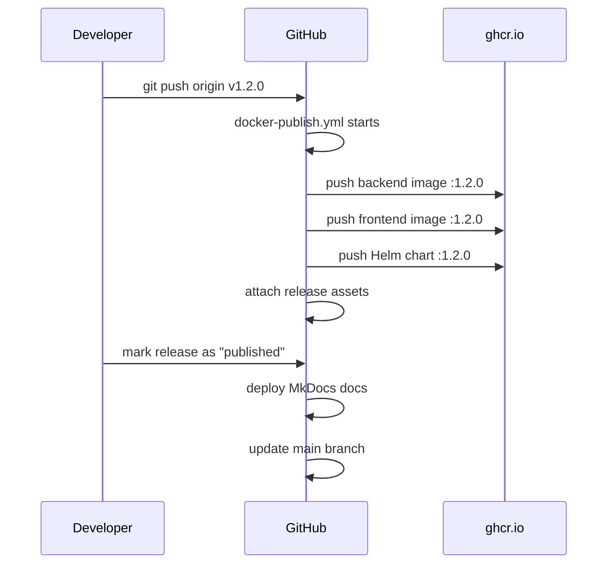
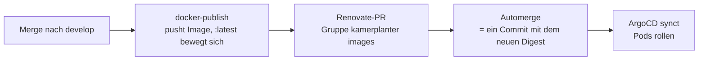

# CI/CD-Pipeline

Die Kamerplanter-CI/CD-Pipeline läuft vollständig auf **GitHub Actions**. Sie umfasst automatische Qualitätsprüfungen für Backend und Frontend, das Bauen und Veröffentlichen von Container-Images sowie die automatisierte Helm-Chart-Publikation. Releases werden durch Git-Tags ausgelöst und führen alle Schritte in der richtigen Reihenfolge aus.

---

## Voraussetzungen

- Schreibzugriff auf das GitHub-Repository (`nolte/kamerplanter`)
- Kein manuelles Einrichten von Secrets notwendig — alle Workflows nutzen das automatisch verfügbare `GITHUB_TOKEN`
- Container-Images werden in die **GitHub Container Registry (GHCR)** unter `ghcr.io/nolte/` gepusht

---

## Branch-Strategie

```
feature/* ──► develop ──► (Release-Tag v*) ──► main
```

| Branch | Zweck |
|--------|-------|
| `feature/*` | Entwicklungsarbeit; CI läuft bei Pull Requests auf `develop` |
| `develop` | Integrationsbranch; löst CI und Image-Build aus |
| `main` | Repräsentiert den aktuell stabilen Release-Stand; wird nach jedem Release automatisch aktualisiert |

!!! note "Hinweis"
    `main` wird nicht direkt für die Entwicklung verwendet. Commits landen über `develop` und Git-Tags auf `main`. Der Workflow `release-cd-refresh-master.yml` übernimmt diesen Schritt automatisch nach einem veröffentlichten Release.

---

## Übersicht der Workflows

| Datei | Auslöser | Zweck |
|-------|---------|-------|
| `backend.yml` | Push/PR auf `develop`, Pfad `src/backend/**` | Lint + Tests Backend |
| `frontend.yml` | Push/PR auf `develop`, Pfad `src/frontend/**` | Lint + Tests + Build Frontend |
| `docker-publish.yml` | Push auf `develop` oder `v*`-Tag | Container-Images + Helm-Chart bauen und publizieren |
| `skaffold-verify.yml` | PR auf `develop`, Pfad `skaffold.yaml`, `helm/**`, Dockerfiles | Helm-Lint + Skaffold-Diagnose |
| `release-drafter.yml` | Push auf `develop` | Release-Notes-Entwurf automatisch aktualisieren |
| `release-cd-deliver-docs.yml` | Veröffentlichtes Release | MkDocs-Dokumentation auf GitHub Pages deployen |
| `release-cd-refresh-master.yml` | Veröffentlichtes Release | `main`-Branch auf den Release-Stand aktualisieren |

---

## Backend-CI (`backend.yml`)

Der Backend-CI-Workflow läuft bei jedem Push auf `develop` und bei Pull Requests, sofern Dateien unter `src/backend/` geändert wurden.

### Was geprüft wird

1. **Ruff Lint** — prüft den Python-Code auf Stil- und Qualitätsprobleme (`ruff check .`)
2. **Ruff Format** — stellt sicher, dass der Code korrekt formatiert ist (`ruff format --check .`)
3. **Unit-Tests** — führt alle Tests unter `tests/unit/` mit pytest aus

```yaml title=".github/workflows/backend.yml (vereinfacht)"
jobs:
  lint-test:
    runs-on: ubuntu-latest
    steps:
      - uses: actions/setup-python@v5
        with:
          python-version: '3.14'
          allow-prereleases: true

      - name: Install dependencies
        run: pip install -e ".[dev]"

      - name: Ruff lint
        run: ruff check .

      - name: Ruff format check
        run: ruff format --check .

      - name: Unit tests
        run: pytest tests/unit/ -v --tb=short
```

!!! tip "Lokale Prüfung vor dem Push"
    ```bash
    cd src/backend
    ruff check .
    ruff format --check .
    pytest tests/unit/ -v --tb=short
    ```

### Abhängigkeiten installieren

Die Backend-Abhängigkeiten werden aus `pyproject.toml` installiert. Der `[dev]`-Extra enthält pytest, ruff und weitere Entwicklungswerkzeuge:

```bash
pip install -e ".[dev]"
```

---

## Frontend-CI (`frontend.yml`)

Der Frontend-CI-Workflow läuft bei jedem Push auf `develop` und bei Pull Requests, sofern Dateien unter `src/frontend/` geändert wurden.

### Was geprüft wird

1. **TypeScript-Prüfung** — strikter Typen-Check ohne Ausgabe (`tsc --noEmit`)
2. **ESLint** — Qualitätsprüfung des TypeScript/React-Codes
3. **Vitest** — alle Unit- und Komponenten-Tests
4. **Vite-Build** — stellt sicher, dass der Produktions-Build fehlerfrei kompiliert

```yaml title=".github/workflows/frontend.yml (vereinfacht)"
jobs:
  lint-test-build:
    runs-on: ubuntu-latest
    steps:
      - uses: actions/setup-node@v4
        with:
          node-version: 22    # (1)!
          cache: npm
          cache-dependency-path: src/frontend/package-lock.json

      - run: npm ci
      - run: npx tsc --noEmit
      - run: npm run lint
      - run: npm run test
      - run: npm run build
```

1. Nur der `lint-test-build`-Job nutzt Node 22. Die `bundle-budget`- und `lighthouse`-Jobs im selben Workflow laufen auf Node 24 — passend zum Frontend-Dockerfile, das mit `node:24-alpine` baut (siehe [Frontend-Image](#frontend-image) unten).

!!! tip "Lokale Prüfung vor dem Push"
    ```bash
    cd src/frontend
    npx tsc --noEmit
    npm run lint
    npm run test
    npm run build
    ```

### Build-Artefakt

Bei einem Push auf `develop` (nicht bei PRs) wird das fertige `dist/`-Verzeichnis als GitHub Actions Artefakt hochgeladen und für 7 Tage aufbewahrt. Das ermöglicht eine schnelle Inspektion des Build-Ergebnisses ohne lokales Kompilieren.

### Performance-Budgets & CI-Gates (`bundle-budget`, `lighthouse`)

Zusätzlich zu `lint-test-build` laufen im selben Workflow zwei eigenständige Jobs, die die Frontend-Ladeperformance überwachen (interne Referenz: UI-NFR-003). Beide berühren nicht den required Check `static` — ein Verstoß fällt sichtbar auf, blockiert aber nicht den Automerge.

**`bundle-budget` — hartes Gate.** Der Job baut das Frontend und prüft danach mit `npm run bundle:check` (Skript `scripts/check-bundle-budget.mjs`) das initiale JavaScript- und CSS-Bundle sowie den dedizierten `/dashboard`-Route-Chunk gegen die Budgets in `bundle-budget.json`:

| Prüfung | Budget (gzip) | Gemessener IST-Wert |
|---|---|---|
| Initiales JavaScript-Bundle | 490 KB | ~471,8 KB |
| Initiales CSS-Bundle | 50 KB | unter Budget |
| `/dashboard`-Route-Chunk | 12 KB | unter Budget |

Eine Überschreitung lässt den Job fehlschlagen; der Bundle-Analyzer-Report (Treemap via `rollup-plugin-visualizer`) wird als Artefakt `bundle-stats` hochgeladen. Möglich wird dieses Budget durch eine `manualChunks`-Vendor-Strategie in `vite.config.ts`: React, MUI-Core, Redux Toolkit und react-i18next werden eager in stabile, langlebige Vendor-Chunks gruppiert, während schwere routen-gebundene Bibliotheken (`recharts`, `@mui/x-*`, `react-grid-layout`) lazy bleiben.

!!! note "300-KB-Ziel noch nicht erreicht"
    UI-NFR-003 formuliert für das initiale JavaScript-Bundle einen Zielwert von 300 KB gzip. Das aktuelle Budget von 490 KB sichert lediglich den gemessenen Ist-Stand gegen unbemerktes weiteres Wachstum ab, erreicht das Ziel aber noch nicht. Haupttreiber ist das eager geladene i18n-Übersetzungsbundle (~160 KB gzip). Das Erreichen des 300-KB-Ziels erfordert Lazy-Loading der Übersetzungen und ist als offener Folgeschritt vorgesehen. <!-- UI-NFR-003 R-013 -->

!!! tip "Lokale Prüfung vor dem Push"
    ```bash
    cd src/frontend
    npm run build
    npm run bundle:check
    ```

**`lighthouse` — Report-only.** Der Job führt `npm run lhci` (Lighthouse CI, mobile Emulation mit gedrosseltem 4G-Netzwerk) gegen den gebauten `dist/`-Ordner aus und prüft die Core-Web-Vitals-Schwellenwerte aus UI-NFR-003 (First Contentful Paint < 1,5 s, Largest Contentful Paint < 2,5 s, Time to Interactive < 3,5 s, Cumulative Layout Shift < 0,1, Total Blocking Time < 200 ms) sowie den Performance- und Accessibility-Score (≥ 0,9). Alle Assertions in `lighthouserc.json` sind auf `warn`-Stufe konfiguriert — der Job blockiert den Build also nicht, macht Regressionen aber im Report sichtbar. Der vollständige Bericht wird als Artefakt `lighthouse-report` hochgeladen.

---

## Container-Build und -Publikation (`docker-publish.yml`)

Dieser Workflow baut und publiziert alle Container-Images sowie den Helm-Chart. Er wird ausgelöst durch:

- Push auf `develop` (wenn Backend-, Frontend- oder Helm-Dateien geändert wurden)
- Push eines `v*`-Tags (Release) — dann werden alle Komponenten gebaut, unabhängig von Pfadänderungen
- Manuell über `workflow_dispatch`

### Pfad-basiertes Filtern

Damit nicht bei jeder Änderung alle Images neu gebaut werden, ermittelt ein `changes`-Job zuerst, welche Komponenten betroffen sind:

```
src/backend/**  →  build-backend
src/frontend/** →  build-frontend
helm/**         →  publish-helm-charts
```

Bei einem `v*`-Tag oder manuellem Auslösen wird das Filtern übersprungen — es werden immer alle Komponenten gebaut.

### Backend-Image

Das Backend-Image basiert auf `python:3.14-slim` und nutzt ein Multi-Stage-Dockerfile mit einer gemeinsamen `base`-Stage sowie getrennten `dev`- und `prod`-Zielen (`docker build .` ohne `--target` baut standardmäßig `prod`, da es die letzte Stage ist). Die `dev`-Stage läuft als root für Skaffold-Hot-Reload; die `prod`-Stage läuft als nicht-root Nutzer (UID 1000):

```dockerfile title="src/backend/Dockerfile (vereinfacht, prod-Stage)"
FROM python:3.14-slim AS base
WORKDIR /app
COPY pyproject.toml requirements.txt requirements-dev.txt ./

FROM base AS prod
RUN pip install --no-cache-dir --require-hashes -r requirements.txt \
    && pip install --no-cache-dir --no-deps .
COPY . .
RUN groupadd -g 1000 app && useradd -u 1000 -g 1000 -d /app -s /usr/sbin/nologin app \
    && chown -R 1000:1000 /app
USER 1000
EXPOSE 8000
CMD ["uvicorn", "app.main:app", "--host", "0.0.0.0", "--port", "8000"]
```

Das Image wird nach `ghcr.io/nolte/kamerplanter-backend` gepusht. Abhängigkeiten kommen ausschließlich aus den Hash-gepinnten `requirements*.txt`-Locks (NFR-009), nicht direkt aus `pyproject.toml`.

### Frontend-Image {#frontend-image}

Das Frontend-Image verwendet ebenfalls ein Multi-Stage-Dockerfile: Zuerst wird die React-App mit Node.js 24 gebaut, dann werden die statischen Dateien in ein schlankes, **unprivilegiertes** nginx-Image kopiert (läuft nicht als root, kompatibel mit `runAsNonRoot`):

```dockerfile title="src/frontend/Dockerfile (vereinfacht)"
FROM node:24-alpine AS build
WORKDIR /app
COPY package.json package-lock.json ./
RUN npm ci
COPY . .
RUN npm run build

FROM nginxinc/nginx-unprivileged:1.31-alpine AS prod
COPY --from=build /app/dist /usr/share/nginx/html
COPY nginx.conf /etc/nginx/conf.d/default.conf
EXPOSE 8080
```

Das Image wird nach `ghcr.io/nolte/kamerplanter-frontend` gepusht. Der interne Port ist `8080` (unprivilegiertes nginx darf nicht an Port 80 binden), gemappt auf den öffentlichen Port 8080 in Docker Compose bzw. Port 80 im Helm-Chart-Service.

### Image-Tags

Docker-Metadata wird automatisch per `docker/metadata-action` erzeugt:

| Tag-Schema | Beispiel | Wann |
|-----------|---------|------|
| `latest` | `kamerplanter-backend:latest` | Push auf `develop` |
| Commit-SHA | `kamerplanter-backend:a3f7c2b` | Immer |
| Branch-Name | `kamerplanter-backend:develop` | Push auf Branch |
| Semantic Version | `kamerplanter-backend:1.2.0` | `v1.2.0`-Tag |
| Major.Minor | `kamerplanter-backend:1.2` | `v1.2.0`-Tag |

!!! warning "`latest` ist eine bewegliche Referenz"

    `latest` wird bei jedem Push auf `develop` überschrieben und zeigt danach auf
    andere Bytes. Für alles, was reproduzierbar sein muss — Deployments,
    Rollbacks, Fehleranalyse — brauchst du eine Referenz, die stehen bleibt. Das
    Helm-Chart benutzt deshalb seit #987 keinen beweglichen Tag mehr, sondern
    einen unveränderlichen Digest: [Deployment und Rollback](#deployment-und-rollback).

    Wie teuer das ohne Digest ist, ist gemessen und nicht behauptet: mit
    `pullPolicy: IfNotPresent` — genau der Wert, den das Chart setzt — liefert
    ein Node nach `rollout restart` **weiter das alte Image**, obwohl die
    Registry unter demselben Tag längst andere Bytes ausliefert. Kubernetes
    erzwingt `Always` für ein `:latest` nur, solange `imagePullPolicy` *nicht*
    gesetzt ist; ein explizit gesetztes `IfNotPresent` gewinnt. So hat der
    `inference-service` wochenlang ein Image ohne die `/pest/*`-Routen bedient.

### Was jedes Artefakt absichert

Jede Artefaktklasse, die dieses Projekt ausliefert, braucht eine benannte Stage,
die sie absichert — sonst wird eine Lücke erst dann sichtbar, wenn sie ausgenutzt
wird. Die folgende Matrix ist die Antwort auf die Frage „was garantiert
eigentlich wer?" und wird beim Ändern der Pipeline mitgepflegt.

| Artefaktklasse | Sichernde Stage | Garantien |
|---|---|---|
| Container-Images (8 Stück) | `build-*` in `docker-publish.yml` | aus der Quelle gebaut, Integrität (Digest), Provenance (signiert) |
| Helm-Chart (OCI) | `publish-helm-charts` | aus der Quelle gebaut, Integrität (Digest), Provenance (signiert) |
| `openapi.json` (Release-Asset) | `openapi-asset` in `release-publish.yml` | aus der Quelle gebaut, Anhang wird nach dem Upload verifiziert |
| `docker-compose-<version>.yml`, `.env.example-<version>` | `update-release-assets` | aus der Quelle gebaut |
| Python-Abhängigkeiten | `pip-audit`, `pip-licenses`, `lock-staleness` in `backend.yml` | Policy geprüft (CVE, Lizenz, Lock-Integrität) |

**Bekannte Lücken** — bewusst offen, nicht übersehen:

- Die drei Release-Assets tragen **keine** Provenance. Für die von GitHub
  gehosteten Release-Dateien gibt es keinen Verifikationspfad, der dem
  Registry-Attest entspricht.
- Für JavaScript-Abhängigkeiten gibt es noch keine eigene Policy-Stage; Trivy
  deckt sie nur auf Stufe `CRITICAL` ab.

#### Provenance prüfen

Images und Chart tragen von der Plattform erzeugte und signierte Build-Provenance
(`actions/attest-build-provenance`). Vor einem Deployment prüfbar mit:

```bash
gh attestation verify \
  oci://ghcr.io/nolte/kamerplanter-backend:1.2.0 \
  --repo nolte/kamerplanter
```

Was das aussagt und was nicht: Provenance belegt die **Herkunft** — welcher
Commit, welcher Workflow-Lauf, welche gepinnten Eingaben. Sie ist **keine**
Aussage darüber, dass ein Artefakt sicher ist. Sicherheitsbefunde bleiben Sache
der Supply-Chain-Stages.

### Helm-Chart

Das Helm-Chart für Kamerplanter liegt unter `helm/kamerplanter/` und wird als OCI-Artefakt gepusht:

```
oci://ghcr.io/nolte/charts/kamerplanter
```

Bei einem Release-Tag werden `version` und `appVersion` in `Chart.yaml` automatisch auf die Release-Version gesetzt, bevor das Chart gepackt wird. Gleichzeitig pinnt `scripts/ci/pin_chart_image_digests.sh` jedes Kamerplanter-Image in `values.yaml` auf `<version>@sha256:<digest>` — adressiert über den YAML-Pfad, nicht über eine Textersetzung des Literals `tag: latest`. Derselbe Lauf liest die Datei anschließend erneut und bricht das Release ab, falls ein Kamerplanter-Image die Umstellung überlebt hat.

Der Digest wird dabei aus der Registry aufgelöst, nicht aus den Build-Jobs durchgereicht. Das prüft nebenbei, dass `<image>:<version>` überhaupt existiert — deshalb hängt `publish-helm-charts` seit #987 per `needs:` hinter den Image-Builds. Und es ist der Unterschied zwischen „unveränderlich" und „unveränderlich per Konvention": ein Versions-Tag lässt sich neu pushen, ein Digest nicht.

!!! info "Warum nicht nur die Version?"

    Bis #987 pinnte dieser Schritt den nackten Versions-Tag. Das war besser als
    das `:latest` im develop-Stand, aber ein Tag bleibt eine Referenz auf einen
    Namen: wird der Publish-Workflow für ein bestehendes Tag erneut ausgeführt,
    zeigt derselbe Name auf andere Bytes, und kein Konsument kann das bemerken.

```bash
# Chart direkt verwenden
helm pull oci://ghcr.io/nolte/charts/kamerplanter --version 1.2.0
```

### Layer-Caching

Alle Image-Builds nutzen den GitHub Actions Cache (`type=gha`) für Docker-Layer. Das beschleunigt Folge-Builds erheblich, wenn sich nur wenige Schichten ändern.

---

## Skaffold-Verify (`skaffold-verify.yml`)

Dieser Workflow läuft bei Pull Requests auf `develop`, wenn `skaffold.yaml`, Helm-Dateien oder Dockerfiles geändert wurden. Er stellt sicher, dass die lokale Entwicklungsumgebung weiterhin funktionsfähig ist.

### Was geprüft wird

1. **`helm dependency build`** — lädt die Chart-Abhängigkeiten herunter (bjw-s common chart, valkey)
2. **`helm lint`** — prüft das Helm-Chart auf Syntaxfehler mit den Dev-Values
3. **`helm template`** — rendert alle Kubernetes-Manifeste und prüft die Templating-Logik
4. **`skaffold diagnose`** — validiert die Skaffold-Konfiguration
5. **`skaffold render`** — erzeugt gerenderte Manifeste und lädt sie als Artefakt hoch

!!! note "Skaffold ist nur für die lokale Entwicklung"
    Skaffold wird ausschließlich für die lokale Entwicklungsumgebung (Kind-Cluster) verwendet. Produktions-Deployments laufen nicht über Skaffold, sondern über den `docker-publish`-Workflow in Kombination mit dem Helm-Chart.

---

## Release-Prozess

Ein vollständiger Release besteht aus mehreren automatischen Schritten, die durch das Veröffentlichen eines GitHub-Releases ausgelöst werden.

!!! note "Ein Release deployt nichts"

    Der Release-Prozess erzeugt Artefakte — Chart-Paket, Compose-Dateien,
    Dokumentation. Er bringt **keine** neue Version in einen laufenden Cluster;
    das tut der Weg unter [Deployment und Rollback](#deployment-und-rollback).
    Was ein Release stattdessen leistet, steht unter
    [Wofür ein Release dann da ist](#wofuer-ein-release).

### Schritt 1: Release-Entwurf vorbereiten (automatisch)

Der `release-drafter`-Workflow aktualisiert bei jedem Push auf `develop` automatisch einen Release-Entwurf mit den Änderungen seit dem letzten Tag.

### Schritt 2: Release-Tag setzen

```bash
git tag v1.2.0
git push origin v1.2.0
```

Das Tag löst `docker-publish.yml` aus und baut alle Images und den Helm-Chart mit der korrekten Versionsnummer.

### Schritt 3: Release veröffentlichen

Wenn das GitHub-Release als "published" markiert wird, laufen zwei weitere Workflows an:

**`release-cd-deliver-docs.yml`** — deployt die MkDocs-Dokumentation auf GitHub Pages über einen wiederverwendbaren Workflow aus `nolte/gh-plumbing`.

**`release-cd-refresh-master.yml`** — aktualisiert den `main`-Branch auf den Stand des neuen Release-Tags. `main` zeigt damit immer auf den zuletzt veröffentlichten stabilen Stand.

### Schritt 4: Release-Assets (automatisch)

Der `update-release-assets`-Job im `docker-publish`-Workflow hängt am Release folgende Dateien an:

- `docker-compose-1.2.0.yml` — versionierte Docker-Compose-Datei für Self-Hosting
- `.env.example-1.2.0` — Vorlage für Umgebungsvariablen
- Container-Image-Referenzen und Helm-Pull-Befehl im Release-Text

### Zusammenfassung Release-Ablauf

<!-- diagram-source: user-described — release publish sequence from git tag push to docs deploy and main branch update -->

```mermaid
sequenceDiagram
    participant Dev as Developer
    participant GH as GitHub
    participant GHCR as ghcr.io

    Dev->>GH: git push origin v1.2.0
    GH->>GH: docker-publish.yml starts
    GH->>GHCR: push backend image :1.2.0
    GH->>GHCR: push frontend image :1.2.0
    GH->>GHCR: push Helm chart :1.2.0
    GH->>GH: attach release assets
    Dev->>GH: mark release as "published"
    GH->>GH: deploy MkDocs docs
    GH->>GH: update main branch
```

---

## Deployment und Rollback

Ein Cluster erfährt **nicht** dadurch von einer neuen Version, dass ein Tag umgebogen wird. Das Chart referenziert jedes Kamerplanter-Image über einen unveränderlichen Digest:

```yaml
image:
  repository: ghcr.io/nolte/kamerplanter-backend
  tag: latest@sha256:af9bec…   # (1)!
  pullPolicy: IfNotPresent      # (2)!
```

1. Entscheidend ist der Teil **nach** dem `@`. Der Digest ist inhaltsadressiert und kann sich nicht bewegen. Das `latest` davor ist hier keine bewegliche Referenz, sondern ein Etikett, aus welchem Kanal der Digest stammt — aufgelöst wird es von niemandem. Es steht in derselben Zeile, weil Renovate genau diese Schreibweise pflegt (siehe unten).
2. Bleibt bewusst `IfNotPresent`. Ein Digest ist inhaltsadressiert: Ein Image, das auf dem Node liegt, **ist** das angeforderte — ein erneuter Pull könnte das nur bestätigen. `Always` würde jeden Pod-Start von der Erreichbarkeit der GHCR abhängig machen und nichts gewinnen.

### So kommt eine neue Version in den Cluster


```mermaid
graph LR
    A[Merge nach develop] --> B[docker-publish<br/>pusht Image, :latest bewegt sich]
    B --> C[Renovate-PR<br/>Gruppe kamerplanter images]
    C --> D[Automerge<br/>= ein Commit mit dem neuen Digest]
    D --> E[ArgoCD synct<br/>Pods rollen]
```

Ausgeschrieben sind das vier Sprünge, und jeder gehört einem anderen Akteur:

1. **Merge nach `develop`** — der Commit, der den Code ändert. Ein Mensch.
2. **`docker-publish.yml`** baut das Image und pusht es; `:latest` in der GHCR
   zeigt danach auf die neuen Bytes. Der Cluster merkt davon nichts.
3. **Renovate** öffnet den gruppierten Pull Request `kamerplanter images` und
   schreibt den neuen Digest nach `helm/kamerplanter/values.yaml`; der Pull
   Request mergt automatisch.
4. **ArgoCD** synct genau diesen Commit. Die Pods rollen, weil sich die Pod-Spec
   geändert hat — nicht, weil jemand einen Neustart ausgelöst hat.

Der Deploy ist also ein **Commit**, kein Handgriff am Cluster. Renovate hält die Digests aktuell (`renovate.json5`, Regel `kamerplanter images`); dass die Digests überhaupt vorhanden sind, sichert `scripts/check_chart_image_digests.py` im Pflicht-Check `static` ab.

Ein Sprung, der ausbleibt, meldet sich nicht von selbst: Sprung 3 ruht, wenn
Renovate hängt, und Sprung 4 kann synchronisiert *aussehen*, während der Pod
etwas anderes ausführt. Was das absichert, steht unter
[Zwei Sprünge, zwei Prüfungen](#zwei-sprunge-zwei-prufungen).

### Rollback

```bash
# 1. Den Commit finden, der den Digest gesetzt hat
git log --oneline -- helm/kamerplanter/values.yaml

# 2. Ihn zurücknehmen — das ist der komplette Rollback
git revert <commit>
```

ArgoCD synct den vorherigen Digest, die Pods rollen zurück. Prüfe das Ergebnis **im laufenden Pod**, nicht in der Values-Datei und nicht am Controller-Status:

```bash
kubectl get pod -n kamerplanter -l app.kubernetes.io/name=backend \
  -o jsonpath='{range .items[*]}{.metadata.name}{"  "}{.status.containerStatuses[0].imageID}{"\n"}{end}'
```

`imageID` nennt den Digest, den der Kubelet tatsächlich gestartet hat. Er muss zu dem passen, der nach dem Revert in `values.yaml` steht.

!!! danger "Nicht am laufenden Cluster editieren"

    `syncPolicy.automated.selfHeal: true` macht jede `kubectl edit`- oder
    `kubectl set image`-Änderung binnen Minuten rückgängig. Ein Rollback, der
    nicht im Git steht, ist kein Rollback, sondern eine Verzögerung.

!!! warning "Was ein Deploy jetzt langsamer macht"

    Ein Publish ist erst live, wenn der Renovate-PR gemergt ist. Renovate läuft
    nach Zeitplan, nicht auf Zuruf — für einen Hotfix hakst du im
    Dependency-Dashboard-Issue die Refresh-Checkbox an, statt zu warten. Der
    frühere Weg (`workflow_dispatch` + `kubectl rollout restart`) ist damit
    keiner mehr: Er hat, wie oben gemessen, ohnehin nie zuverlässig ein neues
    Image gezogen.

### Produktion: die `Application` liegt im GitOps-Repository

Die ArgoCD-`Application` für den Talos-Cluster liegt **nicht** in diesem Repository, sondern in `k8s-home-lab` (`src/applications/kamerplanter/deploy/argocd/application.yaml`). Sie zieht das Chart nicht aus der Registry, sondern direkt aus dem Quell-Repository:

```yaml
- path: helm/kamerplanter                              # (1)!
  repoURL: https://github.com/nolte/kamerplanter.git
  targetRevision: develop                              # (2)!
```

1. Der Chart-Ordner im Git-Baum — nicht das OCI-Artefakt `oci://ghcr.io/nolte/charts/kamerplanter`.
2. Ein **Branch**, kein Release-Tag. Jeder Commit auf `develop`, der `helm/kamerplanter/**` berührt, ist damit sofort der neue Soll-Zustand dieser Instanz.

!!! warning "Ein veröffentlichtes Release liegt nicht auf dem Auslieferungspfad dieser Instanz"

    Diese Instanz erfährt von einer neuen Version **ausschließlich** über die
    vier Sprünge oben. Ein Release ändert an ihr nichts: Es hebt kein
    `targetRevision` an, es bewegt keinen Digest in
    `helm/kamerplanter/values.yaml` und es löst keinen Sync aus. Wer nach einem
    Release im Cluster die Release-Version erwartet, sucht am falschen Ort —
    dort läuft der Digest, den der letzte Renovate-Merge auf `develop` gesetzt
    hat, und der kann jünger oder älter sein als jedes Release.

#### Wofür ein Release dann da ist {#wofuer-ein-release}

Ein Release schneidet ein Maintainer von Hand: **Actions → Release Publish → Run
workflow**, mit dem Tag eines offenen Release-Drafter-Entwurfs — sinnvollerweise
zuerst mit `dry_run`. Automatisch passiert das nie. Was daran hängt, ist alles
*außerhalb* dieser Instanz:

| Ergebnis | Für wen |
|---|---|
| Chart-Paket `oci://ghcr.io/nolte/charts/kamerplanter:<version>`, mit Images auf `<version>@sha256:<digest>` gepinnt | Self-Hoster und fremde Cluster — siehe [ArgoCD](argocd.md) |
| `docker-compose-<version>.yml`, `.env.example-<version>`, `openapi.json` als Release-Assets | Self-Hosting ohne Kubernetes, API-Clients |
| MkDocs-Dokumentation auf GitHub Pages (`release-cd-deliver-docs.yml`) | Leser dieser Seite |
| `main` auf den Release-Stand gesetzt (`release-cd-refresh-master.yml`) | alle, die einen stabilen Referenz-Branch brauchen |

#### Invariante: kein `image.tag` im Overlay {#invariante-kein-image-tag}

**Ein Overlay, das diese Instanz konfiguriert, trägt keine per-Controller-`image.tag`-Overrides.** Das ist keine Empfehlung, sondern die Bedingung, unter der der Digest-Pin überhaupt trägt.

Das Chart pinnt jedes Kamerplanter-Image als `latest@sha256:…`. Der Digest
benennt die Bytes und kann sich nicht bewegen. Ein `tag: "0.2.0"` im
Application-Manifest gewinnt gegen den Chart-Default und ersetzt den Digest
durch eine bewegliche Referenz — und `pullPolicy: IfNotPresent` heißt dann:
„nimm, was auf dem Node im Cache liegt". Damit ist die Auslieferung wieder davon
abhängig, was ein einzelner Knoten zufällig schon einmal gezogen hat.

Die Konsequenz ist zweimal gemessen worden, nicht befürchtet:

- Im ersten Vorfall (intern verfolgt als #1024) behielt ein `rollout restart`
  still ein altes Image; der `inference-service` bediente wochenlang einen Stand
  ohne die `/pest/*`-Routen. <!-- #1024 -->
- Im zweiten (intern #1210) pinnte das Chart bereits einen Build **mit** dem
  Fix, während die Instanz einen Stand von davor auslieferte — der Overlay-Tag
  hatte den Digest überschrieben. <!-- #1210 -->

Beide Male sah die Lage von außen gesund aus: Registry, Chart und
Controller-Status waren einer Meinung. Nur der laufende Container war es nicht.
Deshalb ist der Beweis immer der Blick **in den Pod**, nie in die Values-Datei.

Die Invariante steht im Klartext neben den Digests, die sie schützt — in
[`helm/kamerplanter/values.yaml`](https://github.com/nolte/kamerplanter/blob/develop/helm/kamerplanter/values.yaml)
und im Overlay selbst. Ändere sie dort, nicht hier.

### Zwei Sprünge, zwei Prüfungen {#zwei-sprunge-zwei-prufungen}

Zwischen „die Registry hat die neuen Bytes" und „der Pod führt sie aus" liegen
zwei unabhängige Übergänge. Jeder hat seine eigene Prüfung — und keine der
beiden sagt etwas über die andere aus:

| Übergang | Frage | Prüfung |
|---|---|---|
| GHCR → Chart-Pin | Ist der Digest in `values.yaml` noch der aktuelle? | `chart-image-digest-freshness.yml`, täglich 06:00 UTC |
| Chart-Pin → laufende Instanz | Führt der Pod die Bytes aus, die im Chart stehen? | geplant, siehe unten |

!!! danger "Der erste grüne Haken impliziert den zweiten nicht"

    Als der zweite Vorfall auffiel, war `chart-image-digest-freshness` grün —
    völlig zu Recht: Der Chart-Pin *war* aktuell. Genau das machte die
    Abweichung unsichtbar, denn die einzige Prüfung, die es gab, maß den
    Sprung, der funktionierte. Ein Check über den ersten Übergang kann über den
    zweiten nichts aussagen; die beiden Sprünge fallen unabhängig voneinander
    aus. <!-- #1210 -->

!!! warning "Noch nicht implementiert"

    Die Prüfung des zweiten Sprungs gibt es noch nicht. Sie wird den Digest aus
    `helm/kamerplanter/values.yaml` gegen die Build-Kennung vergleichen, die die
    laufende Instanz selbst meldet (siehe die letzte Frage unter „Häufige
    Fragen"), und eine Abweichung genauso melden wie die erste Prüfung. Bis
    dahin ist dieser Übergang nur von Hand prüfbar. <!-- #1210 -->

---

## GHCR-Pakete abrufen

Alle Images sind öffentlich lesbar. Für lokale Tests:

=== "Backend"

    ```bash
    docker pull ghcr.io/nolte/kamerplanter-backend:latest
    docker pull ghcr.io/nolte/kamerplanter-backend:1.2.0
    ```

=== "Frontend"

    ```bash
    docker pull ghcr.io/nolte/kamerplanter-frontend:latest
    docker pull ghcr.io/nolte/kamerplanter-frontend:1.2.0
    ```

=== "Helm-Chart"

    ```bash
    helm pull oci://ghcr.io/nolte/charts/kamerplanter --version 1.2.0
    helm install kamerplanter oci://ghcr.io/nolte/charts/kamerplanter --version 1.2.0
    ```

---

## Häufige Fragen

??? question "Warum schlägt der Backend-CI fehl, obwohl die Tests lokal laufen?"
    Stelle sicher, dass du Python 3.14 verwendest (`python --version`). Die CI verwendet explizit `python-version: '3.14'` mit `allow-prereleases: true`. Abweichende Python-Versionen können zu unterschiedlichem Verhalten führen. Prüfe auch, ob alle Abhängigkeiten mit `pip install -e ".[dev]"` installiert wurden.

??? question "Warum wird kein neues Image gebaut, obwohl ich auf develop gepusht habe?"
    Das Pfad-Filtern in `docker-publish.yml` stellt sicher, dass nur tatsächlich betroffene Komponenten gebaut werden. Wenn du z. B. nur eine Spec-Datei geändert hast, wird kein Image gebaut. Bei `v*`-Tags wird das Filtern umgangen.

??? question "Wie aktualisiere ich das Helm-Chart manuell?"
    Du kannst `docker-publish.yml` über `workflow_dispatch` manuell auslösen. Navigiere dazu in GitHub zu **Actions → Build & Publish Container Images → Run workflow**.

??? question "Wann wird main aktualisiert?"
    `main` wird ausschließlich automatisch durch `release-cd-refresh-master.yml` nach einem veröffentlichten Release aktualisiert. Direkte Pushes auf `main` sind nicht vorgesehen.

??? question "Wie sehe ich, welche Image-Version gerade läuft?"

    !!! warning "Noch nicht implementiert"

        Das Feld `build_revision` wird der Health-Endpunkt erst mit einem
        künftigen Build ausliefern. Bis dahin antwortet er ohne dieses Feld;
        nutze so lange den Rückfallweg unten. <!-- #1210 -->

    Frag die Instanz selbst — sie ist die einzige Quelle, die den Sprung vom
    Chart-Pin zum laufenden Prozess tatsächlich abdeckt:

    ```bash
    curl -s https://deine-instanz.example.com/api/health
    ```

    ```json
    {
      "status": "healthy",
      "version": "1.0.0",
      "mode": "light",
      "supported_majors": [1],
      "build_revision": "37cbc06fcf0c7d69c07f7abbd3d485cb241070da"
    }
    ```

    `build_revision` wird der vollständige, 40-stellige Git-Commit des laufenden
    Builds sein — die Kennung, die du gegen `git log` hältst, um zu sehen, ob
    ein bestimmter Fix drin ist. Setzt ihn niemand, wird dort der Literalwert
    `"unknown"` stehen; das ist eine Antwort, keine Panne, aber es heißt, dass
    dieser Weg für diese Instanz nichts beweist.

    !!! note "`version` ist nicht die Build-Kennung"

        `version` ist die Anwendungs- und API-Version (dieselbe, die in der
        OpenAPI-Beschreibung unter `info.version` steht). Sie bleibt über viele
        Builds hinweg gleich und beantwortet die Frage „welche Bytes laufen
        hier?" nicht.

    **Rückfallweg — für ein Image, das gerade nicht läuft.** Die Labels
    `org.opencontainers.image.*` sind in jedes Image eingebettet; `docker inspect
    <image>` liest sie aus, der GHCR-Package-Tab auf GitHub zeigt sie ebenfalls.
    Damit prüfst du, was *in* einem Artefakt steckt — nicht, welches Artefakt
    dein Cluster gerade ausführt. Für die Antwort im Cluster nimm den Digest aus
    dem Pod:

    ```bash
    kubectl get pod -n kamerplanter -l app.kubernetes.io/name=backend \
      -o jsonpath='{range .items[*]}{.status.containerStatuses[0].imageID}{"\n"}{end}'
    ```

---

## Siehe auch

- [Kubernetes-Deployment](kubernetes.md)
- [Helm-Chart-Konfiguration](helm.md)
- [Lokale Entwicklungsumgebung](../development/local-setup.md)
