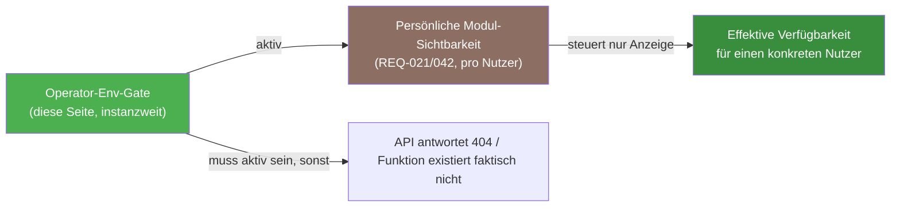

# Konfigurationsmatrix

Diese Seite ist die erschöpfende Referenz für Betreiber: Für praktisch jede Funktion von Kamerplanter zeigt sie, welche Dienste dafür laufen müssen, mit welcher exakten Umgebungsvariable bzw. welchem Helm-Schalter du sie aktivierst oder deaktivierst, welche Secrets zwingend gesetzt sein müssen, wie stark sich CPU/RAM/Storage dadurch verändern und ob ein fehlendes Secret den Start blockiert.

!!! tip "Einstieg über Bündel"
    Wenn du nicht jede Funktion einzeln zusammenstellen möchtest, starte mit den fünf vorgefertigten Bündeln unter [Betriebsprofile](betriebsprofile.md). Diese Seite ist die vollständige Einzelreferenz dahinter.

---

## Wie diese Matrix zu lesen ist

Jede Tabelle unten folgt demselben Spaltenschema:

| Spalte | Bedeutung |
|---|---|
| **Funktion** | Die Funktion bzw. das Teilfeature, in Alltagssprache benannt. |
| **Benötigte Dienste/Komponenten** | Welche Pods/Container müssen dafür laufen — bezogen auf `helm/kamerplanter/values.yaml`-Controller-Namen bzw. externe Dienste. |
| **Aktivierung/Deaktivierung** | Die exakte Umgebungsvariable aus `src/backend/app/config/settings.py` (bzw. `src/knowledge-service/app/config.py` / `src/inference-service/app/config.py`) oder der Helm-Toggle-Pfad. |
| **Pflicht-Secrets/Voraussetzungen** | Werte, die zwingend gesetzt sein müssen, damit die Funktion tatsächlich läuft (nicht nur „nicht crasht"). |
| **Ressourcenauswirkung** | CPU/RAM/Storage-Delta gegenüber dem Kern, aus den `resources.requests`/`resources.limits` in `values.yaml` (bzw. `values-dev-ki.yaml`, wo für Produktion keine Chart-Defaults existieren — siehe Hinweis dort). |
| **Startup-Gate?** | Verweigert `insecure_default_secrets()` (`src/backend/app/main.py`) bzw. das jeweilige `check_insecure_config()` des Microservice den Start, wenn eine Voraussetzung fehlt? |

<!-- Quelle: src/backend/app/config/settings.py, helm/kamerplanter/values.yaml, src/backend/app/main.py (insecure_default_secrets), src/knowledge-service/app/auth.py, src/inference-service/app/auth.py -->

---

## Zwei getrennte „Ein/Aus"-Ebenen — nicht verwechseln {#zwei-ebenen}

Kamerplanter kennt zwei unabhängige Sichtbarkeits-/Aktivierungs-Ebenen, die in Support-Gesprächen häufig durcheinandergebracht werden:

| Ebene | Wer stellt sie ein? | Wirkung | Beispiel |
|---|---|---|---|
| **Operator-Env-Gate** (diese Seite) | Betreiber der Instanz, per Umgebungsvariable/Helm-Wert, wirkt **instanzweit** | Schaltet einen Backend-Endpunkt komplett ab (HTTP 404) oder lässt einen Pod erst gar nicht starten. Kein Nutzer kann das umgehen. | `AI_FEATURES_ENABLED=false` lässt `/ai/*` instanzweit mit HTTP 404 antworten. |
| **Persönliche Modul-Sichtbarkeit** (REQ-021/042) | Jeder Nutzer für sich selbst, in den Kontoeinstellungen unter „Module & Funktionen" | Reine **Anzeige-Präferenz** — blendet einen Navigationsbereich in der Oberfläche aus, ändert nichts an Daten oder API-Verfügbarkeit. | Ein Nutzer blendet „Tankmanagement" aus, obwohl die Funktion instanzweit aktiv ist. |

Eine per Operator-Env-Gate deaktivierte Funktion kann **kein** Nutzer über die Modul-Sichtbarkeit wieder einschalten — die beiden Ebenen wirken in Reihe, nicht parallel. Details zur Nutzer-Ebene: [Module & Funktionen](../user-guide/module-visibility.md).

---

## Pflicht-Secrets je aktivierter Funktion {#pflicht-secrets-je-aktivierter-funktion}

<!-- Quelle: src/backend/app/main.py (insecure_default_secrets), src/knowledge-service/app/auth.py (check_insecure_config), src/inference-service/app/auth.py (check_insecure_config) -->

Diese Übersicht bündelt die Boot-Blocker aus allen drei Prozessen — Backend, Knowledge Service, Inference Service. Alle drei prüfen ihre eigenen Secrets beim Start und brechen mit `SystemExit` ab, wenn sie fehlen (nur wirksam bei `DEBUG=false`, siehe [Umgebungsvariablen — Betriebsmodus](../reference/environment-variables.md#betriebsmodus)).

| Secret | Prozess | Wann Pflicht? | Prüfung |
|---|---|---|---|
| `JWT_SECRET_KEY` | Backend | **Immer**, unabhängig von aktivierten Funktionen | Wert darf nicht mehr `change-me-in-production-use-openssl-rand-hex-32` sein |
| `ARANGODB_PASSWORD` | Backend | **Immer** | Wert darf nicht mehr `rootpassword` sein |
| `FERNET_KEY` | Backend | **Immer** — unabhängig davon, ob OIDC-Provider genutzt werden | Darf nicht leer sein; muss ein gültiger Fernet-Schlüssel sein (32 Byte, url-safe base64, 44 Zeichen) |
| `ERASURE_TOMBSTONE_SALT` | Backend | **Immer** — unabhängig davon, ob aktiv DSGVO-Löschanfragen gestellt werden | Muss mindestens 32 Zeichen lang sein |
| `TIMESCALEDB_PASSWORD` | Backend | Nur wenn `TIMESCALEDB_ENABLED=true` | Wert darf nicht mehr `changeme` sein |
| `INTERNAL_SERVICE_TOKEN` | Backend | Nur wenn `KNOWLEDGE_SERVICE_ENABLED=true` **oder** `INFERENCE_SERVICE_ENABLED=true` | Darf nicht leer sein |
| `INTERNAL_SERVICE_TOKEN` | Knowledge Service | Immer, wenn der Prozess überhaupt läuft (eigener Gate, unabhängig vom Backend-Gate) | Darf nicht leer sein |
| `VECTORDB_PASSWORD` | Knowledge Service | Immer, wenn der Prozess überhaupt läuft | Wert darf nicht mehr `changeme` sein |
| `INTERNAL_SERVICE_TOKEN` | Inference Service | Immer, wenn der Prozess überhaupt läuft | Darf nicht leer sein |
| `VECTORDB_PASSWORD` | Inference Service | Immer, wenn der Prozess überhaupt läuft | Wert darf nicht mehr `changeme` sein |

!!! danger "Erste vier Zeilen betreffen JEDE Produktionsinstanz"
    `JWT_SECRET_KEY`, `ARANGODB_PASSWORD`, `FERNET_KEY` und `ERASURE_TOMBSTONE_SALT` sind **keine Feature-Flags** — sie werden unabhängig davon geprüft, welche der unten aufgeführten optionalen Funktionen aktiv sind. Eine frische Produktionsinstanz ohne diese vier Werte startet gar nicht erst (`SystemExit`), sobald `DEBUG=false` gesetzt ist.

!!! note "`INTERNAL_SERVICE_TOKEN` muss überall identisch sein"
    Backend, Celery-Worker/-Beat, Knowledge Service und Inference Service müssen **denselben** `INTERNAL_SERVICE_TOKEN`-Wert erhalten (ein Kubernetes-Secret, per `envFrom`/`secretKeyRef` in alle vier Controller injiziert) — es ist ein gemeinsames M2M-Geheimnis, kein Token pro Dienst.

---

## Pflanzenidentifikation <!-- REQ-029 / REQ-029-A / REQ-048 --> {#pflanzenidentifikation-req-029}

| Funktion | Benötigte Dienste | Aktivierung/Deaktivierung | Pflicht-Secrets/Voraussetzungen | Ressourcenauswirkung | Startup-Gate? |
|---|---|---|---|---|---|
| Pl@ntNet (Cloud, Free-Tier ≤ 500/Tag) <!-- REQ-029 --> | Backend (externer HTTP-Call) | `PLANTNET_API_KEY` gesetzt **und** `PLANTNET_ENABLED=true` (Default) | `PLANTNET_API_KEY` | keine zusätzlichen Pods | Nein |
| Plant.id / Kindwise (Cloud, Betreiber-Opt-in) <!-- REQ-029 --> | Backend (externer HTTP-Call) | `PLANT_ID_API_KEY` gesetzt | `PLANT_ID_API_KEY` | keine zusätzlichen Pods | Nein |
| Selbst-gehostete DINOv2-Erkennung <!-- REQ-029-A --> | `inference-service` + `vectordb` (eigene Helm-Controller) | `INFERENCE_SERVICE_ENABLED=true` **und** `controllers.vectordb.enabled=true` **und** `controllers.inference-service.enabled=true` | `INTERNAL_SERVICE_TOKEN`, `POSTGRES_PASSWORD` (ein Secret-Schlüssel, von `vectordb` und `inference-service` gemeinsam genutzt) | `inference-service`: 250m/2 CPU, 512Mi/2Gi RAM; `vectordb`: 50m/500m CPU, 128Mi/512Mi RAM + 5Gi PVC | Ja — `internal_service_token` (Backend-Gate) + eigener Gate von `inference-service`/`vectordb`-Prozess |
| Externer Erkennungspfad im Light-Modus zulassen <!-- REQ-034 §4a.3 --> | Backend | `IDENTIFICATION_EXTERNAL_IN_LIGHT_MODE=true` (Default `false`) | — | — | Nein |
| Spezies-Identitätsauflösung/Deduplizierung <!-- REQ-048 --> | Backend (Teil der obigen Adapter) | Kein eigener Schalter — läuft immer mit, sobald ein Identifikations-Adapter aktiv ist | — | — | Nein |

Vollständige Inbetriebnahme (Aktivierungsreihenfolge, Referenz-Index befüllen): [Bilderkennung in Betrieb nehmen](inference-service.md).

---

## Schädlingserkennung <!-- REQ-044 --> {#schaedlingserkennung-req-044}

| Funktion | Benötigte Dienste | Aktivierung/Deaktivierung | Pflicht-Secrets/Voraussetzungen | Ressourcenauswirkung | Startup-Gate? |
|---|---|---|---|---|---|
| Gesamtschalter | — | `PEST_DETECTION_ENABLED=true` (Default `false`) | — | — | Nein |
| Schadbild-/Symptom-Erkennung (Modus 2, Default-Adapter) | `inference-service` (geteilt mit der Pflanzenidentifikation) | `PEST_DETECTION_SYMPTOM_ENABLED=true` (Default) — nur wirksam bei `PEST_DETECTION_ENABLED=true` | Wie beim Inferenz-Service oben | teilt sich den `inference-service`-Pod, kein Zusatzbedarf | Ja (über den geteilten Inferenz-Service-Gate) |
| Direkt-Detektor (Modus 1, Phase 2, D-FINE/RF-DETR ONNX) | `inference-service` | `PEST_DETECTION_DETECTOR_ENABLED=true` (Default `false`) | Trainierter ONNX-Detektor im Service-Image | teilt sich den `inference-service`-Pod | Ja (über den geteilten Inferenz-Service-Gate) |
| Demo-Adapter (Platzhalter-Befunde, kein echtes Modell) | keine | `PEST_DETECTION_DEMO_ENABLED=true` (Default `false`) — **nicht** für echte Entscheidungen | — | keine | Nein |
| Cloud-Adapter (Kindwise `plant.health`) | Backend (externer HTTP-Call) | `PEST_DETECTION_CLOUD_ENABLED=true` **und** `PEST_DETECTION_CLOUD_API_KEY` gesetzt | `PEST_DETECTION_CLOUD_API_KEY` | keine zusätzlichen Pods | Nein |

---

## CV-Krankheitsdiagnose <!-- REQ-038 --> {#cv-krankheitsdiagnose-req-038}

| Funktion | Benötigte Dienste | Aktivierung/Deaktivierung | Pflicht-Secrets/Voraussetzungen | Ressourcenauswirkung | Startup-Gate? |
|---|---|---|---|---|---|
| Self-hosted CV-Diagnose (ONNX PlantDoc-Klassifikator) | `inference-service` (geteilt) | `CV_DIAGNOSIS_ENABLED=true` (Default `false`) | Wie beim Inferenz-Service oben — nutzt dieselbe `INFERENCE_SERVICE_URL`/`INTERNAL_SERVICE_TOKEN`-Anbindung, keine eigenen Verbindungsvariablen | teilt sich den `inference-service`-Pod | Ja (über den geteilten Inferenz-Service-Gate) |
| PlantCV-Phänotyp-Panel (Blattfläche, Grün-Index) | `inference-service` (geteilt) | `CV_PHENOTYPE_ENABLED=true` (Default) — nur wirksam, wenn der Inferenz-Service PlantCV installiert hat | — | teilt sich den `inference-service`-Pod | Nein |

Es gibt (Stand dieser Version) **keinen** Cloud-Adapter für die CV-Krankheitsdiagnose — abgegrenzt von der Schädlingserkennung oben.

---

## KI-Assistent, Knowledge Service und Sprachmodell-Provider <!-- REQ-031 / REQ-035 / REQ-036 --> {#ki-assistent-req-031}

| Funktion | Benötigte Dienste | Aktivierung/Deaktivierung | Pflicht-Secrets/Voraussetzungen | Ressourcenauswirkung | Startup-Gate? |
|---|---|---|---|---|---|
| KI-API instanzweit freischalten (Stufe 1) | Backend | `AI_FEATURES_ENABLED=true` (Default `false`) — `false` lässt `/ai/*` mit HTTP 404 antworten | — | ~kein Zusatzbedarf am Backend selbst | Nein |
| Anbindung an den Knowledge Service | Backend + Knowledge Service (`controllers.knowledge-service`) | `KNOWLEDGE_SERVICE_ENABLED=true` + `KNOWLEDGE_SERVICE_URL` | `INTERNAL_SERVICE_TOKEN` | `knowledge-service`: ~100m/1 CPU, 128Mi/512Mi RAM (Orientierungswert aus `values-dev-ki.yaml` — kein Chart-Default in Produktion, siehe Hinweis unten) | Ja — Backend-Gate + eigener Gate des Knowledge-Service-Prozesses |
| Sprachmodell: Ollama (self-hosted) | Ollama-Subchart + Embedding Service + VectorDB | `LLM_PROVIDER=ollama` + `LLM_API_URL` + `LLM_MODEL` **am Knowledge Service**, nicht am Backend | — | Ollama 4–16Gi RAM (modellabhängig); `embedding-service` ~100m/2 CPU, 1,5–4Gi RAM (dev-Orientierung); `vectordb` 50m/500m CPU, 128Mi/512Mi RAM + 5Gi PVC | Nein (Ollama selbst hat keinen Kamerplanter-Startup-Gate) |
| Sprachmodell: Anthropic (Cloud) | Knowledge Service | `LLM_PROVIDER=anthropic` + `LLM_API_KEY` **am Knowledge Service** | `LLM_API_KEY` | keine zusätzlichen Pods | Nein |
| Sprachmodell: OpenAI-kompatibel (Cloud, z. B. OpenAI) | Knowledge Service | `LLM_PROVIDER=openai_compatible` + `LLM_API_URL` + `LLM_API_KEY` **am Knowledge Service** | `LLM_API_KEY` | keine zusätzlichen Pods | Nein |
| Re-Ranking (höhere RAG-Präzision, ADR-007) | Reranker Service (`controllers.reranker-service`) | `RERANKER_URL` **am Knowledge Service** gesetzt (leer = deaktiviert) | — | `reranker-service` ~100m/2 CPU, 1,5–4Gi RAM (dev-Orientierung) | Nein |
| KI-Fachbegriff-Glossar | teilt den KI-Assistent-Stack | Kein eigener Schalter — folgt `AI_FEATURES_ENABLED` | — | — | Nein |
| KI-Diagnose-Assistent (strukturiert, Symptom-Katalog) | teilt den KI-Assistent-Stack | Kein eigener Schalter — folgt `AI_FEATURES_ENABLED`; nur im Full-Modus verfügbar | — | — | Nein |

!!! warning "Kein automatischer Cloud-Fallback"
    Es gibt **keinen** Laufzeit-Fallback zwischen Ollama und einem Cloud-Provider. `LLM_PROVIDER` ist ein einzelner konfigurierter Wert (`ollama`, `anthropic` oder `openai_compatible`) — ein Wechsel ist ein Redeploy des Knowledge Service, keine automatische Ausweichlogik bei Nichterreichbarkeit.

!!! note "Keine vorgefertigten `enabled`-Stubs für Knowledge/Embedding/Reranker-Service"
    Anders als bei `vectordb` und `inference-service` enthält `helm/kamerplanter/values.yaml` **keine** auskommentierten oder deaktivierten Controller-Blöcke für `knowledge-service`, `embedding-service` und `reranker-service`. Die dort gezeigten Ressourcenwerte stammen aus dem Skaffold-Dev-Overlay `values-dev-ki.yaml` — Operator müssen den vollständigen Controller-Block (Image, Ressourcen, Probes) selbst in der ArgoCD-`valuesObject` angeben. Ein Beispiel dafür zeigt [Betriebsprofile → Profi](betriebsprofile.md#profi).

Instanzweite Freischaltung (`AI_FEATURES_ENABLED=true`) reicht allein nicht: Ein konkreter Mandant benötigt zusätzlich `tenant.settings.ai_features_enabled` (Stufe 2) und der Nutzer seine Einwilligung (Stufe 3). Details: [KI-Assistent — Für technische Nutzer / Self-Hoster](../user-guide/ai-assistant.md#fuer-technische-nutzer-self-hoster).

---

## MCP-Server <!-- REQ-033 --> {#mcp-server-req-033}

| Funktion | Benötigte Dienste | Aktivierung/Deaktivierung | Pflicht-Secrets/Voraussetzungen | Ressourcenauswirkung | Startup-Gate? |
|---|---|---|---|---|---|
| MCP-Werkzeugschnittstelle für externe LLM-Clients | Backend (läuft im bestehenden Prozess mit) | `MCP_SERVER_ENABLED=true` (Default `false`) — `false` lässt `/mcp/*` mit HTTP 404 antworten | Service-Account-API-Keys (pro Client, über die Benutzerverwaltung — kein globales env-Secret) | keine zusätzlichen Pods, kein eigener Prozess | Nein |

---

## Wetter, Frost-Frühwarnung, Klimanormalen und Bewässerungsbedarf <!-- REQ-046 / REQ-041 / REQ-039 / REQ-037 --> {#wetter-frost-klima-req-046}

| Funktion | Benötigte Dienste | Aktivierung/Deaktivierung | Pflicht-Secrets/Voraussetzungen | Ressourcenauswirkung | Startup-Gate? |
|---|---|---|---|---|---|
| Wetterquellen-Abholung (Gesamtschalter) <!-- REQ-046 --> | Backend + Celery Beat | `WEATHER_ENABLED=true` (Default `false`) | — | zusätzliche Celery-Beat-Tasks, kein Zusatz-Pod | Nein |
| Öffentliche Quelle: Open-Meteo | Backend | `OPEN_METEO_ENABLED=true` (Default) — Instanz-Default, pro Standort/Platform-Admin überschreibbar | — | — | Nein |
| Öffentliche Quelle: DWD/Bright Sky | Backend | `DWD_ENABLED=true` (Default) — Instanz-Default | — | — | Nein |
| Öffentliche Quelle: OpenWeatherMap | Backend | `OPENWEATHERMAP_ENABLED=true` (Default) — Instanz-Default | — | — | Nein |
| Proaktive Frost-Frühwarnung (Forecast-basiert) | Celery Beat | Benötigt `WEATHER_ENABLED=true`; Schwellwerte via `FROST_FORECAST_THRESHOLD_CELSIUS`/`FROST_FORECAST_HORIZON_DAYS` | — | — | Nein |
| Reaktive Frost-Warnung (aktuelle Messung) | Backend | Immer aktiv, kein Schalter — nur `FROST_WARNING_THRESHOLD_CELSIUS` konfigurierbar | — | — | Nein |
| Klimanormalen (NASA POWER) <!-- REQ-041 --> | Celery Beat | Benötigt `WEATHER_ENABLED=true` **und** `NASA_POWER_CLIMATE_ENABLED=true` (Default) | — | monatlicher Celery-Task | Nein |
| Winterhärtezonen-Refresh (USDA) <!-- REQ-039 --> | Celery Beat | Benötigt die Klimanormalen (siehe oben) **und** `HARDINESS_ZONE_REFRESH_ENABLED=true` (Default) | — | vierteljährlicher Celery-Task | Nein |
| Bewässerungsbedarf (ET₀, FAO-56) <!-- REQ-037 --> | Celery Beat | Benötigt `WEATHER_ENABLED=true` **und** `IRRIGATION_DEMAND_ENABLED=true` (Default) | — | täglicher Celery-Task | Nein |
| Saison-/Überwinterungs-Automatik <!-- REQ-047 --> | Celery Beat | `SEASON_STATE_EVAL_ENABLED=true` (Default) — nutzt zusätzlich die Live-Frost-Vorhersage, wenn `WEATHER_ENABLED=true` gesetzt ist | — | täglicher Celery-Task | Nein |

---

## Sensorik und Zeitreihendaten <!-- REQ-005 --> {#sensorik-req-005}

| Funktion | Benötigte Dienste | Aktivierung/Deaktivierung | Pflicht-Secrets/Voraussetzungen | Ressourcenauswirkung | Startup-Gate? |
|---|---|---|---|---|---|
| Manuelle Messwerte | Backend + ArangoDB | Immer aktiv, kein Schalter | — | — | Nein |
| Home-Assistant-Anbindung (semi-automatisch, live) | Backend | `HA_URL` + `HA_ACCESS_TOKEN` gesetzt | `HA_ACCESS_TOKEN` | — | Nein |
| Zeitreihen-Speicherung mit Downsampling | `timescaledb`-Controller (in `values.yaml` auskommentiert) | `TIMESCALEDB_ENABLED=true` **und** Controller manuell ergänzt (siehe Hinweis) | `TIMESCALEDB_PASSWORD` | ~250m/1 CPU, 512Mi/1Gi RAM (Chart-Default-Kommentar) + 10Gi PVC | Ja — `timescaledb_password`-Default-Check (nur wenn `TIMESCALEDB_ENABLED=true`) |

!!! note "TimescaleDB-Controller ist im Chart auskommentiert"
    `helm/kamerplanter/values.yaml` enthält den `timescaledb`-Controller nur als **auskommentierten** Block (Docker-Compose hat dagegen ein eigenes `timescaledb`-Profil: `docker-compose --profile timescaledb up`). In Kubernetes muss der Operator den Block per `valuesObject` aktivieren.

---

## Umgebungssteuerung & Aktorik <!-- REQ-018 --> {#umgebungssteuerung-aktorik-req-018}

| Funktion | Benötigte Dienste | Aktivierung/Deaktivierung | Pflicht-Secrets/Voraussetzungen | Ressourcenauswirkung | Startup-Gate? |
|---|---|---|---|---|---|
| Automatischer Regel-/Zeitplan-Loop | Celery Beat | `ACTUATOR_CONTROL_LOOP_ENABLED=true` (Default `false`) | — | drei zusätzliche periodische Tasks (30s/stündlich/5min) | Nein |
| Manuelle Aktor-Steuerung über die API | Backend | Immer verfügbar — unabhängig vom Regel-Loop | — | — | Nein |
| Home-Assistant-Aktoren ansprechen | Backend | `HA_URL` + `HA_ACCESS_TOKEN` gesetzt; optional `HA_ALLOW_PRIVATE_ENDPOINT=true` für LAN-Adressen | `HA_ACCESS_TOKEN` | — | Nein |

---

## Benachrichtigungssystem <!-- REQ-030 --> {#benachrichtigungssystem-req-030}

| Funktion | Benötigte Dienste | Aktivierung/Deaktivierung | Pflicht-Secrets/Voraussetzungen | Ressourcenauswirkung | Startup-Gate? |
|---|---|---|---|---|---|
| E-Mail-Kanal (Konsole, Entwicklung) | Backend | `EMAIL_ADAPTER=console` (Default) | — | — | Nein |
| E-Mail-Kanal (SMTP) | Backend + externer SMTP-Server | `EMAIL_ADAPTER=smtp` + `SMTP_HOST`/`SMTP_USERNAME`/`SMTP_PASSWORD` | `SMTP_PASSWORD` | — | Nein |
| E-Mail-Kanal (Resend) | Backend | `EMAIL_ADAPTER=resend` | API-Key via REST-Konfiguration | — | Nein |
| Browser-Push (Web Push / VAPID) | Backend | `VAPID_PUBLIC_KEY` + `VAPID_PRIVATE_KEY` + `VAPID_CONTACT_EMAIL` alle drei gesetzt | `VAPID_PRIVATE_KEY` | — | Nein |
| Home-Assistant-Kanal (persistente Notifications, Mobile Push, TTS) | Backend | `HA_URL` + `HA_ACCESS_TOKEN` gesetzt | `HA_ACCESS_TOKEN` | — | Nein |
| Apprise-Kanal (Multi-Backend-Push) | Backend-Image | Immer aktiv, sofern das optionale Python-Paket `apprise` im Image installiert ist (kein env-Schalter) | — | größeres Backend-Image | Nein |

---

## InvenTree-Integration <!-- REQ-016 --> {#inventree-integration-req-016}

| Funktion | Benötigte Dienste | Aktivierung/Deaktivierung | Pflicht-Secrets/Voraussetzungen | Ressourcenauswirkung | Startup-Gate? |
|---|---|---|---|---|---|
| Betriebsmittel-/Inventar-Anbindung | Backend + externe InvenTree-Instanz | `INVENTREE_ENABLED=true` (Default `false`) | InvenTree-API-Token (über die REST-API konfiguriert, kein env-Secret) | keine zusätzlichen Pods | Nein |
| InvenTree mit privater/LAN-Adresse | Backend | Zusätzlich `INVENTREE_ALLOW_PRIVATE_ENDPOINT=true` | — | — | Nein |

---

## Object Storage (Fotos, Importe, Exporte) <!-- NFR-013 / REQ-034 --> {#object-storage-nfr-013}

| Funktion | Benötigte Dienste | Aktivierung/Deaktivierung | Pflicht-Secrets/Voraussetzungen | Ressourcenauswirkung | Startup-Gate? |
|---|---|---|---|---|---|
| Lokales Dateisystem (Default) | Backend + Celery Worker + `backend-attachments`-PVC | `STORAGE_BACKEND=local-fs` (Default) | `STORAGE_LOCALFS_SIGNING_SECRET` — Pflicht bei mehr als einer Backend-Replica | 20Gi PVC (Chart-Default, `helm.sh/resource-policy: keep`) | Nein (kein Backend-Boot-Gate; ohne Signing-Secret schlagen Downloads bei Multi-Replica fehl) |
| S3-kompatibler Speicher | Backend + Celery Worker + externer S3-Endpunkt | `STORAGE_BACKEND=s3` + `STORAGE_S3_ENDPOINT_URL`/`STORAGE_S3_REGION`/`STORAGE_S3_BUCKET` | `STORAGE_S3_ACCESS_KEY_ID`, `STORAGE_S3_SECRET_ACCESS_KEY` (aus External Secrets Operator) | kein PVC nötig | Nein |
| Virenscan (ClamAV-REST-Wrapper) | Externer ClamAV-Dienst | `STORAGE_VIRUS_SCAN_ENABLED=true` + `STORAGE_VIRUS_SCAN_ENDPOINT` | — | extern, nicht Teil des Charts | Nein |
| Pflanzenfoto-Galerie <!-- REQ-034 --> | teilt den Object-Storage-Stack | Kein eigener Schalter — `STORAGE_MAX_PHOTOS_PER_INSTANCE` begrenzt die Anzahl | — | — | Nein |

Details: [Speicher konfigurieren](../user-guide/object-storage.md), [Helm Charts — Storage-Konfiguration](helm.md#storage-konfiguration-nfr-013).

---

## Datenschutz, Multi-Tenancy und Betriebsmodus <!-- REQ-023 / REQ-024 / REQ-025 / REQ-027 --> {#datenschutz-multi-tenancy-req-023}

| Funktion | Benötigte Dienste | Aktivierung/Deaktivierung | Pflicht-Secrets/Voraussetzungen | Ressourcenauswirkung | Startup-Gate? |
|---|---|---|---|---|---|
| Light-Modus (kein Login, Einzelnutzung) <!-- REQ-027 --> | Backend + Frontend | `KAMERPLANTER_MODE=light` (Backend) **und** `KAMERPLANTER_MODE=light` (Frontend-InitContainer) | — | — | Nein |
| Full-Modus (Auth + Multi-Tenant) <!-- REQ-023 / REQ-024 --> | Backend + Frontend | `KAMERPLANTER_MODE=full` (Default) | `JWT_SECRET_KEY`, `FERNET_KEY` (beide ohnehin immer Pflicht, siehe oben) | — | Ja (über die generellen Backend-Secrets) |
| DSGVO-Löschung/Anonymisierung <!-- REQ-025 --> | Backend + Celery Beat | Immer aktiv, keine Deaktivierung möglich | `ERASURE_TOMBSTONE_SALT` | ein täglicher Celery-Task | Ja (`erasure_tombstone_salt`, immer geprüft) |
| E-Mail-Verifikation bei Registrierung | Backend | `REQUIRE_EMAIL_VERIFICATION=true` (Default `false`) | E-Mail-Kanal konfiguriert (siehe Benachrichtigungssystem) | — | Nein |
| „Have I Been Pwned"-Prüfung | Backend | `HIBP_ENABLED=true` (Default `false`) | — | ausgehende HTTPS-Anfragen bei Passwortänderung | Nein |

---

## Externe Stammdatenanreicherung <!-- REQ-011 --> {#externe-stammdatenanreicherung-req-011}

| Funktion | Benötigte Dienste | Aktivierung/Deaktivierung | Pflicht-Secrets/Voraussetzungen | Ressourcenauswirkung | Startup-Gate? |
|---|---|---|---|---|---|
| GBIF (taxonomische Daten) | Backend | Immer aktiv, keyless öffentliche API | — | — | Nein |
| Perenual | Backend | `PERENUAL_API_KEY` gesetzt | `PERENUAL_API_KEY` | — | Nein |
| Tréflé | Backend | `TREFLE_API_KEY` gesetzt | `TREFLE_API_KEY` | — | Nein |

---

## mDNS / Zeroconf-Discovery {#mdns-zeroconf-discovery}

| Funktion | Benötigte Dienste | Aktivierung/Deaktivierung | Pflicht-Secrets/Voraussetzungen | Ressourcenauswirkung | Startup-Gate? |
|---|---|---|---|---|---|
| LAN-Auto-Discovery für Home Assistant | Backend | `MDNS_ENABLED=true` (Default `false`) — in Standard-Kubernetes-Clustern wirkungslos, siehe [Umgebungsvariablen — mDNS und Kubernetes](../reference/environment-variables.md#mdns-und-kubernetes) | — | — | Nein |

---

## Kern-Funktionen ohne eigenen Betreiber-Schalter

Die folgenden Funktionen sind Teil der Kernanwendung (Backend + Frontend + ArangoDB + Valkey + Celery Worker/Beat, siehe [Betriebsprofile — Kern](betriebsprofile.md#komponentenubersicht)) und besitzen **keinen** eigenen Aktivierungs-/Deaktivierungs-Schalter — sie laufen immer mit, sobald die Instanz steht. Persönliche Ein-/Ausblendung erfolgt ausschließlich über die [Modul-Sichtbarkeit](../user-guide/module-visibility.md) pro Nutzer, nicht über diese Seite.

<!-- Quelle: spec/req/README.md, src/backend/app/config/settings.py (Abwesenheit eines Feature-Flags für diese REQs) -->

| Funktion | Hinweis |
|---|---|
| Stammdatenverwaltung <!-- REQ-001 --> | — |
| Standortverwaltung <!-- REQ-002 --> | GPS-Erkennung nutzt die Browser-Geolocation-API (clientseitig, kein Backend-Schalter). |
| Phasensteuerung <!-- REQ-003 --> | — |
| Dünge-Logik <!-- REQ-004 / REQ-004-A --> | — |
| Aufgabenplanung <!-- REQ-006 --> | — |
| Erntemanagement <!-- REQ-007 --> | — |
| Post-Harvest <!-- REQ-008 --> | — |
| Dashboard <!-- REQ-009 / REQ-045 --> | Personalisierung ist eine reine Frontend-/Nutzer-Einstellung. |
| IPM-System (regelbasiert) <!-- REQ-010 --> | Zu unterscheiden von der bildbasierten [Schädlingserkennung](#schaedlingserkennung-req-044), die einen eigenen Schalter hat. |
| Stammdaten-Import <!-- REQ-012 --> | — |
| Pflanzdurchlauf <!-- REQ-013 --> | — |
| Tankmanagement <!-- REQ-014 --> | — |
| Kalenderansicht <!-- REQ-015 / REQ-015-A --> | — |
| Vermehrungsmanagement <!-- REQ-017 --> | — |
| Substratverwaltung <!-- REQ-019 --> | — |
| Onboarding-Wizard <!-- REQ-020 --> | — |
| UI-Erfahrungsstufen <!-- REQ-021 --> | Steuert Standardwerte für die [Modul-Sichtbarkeit](../user-guide/module-visibility.md) — selbst eine Nutzer-Einstellung, kein Operator-Schalter. |
| Pflegeerinnerungen <!-- REQ-022 --> | — |
| Aquaponik-Management <!-- REQ-026 --> | — |
| Mischkultur & Companion Planting <!-- REQ-028 --> | — |
| Druckansichten & Export <!-- REQ-032 --> | Benötigt eine korrekt gesetzte `APP_BASE_URL` für QR-Codes auf Etiketten, siehe [Umgebungsvariablen — Betriebsmodus](../reference/environment-variables.md#betriebsmodus). |
| Modulare Feature-Sichtbarkeit <!-- REQ-042 --> | Die Nutzer-Ebene selbst — siehe [„Zwei getrennte Ebenen"](#zwei-ebenen) oben. |

---

## Noch nicht implementierte Funktionen (kein Betreiber-Schalter vorhanden)

!!! warning "Noch nicht implementiert"
    Die folgenden spezifizierten Funktionen befinden sich im Entwurfsstadium und haben **keine** Umsetzung im Code — es gibt dafür (noch) keine Umgebungsvariable oder Helm-Konfiguration zu dokumentieren.

    - Wissensbasis-Enrichment via OpenFarm/Growstuff <!-- REQ-040 -->
    - Ganzheitliche, bildgestützte Pflanzengesundheits-Einschätzung <!-- REQ-043 -->

---

## Offene Architektur-Dokumentation (Lücke, nicht Teil dieser Ausbesserung)

!!! note "Kein ADR für die Betriebsprofil-/Light-Full-Architektur"
    Obwohl fünf Betriebsprofile und ein Light-/Full-Betriebsmodus dokumentiert sind, existiert bislang **kein** Architecture Decision Record, das diese Entscheidung (getrennte Betriebsmodi statt einer Konfigurationsdimension, Bündel-Ansatz mit fünf Profilen) begründet — siehe [ADR-Übersicht](../adr/index.md). Diese Lücke wird hier festgehalten, aber im Rahmen dieser Konfigurationsmatrix-Ausbesserung nicht geschlossen; ein eigenes ADR ist als Folgearbeit vorgesehen.

---

## Siehe auch

- [Betriebsprofile](betriebsprofile.md) — Fünf empfohlene Bündel für typische Anwendungsfälle
- [Umgebungsvariablen](../reference/environment-variables.md) — Vollständige alphabetische Variablenreferenz mit Standardwerten
- [Bilderkennung in Betrieb nehmen](inference-service.md) — Detaillierte Inbetriebnahme der selbst-gehosteten DINOv2-Erkennung
- [Helm Charts](helm.md) — Chart-Struktur, Storage-Konfiguration, Security-Kontext
- [Module & Funktionen](../user-guide/module-visibility.md) — Die persönliche Sichtbarkeits-Ebene pro Nutzer
- [Datenaufbewahrung](../guides/data-retention.md) — Retention-Fristen und Downsampling-Stufen (NFR-011)
