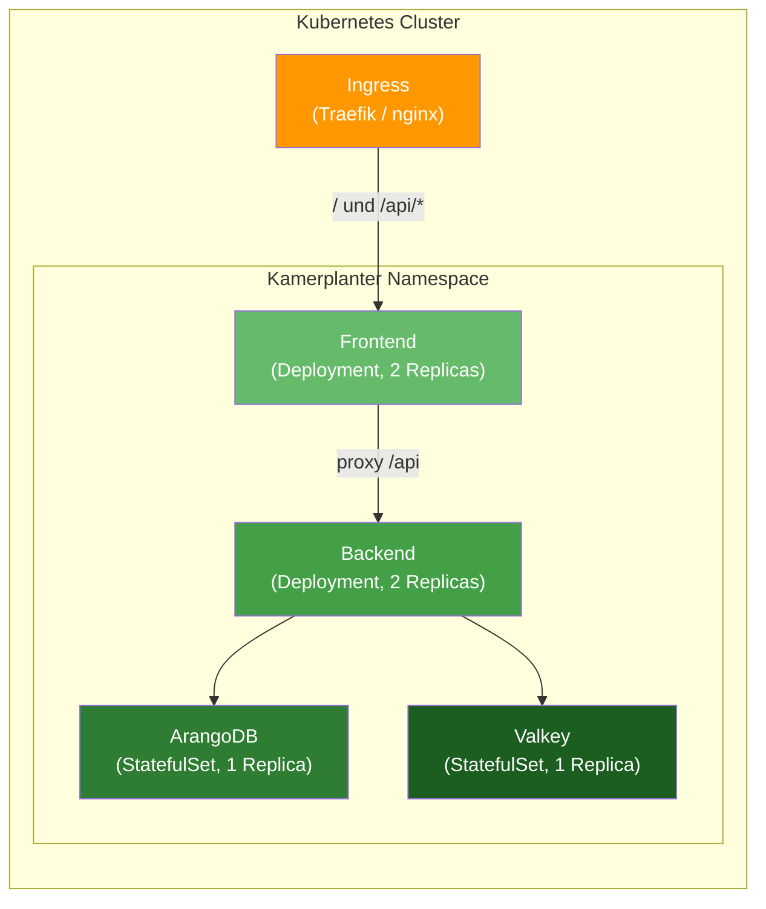

# Kubernetes-Deployment

Kamerplanter wird über ein einzelnes Helm-Chart deployt, das alle Komponenten enthält: Backend, Frontend, ArangoDB und Valkey. Die Container-Images und das Helm-Chart liegen in der GitHub Container Registry (ghcr.io).

---

## Voraussetzungen

| Was | Minimum |
|-----|---------|
| Kubernetes-Cluster | Version 1.28+ |
| Helm | Version 3.12+ |
| kubectl | Konfiguriert und verbunden mit dem Cluster |
| Ingress-Controller | Traefik, nginx-ingress oder vergleichbar |
| Speicher | StorageClass mit `ReadWriteOnce`-Unterstützung (für ArangoDB + Valkey) |

---

## Überblick: Was wird deployt?

<!-- diagram-source: user-described — Kubernetes deployment topology: ingress routing to frontend/backend, backend to ArangoDB and Valkey -->

```mermaid
flowchart TB
    subgraph "Kubernetes Cluster"
        direction TB
        ING["Ingress<br/>(Traefik / nginx)"]

        subgraph "Kamerplanter Namespace"
            FE["Frontend<br/>(Deployment, 2 Replicas)"]
            BE["Backend<br/>(Deployment, 2 Replicas)"]
            DB["ArangoDB<br/>(StatefulSet, 1 Replica)"]
            VK["Valkey<br/>(StatefulSet, 1 Replica)"]
        end
    end

    ING -->|"/ und /api/*"| FE
    BE --> DB
    BE --> VK
    FE -->|"proxy /api"| BE

    style ING fill:#FF9800,color:#fff
    style FE fill:#66BB6A,color:#fff
    style BE fill:#43A047,color:#fff
    style DB fill:#2E7D32,color:#fff
    style VK fill:#1B5E20,color:#fff
```

| Komponente | Typ | Replicas | Beschreibung |
|-----------|-----|:--------:|-------------|
| Backend | Deployment | 2 | FastAPI-Anwendung (API + Celery Worker) |
| Frontend | Deployment | 2 | React-App hinter nginx, Proxy für `/api` zum Backend |
| ArangoDB | StatefulSet | 1 | Dokumenten-/Graph-Datenbank mit Persistent Volume (5 Gi) |
| Valkey | StatefulSet | 1 | Redis-kompatibler Cache + Celery-Broker (1 Gi) |

---

## Installation

### 1. Helm-Repository hinzufügen

Das Kamerplanter Helm-Chart liegt als OCI-Artefakt in der GitHub Container Registry:

```bash
# OCI-Registries benötigen kein helm repo add —
# der Pull erfolgt direkt über die OCI-URL
helm pull oci://ghcr.io/nolte/charts/kamerplanter --version 0.2.0
```

!!! warning "`--version` muss eine veröffentlichte Version nennen"

    `0.2.0` ist die zuletzt veröffentlichte Chart-Version. Unter derselben
    OCI-Adresse liegt daneben ein Entwicklungskanal: Der `develop`-Baum trägt
    eine Vorabversion mit dem Zusatz `-dev` (derzeit `0.2.1-dev`), und dieser Tag
    wird bei jedem Merge nach `develop` überschrieben, der `helm/` berührt.
    Erzwungen ist dabei nur der Bezeichner `dev`, nicht die Nummer davor: Die
    `-dev`-Version muss der veröffentlichten Linie nicht voraus sein. Ziehe
    daraus nichts, was laufen soll — die Bytes wechseln unter dir, ohne dass sich
    die Versionsangabe ändert. Details:
    [CI/CD — Zwei Kanäle](ci-cd.md#zwei-kanaele).

!!! danger "Der Chart-Tag `0.2.0` wurde aus `develop` überschrieben"

    `charts/kamerplanter:0.2.0` trägt nicht mehr das, was das Release `v0.2.0`
    veröffentlicht hat. Gemessen am OCI-Manifest: Es ist mit
    `org.opencontainers.image.created: 2026-08-18T14:09:14Z` annotiert, während
    `v0.2.0` am 13.08.2026 um 18:09:49 UTC veröffentlicht wurde — ein
    `helm/`-Merge nach `develop` hat den Tag fünf Tage später neu gepusht. Genau
    das verhindern die beiden Kanal-Prüfungen seither. Repariert wird der Tag
    bewusst **nicht**: Ihn zu überschreiben wäre ein zweiter Push unter derselben
    Versionsreferenz.

    Für die Befehle auf dieser Seite heißt das: `--version 0.2.0` löst weiterhin
    auf, liefert aber einen `develop`-Stand statt des Release-Stands. `0.1.0` ist
    der jüngste Chart-Tag, dessen Manifest noch seinen Release-Zeitstempel trägt
    (erstellt am 06.08.2026 um 13:38:04 UTC, 15 Sekunden nach der
    Veröffentlichung von `v0.1.0`), und `v0.2.1` — zum Zeitpunkt dieser Zeilen
    noch ein Entwurf — ist das erste Release, das unter dem Schutz beider
    Prüfungen entsteht. Was du auch wählst: Reproduzierbar wird ein Deployment
    erst, wenn du den Manifest-Digest pinnst, den du geprüft hast.
    <!-- #1222 -->

??? note "Authentifizierung an der GitHub Registry"
    Falls die Registry privat ist, musst du dich vorher anmelden:

    ```bash
    echo $GITHUB_TOKEN | helm registry login ghcr.io --username $GITHUB_USER --password-stdin
    ```

### 2. Pflicht-Secrets anlegen

!!! danger "Ohne dieses Secret startet kein Backend-Pod"
    Bevor du das Chart installierst, muss das Kubernetes-Secret `kamerplanter-secrets` existieren. Der Backend-Container liest `ARANGODB_PASSWORD`, `ARANGO_ROOT_PASSWORD`, `JWT_SECRET_KEY`, `FERNET_KEY`, `ERASURE_TOMBSTONE_SALT` und `LOG_PSEUDONYM_SALT` ausschließlich über `envFrom` aus diesem Secret — **nicht** aus `values.yaml`. Fehlt eines der fünf zuletzt genannten Werte (bzw. bleibt `ARANGODB_PASSWORD` beim Literal `rootpassword`), bricht der Backend-Start mit `SystemExit` ab, sobald `DEBUG=false` gesetzt ist (Fail-Fast-Gate, `src/backend/app/main.py`). Der Celery-Worker-Pod bezieht dasselbe Secret und prüft `LOG_PSEUDONYM_SALT` beim Start genauso streng; er bricht mit `SystemExit` ab, wenn der Wert fehlt oder kürzer als 32 Zeichen ist.

```bash
kubectl create namespace kamerplanter

kubectl create secret generic kamerplanter-secrets \
  --namespace kamerplanter \
  --from-literal=ARANGODB_PASSWORD="dein-sicheres-passwort" \
  --from-literal=ARANGO_ROOT_PASSWORD="dein-sicheres-passwort" \
  --from-literal=JWT_SECRET_KEY="$(openssl rand -hex 32)" \
  --from-literal=FERNET_KEY="$(python3 -c 'from cryptography.fernet import Fernet; print(Fernet.generate_key().decode())')" \
  --from-literal=ERASURE_TOMBSTONE_SALT="$(openssl rand -hex 32)" \
  --from-literal=LOG_PSEUDONYM_SALT="$(openssl rand -hex 32)"
```

#### Datenbank-Zugänge

Die Anwendung verbindet sich nicht als `root` mit ArangoDB, sondern mit dem Konto `kamerplanter` (`database.arangodb.appUsername`). Ein Hilfscontainer `app-user` im ArangoDB-Pod legt es bei jedem Start an bzw. aktualisiert es: Passwort aus `ARANGODB_PASSWORD`, Lese- und Schreibrecht nur auf der Anwendungsdatenbank, kein Zugriff auf `_system`. Der ArangoDB-Container selbst erhält aus dem Secret nur `ARANGO_ROOT_PASSWORD`.

- **`ARANGODB_PASSWORD`** ist das Passwort des Anwendungskontos. Wähle einen eigenen Wert, nicht das Root-Passwort.
- **`ARANGO_ROOT_PASSWORD`** braucht nur der ArangoDB-Pod. Lege es in ein eigenes Secret, dann sieht das Backend das Root-Passwort nicht mehr (es liest `kamerplanter-secrets` vollständig per `envFrom`):

```bash
kubectl create secret generic kamerplanter-arangodb-root \
  --namespace kamerplanter \
  --from-literal=ARANGO_ROOT_PASSWORD="$(openssl rand -hex 32)"
```

```yaml title="values-production.yaml (Ausschnitt)"
database:
  arangodb:
    rootPasswordSecret: kamerplanter-arangodb-root
```

!!! warning "Bestehende Installation: Root-Zugang in drei Schritten trennen"
    ArangoDB liest `ARANGO_ROOT_PASSWORD` nur beim allerersten Start mit leerem Volume. Bei einer bestehenden Installation gilt deshalb:

    1. **Upgrade:** Nach dem Upgrade legt `app-user` das Konto `kamerplanter` mit dem bisherigen `ARANGODB_PASSWORD` an, und Backend, Worker und Beat verbinden sich damit. Hast du in deinen Values `ARANGODB_USERNAME: root` oder ein `envFrom` am ArangoDB-Container gesetzt (frühere Fassung dieser Anleitung), entferne beides — sonst bleibt es beim Root-Zugang. Zurück zum alten Verhalten: `database.arangodb.appUsername: root`.
    2. **Eigenes Anwendungspasswort:** Setze in `kamerplanter-secrets` einen neuen Wert für `ARANGODB_PASSWORD`, starte zuerst den ArangoDB-Pod neu (`app-user` übernimmt das Passwort) und danach Backend, Worker und Beat (`kubectl rollout restart`).
    3. **Root-Passwort auslagern:** Lege `kamerplanter-arangodb-root` mit dem **aktuellen** Root-Passwort an, setze `database.arangodb.rootPasswordSecret` und entferne danach `ARANGO_ROOT_PASSWORD` aus `kamerplanter-secrets`. Willst du das Root-Passwort selbst ändern, ändere es zuerst in ArangoDB (`arangosh`) und dann im Secret.

Vollständige Übersicht aller Pflicht-Secrets je aktivierter Funktion (z. B. `INTERNAL_SERVICE_TOKEN` sobald der KI-Assistent oder die Bilderkennung aktiv sind): [Konfigurationsmatrix — Pflicht-Secrets](konfigurationsmatrix.md#pflicht-secrets-je-aktivierter-funktion).

### 3. Values-Datei erstellen

Erstelle eine `values-production.yaml` mit deinen Anpassungen:

```yaml title="values-production.yaml"
controllers:
  backend:
    replicas: 2     # (1)!
    containers:
      main:
        envFrom:
          - secret: kamerplanter-secrets    # (2)!
        env:
          ARANGODB_HOST: kamerplanter-arangodb
          ARANGODB_PORT: "8529"
          ARANGODB_DATABASE: kamerplanter
          REDIS_URL: redis://kamerplanter-valkey:6379/0
          CORS_ORIGINS: '["https://pflanzen.example.com"]'
          DEBUG: "false"
          KAMERPLANTER_MODE: full    # (3)!

  frontend:
    replicas: 2

  arangodb:
    statefulset:
      volumeClaimTemplates:
        - name: data
          accessMode: ReadWriteOnce
          size: 10Gi    # (5)!
          advancedMounts:    # (4)!
            main:
              - path: /var/lib/arangodb3

# Anhänge in S3 — Pflicht bei mehr als einer Backend-Replica
storage:
  backend: s3
  s3:
    endpointUrl: https://s3.eu-central-1.amazonaws.com
    region: eu-central-1
    bucket: kamerplanter-prod
    credentialsRef:
      secretName: storage-s3-credentials

ingress:
  main:
    enabled: true
    hosts:
      - host: pflanzen.example.com    # (6)!
        paths:
          - path: /              # auch /api: das Frontend-nginx leitet es ans Backend weiter
            pathType: Prefix
            service:
              identifier: frontend
```

1. Zwei Replicas für Rolling Updates ohne Downtime. **Nur mit S3** (`storage.backend: s3`, siehe unten) oder einem `ReadWriteMany`-Volume: Auf dem Standard-Volume `ReadWriteOnce` verweigert das Chart mehr als eine Backend-Replica, weil ein zweiter Pod auf einem anderen Node nie startet ([Storage-Konfiguration](helm.md#storage-konfiguration-nfr-013)).
2. Zieht `ARANGODB_PASSWORD`, `JWT_SECRET_KEY`, `FERNET_KEY`, `ERASURE_TOMBSTONE_SALT` und `LOG_PSEUDONYM_SALT` aus dem im vorigen Schritt angelegten Secret — keine Klartext-Passwörter in `values.yaml`.
3. `light` = ohne Login/Tenant-System, ein Nutzer. `full` (Standard im Chart) = mit JWT-Auth und Mandantenverwaltung. Details: [Betriebsprofile](betriebsprofile.md).
4. Nur der ArangoDB-Container `main` mountet das Datenvolume, nicht der Hilfscontainer `app-user`. Das Root-Passwort und das Anwendungskonto stellt das Chart selbst ein (siehe [Datenbank-Zugänge](#datenbank-zugange)); setze hier kein `envFrom` und kein `ARANGODB_USERNAME`.
5. Passe die Größe an deinen Bedarf an. Der Chart-Default für die ArangoDB-PVC liegt bei 5Gi.
6. Dein gewünschter Hostname. Der Ingress-Controller muss darauf konfiguriert sein.

!!! warning "Passwörter nie in der Values-Datei"
    `values-production.yaml` referenziert Secrets ausschließlich über `envFrom`/`secretKeyRef` — nie über einen Klartext-Wert in `env:`. Für GitOps-Workflows eignet sich statt manuellem `kubectl create secret` ein Secret-Management-Tool wie Sealed Secrets oder External Secrets Operator (siehe [ArgoCD — Deklaratives Secret-Management](argocd.md#secret-vorbereiten)).

### 4. Helm-Chart installieren

```bash
helm install kamerplanter \
  oci://ghcr.io/nolte/charts/kamerplanter \
  --version 0.2.0 \
  --namespace kamerplanter \
  --create-namespace \
  --values values-production.yaml
```

!!! warning "`0.2.0` ist hier dieselbe überschriebene Chart-Version"

    Der Tag löst auf, liefert aber einen `develop`-Stand und nicht den Stand des
    Releases `v0.2.0`. Warum, und was du stattdessen pinnst, steht in
    [Schritt 1](#1-helm-repository-hinzufugen).
    <!-- #1222 -->

### 5. Deployment prüfen

```bash
# Pod-Status prüfen
kubectl get pods -n kamerplanter

# Auf gesunde Pods warten
kubectl wait --for=condition=ready pod \
  --all -n kamerplanter --timeout=120s
```

Erwartete Ausgabe:

```
NAME                                      READY   STATUS    RESTARTS   AGE
kamerplanter-backend-7d8f9b6c4d-abc12     1/1     Running   0          45s
kamerplanter-backend-7d8f9b6c4d-def34     1/1     Running   0          45s
kamerplanter-frontend-5c4d8e7f3b-ghi56    1/1     Running   0          45s
kamerplanter-frontend-5c4d8e7f3b-jkl78    1/1     Running   0          45s
kamerplanter-arangodb-0                   1/1     Running   0          45s
kamerplanter-valkey-0                     1/1     Running   0          45s
```

---

## Updates durchführen

```bash
# Auf neue Version aktualisieren
helm upgrade kamerplanter \
  oci://ghcr.io/nolte/charts/kamerplanter \
  --version 0.3.0 \
  --namespace kamerplanter \
  --values values-production.yaml
```

Die Backend- und Frontend-Deployments führen ein **Rolling Update** durch — es gibt keine Downtime, da die alten Pods erst beendet werden, wenn die neuen bereit sind.

Ein neuer Backend-Pod führt vor dem ersten Request die offenen Datenbank-Migrationen und die Stammdaten-Seeds aus. Das dauert bei einer leeren Datenbank rund eine Minute, mit einer langen Migration oder wenn ein anderer Pod gerade migriert, auch mehrere Minuten. Ein `startupProbe` gibt dem Start bis zu 15 Minuten, bevor Kubernetes den Container neu startet; bis dahin bleibt der alte Pod im Dienst.

---

## Deinstallation

```bash
helm uninstall kamerplanter --namespace kamerplanter
```

!!! warning "Persistent Volumes"
    `helm uninstall` entfernt die Deployments und Services, aber **nicht** die Persistent Volume Claims (PVCs) von ArangoDB und Valkey. Deine Daten bleiben erhalten. Um auch die Daten zu löschen:

    ```bash
    kubectl delete pvc --all -n kamerplanter
    ```

---

## Monitoring

### Logs prüfen

```bash
# Backend-Logs
kubectl logs -l app.kubernetes.io/component=backend -n kamerplanter --tail=50

# Frontend-Logs
kubectl logs -l app.kubernetes.io/component=frontend -n kamerplanter --tail=50

# ArangoDB-Logs
kubectl logs -l app.kubernetes.io/component=arangodb -n kamerplanter --tail=50
```

### Health-Checks

Das Backend bietet zwei Health-Endpunkte:

| Endpunkt | Prüft | Verwendung |
|----------|-------|-----------|
| `/api/v1/health/live` | Backend-Prozess läuft | Kubernetes Liveness-Probe |
| `/api/v1/health/ready` | Backend + Datenbank erreichbar | Kubernetes Readiness-Probe |

```bash
# Manuell testen (über Port-Forward)
kubectl port-forward svc/kamerplanter-backend 8000:8000 -n kamerplanter
curl http://localhost:8000/api/v1/health/ready
```

---

## Fehlerbehebung

??? question "Pods bleiben im Status 'Pending'"
    Der Cluster hat nicht genügend Ressourcen. Prüfe die verfügbare Kapazität mit `kubectl describe nodes` und vergleiche mit den Resource Requests in der Values-Datei. Für kleinere Cluster kannst du die Requests reduzieren.

??? question "ArangoDB startet nicht (CrashLoopBackOff)"
    Häufigste Ursache: Zu wenig Speicher. ArangoDB braucht mindestens 512 Mi. Prüfe die Logs: `kubectl logs kamerplanter-arangodb-0 -n kamerplanter`.

??? question "Frontend zeigt 502 Bad Gateway"
    Das Backend ist noch nicht bereit. Warte, bis die Readiness-Probe des Backends erfolgreich ist: `kubectl get pods -n kamerplanter -w`. Falls der Fehler bleibt: Stimmen die Service-Namen in der nginx-Konfiguration?

??? question "Ingress funktioniert, aber die Seite lädt nicht"
    Prüfe: (1) Ist ein Ingress-Controller installiert? (2) Zeigt der DNS-Eintrag auf den Cluster? (3) Stimmt der Hostname in der Values-Datei mit dem DNS überein?

??? question "Backend-Pod bleibt in 'CreateContainerConfigError'"
    Das Secret `kamerplanter-secrets` existiert nicht im Ziel-Namespace, oder ein per `envFrom`/`secretKeyRef` referenzierter Schlüssel fehlt darin. Prüfe: `kubectl get secret kamerplanter-secrets -n kamerplanter` und vergleiche die vorhandenen Schlüssel mit Schritt 2 oben.

??? question "Backend-Pod startet und crasht sofort wieder (CrashLoopBackOff mit 'FATAL: Default secrets detected')"
    Das Secret existiert, enthält aber einen unveränderten Standardwert — z. B. `ARANGODB_PASSWORD=rootpassword` oder ein leeres `FERNET_KEY`. Die Logzeile benennt die betroffenen Felder direkt: `kubectl logs -l app.kubernetes.io/component=backend -n kamerplanter`. Details zur Prüfung: [Konfigurationsmatrix — Pflicht-Secrets](konfigurationsmatrix.md#pflicht-secrets-je-aktivierter-funktion).

---

## Siehe auch

- [Konfigurationsmatrix](konfigurationsmatrix.md) — Vollständige Referenz aller Pflicht-Secrets je Funktion
- [Helm Charts](helm.md) — Detaillierte Beschreibung der Chart-Struktur und aller Konfigurationsoptionen
- [ArgoCD](argocd.md) — GitOps-basiertes Deployment mit deklarativem Secret-Management
- [Docker Compose Schnellstart](docker-quickstart.md) — Einfachere Alternative mit Docker Compose
- [Docker Compose Dauerbetrieb](docker-dauerbetrieb.md) — Docker-Compose-basierter Dauerbetrieb
