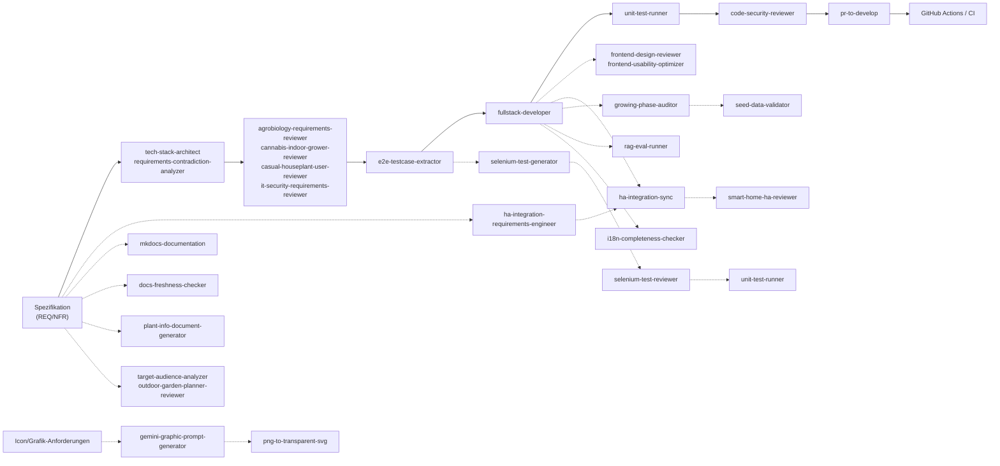

# Agent-Katalog

Übersicht aller verfügbaren Claude Code Agents im Kamerplanter-Projekt für autonome Feature-Implementierung, Requirements Engineering, Code-Reviews und Dokumentation.

!!! info "Stand: 2026-03-31 — 30 Agents registriert"
    Dieser Katalog wird vom `agent-catalog-generator` Agent automatisch erstellt und aktualisiert.

---

## Schnellreferenz

| Agent | Modell | Aufgabe | Kategorie |
|-------|--------|---------|----------|
| `agent-catalog-generator` | haiku | Generiert diesen Katalog | Dokumentation |
| `agrobiology-requirements-reviewer` | sonnet | Botanische Fachprüfung von Anforderungen | Analyse & Review |
| `cannabis-indoor-grower-reviewer` | sonnet | Cannabis-Anbau-Spezifikation validieren | Analyse & Review |
| `casual-houseplant-user-reviewer` | sonnet | Laien-Tauglichkeit von Zimmerpflanzenfunktionen | Analyse & Review |
| `code-security-reviewer` | sonnet | Code-Security-Audit (OWASP Top 10) | Analyse & Review |
| `docs-freshness-checker` | sonnet | Dokumentation auf Aktualität und Vollständigkeit prüfen | Dokumentation |
| `e2e-testcase-extractor` | sonnet | E2E-Testfälle aus Spezifikationen ableiten | Testing & QA |
| `frontend-design-reviewer` | sonnet | UI/UX, Responsive Design, Kiosk-Modus prüfen | Design & Grafik |
| `frontend-usability-optimizer` | sonnet | React/MUI-Komponenten für bessere UX optimieren | Design & Grafik |
| `fullstack-developer` | opus | Features Backend+Frontend implementieren | Entwicklung |
| `gemini-graphic-prompt-generator` | sonnet | Gemini-Prompts für Icons und Illustrationen | Design & Grafik |
| `growing-phase-auditor` | sonnet | Pflanzenphasen-Daten validieren und korrigieren | Testing & QA |
| `ha-integration-requirements-engineer` | sonnet | Home Assistant Integrations-Anforderungen ableiten | Analyse & Review |
| `ha-integration-sync` | opus | HA-Integration mit Backend-API synchronisieren | Entwicklung |
| `i18n-completeness-checker` | haiku | i18n-Übersetzungen auf Vollständigkeit prüfen | Testing & QA |
| `it-security-requirements-reviewer` | sonnet | Security & DSGVO in Anforderungen prüfen | Analyse & Review |
| `mkdocs-documentation` | sonnet | MkDocs-Dokumentation erstellen und pflegen | Dokumentation |
| `outdoor-garden-planner-reviewer` | sonnet | Freiland-Garten-Anforderungen validieren | Analyse & Review |
| `plant-info-document-generator` | sonnet | Detaillierte Pflanzen-Steckbriefe recherchieren | Dokumentation |
| `png-to-transparent-svg` | haiku | PNG mit Schachbrett-Hintergrund zu transparentem SVG | Entwicklung |
| `pr-to-develop` | sonnet | GitHub Pull Request für develop vorbereiten | Entwicklung |
| `rag-eval-runner` | sonnet | RAG-Quality-Benchmark ausführen und analysieren | Testing & QA |
| `requirements-contradiction-analyzer` | sonnet | Widersprüche in Anforderungen finden (RAG) | Analyse & Review |
| `seed-data-validator` | sonnet | YAML-Seed-Daten auf Qualität prüfen | Testing & QA |
| `selenium-test-generator` | opus | NFR-008-konforme Selenium-E2E-Tests generieren | Testing & QA |
| `selenium-test-reviewer` | sonnet | Selenium-Tests auf Qualität und Wartbarkeit prüfen | Testing & QA |
| `smart-home-ha-reviewer` | sonnet | HA-Integration gegen Spezifikation prüfen | Analyse & Review |
| `target-audience-analyzer` | sonnet | Zielgruppen und Marktpotenzial analysieren | Analyse & Review |
| `tech-stack-architect` | sonnet | Tech-Stack gegen Anforderungen validieren | Analyse & Review |
| `unit-test-runner` | sonnet | Unit-Tests + statische Analyse ausführen | Testing & QA |

---

## Agents nach Kategorie

=== "Analyse & Review"

    | Agent | Fokus |
    |-------|-------|
    | [`agrobiology-requirements-reviewer`](#agrobiology-requirements-reviewer) | Botanische Korrektheit, Indoor/Hydroponik, VPD, Lichttechnik |
    | [`cannabis-indoor-grower-reviewer`](#cannabis-indoor-grower-reviewer) | Cannabis-Anbau Legality, Spezifikation |
    | [`casual-houseplant-user-reviewer`](#casual-houseplant-user-reviewer) | Laien-Bedienbarkeit, Zimmerpflanzenpflege |
    | [`code-security-reviewer`](#code-security-reviewer) | OWASP Top 10, Auth, Tenant-Isolation, Injection |
    | [`ha-integration-requirements-engineer`](#ha-integration-requirements-engineer) | Home Assistant Entity-Mappings, Coordinatoren |
    | [`it-security-requirements-reviewer`](#it-security-requirements-reviewer) | Auth, Autorisierung, DSGVO, Datensparsamkeit |
    | [`outdoor-garden-planner-reviewer`](#outdoor-garden-planner-reviewer) | Freiland, Überwinterung, Fruchtfolge, Gemeinschaftsgarten |
    | [`requirements-contradiction-analyzer`](#requirements-contradiction-analyzer) | Widersprüche, Konsistenz, RAG-Analyse |
    | [`smart-home-ha-reviewer`](#smart-home-ha-reviewer) | Home Assistant Spezifikation, Integration |
    | [`target-audience-analyzer`](#target-audience-analyzer) | Zielgruppen, Marktpotenzial, Personas |
    | [`tech-stack-architect`](#tech-stack-architect) | Tech-Stack-Validierung, Abhängigkeiten |

=== "Entwicklung"

    | Agent | Fokus |
    |-------|-------|
    | [`fullstack-developer`](#fullstack-developer) | Features Backend+Frontend, FastAPI, React |
    | [`ha-integration-sync`](#ha-integration-sync) | HA-Integration mit API synchronisieren |
    | [`png-to-transparent-svg`](#png-to-transparent-svg) | PNG→SVG mit Transparenz-Konvertierung |
    | [`pr-to-develop`](#pr-to-develop) | GitHub PR vorbereiten mit CI-Validierung |

=== "Testing & QA"

    | Agent | Fokus |
    |-------|-------|
    | [`e2e-testcase-extractor`](#e2e-testcase-extractor) | E2E-Testfälle aus Spezifikationen ableiten |
    | [`growing-phase-auditor`](#growing-phase-auditor) | Pflanzenphasen-Daten validieren |
    | [`i18n-completeness-checker`](#i18n-completeness-checker) | i18n-Übersetzungen auf Vollständigkeit prüfen |
    | [`rag-eval-runner`](#rag-eval-runner) | RAG-Quality-Benchmark ausführen und analysieren |
    | [`seed-data-validator`](#seed-data-validator) | YAML-Seed-Daten-Qualität |
    | [`selenium-test-generator`](#selenium-test-generator) | Selenium E2E-Tests generieren |
    | [`selenium-test-reviewer`](#selenium-test-reviewer) | Selenium-Tests reviewen |
    | [`unit-test-runner`](#unit-test-runner) | Unit-Tests + statische Analyse ausführen |

=== "Design & Grafik"

    | Agent | Fokus |
    |-------|-------|
    | [`frontend-design-reviewer`](#frontend-design-reviewer) | Responsive Design, Kiosk-Modus, Touch-Targets |
    | [`frontend-usability-optimizer`](#frontend-usability-optimizer) | Form-Usability, Labels, Hilfstexte, Mobile-First |
    | [`gemini-graphic-prompt-generator`](#gemini-graphic-prompt-generator) | Gemini Image Generation Prompts |

=== "Dokumentation"

    | Agent | Fokus |
    |-------|-------|
    | [`agent-catalog-generator`](#agent-catalog-generator) | Diesen Katalog generieren |
    | [`docs-freshness-checker`](#docs-freshness-checker) | Doku auf Aktualität und Vollständigkeit prüfen |
    | [`mkdocs-documentation`](#mkdocs-documentation) | MkDocs-Dokumentation erstellen |
    | [`plant-info-document-generator`](#plant-info-document-generator) | Pflanzen-Steckbriefe recherchieren |

---

## Agent-Details

### `agent-catalog-generator`

**Modell:** haiku | **Tools:** Read, Write, Glob, Grep

**Rolle:** Technical Writer, der alle Agent-Definitionen systematisch einliest und einen kompakten, entwicklerfreundlichen Katalog generiert.

??? example "Wann einsetzen?"
    - Nach dem Hinzufügen neuer Agents zu `.claude/agents/`
    - Beim Onboarding neuer Entwickler
    - Zur zentralen Agenten-Referenz pflegen

**Workflow:**
1. Alle Agent-Definitionen aus `.claude/agents/*.md` einlesen
2. YAML-Frontmatter und Markdown-Body analysieren
3. Agents nach Kategorie gruppieren und sortieren
4. Dokumentations-Katalog mit Tabellen, Tabs und Details generieren
5. RAG-optimierte Metadaten einfügen

**Output:** `docs/de/development/agent-catalog.md` — Dieser Katalog mit Übersicht, Tabellen, Kategorisierung und Entscheidungshilfe

---

### `agrobiology-requirements-reviewer`

**Modell:** sonnet | **Tools:** Read, Write, Glob, Grep

**Rolle:** Agrarbiologie-Experte mit 20+ Jahren Praxis in Indoor-Anbau, Hydroponik, Zimmerpflanzen und geschütztem Anbau, der Anforderungen auf biologische Korrektheit und Vollständigkeit prüft.

??? example "Wann einsetzen?"
    - Anforderungen für Indoor-Anbau, Hydroponik, Zimmerpflanzen
    - Licht-Parameter (PPFD, DLI), VPD, EC-Werte, Substrate
    - Pflanzenschutz, Phänologie, Phasensteuerung

**Workflow:**
1. Anforderungsdokumente einlesen und klassifizieren (Indoor/Hydroponik/Outdoor)
2. Biologische Korrektheit prüfen (Licht, Temperatur, VPD, Substrate)
3. Vollständigkeitschecklisten abarbeiten (Zimmerpflanzen, Hydroponik, IPM)
4. Datenquelle-Verfügbarkeit bewerten
5. Report mit Findings (Fehler/Unvollständig/Ungenau) erstellen

**Output:** `spec/analysis/agrobiology-review.md` — Detaillierter Report mit botanischen Findings, Korrekturvorschlägen und Datenquellen

---

### `cannabis-indoor-grower-reviewer`

**Modell:** sonnet | **Tools:** Read, Write, Glob, Grep

**Rolle:** Cannabis-Anbau-Spezialist der Spezifikationen auf Legalität, Durchführbarkeit und Best-Practice-Konformität prüft.

??? example "Wann einsetzen?"
    - Cannabis-Anbau-Features spezifizieren oder validieren
    - Legale Anforderungen (CanG, PflSchG) prüfen
    - Indoor-Growing-Spezifikation reviewen

**Workflow:**
1. Alle Cannabis-spezifischen Anforderungen identifizieren
2. Legale Grundlagen prüfen (CanG Lizenzpflicht, PflSchG Karenzzeiten)
3. Genetische Daten, Phänotypen, Terpene bewerten
4. Growing-Parameter (Photoperiode, VPD, EC) validieren
5. Report mit Legal-Checks und Best-Practice-Abweichungen

**Output:** `spec/analysis/cannabis-grower-review.md` — Legalitäts-Check, Growing-Parameter-Validierung, Risiko-Bewertung

---

### `casual-houseplant-user-reviewer`

**Modell:** sonnet | **Tools:** Read, Write, Glob, Grep

**Rolle:** Planloser Zimmerpflanzenbesitzer ohne grünen Daumen, der Anforderungen auf Alltagstauglichkeit und Anfänger-Freundlichkeit prüft.

??? example "Wann einsetzen?"
    - Anforderungen für Casual User (Laien)
    - Onboarding, Gießerinnerungen, Problem-Erkennung testen
    - Sprache und Verständlichkeit bewerten
    - Aufwand-Nutzen-Verhältnis prüfen

**Workflow:**
1. Alle Anforderungen aus Laien-Perspektive lesen
2. Dealbreaker-Features identifizieren (z.B. Foto-Erkennung)
3. Frustrierendes und Überforderendes markieren
4. Aufwand pro Woche schätzen
5. Konkurrenz-Vergleich (Planta, Greg) durchführen
6. Report mit Dealbreakern, Optimierungen, Aufwand-Analyse

**Output:** `spec/analysis/casual-houseplant-user-review.md` — Laien-Perspektive, Dealbreaker, Aufwand-Analyse, Konkurrenz-Vergleich

---

### `code-security-reviewer`

**Modell:** sonnet | **Tools:** Read, Edit, Bash, Glob, Grep

**Rolle:** Application Security Engineer, der implementiertem Backend- und Frontend-Code auf OWASP-Top-10-Schwachstellen prüft und behebt.

??? example "Wann einsetzen?"
    - Nach Feature-Implementierung durch Fullstack-Developer
    - Injection, Auth-Bypass, Tenant-Isolation, Secret Leaks prüfen
    - Security-Fixes implementieren
    - Vor Production-Deployment

**Workflow:**
1. Backend- und Frontend-Code analysieren (Discovery)
2. OWASP-A01 bis A10 systematisch prüfen
3. Tenant-Isolation, RBAC, JWT, Secrets validieren
4. Kritische Schwachstellen (P0/P1) sofort beheben
5. Security-Report mit behobenen und offenen Punkten

**Output:** `spec/analysis/code-security-review.md` — Security-Audit, P0/P1/P2/P3 Findings, Compliance-Matrix

---

### `docs-freshness-checker`

**Modell:** sonnet | **Tools:** Read, Glob, Grep, Bash

**Rolle:** Documentation Quality Engineer, der die bestehende Dokumentation (docs/de/, docs/en/) und ADRs auf Aktualität, Vollständigkeit und Konsistenz mit dem implementierten Code prüft.

??? example "Wann einsetzen?"
    - Dokumentation auf Veraltung prüfen
    - Fehlende Doku-Seiten für implementierte Features identifizieren
    - DE/EN-Parität sicherstellen
    - Doku-Qualität vor Release überprüfen

**Workflow:**
1. Implementierungsstand ermitteln (API-Router, Domain-Models, Frontend-Seiten)
2. Dokumentationsstruktur laden (docs/de, docs/en, ADRs)
3. API-Dokumentation vs. Code abgleichen (implementiert/dokumentiert)
4. User-Guide-Vollständigkeit prüfen (Features haben Doku?)
5. DE/EN-Parität validieren (Datei- und Inhalts-Vergleich)
6. ADR-Aktualität überprüfen (Status, Technologie-Referenzen)
7. Tote Links und Code-Referenzen finden

**Output:** `spec/analysis/docs-freshness-report.md` — Report mit API-Lücken, User-Guide-Fehlern, Parität-Violations, ADR-Befunden, toten Links

---

### `e2e-testcase-extractor`

**Modell:** sonnet | **Tools:** Read, Write, Glob, Grep

**Rolle:** Elite QA-Architekt, der E2E-Testfälle aus Spezifikationen aus der Endbenutzerperspektive (Browser-Sicht) systematisch ableitet.

??? example "Wann einsetzen?"
    - Spezifikationen vorliegen und Testfälle benötigt
    - Testabdeckung gegen Spec abgleichen
    - RAG-optimierte Testfall-Dokumente erstellen
    - Requirement-Traceability etablieren

**Workflow:**
1. Spezifikationen einlesen und nach testbaren Szenarien decomposieren
2. Für jedes UI-Element Test Cases ableiten (Happy Path + Fehler)
3. Testfälle strukturieren: Preconditions → Test Steps → Expected Results
4. RAG-Metadaten (Frontmatter, Tags) hinzufügen
5. Strukturierte Testfall-Dateien generieren

**Output:** `spec/test-cases/TC-{REQ-ID}.md` — RAG-optimierte Testfall-Dokumente mit Traceability

---

### `frontend-design-reviewer`

**Modell:** sonnet | **Tools:** Read, Write, Glob, Grep

**Rolle:** Frontend-Designer mit 15+ Jahren Erfahrung in Responsive Design, Kiosk-Systemen und Touch-Interfaces für raue Arbeitsumgebungen.

??? example "Wann einsetzen?"
    - UI/UX-Anforderungen reviewen
    - Responsive Design (Mobile/Tablet/Desktop/Kiosk)
    - Touch-Target-Größen validieren
    - Kiosk-Modus mit verschmutzten Händen testen

**Workflow:**
1. Alle Anforderungen nach Bedienkontext klassifizieren
2. Responsive Design prüfen (Breakpoints, Fluid Grids)
3. Kiosk-Modus bewerten (64–72px Touch-Targets, Vereinfachung)
4. Mobile Vor-Ort-Szenarien validieren
5. Report mit Design-Findings und Wireframe-Vorschlägen

**Output:** `spec/analysis/frontend-design-review.md` — Responsive-Matrix, Kiosk-Detailbewertung, Touch-Target-Audit, Wireframes

---

### `frontend-usability-optimizer`

**Modell:** sonnet | **Tools:** Read, Write, Edit, Bash, Glob, Grep

**Rolle:** UX-Engineer, der React/MUI-Komponenten nach Mobile-First-Prinzip für bessere Usability optimiert (Labels, Hilfstexte, Validierung, Layout).

??? example "Wann einsetzen?"
    - Nach Fullstack-Developer Feature-Implementierung
    - Formulare und Dialoge optimieren
    - Fachbegriff-Erklärungen (Tooltips) hinzufügen
    - Responsive Layouts verbessern

**Workflow:**
1. Code einlesen und Usability-Probleme identifizieren
2. Beschreibende Texte und Hilfstexte ergänzen
3. Feldanordnung und Validierung optimieren
4. Mobile-First Progressive Enhancement umsetzen
5. UI-NFR-Compliance-Prüfung durchführen
6. Tests durchführen und Zusammenfassung ausgeben

**Output:** Optimierter Code in `src/frontend/` + Zusammenfassung mit Usability-Verbesserungen und Compliance-Checks

---

### `fullstack-developer`

**Modell:** opus | **Tools:** Read, Write, Edit, Bash, Glob, Grep

**Rolle:** Senior Full-Stack-Entwickler, der Features vollständig (Backend FastAPI + Frontend React) unter strikter Einhaltung aller NFRs umsetzt.

??? example "Wann einsetzen?"
    - Features implementieren (Backend+Frontend)
    - APIs entwerfen und schreiben
    - Datenbankschemas erstellen
    - React-Komponenten bauen
    - Celery-Tasks schreiben

**Workflow:**
1. Anforderungs-Spezifikationen einlesen
2. Backend: ArangoDB-Models, APIs, Services, Tests
3. Frontend: React-Komponenten, Redux-Slices, Tests
4. Alle NFRs und UI-NFRs einhalten
5. Unit-Tests schreiben und validieren

**Output:** Production-ready Implementation in Backend + Frontend mit Tests; der `unit-test-runner` sollte grün sein

---

### `gemini-graphic-prompt-generator`

**Modell:** sonnet | **Tools:** Read, Write, Glob, Grep

**Rolle:** Visual Design Director, der präzise, produktionsreife Google Gemini Prompts für Icons, Illustrationen und Marketing-Material generiert.

??? example "Wann einsetzen?"
    - Icons und Illustrationen für die App
    - Onboarding-Bilder, Empty-State-Grafiken
    - Corporate Design Grafiken (grün #2e7d32)
    - Light/Dark-Mode-Varianten

**Workflow:**
1. Design-Anforderungen analysieren
2. Kamerplanter Corporate Design anwenden (Farben, Stil)
3. Gemini-Prompts mit Design-Details schreiben
4. Light/Dark-Mode-Varianten spezifizieren
5. Qualitätskriterien definieren (Transparenz, Auflösung)

**Output:** Gemini Image Generation Prompts für Designer/Marketing — z.B. für Icons, Illustrationen

---

### `growing-phase-auditor`

**Modell:** sonnet | **Tools:** Read, Write, Edit, Glob, Grep, Bash, WebSearch, WebFetch

**Rolle:** Horticultural Scientist, der Pflanzenphasen-Daten (bloom_months, harvest_months, etc.) in Seed-YAML auf biologische Korrektheit und chronologische Konsistenz prüft.

??? example "Wann einsetzen?"
    - Pflanzenphasen-Daten validieren und korrigieren
    - bloom_months, direct_sow_months, harvest_months prüfen
    - Biologische Plausibilität (Spätfröste, Frostdaten, Vernalisierung)
    - YAML-Dateien direkt korrigieren

**Workflow:**
1. Alle Seed-YAML-Dateien einlesen
2. Gegen 5 Check-Regeln validieren (Lücken, Biologie, Plausibilität)
3. Korrekturvorschläge mit WebSearch-Verifizierung
4. YAML-Dateien direkt mit dem Edit-Tool korrigieren
5. Report mit Findings und Verifizierungen erstellen

**Output:** Korrigierte YAML-Dateien + `spec/analysis/growing-phase-audit.md` mit Findings und Verifizierung

---

### `ha-integration-requirements-engineer`

**Modell:** sonnet | **Tools:** Read, Write, Glob, Grep

**Rolle:** Home Assistant Spezialist mit 8+ Jahren HACS-Integration-Entwicklung, der aus REQ-Dokumenten konkrete HA-Integrations-Anforderungen ableitet.

??? example "Wann einsetzen?"
    - Home Assistant Integration planen
    - Entity-Mappings und Coordinatoren entwerfen
    - Service-Calls spezifizieren
    - HA-CUSTOM-INTEGRATION.md erweitern

**Workflow:**
1. REQ-Dokumente einlesen
2. Drei-Seiten-Modell anwenden (Export A, Import B, Control C)
3. Entity-Taxonomien definieren
4. Coordinator-Datenstrukturen entwerfen
5. API-Anforderungen spezifizieren

**Output:** `spec/ha-integration/HA-CUSTOM-INTEGRATION.md` — Entity-Mappings, Coordinatoren, Services, Events

---

### `ha-integration-sync`

**Modell:** opus | **Tools:** Read, Write, Edit, Bash, Glob, Grep

**Rolle:** Home Assistant Integration Developer, der die kamerplanter-ha Custom Integration mit der aktuellen Backend-API synchronisiert, ohne bestehende Domain-Logik zu verändern.

??? example "Wann einsetzen?"
    - Backend-APIs ändern (neue Endpoints)
    - HA-Integration muss aktualisiert werden
    - API-Schemas ändern

**Workflow:**
1. Backend-API-Endpoints erfassen
2. HA-API-Client (api.py) analysieren
3. Delta-Analyse durchführen (neue/geänderte Endpoints)
4. Coordinator, Sensor und Service-Code anpassen
5. HA-Integration deployen

**Output:** Aktualisierte HA-Integration-Dateien + Deploy-Anweisungen

---

### `i18n-completeness-checker`

**Modell:** haiku | **Tools:** Read, Glob, Grep, Bash

**Rolle:** i18n-Qualitätsprüfer für React/TypeScript-Anwendungen mit react-i18next, der Übersetzungsdateien auf Vollständigkeit und Konsistenz prüft.

??? example "Wann einsetzen?"
    - Übersetzungen auf Lücken prüfen
    - Fehlende Sprachen/Keys identifizieren
    - Ungenutzte Keys finden
    - Inkonsistente Strukturen erkennen

**Workflow:**
1. Beide Übersetzungsdateien (DE/EN) laden und Keys extrahieren
2. Key-Vergleich durchführen (fehlend in EN/DE, strukturelle Unterschiede)
3. Frontend-Code nach i18n-Key-Verwendung durchsuchen
4. Qualitätsprüfungen durchführen (leere Werte, identische DE/EN, Placeholder-Konsistenz)
5. Report mit Kategorisierung nach Schweregrad ausgeben

**Output:** `spec/analysis/i18n-completeness-report.md` — Fehlende Keys, verwaiste Keys, identische Werte, leere Einträge

---

### `it-security-requirements-reviewer`

**Modell:** sonnet | **Tools:** Read, Write, Glob, Grep

**Rolle:** IT-Security-Architekt mit 15+ Jahren Erfahrung, der Anforderungen auf Sicherheit, Datenschutz und DSGVO-Compliance prüft.

??? example "Wann einsetzen?"
    - Anforderungen auf Sicherheitslücken prüfen
    - Authentifizierung, Autorisierung, Encryption
    - DSGVO-Compliance validieren
    - Datensparsamkeit prüfen

**Workflow:**
1. Alle Anforderungen einlesen
2. Sicherheits-Index erstellen (Daten, Zugriff, Schnittstellen)
3. Datenschutz-Anforderungen (DSGVO Art. 15–21) validieren
4. OWASP ASVS gegen Specs abgleichen
5. Report mit Security-Lücken und DSGVO-Empfehlungen

**Output:** `spec/analysis/it-security-review.md` — Sicherheitsbewertung, DSGVO-Audit, Empfehlungen

---

### `mkdocs-documentation`

**Modell:** sonnet | **Tools:** Read, Write, Edit, Bash, Glob, Grep

**Rolle:** Technical Writer und Documentation Engineer, der endnutzerfreundliche, mehrsprachige Dokumentation im MkDocs-Material-Format erstellt und pflegt.

??? example "Wann einsetzen?"
    - Dokumentationsseiten erstellen/aktualisieren
    - ADRs (Architecture Decision Records) schreiben
    - Guides und Tutorials verfassen
    - API-Docs generieren

**Workflow:**
1. Dokumentation im MkDocs-Material-Format schreiben
2. Deutsch und Englisch parallel (i18n)
3. Mermaid-Diagramme für Visualisierungen verwenden
4. mkdocstrings für API-Docs aus Docstrings
5. lokale mkdocs-Vorschau testen

**Output:** `docs/de/` und `docs/en/` — Benutzer- und Admin-Dokumentation

---

### `outdoor-garden-planner-reviewer`

**Modell:** sonnet | **Tools:** Read, Write, Glob, Grep

**Rolle:** Ambitionierte Hobbygärtnerin mit 15 Jahren Freiland-Garten + 80m² Gemeinschaftsgarten-Parzelle, die Anforderungen auf Praktikabilität und Alltags-Relevanz prüft.

??? example "Wann einsetzen?"
    - Freiland-Anbau-Features reviewen
    - Überwinterung, Fruchtfolge, Mischkultur validieren
    - Gemeinschaftsgarten-Funktionen prüfen
    - Seasonal Planning und Phenologie-Integration

**Workflow:**
1. Anforderungen aus Hobbygärtner-Perspektive lesen
2. Gartenleben-Workflows identifizieren
3. Freiland-Alltagstauglichkeit bewerten
4. Fruchtfolge, Überwinterung, Mischkultur-Features validieren
5. Report mit praktischen Hinweisen und Verbesserungsvorschlägen

**Output:** `spec/analysis/outdoor-garden-planner-review.md` — Hobbygärtner-Perspektive, Praxis-Feedback

---

### `plant-info-document-generator`

**Modell:** sonnet | **Tools:** Read, Write, Glob, Grep, WebSearch, WebFetch

**Rolle:** Agrar-Botaniker mit 20+ Jahren Praxis (Gärtnerei, Indoor-Growing, Schrebergarten), der detaillierte Pflanzen-Steckbriefe recherchiert und dokumentiert.

??? example "Wann einsetzen?"
    - Pflanzen-Steckbriefe für Datenbank erstellen
    - Kultur-, Dünge- und Pflegeinformationen recherchieren
    - Import-Dokumente (REQ-012) erzeugen
    - Botanische Daten zusammenstellen

**Workflow:**
1. Nutzereingabe analysieren (Pflanzenname, Liste)
2. Wissenschaftliche Namen recherchieren
3. Taxonomie, Phasen, Nährstoffe, IPM, Mischkultur erfassen
4. Quellen verifizieren (RHS, USDA, DWD)
5. Strukturiertes Dokument für Datenimport ausgeben

**Output:** Detaillierte Pflanzen-Informationsdokumente für Datenimport

---

### `png-to-transparent-svg`

**Modell:** haiku | **Tools:** Read, Write, Bash, Glob

**Rolle:** Bildverarbeitungs-Spezialist, der PNG-Bilder mit Schachbrett-Hintergrund in saubere SVGs mit echter Transparenz konvertiert.

??? example "Wann einsetzen?"
    - KI-generierte Icons mit Schachbrett-Hintergrund konvertieren
    - Gemini/DALL-E/Midjourney Images zu SVG
    - Screenshots mit Schachbrett zu SVG

**Workflow:**
1. PNG-Input analysieren (Alpha-Kanal prüfen)
2. Schachbrettmuster erkennen und entfernen
3. Bereinigtes PNG mit echter Alpha-Transparenz erzeugen
4. PNG mit vtracer zu SVG vektorisieren
5. SVG-Datei speichern

**Output:** Transparente SVG-Dateien → `assets/icons/` oder benutzerdefinierter Zielordner

---

### `pr-to-develop`

**Modell:** sonnet | **Tools:** Read, Bash, Glob, Grep

**Rolle:** Release Engineer, der GitHub Pull Requests von Feature-Branches nach `develop` mit CI-Validierung und aussagekräftiger Dokumentation vorbereitet.

??? example "Wann einsetzen?"
    - Feature-Branch ist fertig implementiert
    - PR nach develop erstellen
    - CI-Tests validieren (GitHub Actions)
    - Code-Review vorbereiten

**Workflow:**
1. Branch-Analyse (Commits seit develop)
2. Geänderte Dateien analysieren (Backend/Frontend/Spec)
3. REQ/NFR-Nummern identifizieren
4. PR-Titel und ausführliche Beschreibung erstellen
5. Labels setzen und auf CI warten

**Output:** GitHub Pull Request nach `develop` mit Titel, Beschreibung, Labels, CI-Status

---

### `rag-eval-runner`

**Modell:** sonnet | **Tools:** Read, Write, Edit, Bash, Glob, Grep

**Rolle:** RAG-Quality-Engineer mit Expertise in Information Retrieval, LLM-Evaluation und Knowledge-Base-Optimierung, der den Kamerplanter RAG-Benchmark ausführt und optimiert.

??? example "Wann einsetzen?"
    - RAG-Evaluierungen ausführen (Smoke oder Full)
    - Fehler systematisch klassifizieren (Retrieval, Generation, Synonyme, Knowledge-Gap)
    - Wissensqualität verbessern
    - Regressionen erkennen und beheben

**Workflow:**
1. Infrastruktur-Check (Embedding Service, Ollama, VectorDB)
2. Vorheriges Ergebnis sichern, Smoke-Test ausführen
3. Bei Bedarf Full Benchmark durchführen
4. Ergebnisse laden und Trend-Vergleich machen
5. Fehler nach Entscheidungsbaum klassifizieren (Synonym-Gap, Generation-Miss, Retrieval-Miss, Knowledge-Gap)
6. Priorisierte Verbesserungsmassnahmen vorschlagen
7. Optionale Quick-Fixes anwenden (Synonym erweitern, Fragen anpassen, Knowledge-Chunks erstellen)

**Output:** `tests/rag-eval/eval_report.md` — Fehlerklassifizierung, Kategorie-Trend, priorisierte Verbesserungsmassnahmen

---

### `requirements-contradiction-analyzer`

**Modell:** sonnet | **Tools:** Read, Write, Glob, Grep, Bash

**Rolle:** Requirements Engineer, der Anforderungsdokumente mittels RAG auf Widersprüche zwischen funktionalen und non-funktionalen Anforderungen systematisch analysiert.

??? example "Wann einsetzen?"
    - Anforderungen auf Konsistenz prüfen
    - Widersprüche finden (FA vs. NFA)
    - Spezifikations-Quality sicherstellen
    - QA-Vorbereitung

**Workflow:**
1. Alle Anforderungs-Dokumente einlesen (RAG-Retrieval)
2. Anforderungen klassifizieren (FA/NFA)
3. Anforderungs-Index aufbauen
4. Systematisch auf Widersprüche prüfen
5. Report mit Widerspruch-Findings generieren

**Output:** `spec/analysis/contradiction-analysis.md` — Widersprüche, Inkonsistenzen, Empfehlungen

---

### `seed-data-validator`

**Modell:** sonnet | **Tools:** Read, Write, Glob, Grep, Bash, WebSearch, WebFetch

**Rolle:** Datenqualitäts-Ingenieur, der YAML-Seed-Daten auf Vollständigkeit, Konsistenz, referenzielle Integrität und botanische Plausibilität prüft.

??? example "Wann einsetzen?"
    - Seed-Daten auf Qualität prüfen
    - Fehlende Pflichtfelder finden
    - Schema-Konformität validieren
    - Dünger-Produkte verifizieren (3-Quellen-Check)

**Workflow:**
1. YAML-Seed-Dateien einlesen
2. Schema-Konformität prüfen
3. Referenzielle Integrität validieren
4. Botanische Plausibilität bewerten (optional Agrobiology-Reviewer)
5. Multi-Source-Verifikation (Hersteller, SDS, Händler)
6. Report mit Data Quality Findings

**Output:** `spec/analysis/seed-data-validation.md` — Datenqualitäts-Report mit Findings

---

### `selenium-test-generator`

**Modell:** opus | **Tools:** Read, Write, Edit, Glob, Grep, Bash

**Rolle:** QA-Ingenieur und Selenium-Experte, der NFR-008-konforme Python-Selenium-Tests mit Page-Object-Pattern und Screenshot-Checkpoints generiert.

??? example "Wann einsetzen?"
    - E2E-Tests generieren aus Testfall-Dokumenten
    - Selenium-Tests für Features schreiben
    - Testfall-Dokumente in Python-Tests konvertieren

**Workflow:**
1. NFR-008 und Testfall-Dokumente lesen
2. Anforderungen analysieren (testbar)
3. Page-Objects erstellen
4. Test-Klassen mit pytest generieren
5. Screenshot- und Protokoll-Funktionalität integrieren
6. Tests lokal validieren

**Output:** `tests/e2e/test_*.py` — NFR-008-konforme Selenium-Tests mit Protokoll-Generierung

---

### `selenium-test-reviewer`

**Modell:** sonnet | **Tools:** Read, Write, Edit, Glob, Grep, Bash

**Rolle:** QA-Spezialist, der vorhandene Selenium-Tests auf Qualität, Wartbarkeit, Flakiness und NFR-008-Konformität reviewt und optimiert.

??? example "Wann einsetzen?"
    - Selenium-Tests auf Qualität prüfen
    - Test-Flakiness reduzieren
    - Page-Object-Struktur optimieren
    - NFR-008-Compliance validieren

**Workflow:**
1. Bestehende Selenium-Tests analysieren
2. Auf NFR-008-Anforderungen prüfen
3. Flakiness-Probleme identifizieren
4. Code-Qualität, Wartbarkeit optimieren
5. Report mit Empfehlungen erstellen

**Output:** Optimierte Selenium-Tests + Qualitäts-Report

---

### `smart-home-ha-reviewer`

**Modell:** sonnet | **Tools:** Read, Write, Glob, Grep

**Rolle:** Home Assistant Integration Reviewer, der die kamerplanter-ha Custom Integration gegen Spezifikation und Best Practices prüft.

??? example "Wann einsetzen?"
    - HA-Integration gegen Spec validieren
    - Entity-Mappings prüfen
    - Coordinator-Logik reviewen
    - Service-Calls und Events validieren

**Workflow:**
1. HA-Integration Code analysieren
2. Gegen HA-CUSTOM-INTEGRATION.md prüfen
3. Entity-Taxonomien validieren
4. Coordinator-Datenfluss überprüfen
5. Report mit Konformität und Optimierungen

**Output:** `spec/ha-integration/HA-REVIEW.md` — HA-Integration Review mit Findings

---

### `target-audience-analyzer`

**Modell:** sonnet | **Tools:** Read, Write, Glob, Grep

**Rolle:** Markt- und UX-Analyst, der die Zielgruppen, Personas und Marktpotenziale der Anwendung systematisch analysiert und dokumentiert.

??? example "Wann einsetzen?"
    - Zielgruppen-Profiling
    - Marktpotenzial-Analyse
    - Personas entwickeln
    - User-Research-Daten sammeln

**Workflow:**
1. Anforderungen und Kontexte analysieren
2. Potenzielle Zielgruppen identifizieren
3. Personas mit Zielen, Schmerzpunkten, Motivation erstellen
4. Marktgröße und -potential schätzen
5. Report mit Personas und Marktanalyse

**Output:** `spec/analysis/target-audience-analysis.md` — Zielgruppen-Analyse, Personas, Marktpotenzial

---

### `tech-stack-architect`

**Modell:** sonnet | **Tools:** Read, Write, Glob, Grep

**Rolle:** Tech-Architekt, der den definierten Tech-Stack (FastAPI, React, ArangoDB, Redis, Kubernetes) gegen Anforderungen validiert und Technologie-Entscheidungen begründet.

??? example "Wann einsetzen?"
    - Tech-Stack gegen Anforderungen validieren
    - Technology-Choice-Decisions reviewen
    - Dependency-Management prüfen
    - Architektur-Entscheidungen dokumentieren

**Workflow:**
1. Anforderungen und NFRs einlesen
2. Tech-Stack definieren (Backend, Frontend, Datenbanken, Infra)
3. Anforderungen gegen Stack abgleichen
4. Alternative Technologies bewerten
5. Report mit Validierung und Begründungen

**Output:** `spec/stack.md` oder Technology Decision Record — Tech-Stack-Validierung mit Begründungen

---

### `unit-test-runner`

**Modell:** sonnet | **Tools:** Read, Edit, Bash, Glob, Grep

**Rolle:** QA-Engineer und Test-Spezialist, der Unit-Tests (pytest, vitest) und statische Analyse (Ruff, ESLint, TypeScript) ausführt, Fehler analysiert und Fixes vorschlägt.

??? example "Wann einsetzen?"
    - Nach Feature-Implementierung durch Fullstack-Developer
    - Unit-Tests ausführen und Fehler fixen
    - Statische Analyse (Linting) durchführen
    - Merge-Readiness validieren

**Workflow:**
1. Backend-Ruff (lint + format) ausführen
2. Frontend-TypeScript und ESLint ausführen
3. Backend-Unit-Tests (pytest) ausführen
4. Frontend-Unit-Tests (vitest) ausführen
5. Test-Fehler analysieren und minimal fixe implementieren
6. Regressions-Check durchführen
7. Report mit Test-Ergebnissen und Merge-Status

**Output:** Test-Ergebnisse + Testbericht — grüne Tests oder Fehleranalyse mit Fixes

---

## Einsatz-Entscheidungshilfe

!!! tip "Welchen Agent brauche ich?"

    | Ich möchte... | Agent |
    |----------------|-------|
    | ...den Tech-Stack gegen Anforderungen validieren | `tech-stack-architect` |
    | ...Anforderungen auf Widersprüche prüfen | `requirements-contradiction-analyzer` |
    | ...E2E-Testfälle aus Specs ableiten | `e2e-testcase-extractor` |
    | ...Selenium-Tests generieren | `selenium-test-generator` |
    | ...Selenium-Tests auf Qualität prüfen | `selenium-test-reviewer` |
    | ...botanische Korrektheit der Anforderungen prüfen | `agrobiology-requirements-reviewer` |
    | ...UI/UX und Kiosk-Modus validieren | `frontend-design-reviewer` |
    | ...Formulare benutzerfreundlicher machen | `frontend-usability-optimizer` |
    | ...Cannabis-Anbau-Anforderungen validieren | `cannabis-indoor-grower-reviewer` |
    | ...Zielgruppen und Marktpotenzial analysieren | `target-audience-analyzer` |
    | ...Freiland-Garten-Anforderungen prüfen | `outdoor-garden-planner-reviewer` |
    | ...Laien-Tauglichkeit für Zimmerpflanzen-Features | `casual-houseplant-user-reviewer` |
    | ...Home Assistant Integration planen | `ha-integration-requirements-engineer` |
    | ...HA-Integration mit API synchronisieren | `ha-integration-sync` |
    | ...HA-Integration gegen Spec prüfen | `smart-home-ha-reviewer` |
    | ...Security-Anforderungen prüfen | `it-security-requirements-reviewer` |
    | ...implementierten Code auf Sicherheit prüfen | `code-security-reviewer` |
    | ...Features implementieren (Backend + Frontend) | `fullstack-developer` |
    | ...Unit-Tests und statische Analyse ausführen | `unit-test-runner` |
    | ...RAG-Evaluierungen durchführen und optimieren | `rag-eval-runner` |
    | ...Pflanzenphasen-Daten validieren | `growing-phase-auditor` |
    | ...Seed-Daten auf Qualität prüfen | `seed-data-validator` |
    | ...i18n-Übersetzungen auf Vollständigkeit prüfen | `i18n-completeness-checker` |
    | ...Pflanzen-Steckbriefe recherchieren | `plant-info-document-generator` |
    | ...Dokumentation auf Aktualität prüfen | `docs-freshness-checker` |
    | ...MkDocs-Dokumentation erstellen | `mkdocs-documentation` |
    | ...GitHub PR nach develop vorbereiten | `pr-to-develop` |
    | ...Gemini Image Generation Prompts erstellen | `gemini-graphic-prompt-generator` |
    | ...PNG mit Schachbrett zu SVG konvertieren | `png-to-transparent-svg` |
    | ...Agenten-Katalog aktualisieren | `agent-catalog-generator` |

---

## Hinweise für Entwickler

- **Agent starten:** `/agent <agent-name>` im Claude Code Chat
- **Reports:** Analyse-Agents schreiben zu `spec/analysis/`, Selenium-Reports zu `test-reports/`, Testfälle zu `spec/test-cases/`, Doku zu `docs/`
- **Modellwahl:** `opus` = höchste Qualität (komplexe Features), `sonnet` = Preis-Leistung (Review, Analyse), `haiku` = schnell & günstig (einfache Tasks)
- **Tool-Verfügbarkeit:** Nicht alle Agents haben alle Tools — z.B. `png-to-transparent-svg` hat kein Edit-Tool

---

## Agent-Abhängigkeiten und Workflow-Vorschläge

**Legende:**
- Durchgezogene Pfeile: Standard-Workflow (Spec → Implementation → QA → PR)
- Gepunktete Pfeile: Parallele oder optionale Workflows (Design, HA, Doku, Grafik, QA)

---

## Kategorien-Übersicht

**Analyse & Review (11 Agents):** Bewerten Anforderungen und Code gegen Qualitätskriterien. Keine Implementierung.

**Entwicklung (4 Agents):** Schreiben oder optimieren produktiven Code und Integrations-Code.

**Testing & QA (8 Agents):** Erzeugen, validieren oder führen Tests aus. Sichern Qualität.

**Design & Grafik (3 Agents):** UI/UX-Optimierung und Asset-Generierung.

**Dokumentation (4 Agents):** Erstellen und pflegen Dokumentation und Steckbriefe.

---

**Katalog aktualisiert:** 2026-03-31
**Agents dokumentiert:** 30
**Generiert von:** `agent-catalog-generator`
