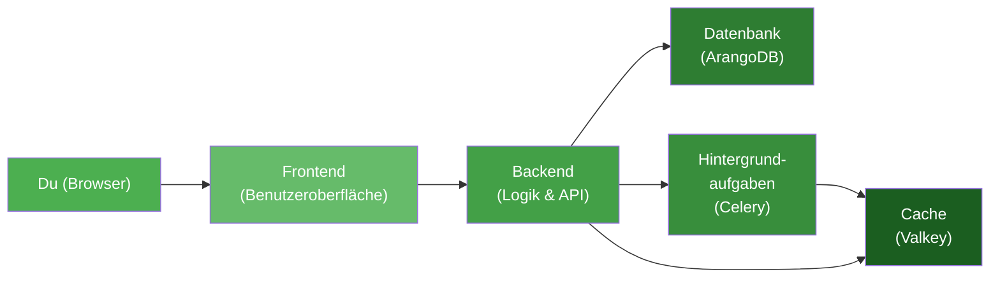

# Erste Schritte

Willkommen bei Kamerplanter! Diese Anleitung bringt dich in wenigen Minuten von Null zur laufenden Anwendung.

## Welcher Weg passt zu dir?

=== "Ich will es einfach ausprobieren"

    Du brauchst nur Docker auf deinem Rechner. In **5 Minuten** hast du Kamerplanter laufen und kannst deine ersten Pflanzen anlegen.

    **Weiter zu:** [Schnellstart](quickstart.md)

=== "Ich will es dauerhaft betreiben"

    Du planst, Kamerplanter auf einem Raspberry Pi, NAS oder Heimserver zu installieren und langfristig zu nutzen.

    **Weiter zu:** [Installation](installation.md) und dann [Erstes Deployment](first-deployment.md)

---

## Wie Kamerplanter funktioniert

Kamerplanter besteht aus mehreren Bausteinen, die zusammenarbeiten:

Das klingt nach viel, aber **Docker Compose startet alles automatisch** mit einem einzigen Befehl. Du musst die einzelnen Bausteine nicht selbst einrichten.

---

## Was du nach dem Start erwarten kannst

1. Du öffnest Kamerplanter im Browser
2. Der **Onboarding-Wizard** begrüßt dich und führt dich durch die Einrichtung
3. Du wählst deine Erfahrungsstufe und ein Starter-Kit (z.B. "Fensterbrett-Kräuter" oder "Balkon-Tomaten")
4. Kamerplanter legt automatisch Pflanzen, Standorte und Aufgaben für dich an
5. Du landest auf deinem persönlichen Dashboard

Mehr zum Onboarding-Wizard findest du im [Benutzerhandbuch](../user-guide/onboarding.md).

---

## In diesem Abschnitt

| Seite | Beschreibung | Zeitaufwand |
|-------|-------------|:-----------:|
| [Installation](installation.md) | Voraussetzungen prüfen und Docker installieren | 10 Min. |
| [Schnellstart](quickstart.md) | Kamerplanter starten und erste Pflanzen anlegen | 5 Min. |
| [Erstes Deployment](first-deployment.md) | Dauerhaft auf eigenem Server betreiben | 15 Min. |
