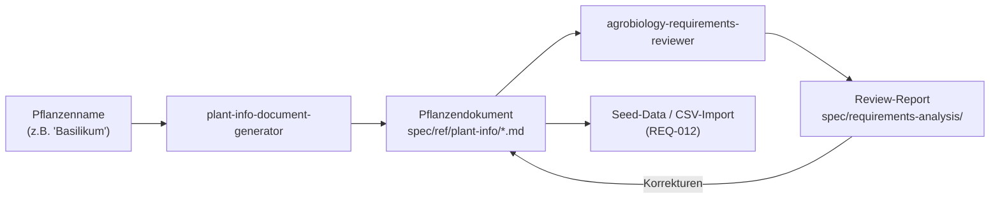

# Pflanzendaten per AI-Prompt aufbereiten

Kamerplanter verwaltet pro Pflanzenart bis zu 80+ strukturierte Felder -- von Taxonomie ueber Naehrstoffprofile bis hin zu Schaedlingsdaten und Mischkultur-Beziehungen. Das manuelle Zusammentragen dieser Daten aus verschiedenen Quellen ist zeitaufwaendig. Deshalb nutzen wir **Claude Code Agents**, um neue Pflanzen vollstaendig aufzubereiten und qualitaetszusichern.

## Uebersicht: Die AI-Pipeline



Der Workflow besteht aus drei Schritten:

1. **Generierung** -- Ein AI-Agent recherchiert und erstellt das Pflanzendokument
2. **Review** -- Ein zweiter Agent prueft die Daten auf fachliche Korrektheit
3. **Import** -- Das geprueft Dokument dient als Grundlage fuer den Datenimport

---

## Schritt 1: Pflanzendokument generieren

Der Agent `plant-info-document-generator` recherchiert automatisch alle relevanten Daten und erstellt ein strukturiertes Markdown-Dokument unter `spec/ref/plant-info/`.

### Aufruf in Claude Code

```
Erstelle ein Pflanzendokument fuer Basilikum
```

oder fuer mehrere Pflanzen gleichzeitig:

```
Erstelle Pflanzendokumente fuer: Rosmarin, Thymian, Oregano, Salbei
```

Claude Code erkennt den Kontext und aktiviert den `plant-info-document-generator` Agent automatisch.

### Was der Agent macht

1. **Eingabe analysieren** -- Identifiziert den wissenschaftlichen Namen, die Familie und Gattung
2. **Recherche** -- Sucht im Web nach:
    - Taxonomie und Stammdaten (GBIF, RHS, USDA)
    - Wachstumsphasen mit PPFD, VPD, Temperatur pro Phase
    - Naehrstoffprofile (NPK, EC, pH pro Phase)
    - Schaedlinge und Krankheiten mit Nuetzlingen
    - Pflege- und Ueberwinterungshinweise
    - Fruchtfolge und Mischkultur-Partner
3. **Dokument erstellen** -- Schreibt ein vollstaendiges Dokument mit allen Kamerplanter-Feldreferenzen

### Ergebnis

Das Dokument wird gespeichert als:

```
spec/ref/plant-info/<scientific_name_snake_case>.md
```

Beispiel: `spec/ref/plant-info/ocimum_basilicum.md`

### Dokumentstruktur

Jedes generierte Dokument enthaelt diese Abschnitte:

| Abschnitt | Inhalt | Kamerplanter-Bezug |
|-----------|--------|-------------------|
| 1. Taxonomie & Stammdaten | Botanische Einordnung, Aussaat-/Erntezeiten, Vermehrung, Toxizitaet | REQ-001 Species/Cultivar |
| 2. Wachstumsphasen | Phasenuebersicht, Anforderungsprofile, Naehrstoffprofile, Uebergangsregeln | REQ-003 Phasensteuerung |
| 3. Duengung | Empfohlene Produkte (mineralisch + organisch), Duengungsplan, Mischungsreihenfolge | REQ-004 Duenge-Logik |
| 4. Pflegehinweise | Care-Profil, Jahreskalender, Ueberwinterung | REQ-022 Pflegeerinnerungen |
| 5. Schaedlinge & Krankheiten | Schaedlinge, Krankheiten, Nuetzlinge, Behandlungsmethoden | REQ-010 IPM-System |
| 6. Fruchtfolge & Mischkultur | Gute/schlechte Nachbarn, Fruchtfolge-Einordnung | REQ-013 Pflanzdurchlauf |
| 7. Aehnliche Arten | Alternativen und verwandte Arten | -- |
| 8. CSV-Import-Daten | Fertige CSV-Zeilen fuer REQ-012 Import | REQ-012 Stammdaten-Import |

Jede Tabelle enthaelt eine `KA-Feld`-Spalte, die das exakte Kamerplanter-Datenbankfeld referenziert.

---

## Schritt 2: Fachliches Review

Der Agent `agrobiology-requirements-reviewer` prueft das Dokument aus Sicht eines Agrarbiologie-Experten.

### Aufruf in Claude Code

```
Pruefe das Pflanzendokument spec/ref/plant-info/ocimum_basilicum.md auf fachliche Korrektheit
```

### Was der Review-Agent prueft

- **Taxonomie** -- Wissenschaftliche Namen nach APG IV, korrekte Familienzuordnung
- **Lichtdaten** -- PPFD/DLI statt Lux, Photoperiodismus korrekt
- **Klimadaten** -- VPD-Berechnung plausibel, Tag-/Nachttemperatur getrennt
- **Naehrstoffe** -- EC-Bereiche realistisch, Mischungsreihenfolge korrekt (CalMag vor Sulfaten)
- **Schaedlinge** -- Wissenschaftliche Namen, IPM-Stufenansatz (Praevention > Monitoring > Intervention)
- **Toxizitaet** -- ASPCA-Daten fuer Katzen/Hunde verifiziert
- **Mischkultur** -- Kompatibilitaeten biologisch begruendet

### Ergebnis

Der Review-Report wird gespeichert unter:

```
spec/requirements-analysis/plant-info-agrobiology-review-<batch>.md
```

Findings werden klassifiziert als:

| Kategorie | Bedeutung |
|-----------|-----------|
| :red_circle: Fachlich Falsch | Sofortiger Korrekturbedarf |
| :orange_circle: Unvollstaendig | Wichtige Aspekte fehlen |
| :yellow_circle: Zu Ungenau | Praezisierung noetig |
| :green_circle: Hinweis | Best Practice Empfehlung |

---

## Schritt 3: Import in Kamerplanter

Die geprueften Dokumente dienen als Grundlage fuer den Datenimport:

### Option A: Seed-Data (Entwickler)

Die Pflanzendaten werden als Python-Seed-Skript unter `src/backend/app/migrations/seed_plant_info.py` eingebaut. Der Seed liest die Markdown-Dokumente und erstellt die entsprechenden ArangoDB-Dokumente.

### Option B: CSV-Import (Endnutzer)

Jedes Pflanzendokument enthaelt im Abschnitt 8 fertige CSV-Zeilen, die ueber die REQ-012 Import-Funktion hochgeladen werden koennen.

---

## Vorhandene Pflanzendokumente

Aktuell sind 32 Pflanzen vollstaendig dokumentiert:

```
spec/ref/plant-info/
```

Darunter Gemuese (Tomate, Paprika, Gurke, Zucchini, ...), Kraeuter (Basilikum, Petersilie, Dill, Schnittlauch, ...), Zierpflanzen (Dahlie, Petunie, Sonnenblume, ...) und Zimmerpflanzen (Monstera, Einblatt, Gruenlilie, Guzmania).

---

## Tipps fuer gute Ergebnisse

!!! tip "Konkrete Sortennamen liefern"
    Statt "Tomate" besser "Tomate San Marzano" -- der Agent kann dann sortenspezifische Daten (Reifezeit, Resistenzen, Wuchstyp) genauer recherchieren.

!!! tip "Anbaukontext angeben"
    "Basilikum fuer Indoor-Anbau im Growzelt" liefert andere Ergebnisse als "Basilikum fuer den Garten" -- insbesondere bei Licht-, Temperatur- und Duengedaten.

!!! tip "Batch-Verarbeitung nutzen"
    Mehrere verwandte Pflanzen gleichzeitig anfragen (z.B. alle Kuechenkraeuter) -- der Agent kann dann Mischkultur-Beziehungen zwischen den Pflanzen gleich mitdokumentieren.

!!! warning "Immer Review durchfuehren"
    AI-generierte Daten koennen Fehler enthalten. Der `agrobiology-requirements-reviewer` findet erfahrungsgemaess 2--5 Korrekturen pro Dokument. Besonders EC-Werte, Toxizitaetsdaten und Schadelingsnamen sollten geprueft werden.

---

## Beteiligte Claude Code Agents

| Agent | Datei | Aufgabe |
|-------|-------|---------|
| `plant-info-document-generator` | `.claude/agents/plant-info-document-generator.md` | Recherchiert und erstellt Pflanzendokumente |
| `agrobiology-requirements-reviewer` | `.claude/agents/agrobiology-requirements-reviewer.md` | Fachliches Review (Botanik, Pflanzenbau, IPM) |
