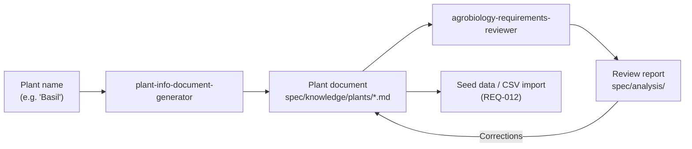

# Pflanzendaten per AI-Prompt aufbereiten

Kamerplanter verwaltet pro Pflanzenart bis zu 80+ strukturierte Felder -- von Taxonomie über Nährstoffprofile bis hin zu Schädlingsdaten und Mischkultur-Beziehungen. Das manuelle Zusammentragen dieser Daten aus verschiedenen Quellen ist zeitaufwendig. Deshalb nutzen wir **Claude Code Agents**, um neue Pflanzen vollständig aufzubereiten und qualitätszusichern.

## Übersicht: Die AI-Pipeline

<!-- diagram-source: user-described — AI plant-data pipeline from plant name through document generation and review to seed import -->

```mermaid
flowchart LR
    A["Plant name<br/>(e.g. 'Basil')"] --> B["plant-info-document-generator"]
    B --> C["Plant document<br/>spec/knowledge/plants/*.md"]
    C --> D["agrobiology-requirements-reviewer"]
    D --> E["Review report<br/>spec/analysis/"]
    E -->|Corrections| C
    C --> F["Seed data / CSV import<br/>(REQ-012)"]
```

Der Workflow besteht aus drei Schritten:

1. **Generierung** -- Ein AI-Agent recherchiert und erstellt das Pflanzendokument
2. **Review** -- Ein zweiter Agent prüft die Daten auf fachliche Korrektheit
3. **Import** -- Das geprüfte Dokument dient als Grundlage für den Datenimport

---

## Schritt 1: Pflanzendokument generieren

Der Agent `plant-info-document-generator` recherchiert automatisch alle relevanten Daten und erstellt ein strukturiertes Markdown-Dokument unter `spec/knowledge/plants/`.

### Aufruf in Claude Code

```
Erstelle ein Pflanzendokument für Basilikum
```

oder für mehrere Pflanzen gleichzeitig:

```
Erstelle Pflanzendokumente für: Rosmarin, Thymian, Oregano, Salbei
```

Claude Code erkennt den Kontext und aktiviert den `plant-info-document-generator` Agent automatisch.

### Was der Agent macht

1. **Eingabe analysieren** -- Identifiziert den wissenschaftlichen Namen, die Familie und Gattung
2. **Recherche** -- Sucht im Web nach:
    - Taxonomie und Stammdaten (GBIF, RHS, USDA)
    - Wachstumsphasen mit PPFD, VPD, Temperatur pro Phase
    - Nährstoffprofile (NPK, EC, pH pro Phase)
    - Schädlinge und Krankheiten mit Nützlingen
    - Pflege- und Überwinterungshinweise
    - Fruchtfolge und Mischkultur-Partner
3. **Dokument erstellen** -- Schreibt ein vollständiges Dokument mit allen Kamerplanter-Feldreferenzen

### Ergebnis

Das Dokument wird gespeichert als:

```
spec/knowledge/plants/<scientific_name_snake_case>.md
```

Beispiel: `spec/knowledge/plants/ocimum_basilicum.md`

### Dokumentstruktur

Jedes generierte Dokument enthält diese Abschnitte:

| Abschnitt | Inhalt | Kamerplanter-Bezug |
|-----------|--------|-------------------|
| 1. Taxonomie & Stammdaten | Botanische Einordnung, Aussaat-/Erntezeiten, Vermehrung, Toxizität | REQ-001 Species/Cultivar |
| 2. Wachstumsphasen | Phasenübersicht, Anforderungsprofile, Nährstoffprofile, Übergangsregeln | REQ-003 Phasensteuerung |
| 3. Düngung | Empfohlene Produkte (mineralisch + organisch), Düngungsplan, Mischungsreihenfolge | REQ-004 Dünge-Logik |
| 4. Pflegehinweise | Care-Profil, Jahreskalender, Überwinterung | REQ-022 Pflegeerinnerungen |
| 5. Schädlinge & Krankheiten | Schädlinge, Krankheiten, Nützlinge, Behandlungsmethoden | REQ-010 IPM-System |
| 6. Fruchtfolge & Mischkultur | Gute/schlechte Nachbarn, Fruchtfolge-Einordnung | REQ-013 Pflanzdurchlauf |
| 7. Ähnliche Arten | Alternativen und verwandte Arten | -- |
| 8. CSV-Import-Daten | Fertige CSV-Zeilen für REQ-012 Import | REQ-012 Stammdaten-Import |

Jede Tabelle enthält eine `KA-Feld`-Spalte, die das exakte Kamerplanter-Datenbankfeld referenziert.

---

## Schritt 2: Fachliches Review

Der Agent `agrobiology-requirements-reviewer` prüft das Dokument aus Sicht eines Agrarbiologie-Experten.

### Aufruf in Claude Code

```
Prüfe das Pflanzendokument spec/knowledge/plants/ocimum_basilicum.md auf fachliche Korrektheit
```

### Was der Review-Agent prüft

- **Taxonomie** -- Wissenschaftliche Namen nach APG IV, korrekte Familienzuordnung
- **Lichtdaten** -- PPFD/DLI statt Lux, Photoperiodismus korrekt
- **Klimadaten** -- VPD-Berechnung plausibel, Tag-/Nachttemperatur getrennt
- **Nährstoffe** -- EC-Bereiche realistisch, Mischungsreihenfolge korrekt (CalMag vor Sulfaten)
- **Schädlinge** -- Wissenschaftliche Namen, IPM-Stufenansatz (Prävention > Monitoring > Intervention)
- **Toxizität** -- ASPCA-Daten für Katzen/Hunde verifiziert
- **Mischkultur** -- Kompatibilitäten biologisch begründet

### Ergebnis

Der Review-Report wird gespeichert unter:

```
spec/analysis/plant-info-agrobiology-review-<batch>.md
```

Findings werden klassifiziert als:

| Kategorie | Bedeutung |
|-----------|-----------|
| :red_circle: Fachlich Falsch | Sofortiger Korrekturbedarf |
| :orange_circle: Unvollständig | Wichtige Aspekte fehlen |
| :yellow_circle: Zu Ungenau | Präzisierung nötig |
| :green_circle: Hinweis | Best Practice Empfehlung |

---

## Schritt 3: Import in Kamerplanter

Die geprüften Dokumente dienen als Grundlage für den Datenimport:

### Option A: Seed-Data (Entwickler)

Die Pflanzendaten werden als Python-Seed-Skript unter `src/backend/app/migrations/seed_plant_info.py` eingebaut. Der Seed liest die Markdown-Dokumente und erstellt die entsprechenden ArangoDB-Dokumente.

### Option B: CSV-Import (Endnutzer)

Jedes Pflanzendokument enthält im Abschnitt 8 fertige CSV-Zeilen, die über die REQ-012 Import-Funktion hochgeladen werden können.

---

## Vorhandene Pflanzendokumente

Aktuell sind 32 Pflanzen vollständig dokumentiert:

```
spec/knowledge/plants/
```

Darunter Gemüse (Tomate, Paprika, Gurke, Zucchini, ...), Kräuter (Basilikum, Petersilie, Dill, Schnittlauch, ...), Zierpflanzen (Dahlie, Petunie, Sonnenblume, ...) und Zimmerpflanzen (Monstera, Einblatt, Grünlilie, Guzmania).

---

## Tipps für gute Ergebnisse

!!! tip "Konkrete Sortennamen liefern"
    Statt "Tomate" besser "Tomate San Marzano" -- der Agent kann dann sortenspezifische Daten (Reifezeit, Resistenzen, Wuchstyp) genauer recherchieren.

!!! tip "Anbaukontext angeben"
    "Basilikum für Indoor-Anbau im Growzelt" liefert andere Ergebnisse als "Basilikum für den Garten" -- insbesondere bei Licht-, Temperatur- und Düngungsdaten.

!!! tip "Batch-Verarbeitung nutzen"
    Mehrere verwandte Pflanzen gleichzeitig anfragen (z.B. alle Küchenkräuter) -- der Agent kann dann Mischkultur-Beziehungen zwischen den Pflanzen gleich mitdokumentieren.

!!! warning "Immer Review durchführen"
    AI-generierte Daten können Fehler enthalten. Der `agrobiology-requirements-reviewer` findet erfahrungsgemäß 2--5 Korrekturen pro Dokument. Besonders EC-Werte, Toxizitätsdaten und Schädlingsnamen sollten geprüft werden.

---

## Beteiligte Claude Code Agents

| Agent | Datei | Aufgabe |
|-------|-------|---------|
| `plant-info-document-generator` | `.claude/agents/plant-info-document-generator.md` | Recherchiert und erstellt Pflanzendokumente |
| `agrobiology-requirements-reviewer` | `.claude/agents/agrobiology-requirements-reviewer.md` | Fachliches Review (Botanik, Pflanzenbau, IPM) |
