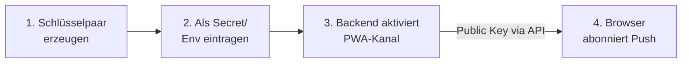

# Browser-Push einrichten (Web Push / VAPID)

Kamerplanter kann Pflegeerinnerungen und andere Benachrichtigungen als **Browser-Push** auf Desktop und Mobilgerät zustellen — auch wenn die App gerade nicht geöffnet ist. Dieser Kanal (`channel_key: "pwa"`) basiert auf dem Web-Push-Standard und benötigt ein **VAPID-Schlüsselpaar**, das der Betreiber einmalig erzeugt und im Backend hinterlegt.

!!! info "Wer braucht diese Anleitung?"
    Diese Schritte richten sich an **Betreiber/Administratoren** der Kamerplanter-Instanz. Endnutzer aktivieren Browser-Push anschließend mit einem Klick in den Benachrichtigungseinstellungen — sie müssen keine Schlüssel verwalten.

## Was sind VAPID-Schlüssel?

VAPID (*Voluntary Application Server Identification*) identifiziert den sendenden Server gegenüber den Push-Diensten der Browser (Google FCM, Mozilla, Apple). Das Schlüsselpaar besteht aus:

| Schlüssel | Verwendung | Sichtbarkeit |
|-----------|-----------|--------------|
| **Public Key** | Wird an den Browser ausgeliefert und beim Abonnieren (`PushManager.subscribe`) verwendet. | Öffentlich — unkritisch |
| **Private Key** | Signiert jede ausgehende Push-Nachricht serverseitig. | **Geheim** — nur im Backend |

Beide Schlüssel gehören zusammen: Ein einmal erzeugtes Paar bleibt für die gesamte Lebensdauer der Instanz gültig. Ein Wechsel des Public Keys macht alle bestehenden Browser-Abonnements ungültig — Nutzer müssten Browser-Push erneut aktivieren.

## Überblick

<!-- diagram-source: user-described — Operator generates a VAPID key pair, stores it as a backend secret, the backend activates the PWA channel and serves the public key to the browser, which subscribes for push -->


## Schritt 1 — Schlüsselpaar erzeugen

Erzeuge das Paar einmalig auf einem beliebigen Rechner. Es gibt zwei gleichwertige Wege:

=== "Node.js (empfohlen)"

    ```bash
    npx web-push generate-vapid-keys
    ```

    Ausgabe:

    ```
    Public Key:
    BNm... (87 Zeichen, Base64url)

    Private Key:
    8Kv... (Base64url)
    ```

=== "Python (pywebpush)"

    ```bash
    pip install pywebpush
    python3 - <<'PY'
    from py_vapid import Vapid
    from py_vapid.utils import b64urlencode
    from cryptography.hazmat.primitives import serialization

    v = Vapid()
    v.generate_keys()
    pub_raw = v.public_key.public_bytes(
        serialization.Encoding.X962,
        serialization.PublicFormat.UncompressedPoint,
    )
    priv_raw = v.private_key.private_numbers().private_value.to_bytes(32, "big")
    pub, priv = b64urlencode(pub_raw), b64urlencode(priv_raw)
    assert pub_raw[0] == 0x04 and len(pub_raw) == 65 and len(pub) == 87, "invalid public key"
    assert len(priv_raw) == 32 and len(priv) == 43, "invalid private key"
    print("VAPID_PUBLIC_KEY =", pub)
    print("VAPID_PRIVATE_KEY=", priv)
    PY
    ```

    Die `assert`-Zeilen stellen sicher, dass der Befehl **nur** ein gültiges Paar ausgibt (Public = unkomprimierter P-256-Punkt, 65 Bytes/87 Zeichen; Private 32 Bytes/43 Zeichen) — andernfalls bricht er mit `AssertionError` ab, statt einen unbrauchbaren Schlüssel zu liefern. `b64urlencode` ist nötig, weil `v.public_key`/`v.private_key` Schlüsselobjekte sind und erst die Serialisierung die Base64url-Strings liefert.

Notiere beide Schlüssel — der Private Key wird nach dem Erzeugen nicht erneut angezeigt.

!!! tip "Schlüssel prüfen"
    Ein gültiger `VAPID_PUBLIC_KEY` ist **87 Zeichen** lang und dekodiert zu **65 Bytes** (unkomprimierter P-256-Punkt, beginnt mit `0x04`). Schnellcheck — muss `65` ausgeben:
    ```bash
    echo -n '<PUBLIC_KEY>' | tr '_-' '/+' | base64 -d 2>/dev/null | wc -c
    ```
    Liefert er eine andere Länge, wurde das Paar falsch erzeugt — neu generieren (am robustesten mit `npx web-push generate-vapid-keys`). Ein zu langer Key führt im Browser beim Abonnieren zur Meldung „The provided applicationServerKey is not valid".

## Schritt 2 — Schlüssel im Backend eintragen

Der Browser-Push-Kanal wird über **drei Umgebungsvariablen** konfiguriert. Alle drei müssen gesetzt sein, sonst bleibt der Kanal deaktiviert (siehe [Fehlerbehebung](#fehlerbehebung)).

| Variable | Beschreibung |
|----------|-------------|
| `VAPID_PUBLIC_KEY` | Der Public Key aus Schritt 1. |
| `VAPID_PRIVATE_KEY` | Der Private Key aus Schritt 1. **Nur serverseitig** halten. |
| `VAPID_CONTACT_EMAIL` | Kontakt-Adresse im Format `mailto:admin@example.com`. Push-Dienste nutzen sie bei Problemen mit deinem Server. |

=== "Docker Compose (.env)"

    Trage die Werte in die `.env`-Datei im Repository-Wurzelverzeichnis ein:

    ```bash
    VAPID_PUBLIC_KEY=BNm...
    VAPID_PRIVATE_KEY=8Kv...
    VAPID_CONTACT_EMAIL=mailto:admin@example.com
    ```

=== "Kubernetes / Helm"

    Lege die Schlüssel als Kubernetes Secret an — **nicht** in `values.yaml` im Klartext:

    ```yaml
    apiVersion: v1
    kind: Secret
    metadata:
      name: kamerplanter-vapid
    type: Opaque
    stringData:
      VAPID_PUBLIC_KEY: "BNm..."
      VAPID_PRIVATE_KEY: "8Kv..."
      VAPID_CONTACT_EMAIL: "mailto:admin@example.com"
    ```

    Das Backend liest die Variablen über `envFrom` aus dem referenzierten Secret (analog zu `kamerplanter-secrets`). Siehe [Helm Charts](../deployment/helm.md).

!!! danger "Private Key niemals offenlegen"
    Der `VAPID_PRIVATE_KEY` darf **nie** im Frontend, in Logs, in `values.yaml` oder in öffentlichen Konfigurationsdateien erscheinen — er signiert alle Push-Nachrichten deiner Instanz. Behandle ihn wie `JWT_SECRET_KEY`: ausschließlich als Secret.

## Schritt 3 — Backend neu starten

Damit die neuen Variablen geladen werden, das Backend neu starten:

=== "Docker Compose"

    ```bash
    docker compose up -d --force-recreate backend
    ```

=== "Kubernetes"

    ```bash
    kubectl rollout restart deployment/kamerplanter-backend
    ```

Beim Start registriert das Backend den PWA-Kanal automatisch, sobald alle drei Variablen vorhanden sind.

## Schritt 4 — Einrichtung prüfen

1. **Public Key wird ausgeliefert** — der Endpunkt liefert den konfigurierten Schlüssel zurück:

   ```bash
   curl https://<deine-instanz>/api/v1/t/<tenant-slug>/notifications/pwa/vapid-public-key
   # {"vapid_public_key": "BNm..."}
   ```

2. **In der App aktivieren** — als Nutzer einloggen, **Einstellungen → Benachrichtigungen** öffnen und **Browser-Push** aktivieren. Der Browser fragt nach der Benachrichtigungs-Erlaubnis. Steht dort „Nicht konfiguriert", ist eine der drei Variablen leer oder das Backend wurde nicht neu gestartet.

3. **Testnachricht senden** — über die Schaltfläche „Testbenachrichtigung" in den Benachrichtigungseinstellungen prüfen, ob eine Push-Meldung ankommt.

!!! note "HTTPS erforderlich"
    Browser erlauben Web Push und Service Worker nur über **HTTPS** (Ausnahme: `localhost` in der Entwicklung). Hinter einem Reverse-Proxy muss TLS aktiv sein.

## Fehlerbehebung

| Symptom | Ursache & Lösung |
|---------|------------------|
| Benachrichtigungseinstellungen zeigen „Nicht konfiguriert" | Mindestens eine der drei `VAPID_*`-Variablen ist leer, oder das Backend wurde nach dem Setzen nicht neu gestartet. Alle drei prüfen und neu starten. |
| `vapid-public-key`-Endpunkt liefert leeren Wert / 404 | `VAPID_PUBLIC_KEY` nicht gesetzt oder Tenant-Slug in der URL falsch. |
| Browser-Push lässt sich nicht aktivieren | Seite wird nicht über HTTPS ausgeliefert, oder der Nutzer hat die Benachrichtigungs-Erlaubnis im Browser blockiert. |
| Browser meldet „The provided applicationServerKey is not valid" | Der `VAPID_PUBLIC_KEY` ist kein gültiger P-256-Schlüssel (nicht 87 Zeichen / 65 Bytes — siehe [Schlüssel prüfen](#schritt-1-schlusselpaar-erzeugen)). Paar **komplett neu** erzeugen und beide Schlüssel ersetzen — nur den Public Key zu kürzen funktioniert nicht, da er zum Private Key passen muss. |
| Abonnement vorhanden, aber keine Nachrichten kommen an | `VAPID_PRIVATE_KEY` passt nicht zum Public Key (unterschiedliche Paare gemischt) oder `VAPID_CONTACT_EMAIL` hat nicht das Format `mailto:…`. Schlüsselpaar gemeinsam neu erzeugen. |

## Verwandte Themen

- [Umgebungsvariablen](../reference/environment-variables.md#browser-push-pwa-vapid) — Referenz aller `VAPID_*`-Variablen
- [Home Assistant Integration](home-assistant-integration.md) — alternativer Benachrichtigungskanal
- [Pflegeerinnerungen](../user-guide/care-reminders.md) — Auslöser für die meisten Push-Benachrichtigungen
