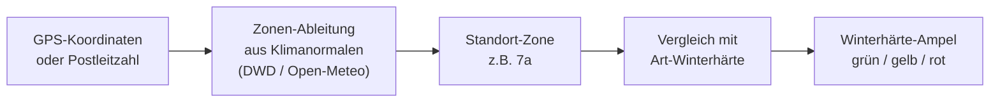

# Klimazonen & Winterhärte

!!! warning "Noch nicht implementiert"
    Dieses geplante Feature ist noch nicht umgesetzt. Die folgenden Abschnitte beschreiben das geplante Verhalten im Futur. Aktuell ist das Feld „Klimazone" am Standort ein frei editierbares Textfeld ohne automatische Ableitung und ohne festes Format — siehe [Standorte & Substrate](../user-guide/locations-substrates.md). <!-- REQ-039 -->

Kamerplanter wird künftig automatisch bestimmen, wie winterhart dein Standort ist — auf Basis deiner GPS-Koordinaten oder Postleitzahl, statt dass du selbst nachschlagen musst, in welcher Zone du liegst. Diese Zone wird die Winterhärte-Ampel deiner mehrjährigen Pflanzen speisen und dich warnen, bevor du eine frostempfindliche Art an einem zu kalten Standort einpflanzt.

---

## Was sind Winterhärtezonen?

Winterhärtezonen (nach dem Schema des US-Landwirtschaftsministeriums, kurz **USDA**) teilen Standorte nach ihrem **mittleren jährlichen Tiefsttemperatur-Minimum** (gemittelt über rund 30 Jahre) in Zonen **1–13** ein. Jede Zone ist zusätzlich in zwei Halbzonen `a` und `b` unterteilt (z. B. `7a`, `8b`), mit einer Spreizung von jeweils rund 2,8 °C. Je niedriger die Zonennummer, desto kälter der Standort im Winter.

Für Deutschland/Österreich/Schweiz sind vor allem die Zonen **6a bis 8b** relevant — grob: Höhenlagen und der Osten eher 6b/7a, milde Weinbau- und Rheinregionen bis 8b.

Dieses Zonenschema wird in Kamerplanter bereits an mehreren Stellen referenziert, aber bisher nur als frei eintippbarer Text ohne Validierung oder Ableitung:

- das Feld **Klimazone** am Standort (siehe [Standorte & Substrate](../user-guide/locations-substrates.md))
- die Winterhärte-Angabe einer Art in den Stammdaten
- die vierstufige Frostempfindlichkeits-Einstufung einer Art in den Stammdaten (von „empfindlich" bis „sehr winterhart")

Dieses geplante Feature wird diese losen Fäden zu einer kanonischen Zonen-Referenz mit automatischer Ableitung verbinden. <!-- REQ-039 -->

---

## Wie die Zone ermittelt werden wird

<!-- diagram-source: user-described — deriving a site's hardiness zone from GPS/postal code via climate-normal data, then comparing it to a species' hardiness to produce the traffic-light rating -->

Für Standorte in Deutschland, Österreich und der Schweiz wird die Zone **nicht** aus einer fertigen Karte übernommen — eine frei lizenzierte DACH-Winterhärtezonenkarte existiert nicht. Stattdessen wird Kamerplanter die Zone **selbst berechnen**: aus den täglichen Tiefstwerten der letzten Klimanormalperiode (Deutscher Wetterdienst Open Data bzw. Open-Meteo Historical Weather API), gemittelt zu einem jährlichen Tiefstwert und in eine USDA-Zone eingeordnet.

- **Automatische Ableitung**: Ein Button „Zone automatisch ermitteln" wird im Standort-Formular erscheinen, sobald GPS-Koordinaten oder eine Postleitzahl hinterlegt sind.
- **Manueller Override**: Du wirst die ermittelte Zone jederzeit von Hand überschreiben können — z. B. wenn dein Standort ein bekanntes Mikroklima hat (Innenhof, Südhang).
- **Nachvollziehbarkeit**: Zu jeder Zone wird angezeigt, woher sie stammt (automatisch ermittelt oder manuell gesetzt) und an welchem Datum sie zuletzt aktualisiert wurde.
- **Regelmäßige Auffrischung**: Automatisch ermittelte Zonen sollen vierteljährlich neu berechnet werden; manuell gesetzte Zonen bleiben davon unberührt.

---

## Die Winterhärte-Ampel

Die geplante Winterhärte-Ampel (siehe [Pflegeerinnerungen](../user-guide/care-reminders.md)) basiert heute auf einem einfachen Textvergleich zwischen der Frostempfindlichkeit einer Art und dem frei eingetragenen `Klimazone`-Text des Standorts. Dieses geplante Feature wird diesen Vergleich durch einen numerischen Zonen-Abgleich ersetzen: <!-- REQ-022, REQ-039 -->

| Ampel | Bedeutung | Regel (geplant) |
|-------|-----------|------------------|
| 🟢 Grün | Winterhart, kein Schutz nötig | Art ist winterhart oder sehr winterhart **und** Standort-Zone ≥ Mindestzone der Art |
| 🟡 Gelb | Schutz nötig (Mulch, Vlies) | Art ist moderat winterhart **oder** Zonendifferenz ≤ 1 |
| 🔴 Rot | Muss frostfrei überwintern | Art ist frostempfindlich **oder** Zonendifferenz > 1 |

Beispiel: Ein Feigenbaum, der laut Stammdaten mindestens Zone 8a benötigt, an einem Standort in Zone 7a → eine Zone zu kalt → gelbe oder rote Ampel, je nach Frostempfindlichkeit der Sorte.

!!! tip "Was sich für dich ändern wird"
    Beim Anlegen einer mehrjährigen Pflanze wirst du sofort gewarnt, wenn die gewählte Art an deinem Standort nicht winterhart ist — inklusive einer verständlichen Begründung wie „Standort 7a, Art braucht mindestens 8a → 1 Zone zu kalt". Das ersetzt das bisherige, manuelle Nachschlagen.

---

## Frost-Richtwerte für den Aussaatkalender

Jede Zonen-Referenz wird typische Termine für den letzten und ersten Frost mitbringen. Solange du keine eigenen Frostdaten oder eine Wetter-API-Anbindung eingerichtet hast, sollen diese Richtwerte automatisch die Frosttermin-Felder deines [Aussaatkalenders](../user-guide/calendar.md) vorbefüllen.

---

## Häufige Fragen

??? question "Kann ich die automatisch ermittelte Zone überschreiben?"
    Ja, das wird jederzeit möglich sein. Eine manuell gesetzte Zone wird von der automatischen Aktualisierung nicht mehr überschrieben.

??? question "Woher kommen die Klimadaten für Deutschland?"
    Aus offenen, lizenzrechtlich unbedenklichen Quellen: den Klimanormalen des Deutschen Wetterdienstes (nach der Geodatennutzungsverordnung, GeoNutzV) und der Open-Meteo Historical Weather API (CC-BY-4.0). Eine fertige US-amerikanische Winterhärtezonenkarte (z. B. phzmapi.org) deckt nur die USA ab und wird für DACH-Standorte nicht verwendet.

??? question "Was passiert, wenn ich keine GPS-Koordinaten hinterlegt habe?"
    Ohne GPS-Koordinaten oder Postleitzahl kann keine Zone automatisch ermittelt werden. Du wirst die Zone dann weiterhin manuell eintragen können.

---

## Siehe auch

- [Standorte & Substrate](../user-guide/locations-substrates.md)
- [Pflegeerinnerungen — Überwinterungsmanagement](../user-guide/care-reminders.md)
- [Wachstumsphasen](../user-guide/growth-phases.md)
- [Kalender & Aussaatkalender](../user-guide/calendar.md)
- [Sensorik — Wetter-API](../user-guide/sensors.md#sensoren-für-freiland-wetter-api-einrichten)
