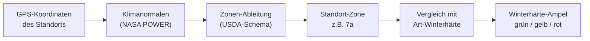

# Klimazonen & Winterhärte

!!! info "Nur über API / Betreiber-Konfiguration"
    Kamerplanter berechnet die Winterhärtezone deines Standorts bereits vollautomatisch im Hintergrund — aus deinen GPS-Koordinaten und den langjährigen Klimadaten deines Standorts. Im Standort-Formular der Weboberfläche siehst du davon aktuell aber nur das Ergebnis im bestehenden Freitextfeld **Klimazone** (siehe [Standorte & Substrate](../user-guide/locations-substrates.md#grunddaten-ausfüllen)) — einen eigenen Button zum sofortigen Neu-Ermitteln und eine Herkunfts-Anzeige („automatisch ermittelt" / „manuell gesetzt") gibt es dort noch nicht. Die vollständige Funktion steht bereits über die REST-API zur Verfügung, siehe [Für technische Nutzer / Self-Hoster](#fuer-technische-nutzer-self-hoster) unten. <!-- REQ-039 -->

Kamerplanter bestimmt, wie winterhart dein Standort ist, automatisch aus deinen GPS-Koordinaten — du musst dafür nicht selbst nachschlagen, in welcher Zone du liegst. Diese Zone speist die Winterhärte-Ampel deiner mehrjährigen Pflanzen (siehe [Überwinterung](../user-guide/overwintering.md)) und hilft dir zu erkennen, ob eine Art an deinem Standort ohne zusätzlichen Schutz übersteht.

---

## Was sind Winterhärtezonen?

Winterhärtezonen (nach dem Schema des US-Landwirtschaftsministeriums, kurz **USDA**) teilen Standorte nach ihrem **mittleren jährlichen Tiefsttemperatur-Minimum** (gemittelt über rund 30 Jahre) in Zonen **1–13** ein. Jede Zone ist zusätzlich in zwei Halbzonen `a` und `b` unterteilt (z. B. `7a`, `8b`), mit einer Spreizung von jeweils rund 2,8 °C. Je niedriger die Zonennummer, desto kälter der Standort im Winter.

Für Deutschland, Österreich und die Schweiz sind vor allem die Zonen **5a bis 9a** relevant: Höhenlagen der Alpen und Mittelgebirge liegen meist bei 5a–6a, die verbreiteten Tieflagen bei 6b–7b, und die mildesten Sonderstandorte (Rheintal, Bodensee, Tessin) erreichen 8a bis 9a.

Dieses Zonenschema verbindet in Kamerplanter mehrere Stellen: das strukturierte Feld **Winterhärtezone** eines Standorts (automatisch abgeleitet oder manuell gesetzt), die Winterhärte-Angabe einer Pflanzenart in den Stammdaten sowie deren vierstufige Frostempfindlichkeits-Einstufung (von „empfindlich" bis „sehr winterhart"). Das bisherige freie Textfeld **Klimazone** am Standort (siehe [Standorte & Substrate](../user-guide/locations-substrates.md)) bleibt aus Kompatibilitätsgründen bestehen — Kamerplanter hält es automatisch mit der ermittelten oder manuell gesetzten Zone synchron. <!-- REQ-039 -->

---

## Wie die Zone ermittelt wird

<!-- diagram-source: user-described — deriving a site's hardiness zone from GPS via REQ-041 climate normals, then comparing it to a species' hardiness to produce the traffic-light rating -->


Für Standorte in Deutschland, Österreich und der Schweiz nutzt Kamerplanter keine fertige Karte — eine frei lizenzierte DACH-Winterhärtezonenkarte existiert nicht. Stattdessen berechnet Kamerplanter die Zone selbst: aus der kältesten Monats-Tiefsttemperatur der langjährigen [Klimanormalen](../user-guide/weather-sources.md#klima-am-standort) deines Standorts, eingeordnet in eine von 26 USDA-Halbzonen (`1a`–`13b`) nach einem festen, lizenzfreien Temperaturband-Schema — es fließen keine proprietären USDA-/PHZM-/PRISM-Kartendaten ein.

- **Automatische Hintergrund-Berechnung**: Sobald für deinen Freiland- oder Gewächshaus-Standort GPS-Koordinaten hinterlegt sind und mindestens ein brauchbarer Klimanormalen-Datensatz vorliegt, berechnet ein vierteljährlicher Hintergrund-Task (jeweils zum 1. Januar, April, Juli und Oktober) die Zone automatisch neu — ganz ohne dein Zutun, genau wie die [Klimanormalen](../user-guide/weather-sources.md#klima-am-standort) selbst.
- **Manueller Override**: Du kannst die ermittelte Zone jederzeit von Hand überschreiben — zum Beispiel, wenn dein Standort ein bekanntes Mikroklima hat (Innenhof, Südhang). Eine manuell gesetzte Zone wird von der automatischen Aktualisierung nie wieder überschrieben. Aktuell ist das nur über die API möglich — ein Bedienelement dafür im Standort-Formular fehlt noch (siehe [Für technische Nutzer / Self-Hoster](#fuer-technische-nutzer-self-hoster) unten).
- **Nachvollziehbarkeit**: Zu jeder ermittelten Zone speichert Kamerplanter, woher sie stammt (automatisch aus GPS-Koordinaten abgeleitet oder manuell gesetzt) und wann sie zuletzt berechnet wurde — ebenfalls aktuell nur über die API abrufbar, noch nicht im Standort-Formular sichtbar.
- **Nur GPS, keine Postleitzahl**: Die Ableitung erfolgt derzeit ausschließlich aus GPS-Koordinaten; eine Postleitzahl-basierte Ableitung ist (noch) nicht umgesetzt.

---

## Die Winterhärte-Ampel

Die Winterhärte-Ampel (siehe [Überwinterung](../user-guide/overwintering.md)) vergleicht die Winterhärte-Einstufung einer Pflanzenart mit der Winterhärtezone ihres Standorts. Sie bevorzugt dabei die strukturierte, automatisch ermittelte Zone; ist für einen Standort noch keine Zone berechnet, weicht sie auf den freien Text im Feld **Klimazone** aus. <!-- REQ-022, REQ-039 -->

Kamerplanter prüft dabei die folgenden Regeln der Reihe nach — die erste zutreffende bestimmt die Ampel:

| Ampel | Bedeutung | Regel |
|-------|-----------|-------|
| 🔴 Rot | Muss frostfrei überwintern | Die Art gilt als frostempfindlich, **oder** die Standort-Zone liegt mehr als eine Zone unter der von der Art benötigten Mindestzone. |
| 🟡 Gelb | Schutz nötig (Mulch, Vlies) | Die Art gilt als mäßig winterhart, **oder** die Standort-Zone entspricht genau der Mindestzone der Art oder liegt bis zu einer Zone darunter, **oder** es liegt weder eine Zonen- noch eine Winterhärte-Angabe vor. |
| 🟢 Grün | Winterhart, kein Schutz nötig | Keine der beiden vorigen Regeln trifft zu — die Standort-Zone liegt (soweit bekannt) über der Mindestzone der Art. |

Beispiel: Ein Feigenbaum, der laut Stammdaten mindestens Zone 8a benötigt, an einem Standort in Zone 7a — die Standort-Zone liegt genau eine Zone unter der Mindestzone → gelbe oder rote Ampel, je nachdem, ob die konkrete Sorte selbst als frostempfindlich eingestuft ist.

!!! tip "Was du davon siehst"
    Sobald du eine mehrjährige Pflanze einem Standort zuordnest, zeigt dir der Abschnitt „Pflege" > „Überwinterung" ihrer Pflanzenseite sofort, ob sie dort winterhart ist oder Schutz braucht — auf Basis genau dieser Zonen-Ableitung. Details zur Anzeige unter [Überwinterung](../user-guide/overwintering.md).

---

## Frost-Richtwerte für den Aussaatkalender

Jeder Zonen-Katalogeintrag trägt typische Termine für den letzten und ersten Frost. Solange du für deinen Standort noch keine eigenen Frostdaten oder eine Wetter-API-Anbindung eingerichtet hast, füllt Kamerplanter diese Richtwerte automatisch in die Frosttermin-Felder deines [Aussaatkalenders](../user-guide/calendar.md) ein — sobald die Winterhärtezone deines Standorts einmal ermittelt wurde.

---

## Für technische Nutzer / Self-Hoster {#fuer-technische-nutzer-self-hoster}

!!! note "Zielgruppe: Betreiber und Entwickler"
    Die folgenden Abschnitte richten sich an Personen, die eine eigene Kamerplanter-Instanz betreiben oder administrieren. Für den täglichen Gebrauch im Garten ist keiner dieser Schritte nötig — die Zone wird automatisch im Hintergrund ermittelt, sobald GPS-Koordinaten und Klimanormalen für den Standort vorliegen.

### Globalen Zonen-Katalog abrufen

```bash
curl -H "Authorization: Bearer <JWT>" \
  http://localhost:8000/api/v1/hardiness-zones | python3 -m json.tool
```

### Winterhärtezone eines Standorts lesen

```bash
curl -H "Authorization: Bearer <JWT>" \
  http://localhost:8000/api/v1/t/<tenant-slug>/sites/<site_key>/hardiness | python3 -m json.tool
```

### Zone sofort (neu) ableiten oder manuell setzen

Statt auf den nächsten vierteljährlichen Hintergrund-Lauf zu warten, kannst du die Ableitung für einen Standort sofort anstoßen — vorausgesetzt, für ihn liegen bereits [Klimanormalen](../reference/api-reference.md#standort-klimanormalen-nasa-power) vor:

```bash
curl -X POST -H "Authorization: Bearer <JWT>" \
  "http://localhost:8000/api/v1/t/<tenant-slug>/sites/<site_key>/resolve-hardiness-zone"
```

Eine bereits manuell gesetzte Zone bleibt dabei unangetastet, außer du erzwingst die Neu-Ableitung mit `?force=true`. Eine Zone manuell setzen (und damit dauerhaft vor der automatischen Aktualisierung schützen) geht über das reguläre Standort-Update, indem du `hardiness_zone` im Request-Body mitgibst — Details siehe [Umgebungsvariablen — Winterhärtezonen](../reference/environment-variables.md#winterhaertezonen-usda) und [API-Referenz — Winterhärtezonen](../reference/api-reference.md#winterhaertezonen-usda).

---

## Häufige Fragen

??? question "Kann ich die automatisch ermittelte Zone überschreiben?"
    Ja, das ist jederzeit möglich. Eine manuell gesetzte Zone wird von der automatischen Aktualisierung nicht mehr überschrieben. Aktuell funktioniert das Setzen nur über die API (siehe oben).

??? question "Woher kommen die Klimadaten für die Zonen-Ableitung?"
    Aus denselben [Klimanormalen](../user-guide/weather-sources.md#klima-am-standort), die auch den Abschnitt „Klima am Standort" speisen: dem satelliten- und modellgestützten Reanalyse-Dienst **NASA POWER** der NASA-Erdbeobachtung (Lizenz CC BY 4.0, keine Anmeldung und kein API-Schlüssel nötig). Eine fertige US-amerikanische Winterhärtezonenkarte (z. B. phzmapi.org) deckt nur die USA ab und wird für DACH-Standorte nicht verwendet — Kamerplanter berechnet die Zone stattdessen selbst aus dem Temperaturband-Schema.

??? question "Was passiert, wenn ich keine GPS-Koordinaten hinterlegt habe?"
    Ohne GPS-Koordinaten kann keine Zone automatisch ermittelt werden, da dann auch keine Klimanormalen für deinen Standort abgeholt werden. Du kannst die Zone in diesem Fall weiterhin manuell setzen.

??? question "Warum sehe ich im Standort-Formular keinen Button zum automatischen Ermitteln?"
    Diesen gibt es in der Weboberfläche noch nicht — die Ableitung läuft stattdessen automatisch im Hintergrund über einen vierteljährlichen Task, sobald GPS-Koordinaten und Klimanormalen für deinen Standort vorliegen. Ein sofortiges manuelles Auslösen ist derzeit nur über die API möglich.

---

## Siehe auch

- [Standorte & Substrate](../user-guide/locations-substrates.md)
- [Wetterquellen je Standort — Klima am Standort](../user-guide/weather-sources.md#klima-am-standort)
- [Überwinterung](../user-guide/overwintering.md)
- [Wachstumsphasen](../user-guide/growth-phases.md)
- [Kalender & Aussaatkalender](../user-guide/calendar.md)
- [API-Referenz — Winterhärtezonen](../reference/api-reference.md#winterhaertezonen-usda)
- [Umgebungsvariablen — Winterhärtezonen](../reference/environment-variables.md#winterhaertezonen-usda)
