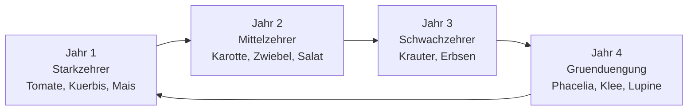

# Mischkultur & Companion Planting

Mischkultur bedeutet, verschiedene Pflanzenarten auf einer Flaeche gemeinsam anzubauen,
so dass sie sich gegenseitig unterstuetzen. Kamerplanter gibt Ihnen konkrete Empfehlungen
auf Basis einer Kompatibilitaetsdatenbank und zeigt, welche Kombinationen sich bewaehrt
haben — und welche Sie besser vermeiden sollten.

---

## Voraussetzungen

- Mindestens ein angelegter Standort (Beet oder Gewaechshaus) in Kamerplanter
- Pflanzenarten in den Stammdaten vorhanden (oder per Suche importiert)

---

## Was ist Mischkultur — und warum funktioniert sie?

Pflanzen beeinflussen sich gegenseitig auf verschiedene Weisen:

| Mechanismus | Beispiel | Effekt |
|------------|---------|--------|
| **Schadlingsabwehr** | Tagetes neben Tomate | Nematoden werden durch Wurzelausscheidungen vertrieben |
| **Aromawirkung** | Basilikum neben Tomate | Aetherische Oele verwirren die Weisse Fliege |
| **Stickstoffbindung** | Bohnen neben Mais | Knollenbakterien fixieren Luftstickstoff |
| **Wurzelraumnutzung** | Zwiebel + Karotte | Verschiedene Tiefen, keine Naehrstoffkonkurrenz |
| **Schattenwirkung** | Salat unter Tomate | Blattsalat gedeiht im Halbschatten, Boden bleibt feucht |
| **Bestaeuberlockung** | Phacelia neben Gemuesebeet | Wildbienen werden angezogen |

!!! tip "Mischkultur ist kein Wundermittel"
    Mischkultur unterstuetzt, ersetzt aber keine gute Bodenpflege, Bewaesserung und
    Fruchtfolge. Behandeln Sie sie als eine Massnahme von mehreren.

---

## Klassische Kombinationen

### Die drei Schwestern (Mais, Bohne, Kuerbis)

Eine der aeltesten Mischkulturen der Welt — entwickelt von den Haudenosaunee (Irokesen):

```
Mais         → Rankhilfe fuer Bohnen, schattiert Kuerbis-Boden
Bohne        → Stickstoffbindung fuer Mais und Kuerbis
Kuerbis      → Grosse Blaetter beschatten den Boden, halten Feuchtigkeit
```

!!! example "Anpflanzung in Kamerplanter"
    Legen Sie einen Pflanzdurchlauf vom Typ "mixed_culture" an und waehlten Sie Mais
    als Primaerpflanze. Das System schlaegt Bohne und Kuerbis als Begleiter vor.

### Tomate & Basilikum

Wahrscheinlich die bekannteste Mischkultur im Gewaechshaus und Freiland:

- Basilikum wirkt als Schadlingsabwehr (Weisse Fliege, Blattlaeuse)
- Gemeinsamer Wasserbedarf und Temperaturansprueche erleichtern die Pflege
- Beide benoetigen sonnenreichen Standort

**Kompatibilitaets-Score in Kamerplanter:** 0.9 (sehr empfohlen)

### Karotte & Zwiebel

Klassisches Gemuese-Paar:

- Zwiebeln und Karotten nutzen verschiedene Bodenebenen
- Zwiebelduft stoert die Karottenfliegenoviposition
- Karottenkraut stoert die Zwiebelfliege

### Tagetes & Ringelblume als Universal-Begleiter

Zwei Kraeuter, die sich fast ueberall einsetzen lassen:

| Pflanze | Wirkung | Empfohlene Nachbarn |
|---------|---------|---------------------|
| **Tagetes** (Studentenblume) | Nematoden, Weisse Fliege, Wurzelausscheidungen halten Schnaecken fern | Tomate, Paprika, Salat |
| **Ringelblume** (Calendula) | Blattlaus-Abwehr, lockt Nuetzlinge an (Schwebefliegen, Marienkaefer) | Fast alle Gemuese |

!!! tip "Tagetes als Beet-Einfassung"
    Pflanzen Sie Tagetes rundum um ein Bemuese-Beet als lebende Grenze. Selbst wenn Sie
    keine Daten in Kamerplanter erfassen, profitiert das gesamte Beet von der
    Schutzwirkung.

### Kraeuter als Schadlingsabwehr

| Kraut | Wirkung |
|-------|---------|
| Basilikum | Weisse Fliege, Blattlaeuse |
| Lavendel | Milben, Motten (Duft) |
| Salbei | Kohlfliege, Kohldurchlaufraupe |
| Bohnenkraut | Schwarze Bohnenblattlaus |
| Dill | Karottenfliegenweibchen verwirren; lockt Schwebefliegen an |
| Koriander | Blattlaeuse vertreiben, Schwebefliegen anlocken |

---

## Schlechte Nachbarn — was Sie vermeiden sollten

!!! danger "Fenchel: Der Einzelgaenger"
    Fenchel vertraegt sich mit fast keiner anderen Gartenflanze. Er sondert
    Allelopathie-Stoffe ab, die das Wachstum von Tomaten, Paprika, Buschbohnen und Salat
    hemmen. Pflanzen Sie Fenchel in ein eigenes Beet oder in einem Topf am Rand.

| Inkompatibles Paar | Grund | Empfehlung |
|-------------------|-------|-----------|
| Tomate + Kartoffel | Gleiche Solanaceae-Familie, gemeinsame Krankheiten (Krautfaeule) | Mindestens 10 m Abstand halten |
| Fenchel + Tomate | Allelopathie durch Fenchel-Sekundaerstoffe | Getrennte Beete |
| Zwiebel + Erbse | Wachstumshemmung bei Erbsen | Verschiedene Beet-Abschnitte |
| Kartoffel + Kuerbis | Starke Naehrstoffkonkurrenz | Rotationsplanung beachten |

---

## Companion Planting in Kamerplanter nutzen

### Schritt 1: Pflanzdurchlauf als Mischkultur anlegen

1. Navigieren Sie zu **Pflanzdurchlaeume** und klicken Sie auf **Neuer Durchlauf**.
2. Waehlten Sie als Durchlauf-Typ **Mischkultur**.
3. Waehlten Sie Ihre Primaerpflanze (z.B. Tomate).
4. Das System zeigt Ihnen sofort Empfehlungen fuer Begleitpflanzen.


### Schritt 2: Begleitpflanzen auswaehlen

Kamerplanter unterscheidet drei Eintrag-Rollen:

| Rolle | Bedeutung |
|-------|-----------|
| **Primaer** | Hauptpflanze des Beetes (z.B. Tomate) |
| **Begleiter** (Companion) | Foerderliche Mischkultur-Partnerin (z.B. Basilikum) |
| **Fallenflanze** (Trap Crop) | Zieht Schadlinge aktiv an und schuetzt Primaerpflanze (z.B. Tagetes) |

Fuer jede Empfehlung zeigt das System:

- **Kompatibilitaets-Score** (0.0–1.0): Je hoeher, desto empfehlenswerter
- **Wirkungstyp**: Schadlingsabwehr, Wachstumsforderung, Bodenpflege usw.
- **Begruendung**: Kurzer Erklaerungstext (z.B. "Weisse-Fliege-Abwehr durch aetherische Oele")
- **Match-Level**: Artebene (genau) oder Familienebene (Fallback, 20% Abzug im Score)

### Schritt 3: Kompatibilitaets-Check

Wenn Sie eine Pflanzenkombination zusammengestellt haben, pruefen Sie den
Gesamtkompatibilitaets-Check:

- **Gruen**: Alle Kombinationen kompatibel
- **Gelb (Warnung)**: Ein oder mehrere inkompatible Paare gefunden, Anpflanzung moeglich
  aber nicht empfohlen
- **Rot**: Kritisch inkompatible Kombination (z.B. Fenchel + Tomate)

!!! note "Familienebene-Fallback"
    Wenn fuer ein Artenpaar noch kein spezifischer Eintrag vorliegt, prueft das System
    die Familienebene. Ein Familienebene-Match wird im Score um 20% reduziert und als
    "Familienebene" gekennzeichnet, damit Sie den Unterschied zur Artebene erkennen.

---

## Fruchtfolge integrieren

Mischkultur und Fruchtfolge ergaenzen sich. Kamerplanter verfolgt einen 4-Jahres-Zyklus
pro Beet:



Beachten Sie bei der Mischkultur: Pflanzen aus derselben Naehrstoff-Kategorie foerdern
die Bodengesundheit nicht — bringen Sie Starkzehrer und Leguminosen zusammen, wenn
moeglich.

---

## Haeufige Fragen

??? question "Was bedeutet 'Allelopathie'?"
    Allelopathie beschreibt die Faehigkeit von Pflanzen, chemische Stoffe abzusondern,
    die das Wachstum anderer Pflanzen hemmen oder foerdern. Fenchel ist das bekannteste
    Beispiel fuer negative Allelopathie im Garten.

??? question "Funktioniert Mischkultur auch im Gewaechshaus und Innenraum?"
    Ja, aber mit Einschraenkungen. Schadlingsabwehr durch Duft wirkt auch drinnen.
    Allerdings ist der Raum oft begrenzt und manche Begleiter (z.B. hohe Tagetes-Sorten)
    behindern die Luftzirkulation. Kamerplanter kennzeichnet Empfehlungen,
    die primear fuer Freiland-Nutzpflanzen validiert sind.

??? question "Woher stammen die Kompatibilitaetsdaten?"
    Die Seed-Daten in Kamerplanter basieren auf gaertnerischen Standardwerken und
    anerkannten Begleitpflanzen-Quellen. Jeder Eintrag traegt eine Quellenangabe
    (z.B. "Mein schoener Garten", "fryd.app", "Erfahrungswert").

??? question "Kann ich eigene Kompatibilitaetspaare hinzufuegen?"
    Aktuell verwalten nur Platform-Admins die globalen Kompatibilitaets-Edges. Eigene
    Beobachtungen koennen Sie im Pflanzentagebuch (PlantDiaryEntry) festhalten.

## Siehe auch

- [Pflanzdurchlaeume](../user-guide/planting-runs.md)
- [Standorte & Substrate](../user-guide/locations-substrates.md)
- [Pflanzenschutz (IPM)](../user-guide/pest-management.md)
- [GDD-Berechnung](gdd-calculation.md)
