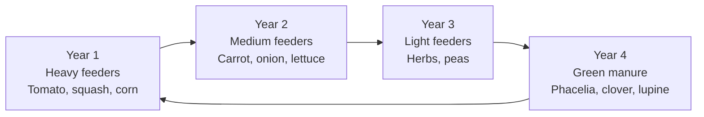

# Mischkultur & Companion Planting

Mischkultur bedeutet, verschiedene Pflanzenarten auf einer Fläche gemeinsam anzubauen,
so dass sie sich gegenseitig unterstützen. Kamerplanter gibt dir konkrete Empfehlungen
auf Basis einer Kompatibilitätsdatenbank und zeigt, welche Kombinationen sich bewährt
haben — und welche du besser vermeiden solltest.

---

## Voraussetzungen

- Mindestens ein angelegter Standort (Beet oder Gewächshaus) in Kamerplanter
- Pflanzenarten in den Stammdaten vorhanden (oder per Suche importiert)

---

## Was ist Mischkultur — und warum funktioniert sie?

Pflanzen beeinflussen sich gegenseitig auf verschiedene Weisen:

| Mechanismus | Beispiel | Effekt |
|------------|---------|--------|
| **Schädlingsabwehr** | Tagetes neben Tomate | Nematoden werden durch Wurzelausscheidungen vertrieben |
| **Aromawirkung** | Basilikum neben Tomate | Ätherische Öle verwirren die Weiße Fliege |
| **Stickstoffbindung** | Bohnen neben Mais | Knollenbakterien fixieren Luftstickstoff |
| **Wurzelraumnutzung** | Zwiebel + Karotte | Verschiedene Tiefen, keine Nährstoffkonkurrenz |
| **Schattenwirkung** | Salat unter Tomate | Blattsalat gedeiht im Halbschatten, Boden bleibt feucht |
| **Bestäuberlockung** | Phacelia neben Gemüsebeet | Wildbienen werden angezogen |

!!! tip "Mischkultur ist kein Wundermittel"
    Mischkultur unterstützt, ersetzt aber keine gute Bodenpflege, Bewässerung und
    Fruchtfolge. Behandle sie als eine Maßnahme von mehreren.

---

## Klassische Kombinationen

### Die drei Schwestern (Mais, Bohne, Kürbis)

Eine der ältesten Mischkulturen der Welt — entwickelt von den Haudenosaunee (Irokesen):

```
Mais         → Rankhilfe für Bohnen, schattiert Kürbis-Boden
Bohne        → Stickstoffbindung für Mais und Kürbis
Kürbis       → Große Blätter beschatten den Boden, halten Feuchtigkeit
```

!!! example "Anpflanzung in Kamerplanter"
    Lege einen Pflanzdurchlauf vom Typ "mixed_culture" an und wähle Mais
    als Primärpflanze. Das System schlägt Bohne und Kürbis als Begleiter vor.

### Tomate & Basilikum

Wahrscheinlich die bekannteste Mischkultur im Gewächshaus und Freiland:

- Basilikum wirkt als Schädlingsabwehr (Weiße Fliege, Blattläuse)
- Gemeinsamer Wasserbedarf und Temperaturansprüche erleichtern die Pflege
- Beide benötigen sonnenreichen Standort

**Kompatibilitäts-Score in Kamerplanter:** 0.9 (sehr empfohlen)

### Karotte & Zwiebel

Klassisches Gemüse-Paar:

- Zwiebeln und Karotten nutzen verschiedene Bodenebenen
- Zwiebelduft stört die Karottenfliegeneiablage
- Karottenkraut stört die Zwiebelfliege

### Tagetes & Ringelblume als Universal-Begleiter

Zwei Kräuter, die sich fast überall einsetzen lassen:

| Pflanze | Wirkung | Empfohlene Nachbarn |
|---------|---------|---------------------|
| **Tagetes** (Studentenblume) | Nematoden, Weiße Fliege, Wurzelausscheidungen halten Schnecken fern | Tomate, Paprika, Salat |
| **Ringelblume** (Calendula) | Blattlaus-Abwehr, lockt Nützlinge an (Schwebefliegen, Marienkäfer) | Fast alle Gemüse |

!!! tip "Tagetes als Beet-Einfassung"
    Pflanze Tagetes rundum um ein Gemüse-Beet als lebende Grenze. Selbst wenn du
    keine Daten in Kamerplanter erfasst, profitiert das gesamte Beet von der
    Schutzwirkung.

### Kräuter als Schädlingsabwehr

| Kraut | Wirkung |
|-------|---------|
| Basilikum | Weiße Fliege, Blattläuse |
| Lavendel | Milben, Motten (Duft) |
| Salbei | Kohlfliege, Kohldurchlaufraupe |
| Bohnenkraut | Schwarze Bohnenblattlaus |
| Dill | Karottenfliegenweibchen verwirren; lockt Schwebefliegen an |
| Koriander | Blattläuse vertreiben, Schwebefliegen anlocken |

---

## Schlechte Nachbarn — was du vermeiden solltest

!!! danger "Fenchel: Der Einzelgänger"
    Fenchel verträgt sich mit fast keiner anderen Gartenpflanze. Er sondert
    Allelopathie-Stoffe ab, die das Wachstum von Tomaten, Paprika, Buschbohnen und Salat
    hemmen. Pflanze Fenchel in ein eigenes Beet oder in einem Topf am Rand.

| Inkompatibles Paar | Grund | Empfehlung |
|-------------------|-------|-----------|
| Tomate + Kartoffel | Gleiche Solanaceae-Familie, gemeinsame Krankheiten (Krautfäule) | Mindestens 10 m Abstand halten |
| Fenchel + Tomate | Allelopathie durch Fenchel-Sekundärstoffe | Getrennte Beete |
| Zwiebel + Erbse | Wachstumshemmung bei Erbsen | Verschiedene Beet-Abschnitte |
| Kartoffel + Kürbis | Starke Nährstoffkonkurrenz | Rotationsplanung beachten |

---

## Companion Planting in Kamerplanter nutzen

### Schritt 1: Pflanzdurchlauf als Mischkultur anlegen

1. Navigiere zu **Pflanzdurchläufe** und klicke auf **Neuer Durchlauf**.
2. Wähle als Durchlauf-Typ **Mischkultur**.
3. Wähle deine Primärpflanze (z.B. Tomate).
4. Das System zeigt dir sofort Empfehlungen für Begleitpflanzen.

!!! info "Screenshot folgt"
    Dieser Screenshot wird in einer zukünftigen Version ergänzt.

### Schritt 2: Begleitpflanzen auswählen

Kamerplanter unterscheidet drei Eintrag-Rollen:

| Rolle | Bedeutung |
|-------|-----------|
| **Primär** | Hauptpflanze des Beetes (z.B. Tomate) |
| **Begleiter** (Companion) | Förderliche Mischkultur-Partnerin (z.B. Basilikum) |
| **Fallenflanze** (Trap Crop) | Zieht Schädlinge aktiv an und schützt Primärpflanze (z.B. Tagetes) |

Für jede Empfehlung zeigt das System:

- **Kompatibilitäts-Score** (0.0–1.0): Je höher, desto empfehlenswerter
- **Wirkungstyp**: Schädlingsabwehr, Wachstumsförderung, Bodenpflege usw.
- **Begründung**: Kurzer Erklärungstext (z.B. "Weiße-Fliege-Abwehr durch ätherische Öle")
- **Match-Level**: Artebene (genau) oder Familienebene (Fallback, 20% Abzug im Score)

### Schritt 3: Kompatibilitäts-Check

Wenn du eine Pflanzenkombination zusammengestellt hast, prüfe den
Gesamtkompatibilitäts-Check:

- **Grün**: Alle Kombinationen kompatibel
- **Gelb (Warnung)**: Ein oder mehrere inkompatible Paare gefunden, Anpflanzung möglich
  aber nicht empfohlen
- **Rot**: Kritisch inkompatible Kombination (z.B. Fenchel + Tomate)

!!! note "Familienebene-Fallback"
    Wenn für ein Artenpaar noch kein spezifischer Eintrag vorliegt, prüft das System
    die Familienebene. Ein Familienebene-Match wird im Score um 20% reduziert und als
    "Familienebene" gekennzeichnet, damit du den Unterschied zur Artebene erkennst.

---

## Fruchtfolge integrieren

Mischkultur und Fruchtfolge ergänzen sich. Kamerplanter verfolgt einen 4-Jahres-Zyklus
pro Beet:

<!-- diagram-source: user-described — 4-year crop-rotation cycle per bed by nutrient-demand category -->

```mermaid
flowchart LR
    A["Year 1<br/>Heavy feeders<br/>Tomato, squash, corn"] --> B["Year 2<br/>Medium feeders<br/>Carrot, onion, lettuce"]
    B --> C["Year 3<br/>Light feeders<br/>Herbs, peas"]
    C --> D["Year 4<br/>Green manure<br/>Phacelia, clover, lupine"]
    D --> A
```

Beachte bei der Mischkultur: Pflanzen aus derselben Nährstoff-Kategorie fördern
die Bodengesundheit nicht — bringe Starkzehrer und Leguminosen zusammen, wenn
möglich.

---

## Häufige Fragen

??? question "Was bedeutet 'Allelopathie'?"
    Allelopathie beschreibt die Fähigkeit von Pflanzen, chemische Stoffe abzusondern,
    die das Wachstum anderer Pflanzen hemmen oder fördern. Fenchel ist das bekannteste
    Beispiel für negative Allelopathie im Garten.

??? question "Funktioniert Mischkultur auch im Gewächshaus und Innenraum?"
    Ja, aber mit Einschränkungen. Schädlingsabwehr durch Duft wirkt auch drinnen.
    Allerdings ist der Raum oft begrenzt und manche Begleiter (z.B. hohe Tagetes-Sorten)
    behindern die Luftzirkulation. Kamerplanter kennzeichnet Empfehlungen,
    die primär für Freiland-Nutzpflanzen validiert sind.

??? question "Woher stammen die Kompatibilitätsdaten?"
    Die Seed-Daten in Kamerplanter basieren auf gärtnerischen Standardwerken und
    anerkannten Begleitpflanzen-Quellen. Jeder Eintrag trägt eine Quellenangabe
    (z.B. "Mein schöner Garten", "fryd.app", "Erfahrungswert").

??? question "Kann ich eigene Kompatibilitätspaare hinzufügen?"
    Aktuell verwalten nur Platform-Admins die globalen Kompatibilitäts-Edges. Eigene
    Beobachtungen kannst du im Pflanzentagebuch (PlantDiaryEntry) festhalten.

## Siehe auch

- [Pflanzdurchläufe](../user-guide/planting-runs.md)
- [Standorte & Substrate](../user-guide/locations-substrates.md)
- [Pflanzenschutz (IPM)](../user-guide/pest-management.md)
- [GDD-Berechnung](gdd-calculation.md)
