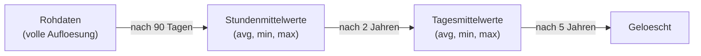
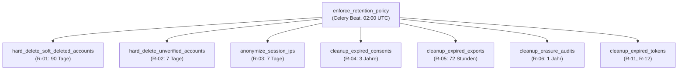
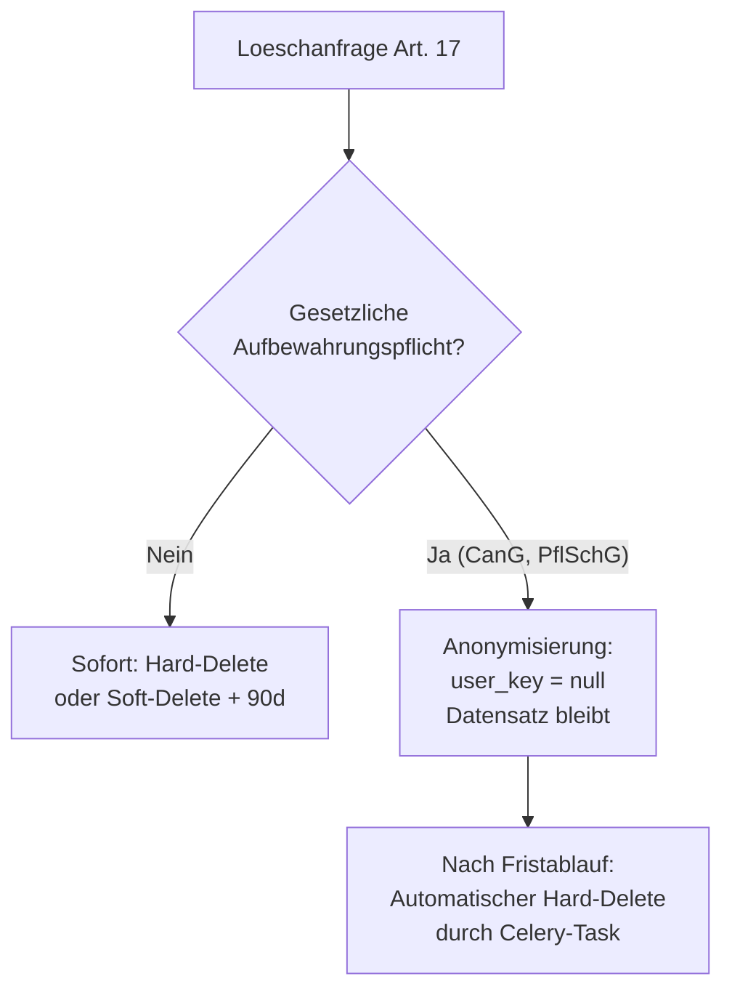

# Datenaufbewahrung & Anonymisierung

Kamerplanter speichert Daten nur so lange, wie es fachlich oder gesetzlich erforderlich
ist. Dieses Dokument beschreibt die Retention-Matrix, den automatischen Durchsetzungs-
Mechanismus (Celery-Task), die TimescaleDB-Aggregierung fuer Sensordaten und die
Konfigurierbarkeit per Umgebungsvariablen.

Grundlage: NFR-011 (Vorratsdatenspeicherung & Aufbewahrungsfristen), DSGVO Art. 5 Abs. 1 lit. e.

---

## Retention-Matrix — Personenbezogene Daten

| Ref | Datenkategorie | Frist | Aktion nach Frist | Rechtsgrundlage |
|-----|---------------|-------|-------------------|----------------|
| R-01 | Soft-geloeschte User-Accounts | 90 Tage nach Soft-Delete | Hard-Delete (inkl. Edges, Auth-Provider, Sessions) | Art. 17 DSGVO |
| R-02 | Unbestaetigte Accounts | 7 Tage nach Erstellung | Hard-Delete | Art. 5(1)(e), Zweckentfall |
| R-03 | IP-Adressen in Sessions | 7 Tage nach Speicherung | Anonymisierung (IPv4: letztes Oktett → `0`) | Art. 5(1)(c) Datenminimierung |
| R-04 | Consent Records | 3 Jahre nach Widerruf | Hard-Delete | Art. 7(1) Nachweispflicht |
| R-05 | Export-Dateien (Art. 15/20 DSGVO) | 72 Stunden nach Fertigstellung | Datei loeschen, Status auf `expired` | Zweckentfall |
| R-06 | Loeschung-Audit-Logs | 1 Jahr nach Abschluss | Hard-Delete | Art. 5(2) Rechenschaftspflicht |
| R-07 | E-Mail-Aenderungsanfragen | 24 Stunden | Hard-Delete abgelaufener Tokens | Zweckentfall |
| R-11 | Abgelaufene Refresh Tokens | Sofort nach Ablauf | Hard-Delete (TTL-Index) | Zweckentfall |
| R-12 | Abgelaufene Einladungen | 30 Tage nach Ablauf | Hard-Delete | Zweckentfall |

### IP-Anonymisierung (R-03)

IP-Adressen werden nach 7 Tagen automatisch anonymisiert — nicht geloescht, da sie
fuer die Erkennung kompromittierter Sessions noch benoetigt werden koennen:

- **IPv4:** Letztes Oktett wird auf `0` gesetzt — `192.168.1.42` → `192.168.1.0`
- **IPv6:** Auf `/48`-Praefix gekuerzt — `2001:db8:85a3::8a2e:370:7334` → `2001:db8:85a3::`

Das Feld `ip_anonymized_at` wird auf den Zeitpunkt der Anonymisierung gesetzt.

---

## Retention-Matrix — Sensordaten

Sensordaten koennen indirekt Rueckschluesse auf Anwesenheit und Verhalten von Personen
erlauben (CO2-Kurven, Bewegungssensoren, manuelle Overrides). Sie unterliegen daher
einer gestuften Retention-Policy in TimescaleDB:



| Stufe | Zeitraum | Aufloesung | TimescaleDB View |
|-------|---------|-----------|-----------------|
| 1 — Rohdaten | 0–90 Tage | Volle Messaufloesung | `sensor_readings` |
| 2 — Stundenmittel | 90 Tage–2 Jahre | 1 Wert pro Stunde | `sensor_hourly` |
| 3 — Tagesmittel | 2–5 Jahre | 1 Wert pro Tag | `sensor_daily` |
| Ablauf | Nach 5 Jahren | — | Automatisch geloescht |

!!! note "Klimatische Extremereignisse bleiben dauerhaft erhalten"
    Frost, Hitzewellen und Sturmereignisse werden als `ClimateEvent`-Dokument in ArangoDB
    dauerhaft archiviert — ohne Personenbezug. Das ist relevant fuer mehrjaehrige Pflanzen
    (Obstbaeume, Perennials), bei denen die Klimahistorie ueber Jahre benoetigt wird.

### TimescaleDB Continuous Aggregates

Das automatische Downsampling erfolgt ueber TimescaleDB Continuous Aggregates und
Retention Policies:

```sql
-- Stufe 2: Stundenmittel (automatisch nach 90 Tagen)
CREATE MATERIALIZED VIEW sensor_hourly
  WITH (timescaledb.continuous) AS
  SELECT
    time_bucket('1 hour', timestamp) AS bucket,
    location_key,
    sensor_type,
    AVG(value)   AS avg_value,
    MIN(value)   AS min_value,
    MAX(value)   AS max_value,
    COUNT(*)     AS sample_count
  FROM sensor_readings
  GROUP BY bucket, location_key, sensor_type;

-- Stufe 3: Tagesmittel (automatisch nach 2 Jahren)
CREATE MATERIALIZED VIEW sensor_daily
  WITH (timescaledb.continuous) AS
  SELECT
    time_bucket('1 day', bucket) AS bucket,
    location_key,
    sensor_type,
    AVG(avg_value) AS avg_value,
    MIN(min_value) AS min_value,
    MAX(max_value) AS max_value,
    SUM(sample_count) AS sample_count
  FROM sensor_hourly
  GROUP BY time_bucket('1 day', bucket), location_key, sensor_type;

-- Retention Policies (automatisches Loeschen)
SELECT add_retention_policy('sensor_readings', INTERVAL '90 days');
SELECT add_retention_policy('sensor_hourly',   INTERVAL '2 years');
SELECT add_retention_policy('sensor_daily',    INTERVAL '5 years');
```

---

## Gesetzliche Mindestaufbewahrungsfristen

Diese Daten duerfen **nicht** vor Ablauf der gesetzlichen Frist geloescht werden.
Bei einer DSGVO-Loeschanfrage (Art. 17) werden sie **anonymisiert** (User-Referenz entfernt),
aber nicht geloescht (Art. 17 Abs. 3 lit. b):

| Ref | Datenkategorie | Mindestfrist | Rechtsgrundlage |
|-----|---------------|-------------|----------------|
| R-16 | Erntedaten (HarvestBatch, QualityAssessment, YieldMetric) | 5 Jahre | CanG (Cannabis-Gesetz) |
| R-17 | Behandlungsanwendungen (TreatmentApplication) | 3 Jahre | PflSchG §11 |
| R-18 | Inspektionsprotokolle | 3 Jahre | PflSchG §11 |

!!! danger "Loeschsperre beachten"
    Einen aktiven Ernte- oder Behandlungsdatensatz zu loeschen waere ein Verstoss gegen
    das CanG bzw. PflSchG. Das System verhindert dies technisch — bei einer Loeschanfrage
    wird die User-Referenz (`user_key`) auf `null` gesetzt, der Datensatz selbst bleibt
    bis zum Ablauf der Frist erhalten.

---

## Celery-Enforcement: Automatische Durchsetzung

Der Celery-Task `enforce_retention_policy` laeuft **taeglich um 02:00 UTC** und
orchestriert alle Retention-Sub-Tasks:



Jeder Sub-Task protokolliert Anzahl der verarbeiteten Datensaetze via structlog:

```json
{
  "event": "retention.run_completed",
  "results": {
    "hard_delete_soft_deleted_accounts": {"deleted_count": 3},
    "anonymize_session_ips": {"anonymized_count": 47},
    "cleanup_expired_exports": {"expired_count": 1}
  },
  "duration_ms": 1234
}
```

### Prometheus-Metriken

Der Retention-Task exponiert folgende Metriken:

| Metrik | Typ | Labels | Beschreibung |
|--------|-----|--------|-------------|
| `retention_records_processed_total` | Counter | `category`, `action` | Verarbeitete Datensaetze pro Kategorie und Aktion (`delete`/`anonymize`/`expire`) |
| `retention_run_duration_seconds` | Histogram | — | Laufzeit des gesamten Retention-Runs |
| `retention_run_errors_total` | Counter | `category` | Fehler pro Kategorie |

---

## Konfiguration per Umgebungsvariablen

Alle Fristen sind ueber Umgebungsvariablen konfigurierbar. Das Praefix `RETENTION_`
wird vorausgestellt:

```bash
# Personenbezogene Daten
RETENTION_SOFT_DELETE_RETENTION_DAYS=90      # R-01: Soft-geloeschte Accounts
RETENTION_UNVERIFIED_ACCOUNT_DAYS=7          # R-02: Unbestaetigte Accounts
RETENTION_IP_ANONYMIZATION_DAYS=7            # R-03: IP-Anonymisierung
RETENTION_CONSENT_RETENTION_YEARS=3          # R-04: Consent Records
RETENTION_EXPORT_FILE_RETENTION_HOURS=72     # R-05: Export-Dateien
RETENTION_ERASURE_AUDIT_RETENTION_YEARS=1    # R-06: Audit-Logs
RETENTION_EMAIL_CHANGE_RETENTION_HOURS=24    # R-07: E-Mail-Aenderungsanfragen
RETENTION_INVITATION_RETENTION_DAYS=30       # R-12: Abgelaufene Einladungen

# Sensordaten (TimescaleDB)
RETENTION_SENSOR_RAW_RETENTION_DAYS=90       # R-14 Stufe 1
RETENTION_SENSOR_HOURLY_RETENTION_YEARS=2    # R-14 Stufe 2
RETENTION_SENSOR_DAILY_RETENTION_YEARS=5     # R-14 Stufe 3
RETENTION_ACTOR_LOG_RAW_RETENTION_DAYS=90    # R-15 Stufe 1
RETENTION_ACTOR_LOG_AGGREGATED_RETENTION_YEARS=1  # R-15 Stufe 2
```

!!! warning "Gesetzliche Mindestfristen sind nicht unterschreitbar"
    Die folgenden Werte koennen zwar per Umgebungsvariable erhoeht, aber **nicht
    unterschritten** werden. Ein Validierungs-Check beim Start der Anwendung erzwingt
    die gesetzlichen Mindestfristen:

    ```bash
    RETENTION_HARVEST_DATA_MIN_RETENTION_YEARS=5   # R-16, CanG — MINIMUM
    RETENTION_TREATMENT_MIN_RETENTION_YEARS=3      # R-17, PflSchG — MINIMUM
    RETENTION_INSPECTION_MIN_RETENTION_YEARS=3     # R-18, PflSchG — MINIMUM
    ```

---

## Wechselwirkung mit DSGVO-Loeschanfragen

Wenn ein Betroffener eine Loeschanfrage nach Art. 17 DSGVO stellt, greift folgendes
Verfahren:



| Datenkategorie | Verfahren |
|---------------|-----------|
| User-Account | Soft-Delete → Hard-Delete nach 90 Tagen |
| Consent Records | Sofort loeschen (Widerruf) |
| Export-Dateien | Sofort loeschen |
| Erntedaten, Behandlungen, Inspektionen | Anonymisieren, nicht loeschen (Art. 17 Abs. 3) |
| Shared Tenant-Daten (Pins, Einkaufslisten) | User-Referenz anonymisieren, Inhalt bleibt |

---

## Haeufige Fragen

??? question "Kann ich die 90-Tage-Frist fuer Soft-Delete verlaengern?"
    Ja, per `RETENTION_SOFT_DELETE_RETENTION_DAYS`. Eine Verkuerzung unter 30 Tage
    wird nicht empfohlen, da Nutzer sonst keine Chance haben, irrtuerlich geloeschte
    Accounts wiederherzustellen.

??? question "Was passiert mit Tenant-Daten wenn der letzte Admin eines Tenants geloescht wird?"
    Der Celery-Task `detect_orphaned_tenants` erkennt Tenants ohne aktiven Admin und
    setzt einen `orphaned_since`-Timestamp. Ein Platform-Admin kann dann einen
    Notfall-Admin ernennen.

??? question "Wie kann ich pruefen, ob der Retention-Task korrekt laeuft?"
    Pruefen Sie die Prometheus-Metrik `retention_run_duration_seconds` oder
    schauen Sie in die strukturierten Logs (structlog) nach dem Event
    `retention.run_completed`. Im Kubernetes-Cluster: `kubectl logs -l app=celery-beat`.

??? question "Werden Sensordaten bei einer Konto-Loeschung auch geloescht?"
    Sensordaten in TimescaleDB haben keine direkte User-Referenz — sie sind einem
    Standort (`location_key`) zugeordnet. Bei Konto-Loeschung bleiben Sensordaten
    erhalten und unterliegen nur den zeitbasierten Retention-Policies (R-14).

## Siehe auch

- [Umgebungsvariablen](../reference/environment-variables.md)
- [Datenbankschema](../reference/database-schema.md)
- [Kubernetes-Deployment](../deployment/kubernetes.md)
