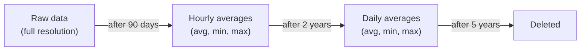
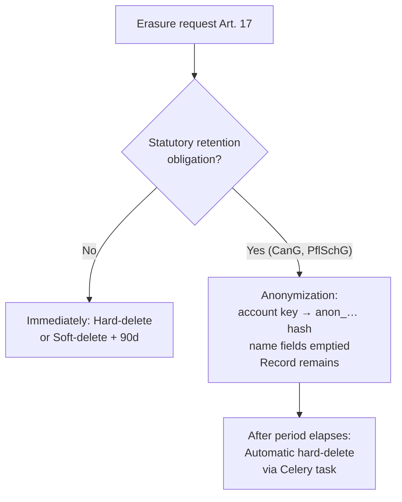

# Datenaufbewahrung & Anonymisierung

Kamerplanter speichert Daten nur so lange, wie es fachlich oder gesetzlich erforderlich
ist. Dieses Dokument beschreibt die Retention-Matrix, den automatischen Durchsetzungs-
Mechanismus (Celery-Task), die TimescaleDB-Aggregierung für Sensordaten und die
Konfigurierbarkeit per Umgebungsvariablen.

Grundlage: DSGVO Art. 5 Abs. 1 lit. e. <!-- NFR-011 -->

---

## Retention-Matrix — Personenbezogene Daten

| Ref | Datenkategorie | Frist | Aktion nach Frist | Rechtsgrundlage |
|-----|---------------|-------|-------------------|----------------|
| R-01 | Soft-gelöschte User-Accounts | 90 Tage nach Soft-Delete | Hard-Delete (inkl. Edges, Auth-Provider, Sessions) | Art. 17 DSGVO |
| R-02 | Unbestätigte Accounts | 7 Tage nach Erstellung | Hard-Delete (`app.tasks.auth_tasks.cleanup_unverified_accounts`, täglich) | Art. 5(1)(e), Zweckentfall |
| R-03 | IP-Adressen in Sessions | 7 Tage nach Speicherung | Anonymisierung (IPv4: letztes Oktett → `0`) | Art. 5(1)(c) Datenminimierung |
| R-04 | Consent Records | 3 Jahre nach Widerruf | **Nicht implementiert:** Kein Task löscht `consent_records`; auch die IP-Adresse eines Consent Records wird nicht anonymisiert | Art. 7(1) Nachweispflicht |
| R-05 | Export-Dateien (Art. 15/20 DSGVO) | 72 Stunden nach Fertigstellung | Datei zuerst löschen, danach Status auf `expired` | Zweckentfall |
| R-06 | Löschungs-Audit (abgeschlossene Anträge) | 1 Jahr nach Abschluss | Hard-Delete (`retention.purge_expired_erasure_records`, täglich 04:30 UTC) | Art. 5(2) Rechenschaftspflicht |
| R-07 | E-Mail-Änderungsanfragen | 24 Stunden nach Erstellung | Status auf `expired` setzen (kein Hard-Delete) | Zweckentfall |
| R-07a | Rückgängig-Fenster einer bestätigten E-Mail-Änderung | 7 Tage nach der Bestätigung | `previous_email`, Hash des Rückgängig-Tokens und dessen Ablaufzeitpunkt nullen | Zweckentfall — der Rückgängig-Link ist abgelaufen |
| R-11 | Abgelaufene Refresh Tokens | Sofort nach Ablauf | Hard-Delete (TTL-Index) | Zweckentfall |
| R-12 | Abgelaufene Einladungen | 30 Tage nach Ablauf | **Teilweise implementiert:** Status wird auf `expired` gesetzt, eine Löschung nach 30 Tagen findet nicht statt | Zweckentfall |

Jede Frist außer R-11 und R-12 wird über genau eine Einstellung gelesen (siehe
[Umgebungsvariablen](../reference/environment-variables.md#datenschutz-dsgvo-req-025-nfr-011)
für die genauen Namen). Für R-01, R-05 und R-07 gab es bis zu dieser Änderung bereits
dokumentierte, ältere Variablennamen, die aber nichts bewirkten — der Code nutzte feste
Werte. Diese älteren Namen funktionieren jetzt tatsächlich und bleiben zusätzlich als
Alias gültig. Jeder Fristvergleich vergleicht dabei Zeitpunkte statt Zeichenketten, damit
ein Datensatz nicht durch eine abweichende Zeitstempel-Schreibweise zu früh oder zu spät
erfasst wird.

### Unbestätigte Accounts (R-02)

Ein Konto, dessen E-Mail-Adresse nie bestätigt wurde, entfernt der tägliche Task
`app.tasks.auth_tasks.cleanup_unverified_accounts` automatisch — `RETENTION_UNVERIFIED_ACCOUNT_DAYS`
Tage nach der Registrierung (Standard 7 Tage, Minimum 1 Tag). Der Task führt dafür dieselbe
vollständige Löschung aus wie ein selbst gestellter Löschantrag, mit demselben Löschungs-Antrag
als Nachweis und derselben automatischen Wiederholung bei einem fehlgeschlagenen Schritt — mehr
dazu weiter unten unter „Alle Löschwege tun dasselbe".

### IP-Anonymisierung (R-03)

IP-Adressen werden `RETENTION_IP_ANONYMIZATION_DAYS` Tage nach der Ausstellung der
Session automatisch anonymisiert (Standard 7 Tage, Minimum 1 Tag) — nicht gelöscht, da
sie für die Erkennung kompromittierter Sessions noch benötigt werden können:

- **IPv4:** Letztes Oktett wird auf `0` gesetzt — `192.168.1.42` → `192.168.1.0`
- **IPv6:** Auf `/48`-Präfix gekürzt — `2001:db8:85a3::8a2e:370:7334` → `2001:db8:85a3::`

Das Feld `ip_anonymized_at` wird auf den Zeitpunkt der Anonymisierung gesetzt. Das
betrifft ausschließlich die IP-Adresse einer Session — die IP-Adresse, die zu einem
Consent Record gehört (siehe R-04 oben), wird davon nicht erfasst.

### Export-Dateien: erst die Datei, dann der Status (R-05)

Die Frist ist über `RETENTION_EXPORT_FILE_RETENTION_HOURS` konfigurierbar (Standard
72 Stunden, Minimum 1 Stunde; der ältere Name `PRIVACY_EXPORT_RETENTION_HOURS` bleibt
als Alias gültig). Beim Ablauf eines Datenexports läuft die Bereinigung in einer festen
Reihenfolge: Zuerst wird die Export-Datei aus dem Objektspeicher gelöscht, erst danach
wechselt der Export auf den Status `expired`. Schlägt das Löschen der Datei fehl, bleibt
der Export unverändert —
der nächste stündliche Lauf versucht es erneut. Downloads sind ohnehin schon ab dem
Ablauf der 72 Stunden gesperrt, unabhängig vom gespeicherten Status. Ist auf der Instanz
kein Objektspeicher konfiguriert, kann die Datei gar nicht gelöscht werden: Der Export
bleibt offen, und der Lauf protokolliert einen Fehler statt den Status trotzdem
umzustellen.

### Löschungs-Audit-Bereinigung (R-06)

Der tägliche Task `retention.purge_expired_erasure_records` (04:30 UTC, nach dem
Löschungs-Task um 04:00 UTC) entfernt abgeschlossene Löschungs-Anträge
(`erasure_requests`, `status=completed`), deren `completed_at` mehr als
`RETENTION_ERASURE_AUDIT_RETENTION_YEARS` Jahre zurückliegt (Standard 1 Jahr, Minimum
1 Jahr, gezählt in Kalenderjahren). Das gilt unabhängig davon, wer die Löschung
ausgelöst hat (`origin`: `self_service`, `platform_admin` oder `unverified_cleanup`).

Ein noch offener oder nur teilweise abgeschlossener Antrag (`scheduled`, `in_progress`,
`partially_completed`) wird nie entfernt — er ist noch einen Lauf schuldig. Ein
abgeschlossener Antrag ohne `completed_at` bleibt ebenfalls erhalten. Der Lauf
protokolliert nur die Anzahl der entfernten Anträge, nie eine Konto- oder Antragskennung.

### E-Mail-Änderungsanfragen (R-07)

Der stündliche Task `retention.expire_email_change_requests` (Minute 15) setzt eine noch
unbestätigte E-Mail-Änderungsanfrage `RETENTION_EMAIL_CHANGE_RETENTION_HOURS` Stunden nach
der Anfrage (Standard 24 Stunden, Minimum 1 Stunde; der ältere Name
`PRIVACY_EMAIL_CHANGE_TTL_HOURS` bleibt als Alias gültig) auf den Status `expired`. Ein
Hard-Delete des Datensatzes findet dabei nicht statt.

### Rückgängig-Fenster einer bestätigten E-Mail-Änderung (R-07a)

Bestätigt sich eine E-Mail-Änderung, erhält die **vorherige** Adresse einen einmalig
nutzbaren Rückgängig-Link (siehe [Datenschutz — E-Mail-Adresse ändern](../user-guide/privacy.md#e-mail-adresse-andern-art-16-dsgvo)).
Dafür merkt sich der Datensatz drei zusätzliche Felder: `previous_email`, den Hash des
Rückgängig-Tokens (`revert_token_hash`) und dessen Ablaufzeitpunkt (`revert_expires_at`),
gesetzt auf den Bestätigungszeitpunkt plus `RETENTION_EMAIL_CHANGE_REVERT_DAYS` (Standard
7 Tage, Minimum 1 Tag).

Derselbe stündliche Task wie bei R-07 (`retention.expire_email_change_requests`, Minute
15) schließt das Fenster in demselben Lauf: Er nullt bei jedem Datensatz, dessen
`revert_token_hash` gesetzt und dessen `revert_expires_at` erreicht oder nicht lesbar ist,
alle drei Felder — konservativ, ein Datensatz mit unlesbarem Ablaufzeitpunkt gilt also als
abgelaufen. Der Rückgängig-Link funktioniert danach nicht mehr; ein Hard-Delete des
gesamten Datensatzes findet weiterhin nicht statt (siehe R-07).

---

## Retention-Matrix — Sensordaten

Sensordaten können indirekt Rückschlüsse auf Anwesenheit und Verhalten von Personen
erlauben (CO2-Kurven, Bewegungssensoren, manuelle Overrides). Sie unterliegen daher
einer gestuften Retention-Policy in TimescaleDB:

<!-- diagram-source: user-described — tiered TimescaleDB sensor-data downsampling pipeline from raw to deletion -->

```mermaid
flowchart LR
    A["Raw data<br/>(full resolution)"]
    B["Hourly averages<br/>(avg, min, max)"]
    C["Daily averages<br/>(avg, min, max)"]
    D["Deleted"]

    A -- "after 90 days" --> B
    B -- "after 2 years" --> C
    C -- "after 5 years" --> D
```

| Stufe | Zeitraum | Auflösung | TimescaleDB View |
|-------|---------|-----------|-----------------|
| 1 — Rohdaten | 0–90 Tage | Volle Messauflösung | `sensor_readings` |
| 2 — Stundenmittel | 90 Tage–2 Jahre | 1 Wert pro Stunde | `sensor_hourly` |
| 3 — Tagesmittel | 2–5 Jahre | 1 Wert pro Tag | `sensor_daily` |
| Ablauf | Nach 5 Jahren | — | Automatisch gelöscht |

!!! note "Klimatische Extremereignisse bleiben dauerhaft erhalten"
    Frost, Hitzewellen und Sturmereignisse werden als `ClimateEvent`-Dokument in ArangoDB
    dauerhaft archiviert — ohne Personenbezug. Das ist relevant für mehrjährige Pflanzen
    (Obstbäume, Perennials), bei denen die Klimahistorie über Jahre benötigt wird.

### TimescaleDB Continuous Aggregates

Das automatische Downsampling erfolgt über TimescaleDB Continuous Aggregates und
Retention Policies:

```sql
-- Stufe 2: Stundenmittel (automatisch nach 90 Tagen)
CREATE MATERIALIZED VIEW sensor_hourly
  WITH (timescaledb.continuous) AS
  SELECT
    time_bucket('1 hour', timestamp) AS bucket,
    location_key,
    sensor_type,
    AVG(value)   AS avg_value,
    MIN(value)   AS min_value,
    MAX(value)   AS max_value,
    COUNT(*)     AS sample_count
  FROM sensor_readings
  GROUP BY bucket, location_key, sensor_type;

-- Stufe 3: Tagesmittel (automatisch nach 2 Jahren)
CREATE MATERIALIZED VIEW sensor_daily
  WITH (timescaledb.continuous) AS
  SELECT
    time_bucket('1 day', bucket) AS bucket,
    location_key,
    sensor_type,
    AVG(avg_value) AS avg_value,
    MIN(min_value) AS min_value,
    MAX(max_value) AS max_value,
    SUM(sample_count) AS sample_count
  FROM sensor_hourly
  GROUP BY time_bucket('1 day', bucket), location_key, sensor_type;

-- Retention Policies (automatisches Löschen)
SELECT add_retention_policy('sensor_readings', INTERVAL '90 days');
SELECT add_retention_policy('sensor_hourly',   INTERVAL '2 years');
SELECT add_retention_policy('sensor_daily',    INTERVAL '5 years');
```

---

## Gesetzliche Mindestaufbewahrungsfristen

Diese Daten dürfen **nicht** vor Ablauf der gesetzlichen Frist gelöscht werden.
Bei einer DSGVO-Löschanfrage (Art. 17) werden sie **anonymisiert** (User-Referenz entfernt),
aber nicht gelöscht (Art. 17 Abs. 3 lit. b):

| Ref | Datenkategorie | Mindestfrist | Rechtsgrundlage |
|-----|---------------|-------------|----------------|
| R-16 | Erntedaten (HarvestBatch, QualityAssessment, YieldMetric) | 5 Jahre | CanG (Cannabis-Gesetz) |
| R-17 | Behandlungsanwendungen (TreatmentApplication) | 3 Jahre | PflSchG §11 |
| R-18 | Inspektionsprotokolle | 3 Jahre | PflSchG §11 |

!!! danger "Löschsperre beachten"
    Einen aktiven Ernte- oder Behandlungsdatensatz zu löschen wäre ein Verstoß gegen
    das CanG bzw. PflSchG. Die Konto-Löschung löscht diese Datensätze deshalb nicht,
    sondern entfernt nur den Personenbezug. Der Datensatz selbst bleibt bis zum Ablauf
    der Frist erhalten.

### So sieht ein anonymisierter Datensatz aus

Die Kontenreferenz wird nicht auf `null` gesetzt, sondern ersetzt. Welche Form sie
bekommt, hängt davon ab, ob die Datensätze des gelöschten Kontos für die Prüfung
untereinander verknüpfbar bleiben müssen:

| Datensatz | Feld mit der Kontenreferenz | Wird ersetzt durch | Zusätzlich geleert |
|-----------|-----------------------------|--------------------|--------------------|
| Ernte (HarvestBatch) | `harvested_by_key` | Tombstone-Hash `anon_…` | `harvester` |
| Qualitätsbewertung (QualityAssessment) | `assessed_by_key` | Tombstone-Hash `anon_…` | `assessed_by` |
| Behandlung (TreatmentApplication) | `applied_by_key` | Tombstone-Hash `anon_…` | `applied_by` |
| Inspektion (Inspection) | `inspected_by_key` | Tombstone-Hash `anon_…` | `inspector` |
| Aufgabe (Task) | `assigned_to_user_key` | Markierung `_anonymized` | — |
| Tagebucheintrag (PlantDiaryEntry) | `created_by`, `analysis_requested_by`, `analysis_claimed_by` | Markierung `_anonymized` | — |
| Aufgaben-Kommentar | `created_by` | Markierung `_anonymized` | — |
| Einladung, die du verschickt hast | `invited_by_user_key` | Markierung `_anonymized` | — |
| Datei im Garten (Foto, Import-Datei) | `created_by` | Markierung `_anonymized` | — |
| Import-Auftrag | `uploaded_by` | Markierung `_anonymized` | — |
| Wetterquellen-Einstellung eines Standorts | `updated_by` | Markierung `_anonymized` | — |
| Manuelle Aktor-Übersteuerung | `created_by` | Markierung `_anonymized` | — |
| KI-Protokolleintrag | `user_key` | Markierung `_anonymized` | — |
| Schädlingsfoto, das du als Admin freigegeben hast | `promoted_by` | Markierung `_anonymized` | — |
| Persönlicher Garten, dessen einziges aktives Mitglied du bist | — | vollständig gelöscht, siehe unten | — |
| Gemeinschaftsgarten oder Garten mit weiteren Mitgliedern, den du angelegt hast | `owner_user_key` | Markierung `_anonymized` | beim persönlichen Garten zusätzlich Name und Kurzname, siehe unten |
| Löschungs-Audit (ErasureRequest) | `user_key` | Tombstone-Hash `anon_…` | — |
| MCP-Protokolleintrag eines Dienstkontos | `service_account_key` | Tombstone-Hash `anon_…` | — |

- Der **Tombstone-Hash** hat die Form `anon_` plus 16 Hex-Zeichen. Er wird aus dem
  Kontoschlüssel und dem geheimen Salt `ERASURE_TOMBSTONE_SALT` gebildet, ist nicht
  umkehrbar und für dasselbe Konto immer gleich. So bleiben die Ernten, Behandlungen und
  Inspektionen eines gelöschten Kontos für eine Prüfung einander zuordenbar, ohne dass
  sie noch eine Person nennen.
- Die **Namensfelder** (`harvester`, `assessed_by`, `applied_by`, `inspector`) sind
  Freitext, den jemand beim Erfassen eingetippt hat. Ein Name ist für sich schon ein
  Personenbezug, deshalb werden sie im selben Schritt geleert.
- **Qualitätsbewertungen** gehören zur Erntedokumentation und werden seit dieser
  Änderung genauso anonymisiert wie die Ernte selbst. Sie erscheinen auch in deiner
  Datenauskunft (Art. 15 DSGVO).
- **Mengen- und Ertragsdaten** (YieldMetric) tragen keine Kontenreferenz. Es gibt dort
  nichts zu anonymisieren.

!!! warning "Ältere Datensätze ohne Kontenreferenz"
    Das Feld mit der Kontenreferenz gibt es für Ernten, Behandlungen, Inspektionen und
    Qualitätsbewertungen erst seit einer Migration. Datensätze, die vorher erfasst wurden,
    haben dort `null` und nur den eingetippten Namen. Das System rät den Besitzer nicht
    aus dem Freitext, deshalb erreicht die Konto-Löschung solche Altdatensätze nicht. Ihr
    Namensfeld bleibt, wie es eingegeben wurde.

### Was mit deinem persönlichen Garten passiert

Bei der Registrierung legt Kamerplanter einen persönlichen Garten für dich an. Was mit
ihm bei einer Konto-Löschung passiert, hängt davon ab, ob noch jemand anderes aktives
Mitglied ist:

- **Bist du das einzige aktive Mitglied** — der Normalfall — wird der Garten
  vollständig über das [Mandanten-Löschinventar](#mandantenloschung) gelöscht: Standorte,
  Pflanzen, Pflanzdurchläufe, Tagebuch, Aufgaben, Tanks und alles andere darin ist danach
  weg. Nur Ernte-, Qualitäts-, Behandlungs- und Inspektionsdaten bleiben — wie bei jeder
  Konto-Löschung — unter deinem Tombstone-Hash erhalten, weil CanG (5 Jahre) und PflSchG
  (3 Jahre) das verlangen; ihre Freitext-Namensfelder werden geleert. Für diese
  Garten-Löschung wird ein eigener Löschungs-Nachweis angelegt, und dein Löschantrag
  nennt am Ende, was aus dem Garten geworden ist.
- **Ist noch ein anderes aktives Mitglied darin** — ein persönlicher Garten kann, wie
  jeder Garten, weitere Mitglieder haben (siehe [Mandanten & Gärten](../user-guide/tenants.md))
  — bleibt er wie bisher erhalten, nur deine Eigentümer-Referenz wird entfernt:
    - Die Besitzer-Referenz wird durch `_anonymized` ersetzt.
    - Name und Kurzname werden zu `anonymized-` und einer Zeichenfolge, die sich aus
      dem Schlüssel nicht zurückrechnen lässt. Der Kurzname bleibt dadurch eindeutig, und
      kein neuer Garten kann ihn vorher belegen: Kurznamen, die mit `anonymized`
      beginnen, vergibt Kamerplanter nicht.
    - Wer den Garten künftig übernimmt, legt Kamerplanter aktuell nicht fest.

!!! danger "Das betrifft auch deine eigenen Daten unwiderruflich"
    Es gibt keinen separaten Schalter, um beim Löschen deines Kontos nur den
    persönlichen Garten zu behalten: Bist du dort das einzige aktive Mitglied, ist er
    mit allem darin unwiderruflich weg — Standorte, Pflanzen, Tagebuch, Fotos,
    Aufgaben, Tanks. Lade vorher deinen Datenexport herunter (Art. 15/20 DSGVO), wenn
    du etwas davon sichern willst.

Kann das Deployment deinen persönlichen Garten nicht löschen — zum Beispiel weil ein
Sensor-Messwertspeicher, der Tombstone-Salt oder der Referenzindex-/
Schädlingsbild-Speicher fehlt oder falsch konfiguriert ist — verweigert es die gesamte
Konto-Löschung, bevor irgendetwas geändert wird, und wiederholt sie automatisch, sobald
die Konfiguration stimmt (siehe unten, „Alle Löschwege tun dasselbe").

Einen Gemeinschaftsgarten, den du gegründet hast, behält seinen Namen, denn der gehört
der Gruppe. Nur die Besitzer-Referenz wird ersetzt. Die Besitzer-Referenz verleiht
keine Rechte, die Rechte hängen an der Rolle in der Mitgliedschaft. Deshalb muss
nichts übertragen werden.

Ein KI-Tipp, den du ausgeblendet hast, bleibt für die anderen Mitglieder deines
Gartens ausgeblendet. Nur der Vermerk, dass du es warst, wird durch `_anonymized`
ersetzt.

Nie bestätigte Konten, die Kamerplanter nach Ablauf der Frist entfernt, durchlaufen
dieselbe vollständige Löschung wie jede andere Konto-Löschung — mit demselben
Löschungs-Antrag als Nachweis und derselben automatischen Wiederholung, falls dabei
ein Schritt fehlschlägt.

### Was zusätzlich gelöscht wird

Neben den bekannten Kategorien löscht die Konto-Löschung auch diese Datensätze, die
nur dir gehören und keiner Aufbewahrungsfrist unterliegen:

- deine Gespräche mit dem KI-Assistenten
- deine Benachrichtigungen und deine Benachrichtigungseinstellungen
- deine Kalender-Feeds: Der Feed-Link funktioniert nach der Löschung nicht mehr
- deine Diagnose-Anfragen für Pflanzenkrankheiten
- deine Standort-Zuweisungen in Gärten, in denen du Mitglied warst
- Einladungen, die du angenommen hast (sie nennen deine E-Mail-Adresse)
- die Dateieinträge deiner eigenen Schädlingsfotos — die Originaldatei und ihre Vorschaubilder (WebP, 128/512/1280 px) sind zu diesem Zeitpunkt schon gelöscht
- deine beigetragenen Referenzbild-Vektoren für die Bilderkennung (kuratierte Referenzen anderer Nutzer bleiben unberührt)
- deine beigetragenen Schädlingsbild-Vektoren für die Erkennung — unabhängig davon, ob dein Beitrag zum Zeitpunkt der Löschung noch freigegeben oder bereits zurückgenommen war

Ein Konto, das nie bestätigt wurde, deaktiviert der tägliche Aufräumlauf sofort und
löscht es auf demselben Weg. Dabei gehen jetzt auch die Mitgliedschaft und die
Standort-Zuweisungen mit. Schlägt dabei ein Schritt fehl, bleibt der Löschantrag offen
und wird — wie weiter unten beschrieben — automatisch mit Backoff wiederholt, statt
kommentarlos hängen zu bleiben. Der persönliche Garten eines solchen Kontos wird dabei
genauso behandelt wie bei jeder anderen Konto-Löschung (siehe oben, [Was mit deinem
persönlichen Garten passiert](#was-mit-deinem-personlichen-garten-passiert)).

!!! info "Was bewusst nicht angefasst wird"
    Einige Felder heißen zwar „… von“, enthalten aber Freitext, den jemand beim Erfassen
    eingetippt hat, zum Beispiel „durchgeführt von“ bei Gieß- und Tankprotokollen oder
    „erstellt von“ bei Workflow-Vorlagen. Das System ordnet solchen Freitext keinem
    Konto zu und ändert ihn bei der Löschung nicht.

### Protokolle der Löschung

Die Protokollzeilen einer Löschung nennen deine Kontokennung nicht. Sie tragen
stattdessen eine gesalzene Referenz. So lassen sich die Zeilen einer Löschung einander
zuordnen, ohne dass sie eine Person nennen. Mit dem pseudonymisierten Löschungs-Audit
lassen sie sich dagegen nicht verknüpfen.

??? info "Für Betreiber: das Feld `subject=` in Protokollzeilen"
    Protokollzeilen tragen ein Feld `subject=` statt einer Kontenkennung oder
    E-Mail-Adresse. Es enthält eine gesalzene, zweckgetrennte Referenz (`sub_` plus
    16 Hex-Zeichen, ein HMAC aus Kontoschlüssel und `ERASURE_TOMBSTONE_SALT`). Die
    Zeilen desselben Kontos bleiben so miteinander korrelierbar, ohne eine Person zu
    nennen. Die Referenz ist bewusst **nicht** der Tombstone-Hash (`anon_…`), den der
    Löschungs-Audit und die anonymisierten Ernte- und Behandlungsdaten behalten: Wer
    nur die Protokolle hat, kann sie mit diesen aufbewahrten Datensätzen nicht
    verknüpfen. Fehlt der Salt oder ist er zu kurz, steht dort stattdessen die
    Konstante `anon_unavailable` — nie die Kontenkennung im Klartext.

    Registrierungs- und E-Mail-Ereignisse protokollieren zusätzlich Felder wie
    `email_sha256` — einen gesalzenen Digest der E-Mail-Adresse (HMAC mit
    `ERASURE_TOMBSTONE_SALT`, 16 Hex-Zeichen), keine Adresse im Klartext. Ein einfacher
    SHA-256 ließe sich mit einer Adressliste zurückrechnen, der gesalzene Digest ohne den
    Salt nicht. Ohne gültigen Salt steht dort `unavailable`.
    Objektspeicher-Log-Zeilen (`storage_put_object`, `storage_delete_object` und
    ähnliche) maskieren den Kontoschlüssel in Export-Bundle-Pfaden: Aus
    `privacy/exports/<Kontoschlüssel>/<Export>.json` wird
    `privacy/exports/<subject>/<Export>.json`.

    Fehlertexte in diesen Zeilen (`error=`) sind ebenso bereinigt: Der Kontoschlüssel
    ist durch die Referenz ersetzt, Export-Bundle-Pfade sind maskiert. Wo ein Fehlertext
    die Adresse eines Dritten enthalten kann (abgelehnter E-Mail-Empfänger), steht nur
    der Fehlertyp (`error_type=`). E-Mail-Adressen in einem Fehlertext werden zu
    `<email:…>`-Digests, Query-Strings und Fragmente in URLs (sie können Koordinaten oder
    API-Schlüssel enthalten) zu `?<redacted>`, und Zugangsdaten direkt in einer URL
    (`schema://nutzer:passwort@…`) werden ebenfalls maskiert. Ein unerwarteter Fehler
    (ein Traceback) läuft durch dieselbe Bereinigung: Eine Fehlermeldung aus der
    Anwendungslogik erscheint im Protokoll nur als Fehlerklasse und Fehlercode, jede
    andere Ausnahme bereinigt wie eben beschrieben. Eine Kontokennung im Text einer
    Standard- oder Bibliotheks-Ausnahme kann diese Bereinigung nicht erkennen. Das gilt für die
    strukturierten Protokollzeilen der Anwendung ebenso wie für die Tracebacks, die
    uvicorn und der Celery-Worker bei einem unbehandelten Fehler ausgeben.

    IP-Adressen stehen in Protokollzeilen der Anwendung höchstens in der R-03-Kürzung (IPv4 letztes
    Oktett `0`, IPv6 `/48`), als `ip_prefix=`. Das gilt inzwischen auch für die
    Zugriffsprotokolle: uvicorn kürzt die Client-Adresse auf dieselbe Weise und schreibt
    vom aufgerufenen Pfad nur die festen Routen-Segmente (z. B. `/api/v1/t/{}/plants/{}`)
    — dein Mandanten-Kürzel, dein Kontoschlüssel und ein Download-Token in der URL stehen
    dort nicht mehr, ebenso wenig ein Query-String. Läuft die Anwendung hinter dem
    mitgelieferten nginx, gilt dasselbe für dessen eigenes Zugriffsprotokoll
    (`kp_redacted`): Es nennt weder `X-Forwarded-For` noch User-Agent oder Referrer, und
    ein Link wie `/password-reset/<token>` erscheint dort nur als `/<spa-route>`. nginx'
    Fehlerprotokoll lässt sich dagegen nicht redigieren und bleibt deshalb auf der knappen
    Stufe `crit` beschränkt.

    Wie lange
    deine Log-Pipeline (Container-Runtime, Loki, `json-file`-Rotation) die Zeilen
    aufbewahrt, entscheidest du als Betreiber. Setze eine begrenzte Frist und
    dokumentiere sie (NFR-011 §3.4).

    Um eine Protokollzeile einem Konto zuzuordnen, muss ein Betreiber die Referenz mit
    demselben Salt selbst nachrechnen — ein Grep nach dem Kontoschlüssel funktioniert
    nicht.

### Alle Löschwege tun dasselbe

Es spielt keine Rolle, ob ein Platform-Admin dein Konto über die Benutzerverwaltung
löscht, der tägliche Aufräumlauf ein nie bestätigtes Konto entfernt, oder ob du selbst
einen Löschantrag stellst: Alle drei Wege führen dieselbe Löschung aus, mit demselben
Löschungs-Antrag als Nachweis. Sie bereinigt Dateispeicher (Originale samt
Vorschaubildern) und Erkennungsbasis (nur deine eigenen Referenzbild- und
Schädlingsbild-Beiträge — kuratierte Referenzen bleiben), löscht deine übrigen
Datensätze, anonymisiert die aufbewahrungspflichtigen wie oben beschrieben und entfernt
zuletzt dein Konto. Der Datenbankteil läuft in einem Stück: Entweder ist er vollständig
erledigt oder gar nicht.

Anhänge sind pro Mandant über den SHA-256-Hash der Datei dedupliziert (Issue #1770): Lädt
ein zweites Mitglied exakt dieselbe Datei hoch (oder du selbst in einer anderen Kategorie),
entsteht ein eigener Datensatz, aber die Bytes werden nur einmal gespeichert und von beiden
Datensätzen referenziert. Die Storage-Bereinigung (Phase 0) löscht die Datei deshalb nur,
wenn kein anderer Datensatz mehr darauf zeigt; zeigt noch ein Datensatz eines anderen
Mitglieds darauf, bleibt das Objekt erhalten. Der Löschungs-Antrag (`erasure_requests`)
zählt beides: `storage_objects_removed` (tatsächlich gelöschte Objekte) und
`storage_objects_retained_shared` (Objekte, die wegen eines noch bestehenden Datensatzes
eines anderen Mitglieds erhalten bleiben). Dieselben Zahlen protokolliert die Zeile
`retention.erasure.storage_hard_delete` als `deleted` und `retained_shared`, pro Scope und
Mandant. Löscht das andere Mitglied seinen Datensatz, während deine Löschung läuft, hält
nach dem ArangoDB-Schritt niemand mehr das Objekt: Die Löschung fragt deshalb danach noch
einmal nach und entfernt es. Das zählt `storage_objects_released`, gespeichert mit dem
Status `completed`; ein Fehler dabei erscheint als
`retention.erasure.shared_object_release_failed`.

Der Unterschied liegt im Zeitpunkt: Deinen eigenen Antrag führt der tägliche Lauf erst
nach Ablauf der 90-tägigen Frist aus. Eine Löschung durch einen Platform-Admin oder durch
den Aufräumlauf für nie bestätigte Konten läuft dagegen sofort — dein Konto wird zuerst
deaktiviert und alle Sitzungen beendet, danach läuft die Löschung ohne Wartezeit. In allen
drei Fällen gilt: Danach steht der Antrag auf `completed` und trägt statt deiner
Kontokennung den Tombstone-Hash. Schlägt ein Lauf fehl, bleibt der Antrag als
`partially_completed` offen und wird automatisch mit Backoff wiederholt, bis er gelingt
(siehe unten). Solange ein Antrag offen ist, kannst du keinen zweiten stellen; ein
zweiter Löschversuch durch einen Platform-Admin stößt stattdessen sofort die Fortsetzung
des offenen Antrags an.

??? info "Für Betreiber: Wiederholungen und Log-Level"
    Jeder fehlgeschlagene Versuch wird am Antrag gezählt (`attempt_count`,
    `last_attempt_at`), und der nächste Versuch wartet 1, 2, 4 und danach höchstens
    7 Tage (`next_attempt_at`). Der Antrag bleibt dabei ausgewählt; der tägliche Lauf
    überspringt ihn bis dahin mit `retention.erasure.deferred` (Level info). Das Feld
    `origin` (`self_service`, `platform_admin` oder `unverified_cleanup`) hält fest, wer
    den Antrag ausgelöst hat; Versuchszähler, Backoff und Log-Level verhalten sich für
    alle drei gleich.
    Dateispeicher- und Referenzindex-Bereinigung laufen pro Antrag nur einmal: Sind sie
    erledigt (`pre_arango_completed_at`), wiederholt ein späterer Versuch nur noch den
    Datenbankteil.

    `retention.erasure.failed` bzw. `retention.erasure.steps_unreached` erscheinen auf
    Level error nur beim ersten Fehlschlag und beim fünften Versuch (`escalated=true`),
    dazwischen auf Level info. Die Zahl offener, fehlschlagender Anträge steht in jedem
    Lauf als `open_failing` im Event `retention.execute_scheduled_erasures.completed`.

    Fehlt `ERASURE_TOMBSTONE_SALT`, ist das ein Konfigurationsfehler: Jeder Lauf schreibt
    genau eine Zeile `retention.execute_scheduled_erasures.not_configured` auf Level
    error, verbraucht keinen Versuch und fasst keine Daten an. Nach der Korrektur laufen
    alle offenen Anträge beim nächsten täglichen Lauf.

    Fehlt `INFERENCE_SERVICE_ENABLED`/`INFERENCE_SERVICE_URL` **auf dem Celery-Worker**,
    während bereits Referenzbild-Beiträge auf dem Index liegen, ist das ebenfalls ein
    Konfigurationsfehler (Issue #1753) — allerdings nur für Anträge, die noch nicht bei
    Phase 0.5 (Referenzindex-Bereinigung) vorbei sind. Diese Anträge bleiben als
    `partially_completed` mit einer Betreiber-Meldung offen, kein Versuch wird verbraucht;
    der Lauf schreibt zusätzlich eine Zeile
    `retention.execute_scheduled_erasures.reference_index_not_configured` auf Level error.
    Details zur Konfiguration: [Bilderkennung in Betrieb nehmen](../deployment/inference-service.md).

    Dieselbe Prüfung trifft beigetragene Schädlingsbild-Vektoren (Issue #1759): Fehlen
    sowohl `PEST_DETECTION_ENABLED` als auch `INFERENCE_SERVICE_ENABLED` auf dem
    Celery-Worker, während jemals ein Schädlingsfoto-Beitrag zur Erkennungsbasis
    freigegeben wurde, hält der Worker die betroffenen Anträge auf dieselbe Weise und mit
    derselben Log-Zeile zurück. Eine Mandantenlöschung wird in diesem Fall mit HTTP 503
    abgelehnt statt Vektoren zurückzulassen; ist der Inferenz-Service nur vorübergehend
    nicht erreichbar, antwortet sie stattdessen mit HTTP 502 und lässt sich erneut
    anstoßen.

    Seit dieser Änderung läuft vor dem Datenbankteil einer Konto-Löschung zusätzlich das
    [Mandanten-Löschinventar](#mandantenloschung) für jeden persönlichen Garten der
    Person. Fehlt dafür dieselbe Konfiguration wie bei einer Mandantenlöschung
    (Sensor-Messwertspeicher, `ERASURE_TOMBSTONE_SALT`, Referenzindex- oder
    Schädlingsbild-Speicher), hält der tägliche Lauf den Antrag auf dieselbe Weise
    zurück, ohne einen Versuch zu verbrauchen; ein sofortiger Löschversuch durch einen
    Platform-Admin antwortet stattdessen mit HTTP 503. Der Löschantrag protokolliert das
    Ergebnis je persönlichem Garten (gelöscht, mit Grund erhalten, oder bereits nicht
    mehr vorhanden) und ist erst `completed`, wenn dieser Schritt gelaufen ist.

---

## Mandantenlöschung

Löscht ein Platform-Admin oder ein Mitglied mit der Zusatzberechtigung Verwaltung einen
Mandanten, folgt das System einem eigenen, ähnlich aufgebauten Ablauf wie bei der
Konto-Löschung — mit dem Unterschied, dass hier der gesamte fachliche Datenbestand
eines Gartens betroffen ist, nicht nur die Datensätze eines einzelnen Kontos. <!-- Issue #1769 -->

### Reihenfolge

1. **Vorab-Prüfungen:** Der besondere, technische Plattform-Mandant kann nicht gelöscht
   werden (`403`). Ist die Instanz für Mandanten-Löschungen nicht korrekt konfiguriert
   (fehlender `ERASURE_TOMBSTONE_SALT`, falsch konfigurierter Referenz-Index oder
   Schädlingsbild-Speicher), lehnt das System die Löschung mit `503` ab, ohne etwas zu
   ändern.
2. **Nachweis und Sperre:** Ein Löschungs-Datensatz wird angelegt (er nennt weder den
   Namen noch den Slug noch den Eigentümer des Mandanten), und alle Mitgliedschaften
   werden sofort deaktiviert — niemand hat danach noch Zugriff.
3. **Externe Bereinigung:** Beigetragene Erkennungsvektoren und Schädlingsbild-Prototypen
   werden entfernt, danach die Sensor-Messwerte des Mandanten in der
   Zeitreihen-Datenbank und alle Binärdaten unter dem Objektspeicher-Präfix
   `t/{tenant_key}/`.
4. **Eine Datenbank-Transaktion:** Sämtliche fachlichen Daten des Mandanten werden
   gelöscht — Standorte, Pflanzen, Pflanzdurchläufe, Tagebucheinträge, Aufgaben, Tanks,
   Sensoren, Dünge- und Gießprotokolle, Benachrichtigungen, Kalender-Feeds, eigene
   Stammdaten-Einträge, Mitgliedschaften, Einladungen, Standort-Zuweisungen und auf den
   Mandanten beschränkte API-Schlüssel —
   zusammen mit jeder Verknüpfung zu einem gelöschten Datensatz, und zuletzt der
   Mandanten-Datensatz selbst.

### Was aufbewahrt wird

Wie bei der Konto-Löschung gilt die gesetzliche Mindestaufbewahrungsfrist für Ernte- und
Behandlungsdokumentation (R-16 bis R-18, siehe oben): Erntechargen, Qualitätsbewertungen,
Behandlungen und Inspektionen bleiben bestehen, werden aber pseudonymisiert — die
Kontenreferenz jedes betroffenen Mitglieds wird durch dessen Tombstone-Hash ersetzt,
Namensfelder werden geleert. Ebenfalls erhalten bleiben das KI-Aufruf-Protokoll und das
MCP-Aufruf-Protokoll bis zum Ablauf ihrer eigenen Aufbewahrungsfrist, sowie der
Löschungs-Datensatz selbst — er ist der Nachweis der Löschung und treibt ihre
Wiederholung an.

### Vollständigkeit wird gemessen, nicht angenommen

Nach der Transaktion zählt das System, ob noch irgendein Datensatz — auch in einer
Sammlung, die nicht Teil des geplanten Inventars ist — auf den Mandanten verweist. Ist
das der Fall, oder ist ein Schritt fehlgeschlagen (z. B. weil der Bilderkennungsdienst
nicht erreichbar war, `502`), bleibt der Löschungs-Datensatz als `partially_completed`
offen. Der tägliche Wiederholungs-Lauf greift danach um 04:30 UTC — nach den
Konto-Löschungen — und wiederholt jede offene Mandantenlöschung mit demselben Backoff
wie die Konto-Löschung: 1, 2, 4 und danach höchstens 7 Tage. Ein zweiter Löschversuch für
denselben Mandanten, während bereits eine Löschung läuft, antwortet mit `409` statt einen
weiteren Versuch zu starten.

### Was nicht betroffen ist

Die Konten der Mitglieder selbst bleiben erhalten — sie behalten ihr Konto und ihre
Mitgliedschaften in anderen Mandanten. Der persönliche Mandant eines Mitglieds wird durch
die Löschung eines *anderen* Mandanten nicht berührt. Löschst du dagegen dein eigenes
Konto, durchläuft dein persönlicher Mandant genau dieses Mandanten-Löschinventar —
vollständig, wenn du sein einziges aktives Mitglied bist; nur mit ersetzter
Eigentümer-Referenz, wenn ein weiteres aktives Mitglied ihn nutzt (siehe oben, [Was mit
deinem persönlichen Garten passiert](#was-mit-deinem-personlichen-garten-passiert)).

---

## Celery-Enforcement: Automatische Durchsetzung

Jede Regel läuft als eigener Celery-Beat-Task mit einem Takt, der zu ihrer Frist passt.
Einen zentralen Task, der alle Regeln in einem gemeinsamen Lauf orchestriert, gibt es
nicht und ist auch nicht geplant: Ein einheitlicher Tagestakt wäre für die stundengenauen
Fristen (R-05, R-07) sogar falsch — ein Lauf um 02:00 UTC würde eine 24-Stunden-Frist um
bis zu einen Tag überziehen, also länger speichern als deklariert.

| Regel | Celery-Task | Takt (UTC) | Frist-Einstellung |
|-------|-------------|-----------|--------------------|
| R-01 | `retention.execute_scheduled_erasures` | täglich, 04:00 | `RETENTION_SOFT_DELETE_RETENTION_DAYS` |
| R-02 | `app.tasks.auth_tasks.cleanup_unverified_accounts` | täglich | `RETENTION_UNVERIFIED_ACCOUNT_DAYS` |
| R-03 | `app.tasks.auth_tasks.anonymize_old_ips` | täglich | `RETENTION_IP_ANONYMIZATION_DAYS` |
| R-05 | `retention.expire_data_exports` | stündlich, Minute 20 | `RETENTION_EXPORT_FILE_RETENTION_HOURS` |
| R-06 | `retention.purge_expired_erasure_records` | täglich, 04:30 | `RETENTION_ERASURE_AUDIT_RETENTION_YEARS` |
| R-07 | `retention.expire_email_change_requests` | stündlich, Minute 15 | `RETENTION_EMAIL_CHANGE_RETENTION_HOURS` |
| R-07a | `retention.expire_email_change_requests` (derselbe Lauf) | stündlich, Minute 15 | `RETENTION_EMAIL_CHANGE_REVERT_DAYS` |
| R-11 | `app.tasks.auth_tasks.cleanup_expired_tokens` | stündlich | Ablaufzeitpunkt des Tokens |
| R-12 | `app.tasks.tenant_tasks.cleanup_expired_invitations` | täglich | Ablaufzeitpunkt der Einladung (nur Status `expired`) |

Jeder Task protokolliert seinen Lauf strukturiert (structlog) unter seinem eigenen
Ereignisnamen mit Zählern, zum Beispiel:

- `retention.execute_scheduled_erasures.completed` (`processed`)
- `cleanup_unverified_accounts` (`removed`, `failed`, `deferred`, `skipped`, `blocked`)
- `anonymize_old_ips` (`anonymized`)
- `retention.expire_data_exports.completed` (`expired`)
- `retention.purge_expired_erasure_records.completed` (`purged`, `held_without_tombstone`)
- `retention.expire_email_change_requests.completed` (`expired`, `revert_windows_closed`)
- `cleanup_expired_tokens` (`removed`)
- `expired_invitations_cleaned` (`count`)

Eine gemeinsame Ereigniszeile, die alle Regeln zusammenfasst, gibt es nicht.

### Metriken

Es gibt derzeit keine Prometheus-Metriken für die Retention-Läufe (interne Referenz:
Issue #1800). Die einzige Beobachtungsquelle sind die strukturierten Log-Zeilen oben,
zum Beispiel per `kubectl logs -l app=celery-beat`.

---

## Konfiguration per Umgebungsvariablen

Jede Frist wird über genau eine Einstellung gelesen (`RetentionService`); der
Konstruktor prüft dieselbe Untergrenze noch einmal:

| Einstellung | Regel | Standard | Minimum | Älterer Name (weiterhin gültig) |
|-------------|-------|---------|---------|----------------------------------|
| `RETENTION_SOFT_DELETE_RETENTION_DAYS` | R-01 | 90 | 1 | `PRIVACY_HARD_DELETE_AFTER_DAYS` |
| `RETENTION_UNVERIFIED_ACCOUNT_DAYS` | R-02 | 7 | 1 | — |
| `RETENTION_IP_ANONYMIZATION_DAYS` | R-03 | 7 | 1 | — |
| `RETENTION_EXPORT_FILE_RETENTION_HOURS` | R-05 | 72 | 1 | `PRIVACY_EXPORT_RETENTION_HOURS` |
| `RETENTION_ERASURE_AUDIT_RETENTION_YEARS` | R-06 | 1 | 1 | — |
| `RETENTION_EMAIL_CHANGE_RETENTION_HOURS` | R-07 | 24 | 1 | `PRIVACY_EMAIL_CHANGE_TTL_HOURS` |
| `RETENTION_EMAIL_CHANGE_REVERT_DAYS` | R-07a | 7 | 1 | — |

Sind beide Namen einer Zeile gesetzt, gewinnt der `RETENTION_*`-Name. Die älteren Namen
waren bis zu dieser Änderung zwar dokumentiert, bewirkten aber nichts — der Code nutzte
feste Werte; jetzt werden sie tatsächlich angewendet.

!!! warning "Noch nicht implementiert"
    Für die folgenden Regeln gibt es keine wirksame Umgebungsvariable — kein Code liest
    sie (interne Referenz: Issue #1800):

    - **R-04** (Consent Records): `RETENTION_CONSENT_RETENTION_YEARS` — es gibt keinen
      Task, der `consent_records` löscht.
    - **R-12** (abgelaufene Einladungen): `RETENTION_INVITATION_RETENTION_DAYS` — der
      tägliche Task setzt abgelaufene Einladungen nur auf den Status `expired`, löscht
      sie aber nicht.
    - **R-14** (Sensordaten): `RETENTION_SENSOR_*` — die Fristen (90 Tage / 2 Jahre /
      5 Jahre) stehen als feste Werte in der TimescaleDB-Migration und sind nicht per
      Umgebungsvariable änderbar.
    - **R-15** (Aktor-Logs): Es gibt im Code keinen Aktor-Log-Speicher, deshalb auch
      keine `RETENTION_ACTOR_LOG_*`-Einstellung.
    - **R-16 bis R-18** (Ernte-, Behandlungs- und Inspektionsdaten): Für diese
      gesetzlichen Mindestfristen gibt es keine `_MIN_RETENTION_YEARS`-Einstellung und
      auch keinen Start-Check, der eine Untergrenze erzwingt — nichts löscht diese
      Datensätze automatisch, es gibt also nichts zu begrenzen. Bei einer Konto-Löschung
      werden sie stattdessen anonymisiert und unbegrenzt aufbewahrt (siehe oben).

---

## Wechselwirkung mit DSGVO-Löschanfragen

Wenn ein Betroffener eine Löschanfrage nach Art. 17 DSGVO stellt, greift folgendes
Verfahren:

<!-- diagram-source: user-described — decision flow for a GDPR Art. 17 erasure request under statutory retention -->

```mermaid
flowchart TD
    A["Erasure request Art. 17"] --> B{"Statutory retention<br/>obligation?"}
    B -- "No" --> C["Immediately: Hard-delete<br/>or Soft-delete + 90d"]
    B -- "Yes (CanG, PflSchG)" --> D["Anonymization:<br/>account key → anon_… hash<br/>name fields emptied<br/>Record remains"]
    D --> E["After period elapses:<br/>Automatic hard-delete<br/>via Celery task"]
```

| Datenkategorie | Verfahren |
|---------------|-----------|
| User-Account | Soft-Delete → Hard-Delete nach 90 Tagen |
| Consent Records | Sofort löschen (Widerruf) |
| Export-Dateien | Sofort löschen |
| Erntedaten, Qualitätsbewertungen, Behandlungen, Inspektionen | Anonymisieren (Tombstone-Hash `anon_…`, Namensfelder geleert), nicht löschen (Art. 17 Abs. 3) |
| Aufgaben, Aufgaben-Kommentare, Tagebucheinträge, Dateien, Import-Aufträge, Einstellungen und Übersteuerungen in einem (ggf. gemeinsamen) Garten | Kontenreferenz durch `_anonymized` ersetzen, Inhalt bleibt |
| Persönlicher Garten, dessen einziges aktives Mitglied du bist | Vollständig löschen (Mandanten-Löschinventar), Ernte-/Behandlungs-/Inspektionsdaten wie oben pseudonymisiert |
| Gemeinschaftsgarten oder Garten mit weiteren Mitgliedern, den du angelegt hast | Besitzer-Referenz ersetzen; beim persönlichen Garten auch Name und Kurzname |
| Löschungs-Audit | Kontenreferenz durch den Tombstone-Hash ersetzen, 1 Jahr aufbewahren |
| Mitgliedschaften, Standort-Zuweisungen, Sitzungen, API-Schlüssel, Einwilligungen, Export-Anträge, Favoriten, Schädlingserkennungen, eigene Schädlingsfotos, KI-Gespräche, Benachrichtigungen, Kalender-Feeds, Diagnose-Anfragen, angenommene Einladungen | Löschen |

---

## Aufräumlauf: verwaiste Schädlingsbild-Prototypen

Vor Issue #1766 hinterließ das Löschen eines Schädlingsfoto-Beitrags dessen
Erkennungs-Prototyp im Referenz-Index des Inferenz-Service
(`pest_embeddings`, `source = user_contributed`). Solche Zeilen nennen keinen
Nutzer — die Art.-17-Kontolöschung findet Prototypen nur über die
Beitrags-Dokumente eines Nutzers und erreicht sie deshalb nicht; nur eine
Mandantenlöschung entfernte sie mit.

Der Celery-Task `pest_image.sweep_orphaned_prototypes` (Beat-Eintrag
`retention-sweep-orphaned-pest-prototypes-daily`, **täglich 04:30 UTC**, nach
den planmäßigen Löschungen um 04:00 UTC) schließt diese Lücke:

1. Er blättert über die Beitrags-Schlüssel, die der Index kennt
   (`POST /pest/reference/contributions/keys` am Inferenz-Service).
2. Er prüft in ArangoDB, für welche dieser Schlüssel noch ein
   `pest_image_contributions`-Dokument existiert.
3. Er löscht die Prototypen der übrigen Schlüssel — aktive und deaktivierte
   gleichermaßen — in Batches von 500 über denselben
   `POST /pest/reference/contributions/erase`-Endpunkt, den auch die
   Art.-17-Löschung nutzt.

**Idempotent:** Ein zweiter Lauf findet keine Waise mehr und entfernt nichts.
**Scheitert laut:** Ist der Inferenz-Service nicht erreichbar, schlägt der
Task fehl (Log-Ereignis `pest_prototype_orphan_sweep_failed`), es wird nichts
vermerkt, und der nächste Beat-Lauf versucht es erneut. Ein Celery-Worker ohne
`PEST_DETECTION_ENABLED`/`INFERENCE_SERVICE_ENABLED`, sobald jemals ein
Schädlingsfoto-Beitrag zur Erkennungsbasis freigegeben wurde, verweigert den
Lauf ebenso wie die planmäßige Löschung (Issue #1759). Ohne diese Flags und
ohne Freigabe-Vermerk meldet der Task `skipped` (Log-Ereignis
`pest_prototype_orphan_sweep_skipped`) und vermerkt **keinen** Lauf — er hat
den Index ja nicht gesehen.

Die Zähler jedes Laufs landen im Singleton-Dokument `system_settings` unter
`pest_prototype_orphan_sweep` (`first_run_at`, `last_run_at`, `last_examined`,
`last_orphaned`, `last_removed`, `total_removed`, `binding`) sowie als
Log-Ereignis `pest_prototype_orphan_sweep_completed`
(`examined`/`orphaned`/`removed`/`binding`) — beides nennt nur Zahlen, nie
einen Schlüssel.

Deaktivierte (aberkannte) Prototypen, deren Beitrags-Dokument noch existiert,
fasst der Aufräumlauf nicht an (Kuration).

??? question "Wie stoße ich den Aufräumlauf sofort an, statt auf 04:30 UTC zu warten?"
    ```bash
    kubectl exec deploy/<release>-celery-worker -- \
      celery -A app.tasks call pest_image.sweep_orphaned_prototypes
    ```
    Der Worker braucht dieselben Flags wie die planmäßige Löschung:
    `PEST_DETECTION_ENABLED` oder `INFERENCE_SERVICE_ENABLED` plus
    `INFERENCE_SERVICE_URL`, sowie `INTERNAL_SERVICE_TOKEN`. Details:
    [Bilderkennung in Betrieb nehmen](../deployment/inference-service.md).

---

## Migration v0062: geteilte Anhänge in eigene Einträge aufteilen

Vor Issue #1770 bekam ein zweiter Upload derselben Bytes innerhalb eines Mandanten den
Datensatz des **ersten** Uploaders zurück — auch über Kategoriegrenzen hinweg, zum
Beispiel zwischen einem Schädlingsfoto-Beitrag und einem dokumentierenden Foto (Tagebuch,
Aufgabe, Inspektion, Ernte-/Lager-Beobachtung, Pflanzengalerie). Löschte der erste
Uploader seinen Account, wurde damit auch der Datensatz des zweiten Mitglieds hart
gelöscht oder anonymisiert; löschte der zweite Uploader seinen Account, erreichte die
Löschung dessen Beitrag gar nicht, weil ihm kein eigener Datensatz gehörte.

Die Migration `v0062_split_shared_attachment_ownership` bringt bestehenden Bestand so weit
wie rekonstruierbar in die neue Form:

1. **Der eindeutige Index auf `attachments.storage_key` entfällt.** Mehrere Uploader
   teilen sich jetzt eine gespeicherte Datei; ein nicht-eindeutiger Index ersetzt ihn.
2. **Jeder Schädlingsfoto-Beitrag bekommt einen eigenen `pest_reference`-Datensatz**,
   sofern der Datensatz, auf den er zeigte, nicht schon sein eigener war: Ein neuer
   Datensatz mit dem deterministischen Schlüssel `pic-<Beitrags-Schlüssel>` entsteht über
   derselben gespeicherten Datei, benannt nach dem Beitragenden; der Beitrag wird darauf
   umgehängt. Der Dateiname des ursprünglichen Uploaders wird dabei nicht übernommen.
3. **Ein `pest_reference`-Datensatz, auf den ein dokumentierender Träger zeigt**
   (Tagebuch, Aufgabe, Inspektion, Ernte-/Lager-Beobachtung, Pflanzengalerie), wird zu
   einem Datensatz dieser Kategorie umkategorisiert — sonst würde er beim Löschen des
   Schädlingsfoto-Eigentümers hart gelöscht statt wie ein dokumentierendes Foto
   anonymisiert und behalten zu werden.

Ausführung wie jede Migration über `python -m app.migrations upgrade`; `--dry-run`
berechnet alle Änderungen und protokolliert sie (`split_shared_attachment_ownership_dry_run`
mit denselben Zählern), ohne etwas zu schreiben. Ein unterbrochener Lauf hinterlässt
keinen inkonsistenten Zustand: Der Split-Schlüssel ist deterministisch und wird per
`UPSERT` geschrieben, ein erneuter Lauf setzt genau dort fort.

!!! danger "Nicht reversibel"
    Ein Rollback würde genau die geteilte Eigentümerschaft wiederherstellen, die diese
    Migration auflöst.

!!! warning "Was die Migration nicht rekonstruieren kann"
    Zwei identische **dokumentierende** Fotos (z. B. zwei Tagebuch-Uploads derselben Datei
    durch zwei Mitglieder) hinterließen vor #1770 nur einen Datensatz und keine Spur des
    zweiten Uploaders — die tragenden Datensätze (Tagebuch, Aufgabe, …) kennen meist
    keinen Foto-Eigentümer. Solche Datensätze bleiben unverändert; ihre Datei wird nie
    hart gelöscht, weil die Dokumentations-Regel sie anonymisiert und behält — es geht
    also nichts verloren. Der Datenexport (Art. 15) des zweiten Uploaders listet aber
    keinen Eintrag, den er nie besaß.

---

## Häufige Fragen

??? question "Kann ich die 90-Tage-Frist für Soft-Delete verlängern?"
    Ja, per `RETENTION_SOFT_DELETE_RETENTION_DAYS` (Minimum 1 Tag). Eine Verkürzung
    unter 30 Tage wird nicht empfohlen, da Nutzer sonst keine Chance haben, irrtümlich
    gelöschte Accounts wiederherzustellen.

??? question "Was passiert mit Tenant-Daten wenn der letzte Admin eines Tenants gelöscht wird?"
    Der Celery-Task `detect_orphaned_tenants` erkennt Tenants ohne aktiven Admin und
    setzt einen `orphaned_since`-Timestamp. Ein Platform-Admin kann dann einen
    Notfall-Admin ernennen.

??? question "Wie kann ich prüfen, ob die Retention-Tasks korrekt laufen?"
    Es gibt keine Prometheus-Metrik dafür. Schau stattdessen in die strukturierten Logs
    (structlog) nach dem Ereignis des jeweiligen Tasks, zum Beispiel
    `retention.execute_scheduled_erasures.completed` oder `anonymize_old_ips` (siehe
    oben). Im Kubernetes-Cluster: `kubectl logs -l app=celery-beat`.

??? question "Werden Sensordaten bei einer Konto-Löschung auch gelöscht?"
    Sensordaten in TimescaleDB haben keine direkte User-Referenz — sie sind einem
    Standort (`location_key`) zugeordnet, nicht einem Konto. Ist dein persönlicher
    Garten nicht von der Löschung betroffen (weitere aktive Mitglieder, siehe [Was mit
    deinem persönlichen Garten passiert](#was-mit-deinem-personlichen-garten-passiert)),
    bleiben seine Sensordaten erhalten und unterliegen nur den zeitbasierten
    Retention-Policies. Wird dein persönlicher Garten dagegen vollständig gelöscht,
    weil du sein einziges aktives Mitglied warst, gehen auch seine Sensordaten mit —
    wie bei jeder [Mandantenlöschung](#mandantenloschung).

## Siehe auch

- [Umgebungsvariablen](../reference/environment-variables.md)
- [Datenbankschema](../reference/database-schema.md)
- [Kubernetes-Deployment](../deployment/kubernetes.md)
