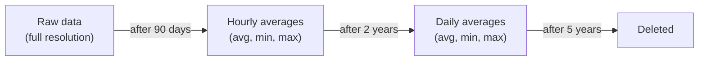
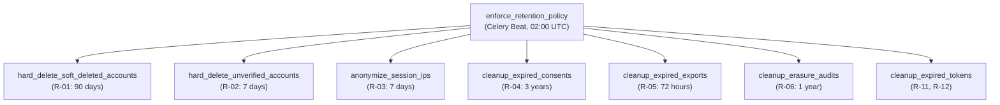
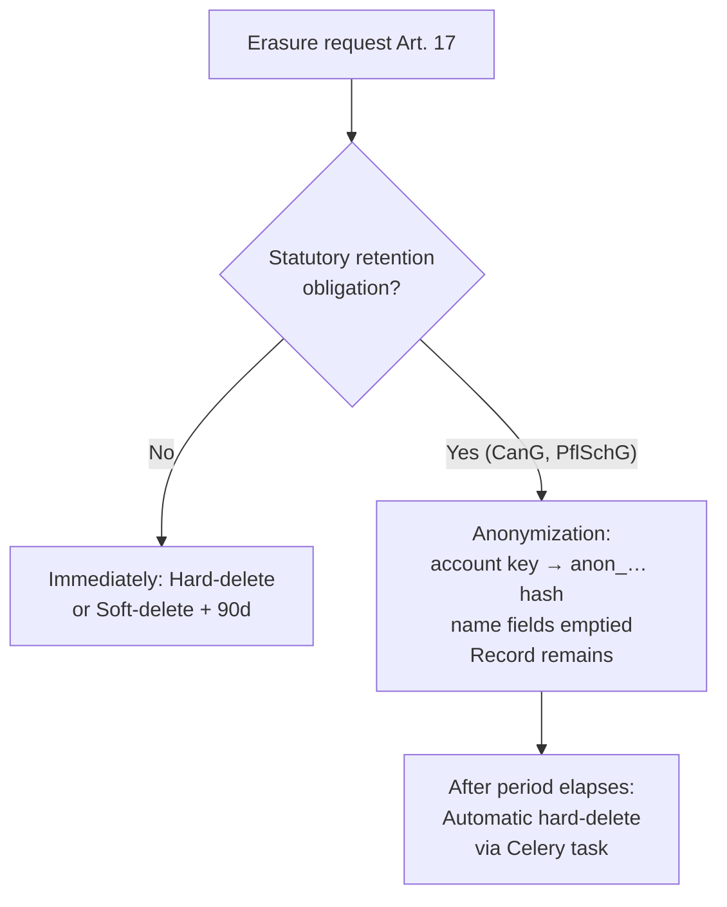

# Datenaufbewahrung & Anonymisierung

Kamerplanter speichert Daten nur so lange, wie es fachlich oder gesetzlich erforderlich
ist. Dieses Dokument beschreibt die Retention-Matrix, den automatischen Durchsetzungs-
Mechanismus (Celery-Task), die TimescaleDB-Aggregierung für Sensordaten und die
Konfigurierbarkeit per Umgebungsvariablen.

Grundlage: DSGVO Art. 5 Abs. 1 lit. e. <!-- NFR-011 -->

---

## Retention-Matrix — Personenbezogene Daten

| Ref | Datenkategorie | Frist | Aktion nach Frist | Rechtsgrundlage |
|-----|---------------|-------|-------------------|----------------|
| R-01 | Soft-gelöschte User-Accounts | 90 Tage nach Soft-Delete | Hard-Delete (inkl. Edges, Auth-Provider, Sessions) | Art. 17 DSGVO |
| R-02 | Unbestätigte Accounts | 7 Tage nach Erstellung | Hard-Delete | Art. 5(1)(e), Zweckentfall |
| R-03 | IP-Adressen in Sessions | 7 Tage nach Speicherung | Anonymisierung (IPv4: letztes Oktett → `0`) | Art. 5(1)(c) Datenminimierung |
| R-04 | Consent Records | 3 Jahre nach Widerruf | Hard-Delete | Art. 7(1) Nachweispflicht |
| R-05 | Export-Dateien (Art. 15/20 DSGVO) | 72 Stunden nach Fertigstellung | Datei zuerst löschen, danach Status auf `expired` | Zweckentfall |
| R-06 | Löschungs-Audit-Logs | 1 Jahr nach Abschluss | Hard-Delete | Art. 5(2) Rechenschaftspflicht |
| R-07 | E-Mail-Änderungsanfragen | 24 Stunden | Hard-Delete abgelaufener Tokens | Zweckentfall |
| R-11 | Abgelaufene Refresh Tokens | Sofort nach Ablauf | Hard-Delete (TTL-Index) | Zweckentfall |
| R-12 | Abgelaufene Einladungen | 30 Tage nach Ablauf | Hard-Delete | Zweckentfall |

### IP-Anonymisierung (R-03)

IP-Adressen werden nach 7 Tagen automatisch anonymisiert — nicht gelöscht, da sie
für die Erkennung kompromittierter Sessions noch benötigt werden können:

- **IPv4:** Letztes Oktett wird auf `0` gesetzt — `192.168.1.42` → `192.168.1.0`
- **IPv6:** Auf `/48`-Präfix gekürzt — `2001:db8:85a3::8a2e:370:7334` → `2001:db8:85a3::`

Das Feld `ip_anonymized_at` wird auf den Zeitpunkt der Anonymisierung gesetzt.

### Export-Dateien: erst die Datei, dann der Status (R-05)

Beim Ablauf eines Datenexports läuft die Bereinigung in einer festen Reihenfolge: Zuerst
wird die Export-Datei aus dem Objektspeicher gelöscht, erst danach wechselt der Export auf
den Status `expired`. Schlägt das Löschen der Datei fehl, bleibt der Export unverändert —
der nächste stündliche Lauf versucht es erneut. Downloads sind ohnehin schon ab dem
Ablauf der 72 Stunden gesperrt, unabhängig vom gespeicherten Status. Ist auf der Instanz
kein Objektspeicher konfiguriert, kann die Datei gar nicht gelöscht werden: Der Export
bleibt offen, und der Lauf protokolliert einen Fehler statt den Status trotzdem
umzustellen.

---

## Retention-Matrix — Sensordaten

Sensordaten können indirekt Rückschlüsse auf Anwesenheit und Verhalten von Personen
erlauben (CO2-Kurven, Bewegungssensoren, manuelle Overrides). Sie unterliegen daher
einer gestuften Retention-Policy in TimescaleDB:

<!-- diagram-source: user-described — tiered TimescaleDB sensor-data downsampling pipeline from raw to deletion -->

```mermaid
flowchart LR
    A["Raw data<br/>(full resolution)"]
    B["Hourly averages<br/>(avg, min, max)"]
    C["Daily averages<br/>(avg, min, max)"]
    D["Deleted"]

    A -- "after 90 days" --> B
    B -- "after 2 years" --> C
    C -- "after 5 years" --> D
```

| Stufe | Zeitraum | Auflösung | TimescaleDB View |
|-------|---------|-----------|-----------------|
| 1 — Rohdaten | 0–90 Tage | Volle Messauflösung | `sensor_readings` |
| 2 — Stundenmittel | 90 Tage–2 Jahre | 1 Wert pro Stunde | `sensor_hourly` |
| 3 — Tagesmittel | 2–5 Jahre | 1 Wert pro Tag | `sensor_daily` |
| Ablauf | Nach 5 Jahren | — | Automatisch gelöscht |

!!! note "Klimatische Extremereignisse bleiben dauerhaft erhalten"
    Frost, Hitzewellen und Sturmereignisse werden als `ClimateEvent`-Dokument in ArangoDB
    dauerhaft archiviert — ohne Personenbezug. Das ist relevant für mehrjährige Pflanzen
    (Obstbäume, Perennials), bei denen die Klimahistorie über Jahre benötigt wird.

### TimescaleDB Continuous Aggregates

Das automatische Downsampling erfolgt über TimescaleDB Continuous Aggregates und
Retention Policies:

```sql
-- Stufe 2: Stundenmittel (automatisch nach 90 Tagen)
CREATE MATERIALIZED VIEW sensor_hourly
  WITH (timescaledb.continuous) AS
  SELECT
    time_bucket('1 hour', timestamp) AS bucket,
    location_key,
    sensor_type,
    AVG(value)   AS avg_value,
    MIN(value)   AS min_value,
    MAX(value)   AS max_value,
    COUNT(*)     AS sample_count
  FROM sensor_readings
  GROUP BY bucket, location_key, sensor_type;

-- Stufe 3: Tagesmittel (automatisch nach 2 Jahren)
CREATE MATERIALIZED VIEW sensor_daily
  WITH (timescaledb.continuous) AS
  SELECT
    time_bucket('1 day', bucket) AS bucket,
    location_key,
    sensor_type,
    AVG(avg_value) AS avg_value,
    MIN(min_value) AS min_value,
    MAX(max_value) AS max_value,
    SUM(sample_count) AS sample_count
  FROM sensor_hourly
  GROUP BY time_bucket('1 day', bucket), location_key, sensor_type;

-- Retention Policies (automatisches Löschen)
SELECT add_retention_policy('sensor_readings', INTERVAL '90 days');
SELECT add_retention_policy('sensor_hourly',   INTERVAL '2 years');
SELECT add_retention_policy('sensor_daily',    INTERVAL '5 years');
```

---

## Gesetzliche Mindestaufbewahrungsfristen

Diese Daten dürfen **nicht** vor Ablauf der gesetzlichen Frist gelöscht werden.
Bei einer DSGVO-Löschanfrage (Art. 17) werden sie **anonymisiert** (User-Referenz entfernt),
aber nicht gelöscht (Art. 17 Abs. 3 lit. b):

| Ref | Datenkategorie | Mindestfrist | Rechtsgrundlage |
|-----|---------------|-------------|----------------|
| R-16 | Erntedaten (HarvestBatch, QualityAssessment, YieldMetric) | 5 Jahre | CanG (Cannabis-Gesetz) |
| R-17 | Behandlungsanwendungen (TreatmentApplication) | 3 Jahre | PflSchG §11 |
| R-18 | Inspektionsprotokolle | 3 Jahre | PflSchG §11 |

!!! danger "Löschsperre beachten"
    Einen aktiven Ernte- oder Behandlungsdatensatz zu löschen wäre ein Verstoß gegen
    das CanG bzw. PflSchG. Die Konto-Löschung löscht diese Datensätze deshalb nicht,
    sondern entfernt nur den Personenbezug. Der Datensatz selbst bleibt bis zum Ablauf
    der Frist erhalten.

### So sieht ein anonymisierter Datensatz aus

Die Kontenreferenz wird nicht auf `null` gesetzt, sondern ersetzt. Welche Form sie
bekommt, hängt davon ab, ob die Datensätze des gelöschten Kontos für die Prüfung
untereinander verknüpfbar bleiben müssen:

| Datensatz | Feld mit der Kontenreferenz | Wird ersetzt durch | Zusätzlich geleert |
|-----------|-----------------------------|--------------------|--------------------|
| Ernte (HarvestBatch) | `harvested_by_key` | Tombstone-Hash `anon_…` | `harvester` |
| Qualitätsbewertung (QualityAssessment) | `assessed_by_key` | Tombstone-Hash `anon_…` | `assessed_by` |
| Behandlung (TreatmentApplication) | `applied_by_key` | Tombstone-Hash `anon_…` | `applied_by` |
| Inspektion (Inspection) | `inspected_by_key` | Tombstone-Hash `anon_…` | `inspector` |
| Aufgabe (Task) | `assigned_to_user_key` | Markierung `_anonymized` | — |
| Tagebucheintrag (PlantDiaryEntry) | `created_by`, `analysis_requested_by`, `analysis_claimed_by` | Markierung `_anonymized` | — |
| Aufgaben-Kommentar | `created_by` | Markierung `_anonymized` | — |
| Einladung, die du verschickt hast | `invited_by_user_key` | Markierung `_anonymized` | — |
| Datei im Garten (Foto, Import-Datei) | `created_by` | Markierung `_anonymized` | — |
| Import-Auftrag | `uploaded_by` | Markierung `_anonymized` | — |
| Wetterquellen-Einstellung eines Standorts | `updated_by` | Markierung `_anonymized` | — |
| Manuelle Aktor-Übersteuerung | `created_by` | Markierung `_anonymized` | — |
| KI-Protokolleintrag | `user_key` | Markierung `_anonymized` | — |
| Schädlingsfoto, das du als Admin freigegeben hast | `promoted_by` | Markierung `_anonymized` | — |
| Garten, den du angelegt hast | `owner_user_key` | Markierung `_anonymized` | beim persönlichen Garten zusätzlich Name und Kurzname, siehe unten |
| Löschungs-Audit (ErasureRequest) | `user_key` | Tombstone-Hash `anon_…` | — |
| MCP-Protokolleintrag eines Dienstkontos | `service_account_key` | Tombstone-Hash `anon_…` | — |

- Der **Tombstone-Hash** hat die Form `anon_` plus 16 Hex-Zeichen. Er wird aus dem
  Kontoschlüssel und dem geheimen Salt `ERASURE_TOMBSTONE_SALT` gebildet, ist nicht
  umkehrbar und für dasselbe Konto immer gleich. So bleiben die Ernten, Behandlungen und
  Inspektionen eines gelöschten Kontos für eine Prüfung einander zuordenbar, ohne dass
  sie noch eine Person nennen.
- Die **Namensfelder** (`harvester`, `assessed_by`, `applied_by`, `inspector`) sind
  Freitext, den jemand beim Erfassen eingetippt hat. Ein Name ist für sich schon ein
  Personenbezug, deshalb werden sie im selben Schritt geleert.
- **Qualitätsbewertungen** gehören zur Erntedokumentation und werden seit dieser
  Änderung genauso anonymisiert wie die Ernte selbst. Sie erscheinen auch in deiner
  Datenauskunft (Art. 15 DSGVO).
- **Mengen- und Ertragsdaten** (YieldMetric) tragen keine Kontenreferenz. Es gibt dort
  nichts zu anonymisieren.

!!! warning "Ältere Datensätze ohne Kontenreferenz"
    Das Feld mit der Kontenreferenz gibt es für Ernten, Behandlungen, Inspektionen und
    Qualitätsbewertungen erst seit einer Migration. Datensätze, die vorher erfasst wurden,
    haben dort `null` und nur den eingetippten Namen. Das System rät den Besitzer nicht
    aus dem Freitext, deshalb erreicht die Konto-Löschung solche Altdatensätze nicht. Ihr
    Namensfeld bleibt, wie es eingegeben wurde.

### Was mit deinem persönlichen Garten passiert

Bei der Registrierung legt Kamerplanter einen persönlichen Garten für dich an. Sein
Name und sein Kurzname in der Adresse stammen aus deinem Anzeigenamen. Die
Konto-Löschung löscht diesen Garten nicht, denn er kann Datensätze mit gesetzlicher
Aufbewahrungsfrist enthalten, zum Beispiel Ernten nach CanG. Stattdessen nennt er dich
danach nicht mehr:

- Die Besitzer-Referenz wird durch `_anonymized` ersetzt.
- Name und Kurzname werden zu `anonymized-` und einer Zeichenfolge, die sich aus
  dem Schlüssel nicht zurückrechnen lässt. Der Kurzname bleibt dadurch eindeutig, und
  kein neuer Garten kann ihn vorher belegen: Kurznamen, die mit `anonymized`
  beginnen, vergibt Kamerplanter nicht.

Einen Gemeinschaftsgarten, den du gegründet hast, behält seinen Namen, denn der gehört
der Gruppe. Nur die Besitzer-Referenz wird ersetzt. Die Besitzer-Referenz verleiht
keine Rechte, die Rechte hängen an der Rolle in der Mitgliedschaft. Deshalb muss
nichts übertragen werden.

Ein KI-Tipp, den du ausgeblendet hast, bleibt für die anderen Mitglieder deines
Gartens ausgeblendet. Nur der Vermerk, dass du es warst, wird durch `_anonymized`
ersetzt.

Nie bestätigte Konten, die Kamerplanter nach Ablauf der Frist entfernt, durchlaufen
dieselbe vollständige Löschung wie jede andere Konto-Löschung — mit demselben
Löschungs-Antrag als Nachweis und derselben automatischen Wiederholung, falls dabei
ein Schritt fehlschlägt.

### Was zusätzlich gelöscht wird

Neben den bekannten Kategorien löscht die Konto-Löschung auch diese Datensätze, die
nur dir gehören und keiner Aufbewahrungsfrist unterliegen:

- deine Gespräche mit dem KI-Assistenten
- deine Benachrichtigungen und deine Benachrichtigungseinstellungen
- deine Kalender-Feeds: Der Feed-Link funktioniert nach der Löschung nicht mehr
- deine Diagnose-Anfragen für Pflanzenkrankheiten
- deine Standort-Zuweisungen in Gärten, in denen du Mitglied warst
- Einladungen, die du angenommen hast (sie nennen deine E-Mail-Adresse)
- die Dateieinträge deiner eigenen Schädlingsfotos — die Originaldatei und ihre Vorschaubilder (WebP, 128/512/1280 px) sind zu diesem Zeitpunkt schon gelöscht
- deine beigetragenen Referenzbild-Vektoren für die Bilderkennung (kuratierte Referenzen anderer Nutzer bleiben unberührt)
- deine beigetragenen Schädlingsbild-Vektoren für die Erkennung — unabhängig davon, ob dein Beitrag zum Zeitpunkt der Löschung noch freigegeben oder bereits zurückgenommen war

Ein Konto, das nie bestätigt wurde, deaktiviert der tägliche Aufräumlauf sofort und
löscht es auf demselben Weg. Dabei gehen jetzt auch die Mitgliedschaft und die
Standort-Zuweisungen mit. Schlägt dabei ein Schritt fehl, bleibt der Löschantrag offen
und wird — wie weiter unten beschrieben — automatisch mit Backoff wiederholt, statt
kommentarlos hängen zu bleiben. Der persönliche Garten eines solchen Kontos wird dabei
noch nicht anonymisiert.

!!! info "Was bewusst nicht angefasst wird"
    Einige Felder heißen zwar „… von“, enthalten aber Freitext, den jemand beim Erfassen
    eingetippt hat, zum Beispiel „durchgeführt von“ bei Gieß- und Tankprotokollen oder
    „erstellt von“ bei Workflow-Vorlagen. Das System ordnet solchen Freitext keinem
    Konto zu und ändert ihn bei der Löschung nicht.

### Protokolle der Löschung

Die Protokollzeilen einer Löschung nennen deine Kontokennung nicht. Sie tragen
stattdessen denselben Tombstone-Hash wie der Löschungs-Audit. So lassen sich die Zeilen
einer Löschung einander zuordnen, ohne dass sie eine Person nennen.

### Alle Löschwege tun dasselbe

Es spielt keine Rolle, ob ein Platform-Admin dein Konto über die Benutzerverwaltung
löscht, der tägliche Aufräumlauf ein nie bestätigtes Konto entfernt, oder ob du selbst
einen Löschantrag stellst: Alle drei Wege führen dieselbe Löschung aus, mit demselben
Löschungs-Antrag als Nachweis. Sie bereinigt Dateispeicher (Originale samt
Vorschaubildern) und Erkennungsbasis (nur deine eigenen Referenzbild- und
Schädlingsbild-Beiträge — kuratierte Referenzen bleiben), löscht deine übrigen
Datensätze, anonymisiert die aufbewahrungspflichtigen wie oben beschrieben und entfernt
zuletzt dein Konto. Der Datenbankteil läuft in einem Stück: Entweder ist er vollständig
erledigt oder gar nicht.

Der Unterschied liegt im Zeitpunkt: Deinen eigenen Antrag führt der tägliche Lauf erst
nach Ablauf der 90-tägigen Frist aus. Eine Löschung durch einen Platform-Admin oder durch
den Aufräumlauf für nie bestätigte Konten läuft dagegen sofort — dein Konto wird zuerst
deaktiviert und alle Sitzungen beendet, danach läuft die Löschung ohne Wartezeit. In allen
drei Fällen gilt: Danach steht der Antrag auf `completed` und trägt statt deiner
Kontokennung den Tombstone-Hash. Schlägt ein Lauf fehl, bleibt der Antrag als
`partially_completed` offen und wird automatisch mit Backoff wiederholt, bis er gelingt
(siehe unten). Solange ein Antrag offen ist, kannst du keinen zweiten stellen; ein
zweiter Löschversuch durch einen Platform-Admin stößt stattdessen sofort die Fortsetzung
des offenen Antrags an.

??? info "Für Betreiber: Wiederholungen und Log-Level"
    Jeder fehlgeschlagene Versuch wird am Antrag gezählt (`attempt_count`,
    `last_attempt_at`), und der nächste Versuch wartet 1, 2, 4 und danach höchstens
    7 Tage (`next_attempt_at`). Der Antrag bleibt dabei ausgewählt; der tägliche Lauf
    überspringt ihn bis dahin mit `retention.erasure.deferred` (Level info). Das Feld
    `origin` (`self_service`, `platform_admin` oder `unverified_cleanup`) hält fest, wer
    den Antrag ausgelöst hat; Versuchszähler, Backoff und Log-Level verhalten sich für
    alle drei gleich.
    Dateispeicher- und Referenzindex-Bereinigung laufen pro Antrag nur einmal: Sind sie
    erledigt (`pre_arango_completed_at`), wiederholt ein späterer Versuch nur noch den
    Datenbankteil.

    `retention.erasure.failed` bzw. `retention.erasure.steps_unreached` erscheinen auf
    Level error nur beim ersten Fehlschlag und beim fünften Versuch (`escalated=true`),
    dazwischen auf Level info. Die Zahl offener, fehlschlagender Anträge steht in jedem
    Lauf als `open_failing` im Event `retention.execute_scheduled_erasures.completed`.

    Fehlt `ERASURE_TOMBSTONE_SALT`, ist das ein Konfigurationsfehler: Jeder Lauf schreibt
    genau eine Zeile `retention.execute_scheduled_erasures.not_configured` auf Level
    error, verbraucht keinen Versuch und fasst keine Daten an. Nach der Korrektur laufen
    alle offenen Anträge beim nächsten täglichen Lauf.

    Fehlt `INFERENCE_SERVICE_ENABLED`/`INFERENCE_SERVICE_URL` **auf dem Celery-Worker**,
    während bereits Referenzbild-Beiträge auf dem Index liegen, ist das ebenfalls ein
    Konfigurationsfehler (Issue #1753) — allerdings nur für Anträge, die noch nicht bei
    Phase 0.5 (Referenzindex-Bereinigung) vorbei sind. Diese Anträge bleiben als
    `partially_completed` mit einer Betreiber-Meldung offen, kein Versuch wird verbraucht;
    der Lauf schreibt zusätzlich eine Zeile
    `retention.execute_scheduled_erasures.reference_index_not_configured` auf Level error.
    Details zur Konfiguration: [Bilderkennung in Betrieb nehmen](../deployment/inference-service.md).

    Dieselbe Prüfung trifft beigetragene Schädlingsbild-Vektoren (Issue #1759): Fehlen
    sowohl `PEST_DETECTION_ENABLED` als auch `INFERENCE_SERVICE_ENABLED` auf dem
    Celery-Worker, während jemals ein Schädlingsfoto-Beitrag zur Erkennungsbasis
    freigegeben wurde, hält der Worker die betroffenen Anträge auf dieselbe Weise und mit
    derselben Log-Zeile zurück. Eine Mandantenlöschung wird in diesem Fall mit HTTP 503
    abgelehnt statt Vektoren zurückzulassen; ist der Inferenz-Service nur vorübergehend
    nicht erreichbar, antwortet sie stattdessen mit HTTP 502 und lässt sich erneut
    anstoßen.

---

## Celery-Enforcement: Automatische Durchsetzung

Der Celery-Task `enforce_retention_policy` läuft **täglich um 02:00 UTC** und
orchestriert alle Retention-Sub-Tasks:

<!-- diagram-source: user-described — enforce_retention_policy Celery master task fanning out to retention sub-tasks -->

```mermaid
flowchart TD
    Master["enforce_retention_policy<br/>(Celery Beat, 02:00 UTC)"]

    Master --> T1["hard_delete_soft_deleted_accounts<br/>(R-01: 90 days)"]
    Master --> T2["hard_delete_unverified_accounts<br/>(R-02: 7 days)"]
    Master --> T3["anonymize_session_ips<br/>(R-03: 7 days)"]
    Master --> T4["cleanup_expired_consents<br/>(R-04: 3 years)"]
    Master --> T5["cleanup_expired_exports<br/>(R-05: 72 hours)"]
    Master --> T6["cleanup_erasure_audits<br/>(R-06: 1 year)"]
    Master --> T7["cleanup_expired_tokens<br/>(R-11, R-12)"]
```

Jeder Sub-Task protokolliert Anzahl der verarbeiteten Datensätze via structlog:

```json
{
  "event": "retention.run_completed",
  "results": {
    "hard_delete_soft_deleted_accounts": {"deleted_count": 3},
    "anonymize_session_ips": {"anonymized_count": 47},
    "cleanup_expired_exports": {"expired_count": 1}
  },
  "duration_ms": 1234
}
```

### Prometheus-Metriken

Der Retention-Task exponiert folgende Metriken:

| Metrik | Typ | Labels | Beschreibung |
|--------|-----|--------|-------------|
| `retention_records_processed_total` | Counter | `category`, `action` | Verarbeitete Datensätze pro Kategorie und Aktion (`delete`/`anonymize`/`expire`) |
| `retention_run_duration_seconds` | Histogram | — | Laufzeit des gesamten Retention-Runs |
| `retention_run_errors_total` | Counter | `category` | Fehler pro Kategorie |

---

## Konfiguration per Umgebungsvariablen

Alle Fristen sind über Umgebungsvariablen konfigurierbar. Das Präfix `RETENTION_`
wird vorausgestellt:

```bash
# Personenbezogene Daten
RETENTION_SOFT_DELETE_RETENTION_DAYS=90      # R-01: Soft-gelöschte Accounts
RETENTION_UNVERIFIED_ACCOUNT_DAYS=7          # R-02: Unbestätigte Accounts
RETENTION_IP_ANONYMIZATION_DAYS=7            # R-03: IP-Anonymisierung
RETENTION_CONSENT_RETENTION_YEARS=3          # R-04: Consent Records
RETENTION_EXPORT_FILE_RETENTION_HOURS=72     # R-05: Export-Dateien
RETENTION_ERASURE_AUDIT_RETENTION_YEARS=1    # R-06: Audit-Logs
RETENTION_EMAIL_CHANGE_RETENTION_HOURS=24    # R-07: E-Mail-Änderungsanfragen
RETENTION_INVITATION_RETENTION_DAYS=30       # R-12: Abgelaufene Einladungen

# Sensordaten (TimescaleDB)
RETENTION_SENSOR_RAW_RETENTION_DAYS=90       # R-14 Stufe 1
RETENTION_SENSOR_HOURLY_RETENTION_YEARS=2    # R-14 Stufe 2
RETENTION_SENSOR_DAILY_RETENTION_YEARS=5     # R-14 Stufe 3
RETENTION_ACTOR_LOG_RAW_RETENTION_DAYS=90    # R-15 Stufe 1
RETENTION_ACTOR_LOG_AGGREGATED_RETENTION_YEARS=1  # R-15 Stufe 2
```

!!! warning "Gesetzliche Mindestfristen sind nicht unterschreitbar"
    Die folgenden Werte können zwar per Umgebungsvariable erhöht, aber **nicht
    unterschritten** werden. Ein Validierungs-Check beim Start der Anwendung erzwingt
    die gesetzlichen Mindestfristen:

    ```bash
    RETENTION_HARVEST_DATA_MIN_RETENTION_YEARS=5   # R-16, CanG — MINIMUM
    RETENTION_TREATMENT_MIN_RETENTION_YEARS=3      # R-17, PflSchG — MINIMUM
    RETENTION_INSPECTION_MIN_RETENTION_YEARS=3     # R-18, PflSchG — MINIMUM
    ```

---

## Wechselwirkung mit DSGVO-Löschanfragen

Wenn ein Betroffener eine Löschanfrage nach Art. 17 DSGVO stellt, greift folgendes
Verfahren:

<!-- diagram-source: user-described — decision flow for a GDPR Art. 17 erasure request under statutory retention -->

```mermaid
flowchart TD
    A["Erasure request Art. 17"] --> B{"Statutory retention<br/>obligation?"}
    B -- "No" --> C["Immediately: Hard-delete<br/>or Soft-delete + 90d"]
    B -- "Yes (CanG, PflSchG)" --> D["Anonymization:<br/>account key → anon_… hash<br/>name fields emptied<br/>Record remains"]
    D --> E["After period elapses:<br/>Automatic hard-delete<br/>via Celery task"]
```

| Datenkategorie | Verfahren |
|---------------|-----------|
| User-Account | Soft-Delete → Hard-Delete nach 90 Tagen |
| Consent Records | Sofort löschen (Widerruf) |
| Export-Dateien | Sofort löschen |
| Erntedaten, Qualitätsbewertungen, Behandlungen, Inspektionen | Anonymisieren (Tombstone-Hash `anon_…`, Namensfelder geleert), nicht löschen (Art. 17 Abs. 3) |
| Aufgaben, Aufgaben-Kommentare, Tagebucheinträge, Dateien, Import-Aufträge, Einstellungen und Übersteuerungen in einem (ggf. gemeinsamen) Garten | Kontenreferenz durch `_anonymized` ersetzen, Inhalt bleibt |
| Gärten, die du angelegt hast | Besitzer-Referenz ersetzen; beim persönlichen Garten auch Name und Kurzname |
| Löschungs-Audit | Kontenreferenz durch den Tombstone-Hash ersetzen, 1 Jahr aufbewahren |
| Mitgliedschaften, Standort-Zuweisungen, Sitzungen, API-Schlüssel, Einwilligungen, Export-Anträge, Favoriten, Schädlingserkennungen, eigene Schädlingsfotos, KI-Gespräche, Benachrichtigungen, Kalender-Feeds, Diagnose-Anfragen, angenommene Einladungen | Löschen |

---

## Häufige Fragen

??? question "Kann ich die 90-Tage-Frist für Soft-Delete verlängern?"
    Ja, per `RETENTION_SOFT_DELETE_RETENTION_DAYS`. Eine Verkürzung unter 30 Tage
    wird nicht empfohlen, da Nutzer sonst keine Chance haben, irrtümlich gelöschte
    Accounts wiederherzustellen.

??? question "Was passiert mit Tenant-Daten wenn der letzte Admin eines Tenants gelöscht wird?"
    Der Celery-Task `detect_orphaned_tenants` erkennt Tenants ohne aktiven Admin und
    setzt einen `orphaned_since`-Timestamp. Ein Platform-Admin kann dann einen
    Notfall-Admin ernennen.

??? question "Wie kann ich prüfen, ob der Retention-Task korrekt läuft?"
    Prüfe die Prometheus-Metrik `retention_run_duration_seconds` oder
    schau in die strukturierten Logs (structlog) nach dem Event
    `retention.run_completed`. Im Kubernetes-Cluster: `kubectl logs -l app=celery-beat`.

??? question "Werden Sensordaten bei einer Konto-Löschung auch gelöscht?"
    Sensordaten in TimescaleDB haben keine direkte User-Referenz — sie sind einem
    Standort (`location_key`) zugeordnet. Bei Konto-Löschung bleiben Sensordaten
    erhalten und unterliegen nur den zeitbasierten Retention-Policies (R-14).

## Siehe auch

- [Umgebungsvariablen](../reference/environment-variables.md)
- [Datenbankschema](../reference/database-schema.md)
- [Kubernetes-Deployment](../deployment/kubernetes.md)
