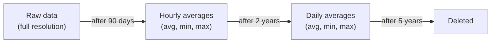
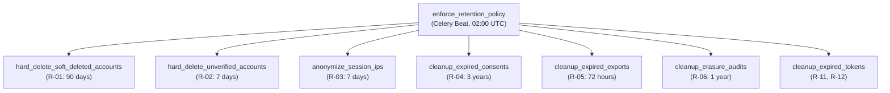
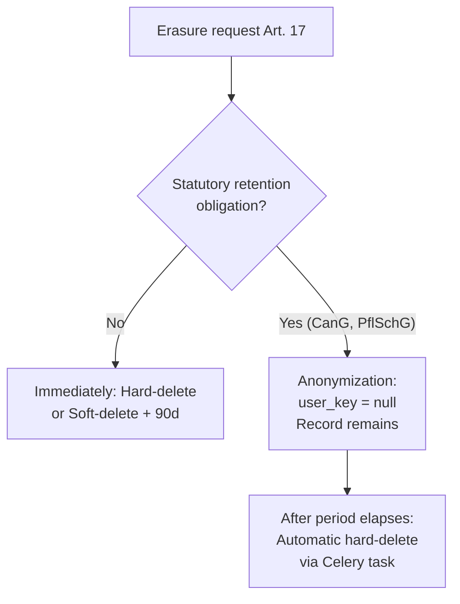

# Datenaufbewahrung & Anonymisierung

Kamerplanter speichert Daten nur so lange, wie es fachlich oder gesetzlich erforderlich
ist. Dieses Dokument beschreibt die Retention-Matrix, den automatischen Durchsetzungs-
Mechanismus (Celery-Task), die TimescaleDB-Aggregierung für Sensordaten und die
Konfigurierbarkeit per Umgebungsvariablen.

Grundlage: DSGVO Art. 5 Abs. 1 lit. e. <!-- NFR-011 -->

---

## Retention-Matrix — Personenbezogene Daten

| Ref | Datenkategorie | Frist | Aktion nach Frist | Rechtsgrundlage |
|-----|---------------|-------|-------------------|----------------|
| R-01 | Soft-gelöschte User-Accounts | 90 Tage nach Soft-Delete | Hard-Delete (inkl. Edges, Auth-Provider, Sessions) | Art. 17 DSGVO |
| R-02 | Unbestätigte Accounts | 7 Tage nach Erstellung | Hard-Delete | Art. 5(1)(e), Zweckentfall |
| R-03 | IP-Adressen in Sessions | 7 Tage nach Speicherung | Anonymisierung (IPv4: letztes Oktett → `0`) | Art. 5(1)(c) Datenminimierung |
| R-04 | Consent Records | 3 Jahre nach Widerruf | Hard-Delete | Art. 7(1) Nachweispflicht |
| R-05 | Export-Dateien (Art. 15/20 DSGVO) | 72 Stunden nach Fertigstellung | Datei löschen, Status auf `expired` | Zweckentfall |
| R-06 | Löschungs-Audit-Logs | 1 Jahr nach Abschluss | Hard-Delete | Art. 5(2) Rechenschaftspflicht |
| R-07 | E-Mail-Änderungsanfragen | 24 Stunden | Hard-Delete abgelaufener Tokens | Zweckentfall |
| R-11 | Abgelaufene Refresh Tokens | Sofort nach Ablauf | Hard-Delete (TTL-Index) | Zweckentfall |
| R-12 | Abgelaufene Einladungen | 30 Tage nach Ablauf | Hard-Delete | Zweckentfall |

### IP-Anonymisierung (R-03)

IP-Adressen werden nach 7 Tagen automatisch anonymisiert — nicht gelöscht, da sie
für die Erkennung kompromittierter Sessions noch benötigt werden können:

- **IPv4:** Letztes Oktett wird auf `0` gesetzt — `192.168.1.42` → `192.168.1.0`
- **IPv6:** Auf `/48`-Präfix gekürzt — `2001:db8:85a3::8a2e:370:7334` → `2001:db8:85a3::`

Das Feld `ip_anonymized_at` wird auf den Zeitpunkt der Anonymisierung gesetzt.

---

## Retention-Matrix — Sensordaten

Sensordaten können indirekt Rückschlüsse auf Anwesenheit und Verhalten von Personen
erlauben (CO2-Kurven, Bewegungssensoren, manuelle Overrides). Sie unterliegen daher
einer gestuften Retention-Policy in TimescaleDB:

<!-- diagram-source: user-described — tiered TimescaleDB sensor-data downsampling pipeline from raw to deletion -->

```mermaid
flowchart LR
    A["Raw data<br/>(full resolution)"]
    B["Hourly averages<br/>(avg, min, max)"]
    C["Daily averages<br/>(avg, min, max)"]
    D["Deleted"]

    A -- "after 90 days" --> B
    B -- "after 2 years" --> C
    C -- "after 5 years" --> D
```

| Stufe | Zeitraum | Auflösung | TimescaleDB View |
|-------|---------|-----------|-----------------|
| 1 — Rohdaten | 0–90 Tage | Volle Messauflösung | `sensor_readings` |
| 2 — Stundenmittel | 90 Tage–2 Jahre | 1 Wert pro Stunde | `sensor_hourly` |
| 3 — Tagesmittel | 2–5 Jahre | 1 Wert pro Tag | `sensor_daily` |
| Ablauf | Nach 5 Jahren | — | Automatisch gelöscht |

!!! note "Klimatische Extremereignisse bleiben dauerhaft erhalten"
    Frost, Hitzewellen und Sturmereignisse werden als `ClimateEvent`-Dokument in ArangoDB
    dauerhaft archiviert — ohne Personenbezug. Das ist relevant für mehrjährige Pflanzen
    (Obstbäume, Perennials), bei denen die Klimahistorie über Jahre benötigt wird.

### TimescaleDB Continuous Aggregates

Das automatische Downsampling erfolgt über TimescaleDB Continuous Aggregates und
Retention Policies:

```sql
-- Stufe 2: Stundenmittel (automatisch nach 90 Tagen)
CREATE MATERIALIZED VIEW sensor_hourly
  WITH (timescaledb.continuous) AS
  SELECT
    time_bucket('1 hour', timestamp) AS bucket,
    location_key,
    sensor_type,
    AVG(value)   AS avg_value,
    MIN(value)   AS min_value,
    MAX(value)   AS max_value,
    COUNT(*)     AS sample_count
  FROM sensor_readings
  GROUP BY bucket, location_key, sensor_type;

-- Stufe 3: Tagesmittel (automatisch nach 2 Jahren)
CREATE MATERIALIZED VIEW sensor_daily
  WITH (timescaledb.continuous) AS
  SELECT
    time_bucket('1 day', bucket) AS bucket,
    location_key,
    sensor_type,
    AVG(avg_value) AS avg_value,
    MIN(min_value) AS min_value,
    MAX(max_value) AS max_value,
    SUM(sample_count) AS sample_count
  FROM sensor_hourly
  GROUP BY time_bucket('1 day', bucket), location_key, sensor_type;

-- Retention Policies (automatisches Löschen)
SELECT add_retention_policy('sensor_readings', INTERVAL '90 days');
SELECT add_retention_policy('sensor_hourly',   INTERVAL '2 years');
SELECT add_retention_policy('sensor_daily',    INTERVAL '5 years');
```

---

## Gesetzliche Mindestaufbewahrungsfristen

Diese Daten dürfen **nicht** vor Ablauf der gesetzlichen Frist gelöscht werden.
Bei einer DSGVO-Löschanfrage (Art. 17) werden sie **anonymisiert** (User-Referenz entfernt),
aber nicht gelöscht (Art. 17 Abs. 3 lit. b):

| Ref | Datenkategorie | Mindestfrist | Rechtsgrundlage |
|-----|---------------|-------------|----------------|
| R-16 | Erntedaten (HarvestBatch, QualityAssessment, YieldMetric) | 5 Jahre | CanG (Cannabis-Gesetz) |
| R-17 | Behandlungsanwendungen (TreatmentApplication) | 3 Jahre | PflSchG §11 |
| R-18 | Inspektionsprotokolle | 3 Jahre | PflSchG §11 |

!!! danger "Löschsperre beachten"
    Einen aktiven Ernte- oder Behandlungsdatensatz zu löschen wäre ein Verstoß gegen
    das CanG bzw. PflSchG. Das System verhindert dies technisch — bei einer Löschanfrage
    wird die User-Referenz (`user_key`) auf `null` gesetzt, der Datensatz selbst bleibt
    bis zum Ablauf der Frist erhalten.

---

## Celery-Enforcement: Automatische Durchsetzung

Der Celery-Task `enforce_retention_policy` läuft **täglich um 02:00 UTC** und
orchestriert alle Retention-Sub-Tasks:

<!-- diagram-source: user-described — enforce_retention_policy Celery master task fanning out to retention sub-tasks -->

```mermaid
flowchart TD
    Master["enforce_retention_policy<br/>(Celery Beat, 02:00 UTC)"]

    Master --> T1["hard_delete_soft_deleted_accounts<br/>(R-01: 90 days)"]
    Master --> T2["hard_delete_unverified_accounts<br/>(R-02: 7 days)"]
    Master --> T3["anonymize_session_ips<br/>(R-03: 7 days)"]
    Master --> T4["cleanup_expired_consents<br/>(R-04: 3 years)"]
    Master --> T5["cleanup_expired_exports<br/>(R-05: 72 hours)"]
    Master --> T6["cleanup_erasure_audits<br/>(R-06: 1 year)"]
    Master --> T7["cleanup_expired_tokens<br/>(R-11, R-12)"]
```

Jeder Sub-Task protokolliert Anzahl der verarbeiteten Datensätze via structlog:

```json
{
  "event": "retention.run_completed",
  "results": {
    "hard_delete_soft_deleted_accounts": {"deleted_count": 3},
    "anonymize_session_ips": {"anonymized_count": 47},
    "cleanup_expired_exports": {"expired_count": 1}
  },
  "duration_ms": 1234
}
```

### Prometheus-Metriken

Der Retention-Task exponiert folgende Metriken:

| Metrik | Typ | Labels | Beschreibung |
|--------|-----|--------|-------------|
| `retention_records_processed_total` | Counter | `category`, `action` | Verarbeitete Datensätze pro Kategorie und Aktion (`delete`/`anonymize`/`expire`) |
| `retention_run_duration_seconds` | Histogram | — | Laufzeit des gesamten Retention-Runs |
| `retention_run_errors_total` | Counter | `category` | Fehler pro Kategorie |

---

## Konfiguration per Umgebungsvariablen

Alle Fristen sind über Umgebungsvariablen konfigurierbar. Das Präfix `RETENTION_`
wird vorausgestellt:

```bash
# Personenbezogene Daten
RETENTION_SOFT_DELETE_RETENTION_DAYS=90      # R-01: Soft-gelöschte Accounts
RETENTION_UNVERIFIED_ACCOUNT_DAYS=7          # R-02: Unbestätigte Accounts
RETENTION_IP_ANONYMIZATION_DAYS=7            # R-03: IP-Anonymisierung
RETENTION_CONSENT_RETENTION_YEARS=3          # R-04: Consent Records
RETENTION_EXPORT_FILE_RETENTION_HOURS=72     # R-05: Export-Dateien
RETENTION_ERASURE_AUDIT_RETENTION_YEARS=1    # R-06: Audit-Logs
RETENTION_EMAIL_CHANGE_RETENTION_HOURS=24    # R-07: E-Mail-Änderungsanfragen
RETENTION_INVITATION_RETENTION_DAYS=30       # R-12: Abgelaufene Einladungen

# Sensordaten (TimescaleDB)
RETENTION_SENSOR_RAW_RETENTION_DAYS=90       # R-14 Stufe 1
RETENTION_SENSOR_HOURLY_RETENTION_YEARS=2    # R-14 Stufe 2
RETENTION_SENSOR_DAILY_RETENTION_YEARS=5     # R-14 Stufe 3
RETENTION_ACTOR_LOG_RAW_RETENTION_DAYS=90    # R-15 Stufe 1
RETENTION_ACTOR_LOG_AGGREGATED_RETENTION_YEARS=1  # R-15 Stufe 2
```

!!! warning "Gesetzliche Mindestfristen sind nicht unterschreitbar"
    Die folgenden Werte können zwar per Umgebungsvariable erhöht, aber **nicht
    unterschritten** werden. Ein Validierungs-Check beim Start der Anwendung erzwingt
    die gesetzlichen Mindestfristen:

    ```bash
    RETENTION_HARVEST_DATA_MIN_RETENTION_YEARS=5   # R-16, CanG — MINIMUM
    RETENTION_TREATMENT_MIN_RETENTION_YEARS=3      # R-17, PflSchG — MINIMUM
    RETENTION_INSPECTION_MIN_RETENTION_YEARS=3     # R-18, PflSchG — MINIMUM
    ```

---

## Wechselwirkung mit DSGVO-Löschanfragen

Wenn ein Betroffener eine Löschanfrage nach Art. 17 DSGVO stellt, greift folgendes
Verfahren:

<!-- diagram-source: user-described — decision flow for a GDPR Art. 17 erasure request under statutory retention -->

```mermaid
flowchart TD
    A["Erasure request Art. 17"] --> B{"Statutory retention<br/>obligation?"}
    B -- "No" --> C["Immediately: Hard-delete<br/>or Soft-delete + 90d"]
    B -- "Yes (CanG, PflSchG)" --> D["Anonymization:<br/>user_key = null<br/>Record remains"]
    D --> E["After period elapses:<br/>Automatic hard-delete<br/>via Celery task"]
```

| Datenkategorie | Verfahren |
|---------------|-----------|
| User-Account | Soft-Delete → Hard-Delete nach 90 Tagen |
| Consent Records | Sofort löschen (Widerruf) |
| Export-Dateien | Sofort löschen |
| Erntedaten, Behandlungen, Inspektionen | Anonymisieren, nicht löschen (Art. 17 Abs. 3) |
| Shared Tenant-Daten (Pins, Einkaufslisten) | User-Referenz anonymisieren, Inhalt bleibt |

---

## Häufige Fragen

??? question "Kann ich die 90-Tage-Frist für Soft-Delete verlängern?"
    Ja, per `RETENTION_SOFT_DELETE_RETENTION_DAYS`. Eine Verkürzung unter 30 Tage
    wird nicht empfohlen, da Nutzer sonst keine Chance haben, irrtümlich gelöschte
    Accounts wiederherzustellen.

??? question "Was passiert mit Tenant-Daten wenn der letzte Admin eines Tenants gelöscht wird?"
    Der Celery-Task `detect_orphaned_tenants` erkennt Tenants ohne aktiven Admin und
    setzt einen `orphaned_since`-Timestamp. Ein Platform-Admin kann dann einen
    Notfall-Admin ernennen.

??? question "Wie kann ich prüfen, ob der Retention-Task korrekt läuft?"
    Prüfe die Prometheus-Metrik `retention_run_duration_seconds` oder
    schau in die strukturierten Logs (structlog) nach dem Event
    `retention.run_completed`. Im Kubernetes-Cluster: `kubectl logs -l app=celery-beat`.

??? question "Werden Sensordaten bei einer Konto-Löschung auch gelöscht?"
    Sensordaten in TimescaleDB haben keine direkte User-Referenz — sie sind einem
    Standort (`location_key`) zugeordnet. Bei Konto-Löschung bleiben Sensordaten
    erhalten und unterliegen nur den zeitbasierten Retention-Policies (R-14).

## Siehe auch

- [Umgebungsvariablen](../reference/environment-variables.md)
- [Datenbankschema](../reference/database-schema.md)
- [Kubernetes-Deployment](../deployment/kubernetes.md)
