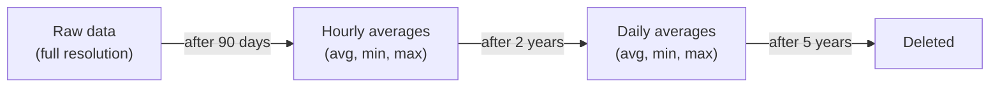
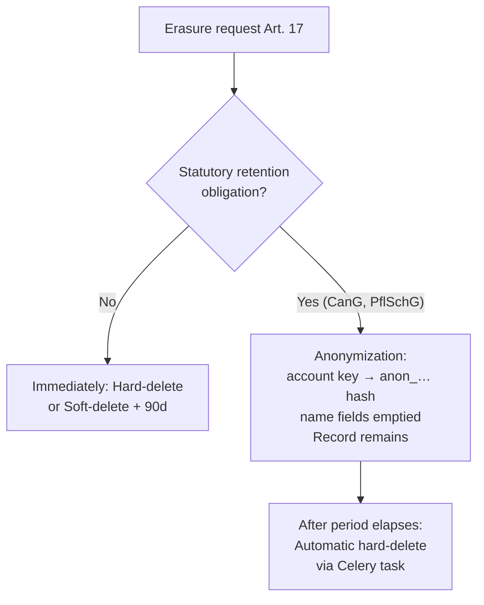

# Datenaufbewahrung & Anonymisierung

Kamerplanter speichert Daten nur so lange, wie es fachlich oder gesetzlich erforderlich
ist. Dieses Dokument beschreibt die Retention-Matrix, den automatischen Durchsetzungs-
Mechanismus (Celery-Task), die TimescaleDB-Aggregierung für Sensordaten und die
Konfigurierbarkeit per Umgebungsvariablen.

Grundlage: DSGVO Art. 5 Abs. 1 lit. e. <!-- NFR-011 -->

---

## Retention-Matrix — Personenbezogene Daten

| Ref | Datenkategorie | Frist | Aktion nach Frist | Rechtsgrundlage |
|-----|---------------|-------|-------------------|----------------|
| R-01 | Soft-gelöschte User-Accounts | 90 Tage nach Soft-Delete | Hard-Delete (inkl. Edges, Auth-Provider, Sessions) | Art. 17 DSGVO |
| R-02 | Unbestätigte Accounts | 7 Tage nach Erstellung | Hard-Delete (`app.tasks.auth_tasks.cleanup_unverified_accounts`, täglich) | Art. 5(1)(e), Zweckentfall |
| R-03 | IP-Adressen in Sessions | 7 Tage nach Speicherung | Anonymisierung (IPv4: letztes Oktett → `0`) | Art. 5(1)(c) Datenminimierung |
| R-04 | Consent Records | 3 Jahre nach Widerruf | Hard-Delete (`retention.purge_expired_consent_records`, täglich 04:35 UTC); die IP-Adresse wird nach 7 Tagen anonymisiert (R-04a, `retention.anonymize_consent_ips`, 04:40 UTC) | Art. 7(1) Nachweispflicht |
| R-05 | Export-Dateien (Art. 15/20 DSGVO) | 72 Stunden nach Fertigstellung | Datei zuerst löschen, danach Status auf `expired` | Zweckentfall |
| R-06 | Löschungs-Audit (abgeschlossene Anträge) | 3 Jahre nach Abschluss | Hard-Delete (`retention.purge_expired_erasure_records`, täglich 04:30 UTC) | Art. 5(2) Rechenschaftspflicht |
| R-07 | E-Mail-Änderungsanfragen | 24 Stunden nach Erstellung | Status auf `expired` setzen und denselben Datensatz im selben Lauf hart löschen | Zweckentfall |
| R-07a | Rückgängig-Fenster einer bestätigten E-Mail-Änderung | 7 Tage nach der Bestätigung | `previous_email`, Hash des Rückgängig-Tokens und dessen Ablaufzeitpunkt nullen | Zweckentfall — der Rückgängig-Link ist abgelaufen |
| R-11 | Abgelaufene Refresh Tokens | Sofort nach Ablauf | Hard-Delete (TTL-Index) | Zweckentfall |
| R-12 | Abgelaufene Einladungen | 30 Tage nach Ablauf | Status auf `expired` setzen, nach 30 Tagen Hard-Delete (`app.tasks.tenant_tasks.cleanup_expired_invitations`, täglich 02:00 UTC) | Zweckentfall |

Jede Frist außer R-11 wird über genau eine Einstellung gelesen (siehe
[Umgebungsvariablen](../reference/environment-variables.md#datenschutz-dsgvo-req-025-nfr-011)
für die genauen Namen). Für R-01, R-05 und R-07 gab es bis zu dieser Änderung bereits
dokumentierte, ältere Variablennamen, die aber nichts bewirkten — der Code nutzte feste
Werte. Diese älteren Namen funktionieren jetzt tatsächlich und bleiben zusätzlich als
Alias gültig. Jeder Fristvergleich vergleicht dabei Zeitpunkte statt Zeichenketten, damit
ein Datensatz nicht durch eine abweichende Zeitstempel-Schreibweise zu früh oder zu spät
erfasst wird.

### Unbestätigte Accounts (R-02)

Ein Konto, dessen E-Mail-Adresse nie bestätigt wurde, entfernt der tägliche Task
`app.tasks.auth_tasks.cleanup_unverified_accounts` automatisch — `RETENTION_UNVERIFIED_ACCOUNT_DAYS`
Tage nach der Registrierung (Standard 7 Tage, Minimum 1 Tag). Der Task führt dafür dieselbe
vollständige Löschung aus wie ein selbst gestellter Löschantrag, mit demselben Löschungs-Antrag
als Nachweis und derselben automatischen Wiederholung bei einem fehlgeschlagenen Schritt — mehr
dazu weiter unten unter „Alle Löschwege tun dasselbe".

Der Task wählt nur Konten, die nie bestätigt, nie von einem Administrator herabgestuft und nie
angemeldet waren und die **keine Anbieterzeile** haben. Wer sich lokal registriert hat, hat eine
`LOCAL`-Anbieterzeile und wird daher noch **nicht** erfasst. Diese Konten löscht der Task
nicht, sondern **zählt** sie bei jedem Lauf (`local_registrations_pending` im Ergebnis und die
Warnzeile `unverified_local_registrations_pending`). Erst wenn du die Zahl gesehen hast, schaltest
du die Löschung mit `RETENTION_UNVERIFIED_LOCAL_REAP_ENABLED=true` frei; danach zählen nur noch
föderierte Anbieterzeilen (Google, GitHub, Apple, OIDC) als „verknüpft", und Servicekonten bleiben
ausgenommen. Schlägt das Zählen fehl, bleibt der Task beim engen Selektor.

### IP-Anonymisierung (R-03)

IP-Adressen werden `RETENTION_IP_ANONYMIZATION_DAYS` Tage nach der Ausstellung der
Session automatisch anonymisiert (Standard 7 Tage, Minimum 1 Tag) — nicht gelöscht, da
sie für die Erkennung kompromittierter Sessions noch benötigt werden können:

- **IPv4:** Letztes Oktett wird auf `0` gesetzt — `192.168.1.42` → `192.168.1.0`
- **IPv6:** Auf `/48`-Präfix gekürzt — `2001:db8:85a3::8a2e:370:7334` → `2001:db8:85a3::`

Das Feld `ip_anonymized_at` wird auf den Zeitpunkt der Anonymisierung gesetzt. Das
betrifft ausschließlich die IP-Adresse einer Session — die IP-Adresse, die zu einem
Consent Record gehört (siehe R-04 oben), wird davon nicht erfasst.

### Export-Dateien: erst die Datei, dann der Status (R-05)

Die Frist ist über `RETENTION_EXPORT_FILE_RETENTION_HOURS` konfigurierbar (Standard
72 Stunden, Minimum 1 Stunde; der ältere Name `PRIVACY_EXPORT_RETENTION_HOURS` bleibt
als Alias gültig). Beim Ablauf eines Datenexports läuft die Bereinigung in einer festen
Reihenfolge: Zuerst wird die Export-Datei aus dem Objektspeicher gelöscht, erst danach
wechselt der Export auf den Status `expired`. Schlägt das Löschen der Datei fehl, bleibt
der Export unverändert —
der nächste stündliche Lauf versucht es erneut. Downloads sind ohnehin schon ab dem
Ablauf der 72 Stunden gesperrt, unabhängig vom gespeicherten Status. Ist auf der Instanz
kein Objektspeicher konfiguriert, kann die Datei gar nicht gelöscht werden: Der Export
bleibt offen, und der Lauf protokolliert einen Fehler statt den Status trotzdem
umzustellen.

### Löschungs-Audit-Bereinigung (R-06)

Der tägliche Task `retention.purge_expired_erasure_records` (04:30 UTC, nach dem
Löschungs-Task um 04:00 UTC) entfernt abgeschlossene Löschungs-Anträge
(`erasure_requests`, `status=completed`), deren `completed_at` mehr als
`RETENTION_ERASURE_AUDIT_RETENTION_YEARS` Jahre zurückliegt (Standard 3 Jahre, Minimum
1 Jahr, Maximum 3 Jahre, gezählt in Kalenderjahren). Das gilt unabhängig davon, wer die Löschung
ausgelöst hat (`origin`: `self_service`, `platform_admin` oder `unverified_cleanup`).

Ein noch offener oder nur teilweise abgeschlossener Antrag (`scheduled`, `in_progress`,
`partially_completed`) wird nie entfernt — er ist noch einen Lauf schuldig. Ein
abgeschlossener Antrag ohne `completed_at` bleibt ebenfalls erhalten. Der Lauf
protokolliert nur die Anzahl der entfernten Anträge, nie eine Konto- oder Antragskennung.

### E-Mail-Änderungsanfragen (R-07)

Der stündliche Task `retention.expire_email_change_requests` (Minute 15) setzt eine noch
unbestätigte E-Mail-Änderungsanfrage `RETENTION_EMAIL_CHANGE_RETENTION_HOURS` Stunden nach
der Anfrage (Standard 24 Stunden, Minimum 1 Stunde; der ältere Name
`PRIVACY_EMAIL_CHANGE_TTL_HOURS` bleibt als Alias gültig) auf den Status `expired` und
löscht sie im selben Lauf hart; die neue Adresse bleibt also nicht liegen.

### Rückgängig-Fenster einer bestätigten E-Mail-Änderung (R-07a)

Bestätigt sich eine E-Mail-Änderung, erhält die **vorherige** Adresse einen einmalig
nutzbaren Rückgängig-Link (siehe [Datenschutz — E-Mail-Adresse ändern](../user-guide/privacy.md#e-mail-adresse-andern-art-16-dsgvo)).
Dafür merkt sich der Datensatz drei zusätzliche Felder: `previous_email`, den Hash des
Rückgängig-Tokens (`revert_token_hash`) und dessen Ablaufzeitpunkt (`revert_expires_at`),
gesetzt auf den Bestätigungszeitpunkt plus `RETENTION_EMAIL_CHANGE_REVERT_DAYS` (Standard
7 Tage, Minimum 1 Tag).

Derselbe stündliche Task wie bei R-07 (`retention.expire_email_change_requests`, Minute
15) schließt das Fenster in demselben Lauf: Er nullt bei jedem Datensatz, dessen
`revert_token_hash` gesetzt und dessen `revert_expires_at` erreicht oder nicht lesbar ist,
alle drei Felder — konservativ, ein Datensatz mit unlesbarem Ablaufzeitpunkt gilt also als
abgelaufen. Der Rückgängig-Link funktioniert danach nicht mehr; das Restdokument
(`new_email`, Zeitstempel) löscht derselbe Lauf als R-07b hart, sobald das gespeicherte
`revert_expires_at` abgelaufen ist.

---

## Retention-Matrix — Sensordaten

Sensordaten können indirekt Rückschlüsse auf Anwesenheit und Verhalten von Personen
erlauben (CO2-Kurven, Bewegungssensoren, manuelle Overrides). Sie unterliegen daher
einer gestuften Retention-Policy in TimescaleDB:

<!-- diagram-source: user-described — tiered TimescaleDB sensor-data downsampling pipeline from raw to deletion -->

```mermaid
flowchart LR
    A["Raw data<br/>(full resolution)"]
    B["Hourly averages<br/>(avg, min, max)"]
    C["Daily averages<br/>(avg, min, max)"]
    D["Deleted"]

    A -- "after 90 days" --> B
    B -- "after 2 years" --> C
    C -- "after 5 years" --> D
```

| Stufe | Zeitraum | Auflösung | TimescaleDB View |
|-------|---------|-----------|-----------------|
| 1 — Rohdaten | 0–90 Tage | Volle Messauflösung | `sensor_readings` |
| 2 — Stundenmittel | 90 Tage–2 Jahre | 1 Wert pro Stunde | `sensor_hourly` |
| 3 — Tagesmittel | 2–5 Jahre | 1 Wert pro Tag | `sensor_daily` |
| Ablauf | Nach 5 Jahren | — | Automatisch gelöscht |

!!! note "Klimatische Extremereignisse bleiben dauerhaft erhalten"
    Frost, Hitzewellen und Sturmereignisse werden als `ClimateEvent`-Dokument in ArangoDB
    dauerhaft archiviert — ohne Personenbezug. Das ist relevant für mehrjährige Pflanzen
    (Obstbäume, Perennials), bei denen die Klimahistorie über Jahre benötigt wird.

### TimescaleDB Continuous Aggregates

Das automatische Downsampling erfolgt über TimescaleDB Continuous Aggregates und
Retention Policies:

```sql
-- Stufe 2: Stundenmittel (automatisch nach 90 Tagen)
CREATE MATERIALIZED VIEW sensor_hourly
  WITH (timescaledb.continuous) AS
  SELECT
    time_bucket('1 hour', timestamp) AS bucket,
    location_key,
    sensor_type,
    AVG(value)   AS avg_value,
    MIN(value)   AS min_value,
    MAX(value)   AS max_value,
    COUNT(*)     AS sample_count
  FROM sensor_readings
  GROUP BY bucket, location_key, sensor_type;

-- Stufe 3: Tagesmittel (automatisch nach 2 Jahren)
CREATE MATERIALIZED VIEW sensor_daily
  WITH (timescaledb.continuous) AS
  SELECT
    time_bucket('1 day', bucket) AS bucket,
    location_key,
    sensor_type,
    AVG(avg_value) AS avg_value,
    MIN(min_value) AS min_value,
    MAX(max_value) AS max_value,
    SUM(sample_count) AS sample_count
  FROM sensor_hourly
  GROUP BY time_bucket('1 day', bucket), location_key, sensor_type;

-- Retention Policies (automatisches Löschen)
SELECT add_retention_policy('sensor_readings', INTERVAL '90 days');
SELECT add_retention_policy('sensor_hourly',   INTERVAL '2 years');
SELECT add_retention_policy('sensor_daily',    INTERVAL '5 years');
```

!!! info "Löschung von Sensor oder Mandant"
    Wird ein Sensor oder ein ganzer Mandant gelöscht, entfernt Kamerplanter neben den
    Rohdaten auch die zugehörigen Stunden- und Tagesmittel (`sensor_hourly`,
    `sensor_daily`) — in jedem Alter, im selben Löschvorgang. Die Mittelwerte anderer
    Mandanten und Sensoren bleiben unverändert erhalten. Eine Messung, die erst nach dem
    Löschen eintrifft (etwa von einem Gerät, das noch sendet), wird abgewiesen und legt
    keine neue Zeitreihe an.

---

## Gesetzliche Mindestaufbewahrungsfristen

Diese Daten dürfen **nicht** vor Ablauf der gesetzlichen Frist gelöscht werden.
Bei einer DSGVO-Löschanfrage (Art. 17) werden sie **anonymisiert** (User-Referenz entfernt),
aber nicht gelöscht (Art. 17 Abs. 3 lit. b):

| Ref | Datenkategorie | Mindestfrist | Rechtsgrundlage |
|-----|---------------|-------------|----------------|
| R-16 | Erntedaten (HarvestBatch, QualityAssessment, YieldMetric) | 5 Jahre | CanG (Cannabis-Gesetz) |
| R-17 | Behandlungsanwendungen (TreatmentApplication) | 3 Jahre | PflSchG §11 |
| R-18 | Inspektionsprotokolle | 3 Jahre | PflSchG §11 |

!!! danger "Löschsperre beachten"
    Einen aktiven Ernte- oder Behandlungsdatensatz zu löschen wäre ein Verstoß gegen
    das CanG bzw. PflSchG. Die Konto-Löschung löscht diese Datensätze deshalb nicht,
    sondern entfernt nur den Personenbezug. Der Datensatz selbst bleibt bis zum Ablauf
    der Frist erhalten.

### Ablauf der Frist nach einer Mandantenlöschung

Die Frist zählt ab dem Datum, das der Datensatz selbst trägt — `harvest_date` (Ernte),
`applied_at` (Behandlung), `inspected_at` (Inspektion) — und läuft unverändert weiter,
wenn der Mandant oder dein Konto in der Zwischenzeit gelöscht wird. Sie beginnt durch
die Löschung weder neu, noch wird sie verkürzt.

Ist sie abgelaufen, löscht der tägliche Task `retention.purge_expired_legal_retention_rows`
(04:45 UTC) den Datensatz endgültig: zusammen mit seinen Qualitätsbewertungen und
Ertragskennzahlen (bei einer Ernte) und jeder Verknüpfung, die ihn noch berührt —
bei Behandlungen auch die geerbten Karenz-Verknüpfungen auf Pflanzen und Durchläufe.

Gelöscht werden nur Datensätze, deren Mandant nicht mehr existiert. Die Ernten,
Behandlungen und Inspektionen eines bestehenden Gartens sind dessen eigene Aufzeichnungen;
für sie legt diese Regel keine Höchstdauer fest, sie bleiben erhalten.

Ein Datensatz ohne lesbares Datum wird nie gelöscht — sein Alter ist nicht belegt. Ausnahme: Eine Ernte ohne Erntedatum zählt ab ihrer Anlage, denn genau dieses Datum hat das System beim Anlegen als Erntedatum angenommen.

!!! info "Erster Lauf nach dem Update"
    Der erste Lauf löscht sofort alle aufbewahrten Datensätze gelöschter Mandanten,
    deren Frist bereits abgelaufen ist — auch solche, die eine Mandantenlöschung vor
    der Einführung des Löschinventars zurückgelassen hat.

### So sieht ein anonymisierter Datensatz aus

Die Kontenreferenz wird nicht auf `null` gesetzt, sondern ersetzt. Welche Form sie
bekommt, hängt davon ab, ob die Datensätze des gelöschten Kontos für die Prüfung
untereinander verknüpfbar bleiben müssen:

| Datensatz | Feld mit der Kontenreferenz | Wird ersetzt durch | Zusätzlich geleert |
|-----------|-----------------------------|--------------------|--------------------|
| Ernte (HarvestBatch) | `harvested_by_key` | Tombstone-Hash `anon_…` | `harvester` |
| Qualitätsbewertung (QualityAssessment) | `assessed_by_key` | Tombstone-Hash `anon_…` | `assessed_by` |
| Behandlung (TreatmentApplication) | `applied_by_key` | Tombstone-Hash `anon_…` | `applied_by` |
| Inspektion (Inspection) | `inspected_by_key` | Tombstone-Hash `anon_…` | `inspector` |
| Aufgabe (Task) | `assigned_to_user_key` | Markierung `_anonymized` | — |
| Tagebucheintrag (PlantDiaryEntry) | `created_by`, `analysis_requested_by`, `analysis_claimed_by` | Markierung `_anonymized` | — |
| Aufgaben-Kommentar | `created_by` | Markierung `_anonymized` | — |
| Einladung, die du verschickt hast | `invited_by_user_key` | Markierung `_anonymized` | — |
| Datei im Garten (Foto, Import-Datei) | `created_by` | Markierung `_anonymized` | — |
| Import-Auftrag | `uploaded_by` | Markierung `_anonymized` | — |
| Wetterquellen-Einstellung eines Standorts | `updated_by` | Markierung `_anonymized` | — |
| Manuelle Aktor-Übersteuerung | `created_by` | Markierung `_anonymized` | — |
| KI-Protokolleintrag | `user_key` | Markierung `_anonymized` | — |
| Schädlingsfoto, das du als Admin freigegeben hast | `promoted_by` | Markierung `_anonymized` | — |
| Dein persönlicher Garten, auch mit weiteren Mitgliedern | — | vollständig gelöscht, siehe unten | — |
| Gemeinschaftsgarten oder anderer Garten, den du angelegt hast (kein persönlicher) | `owner_user_key` | Markierung `_anonymized` | bei einem persönlichen Garten, den ein Spätbeitritt erhält, zusätzlich Name und Kurzname, siehe unten |
| Löschungs-Audit (ErasureRequest) | `user_key` | Tombstone-Hash `anon_…` | — |
| MCP-Protokolleintrag eines Dienstkontos | `service_account_key` | Tombstone-Hash `anon_…` | — |

- Der **Tombstone-Hash** hat die Form `anon_` plus 16 Hex-Zeichen. Er wird aus dem
  Kontoschlüssel und dem geheimen Salt `ERASURE_TOMBSTONE_SALT` gebildet, ist nicht
  umkehrbar und für dasselbe Konto immer gleich. So bleiben die Ernten, Behandlungen und
  Inspektionen eines gelöschten Kontos für eine Prüfung einander zuordenbar, ohne dass
  sie noch eine Person nennen.
- Die **Namensfelder** (`harvester`, `assessed_by`, `applied_by`, `inspector`) sind
  Freitext, den jemand beim Erfassen eingetippt hat. Ein Name ist für sich schon ein
  Personenbezug, deshalb werden sie im selben Schritt geleert.
- **Qualitätsbewertungen** gehören zur Erntedokumentation und werden seit dieser
  Änderung genauso anonymisiert wie die Ernte selbst. Sie erscheinen auch in deiner
  Datenauskunft (Art. 15 DSGVO).
- **Mengen- und Ertragsdaten** (YieldMetric) tragen keine Kontenreferenz. Es gibt dort
  nichts zu anonymisieren.

!!! warning "Ältere Datensätze ohne Kontenreferenz"
    Das Feld mit der Kontenreferenz gibt es für Ernten, Behandlungen, Inspektionen und
    Qualitätsbewertungen erst seit einer Migration. Datensätze, die vorher erfasst wurden,
    haben dort `null` und nur den eingetippten Namen. Das System rät den Besitzer nicht
    aus dem Freitext, deshalb erreicht die Konto-Löschung solche Altdatensätze nicht. Ihr
    Namensfeld bleibt, wie es eingegeben wurde.

### Was mit deinem persönlichen Garten passiert

Bei der Registrierung legt Kamerplanter einen persönlichen Garten für dich an. Bei einer
Konto-Löschung wird er **immer mitgelöscht** — auch wenn weitere Mitglieder darin sind.
Er wird vollständig über das [Mandanten-Löschinventar](#mandantenloschung) gelöscht:
Standorte, Pflanzen, Pflanzdurchläufe, Tagebuch, Aufgaben, Tanks und alles andere darin
ist danach weg. Nur Ernte-, Qualitäts-, Behandlungs- und Inspektionsdaten bleiben — wie
bei jeder Konto-Löschung — unter deinem Tombstone-Hash erhalten, weil CanG (5 Jahre) und
PflSchG (3 Jahre) das verlangen; ihre Freitext-Namensfelder werden geleert. Für diese
Garten-Löschung wird ein eigener Löschungs-Nachweis angelegt, und dein Löschantrag nennt
am Ende, was aus dem Garten geworden ist.

Ein persönlicher Garten kann, wie jeder Garten, weitere Mitglieder haben (siehe
[Mandanten & Gärten](../user-guide/tenants.md)). Für sie gilt:

- **Vorher vorgewarnt:** Sobald du die Löschung beantragst, bekommen alle anderen aktiven
  Mitglieder eine E-Mail. Sie nennt das Datum der endgültigen Löschung, damit sie bis
  dahin ihre Daten sichern können. Die E-Mail nennt weder deinen Namen noch deine
  Adresse noch den Namen des Gartens, weil ein persönlicher Garten nach seinem
  Besitzer benannt ist.
- **Was zugesichert ist, wenn die E-Mail nicht ankommt:** Kamerplanter vermerkt am
  Löschantrag, ob die Mitglieder benachrichtigt wurden, und wiederholt eine nicht
  versandte Nachricht jede Nacht, **bevor** der Garten gelöscht wird. Ein Löschantrag,
  der aus der Zeit vor dieser Regel stammt und dem noch niemand etwas mitgeteilt hat,
  bekommt die Nachricht beim nächsten nächtlichen Lauf; der Garten wird dann frühestens
  `RETENTION_ERASURE_MEMBER_NOTICE_DAYS` Tage danach gelöscht (Standard 7). Lässt sich
  die Nachricht in dieser ganzen Wartezeit nicht zustellen (zum Beispiel weil der
  Betreiber keinen Mailversand eingerichtet hat), geht die Löschung trotzdem weiter:
  dein Recht auf Löschung hängt nicht am Postfach eines anderen. Der Betreiber sieht
  den Fehler im Protokoll und am Löschantrag (`members_notice_failures`), ohne dass dort
  eine Adresse steht.
- **Löschung durch einen Administrator:** Löscht ein Plattform-Administrator ein
  Konto, geschieht das sofort. Die anderen Mitglieder des persönlichen Gartens bekommen
  eine E-Mail, dass die Löschung jetzt stattfindet; eine Frist zum Sichern gibt es dabei
  nicht. Der Administrator sieht vor der Bestätigung, welche Gärten betroffen sind und
  wie viele weitere Mitglieder das trifft.
- **Ihr Inhalt geht mit:** Alles, was die anderen Mitglieder in diesem Garten angelegt
  haben, wird mit gelöscht. Ihre eigenen Konten und ihre Mitgliedschaften in anderen
  Gärten bleiben unberührt.
- **Vorschau vor der Bestätigung:** Der Dialog zum Konto-Löschen zeigt dir je
  persönlichem Garten, dass er gelöscht wird und wie viele weitere Mitglieder das
  betrifft.
- **Einzige Ausnahme — Spätbeitritt:** Tritt zwischen deinem Löschantrag und dem
  Löschlauf jemand neu bei (Einladungen in den Garten werden beim Antrag widerrufen,
  das passiert also nur über Umwege), bleibt der Garten für diese Person erhalten.
  Dann wird nur deine Eigentümer-Referenz entfernt:
    - Die Besitzer-Referenz wird durch `_anonymized` ersetzt.
    - Name und Kurzname werden zu `anonymized-` und einer Zeichenfolge, die sich aus
      dem Schlüssel nicht zurückrechnen lässt. Der Kurzname bleibt dadurch eindeutig, und
      kein neuer Garten kann ihn vorher belegen: Kurznamen, die mit `anonymized`
      beginnen, vergibt Kamerplanter nicht.
    - Wer den Garten künftig übernimmt, legt Kamerplanter aktuell nicht fest.

!!! danger "Das betrifft auch deine eigenen Daten unwiderruflich"
    Es gibt keinen separaten Schalter, um beim Löschen deines Kontos nur den
    persönlichen Garten zu behalten: Er ist mit allem darin unwiderruflich weg —
    Standorte, Pflanzen, Tagebuch, Fotos, Aufgaben, Tanks, auch die Einträge anderer
    Mitglieder. Lade vorher deinen Datenexport herunter (Art. 15/20 DSGVO), wenn
    du etwas davon sichern willst. Möchtest du einen Garten gemeinsam weiterführen,
    lege ihn als eigenen Garten mit mehreren Mitgliedern an, statt deinen persönlichen
    zu teilen.

Kann das Deployment deinen persönlichen Garten nicht löschen — zum Beispiel weil ein
Sensor-Messwertspeicher, der Tombstone-Salt oder der Referenzindex-/
Schädlingsbild-Speicher fehlt oder falsch konfiguriert ist — verweigert es die gesamte
Konto-Löschung, bevor irgendetwas geändert wird, und wiederholt sie automatisch, sobald
die Konfiguration stimmt (siehe unten, „Alle Löschwege tun dasselbe").

Einen Gemeinschaftsgarten, den du gegründet hast, behält seinen Namen, denn der gehört
der Gruppe. Nur die Besitzer-Referenz wird ersetzt. Die Besitzer-Referenz verleiht
keine Rechte, die Rechte hängen an der Rolle in der Mitgliedschaft. Deshalb muss
nichts übertragen werden.

Ein KI-Tipp, den du ausgeblendet hast, bleibt für die anderen Mitglieder deines
Gartens ausgeblendet. Nur der Vermerk, dass du es warst, wird durch `_anonymized`
ersetzt.

Nie bestätigte Konten, die Kamerplanter nach Ablauf der Frist entfernt, durchlaufen
dieselbe vollständige Löschung wie jede andere Konto-Löschung — mit demselben
Löschungs-Antrag als Nachweis und derselben automatischen Wiederholung, falls dabei
ein Schritt fehlschlägt.

### Was zusätzlich gelöscht wird

Neben den bekannten Kategorien löscht die Konto-Löschung auch diese Datensätze, die
nur dir gehören und keiner Aufbewahrungsfrist unterliegen:

- deine Gespräche mit dem KI-Assistenten
- deine Benachrichtigungen und deine Benachrichtigungseinstellungen
- deine Kalender-Feeds: Der Feed-Link funktioniert nach der Löschung nicht mehr
- deine Diagnose-Anfragen für Pflanzenkrankheiten
- deine Standort-Zuweisungen in Gärten, in denen du Mitglied warst
- Einladungen, die du angenommen hast (sie nennen deine E-Mail-Adresse)
- die Dateieinträge deiner eigenen Schädlingsfotos — die Originaldatei und ihre Vorschaubilder (WebP, 128/512/1280 px) sind zu diesem Zeitpunkt schon gelöscht
- deine beigetragenen Referenzbild-Vektoren für die Bilderkennung (kuratierte Referenzen anderer Nutzer bleiben unberührt)
- deine beigetragenen Schädlingsbild-Vektoren für die Erkennung — unabhängig davon, ob dein Beitrag zum Zeitpunkt der Löschung noch freigegeben oder bereits zurückgenommen war

Ein Konto, das nie bestätigt wurde, deaktiviert der tägliche Aufräumlauf sofort und
löscht es auf demselben Weg. Dabei gehen jetzt auch die Mitgliedschaft und die
Standort-Zuweisungen mit. Schlägt dabei ein Schritt fehl, bleibt der Löschantrag offen
und wird — wie weiter unten beschrieben — automatisch mit Backoff wiederholt, statt
kommentarlos hängen zu bleiben. Der persönliche Garten eines solchen Kontos wird dabei
genauso behandelt wie bei jeder anderen Konto-Löschung (siehe oben, [Was mit deinem
persönlichen Garten passiert](#was-mit-deinem-personlichen-garten-passiert)).

!!! info "Was bewusst nicht angefasst wird"
    Einige Felder heißen zwar „… von“, enthalten aber Freitext, den jemand beim Erfassen
    eingetippt hat, zum Beispiel „durchgeführt von“ bei Gieß- und Tankprotokollen oder
    „erstellt von“ bei Workflow-Vorlagen. Das System ordnet solchen Freitext keinem
    Konto zu und ändert ihn bei der Löschung nicht.

### Protokolle der Löschung

Die Protokollzeilen einer Löschung nennen deine Kontokennung nicht. Sie tragen
stattdessen eine gesalzene Referenz. So lassen sich die Zeilen einer Löschung einander
zuordnen, ohne dass sie eine Person nennen. Mit dem pseudonymisierten Löschungs-Audit
lassen sie sich dagegen nicht verknüpfen.

??? info "Für Betreiber: das Feld `subject=` in Protokollzeilen"
    Protokollzeilen tragen ein Feld `subject=` statt einer Kontenkennung oder
    E-Mail-Adresse. Es enthält eine gesalzene, zweckgetrennte Referenz (`sub_` plus
    16 Hex-Zeichen, ein HMAC aus Kontoschlüssel und `LOG_PSEUDONYM_SALT`). Die
    Zeilen desselben Kontos bleiben so miteinander korrelierbar, ohne eine Person zu
    nennen. Die Referenz ist bewusst **nicht** der Tombstone-Hash (`anon_…`), den der
    Löschungs-Audit und die anonymisierten Ernte- und Behandlungsdaten behalten und der
    weiterhin mit `ERASURE_TOMBSTONE_SALT` gebildet wird: Wer nur die Protokolle hat,
    kann sie mit diesen aufbewahrten Datensätzen nicht verknüpfen. Fehlt der Salt oder
    ist er zu kurz, steht dort stattdessen die Konstante `anon_unavailable` — nie die
    Kontenkennung im Klartext.

    Registrierungs- und E-Mail-Ereignisse protokollieren zusätzlich Felder wie
    `email_sha256` — einen gesalzenen Digest der E-Mail-Adresse (HMAC mit
    `LOG_PSEUDONYM_SALT`, 16 Hex-Zeichen), keine Adresse im Klartext. Ein einfacher
    SHA-256 ließe sich mit einer Adressliste zurückrechnen, der gesalzene Digest ohne den
    Salt nicht. Ohne gültigen Salt steht dort `unavailable`.

    `LOG_PSEUDONYM_SALT` schlüsselt ausschließlich diese Log-Referenzen (und das
    Herkunftsfeld `requested_by_subject` von Lösch- und Mandanten-Löschnachweisen) —
    getrennt vom `ERASURE_TOMBSTONE_SALT`, der nie wechseln darf. Ein Betreiber darf den
    Log-Salt rotieren (neuer Wert in Backend und Celery-Worker, beide neu starten):
    Protokollzeilen von vor der Rotation korrelieren danach nicht mehr mit späteren.
    Objektspeicher-Log-Zeilen (`storage_put_object`, `storage_delete_object` und
    ähnliche) maskieren den Kontoschlüssel in Export-Bundle-Pfaden: Aus
    `privacy/exports/<Kontoschlüssel>/<Export>.json` wird
    `privacy/exports/<subject>/<Export>.json`. Den Mandantenschlüssel eines Anhangs
    (`t/<Mandant>/<Kategorie>/…`) ersetzen sie durch die Mandanten-Referenz
    `ten_…`; Kategorie, Datum, ULID und Dateiendung bleiben für die Fehlersuche.
    Dieselbe Referenz steht als `tenant=` auf jeder Protokollzeile, die einen Mandanten nennt —
    mit oder ohne Subjekt-Referenz, denn zwei Zeilen eines Ablaufs teilen oft einen
    Entitätsschlüssel (eine Anhangs-ID) und würden beide sonst verbinden: Der
    Mandantenschlüssel selbst hängt an den aufbewahrten, pseudonymisierten Zeilen und
    würde das Pseudonym sonst wieder mit deinem Mandanten verbinden. Ein Dashboard oder
    Alarm, das auf `tenant_key=` filtert, muss auf `tenant=` umgestellt werden. Aus dem Lösch-Nachweis-Schlüssel `ter_<Mandant>` wird
    in Protokollzeilen `ter_ten_…` — auch dort, wo er nur innerhalb eines Textes steht, etwa in der
    Worker-Zeile `succeeded in …` des Mandanten-Lösch-Tasks oder in einer Speicher-Fehlermeldung,
    die `t/<Mandant>/…` nennt. Felder, die nach dem Akteur heißen (`contributed_by`, `created_by`, …),
    enthalten nie den Kontoschlüssel.

    Fehlertexte in diesen Zeilen (`error=`) sind ebenso bereinigt: Der Kontoschlüssel
    ist durch die Referenz ersetzt, Export-Bundle-Pfade sind maskiert. Wo ein Fehlertext
    die Adresse eines Dritten enthalten kann (abgelehnter E-Mail-Empfänger), steht nur
    der Fehlertyp (`error_type=`). E-Mail-Adressen in einem Fehlertext werden zu
    `<email:…>`-Digests, Query-Strings und Fragmente in URLs (sie können Koordinaten oder
    API-Schlüssel enthalten) zu `?<redacted>`, und Zugangsdaten direkt in einer URL
    (`schema://nutzer:passwort@…`) werden ebenfalls maskiert. Dasselbe gilt für
    Zugangsdaten im *Pfad* einer URL — das Bot-Token einer Telegram-Adresse, das Token
    eines Discord- oder Slack-Webhooks, das Geräte-Token eines Push-Endpunkts —, auch in
    den Zeilen, die die HTTP-Bibliothek bei einem Verbindungsfehler selbst schreibt. Eine Apprise-Adresse, wie du sie in den
    Benachrichtigungs-Einstellungen eingetragen hast (`slack://…`, `tgram://…`, `pover://…`; bei
    `gotify://`, `matrix://` und `ntfy://` bleibt nur der Server stehen), wird ebenso maskiert,
    falls sie je in einem Text landet, und ebenso ein signiertes Token aus mehreren durch Punkte
    getrennten Teilen. Das Protokoll des optionalen Pakets `apprise` selbst steht auf `WARNING`, weil
    es darunter Anfrage-Nutzlasten schreibt. Beim
    An- und Abmelden von Push-Benachrichtigungen steht im Protokoll nur der Name des
    Push-Dienstes, nicht die Adresse deines Geräts. Ein unerwarteter Fehler
    (ein Traceback) läuft durch dieselbe Bereinigung: Eine Fehlermeldung aus der
    Anwendungslogik erscheint im Protokoll nur als Fehlerklasse und Fehlercode, jede
    andere Ausnahme bereinigt wie eben beschrieben. Eine Kontokennung im Text einer
    Standard- oder Bibliotheks-Ausnahme kann diese Bereinigung nicht erkennen. Das gilt für die
    strukturierten Protokollzeilen der Anwendung ebenso wie für die Tracebacks, die
    uvicorn und der Celery-Worker bei einem unbehandelten Fehler ausgeben, und für
    Fehler, die nie zu einer Protokollzeile werden: ein Absturz beim Start, ein Fehler in
    einem Hintergrund-Thread. Ist ein Fehler-Tracker angebunden, erhält er dieselben
    bereinigten Texte; als Adresse der Anfrage trägt sein Ereignis nur das Routenmuster
    (`/api/v1/t/{tenant_slug}/attachments/{key}/…`), nie den aufgerufenen Pfad mit
    Mandanten-Kürzel und Download-Token.

    IP-Adressen stehen in Protokollzeilen der Anwendung höchstens in der R-03-Kürzung (IPv4 letztes
    Oktett `0`, IPv6 `/48`), als `ip_prefix=`. Dasselbe gilt für Zeilen, die eine Bibliothek über
    den Client schreibt: Die Zeile „ratelimit … exceeded“ des Ratenbegrenzers trägt die gekürzte
    Adresse, nicht die volle. Das gilt inzwischen auch für die
    Zugriffsprotokolle: uvicorn kürzt die Client-Adresse auf dieselbe Weise und schreibt
    vom aufgerufenen Pfad nur die festen Routen-Segmente (z. B. `/api/v1/t/{}/plants/{}`)
    — dein Mandanten-Kürzel, dein Kontoschlüssel und ein Download-Token in der URL stehen
    dort nicht mehr, ebenso wenig ein Query-String. Läuft die Anwendung hinter dem
    mitgelieferten nginx, gilt dasselbe für dessen eigenes Zugriffsprotokoll
    (`kp_redacted`): Es nennt weder `X-Forwarded-For` noch User-Agent oder Referrer, und
    ein Link wie `/password-reset/<token>` erscheint dort nur als `/<spa-route>`. nginx'
    Fehlerprotokoll lässt sich dagegen nicht redigieren und bleibt deshalb auf der knappen
    Stufe `crit` beschränkt.

    Wie lange
    deine Log-Pipeline (Container-Runtime, Loki, `json-file`-Rotation) die Zeilen
    aufbewahrt, entscheidest du als Betreiber. Setze eine begrenzte Frist und
    dokumentiere sie (NFR-011 §3.4).

    Um eine Protokollzeile einem Konto zuzuordnen, muss ein Betreiber die Referenz mit
    demselben Salt selbst nachrechnen — ein Grep nach dem Kontoschlüssel funktioniert
    nicht.

### Alle Löschwege tun dasselbe

Es spielt keine Rolle, ob ein Platform-Admin dein Konto über die Benutzerverwaltung
löscht, der tägliche Aufräumlauf ein nie bestätigtes Konto entfernt, oder ob du selbst
einen Löschantrag stellst: Alle drei Wege führen dieselbe Löschung aus, mit demselben
Löschungs-Antrag als Nachweis. Sie bereinigt Dateispeicher (Originale samt
Vorschaubildern) und Erkennungsbasis (nur deine eigenen Referenzbild- und
Schädlingsbild-Beiträge — kuratierte Referenzen bleiben), löscht deine übrigen
Datensätze, anonymisiert die aufbewahrungspflichtigen wie oben beschrieben und entfernt
zuletzt dein Konto. Der Datenbankteil läuft in einem Stück: Entweder ist er vollständig
erledigt oder gar nicht.

Anhänge sind pro Mandant über den SHA-256-Hash der Datei dedupliziert (Issue #1770): Lädt
ein zweites Mitglied exakt dieselbe Datei hoch (oder du selbst in einer anderen Kategorie),
entsteht ein eigener Datensatz, aber die Bytes werden nur einmal gespeichert und von beiden
Datensätzen referenziert. Die Storage-Bereinigung (Phase 0) löscht die Datei deshalb nur,
wenn kein anderer Datensatz mehr darauf zeigt; zeigt noch ein Datensatz eines anderen
Mitglieds darauf, bleibt das Objekt erhalten. Der Löschungs-Antrag (`erasure_requests`)
zählt beides: `storage_objects_removed` (tatsächlich gelöschte Objekte) und
`storage_objects_retained_shared` (Objekte, die wegen eines noch bestehenden Datensatzes
eines anderen Mitglieds erhalten bleiben). Dieselben Zahlen protokolliert die Zeile
`retention.erasure.storage_hard_delete` als `deleted` und `retained_shared`, pro Scope und
Mandant. Löscht das andere Mitglied seinen Datensatz, während deine Löschung läuft, hält
nach dem ArangoDB-Schritt niemand mehr das Objekt: Die Löschung fragt deshalb danach noch
einmal nach und entfernt es. Das zählt `storage_objects_released`, gespeichert mit dem
Status `completed`; ein Fehler dabei erscheint als
`retention.erasure.shared_object_release_failed`.

Der Unterschied liegt im Zeitpunkt: Deinen eigenen Antrag führt der tägliche Lauf erst
nach Ablauf der 90-tägigen Frist aus. Eine Löschung durch einen Platform-Admin oder durch
den Aufräumlauf für nie bestätigte Konten läuft dagegen sofort — dein Konto wird zuerst
deaktiviert und alle Sitzungen beendet, danach läuft die Löschung ohne Wartezeit. In allen
drei Fällen gilt: Danach steht der Antrag auf `completed` und trägt statt deiner
Kontokennung den Tombstone-Hash. Schlägt ein Lauf fehl, bleibt der Antrag als
`partially_completed` offen und wird automatisch mit Backoff wiederholt, bis er gelingt
(siehe unten). Solange ein Antrag offen ist, kannst du keinen zweiten stellen; ein
zweiter Löschversuch durch einen Platform-Admin stößt stattdessen sofort die Fortsetzung
des offenen Antrags an.

??? info "Für Betreiber: Wiederholungen und Log-Level"
    Jeder fehlgeschlagene Versuch wird am Antrag gezählt (`attempt_count`,
    `last_attempt_at`), und der nächste Versuch wartet 1, 2, 4 und danach höchstens
    7 Tage (`next_attempt_at`). Der Antrag bleibt dabei ausgewählt; der tägliche Lauf
    überspringt ihn bis dahin mit `retention.erasure.deferred` (Level info). Das Feld
    `origin` (`self_service`, `platform_admin` oder `unverified_cleanup`) hält fest, wer
    den Antrag ausgelöst hat; Versuchszähler, Backoff und Log-Level verhalten sich für
    alle drei gleich.
    Dateispeicher- und Referenzindex-Bereinigung laufen pro Antrag nur einmal: Sind sie
    erledigt (`pre_arango_completed_at`), wiederholt ein späterer Versuch nur noch den
    Datenbankteil.

    `retention.erasure.failed` bzw. `retention.erasure.steps_unreached` erscheinen auf
    Level error nur beim ersten Fehlschlag und beim fünften Versuch (`escalated=true`),
    dazwischen auf Level info. Die Zahl offener, fehlschlagender Anträge steht in jedem
    Lauf als `open_failing` im Event `retention.execute_scheduled_erasures.completed`.

    Fehlt `ERASURE_TOMBSTONE_SALT`, ist das ein Konfigurationsfehler: Jeder Lauf schreibt
    genau eine Zeile `retention.execute_scheduled_erasures.not_configured` auf Level
    error, verbraucht keinen Versuch und fasst keine Daten an. Nach der Korrektur laufen
    alle offenen Anträge beim nächsten täglichen Lauf.

    Fehlt `INFERENCE_SERVICE_ENABLED`/`INFERENCE_SERVICE_URL` **auf dem Celery-Worker**,
    während bereits Referenzbild-Beiträge auf dem Index liegen, ist das ebenfalls ein
    Konfigurationsfehler (Issue #1753) — allerdings nur für Anträge, die noch nicht bei
    Phase 0.5 (Referenzindex-Bereinigung) vorbei sind. Diese Anträge bleiben als
    `partially_completed` mit einer Betreiber-Meldung offen, kein Versuch wird verbraucht;
    der Lauf schreibt zusätzlich eine Zeile
    `retention.execute_scheduled_erasures.reference_index_not_configured` auf Level error.
    Details zur Konfiguration: [Bilderkennung in Betrieb nehmen](../deployment/inference-service.md).

    Dieselbe Prüfung trifft beigetragene Schädlingsbild-Vektoren (Issue #1759): Fehlen
    sowohl `PEST_DETECTION_ENABLED` als auch `INFERENCE_SERVICE_ENABLED` auf dem
    Celery-Worker, während jemals ein Schädlingsfoto-Beitrag zur Erkennungsbasis
    freigegeben wurde, hält der Worker die betroffenen Anträge auf dieselbe Weise und mit
    derselben Log-Zeile zurück. Eine Mandantenlöschung wird in diesem Fall mit HTTP 503
    abgelehnt statt Vektoren zurückzulassen; ist der Inferenz-Service nur vorübergehend
    nicht erreichbar, antwortet sie stattdessen mit HTTP 502 und lässt sich erneut
    anstoßen.

    Seit dieser Änderung läuft vor dem Datenbankteil einer Konto-Löschung zusätzlich das
    [Mandanten-Löschinventar](#mandantenloschung) für jeden persönlichen Garten der
    Person. Fehlt dafür dieselbe Konfiguration wie bei einer Mandantenlöschung
    (Sensor-Messwertspeicher, `ERASURE_TOMBSTONE_SALT`, Referenzindex- oder
    Schädlingsbild-Speicher), hält der tägliche Lauf den Antrag auf dieselbe Weise
    zurück, ohne einen Versuch zu verbrauchen; ein sofortiger Löschversuch durch einen
    Platform-Admin antwortet stattdessen mit HTTP 503. Der Löschantrag protokolliert das
    Ergebnis je persönlichem Garten (gelöscht, mit Grund erhalten, oder bereits nicht
    mehr vorhanden) und ist erst `completed`, wenn dieser Schritt gelaufen ist.

---

## Mandantenlöschung

Löscht ein Platform-Admin oder ein Mitglied mit der Zusatzberechtigung Verwaltung einen
Mandanten, folgt das System einem eigenen, ähnlich aufgebauten Ablauf wie bei der
Konto-Löschung — mit dem Unterschied, dass hier der gesamte fachliche Datenbestand
eines Gartens betroffen ist, nicht nur die Datensätze eines einzelnen Kontos. <!-- Issue #1769 -->

### Reihenfolge

1. **Vorab-Prüfungen:** Der besondere, technische Plattform-Mandant kann nicht gelöscht
   werden (`403`). Ist die Instanz für Mandanten-Löschungen nicht korrekt konfiguriert
   (fehlender `ERASURE_TOMBSTONE_SALT`, falsch konfigurierter Referenz-Index oder
   Schädlingsbild-Speicher), lehnt das System die Löschung mit `503` ab, ohne etwas zu
   ändern.
2. **Nachweis und Sperre:** Ein Löschungs-Datensatz wird angelegt (er nennt weder den
   Namen noch den Slug noch den Eigentümer des Mandanten), und alle Mitgliedschaften
   werden sofort deaktiviert — niemand hat danach noch Zugriff.
3. **Externe Bereinigung:** Beigetragene Erkennungsvektoren und Schädlingsbild-Prototypen
   werden entfernt, danach die Sensor-Messwerte des Mandanten in der
   Zeitreihen-Datenbank und alle Binärdaten unter dem Objektspeicher-Präfix
   `t/{tenant_key}/`.
4. **Eine Datenbank-Transaktion:** Sämtliche fachlichen Daten des Mandanten werden
   gelöscht — Standorte, Pflanzen, Pflanzdurchläufe, Tagebucheinträge, Aufgaben, Tanks,
   Sensoren, Dünge- und Gießprotokolle, Benachrichtigungen, Kalender-Feeds, eigene
   Stammdaten-Einträge, Mitgliedschaften, Einladungen, Standort-Zuweisungen und auf den
   Mandanten beschränkte API-Schlüssel —
   zusammen mit jeder Verknüpfung zu einem gelöschten Datensatz, und zuletzt der
   Mandanten-Datensatz selbst.

### Was aufbewahrt wird

Wie bei der Konto-Löschung gilt die gesetzliche Mindestaufbewahrungsfrist für Ernte- und
Behandlungsdokumentation (R-16 bis R-18, siehe oben): Erntechargen, Qualitätsbewertungen,
Behandlungen und Inspektionen bleiben bestehen, werden aber pseudonymisiert — die
Kontenreferenz jedes betroffenen Mitglieds wird durch dessen Tombstone-Hash ersetzt,
Namensfelder werden geleert. Ebenfalls erhalten bleiben das KI-Aufruf-Protokoll und das
MCP-Aufruf-Protokoll bis zum Ablauf ihrer eigenen Aufbewahrungsfrist, sowie der
Löschungs-Datensatz selbst — er ist der Nachweis der Löschung und treibt ihre
Wiederholung an.

Die aufbewahrten Ernte-, Behandlungs- und Inspektionsdaten werden gelöscht, sobald ihre
Frist abgelaufen ist (siehe [Ablauf der Frist nach einer Mandantenlöschung](#ablauf-der-frist-nach-einer-mandantenloschung)).
Der Löschungs-Datensatz bleibt so lange erhalten wie der längste noch aufbewahrte
Datensatz des Mandanten, höchstens aber 5 Jahre nach Abschluss der Löschung (R-06a);
der tägliche Task `retention.purge_expired_tenant_erasure_records` (04:50 UTC) löscht
ihn danach. Hat die Löschung keine Ernte-, Behandlungs- oder Inspektionsdaten
aufbewahrt, bleibt der Datensatz die vollen 5 Jahre erhalten.

### Vollständigkeit wird gemessen, nicht angenommen

Nach der Transaktion zählt das System, ob noch irgendein Datensatz — auch in einer
Sammlung, die nicht Teil des geplanten Inventars ist — auf den Mandanten verweist. Ist
das der Fall, oder ist ein Schritt fehlgeschlagen (z. B. weil der Bilderkennungsdienst
nicht erreichbar war, `502`), bleibt der Löschungs-Datensatz als `partially_completed`
offen. Der tägliche Wiederholungs-Lauf greift danach um 04:30 UTC — nach den
Konto-Löschungen — und wiederholt jede offene Mandantenlöschung mit demselben Backoff
wie die Konto-Löschung: 1, 2, 4 und danach höchstens 7 Tage. Ein zweiter Löschversuch für
denselben Mandanten, während bereits eine Löschung läuft, antwortet mit `409` statt einen
weiteren Versuch zu starten.

### Was nicht betroffen ist

Die Konten der Mitglieder selbst bleiben erhalten — sie behalten ihr Konto und ihre
Mitgliedschaften in anderen Mandanten. Der persönliche Mandant eines Mitglieds wird durch
die Löschung eines *anderen* Mandanten nicht berührt. Löschst du dagegen dein eigenes
Konto, durchläuft dein persönlicher Mandant genau dieses Mandanten-Löschinventar —
vollständig, auch wenn weitere Mitglieder ihn nutzen; nur ein Spätbeitritt hält ihn am
Leben (siehe oben, [Was mit deinem persönlichen Garten passiert](#was-mit-deinem-personlichen-garten-passiert)).

---

## Celery-Enforcement: Automatische Durchsetzung

Jede Regel läuft als eigener Celery-Beat-Task mit einem Takt, der zu ihrer Frist passt.
Einen zentralen Task, der alle Regeln in einem gemeinsamen Lauf orchestriert, gibt es
nicht und ist auch nicht geplant: Ein einheitlicher Tagestakt wäre für die stundengenauen
Fristen (R-05, R-07) sogar falsch — ein Lauf um 02:00 UTC würde eine 24-Stunden-Frist um
bis zu einen Tag überziehen, also länger speichern als deklariert.

| Regel | Celery-Task | Takt (UTC) | Frist-Einstellung |
|-------|-------------|-----------|--------------------|
| R-01 | `retention.execute_scheduled_erasures` | täglich, 04:00 | `RETENTION_SOFT_DELETE_RETENTION_DAYS` |
| R-02 | `app.tasks.auth_tasks.cleanup_unverified_accounts` | täglich, 03:10 | `RETENTION_UNVERIFIED_ACCOUNT_DAYS` |
| R-03 | `app.tasks.auth_tasks.anonymize_old_ips` | täglich, 03:20 | `RETENTION_IP_ANONYMIZATION_DAYS` |
| R-05 | `retention.expire_data_exports` | stündlich, Minute 20 | `RETENTION_EXPORT_FILE_RETENTION_HOURS` |
| R-06 | `retention.purge_expired_erasure_records` | täglich, 04:30 | `RETENTION_ERASURE_AUDIT_RETENTION_YEARS` |
| R-07 | `retention.expire_email_change_requests` | stündlich, Minute 15 | `RETENTION_EMAIL_CHANGE_RETENTION_HOURS` |
| R-07a | `retention.expire_email_change_requests` (derselbe Lauf) | stündlich, Minute 15 | `RETENTION_EMAIL_CHANGE_REVERT_DAYS` |
| R-11 | `app.tasks.auth_tasks.cleanup_expired_tokens` | stündlich, Minute 10 | Ablaufzeitpunkt des Tokens |
| R-12 | `app.tasks.tenant_tasks.cleanup_expired_invitations` | täglich, 02:00 | Ablaufzeitpunkt der Einladung (Status `expired`), danach `RETENTION_INVITATION_RETENTION_DAYS` bis zum Hard-Delete |
| R-16, R-17, R-18 | `retention.purge_expired_legal_retention_rows` | täglich, 04:45 | `RETENTION_HARVEST_DATA_MIN_RETENTION_YEARS`, `RETENTION_TREATMENT_MIN_RETENTION_YEARS`, `RETENTION_INSPECTION_MIN_RETENTION_YEARS` |
| R-06a | `retention.purge_expired_tenant_erasure_records` | täglich, 04:50 | fest 5 Jahre (Deckelung) bzw. Ende der aufbewahrten Daten des Mandanten |

Jeder Task protokolliert seinen Lauf strukturiert (structlog) unter seinem eigenen
Ereignisnamen mit Zählern, zum Beispiel:

- `retention.execute_scheduled_erasures.completed` (`processed`)
- `cleanup_unverified_accounts` (`removed`, `failed`, `deferred`, `skipped`, `blocked`)
- `anonymize_old_ips` (`anonymized`)
- `retention.expire_data_exports.completed` (`expired`)
- `retention.purge_expired_erasure_records.completed` (`purged`, `held_without_tombstone`)
- `retention.expire_email_change_requests.completed` (`expired`, `revert_windows_closed`)
- `cleanup_expired_tokens` (`removed`)
- `expired_invitations_cleaned` (`count`)
- `retention.purge_expired_legal_retention_rows.completed` (`purged` je Regel: `rows`, `children`, `edges`)
- `retention.purge_expired_tenant_erasure_records.completed` (`purged`)

Eine gemeinsame Ereigniszeile, die alle Regeln zusammenfasst, gibt es nicht.

Alle Retention-Tasks laufen nach der Uhr (Cron-Ausdruck), nicht als fester Abstand ab
dem Start des Beat-Prozesses: Ein Neustart des Beat-Pods verschiebt keinen Lauf, und die
„spätestens"-Angaben der Datenschutzerklärung (Frist plus ein Takt) gelten damit auch
über Neustarts hinweg.

Wo ein Altersfilter einen Datensatz ohne lesbaren Zeitstempel nicht beurteilen kann,
löscht er ihn nicht, sondern zählt ihn und meldet den Zähler als `held_undated` im
Lauf-Ereignis: beim Konto-Bereinigungs-Task (R-02), bei den Aufrufprotokollen, bei den
verwaisten Aufgabenfotos, bei den Consent Records (R-04, `purge_expired_consent_records`),
bei den bestätigten E-Mail-Änderungen (R-07b, `expire_email_change_requests`) und beim
Glossar-Cache (`glossary_cleanup_cache`).

### Metriken

Es gibt derzeit keine Prometheus-Metriken für die Retention-Läufe (interne Referenz:
Issue #1800). Die einzige Beobachtungsquelle sind die strukturierten Log-Zeilen oben,
zum Beispiel per `kubectl logs -l app=celery-beat`.

---

## Konfiguration per Umgebungsvariablen

Jede Frist wird über genau eine Einstellung gelesen (`RetentionService`); der
Konstruktor prüft dieselben Unter- und Obergrenzen noch einmal (NFR-011 AK-14):

| Einstellung | Regel | Standard | Minimum | Maximum | Älterer Name (weiterhin gültig) |
|-------------|-------|---------|---------|---------|----------------------------------|
| `RETENTION_SOFT_DELETE_RETENTION_DAYS` | R-01 | 90 | 1 | 90 | `PRIVACY_HARD_DELETE_AFTER_DAYS` |
| `RETENTION_UNVERIFIED_ACCOUNT_DAYS` | R-02 | 7 | 1 | 7 | — |
| `RETENTION_UNVERIFIED_LOCAL_REAP_ENABLED` | R-02 | `false` (Schalter) | — | — | — |
| `RETENTION_IP_ANONYMIZATION_DAYS` | R-03 | 7 | 1 | 7 | — |
| `RETENTION_EXPORT_FILE_RETENTION_HOURS` | R-05 | 72 | 1 | 72 | `PRIVACY_EXPORT_RETENTION_HOURS` |
| `RETENTION_ERASURE_AUDIT_RETENTION_YEARS` | R-06 | 3 | 1 | 3 | — |
| `RETENTION_EMAIL_CHANGE_RETENTION_HOURS` | R-07 | 24 | 1 | 24 | `PRIVACY_EMAIL_CHANGE_TTL_HOURS` |
| `RETENTION_EMAIL_CHANGE_REVERT_DAYS` | R-07a | 7 | 1 | 7 | — |
| `RETENTION_CONSENT_RETENTION_YEARS` | R-04 | 3 | 1 | 3 | — |
| `RETENTION_CONSENT_IP_ANONYMIZATION_DAYS` | R-04a | 7 | 1 | 7 | — |
| `RETENTION_INVITATION_RETENTION_DAYS` | R-12 | 30 | 1 | 30 | — |
| `RETENTION_ERASURE_MEMBER_NOTICE_DAYS` | R-01a | 7 | 1 | 7 | — |
| `RETENTION_HARVEST_DATA_MIN_RETENTION_YEARS` | R-16 | 5 | 5 (CanG) | — | — |
| `RETENTION_TREATMENT_MIN_RETENTION_YEARS` | R-17 | 3 | 3 (PflSchG §11) | — | — |
| `RETENTION_INSPECTION_MIN_RETENTION_YEARS` | R-18 | 3 | 3 (PflSchG §11) | — | — |

Sind beide Namen einer Zeile gesetzt, gewinnt der `RETENTION_*`-Name. Die älteren Namen
waren bis zu dieser Änderung zwar dokumentiert, bewirkten aber nichts — der Code nutzte
feste Werte; jetzt werden sie tatsächlich angewendet.

!!! warning "Noch nicht implementiert"
    Für die folgenden Regeln gibt es keine wirksame Umgebungsvariable — kein Code liest
    sie (interne Referenz: Issue #1800):

    - **R-14** (Sensordaten): `RETENTION_SENSOR_*` — die Fristen (90 Tage / 2 Jahre /
      5 Jahre) stehen als feste Werte in der TimescaleDB-Migration und sind nicht per
      Umgebungsvariable änderbar.
    - **R-15** (Aktor-Logs): Es gibt im Code keinen Aktor-Log-Speicher, deshalb auch
      keine `RETENTION_ACTOR_LOG_*`-Einstellung.

---

## Wechselwirkung mit DSGVO-Löschanfragen

Wenn ein Betroffener eine Löschanfrage nach Art. 17 DSGVO stellt, greift folgendes
Verfahren:

<!-- diagram-source: user-described — decision flow for a GDPR Art. 17 erasure request under statutory retention -->

```mermaid
flowchart TD
    A["Erasure request Art. 17"] --> B{"Statutory retention<br/>obligation?"}
    B -- "No" --> C["Immediately: Hard-delete<br/>or Soft-delete + 90d"]
    B -- "Yes (CanG, PflSchG)" --> D["Anonymization:<br/>account key → anon_… hash<br/>name fields emptied<br/>Record remains"]
    D --> E["After period elapses:<br/>Automatic hard-delete<br/>via Celery task"]
```

| Datenkategorie | Verfahren |
|---------------|-----------|
| User-Account | Soft-Delete → Hard-Delete nach 90 Tagen |
| Consent Records | Sofort löschen (Widerruf) |
| Export-Dateien | Sofort löschen |
| Erntedaten, Qualitätsbewertungen, Behandlungen, Inspektionen | Anonymisieren (Tombstone-Hash `anon_…`, Namensfelder geleert), nicht löschen (Art. 17 Abs. 3) |
| Aufgaben, Aufgaben-Kommentare, Tagebucheinträge, Dateien, Import-Aufträge, Einstellungen und Übersteuerungen in einem (ggf. gemeinsamen) Garten | Kontenreferenz durch `_anonymized` ersetzen, Inhalt bleibt |
| Dein persönlicher Garten, auch mit weiteren Mitgliedern | Vollständig löschen (Mandanten-Löschinventar), Ernte-/Behandlungs-/Inspektionsdaten wie oben pseudonymisiert; die anderen Mitglieder werden beim Antrag benachrichtigt |
| Gemeinschaftsgarten oder anderer Garten, den du angelegt hast (kein persönlicher) | Besitzer-Referenz ersetzen; bei einem von einem Spätbeitritt erhaltenen persönlichen Garten auch Name und Kurzname |
| Löschungs-Audit | Kontenreferenz durch den Tombstone-Hash ersetzen, 1 Jahr aufbewahren |
| Mitgliedschaften, Standort-Zuweisungen, Sitzungen, API-Schlüssel, Einwilligungen, Export-Anträge, Favoriten, Schädlingserkennungen, eigene Schädlingsfotos, KI-Gespräche, Benachrichtigungen, Kalender-Feeds, Diagnose-Anfragen, angenommene Einladungen | Löschen |

---

## Aufräumlauf: verwaiste Schädlingsbild-Prototypen

Vor Issue #1766 hinterließ das Löschen eines Schädlingsfoto-Beitrags dessen
Erkennungs-Prototyp im Referenz-Index des Inferenz-Service
(`pest_embeddings`, `source = user_contributed`). Solche Zeilen nennen keinen
Nutzer — die Art.-17-Kontolöschung findet Prototypen nur über die
Beitrags-Dokumente eines Nutzers und erreicht sie deshalb nicht; nur eine
Mandantenlöschung entfernte sie mit.

Der Celery-Task `pest_image.sweep_orphaned_prototypes` (Beat-Eintrag
`retention-sweep-orphaned-pest-prototypes-daily`, **täglich 04:30 UTC**, nach
den planmäßigen Löschungen um 04:00 UTC) schließt diese Lücke:

1. Er blättert über die Beitrags-Schlüssel, die der Index kennt
   (`POST /pest/reference/contributions/keys` am Inferenz-Service).
2. Er prüft in ArangoDB, für welche dieser Schlüssel noch ein
   `pest_image_contributions`-Dokument existiert.
3. Er löscht die Prototypen der übrigen Schlüssel — aktive und deaktivierte
   gleichermaßen — in Batches von 500 über denselben
   `POST /pest/reference/contributions/erase`-Endpunkt, den auch die
   Art.-17-Löschung nutzt.

**Idempotent:** Ein zweiter Lauf findet keine Waise mehr und entfernt nichts.
**Scheitert laut:** Ist der Inferenz-Service nicht erreichbar, schlägt der
Task fehl (Log-Ereignis `pest_prototype_orphan_sweep_failed`), es wird nichts
vermerkt, und der nächste Beat-Lauf versucht es erneut. Ein Celery-Worker ohne
`PEST_DETECTION_ENABLED`/`INFERENCE_SERVICE_ENABLED`, sobald jemals ein
Schädlingsfoto-Beitrag zur Erkennungsbasis freigegeben wurde, verweigert den
Lauf ebenso wie die planmäßige Löschung (Issue #1759). Ohne diese Flags und
ohne Freigabe-Vermerk meldet der Task `skipped` (Log-Ereignis
`pest_prototype_orphan_sweep_skipped`) und vermerkt **keinen** Lauf — er hat
den Index ja nicht gesehen.

Die Zähler jedes Laufs landen im Singleton-Dokument `system_settings` unter
`pest_prototype_orphan_sweep` (`first_run_at`, `last_run_at`, `last_examined`,
`last_orphaned`, `last_removed`, `total_removed`, `binding`) sowie als
Log-Ereignis `pest_prototype_orphan_sweep_completed`
(`examined`/`orphaned`/`removed`/`binding`) — beides nennt nur Zahlen, nie
einen Schlüssel.

Deaktivierte (aberkannte) Prototypen, deren Beitrags-Dokument noch existiert,
fasst der Aufräumlauf nicht an (Kuration).

??? question "Wie stoße ich den Aufräumlauf sofort an, statt auf 04:30 UTC zu warten?"
    ```bash
    kubectl exec deploy/<release>-celery-worker -- \
      celery -A app.tasks call pest_image.sweep_orphaned_prototypes
    ```
    Der Worker braucht dieselben Flags wie die planmäßige Löschung:
    `PEST_DETECTION_ENABLED` oder `INFERENCE_SERVICE_ENABLED` plus
    `INFERENCE_SERVICE_URL`, sowie `INTERNAL_SERVICE_TOKEN`. Details:
    [Bilderkennung in Betrieb nehmen](../deployment/inference-service.md).

---

## Migration v0062: geteilte Anhänge in eigene Einträge aufteilen

Vor Issue #1770 bekam ein zweiter Upload derselben Bytes innerhalb eines Mandanten den
Datensatz des **ersten** Uploaders zurück — auch über Kategoriegrenzen hinweg, zum
Beispiel zwischen einem Schädlingsfoto-Beitrag und einem dokumentierenden Foto (Tagebuch,
Aufgabe, Inspektion, Ernte-/Lager-Beobachtung, Pflanzengalerie). Löschte der erste
Uploader seinen Account, wurde damit auch der Datensatz des zweiten Mitglieds hart
gelöscht oder anonymisiert; löschte der zweite Uploader seinen Account, erreichte die
Löschung dessen Beitrag gar nicht, weil ihm kein eigener Datensatz gehörte.

Die Migration `v0062_split_shared_attachment_ownership` bringt bestehenden Bestand so weit
wie rekonstruierbar in die neue Form:

1. **Der eindeutige Index auf `attachments.storage_key` entfällt.** Mehrere Uploader
   teilen sich jetzt eine gespeicherte Datei; ein nicht-eindeutiger Index ersetzt ihn.
2. **Jeder Schädlingsfoto-Beitrag bekommt einen eigenen `pest_reference`-Datensatz**,
   sofern der Datensatz, auf den er zeigte, nicht schon sein eigener war: Ein neuer
   Datensatz mit dem deterministischen Schlüssel `pic-<Beitrags-Schlüssel>` entsteht über
   derselben gespeicherten Datei, benannt nach dem Beitragenden; der Beitrag wird darauf
   umgehängt. Der Dateiname des ursprünglichen Uploaders wird dabei nicht übernommen.
3. **Ein `pest_reference`-Datensatz, auf den ein dokumentierender Träger zeigt**
   (Tagebuch, Aufgabe, Inspektion, Ernte-/Lager-Beobachtung, Pflanzengalerie), wird zu
   einem Datensatz dieser Kategorie umkategorisiert — sonst würde er beim Löschen des
   Schädlingsfoto-Eigentümers hart gelöscht statt wie ein dokumentierendes Foto
   anonymisiert und behalten zu werden.

Ausführung wie jede Migration über `python -m app.migrations upgrade`; `--dry-run`
berechnet alle Änderungen und protokolliert sie (`split_shared_attachment_ownership_dry_run`
mit denselben Zählern), ohne etwas zu schreiben. Ein unterbrochener Lauf hinterlässt
keinen inkonsistenten Zustand: Der Split-Schlüssel ist deterministisch und wird per
`UPSERT` geschrieben, ein erneuter Lauf setzt genau dort fort.

!!! danger "Nicht reversibel"
    Ein Rollback würde genau die geteilte Eigentümerschaft wiederherstellen, die diese
    Migration auflöst.

!!! warning "Was die Migration nicht rekonstruieren kann"
    Zwei identische **dokumentierende** Fotos (z. B. zwei Tagebuch-Uploads derselben Datei
    durch zwei Mitglieder) hinterließen vor #1770 nur einen Datensatz und keine Spur des
    zweiten Uploaders — die tragenden Datensätze (Tagebuch, Aufgabe, …) kennen meist
    keinen Foto-Eigentümer. Solche Datensätze bleiben unverändert; ihre Datei wird nie
    hart gelöscht, weil die Dokumentations-Regel sie anonymisiert und behält — es geht
    also nichts verloren. Der Datenexport (Art. 15) des zweiten Uploaders listet aber
    keinen Eintrag, den er nie besaß.

---

## Migration v0066: Altstempel auf Seed-Zeilen zurücksetzen

Die alte Migration `v0004` hat beim Einführen der Mandanten jede Zeile ohne Eigentümer einem
„Default-Mandanten" zugeordnet — auch die mitgelieferten Seed-Daten. Seit die Mandantenlöschung
(#1769) die Zeilen ihres Mandanten entfernt, würde das Löschen dieses Mandanten Seed-Daten
mitnehmen, die für alle gedacht sind. Auf einem Altbestand betrifft das Düngemittel,
Nährstoffpläne samt Phaseneinträgen, Workflow-Vorlagen und Aufgabenvorlagen.

Die Migration `v0066_reset_legacy_seed_tenant_stamps` setzt diese Zeilen auf global
(`tenant_key == ""`) zurück, aber nur, wenn zwei Dinge zusammenkommen: Die mitgelieferte
Seed-Datei benennt die Zeile (gleicher Schlüssel wie der Seed-Loader: Produkt und Marke,
Plan- oder Workflow-Name, Workflow-Name und Aufgaben-Name), **und** der Eigentümerschlüssel ist
als `v0004`-Stempel bewiesen (ein Phaseneintrag oder eine Aufgabenvorlage trägt ihn unter einem
globalen Elternteil, oder er steht auf mehr als der Hälfte der erwarteten Seed-Düngemittel und -Workflows). Ein
Plan, den ein Mandant selbst angelegt und wie ein Seed benannt hat, bleibt seiner: Gibt es
zu einem Namen eine zweite globale oder gleich gestempelte Zeile oder einen Klon, wird nichts
zurückgesetzt. Zeilen, die die
Seed-Datei nicht benennt, bleiben unberührt.

!!! info "Was die Messung ergab"
    Vor #1957 setzten die Seed-Loader Düngemittel, Pläne, Workflows und Aufgabenvorlagen bei
    jedem Start selbst wieder auf global. Übrig blieben die **Phaseneinträge** der Seed-Pläne —
    sie behielten den Stempel, und die Mandantenlöschung hätte jedem Seed-Plan seine Phasen
    genommen. Die Migration schließt genau diese Lücke und deckt die übrigen Collections ab,
    falls ein Seed-Lauf fehlgeschlagen ist. Die Nährstoffplan-Loader setzen einen Plan nicht
    mehr allein über den Namen zurück: Sie ordnen nur globale Pläne zu. Ein gestempelter Plan,
    den diese Migration nicht beweist, bleibt deshalb beim Mandanten, und der Loader legt den
    globalen Seed-Plan daneben an.

!!! warning "Vorab prüfen: nur auf einem Backup"
    Zähle die betroffenen Zeilen **nie gegen die Produktionsdatenbank**, sondern auf einem
    wiederhergestellten Backup oder einem Dev-Cluster (arangosh oder Web-UI, Datenbank
    `kamerplanter`):

    ```aql
    RETURN {
      entries_under_global_plan: LENGTH(
        FOR d IN nutrient_plan_phase_entries
          FILTER d.tenant_key != null AND d.tenant_key != ""
          LET p = DOCUMENT(CONCAT("nutrient_plans/", d.plan_key))
          FILTER p != null AND (p.tenant_key == null OR p.tenant_key == "")
          RETURN 1),
      nutrient_plans_stamped_by_tenant: (FOR d IN nutrient_plans
        FILTER d.tenant_key != null AND d.tenant_key != ""
        COLLECT t = d.tenant_key WITH COUNT INTO n RETURN {tenant_key: t, rows: n})
    }
    ```

    `entries_under_global_plan` größer als 0 heißt: Die Migration ändert etwas. Dieselbe
    Abfrage für `fertilizers`, `workflow_templates` und `task_templates` steht als
    `OPERATOR_COUNT_QUERY` in der Migration. Der Schlüssel, der in diesen Zählungen dominiert,
    ist der damalige Default-Mandant.

Ausführung wie jede Migration über `python -m app.migrations upgrade`; `--dry-run` zählt die
Änderungen (`reset_legacy_seed_tenant_stamps_dry_run`), ohne etwas zu schreiben. Ein zweiter
Lauf ändert nichts.

!!! danger "Nicht reversibel"
    Der alte Default-Mandanten-Schlüssel auf den Seed-Zeilen ist danach nicht wiederherstellbar.
    Sichere die Datenbank vor dem Upgrade.

---

## Migration v0067: Altlasten aus den #1871-Lücken bereinigen

Vor #1871/#1876 konnten Mandanten über einige Routen Verweise auf Daten **eines anderen
Mandanten** speichern. Die Fixes verhindern neue Fälle; die Migration
`v0067_clean_legacy_foreign_references` bereinigt den Bestand:

1. **Geteilte Workflow-Templates einer privaten Species** (generiert, `tenant_key == ""`)
   werden dem Mandanten zugeordnet, dem die Species gehört — nichts wird gelöscht.
2. **Slots, deren Standort-Feld und `has_slot`-Kante auseinanderlaufen:** die Kante folgt dem
   Feld, aber nur, wenn beide Standorte demselben Mandanten gehören.
3. **Fremde Kanten** (`equipment_at`, `assigned_to_location`, `log_slot`, `feeds_from`,
   `entry_for_species`) werden gelöscht, wenn beide Mandanten bekannt sind und sich
   unterscheiden. Globale Ziele und an den Mandanten freigegebene Arten bleiben.

Konservativ bleiben außerdem unverändert: Templates zu an einen Mandanten freigegebenen
Arten oder wenn der Eigentümer schon einen generierten Plan besitzt, `log_slot`-Kanten auf Slots,
deren Feld und Kante nicht denselben Mandanten nennen, und `entry_for_species`-Kanten, die jünger
sind als der Merge der #1871-Fixes (2026-09-26) — dort kann eine später widerrufene Freigabe
die Ursache sein.

Was sich nicht zweifelsfrei einordnen lässt, bleibt unverändert und erscheint als
`…__left_unclassified` in der Zählung. Der Lauf protokolliert nur Anzahlen und ist
idempotent. Vorab zählen: `python -m app.migrations upgrade --dry-run`.

!!! danger "Nicht reversibel"
    Eine gelöschte Kante und der bisherige Eigentümer eines zugeordneten Templates sind
    danach nicht wiederherstellbar. Vor dem Lauf ein Backup (`arangodump` der Collections
    `workflow_templates`, `has_slot`, `equipment_at`, `assigned_to_location`, `log_slot`,
    `feeds_from`, `entry_for_species`) anlegen.

!!! note "Was bleibt"
    Das Quell-Dokument behält sein Feld (z. B. `location_key` einer Ausrüstung); nur die
    Kante wird entfernt.

---

## Häufige Fragen

??? question "Kann ich die 90-Tage-Frist für Soft-Delete verlängern?"
    Ja, per `RETENTION_SOFT_DELETE_RETENTION_DAYS` (Minimum 1 Tag). Eine Verkürzung
    unter 30 Tage wird nicht empfohlen, da Nutzer sonst keine Chance haben, irrtümlich
    gelöschte Accounts wiederherzustellen.

??? question "Was passiert mit Tenant-Daten wenn der letzte Admin eines Tenants gelöscht wird?"
    Der Celery-Task `detect_orphaned_tenants` erkennt Tenants ohne aktiven Admin und
    setzt einen `orphaned_since`-Timestamp. Ein Platform-Admin kann dann einen
    Notfall-Admin ernennen.

??? question "Wie kann ich prüfen, ob die Retention-Tasks korrekt laufen?"
    Es gibt keine Prometheus-Metrik dafür. Schau stattdessen in die strukturierten Logs
    (structlog) nach dem Ereignis des jeweiligen Tasks, zum Beispiel
    `retention.execute_scheduled_erasures.completed` oder `anonymize_old_ips` (siehe
    oben). Im Kubernetes-Cluster: `kubectl logs -l app=celery-beat`.

??? question "Werden Sensordaten bei einer Konto-Löschung auch gelöscht?"
    Sensordaten in TimescaleDB haben keine direkte User-Referenz — sie sind einem
    Standort (`location_key`) zugeordnet, nicht einem Konto. Dein persönlicher
    Garten wird mit deinem Konto vollständig gelöscht (siehe [Was mit deinem
    persönlichen Garten passiert](#was-mit-deinem-personlichen-garten-passiert)); seine
    Sensordaten gehen dann mit — wie bei jeder [Mandantenlöschung](#mandantenloschung).
    Nur wenn ausnahmsweise ein Spätbeitritt den Garten erhält, bleiben seine Sensordaten
    erhalten und unterliegen nur den zeitbasierten Retention-Policies.

## Siehe auch

- [Umgebungsvariablen](../reference/environment-variables.md)
- [Datenbankschema](../reference/database-schema.md)
- [Kubernetes-Deployment](../deployment/kubernetes.md)
