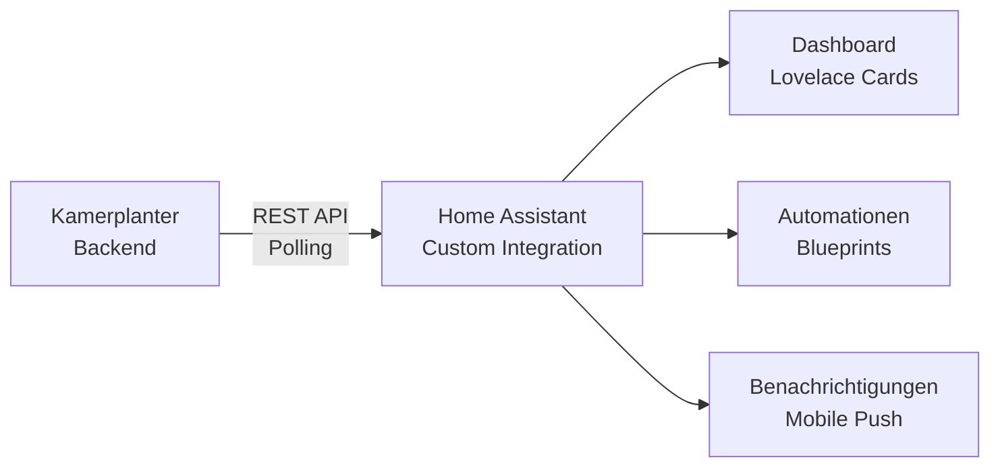
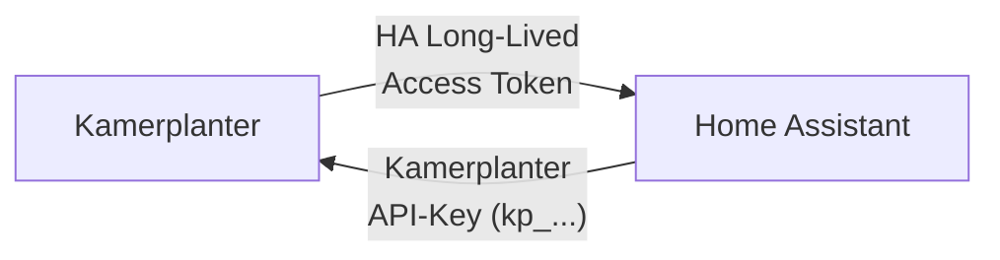

# Home Assistant Integration

Kamerplanter laesst sich ueber eine **Custom Integration** in Home Assistant einbinden. Alle Pflanzendaten, Tankwerte, Aufgaben und Kalendereintraege erscheinen als native HA-Entities und koennen in Dashboards, Automationen und Benachrichtigungen genutzt werden.

## Ueberblick



| Aspekt | Details |
|--------|---------|
| **Repository** | `kamerplanter-ha` (eigenstaendiges GitHub-Repo) |
| **Installation** | HACS (Home Assistant Community Store) oder manuell |
| **Kommunikation** | REST API Polling gegen Kamerplanter-Backend |
| **Authentifizierung** | API-Key (`kp_`-Prefix) oder Light-Modus (ohne Auth) |
| **HA-Mindestversion** | Home Assistant Core 2024.1+ |

!!! info "Separates Repository"
    Die HA-Integration ist **nicht** Teil des Kamerplanter-Backends. Sie wird als eigenstaendiges HACS-Repository entwickelt und installiert.

---

## Installation

### Via HACS (empfohlen)

1. Oeffne **HACS** in Home Assistant
2. Klicke auf **Integrationen** > **Custom Repositories**
3. Fuege das Repository `kamerplanter/kamerplanter-ha` hinzu
4. Suche nach **Kamerplanter** und klicke **Installieren**
5. Starte Home Assistant neu

### Manuelle Installation

1. Lade die aktuelle Version von GitHub herunter
2. Kopiere `custom_components/kamerplanter/` in dein HA `config/custom_components/`-Verzeichnis
3. Starte Home Assistant neu

---

## Voraussetzungen: Bidirektionaler API-Zugriff

Fuer eine vollstaendige Integration muessen **beide Systeme gegenseitig API-Zugriff** haben. Das erfordert einen Token-Austausch:



| Richtung | Token | Wozu | Wo erstellen |
|----------|-------|------|-------------|
| **HA → Kamerplanter** | Kamerplanter API-Key (`kp_`-Prefix) | HA liest Pflanzendaten, Tankwerte, Aufgaben | Kamerplanter: **Einstellungen** > **API-Keys** |
| **Kamerplanter → HA** | HA Long-Lived Access Token | Kamerplanter liest Sensordaten, steuert Aktoren (REQ-005, REQ-018) | Home Assistant: **Profil** > **Long-Lived Access Tokens** |

!!! warning "Beide Tokens erforderlich"
    Ohne den **Kamerplanter API-Key** kann die HA-Integration keine Daten abfragen. Ohne den **HA Access Token** kann Kamerplanter keine Sensordaten aus Home Assistant lesen und keine Aktoren steuern. Fuer einen reinen Lese-Betrieb (nur HA-Dashboard) reicht der Kamerplanter API-Key allein.

### Tokens einrichten

**1. Kamerplanter API-Key erstellen** (fuer HA → Kamerplanter):

1. In Kamerplanter: **Einstellungen** > **API-Keys** > **Neuer Key**
2. Den generierten Key (`kp_...`) kopieren
3. In Home Assistant: Bei der Kamerplanter-Integration im Config Flow eingeben

**2. HA Access Token erstellen** (fuer Kamerplanter → HA):

1. In Home Assistant: **Profil** (unten links) > **Long-Lived Access Tokens** > **Token erstellen**
2. Den Token kopieren
3. In Kamerplanter: **Einstellungen** > **Home Assistant** > URL und Token eintragen
    - Oder via Umgebungsvariablen: `HA_URL` und `HA_ACCESS_TOKEN`

---

## Einrichtung

Nach der Installation fuehrt ein 4-Schritte-Assistent durch die Konfiguration:

### Schritt 1: Kamerplanter-URL

Gib die URL deiner Kamerplanter-Instanz ein:

- Lokal: `http://raspberry:8000` oder `http://192.168.1.50:8000`
- Extern: `https://kamerplanter.example.com`

Die Integration prueft die Erreichbarkeit automatisch via `/api/health`.

### Schritt 2: Authentifizierung

| Modus | Beschreibung |
|-------|-------------|
| **Light-Modus** | Keine Authentifizierung noetig (REQ-027) |
| **API-Key** | API-Schluessel mit `kp_`-Prefix eingeben (empfohlen) |
| **Login** | Benutzername und Passwort als Fallback |

### Schritt 3: Tenant auswaehlen

Bei Multi-Tenant-Betrieb (z.B. Gemeinschaftsgarten) den gewuenschten Tenant aus der Liste waehlen. Bei Einzelnutzern wird dieser Schritt uebersprungen.

### Schritt 4: Entities konfigurieren

Waehle aus, welche Pflanzen, Standorte und Tanks als HA-Entities angelegt werden sollen. Per Default werden alle verfuegbaren Entities erstellt.

---

## Verfuegbare Entities

Die Integration erstellt automatisch Entities fuer alle ausgewaehlten Pflanzen, Standorte und Tanks.

### Pflanzen-Entities

| Entity | Typ | Einheit | Beschreibung |
|--------|-----|---------|-------------|
| `sensor.kp_{plant}_phase` | Sensor | -- | Aktuelle Wachstumsphase |
| `sensor.kp_{plant}_days_in_phase` | Sensor | Tage | Tage in aktueller Phase |
| `sensor.kp_{plant}_vpd_target` | Sensor | kPa | VPD-Sollwert fuer aktuelle Phase |
| `sensor.kp_{plant}_ec_target` | Sensor | mS/cm | EC-Sollwert fuer aktuelle Phase |
| `sensor.kp_{plant}_photoperiod` | Sensor | h | Photoperiode (Licht/Dunkel) |
| `sensor.kp_{plant}_gdd_accumulated` | Sensor | GDD | Akkumulierte Wachstumsgradtage |
| `sensor.kp_{plant}_harvest_readiness` | Sensor | % | Erntebereitschaft |
| `sensor.kp_{plant}_karenz_remaining` | Sensor | Tage | Verbleibende Wartezeit (IPM) |
| `sensor.kp_{plant}_next_watering` | Sensor | -- | Naechster Giesstermin |
| `sensor.kp_{plant}_health_score` | Sensor | % | Gesundheitsscore |
| `binary_sensor.kp_{plant}_needs_attention` | Binary Sensor | -- | Pflanze braucht Aufmerksamkeit |

### Tank-Entities

| Entity | Typ | Einheit | Beschreibung |
|--------|-----|---------|-------------|
| `sensor.kp_{tank}_ec` | Sensor | mS/cm | Elektrische Leitfaehigkeit |
| `sensor.kp_{tank}_ph` | Sensor | pH | pH-Wert |
| `sensor.kp_{tank}_fill_level` | Sensor | % | Fuellstand |
| `sensor.kp_{tank}_water_temp` | Sensor | C | Wassertemperatur |
| `sensor.kp_{tank}_solution_age_days` | Sensor | Tage | Alter der Naehrloesung |
| `binary_sensor.kp_{tank}_alert_active` | Binary Sensor | -- | Tank-Alarm aktiv |

### Standort-Entities

| Entity | Typ | Beschreibung |
|--------|-----|-------------|
| `sensor.kp_{location}_active_plants` | Sensor | Anzahl aktiver Pflanzen |
| `sensor.kp_{location}_vpd_current` | Sensor | Aktueller VPD-Wert |

### Kalender & Aufgaben

| Entity | Typ | Beschreibung |
|--------|-----|-------------|
| `calendar.kp_tasks` | Calendar | Alle Kamerplanter-Events (iCal-Feed) |
| `todo.kp_{location}_tasks` | Todo | Faellige Aufgaben pro Standort |

---

## Polling-Intervalle

Die Integration nutzt mehrere Coordinators mit unterschiedlichen Polling-Intervallen:

| Datentyp | Standard-Intervall | Minimum |
|----------|-------------------|---------|
| Pflanzen | 5 Minuten | 2 Minuten |
| Standorte | 5 Minuten | 2 Minuten |
| Tanks | 2 Minuten | 1 Minute |
| Alarme | 1 Minute | 30 Sekunden |
| Aufgaben | 5 Minuten | 2 Minuten |

Die Intervalle koennen in den Integrations-Optionen angepasst werden.

---

## Automations-Beispiele

### Phasenwechsel: Lichtprogramm umstellen

Wenn Kamerplanter einen Phasenwechsel zu "Bluete" meldet, wird das Lichtprogramm automatisch auf 12h/12h umgestellt:

```yaml
alias: "KP: Bluete-Start - 12/12 Licht"
trigger:
  - platform: state
    entity_id: sensor.kp_northern_lights_phase
    to: "flowering"
action:
  - service: automation.turn_off
    target:
      entity_id: automation.licht_18_6_veg
  - service: automation.turn_on
    target:
      entity_id: automation.licht_12_12_bloom
  - service: notify.mobile_app_phone
    data:
      title: "Kamerplanter: Bluete gestartet"
      message: "Northern Lights wechselt in Bluete. Licht auf 12/12 umgestellt."
```

### VPD-Regelung mit Kamerplanter-Sollwert

Kamerplanter liefert den optimalen VPD-Sollwert pro Phase. Home Assistant regelt den Befeuchter:

```yaml
alias: "KP: VPD-Regelung"
trigger:
  - platform: template
    value_template: >
      {{ states('sensor.growzelt_vpd') | float(0) >
         (states('sensor.kp_northern_lights_vpd_target') | float(1.0) + 0.2) }}
    id: vpd_too_high
  - platform: template
    value_template: >
      {{ states('sensor.growzelt_vpd') | float(0) <
         (states('sensor.kp_northern_lights_vpd_target') | float(1.0) - 0.1) }}
    id: vpd_ok
action:
  - choose:
      - conditions:
          - condition: trigger
            id: vpd_too_high
        sequence:
          - service: switch.turn_on
            target:
              entity_id: switch.befeuchter_zelt_1
      - conditions:
          - condition: trigger
            id: vpd_ok
        sequence:
          - service: switch.turn_off
            target:
              entity_id: switch.befeuchter_zelt_1
```

### Tank niedrig: Auffuell-Erinnerung

```yaml
alias: "KP: Tank nachfuellen"
trigger:
  - platform: numeric_state
    entity_id: sensor.kp_haupttank_fill_level
    below: 20
action:
  - service: notify.mobile_app_phone
    data:
      title: "Tank fast leer!"
      message: >
        Fuellstand: {{ states('sensor.kp_haupttank_fill_level') }}%.
        EC: {{ states('sensor.kp_haupttank_ec') }} mS/cm,
        pH: {{ states('sensor.kp_haupttank_ph') }}
```

### Frostwarnung: Gewaechshaus-Heizung

```yaml
alias: "KP: Frostwarnung - Heizung ein"
trigger:
  - platform: state
    entity_id: binary_sensor.kp_gewaechshaus_frost_warning
    to: "on"
action:
  - service: switch.turn_on
    target:
      entity_id: switch.gewaechshaus_heizung
  - service: climate.set_temperature
    target:
      entity_id: climate.gewaechshaus
    data:
      temperature: 5
  - service: notify.mobile_app_phone
    data:
      title: "Frostwarnung!"
      message: "Heizung eingeschaltet (Frostschutz 5 Grad C)."
```

### Erntebereitschaft: Push-Benachrichtigung

```yaml
alias: "KP: Ernte bald bereit"
trigger:
  - platform: numeric_state
    entity_id: sensor.kp_white_widow_harvest_readiness
    above: 80
condition:
  - condition: template
    value_template: >
      {{ states('sensor.kp_white_widow_karenz_remaining') | int(99) == 0 }}
action:
  - service: notify.mobile_app_phone
    data:
      title: "Ernte bereit!"
      message: >
        Readiness: {{ states('sensor.kp_white_widow_harvest_readiness') }}%.
        Karenz abgelaufen. Trichome pruefen!
```

---

## Phasen-Attribute per Jinja2-Template abfragen

Die Sensoren `phase_timeline` und `phase` stellen strukturierte Attribute bereit, die sich in Jinja2-Templates kombinieren lassen. So kann man Detail-Informationen zur aktuellen oder einer beliebigen Phase direkt im Dashboard oder in Automationen nutzen.

### Aktuelle Phasen-Details abrufen

Der `phase_timeline`-Sensor speichert jede Phase als Attribut mit Status, Startdatum und Dauer. Der `phase`-Sensor liefert den Namen der aktuellen Phase -- kombiniert ergibt sich ein dynamischer Zugriff:

```yaml
# Tage in aktueller Phase (dynamisch)
{{ state_attr('sensor.kp_345249_phase_timeline',
              states('sensor.kp_345249_phase')).days }}

# Startdatum der aktuellen Phase
{{ state_attr('sensor.kp_345249_phase_timeline',
              states('sensor.kp_345249_phase')).started }}

# Status der aktuellen Phase (current/completed)
{{ state_attr('sensor.kp_345249_phase_timeline',
              states('sensor.kp_345249_phase')).status }}
```

### Bestimmte Phase direkt abfragen

```yaml
# Wann hat die vegetative Phase begonnen?
{{ state_attr('sensor.kp_345249_phase_timeline', 'vegetative').started }}

# Wie viele Tage hat die Keimung gedauert?
{{ state_attr('sensor.kp_345249_phase_timeline', 'germination').days }}
```

### Fortschritts-Attribute

Der `phase_timeline`-Sensor stellt zusaetzliche Fortschritts-Attribute bereit:

```yaml
# Name der aktuellen Phase
{{ state_attr('sensor.kp_345249_phase_timeline', 'current_phase_name') }}

# Tage in aktueller Phase
{{ state_attr('sensor.kp_345249_phase_timeline', 'days_in_phase') }}

# Naechste geplante Phase (bei Planting Runs)
{{ states('sensor.kp_345249_next_phase') }}
```

### Beispiel: Markdown-Card mit Phasen-Info

```yaml
type: markdown
content: >
  **{{ states('sensor.kp_345249_phase') | title }}** seit
  {{ state_attr('sensor.kp_345249_phase_timeline',
                 states('sensor.kp_345249_phase')).days }} Tagen
  (Start: {{ state_attr('sensor.kp_345249_phase_timeline',
                         states('sensor.kp_345249_phase')).started }})

  Naechste Phase: **{{ states('sensor.kp_345249_next_phase') | default('--') }}**
```

### Beispiel: Bedingte Automation nach Phasen-Dauer

```yaml
alias: "KP: Bluete-Erinnerung nach 8 Wochen"
trigger:
  - platform: template
    value_template: >
      {{ state_attr('sensor.kp_345249_phase_timeline',
                     states('sensor.kp_345249_phase')).days | int(0) >= 56 }}
condition:
  - condition: state
    entity_id: sensor.kp_345249_phase
    state: "flowering"
action:
  - service: notify.mobile_app_phone
    data:
      title: "8 Wochen Bluete erreicht"
      message: >
        Pflanze ist seit
        {{ state_attr('sensor.kp_345249_phase_timeline', 'flowering').days }}
        Tagen in der Bluete. Trichome pruefen!
```

!!! tip "Attribut-Zugriff allgemein"
    Das Muster `state_attr('sensor.kp_{id}_phase_timeline', states('sensor.kp_{id}_phase'))` funktioniert fuer alle Kamerplanter-Pflanzen und Planting Runs. Bei Runs stehen zusaetzlich `phase_week`, `phase_progress_pct` und `remaining_days` als Attribute zur Verfuegung.

---

## Lovelace Custom Cards

Neben den Standard-HA-Cards stellt das `kamerplanter-ha`-Repository optionale **Custom Lovelace Cards** bereit:

- **Tank-Card** -- Fuellstand, EC, pH und Wassertemperatur auf einen Blick
- **Phasen-Timeline-Card** -- Visueller Phasenverlauf einer Pflanze
- **Duengemischungs-Card** -- Aktuelle Mischung mit Einzelkomponenten

Die Cards werden ueber den Standard-HA-Editor konfiguriert (Entity-Picker, keine YAML-Pflicht).

---

## Fehlerbehandlung

| Fehler | Ursache | Loesung |
|--------|---------|---------|
| "Kamerplanter nicht erreichbar" | Backend offline oder URL falsch | URL pruefen, Backend starten |
| "API-Key ungueltig" | Key revoked oder falsch | Neuen API-Key in Kamerplanter generieren |
| Entity zeigt "unavailable" | Coordinator-Update fehlgeschlagen | Logs pruefen, Polling-Intervall erhoehen |

Diagnostics-Daten sind unter **Einstellungen** > **Integrationen** > **Kamerplanter** > **Diagnostik** verfuegbar.

---

## Siehe auch

- [Sensorik](../user-guide/sensors.md) -- Hybrid-Sensorik mit HA als Datenquelle
- [Kalender](../user-guide/calendar.md) -- iCal-Feed fuer HA Calendar-Entity
- [Tankmanagement](../user-guide/tanks.md) -- Tank-Entities im Detail
