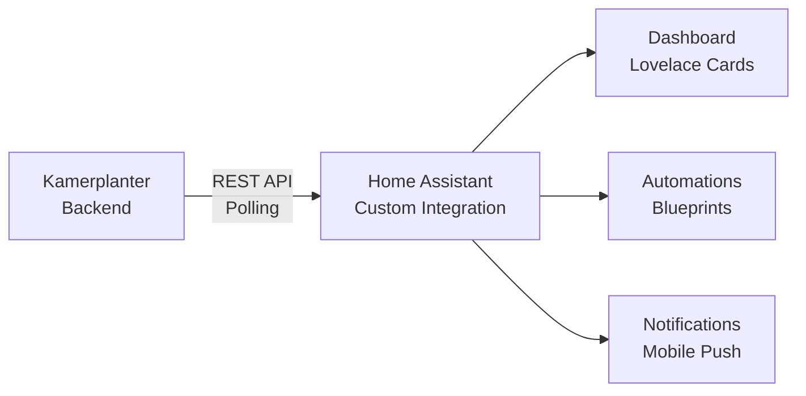
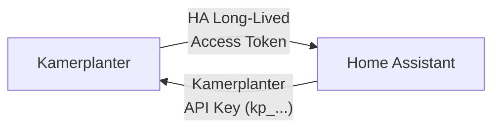
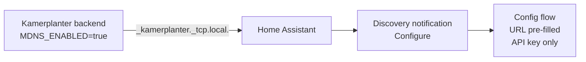

# Home Assistant Integration

Kamerplanter lässt sich über eine **Custom Integration** in Home Assistant einbinden. Alle Pflanzendaten, Tankwerte, Aufgaben und Kalendereinträge erscheinen als native HA-Entities und können in Dashboards, Automationen und Benachrichtigungen genutzt werden.

## Überblick

<!-- diagram-source: user-described — Kamerplanter backend feeds the HA custom integration, which drives dashboards, automations, and notifications -->

```mermaid
flowchart LR
    KP["Kamerplanter<br/>Backend"] -->|REST API<br/>Polling| HA["Home Assistant<br/>Custom Integration"]
    HA --> D["Dashboard<br/>Lovelace Cards"]
    HA --> A["Automations<br/>Blueprints"]
    HA --> N["Notifications<br/>Mobile Push"]
```

| Aspekt | Details |
|--------|---------|
| **Repository** | `kamerplanter-ha` (eigenständiges GitHub-Repo) |
| **Installation** | HACS (Home Assistant Community Store) oder manuell |
| **Kommunikation** | REST API Polling gegen Kamerplanter-Backend |
| **Authentifizierung** | API-Key (`kp_`-Prefix) oder Light-Modus (ohne Auth) |
| **HA-Mindestversion** | Home Assistant Core 2024.1+ |

!!! info "Separates Repository"
    Die HA-Integration ist **nicht** Teil des Kamerplanter-Backends. Sie wird als eigenständiges HACS-Repository entwickelt und installiert.

---

## Installation

### Via HACS (empfohlen)

1. Öffne **HACS** in Home Assistant
2. Klicke auf **Integrationen** > **Custom Repositories**
3. Füge das Repository `kamerplanter/kamerplanter-ha` hinzu
4. Suche nach **Kamerplanter** und klicke **Installieren**
5. Starte Home Assistant neu

### Manuelle Installation

1. Lade die aktuelle Version von GitHub herunter
2. Kopiere `custom_components/kamerplanter/` in dein HA `config/custom_components/`-Verzeichnis
3. Starte Home Assistant neu

---

## Voraussetzungen: Bidirektionaler API-Zugriff

Für eine vollständige Integration müssen **beide Systeme gegenseitig API-Zugriff** haben. Das erfordert einen Token-Austausch:

<!-- diagram-source: user-described — bidirectional token exchange: Kamerplanter holds an HA access token, HA holds a Kamerplanter API key -->

```mermaid
flowchart LR
    KP["Kamerplanter"] -- "HA Long-Lived<br/>Access Token" --> HA["Home Assistant"]
    HA -- "Kamerplanter<br/>API Key (kp_...)" --> KP
```

| Richtung | Token | Wozu | Wo erstellen |
|----------|-------|------|-------------|
| **HA → Kamerplanter** | Kamerplanter API-Key (`kp_`-Prefix) | HA liest Pflanzendaten, Tankwerte, Aufgaben | Kamerplanter: **Einstellungen** > **API-Keys** |
| **Kamerplanter → HA** | HA Long-Lived Access Token | Kamerplanter liest Sensordaten, steuert Aktoren (REQ-005, REQ-018) | Home Assistant: **Profil** > **Long-Lived Access Tokens** |

!!! warning "Beide Tokens erforderlich"
    Ohne den **Kamerplanter API-Key** kann die HA-Integration keine Daten abfragen. Ohne den **HA Access Token** kann Kamerplanter keine Sensordaten aus Home Assistant lesen und keine Aktoren steuern. Für einen reinen Lese-Betrieb (nur HA-Dashboard) reicht der Kamerplanter API-Key allein.

### Tokens einrichten

**1. Kamerplanter API-Key erstellen** (für HA → Kamerplanter):

1. In Kamerplanter: **Einstellungen** > **API-Keys** > **Neuer Key**
2. Den generierten Key (`kp_...`) kopieren
3. In Home Assistant: Bei der Kamerplanter-Integration im Config Flow eingeben

**2. HA Access Token erstellen** (für Kamerplanter → HA):

1. In Home Assistant: **Profil** (unten links) > **Long-Lived Access Tokens** > **Token erstellen**
2. Den Token kopieren
3. In Kamerplanter: **Einstellungen** > **Home Assistant** > URL und Token eintragen
    - Oder via Umgebungsvariablen: `HA_URL` und `HA_ACCESS_TOKEN`

---

## Auto-Discovery via mDNS (empfohlen)

Mit aktivierter mDNS-Ankündigung erkennt Home Assistant das Kamerplanter-Backend automatisch im lokalen Netzwerk — die URL muss nicht mehr manuell eingegeben werden. Der Config Flow startet direkt beim Authentifizierungs-Schritt.

<!-- diagram-source: user-described — mDNS advertisement lets HA discover the backend and pre-fill the config flow URL, leaving only the API key -->

```mermaid
flowchart LR
    KP["Kamerplanter backend<br/>MDNS_ENABLED=true"]
    KP -->|_kamerplanter._tcp.local.| HA["Home Assistant"]
    HA --> D["Discovery notification<br/>Configure"]
    D --> CF["Config flow<br/>URL pre-filled<br/>API key only"]
```

### Voraussetzungen

- Backend und Home Assistant laufen im **gleichen L2-Netzwerk** (Multicast UDP 5353 erreichbar).
- `MDNS_ENABLED=true` im Backend gesetzt (Default ist `false`).
- Empfohlen: feste `INSTANCE_ID` setzen (z. B. `INSTANCE_ID=kp-homelab-01`), damit der HA-Config-Entry über Backend-Neustarts hinweg stabil bleibt.

### Aktivierung

**Docker Compose / Bare Metal:**

```yaml
services:
  kamerplanter:
    environment:
      MDNS_ENABLED: "true"
      INSTANCE_ID: "kp-homelab-01"
```

**Kubernetes (Homelab mit `hostNetwork: true`):**

```yaml
# values.yaml
env:
  MDNS_ENABLED: "true"
  INSTANCE_ID: "kp-homelab-01"
hostNetwork: true
```

!!! warning "mDNS-Kompatibilität je Deployment"
    mDNS funktioniert nur im lokalen Netzwerk (Multicast). In Standard-Kubernetes-Clustern und Cloud-Deployments verwerfen Overlay-Netze bzw. fehlende LANs die Announcements. Details zur Entscheidungsmatrix: [Umgebungsvariablen — mDNS/Zeroconf](../reference/environment-variables.md#mdns-zeroconf-discovery).

### Ablauf

1. Nach Backend-Start zeigt Home Assistant unter **Einstellungen** > **Geräte & Dienste** eine Benachrichtigung "Kamerplanter entdeckt".
2. Klick auf **Konfigurieren** öffnet den Config Flow mit **vorausgefüllter URL** und **vorausgefüllter Instanz-ID**.
3. Es bleibt nur der Authentifizierungs-Schritt — API-Key (`kp_...`) eingeben, fertig.

Sollte die Discovery-Benachrichtigung nicht erscheinen, nutze den manuellen Einrichtungs-Assistenten unten.

---

## Einrichtung (manuell)

Wenn Auto-Discovery nicht verfügbar ist (Cloud, Kubernetes ohne `hostNetwork`, getrennte Netzwerksegmente), führt ein 4-Schritte-Assistent durch die Konfiguration:

### Schritt 1: Kamerplanter-URL

Gib die URL deiner Kamerplanter-Instanz ein:

- Lokal: `http://raspberry:8000` oder `http://192.168.1.50:8000`
- Extern: `https://kamerplanter.example.com`

Die Integration prüft die Erreichbarkeit automatisch via `/api/health`.

### Schritt 2: Authentifizierung

| Modus | Beschreibung |
|-------|-------------|
| **Light-Modus** | Keine Authentifizierung nötig (REQ-027) |
| **API-Key** | API-Schlüssel mit `kp_`-Prefix eingeben (empfohlen) |
| **Login** | Benutzername und Passwort als Fallback |

### Schritt 3: Tenant auswählen

Bei Multi-Tenant-Betrieb (z.B. Gemeinschaftsgarten) den gewünschten Tenant aus der Liste wählen. Bei Einzelnutzern wird dieser Schritt übersprungen.

### Schritt 4: Entities konfigurieren

Wähle aus, welche Pflanzen, Standorte und Tanks als HA-Entities angelegt werden sollen. Per Default werden alle verfügbaren Entities erstellt.

---

## Verfügbare Entities

Die Integration erstellt automatisch Entities für alle ausgewählten Pflanzen, Standorte und Tanks.

### Pflanzen-Entities

| Entity | Typ | Einheit | Beschreibung |
|--------|-----|---------|-------------|
| `sensor.kp_{plant}_phase` | Sensor | -- | Aktuelle Wachstumsphase |
| `sensor.kp_{plant}_days_in_phase` | Sensor | Tage | Tage in aktueller Phase |
| `sensor.kp_{plant}_vpd_target` | Sensor | kPa | VPD- (Dampfdruckdefizit, Vapor Pressure Deficit) Sollwert für aktuelle Phase |
| `sensor.kp_{plant}_ec_target` | Sensor | mS/cm | EC-Sollwert für aktuelle Phase |
| `sensor.kp_{plant}_photoperiod` | Sensor | h | Photoperiode (Licht/Dunkel) |
| `sensor.kp_{plant}_gdd_accumulated` | Sensor | GDD | Akkumulierte Wachstumsgradtage |
| `sensor.kp_{plant}_harvest_readiness` | Sensor | % | Erntebereitschaft |
| `sensor.kp_{plant}_karenz_remaining` | Sensor | Tage | Verbleibende Wartezeit (IPM — Integrierter Pflanzenschutz, Integrated Pest Management) |
| `sensor.kp_{plant}_next_watering` | Sensor | -- | Nächster Gießtermin |
| `sensor.kp_{plant}_health_score` | Sensor | % | Gesundheitsscore |
| `binary_sensor.kp_{plant}_needs_attention` | Binary Sensor | -- | Pflanze braucht Aufmerksamkeit |

### Tank-Entities

| Entity | Typ | Einheit | Beschreibung |
|--------|-----|---------|-------------|
| `sensor.kp_{tank}_ec` | Sensor | mS/cm | Elektrische Leitfähigkeit |
| `sensor.kp_{tank}_ph` | Sensor | pH | pH-Wert |
| `sensor.kp_{tank}_fill_level` | Sensor | % | Füllstand |
| `sensor.kp_{tank}_water_temp` | Sensor | C | Wassertemperatur |
| `sensor.kp_{tank}_solution_age_days` | Sensor | Tage | Alter der Nährlösung |
| `binary_sensor.kp_{tank}_alert_active` | Binary Sensor | -- | Tank-Alarm aktiv |

### Standort-Entities

| Entity | Typ | Beschreibung |
|--------|-----|-------------|
| `sensor.kp_{location}_active_plants` | Sensor | Anzahl aktiver Pflanzen |
| `sensor.kp_{location}_vpd_current` | Sensor | Aktueller VPD-Wert |
| `binary_sensor.kp_{location}_frost_warning` | Binary Sensor | Frostwarnung — noch nicht befüllt, siehe Hinweis unten |

!!! note "Frostwarnung setzt die geplante Wetter-API voraus"
    Diese Entity wird im Automations-Beispiel „Frostwarnung: Gewächshaus-Heizung" weiter unten verwendet, wird aber von Kamerplanter aktuell **nicht befüllt**: Die zugrunde liegende Frosterkennung braucht Live-Wetterdaten, und die Wetter-API-Integration (DWD, OpenWeatherMap, Open-Meteo) ist in Kamerplanter **spezifiziert, aber noch nicht implementiert** — siehe [Sensorik: Sensoren für Freiland](../user-guide/sensors.md#sensoren-für-freiland-wetter-api-einrichten). Bis dahin kannst du dieselbe Automation mit einem eigenen HA-Außentemperatursensor statt der Kamerplanter-Entity umsetzen.

### Kalender & Aufgaben

| Entity | Typ | Beschreibung |
|--------|-----|-------------|
| `calendar.kp_tasks` | Calendar | Alle Kamerplanter-Events (iCal-Feed) |
| `todo.kp_{location}_tasks` | Todo | Fällige Aufgaben pro Standort |

---

## Auswahl der veröffentlichten Elemente

Standardmäßig wird **kein** Element an Home Assistant übertragen. Erst wenn eine Pflanze, ein Tank oder ein Standort in Kamerplanter explizit aktiviert wird, erscheint sie als Entity in Home Assistant. Dieses **Opt-in-Prinzip** verhindert, dass alle Datensätze eines Gartens automatisch in Home Assistant landen.

!!! note "Voraussetzung: Smart-Home-Funktion aktivieren"
    Der Schalter „Als Home-Assistant-Sensor veröffentlichen" ist nur sichtbar, wenn die Smart-Home-Integration für deinen Account aktiviert ist. Aktivierung: **Kontoeinstellungen** > **Smart Home** > HA-Integration einschalten.

### Schalter auf der Detailseite

Öffne die Detailseite der gewünschten Pflanze, des Tanks oder des Standorts. Im Abschnitt **Smart Home** findest du den Schalter **„Als Home-Assistant-Sensor veröffentlichen"**.

| Element | Wo zu finden |
|---------|-------------|
| Pflanze | Pflanzen-Detailseite > Abschnitt „Smart Home" |
| Tank | Tank-Detailseite > Abschnitt „Smart Home" |
| Standort | Standort-Detailseite > Abschnitt „Smart Home" |

- Schalter **ein** — Das Element wird an Home Assistant übertragen; die zugehörigen Entities werden beim nächsten Coordinator-Update angelegt.
- Schalter **aus** (Standard) — Das Element wird nicht übertragen; bereits vorhandene Entities werden aus Home Assistant entfernt.

!!! tip "Selektiv publizieren"
    Aktiviere nur die Pflanzen und Tanks, die du aktiv in Automationen oder Dashboards nutzen möchtest. Weniger Entities bedeuten weniger Polling-Last und ein übersichtlicheres HA-Interface.

### Zentraler Verwaltungs-Tab

Für die Verwaltung mehrerer Elemente auf einmal steht ein zentraler Tab bereit: **Einstellungen → „HA-Veröffentlichung"**.

!!! note "Voraussetzung: Smart-Home-Funktion aktivieren"
    Der Tab **„HA-Veröffentlichung"** erscheint nur, wenn die Smart-Home-Integration für deinen Account aktiviert ist. Aktivierung: **Kontoeinstellungen** > **Smart Home** > HA-Integration einschalten.

Der Tab gliedert sich in drei Bereiche — je einen für Pflanzen, Tanks und Standorte. Jeder Bereich zeigt alle vorhandenen Elemente in einer tabellarischen Ansicht. Einzelne Elemente lassen sich dort direkt per Schalter aktivieren oder deaktivieren, ohne die jeweilige Detailseite öffnen zu müssen.

| Bereich | Inhalt |
|---------|--------|
| **Pflanzen** | Alle Pflanzen des aktuellen Tenants mit Publikations-Schalter |
| **Tanks** | Alle Tanks des aktuellen Tenants mit Publikations-Schalter |
| **Standorte** | Alle Standorte des aktuellen Tenants mit Publikations-Schalter |

!!! tip "Empfohlene Methode für Erst-Setup und Massenänderungen"
    Nutze den Tab **Einstellungen → „HA-Veröffentlichung"** um beim ersten Einrichten oder nach dem Anlegen mehrerer neuer Elemente rasch die gewünschte Auswahl zu treffen. Der Schalter auf der jeweiligen Detailseite bleibt als schnelle Alternative für einzelne Elemente bestehen.

### Mandantenbezug

Die Auswahl gilt pro Tenant (Garten). In einem Gemeinschaftsgarten mit mehreren Tenants ist die Publikations-Einstellung je Tenant getrennt — derselbe Nutzer kann in Tenant A einen Tank veröffentlichen, in Tenant B nicht.

### Technischer Hintergrund (für HA-Integrations-Entwickler)

Das Kamerplanter-Backend stellt die aktivierten Schlüssel pro Elementtyp über einen tenant-skoped Endpunkt bereit. Die `kamerplanter-ha`-Custom-Integration soll beim Aufbau der Entities ausschließlich diese Schlüssel berücksichtigen.

**Aktivierte Schlüssel abrufen:**

```
GET /api/v1/t/{tenant_slug}/ha-publish/enabled-keys/{entity_type}
```

`entity_type` ist einer von: `plant`, `tank`, `location`

Beispielantwort für `entity_type=plant`:

```json
{
  "entity_type": "plant",
  "entity_keys": ["345249", "a1b2c3", "f9e8d7"]
}
```

!!! warning "Feldname ist `entity_keys`, nicht `enabled_keys`"
    Die Antwort trägt die Schlüsselliste im Feld **`entity_keys`**. Ein früherer Doku-Stand nannte das Feld fälschlich `enabled_keys` — Integrations-Code, der diesen Namen erwartet, findet das Feld nicht.

**Einzelstatus lesen oder setzen:**

```
GET  /api/v1/t/{tenant_slug}/ha-publish/{entity_type}/{entity_key}
PUT  /api/v1/t/{tenant_slug}/ha-publish/{entity_type}/{entity_key}
```

PUT-Body:

```json
{ "enabled": true }
```

**Mehrere Elemente auf einmal setzen (Bulk-Update):**

```
PUT /api/v1/t/{tenant_slug}/ha-publish
```

Body (ein `entity_type` pro Aufruf, beliebig viele Einträge):

```json
{
  "entity_type": "plant",
  "entries": [
    { "entity_key": "345249", "enabled": true },
    { "entity_key": "a1b2c3", "enabled": false }
  ]
}
```

Die Antwort ist eine Liste der aktualisierten Einzelstatus (gleiche Form wie beim Einzelstatus-Endpunkt). Das ist der Endpunkt, den der zentrale Verwaltungs-Tab **„HA-Veröffentlichung"** im Frontend für Massenänderungen nutzt.

!!! warning "Abgewählte Elemente entfernen"
    Wenn ein Element abgewählt wird (PUT `enabled: false`), sollte die HA-Integration die zugehörigen Entities aktiv aus Home Assistant entfernen (Entity-Registry-Eintrag löschen). Andernfalls bleiben veraltete „unavailable"-Entities im System.

---

## Polling-Intervalle

Die Integration nutzt mehrere Coordinators mit unterschiedlichen Polling-Intervallen:

| Datentyp | Standard-Intervall | Minimum |
|----------|-------------------|---------|
| Pflanzen | 5 Minuten | 2 Minuten |
| Standorte | 5 Minuten | 2 Minuten |
| Tanks | 2 Minuten | 1 Minute |
| Alarme | 1 Minute | 30 Sekunden |
| Aufgaben | 5 Minuten | 2 Minuten |

Die Intervalle können in den Integrations-Optionen angepasst werden.

---

## Automations-Beispiele

### Phasenwechsel: Lichtprogramm umstellen

Wenn Kamerplanter einen Phasenwechsel zu "Blüte" meldet, wird das Lichtprogramm automatisch auf 12h/12h umgestellt:

```yaml
alias: "KP: Bluete-Start - 12/12 Licht"
trigger:
  - platform: state
    entity_id: sensor.kp_northern_lights_phase
    to: "flowering"
action:
  - service: automation.turn_off
    target:
      entity_id: automation.licht_18_6_veg
  - service: automation.turn_on
    target:
      entity_id: automation.licht_12_12_bloom
  - service: notify.mobile_app_phone
    data:
      title: "Kamerplanter: Bluete gestartet"
      message: "Northern Lights wechselt in Bluete. Licht auf 12/12 umgestellt."
```

### VPD-Regelung mit Kamerplanter-Sollwert

Kamerplanter liefert den optimalen VPD-Sollwert pro Phase. Home Assistant regelt den Befeuchter:

```yaml
alias: "KP: VPD-Regelung"
trigger:
  - platform: template
    value_template: >
      {{ states('sensor.growzelt_vpd') | float(0) >
         (states('sensor.kp_northern_lights_vpd_target') | float(1.0) + 0.2) }}
    id: vpd_too_high
  - platform: template
    value_template: >
      {{ states('sensor.growzelt_vpd') | float(0) <
         (states('sensor.kp_northern_lights_vpd_target') | float(1.0) - 0.1) }}
    id: vpd_ok
action:
  - choose:
      - conditions:
          - condition: trigger
            id: vpd_too_high
        sequence:
          - service: switch.turn_on
            target:
              entity_id: switch.befeuchter_zelt_1
      - conditions:
          - condition: trigger
            id: vpd_ok
        sequence:
          - service: switch.turn_off
            target:
              entity_id: switch.befeuchter_zelt_1
```

### Tank niedrig: Auffüll-Erinnerung

```yaml
alias: "KP: Tank nachfuellen"
trigger:
  - platform: numeric_state
    entity_id: sensor.kp_haupttank_fill_level
    below: 20
action:
  - service: notify.mobile_app_phone
    data:
      title: "Tank fast leer!"
      message: >
        Fuellstand: {{ states('sensor.kp_haupttank_fill_level') }}%.
        EC: {{ states('sensor.kp_haupttank_ec') }} mS/cm,
        pH: {{ states('sensor.kp_haupttank_ph') }}
```

### Frostwarnung: Gewächshaus-Heizung

```yaml
alias: "KP: Frostwarnung - Heizung ein"
trigger:
  - platform: state
    entity_id: binary_sensor.kp_gewaechshaus_frost_warning
    to: "on"
action:
  - service: switch.turn_on
    target:
      entity_id: switch.gewaechshaus_heizung
  - service: climate.set_temperature
    target:
      entity_id: climate.gewaechshaus
    data:
      temperature: 5
  - service: notify.mobile_app_phone
    data:
      title: "Frostwarnung!"
      message: "Heizung eingeschaltet (Frostschutz 5 Grad C)."
```

### Erntebereitschaft: Push-Benachrichtigung

```yaml
alias: "KP: Ernte bald bereit"
trigger:
  - platform: numeric_state
    entity_id: sensor.kp_white_widow_harvest_readiness
    above: 80
condition:
  - condition: template
    value_template: >
      {{ states('sensor.kp_white_widow_karenz_remaining') | int(99) == 0 }}
action:
  - service: notify.mobile_app_phone
    data:
      title: "Ernte bereit!"
      message: >
        Readiness: {{ states('sensor.kp_white_widow_harvest_readiness') }}%.
        Karenz abgelaufen. Trichome prüfen!
```

---

## Phasen-Attribute per Jinja2-Template abfragen

Die Sensoren `phase_timeline` und `phase` stellen strukturierte Attribute bereit, die sich in Jinja2-Templates kombinieren lassen. So kann man Detail-Informationen zur aktuellen oder einer beliebigen Phase direkt im Dashboard oder in Automationen nutzen.

### Aktuelle Phasen-Details abrufen

Der `phase_timeline`-Sensor speichert jede Phase als Attribut mit Status, Startdatum und Dauer. Der `phase`-Sensor liefert den Namen der aktuellen Phase -- kombiniert ergibt sich ein dynamischer Zugriff:

```yaml
# Tage in aktueller Phase (dynamisch)
{{ state_attr('sensor.kp_345249_phase_timeline',
              states('sensor.kp_345249_phase')).days }}

# Startdatum der aktuellen Phase
{{ state_attr('sensor.kp_345249_phase_timeline',
              states('sensor.kp_345249_phase')).started }}

# Status der aktuellen Phase (current/completed)
{{ state_attr('sensor.kp_345249_phase_timeline',
              states('sensor.kp_345249_phase')).status }}
```

### Bestimmte Phase direkt abfragen

```yaml
# Wann hat die vegetative Phase begonnen?
{{ state_attr('sensor.kp_345249_phase_timeline', 'vegetative').started }}

# Wie viele Tage hat die Keimung gedauert?
{{ state_attr('sensor.kp_345249_phase_timeline', 'germination').days }}
```

### Fortschritts-Attribute

Der `phase_timeline`-Sensor stellt zusätzliche Fortschritts-Attribute bereit:

```yaml
# Name der aktuellen Phase
{{ state_attr('sensor.kp_345249_phase_timeline', 'current_phase_name') }}

# Tage in aktueller Phase
{{ state_attr('sensor.kp_345249_phase_timeline', 'days_in_phase') }}

# Nächste geplante Phase (bei Planting Runs)
{{ states('sensor.kp_345249_next_phase') }}
```

### Beispiel: Markdown-Card mit Phasen-Info

```yaml
type: markdown
content: >
  **{{ states('sensor.kp_345249_phase') | title }}** seit
  {{ state_attr('sensor.kp_345249_phase_timeline',
                 states('sensor.kp_345249_phase')).days }} Tagen
  (Start: {{ state_attr('sensor.kp_345249_phase_timeline',
                         states('sensor.kp_345249_phase')).started }})

  Naechste Phase: **{{ states('sensor.kp_345249_next_phase') | default('--') }}**
```

### Beispiel: Bedingte Automation nach Phasen-Dauer

```yaml
alias: "KP: Bluete-Erinnerung nach 8 Wochen"
trigger:
  - platform: template
    value_template: >
      {{ state_attr('sensor.kp_345249_phase_timeline',
                     states('sensor.kp_345249_phase')).days | int(0) >= 56 }}
condition:
  - condition: state
    entity_id: sensor.kp_345249_phase
    state: "flowering"
action:
  - service: notify.mobile_app_phone
    data:
      title: "8 Wochen Bluete erreicht"
      message: >
        Pflanze ist seit
        {{ state_attr('sensor.kp_345249_phase_timeline', 'flowering').days }}
        Tagen in der Blüte. Trichome prüfen!
```

!!! tip "Attribut-Zugriff allgemein"
    Das Muster `state_attr('sensor.kp_{id}_phase_timeline', states('sensor.kp_{id}_phase'))` funktioniert für alle Kamerplanter-Pflanzen und Planting Runs. Bei Runs stehen zusätzlich `phase_week`, `phase_progress_pct` und `remaining_days` als Attribute zur Verfügung.

---

## Lovelace Custom Cards

Neben den Standard-HA-Cards stellt das `kamerplanter-ha`-Repository optionale **Custom Lovelace Cards** bereit:

- **Tank-Card** -- Füllstand, EC, pH und Wassertemperatur auf einen Blick
- **Phasen-Timeline-Card** -- Visueller Phasenverlauf einer Pflanze
- **Düngmischungs-Card** -- Aktuelle Mischung mit Einzelkomponenten

Die Cards werden über den Standard-HA-Editor konfiguriert (Entity-Picker, keine YAML-Pflicht).

---

## Fehlerbehandlung

| Fehler | Ursache | Lösung |
|--------|---------|---------|
| "Kamerplanter nicht erreichbar" | Backend offline oder URL falsch | URL prüfen, Backend starten |
| "API-Key ungültig" | Key revoked oder falsch | Neuen API-Key in Kamerplanter generieren |
| Entity zeigt "unavailable" | Coordinator-Update fehlgeschlagen | Logs prüfen, Polling-Intervall erhöhen |

Diagnostics-Daten sind unter **Einstellungen** > **Integrationen** > **Kamerplanter** > **Diagnostik** verfügbar.

---

## Siehe auch

- [Sensorik](../user-guide/sensors.md) -- Hybrid-Sensorik mit HA als Datenquelle
- [Kalender](../user-guide/calendar.md) -- iCal-Feed für HA Calendar-Entity
- [Tankmanagement](../user-guide/tanks.md) -- Tank-Entities im Detail
