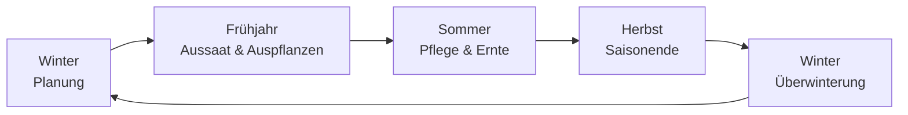

# Das Freiland-Gartenjahr

Diese Journey führt dich einmal durch ein komplettes Gartenjahr im Freiland — von der Winterplanung über Aussaat und Pflege bis zur Überwinterung. Sie verkettet ausschließlich bereits bestehende Kamerplanter-Seiten zu einem roten Faden; neue Funktionen beschreibt sie nicht. Wo eine Funktion nur teilweise oder noch gar nicht umgesetzt ist, sagt dir diese Seite das ehrlich.

<!-- Zielgruppe: ZG-002 Freilandgärtner/Gemüsegärtner -->

---

## Für wen ist diese Journey?

Für alle, die Gemüse, Kräuter oder Zierpflanzen im Beet, Hochbeet oder auf dem Balkon anbauen und Kamerplanter zur saisonalen Planung nutzen möchten — von der Fruchtfolge über die Aussaatzeitpunkte bis zur Überwinterung frostempfindlicher Pflanzen.

## Voraussetzungen

- Mindestens ein Standort mit Beeten oder Stellplätzen — siehe [Standorte & Substrate](../user-guide/locations-substrates.md)
- Pflanzenarten mit hinterlegter botanischer Familie in den Stammdaten (für Fruchtfolge und Mischkultur)

---

## Der Jahreskreislauf im Überblick

Die folgenden Schritte orientieren sich an diesem Kreislauf. Du musst sie nicht der Reihe nach abarbeiten — steig dort ein, wo deine Saison gerade steht.

---

## Schritt 1: Winterplanung — Aussaatkalender und Fruchtfolge prüfen

Bevor die neue Saison beginnt, lohnt sich ein Blick auf zwei Dinge: Was steht wann an, und was stand in den letzten Jahren auf welchem Beet?

Öffne dazu den [Kalender](../user-guide/calendar.md) und wechsle zur Ansicht **Aussaatkalender**. Sie zeigt dir für jede Art wochengenau, wann Voranzucht, Auspflanzen, Wachstum und Ernte typischerweise anstehen — über das ganze Kalenderjahr hinweg. Die **Saisonübersicht** daneben gibt dir zusätzlich einen 12-Monats-Überblick mit der Anzahl an Aussaat-, Ernte- und Blüh-Ereignissen pro Monat.

Prüfe parallel die [Fruchtfolge](companion-planting.md#fruchtfolge) für deine Beete: Welche botanische Familie stand dort in den letzten drei Jahren? Kamerplanter warnt dich beim Anlegen einer Pflanze automatisch, wenn dieselbe Familie zu früh wiederkehrt.

!!! tip "Beide Ansichten kombinieren"
    Nutze die Saisonübersicht für den groben Jahresplan und den Aussaatkalender, sobald du für eine bestimmte Art den genauen Zeitpunkt wissen willst.

---

## Schritt 2: Mischkultur mitdenken

Bevor du festlegst, was auf welchem Beet zusammensteht, lohnt sich ein Blick auf [Mischkultur & Fruchtfolge](companion-planting.md). Die Seite erklärt, welche Arten sich gegenseitig fördern (z. B. Tomate & Basilikum) und welche du besser trennst (z. B. Fenchel von fast allem). Kompatibilitäts- und Inkompatibilitäts-Daten pflegst du in den Stammdaten; legst du eine einzelne Pflanze mit Stellplatz an, prüft Kamerplanter automatisch die direkt benachbarten Stellplätze.

---

## Schritt 3: Aussaat- und Auspflanz-Zeitpunkte — Eisheilige und Phänologie

Zwei Begriffe begleiten dich als Freilandgärtner:in bei jeder Zeitplanung — beide sind fester Bestandteil des gärtnerischen Erfahrungswissens, unabhängig davon, ob du sie in einer Software nachschlägst.

**Die Eisheiligen** sind eine Reihe von Gedenktagen Mitte Mai (traditionell 11.–15. Mai, in Norddeutschland meist schon 11.–13. Mai), die als letzter statistischer Kälteeinbruch des Frühjahrs gelten. Bis zu diesem Termin kann in Mitteleuropa noch einmal Bodenfrost auftreten — deshalb gilt die Faustregel, frostempfindliche Pflanzen (Tomaten, Kürbisse, Dahlien) erst danach ins Freie zu setzen. Der letzte der fünf Tage, die „Kalte Sophie" (15. Mai), markiert traditionell das Ende der Frostgefahr.

**Phänologie** bezeichnet die Beobachtung wiederkehrender Naturereignisse als Zeitmarken — statt eines festen Kalenderdatums nutzt du den tatsächlichen Entwicklungsstand der Natur vor Ort. Der Deutsche Wetterdienst unterteilt das Jahr in zehn phänologische Jahreszeiten anhand von Zeigerpflanzen. Zwei bekannte Beispiele aus der gärtnerischen Praxis:

- **Forsythienblüte** (Vorfrühling) — Zeit, um frühe Kartoffeln zu legen und Erbsen direkt auszusäen.
- **Holunderblüte** (Frühsommer) — Zeit, um frostempfindliche Kürbisgewächse wie Gurken und Zucchini direkt auszusäen.

Der Vorteil der Phänologie gegenüber einem festen Datum: Sie berücksichtigt automatisch, ob ein Frühjahr früh oder spät dran ist — ganz gleich, was der Kalender sagt.

!!! info "So bildet Kamerplanter das aktuell ab"
    Der Aussaatkalender markiert die Eisheiligen als gestrichelte Linie (Standardtermin: 15. Mai) und verschiebt den Auspflanz-Termin frostempfindlicher Arten automatisch nicht davor — siehe [Vorrangregeln der Terminberechnung](../user-guide/calendar.md#aussaatkalender-freiland). Ein eigenes Datum für die Eisheiligen oder den letzten Frost lässt sich aktuell nur über die technische API hinterlegen, nicht über ein Formularfeld am Standort.

    Für die Phänologie gibt es unter den [Aufgaben-Kategorien](../user-guide/tasks.md#aufgaben-kategorien) bereits die Kategorie **Phänologische Aufgabe** für Aufgaben, die an ein Naturereignis statt an ein festes Datum gebunden sind. Eine automatische Erkennung von Naturereignissen (z. B. über eine Phänologie-Datenquelle) oder ein automatisch generierter phänologischer Kalender existiert noch nicht — du legst eine phänologische Aufgabe aktuell manuell an und trägst dein eigenes Beobachtungsdatum als Fälligkeit ein.

---

## Schritt 4: Aufgaben und Pflege durch die Saison

Sobald ausgesät und ausgepflanzt ist, begleiten dich [Aufgaben](../user-guide/tasks.md) durch die Saison. Für wiederkehrende Freiland-Arbeiten wie Beetvorbereitung oder Kompost umsetzen legst du eigene Aufgaben mit Wiederholung an oder nutzt ein passendes [Workflow-Template](../user-guide/tasks.md#workflow-templates-nutzen).

Für die laufende Pflege einzelner Pflanzen greifen die automatischen [Pflegeerinnerungen](../user-guide/care-reminders.md). Das Datenmodell kennt bereits zehn eigene [Freiland-Pflegestile](../user-guide/care-reminders.md#freiland-pflegestile) (z. B. `outdoor_annual_veg`, `fruit_tree`, `rose`, `frost_tender_tuber`) mit passenden Gieß- und Düngeintervallen für typische Freiland-Kulturen.

!!! info "Freiland-Pflegestile aktuell nur über API"
    Diese zehn Freiland-Presets stehen im Pflegeprofil-Dialog der Oberfläche noch nicht zur Auswahl — dort siehst du bislang nur die neun Presets für Zimmerpflanzen. Bis zur Anbindung an die Oberfläche lässt sich ein Freiland-Pflegestil nur über die technische API setzen. Ohne eigene Zuordnung nutzt Kamerplanter für Freilandpflanzen einen der neun Zimmerpflanzen-Stile als Annäherung.

---

## Schritt 5: Saisonende — Überwinterung

Im Herbst stellt sich für mehrjährige und frostempfindliche Pflanzen die Frage: bleiben sie draußen, brauchen sie Winterschutz, oder müssen sie ausgegraben und frostfrei gelagert werden?

!!! warning "Überwinterungsmanagement noch nicht implementiert"
    Eine automatische Winterhärte-Ampel, frostprognose-gesteuerte Erinnerungen und ein eigener Knollen-Zyklus-Tab (Ausgraben → Lagern → Vorkeimen → Einpflanzen) sind in Kamerplanter geplant, aber noch nicht umgesetzt — siehe [Pflegeerinnerungen — Überwinterungsmanagement](../user-guide/care-reminders.md#uberwinterungsmanagement). Plane Ausgrabe- und Einlagerungstermine für Dahlien, Gladiolen und Kübelpflanzen deshalb aktuell selbst als [Aufgabe](../user-guide/tasks.md), zum Beispiel mit der Kategorie „Saisonale Aufgabe".

---

## Schritt 6: Ausblick — Klimazonen und Winterhärte

Langfristig soll Kamerplanter aus deinen GPS-Koordinaten oder deiner Postleitzahl automatisch ableiten, in welcher Winterhärtezone dein Standort liegt, und daraus eine Winterhärte-Ampel für deine mehrjährigen Pflanzen speisen.

!!! info "Geplantes Feature"
    Dieses Feature ist spezifiziert, aber noch nicht umgesetzt. Details zum geplanten Verhalten findest du unter [Klimazonen & Winterhärte](climate-zones.md). Bis dahin ist die Klimazone am Standort ein frei editierbares Textfeld ohne automatische Ableitung.

---

## Häufige Fragen

??? question "Wo trage ich meinen letzten Frosttermin ein, wenn er von den Standardwerten abweicht?"
    Aktuell nur über die technische API — es gibt noch kein Formularfeld am Standort dafür. Ohne eigene Angabe verwendet Kamerplanter feste Standardwerte für Mitteleuropa (1. Mai letzter Frost, 15. Mai Eisheilige). Details: [Aussaatkalender — Jahr und Standort wählen](../user-guide/calendar.md#jahr-und-standort-wahlen).

??? question "Kann ich eine Aufgabe an die Forsythienblüte statt an ein Datum binden?"
    Du kannst eine Aufgabe der Kategorie „Phänologische Aufgabe" anlegen und ihr ein Fälligkeitsdatum geben, sobald du die Forsythienblüte in deiner Umgebung selbst beobachtet hast. Eine automatische Erkennung des Ereignisses gibt es noch nicht — die Beobachtung bleibt vorerst deine Aufgabe.

??? question "Muss ich die Fruchtfolge manuell im Kopf behalten, oder merkt sich Kamerplanter das?"
    Kamerplanter merkt sich die Anbau-Historie je Stellplatz und prüft sie automatisch, sobald du eine einzelne Pflanze mit Stellplatz anlegst — siehe [Fruchtfolge](companion-planting.md#fruchtfolge). Das gilt aktuell nur für einzeln angelegte Pflanzen, nicht für automatisch aus einem Pflanzdurchlauf erzeugte.

---

## Siehe auch

- [Kalender](../user-guide/calendar.md)
- [Mischkultur & Fruchtfolge](companion-planting.md)
- [Aufgaben](../user-guide/tasks.md)
- [Pflegeerinnerungen](../user-guide/care-reminders.md)
- [Klimazonen & Winterhärte](climate-zones.md)
- [Standorte & Substrate](../user-guide/locations-substrates.md)
