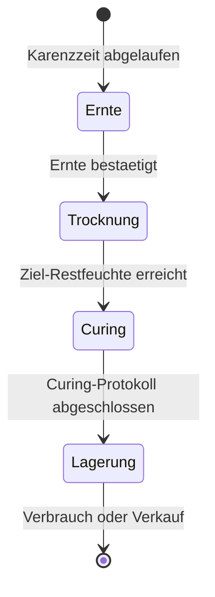

# Nachernte: Trocknung, Curing & Lagerung

Die Nachernte-Phase beginnt mit dem Schnitt und endet, wenn Ihr Produkt gelagert oder
verarbeitet wird. Kamerplanter begleitet diesen Prozess mit Protokoll-Vorlagen,
Qualitaetsbewertungen und Umgebungs-Monitoring — so behalten Sie die Kontrolle ueber
Qualitaet, Aroma und Haltbarkeit.

---

## Voraussetzungen

- Ein abgeschlossener oder begonnener Ernte-Vorgang in Kamerplanter (REQ-007)
- Kein aktives IPM-Behandlungs-Karenzfenster fuer die betreffenden Pflanzen

---

## Karenz-Gate: Systemschutz vor Ernte bei aktiven Behandlungen

!!! danger "Ernteblockade bei aktiven Behandlungen"
    Wenn eine Pflanzenschutzbehandlung mit einer definierten Karenzzeit (Pre-Harvest
    Interval) noch laeuft, blockiert Kamerplanter die Ernteerstellung automatisch.

    **Karenzzeit** (auch: Pre-Harvest Interval, PHI) ist der Mindestzeitraum zwischen
    der letzten Behandlung und der Ernte, der laut Pflanzenschutzmittelzulassung
    eingehalten werden muss.

    Das System zeigt Ihnen das genaue Datum an, ab dem die Ernte erlaubt ist. Wenden
    Sie sich an Ihren Gartenbau-Berater, wenn Sie Fragen zur Einhaltung haben.

---

## Ernte-Workflow in Kamerplanter

1. Navigieren Sie zum Pflanzdurchlauf und oeffnen Sie den **Erntebereich**.
2. Das System prueft automatisch alle Karenzzeiten.
3. Erstellen Sie einen **Ernte-Batch** (HarvestBatch) mit Gewicht, Datum und Qualitaets-
   Erstbewertung.
4. Legen Sie ein **Nachernte-Protokoll** an und waehlen Sie den Protokoll-Typ.
5. Erfassen Sie regelmaessig **Messungen** (Gewicht, Temperatur, Luftfeuchte).

---

## Trocknung

### Cannabis, Hopfen & Kraeuter (Slow-Dry-Methode)

Die Slow-Dry-Methode ist die schonendste Trocknungsmethode und erhaelt Terpene
und Aromen am besten.

**Optimale Bedingungen:**

| Parameter | Zielwert | Kritische Grenzen |
|-----------|---------|------------------|
| Temperatur | 15–21 °C | Ueber 25 °C: Terpen-Verlust |
| Relative Luftfeuchte | 45–55 % | Ueber 65 %: Schimmelgefahr (Botrytis) |
| Dauer | 7–14 Tage | — |
| Luftaustausch | Leichter Luftzug | Kein Direktzug auf die Ernte |

!!! warning "Schimmel-Schwelle beachten"
    Relative Luftfeuchte ueber 65 % erhoehen das Schimmelrisiko massiv.
    Botrytis (Grauschimmel) kann eine gesamte Ernte in wenigen Tagen vernichten.
    Kamerplanter sendet eine Warnung, wenn kalibrierte Sensoren diesen Schwellwert
    ueberschreiten.

**Bereitschafts-Check (Snap-Test):**
Ein duenner Ast sollte beim Biegen knacken, aber nicht splittern. Blaetter sollten
trocken und knusprig sein, Blaetenstiele flexibel aber nicht biegsam.

### Chili & Paprika

| Methode | Dauer | Temperatur | Hinweise |
|---------|-------|-----------|---------|
| Lufttrocknung | 2–4 Wochen | Raumtemperatur | Langsam, bestes Aroma |
| Dehydrator | 6–12 Stunden | 50–60 °C | Schnell, leichter Aromaverlust |

### Zwiebeln & Knoblauch (2-Phasen-Trocknung)

!!! example "Phasentrennung Haertung und Lagerung"
    Zwiebeln und Knoblauch benoetigen zwei unterschiedliche Klimaphasen:

    **Phase 1 — Schalenhärtung (Curing):** 2–3 Wochen bei 25–30 °C, niedrige Luftfeuchte.
    UV-Exposition ist in dieser Phase erwuenscht — sie foerdert die Schalenhärtung und
    antimikrobielle Wirkung. Gut beluefteter, sonniger Standort.

    **Phase 2 — Langzeitlagerung:** Dunkel, 10–15 °C, 60–70 % Luftfeuchte.
    Kein Licht! Licht foerdert Keimung und Ergruening.

---

## Curing (Veredelung/Fermentierung)

### Cannabis — Jar-Curing

Curing ist der Prozess, der die Qualitaet von Trocken-Cannabis noch einmal deutlich
verbessert. Chlorophyll wird abgebaut, Terpene entfalten sich weiter.

**Ablauf:**

1. Getrocknete Blueten in hermetisch schliessbare Glaeser (Masonglaeser) fuellen —
   maximal 2/3 voll.
2. Glaeser bei 62 % relativer Luftfeuchte lagern (Boveda-62-Packs empfohlen).
3. **Burping-Schema einhalten:**

| Zeitraum | Haeufigkeit | Dauer pro Sitzung |
|---------|------------|------------------|
| Woche 1–2 | 2 x taeglich | 15 Minuten |
| Woche 3–4 | 1 x taeglich | 10 Minuten |
| Ab Woche 5 | 1 x woechentlich | 5 Minuten |

4. Mindestdauer: 4 Wochen. Optimales Resultat: 6–8 Wochen.

!!! tip "Boveda-Packs"
    Boveda 62 %-Packs regulieren die Luftfeuchte im Glas automatisch in beide Richtungen.
    Sie sind keine Feuchtigkeitsquelle, sondern Puffer. Wechseln Sie sie, wenn sie
    vollstaendig ausgehaertet sind.

### Sauerkraut

| Phase | Dauer | Temperatur | Salzgehalt |
|-------|-------|-----------|-----------|
| Phase 1 (Leuconostoc) | 1–3 Tage | 18–22 °C | 2–2,5 % |
| Phase 2 (Lactobacillus) | 4–21 Tage | 15–18 °C | 2–2,5 % |

Das Gemüse muss vollstaendig unter der Salzlake sein. Fertig wenn pH unter 4,0 und
keine Gasbildung mehr.

### Kimchi

Kimchi hat ein abweichendes Profil (hoehere Salzkonzentration, anderes
Temperatur-Muster):

- **Phase 1 (Raumtemperatur):** 1–3 Tage bei 18–22 °C — Initialfermentation
- **Phase 2 (Kaltfermentation):** 2–5 °C im Kuehlschrank, 2–4 Wochen

Salzgehalt: 3–5 % (hoeher durch Gochugaru und Fischsauce).

---

## Lagerung

### Temperatur-Zonen im Ueberblick

| Zone | Temperatur | Geeignet fuer |
|------|-----------|--------------|
| Kuehl | 0–5 °C | Wurzelgemüse (in Sand), Aepfel, Kohl |
| Keller | 10–15 °C | Kuerbis, Zwiebeln, Kartoffeln, Cannabis (fertig) |
| Raumtemperatur | 18–22 °C | Getrocknete Kraeuter, Samen, Trockenfruechte |

### Luftfeuchte nach Produkt

| Luftfeuchte | Produkte |
|------------|---------|
| Hoch (80–95 %) | Wurzelgemüse in feuchtem Sand |
| Mittel (60–70 %) | Kuerbis, Zwiebeln nach dem Haerten |
| Niedrig (40–50 %) | Getrocknete Kraeuter, Cannabis, Hopfen |

### Ethylen-Management bei Gemuese und Obst

!!! warning "Ethylen-Produzenten von empfindlichen Sorten trennen"
    Ethylen ist ein pflanzliches Reifegas. Ethylen-Produzenten (Tomate, Apfel, Banane,
    Avocado) beschleunigen die Reifung von empfindlichen Produkten enorm:

    **Ethylen-empfindliche Produkte:** Salat, Gurke, Brokkoli, Karotte, Krauter

    Lagern Sie diese **niemals** zusammen mit Tomaten, Aepfeln oder Bananen —
    es fuehrt zu schnellem Vergilben, Bitterkeit und vorzeitigem Verderb.

---

## Qualitaetsbewertung

### Trichom-Check (Cannabis)

| Trichom-Farbe | Reifegrad | Empfehlung |
|-------------|----------|-----------|
| Klar/Durchsichtig | Unreif | Noch nicht ernten |
| Milchig/Trueb | Reif (Spitze des Potenzials) | Erntebeginn |
| Bernstein | Ueberreif | Sofort ernten; sedativere Wirkung |

### Qualitaets-Scoring in Kamerplanter

Nach der Ernte und am Ende des Curingprozesses erfassen Sie eine Qualitaetsbewertung
(QualityAssessment) in Kamerplanter:

- **Visueller Zustand**: Ausgezeichnet / Gut / Akzeptabel / Besorgniserregend / Kritisch
- **Aromaqualitaet**: Ausgezeichnet / Gut / Akzeptabel / Abweichend / Schimmelig
- **Gewichtsverlauf**: Taeglich oder woechentlich wiegen und in Kamerplanter erfassen
- **Wasseraktivitaet (a_w)**: Cannabis-Ziel: 0,55–0,65; Schimmelpilze ab a_w > 0,65

!!! tip "Gewicht taeglich erfassen"
    Durch taegiches Wiegen koennen Sie den Trocknungsfortschritt objektiv verfolgen.
    Cannabis verliert typischerweise 75–80 % seines Frischgewichts beim Trocknen.
    Eine Anzeige der Gewichtskurve zeigt, wann das Plateau erreicht ist.

---

## Haeufige Fragen

??? question "Wie erkenne ich Schimmel fruehzeitig?"
    Schimmel (Botrytis, Aspergillus) erscheint erst als grauer oder weisser Flaum und
    riecht muffig oder erdig-schimmelig. Pruefen Sie taeglich — besonders dichte Stellen.
    Im Zweifel: Befallenes Material sofort entfernen und getrennt lagern.

??? question "Kann ich die Trocknung mit einem Dehydrator beschleunigen?"
    Ja, aber mit Qualitaetsverlusten. Ueber 40 °C beginnen Terpene zu verdampfen, ueber
    60 °C gehen enzymatische Prozesse verloren. Fuer Cannabis und Hopfen wird
    Slow-Dry bei Raumtemperatur empfohlen. Speisepilze und Gemuese vertragen
    hoehere Temperaturen besser.

??? question "Wie lange ist getrocknetes Cannabis haltbar?"
    Bei korrekter Lagerung (14–18 °C, 58–62 % RH, dunkel, luftdicht) 12–24 Monate
    ohne deutlichen Qualitaetsverlust. Danach nehmen THC und Terpene messbar ab.

??? question "Muss ich alle Messwerte manuell in Kamerplanter eintippen?"
    Nein. Wenn Sie verknuepfte Sensoren (z.B. ueber Home Assistant) eingerichtet haben,
    werden Temperatur und Luftfeuchte automatisch importiert. Sie muessen nur
    Gewicht und visuelle Beurteilung manuell erfassen.

## Siehe auch

- [Ernte (REQ-007)](../user-guide/harvest.md)
- [Pflanzenschutz (IPM)](../user-guide/pest-management.md)
- [Sensorik](../user-guide/sensors.md)
- [VPD-Optimierung](vpd-optimization.md)
