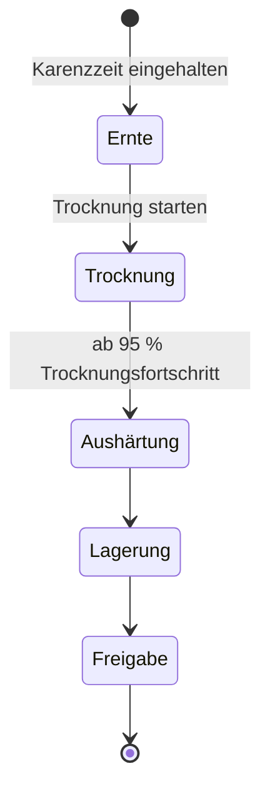

# Nachernte: Trocknung, Curing & Lagerung

!!! info "Teilweise implementiert"
    Die **Ernte-Erfassung** (HarvestBatch, Qualitätsbewertung, Ertrags-Metriken) sowie die **Nacherntebehandlung** mit eigener Stufen-Zustandsmaschine (Trocknung → Aushärtung → Lagerung → Freigabe), gewichtsbasiertem Trocknungsfortschritt und automatischen Schimmel-Warnungen sind implementiert — siehe [Nacherntebehandlung](../user-guide/post-harvest.md). Die auf dieser Seite zusätzlich beschriebenen produktspezifischen Detailprotokolle (z. B. strukturierte Burping-Zeitpläne, Sauerkraut-/Kimchi-Fermentationsphasen, Lagerort-Inventar) bleiben fachliches Hintergrundwissen ohne eigene Oberfläche.

Die Nachernte-Phase beginnt mit dem Schnitt und endet, wenn dein Produkt gelagert oder
verarbeitet wird. Kamerplanter begleitet diesen Prozess mit Protokoll-Vorlagen,
Qualitätsbewertungen und Umgebungs-Monitoring — so behältst du die Kontrolle über
Qualität, Aroma und Haltbarkeit.

---

## Voraussetzungen

- Ein abgeschlossener oder begonnener Ernte-Vorgang in Kamerplanter <!-- REQ-007 -->
- Kein aktives Behandlungs-Karenzfenster für Integrierten Pflanzenschutz (IPM) für die betreffenden Pflanzen

---

## Karenz-Gate: Systemschutz vor Ernte bei aktiven Behandlungen

!!! danger "Ernteblockade bei aktiven Behandlungen"
    Wenn eine Pflanzenschutzbehandlung mit einer definierten Karenzzeit (Pre-Harvest
    Interval) noch läuft, blockiert Kamerplanter die Ernteerstellung automatisch.

    **Karenzzeit** (auch: Pre-Harvest Interval, PHI) ist der Mindestzeitraum zwischen
    der letzten Behandlung und der Ernte, der laut Pflanzenschutzmittelzulassung
    eingehalten werden muss.

    Das System zeigt dir das genaue Datum an, ab dem die Ernte erlaubt ist. Wende
    dich an deinen Gartenbau-Berater, wenn du Fragen zur Einhaltung hast.

---

## Ernte-Workflow in Kamerplanter

<!-- diagram-source: src/backend/app/domain/engines/post_harvest_stage_engine.py -->

```mermaid
stateDiagram-v2
    [*] --> Ernte: Karenzzeit eingehalten
    Ernte --> Trocknung: Trocknung starten
    Trocknung --> Aushärtung: ab 95 % Trocknungsfortschritt
    Aushärtung --> Lagerung
    Lagerung --> Freigabe
    Freigabe --> [*]
```

1. Navigiere zu **Erntechargen** (`/ernte/batches`) und klicke auf **Erntecharge
   erstellen**.
2. Das System prüft automatisch alle Karenzzeiten.
3. Erstelle die **Erntecharge** (HarvestBatch) mit Nassgewicht, Erntedatum und
   Erntetyp. Die Qualitätsbewertung trägst du danach separat im Tab
   **Qualität** ein.
4. Navigiere zu **Nacherntebehandlung** (`/ernte/nachernte`) und klicke auf
   **Trocknung starten**, um die Erntecharge in die eigene Stufen-Zustandsmaschine
   (Trocknung → Aushärtung → Lagerung → Freigabe) zu übernehmen.
5. Erfasse während der Trocknung regelmäßig das **Gewicht** — Kamerplanter berechnet
   daraus Fortschritt, Handlungsempfehlung und geschätzte Resttage und löst bei
   Bedarf automatisch eine Schimmel-Warnung aus.

Details zu diesem Workflow: [Nacherntebehandlung](../user-guide/post-harvest.md)

!!! info "Nur über API: strukturierte Umgebungsmessungen"
    Regelmäßige, strukturierte **Umgebungsmessungen** (Temperatur, Luftfeuchte, Wasseraktivität, CO₂, visueller und geruchlicher Zustand) je Stufenschritt lassen sich aktuell nur über die API erfassen — es gibt dafür noch kein Formular in der Oberfläche. Bereits ausgelöste Schimmel-Warnungen erscheinen aber unabhängig davon in der Chargen-Detailansicht.

---

## Trocknung

### Cannabis, Hopfen & Kräuter (Slow-Dry-Methode)

Die Slow-Dry-Methode ist die schonendste Trocknungsmethode und erhält Terpene
und Aromen am besten.

**Optimale Bedingungen:**

| Parameter | Zielwert | Kritische Grenzen |
|-----------|---------|------------------|
| Temperatur | 15–21 °C | Über 25 °C: Terpen-Verlust |
| Relative Luftfeuchte | 45–55 % | Über 65 %: Schimmelgefahr (Botrytis) |
| Dauer | 7–14 Tage | — |
| Luftaustausch | Leichter Luftzug | Kein Direktzug auf die Ernte |

!!! warning "Schimmel-Schwelle beachten"
    Relative Luftfeuchte über 65 % erhöht das Schimmelrisiko massiv.
    Botrytis (Grauschimmel) kann eine gesamte Ernte in wenigen Tagen vernichten.
    Kamerplanter sendet eine Warnung, wenn kalibrierte Sensoren diesen Schwellwert
    überschreiten.

**Bereitschafts-Check (Snap-Test):**
Ein dünner Ast sollte beim Biegen knacken, aber nicht splittern. Blätter sollten
trocken und knusprig sein, Blütenstiele flexibel aber nicht biegsam.

### Chili & Paprika

| Methode | Dauer | Temperatur | Hinweise |
|---------|-------|-----------|---------|
| Lufttrocknung | 2–4 Wochen | Raumtemperatur | Langsam, bestes Aroma |
| Dehydrator | 6–12 Stunden | 50–60 °C | Schnell, leichter Aromaverlust |

### Zwiebeln & Knoblauch (2-Phasen-Trocknung)

!!! example "Phasentrennung Härtung und Lagerung"
    Zwiebeln und Knoblauch benötigen zwei unterschiedliche Klimaphasen:

    **Phase 1 — Schalenhärtung (Curing):** 2–3 Wochen bei 25–30 °C, niedrige Luftfeuchte.
    UV-Exposition ist in dieser Phase erwünscht — sie fördert die Schalenhärtung und
    antimikrobielle Wirkung. Gut belüfteter, sonniger Standort.

    **Phase 2 — Langzeitlagerung:** Dunkel, 10–15 °C, 60–70 % Luftfeuchte.
    Kein Licht! Licht fördert Keimung und Ergrünung.

---

## Curing (Veredelung/Fermentierung)

### Cannabis — Jar-Curing

Curing ist der Prozess, der die Qualität von Trocken-Cannabis noch einmal deutlich
verbessert. Chlorophyll wird abgebaut, Terpene entfalten sich weiter.

**Ablauf:**

1. Getrocknete Blüten in hermetisch schließbare Gläser (Masonsgläser) füllen —
   maximal 2/3 voll.
2. Gläser bei 62 % relativer Luftfeuchte lagern (Boveda-62-Packs empfohlen).
3. **Burping-Schema einhalten:**

| Zeitraum | Häufigkeit | Dauer pro Sitzung |
|---------|------------|------------------|
| Woche 1–2 | 2 x täglich | 15 Minuten |
| Woche 3–4 | 1 x täglich | 10 Minuten |
| Ab Woche 5 | 1 x wöchentlich | 5 Minuten |

4. Mindestdauer: 4 Wochen. Optimales Resultat: 6–8 Wochen.

!!! tip "Boveda-Packs"
    Boveda 62 %-Packs regulieren die Luftfeuchte im Glas automatisch in beide Richtungen.
    Sie sind keine Feuchtigkeitsquelle, sondern Puffer. Wechsle sie, wenn sie
    vollständig ausgehärtet sind.

### Sauerkraut

| Phase | Dauer | Temperatur | Salzgehalt |
|-------|-------|-----------|-----------|
| Phase 1 (Leuconostoc) | 1–3 Tage | 18–22 °C | 2–2,5 % |
| Phase 2 (Lactobacillus) | 4–21 Tage | 15–18 °C | 2–2,5 % |

Das Gemüse muss vollständig unter der Salzlake sein. Fertig wenn pH unter 4,0 und
keine Gasbildung mehr.

### Kimchi

Kimchi hat ein abweichendes Profil (höhere Salzkonzentration, anderes
Temperatur-Muster):

- **Phase 1 (Raumtemperatur):** 1–3 Tage bei 18–22 °C — Initialfermentation
- **Phase 2 (Kaltfermentation):** 2–5 °C im Kühlschrank, 2–4 Wochen

Salzgehalt: 3–5 % (höher durch Gochugaru und Fischsauce).

---

## Lagerung

### Temperatur-Zonen im Überblick

| Zone | Temperatur | Geeignet für |
|------|-----------|--------------|
| Kühl | 0–5 °C | Wurzelgemüse (in Sand), Äpfel, Kohl |
| Keller | 10–15 °C | Kürbis, Zwiebeln, Kartoffeln, Cannabis (fertig) |
| Raumtemperatur | 18–22 °C | Getrocknete Kräuter, Samen, Trockenfrüchte |

### Luftfeuchte nach Produkt

| Luftfeuchte | Produkte |
|------------|---------|
| Hoch (80–95 %) | Wurzelgemüse in feuchtem Sand |
| Mittel (60–70 %) | Kürbis, Zwiebeln nach dem Härten |
| Niedrig (40–50 %) | Getrocknete Kräuter, Cannabis, Hopfen |

### Ethylen-Management bei Gemüse und Obst

!!! warning "Ethylen-Produzenten von empfindlichen Sorten trennen"
    Ethylen ist ein pflanzliches Reifegas. Ethylen-Produzenten (Tomate, Apfel, Banane,
    Avocado) beschleunigen die Reifung von empfindlichen Produkten enorm:

    **Ethylen-empfindliche Produkte:** Salat, Gurke, Brokkoli, Karotte, Kräuter

    Lagere diese **niemals** zusammen mit Tomaten, Äpfeln oder Bananen —
    es führt zu schnellem Vergilben, Bitterkeit und vorzeitigem Verderb.

---

## Qualitätsbewertung

### Trichom-Check (Cannabis)

| Trichom-Farbe | Reifegrad | Empfehlung |
|-------------|----------|-----------|
| Klar/Durchsichtig | Unreif | Noch nicht ernten |
| Milchig/Trüb | Reif (Spitze des Potenzials) | Erntebeginn |
| Bernstein | Überreif | Sofort ernten; sedativere Wirkung |

### Qualitäts-Scoring in Kamerplanter

Nach der Ernte und am Ende des Curingprozesses erfasse eine Qualitätsbewertung
(QualityAssessment) im Tab **Qualität** der Erntecharge:

- **Erscheinungsbewertung**, **Aromabewertung** und **Farbbewertung**: jeweils 0–100 Punkte
- **Mängel**: frei eintragbare Schlagworte (z.B. `mold`, `pests`, `hermaphrodite`) — bekannte Schlagworte fließen mit einem definierten Punktabzug in die Bewertung ein
- **Gesamt-Score** (0–100) und **Note** (A+/A/B/C/D): werden automatisch aus den drei Bewertungen und den Mängeln berechnet — siehe Notenschwellen in [Erntemanagement](../user-guide/harvest.md#qualitätsbewertung)

!!! tip "Laufendes Gewichts-Tracking während der Trocknung"
    Für laufendes Gewichts-Tracking mit automatischem Trocknungsfortschritt, Handlungsempfehlung und geschätzten Resttagen nutzt du die [Nacherntebehandlung](../user-guide/post-harvest.md) — dort erfasst du das Gewicht regelmäßig, statt nur das tatsächliche Trockengewicht einmalig am Ende einzutragen. Als Faustregel gilt: Cannabis verliert typischerweise 75–80 % seines Frischgewichts beim Trocknen; Ziel-Wasseraktivität für die Lagerung liegt bei 0,55–0,65 (Schimmelrisiko ab a_w > 0,65).

---

## Häufige Fragen

??? question "Wie erkenne ich Schimmel frühzeitig?"
    Schimmel (Botrytis, Aspergillus) erscheint erst als grauer oder weißer Flaum und
    riecht muffig oder erdig-schimmelig. Prüfe täglich — besonders dichte Stellen.
    Im Zweifel: Befallenes Material sofort entfernen und getrennt lagern.

??? question "Kann ich die Trocknung mit einem Dehydrator beschleunigen?"
    Ja, aber mit Qualitätsverlusten. Über 40 °C beginnen Terpene zu verdampfen, über
    60 °C gehen enzymatische Prozesse verloren. Für Cannabis und Hopfen wird
    Slow-Dry bei Raumtemperatur empfohlen. Speisepilze und Gemüse vertragen
    höhere Temperaturen besser.

??? question "Wie lange ist getrocknetes Cannabis haltbar?"
    Bei korrekter Lagerung (14–18 °C, 58–62 % RH, dunkel, luftdicht) 12–24 Monate
    ohne deutlichen Qualitätsverlust. Danach nehmen THC und Terpene messbar ab.

??? question "Muss ich alle Messwerte manuell in Kamerplanter eintippen?"
    Das Gewicht erfasst du während der Trocknung manuell über die
    [Nacherntebehandlung](../user-guide/post-harvest.md). Temperatur, Luftfeuchte,
    Wasseraktivität und CO₂ lassen sich zusätzlich über die API mitschicken — eine
    automatische Übernahme aus verknüpften Sensoren (z. B. Home Assistant) ist für
    die Nachernte-Phase noch nicht angebunden.

## Siehe auch

- [Ernte](../user-guide/harvest.md) <!-- REQ-007 -->
- [Nacherntebehandlung](../user-guide/post-harvest.md) <!-- REQ-008 -->
- [Pflanzenschutz (IPM)](../user-guide/pest-management.md)
- [Sensorik](../user-guide/sensors.md)
- [VPD-Optimierung](vpd-optimization.md)
