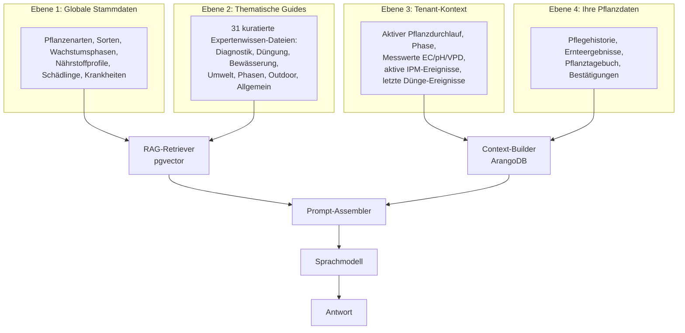

# RAG-Wissensbasis verstehen

Der KI-Assistent in Kamerplanter antwortet nicht aus dem Gedächtnis eines allgemeinen Sprachmodells — er gründet jede Antwort auf Ihre eigenen Daten und eine kuratierte Wissensbasis. Diese Technik heißt **Retrieval-Augmented Generation (RAG)**. Diese Seite erklärt, wie das System aufgebaut ist und warum es so funktioniert.

---

## Warum RAG?

Ein Sprachmodell, das allein aus seinem Training antwortet, hat zwei Schwächen:

1. **Halluzinationen** — Es erfindet plausibel klingende, aber falsche Fakten
2. **Kein Kontext** — Es kennt nicht Ihre spezifische Pflanze, Ihre aktuellen Messwerte oder Ihre Pflegehistorie

RAG löst beide Probleme: Das System sucht vor jeder Antwort relevante Informationen aus einer geprüften Datenbank und stellt sie dem Modell als Grundlage bereit. Das Modell kombiniert diese Fakten mit Ihrer konkreten Situation — statt aus dem Gedächtnis zu spekulieren.

!!! tip "Einfach erklärt"
    Stellen Sie sich RAG wie einen sehr gut vorbereiteten Assistenten vor: Er hat vor Ihrer Frage blitzschnell in der Bibliothek nachgeschlagen und kommt mit den passenden Fachbüchern zum Gespräch. Er erfindet nichts — er erklärt, was er gefunden hat.

---

## Das 4-Ebenen-Modell

Die Wissensbasis von Kamerplanter besteht aus vier Ebenen, die bei jeder Anfrage kombiniert werden.



**Ebenen 1 und 2** werden als Vektoren gespeichert und per Ähnlichkeitssuche abgerufen.
**Ebenen 3 und 4** werden zur Laufzeit als strukturierter Text in jede Anfrage eingefügt.

### Ebene 1: Globale Stammdaten

Die Kamerplanter-Stammdaten sind die Grundlage aller Empfehlungen:

- Pflanzenarten mit Taxonomie, Pflegeanforderungen und Eigenschaften
- Sorten mit spezifischen Besonderheiten
- Wachstumsphasendefinitionen mit VPD-Zielen, Licht- und Temperaturanforderungen
- Nährstoffprofile pro Art und Phase
- Schädlings- und Krankheitsdaten mit Symptomen und Behandlungsmethoden

Diese Daten werden wöchentlich neu indexiert.

### Ebene 2: Thematische Guides

Thematische Guides enthalten Querschnittswissen, das sich nicht aus den Stammdaten ableiten lässt — also Expertenwissen, das für viele Pflanzenarten und Situationen gilt. Aktuell umfasst die Wissensbasis 31 kuratierte Guides in sieben Kategorien:

| Kategorie | Beispiel-Guides |
|-----------|----------------|
| Diagnostik | Nährstoffmangel-Symptome, pH/EC-Abweichungen, Schädlingsfrüherkennung, Wurzelgesundheit |
| Umwelt | VPD-Optimierung, Lichtgrundlagen, Temperatursteuerung, CO₂-Anreicherung |
| Düngung | EC-Management (Hydroponik/Erde), organische Freilanddüngung, CalMag-Korrektur, Mischreihenfolge |
| Bewässerung | Gießstrategien nach Substrat, Überwässerung erkennen, Wasserqualität |
| Phasen | Keimung, vegetative Optimierung, Blütemanagement, Ernte-Timing, Überwintern |
| Outdoor | Saisonplanung, Mischkultur, Fruchtfolge, Wetterreaktionen |
| Allgemein | Anfänger-Einstieg, häufige Fehler vermeiden, Ertragsoptimierung |

!!! note "Agrarbiologisch geprüft"
    Alle Guides werden vor der Aufnahme in die Wissensbasis auf fachliche Korrektheit geprüft. Das System enthält außerdem 100 Benchmark-Fragen, gegen die jede neue Version der Wissensbasis getestet wird.

### Ebene 3: Tenant-Kontext (Echtzeit)

Bei jeder Anfrage holt der Context-Builder den aktuellen Zustand Ihrer Anlage aus der Datenbank:

- Aktive Pflanzdurchläufe mit aktueller Wachstumsphase und Phasendauer
- Letzte Messwerte: EC, pH, VPD, Temperatur, Luftfeuchtigkeit
- Aktive IPM-Ereignisse (Schädlingsbefall, Krankheiten, laufende Behandlungen)
- Letzte Dünge-Ereignisse mit Mengen und Produkten

### Ebene 4: Ihre Pflanzdaten (Echtzeit)

Mit Ihrer Einwilligung fließen auch persönliche Pflegedaten in den Kontext:

- Pflegebestätigungen (wann wurde gegossen, gedüngt, geschnitten)
- Einträge im Pflanztagebuch
- Ergebnisse vergangener Ernten

---

## Ein Ablauf-Beispiel

So läuft eine typische Anfrage durch das System:

!!! example "Beispiel: Gelbe Blätter"

    **Ihre Frage:** "Meine unteren Blätter werden gelb — was kann das sein?"

    **Schritt 1 — Context-Builder liest Ihre Daten:**
    ```
    Art: Cannabis sativa 'Northern Lights'
    Phase: Flowering, Tag 21
    EC: 1,2 mS/cm, pH: 5,8, VPD: 1,1 kPa
    Letzte Düngung: vor 2 Tagen (Standard-Nährlösung)
    ```

    **Schritt 2 — RAG-Retriever sucht passende Chunks:**
    - Stammdaten-Chunk: "Cannabis sativa, Flowering-Phase, NPK-Ziel 5-15-14"
    - Guide-Chunk: "Stickstoff-Mangel: untere Blätter gelb, EC erhöhen..."
    - Guide-Chunk: "Blütemanagement: N-Bedarf sinkt ab Woche 3, natürlicher N-Abbau..."

    **Schritt 3 — Modell kombiniert alles:**
    > "Deine Northern Lights ist in Woche 3 der Blüte. Gelbe untere Blätter können auf N-Mangel hindeuten, ABER: In der späten Blüte ist ein natürlicher N-Abbau in den unteren Blättern normal. Dein EC liegt bei 1,2 — das ist für Woche 3 Flowering etwas niedrig. Empfehlung: EC auf 1,4–1,6 anheben, NICHT den N-Anteil erhöhen (PK-Phase). Wenn mehr als 30 % der Blätter betroffen sind, leichten N-Boost erwägen."

Ohne die Thematischen Guides würde das Modell nur den Stammdaten-Kontext kennen und allgemeine Tipps geben. Ohne Ihren Echtzeit-Kontext (EC 1,2, Woche 3 Blüte) würde das Modell nicht wissen, dass die Situation grenzwertig ist.

---

## Qualitätssicherung der Wissensbasis

### Agrarbiologische Prüfung

Alle Guides und Stammdaten werden vor der Aufnahme von erfahrenen Pflanzenanwendern auf fachliche Korrektheit geprüft. Besonderes Augenmerk gilt:

- Korrekte VPD- und EC-Zielwerte pro Phase und Substrat
- Übereinstimmung von Symptombeschreibungen mit aktueller Fachliteratur
- Sicherheitshinweise (Mischungsreihenfolgen, Karenzzeiten)

### Benchmark-Evaluation

Das System enthält 100 Benchmark-Fragen, deren Antworten bei jeder Wissensbasis-Aktualisierung automatisch evaluiert werden:

- **Topic-Match** — Sind die gefundenen RAG-Chunks relevant für die Frage?
- **LLM-as-Judge** — Bewertet ein zweites Modell die Antwortqualität
- **A/B-Vergleich** — Bei Modelländerungen: Verbesserung gegenüber der Vorversion?

---

## Eigene Guides hinzufügen (Admin)

Tenant-Admins können eigene thematische Guides zur lokalen Wissensbasis hinzufügen. Das ist sinnvoll für:

- Sortenspezifisches Spezialwissen
- Betriebsinterne Protokolle und Erfahrungswerte
- Guides in anderen Sprachen

### YAML-Format

```yaml
---
title: Mein eigener Guide-Titel
category: duengung          # diagnostik | umwelt | duengung | bewaesserung | phasen | outdoor | allgemein
tags: [ec, naehrstoff, hydroponik]
expertise_level: [intermediate, expert]
applicable_phases: [vegetative, flowering]
chunks:
  - id: mein-erster-chunk
    title: Abschnittstitel
    content: |
      Hier steht das Wissen in Freitext. Der Inhalt wird als Vektor
      indexiert und bei passenden Anfragen abgerufen.

      Empfehlung: Konkrete, handlungsorientierte Texte sind
      besser als allgemeine Beschreibungen.
    metadata:
      nutrient: nitrogen
      substrate: coco
```

### Guide hochladen

1. Öffnen Sie **Einstellungen > KI-Wissensbasis**
2. Klicken Sie auf **Guide hochladen**
3. Wählen Sie Ihre YAML-Datei aus
4. Das System validiert das Format und zeigt eine Vorschau
5. Bestätigen Sie mit **Importieren**

Der neue Guide wird beim nächsten Reindex-Zyklus (täglich, 06:00 Uhr UTC) in die Vektordatenbank aufgenommen. Sie können den Reindex auch manuell anstoßen.

!!! warning "Qualitätsverantwortung"
    Eigene Guides werden nicht automatisch geprüft. Sie sind für die fachliche Korrektheit Ihrer Guides verantwortlich. Fehlerhafte Guides können die Qualität der KI-Antworten verschlechtern.

---

## Häufige Fragen

??? question "Kann die KI außerhalb der Wissensbasis recherchieren (Internet-Suche)?"
    Nein. Das System führt keine Internet-Suche durch. Alle Antworten basieren ausschließlich auf der lokalen Wissensbasis (Stammdaten, Guides) und Ihren eigenen Pflanzdaten. Das ist eine bewusste Designentscheidung, um Halluzinationen zu vermeiden und Datenschutz zu gewährleisten.

??? question "Wie aktuell sind die Thematischen Guides?"
    Die Guides werden mit jedem Kamerplanter-Update gepflegt. Der genaue Stand ist in der Versionsdokumentation ([Changelog](../changelog/index.md)) vermerkt. Eigene Guides, die Sie hochgeladen haben, bleiben immer aktuell bis Sie sie aktualisieren oder löschen.

??? question "Was passiert, wenn kein passender Guide-Chunk gefunden wird?"
    Das System fällt auf die Stammdaten zurück (Ebene 1) und nutzt den strukturierten Kontext (Ebene 3+4). Die Antwortqualität ist dann geringer, aber das System antwortet trotzdem — ohne zu halluzinieren.

??? question "Werden meine eigenen Guides mit anderen Nutzern geteilt?"
    Nein. Eigene Guides sind tenant-scoped — sie sind nur für Ihren Garten/Ihre Organisation sichtbar und werden nicht mit der globalen Wissensbasis oder anderen Tenants geteilt.

---

## Siehe auch

- [KI-Assistent verwenden](../user-guide/ai-assistant.md)
- [KI-Provider einrichten](../user-guide/ai-providers.md)
- [KI-Architektur (Entwickler)](../architecture/ai-architecture.md)
- [VPD-Optimierung](vpd-optimization.md)
- [Nährlösung mischen](nutrient-mixing.md)
