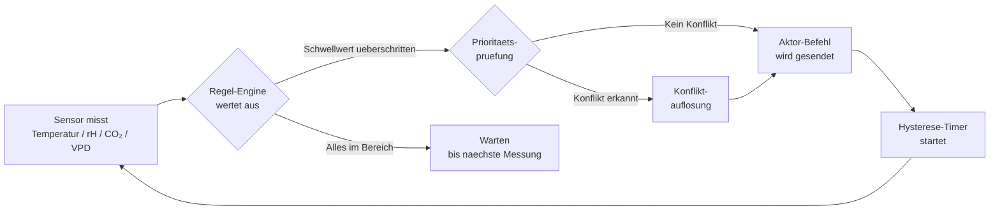
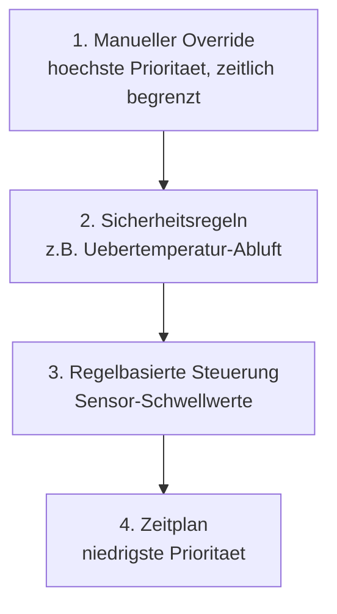

# Umgebungssteuerung & Aktorik

Kamerplanter schliesst den Regelkreis zwischen Sensorik und Aktorik: Das System misst Temperatur, Luftfeuchtigkeit, CO₂ und VPD, bewertet diese Werte anhand deiner Regeln und steuert dann Geraete wie Luefter, Befeuchter oder Bewasserungsventile automatisch. Du kannst jederzeit manuell eingreifen und Automatiken temporaer uebersteuern.

---

## Voraussetzungen

- Mindestens ein Standort (Site/Location) ist eingerichtet — siehe [Standorte & Substrate](locations-substrates.md)
- Sensoren liefern Messwerte — siehe [Sensorik](sensors.md)
- Fuer automatische Steuerung ueber Home Assistant: HA-Integration eingerichtet — siehe [Home Assistant Integration](../guides/home-assistant-integration.md)

---

## Der Sensor-Aktuator-Regelkreis

Jede automatische Steuerungsaktion folgt demselben Kreislauf:



Das System prueft Regeln zyklisch alle 60 Sekunden. Jede ausgefuehrte Aktion wird in der **Steuerungs-Chronik** mit Zeitstempel, Ausloser und Protokoll dauerhaft gespeichert.

---

## Aktoren anlegen

Ein **Aktor** ist ein steuerbares Geraet, das einer Location zugeordnet wird.

### Neuen Aktor anlegen

1. Navigiere zu **Standorte** > gewuenschter Standort > **Aktoren**
2. Klicke auf **Neuer Aktor**
3. Fuelle die Pflichtfelder aus:

    | Feld | Beschreibung | Beispiel |
    |------|-------------|---------|
    | **Name** | Beschreibender Name | Abluftventilator Zelt 1 |
    | **Typ** | Art des Geraets | `exhaust_fan` |
    | **Protokoll** | Kommunikationsweg | `home_assistant` |

4. Je nach Protokoll zusaetzliche Felder ausfullen (siehe unten)

### Protokolle im Vergleich

=== "Home Assistant (empfohlen)"
    Kamerplanter sendet Service-Calls an Home Assistant, das die eigentliche Geraetesteuerung uebernimmt.

    - **HA Entity ID** eingeben (z.B. `switch.exhaust_fan_zelt1`)
    - Bidirektional: HA meldet Zustandsaenderungen zurueck
    - Fallback: Bei HA-Ausfall erzeugt das System automatisch manuelle Aufgaben

    !!! info "HA-Integration nicht aktiviert?"
        Wenn keine HA-Integration eingerichtet ist, werden die HA-spezifischen Felder ausgeblendet. Das System zeigt dann nur MQTT und Manuell als Optionen.

=== "MQTT (direkt)"
    Fuer IoT-Geraete ohne Home-Assistant-Integration.

    - **Command-Topic** eintragen (z.B. `kamerplanter/aktoren/luefter1/set`)
    - **State-Topic** fuer Rueckmeldungen (optional)
    - Geeignet fuer ESPHome-Geraete, Shelly-Schalter, etc.

=== "Manuell (Fallback)"
    Der Aktor existiert im System, wird aber physisch von Hand gesteuert. Statt Befehle zu senden, erzeugt das System **Aufgaben** (REQ-006), die dir sagen, wann du manuell eingreifen sollst.

    !!! tip "Einstieg ohne Smart-Home"
        Der manuelle Modus ist ideal, wenn du noch kein Smart-Home hast. Du bekommst trotzdem regelbasierte Empfehlungen als Aufgabe: "Befeuchter einschalten — VPD liegt bei 1.8 kPa, Ziel: 1.2 kPa".

### Aktor-Typen

| Typ-Schluessel | Geraet | Typische Regelgroesse |
|----------------|--------|----------------------|
| `light` | Hauptbeleuchtung (dimmbar) | Photoperiode, DLI |
| `exhaust_fan` | Abluftventilator | Temperatur, CO₂, VPD |
| `circulation_fan` | Umluftventilator | Zeitplan |
| `humidifier` | Luftbefeuchter | VPD, Luftfeuchtigkeit |
| `dehumidifier` | Entfeuchter | VPD, Luftfeuchtigkeit |
| `heater` | Heizung | Temperatur |
| `co2_doser` | CO₂-Dosiergeraet | CO₂-Konzentration, PPFD |
| `irrigation_valve` | Bewasserungsventil | Substratfeuchte, Zeitplan |
| `dosing_pump` | Dosierpumpe | Zeitplan, EC-Wert |

---

## Zeitplaene einrichten

Zeitplaene sind die einfachste Form der Steuerung — ein Geraet schaltet zu festen Zeiten.

### Neuen Zeitplan anlegen

1. Navigiere zu **Standorte** > Aktor > **Zeitplaene**
2. Klicke auf **Neuer Zeitplan**
3. Waehl den Zeitplan-Typ:

    - **Taeglich** — gleiche Zeiten jeden Tag (z.B. Licht 06:00–00:00)
    - **Woechentlich** — unterschiedliche Zeiten pro Wochentag
    - **Intervall** — alle N Minuten/Stunden (z.B. Bewasserung alle 4h)
    - **Sonnenauf/-untergang** — dynamisch anhand des Standorts

!!! example "Beispiel: 18/6-Lichtprogramm"
    - Typ: Taeglich
    - Ein: 06:00 Uhr
    - Aus: 00:00 Uhr
    - Prioritaet: 10

!!! warning "Wichtig fuer Kurztagspflanzen"
    Kurztagspflanzen (z.B. Cannabis sativa in Blutephase) reagieren empfindlich auf Lichtunterbrechungen. Die Dunkelphase darf nicht unterbrochen werden. Stelle sicher, dass kein anderer Zeitplan oder Sicherheitsregel in die Dunkelphase eingreift.

---

## Regelbasierte Steuerung

Regeln reagieren automatisch auf Sensorwerte. Sie werden nach jeder Messung bewertet.

### Neue Regel anlegen

1. Navigiere zu **Standorte** > gewuenschte Location > **Regeln**
2. Klicke auf **Neue Regel**
3. Konfiguriere Bedingung und Aktion:

    | Feld | Beschreibung | Beispiel |
    |------|-------------|---------|
    | **Sensorwert** | Welche Messgroe wird ueberwacht | VPD |
    | **Bedingung** | Wann soll die Regel ausloesen | `>` 1.5 kPa |
    | **Aktion** | Was soll passieren | Befeuchter einschalten |
    | **Sicherheitsregel** | Hohe Prioritaet, kann nicht deaktiviert werden | Nein |

### Hysterese konfigurieren

Hysterese verhindert, dass ein Aktor zu schnell hin- und herschaltet (Oszillation):

```
Beispiel: VPD-Befeuchter-Regelung

  Einschalten bei: VPD > 1.5 kPa   ← obere Schwelle
  Ausschalten bei: VPD < 1.2 kPa  ← untere Schwelle
  Mindestlaufzeit: 5 Minuten
  Mindestpause:    3 Minuten
```

!!! info "Warum Hysterese wichtig ist"
    Ohne Hysterese wuerde ein Befeuchter bei VPD = 1.5 kPa im Sekundentakt ein- und ausschalten. Das belaestet das Geraet und erzeugt keine stabile Klimazone. Mit Hysterese laeuft der Befeuchter solange, bis der VPD-Wert deutlich unter 1.5 kPa gefallen ist.

### Beispiel-Regeln fuer ein typisches Growzelt

| Regel | Bedingung | Aktion | Typ |
|-------|-----------|--------|-----|
| VPD-Korrektur Befeuchter | VPD > 1.5 kPa | Befeuchter ein | Sensor-Regel |
| VPD-Korrektur Entfeuchter | VPD < 0.8 kPa | Entfeuchter ein | Sensor-Regel |
| Uebertemperatur-Abluft | Temperatur > 30°C | Abluft 100% | **Sicherheitsregel** |
| CO₂-Abluft-Kopplung | CO₂-Doser aktiv | Abluft auf 20% | Sensor-Regel |
| Tank-Schutz | Tankfuellstand < 5% | Bewasserung stoppen | Sicherheitsregel |

---

## Phasengebundene Profile

Das System verknuepft Wachstumsphasen (REQ-003) mit Aktor-Einstellungen. Beim Phasenwechsel werden Lichtprogramm und Klimaziele automatisch angepasst.

!!! example "Beispiel: Uebergang Vegetativ → Blute"
    - Photoperiode wechselt von 18/6 auf 12/12
    - VPD-Ziel sinkt von 1.2 kPa auf 1.0 kPa (engere Stomata in der Blute)
    - CO₂-Ziel steigt von 800 auf 1.000 ppm (hoehere Photosyntheserate)

Graduelle Uebergaenge sind moeglich: Das System kann die Photoperiode ueber 7 Tage von 18h auf 12h reduzieren, statt abrupt umzuschalten.

---

## Das Prioritaetssystem

Wenn mehrere Regeln denselben Aktor gleichzeitig ansprechen, gilt folgende Reihenfolge:



!!! warning "Manueller Override laeuft ab"
    Ein manueller Override ist standardmaessig fuer 2 Stunden aktiv. Danach uebernimmt wieder die Automatik. Du kannst die Dauer beim Setzen des Overrides anpassen.

---

## Graceful Degradation bei HA-Ausfall

Wenn Home Assistant nicht erreichbar ist:

1. Das System erkennt den Verbindungsabbruch innerhalb von 60 Sekunden
2. Fuer jeden betroffenen Aktor wird der **Fail-Safe-Zustand** aktiviert:

    | Aktor-Typ | Fail-Safe-Zustand | Begruendung |
    |-----------|------------------|-------------|
    | Abluftventilator | EIN (100%) | Uebertemperatur verhindern |
    | Heizung | AUS | Brand-/Ueberhitzungsschutz |
    | Bewasserung | AUS | Ueberflutungsschutz |
    | CO₂-Doser | AUS | Vergiftungsschutz |
    | Licht | Letzter Zustand | Dunkelphase kritisch |
    | Dosierpumpe | AUS | Ueberdosierungsschutz |

3. Das System generiert manuelle Aufgaben als Ersatz fuer die ausgefallene Automatik
4. Nach Wiederherstellung der HA-Verbindung werden alle Fail-Safe-Zustaende aufgehoben

---

## Notabschaltung

Fuer Notfallsituationen gibt es vordefinierte Notabschalt-Szenarien:

!!! danger "Notabschaltung ausfuehren"
    Navigiere zu **Standorte** > **Notabschaltung** oder nutze den roten Button im Dashboard.

    | Szenario | Aktion |
    |---------|--------|
    | **Wasseraustritt** | Alle Pumpen und Ventile AUS |
    | **CO₂-Leck** | CO₂-Doser AUS, Abluft 100% |
    | **Brand-Alarm** | Alle Stromverbraucher AUS |

---

## Steuerungs-Chronik

Alle Aktionen werden dauerhaft protokolliert. Navigiere zu **Standorte** > Location > **Chronik**, um zu sehen:

- Zeitstempel der Aktion
- Ausloser (Zeitplan, Regel, Phasenwechsel, manuell, Sicherheit, Fallback)
- Aktor und Befehl
- Protokoll (HA, MQTT, Manuell)
- Erfolgsstatus und ggf. Fehlermeldung

---

## Haeufige Fragen

??? question "Mein Befeuchter schaltet dauerhaft hin und her — was tun?"
    Das ist ein Zeichen fehlender oder zu enger Hysterese. Oeffne die VPD-Befeuchter-Regel und vergroessere den Abstand zwischen Ein- und Ausschaltschwelle. Empfehlung: mindestens 0.3 kPa Abstand. Erhoehe ausserdem die Mindestlaufzeit auf 5–10 Minuten.

??? question "Die Regel wird nicht ausgefuehrt, obwohl der Sensorwert den Schwellwert ueberschreitet."
    Pruefe folgende Punkte: (1) Ist die Regel aktiv? (2) Ist gerade ein manueller Override aktiv? (3) Befindet sich der Aktor noch in der Mindestpause nach dem letzten Schalten? (4) Greift eine hoeher priorisierte Regel ein?

??? question "Kamerplanter kann HA nicht erreichen — was passiert mit meinen Pflanzen?"
    Das System aktiviert automatisch die Fail-Safe-Zustaende und erzeugt manuelle Aufgaben. Der Abluftventilator laeuft z.B. auf 100%, um Uebertemperatur zu verhindern. Du wirst ueber die Benachrichtigungs-Glocke informiert.

??? question "Kann ich Aktoren ohne Home Assistant nutzen?"
    Ja. Waehle als Protokoll MQTT (fuer direkte IoT-Verbindungen) oder Manuell. Im manuellen Modus erzeugt das System Aufgaben statt direkte Befehle zu senden.

---

## Siehe auch

- [Sensorik einrichten](sensors.md)
- [Wachstumsphasen](growth-phases.md)
- [Home Assistant Integration](../guides/home-assistant-integration.md)
- [VPD-Optimierung](../guides/vpd-optimization.md)
- [Tankmanagement](tanks.md)
