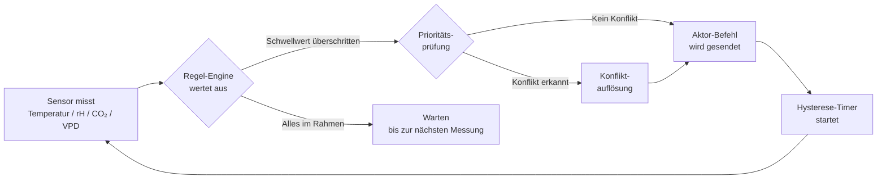
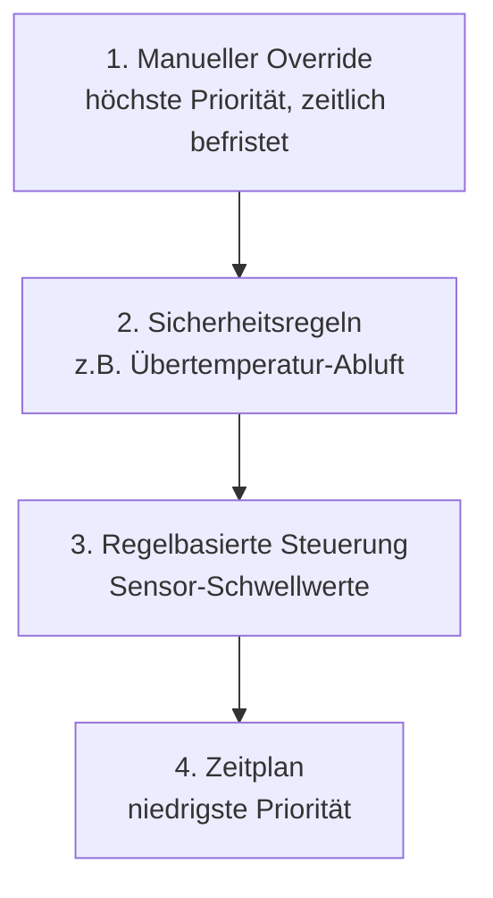

# Umgebungssteuerung & Aktorik

!!! note "Teilweise verfügbar"
    Die automatische Regelschleife (Prioritätssystem, Hysterese, Zeitpläne, Regeln und phasengebundene Klimaprofile) läuft bereits vollständig im Backend. In der Oberfläche kannst du aktuell Aktoren anlegen, direkt ein- und ausschalten sowie eine Notabschaltung auslösen. Zeitpläne, Regeln, phasengebundene Profile, der Sicherheits-Wertebereich eines Aktors und der zeitlich befristete manuelle Override sind bislang nur über die API erreichbar — die betroffenen Abschnitte sind unten einzeln gekennzeichnet. <!-- REQ-018 -->

Kamerplanter schließt den Regelkreis zwischen Sensorik und Aktorik: Das System misst Temperatur, Luftfeuchtigkeit, CO₂ und das Dampfdruckdefizit (VPD), bewertet diese Werte anhand hinterlegter Regeln und steuert darüber Geräte wie Lüfter, Befeuchter oder Bewässerungsventile. Du kannst jederzeit direkt eingreifen, indem du einen Aktor manuell ein- oder ausschaltest.

---

## Voraussetzungen

- Mindestens ein Standort mit einem Bereich (Site & Location) ist eingerichtet — siehe [Standorte & Substrate](locations-substrates.md)
- Für die automatische Steuerung über Home Assistant: HA-Integration eingerichtet — siehe [Home Assistant Integration](../guides/home-assistant-integration.md)
- Für Sensor-Regeln: Sensoren liefern Messwerte — siehe [Sensorik](sensors.md)

---

## Der Sensor-Aktor-Regelkreis

Jede automatische Steuerungsaktion folgt demselben Kreislauf:

<!-- diagram-source: user-described — automatic control loop: sensor reading, rule evaluation, priority check, actuator command, hysteresis timer -->

```mermaid
flowchart LR
    S[Sensor misst<br/>Temperatur / rH / CO₂ / VPD] --> E{Regel-Engine<br/>wertet aus}
    E -->|Schwellwert überschritten| P{Prioritäts-<br/>prüfung}
    E -->|Alles im Rahmen| W[Warten<br/>bis zur nächsten Messung]
    P -->|Kein Konflikt| A[Aktor-Befehl<br/>wird gesendet]
    P -->|Konflikt erkannt| K[Konflikt-<br/>auflösung]
    K --> A
    A --> H[Hysterese-Timer<br/>startet]
    H --> S
```

Das Backend wertet Regeln und Zeitpläne zyklisch alle 30 Sekunden aus. Jeder ausgeführte Befehl wird dauerhaft mit Zeitstempel, Auslöser (Zeitplan, Regel, manuell, Sicherheit, Fallback) und Erfolgsstatus gespeichert — eine eigene Ansicht dafür gibt es in der Oberfläche noch nicht, siehe [Für technische Nutzer / Self-Hoster](#fuer-technische-nutzer-self-hoster).

!!! note "Betreiber-Kill-Switch"
    Ist die automatische Regelschleife von deinem Betreiber nicht aktiviert, wertet das System Zeitpläne und Regeln nicht automatisch aus. Aktoren lassen sich davon unabhängig jederzeit manuell schalten. Details siehe [Für technische Nutzer / Self-Hoster](#fuer-technische-nutzer-self-hoster).

---

## Aktoren anlegen

Ein **Aktor** ist ein steuerbares Gerät (z. B. Lüfter, Licht, Pumpe), das einem Bereich (Location) zugeordnet wird.

### Neuen Aktor anlegen

1. Öffne in der Seitenleiste den Bereich **Umgebungssteuerung** > **Aktorik & Steuerung**.
2. Klicke auf **Aktor anlegen**.
3. Wähle **Standort (Site)** und **Bereich (Location)** und vergib einen **Namen**.
4. Wähle **Aktor-Typ** und **Protokoll** — je nach Protokoll erscheint ein weiteres Pflichtfeld (siehe unten).
5. Optional: **Leistungsaufnahme** (für die Verbrauchsübersicht) und **Notizen**.

### Protokolle im Vergleich

=== "Home Assistant (empfohlen)"
    Kamerplanter sendet Service-Calls an Home Assistant, das die eigentliche Gerätesteuerung übernimmt.

    - **Home-Assistant-Entity-ID** eingeben (z. B. `light.growzelt_1` oder `switch.abluft`)
    - Nur sichtbar, wenn eine HA-Integration eingerichtet ist — ohne sie zeigt das Formular nur MQTT und Manuell als Protokoll an
    - Fallback: Ist Home Assistant beim Senden eines Befehls nicht erreichbar, erzeugt das System automatisch eine Aufgabe zur manuellen Bedienung, statt den Befehl ergebnislos zu verwerfen

=== "MQTT (direkt)"
    Für IoT-Geräte ohne Home-Assistant-Integration.

    - **MQTT-Command-Topic** eingeben (z. B. `growzelt1/aktor1/set`) — das Topic, an das Befehle gesendet werden
    - Geeignet für ESPHome-Geräte, Shelly-Schalter usw.

    !!! info "Noch ohne eigenen MQTT-Broker-Client"
        Ein MQTT-Befehl wird aktuell protokolliert und als gesendet vermerkt — eine eigene Verbindung zu einem MQTT-Broker ist im Backend noch nicht verdrahtet. Die Rückmeldung über ein State-Topic ist im Datenmodell vorgesehen, aber ebenfalls noch nicht angebunden.

=== "Manuell (Fallback)"
    Der Aktor existiert im System, wird aber physisch von Hand gesteuert. Statt Befehle zu senden, erzeugt das System bei jeder Aktion eine **Aufgabe**, die dir sagt, wann du eingreifen sollst. <!-- REQ-006 -->

    !!! tip "Einstieg ohne Smart-Home"
        Der manuelle Modus ist ideal, wenn du noch kein Smart-Home hast. Sobald du den Aktor über die Karte ein- oder ausschaltest, legt das System eine entsprechende Aufgabe an.

### Sicherheits-Wertebereich (Envelope)

!!! info "Nur über API: Min-/Max-Wertebereich konfigurieren"
    Damit ein Aktor einen *numerischen* Befehl entgegennehmen kann (z. B. eine Dimm- oder Prozentstufe), muss zuvor ein gültiger Wertebereich (`min_value`/`max_value`) hinterlegt sein — das Anlegeformular der Oberfläche unterstützt das aktuell noch nicht. Ohne hinterlegten Bereich lehnt das System jeden numerischen Befehl ab (Fehler `422`); reine Ein-/Aus-Befehle sind davon nicht betroffen. Den Bereich setzt du über `PUT /actuators/{key}`, siehe [Für technische Nutzer / Self-Hoster](#fuer-technische-nutzer-self-hoster). Jeder gesendete Wert wird zusätzlich automatisch auf diesen Bereich begrenzt (geklemmt) — ein zu hoher oder zu niedriger Wert erreicht das Gerät nie unverändert.

### Aktor-Typen

<!-- Quelle: src/frontend/src/pages/environment/ActuatorDialog.tsx (ACTUATOR_TYPES), src/frontend/src/i18n/locales/de/translation.json (enums.actuatorType) -->

| Typ-Schlüssel | Gerät |
|----------------|--------|
| `light` | Licht |
| `exhaust_fan` | Abluftventilator |
| `circulation_fan` | Umluftventilator |
| `heater` | Heizung |
| `cooler` | Kühlung |
| `humidifier` | Befeuchter |
| `dehumidifier` | Entfeuchter |
| `co2_doser` | CO₂-Doser |
| `irrigation_valve` | Bewässerungsventil |
| `pump` | Pumpe |
| `dosing_pump` | Dosierpumpe |
| `chiller` | Chiller (Nährlösungskühlung) |
| `air_pump` | Luftpumpe |
| `uv_sterilizer` | UV-Sterilisator |
| `shade_screen` | Schattierung |
| `roof_vent` | Dachlüftung |
| `energy_screen` | Energieschirm |
| `fogger` | Vernebler |
| `generic_switch` | Allgemeiner Schalter |

---

## Aktoren bedienen

Auf der Karte jedes Aktors zeigt Kamerplanter den aktuellen Zustand (Ein/Aus/Störung) sowie ob das Gerät online erreichbar ist.

- **Einschalten** / **Ausschalten** senden sofort einen direkten Befehl an den Aktor — unabhängig davon, was eine Regel oder ein Zeitplan gerade vorsieht.
- Schlägt die Übertragung fehl (z. B. weil Home Assistant nicht erreichbar ist), meldet das System das nicht als Fehler, sondern legt automatisch eine Aufgabe zur manuellen Bedienung an: „Gerät ist nicht direkt erreichbar — der Befehl wurde als Aufgabe zur manuellen Bedienung hinterlegt."

!!! note "Direkter Befehl vs. zeitlich befristeter Override"
    Ein Klick auf **Einschalten**/**Ausschalten** setzt den Zustand sofort, ist aber **nicht** vor der nächsten automatischen Auswertung geschützt: Ist für den Aktor eine Regel oder ein Zeitplan aktiv (aktuell nur über die API einrichtbar), kann diese den Zustand bei der nächsten Auswertung wieder überschreiben. Willst du eine Automatik für eine begrenzte Zeit zuverlässig übersteuern, nutzt du den **zeitlich befristeten manuellen Override** — er hat in der Prioritätsleiter (siehe unten) automatisch Vorrang, ist aber aktuell nur über die API setzbar, siehe [Für technische Nutzer / Self-Hoster](#fuer-technische-nutzer-self-hoster).

---

## Automatische Steuerung: Priorität und Hysterese

Kamerplanter wertet für jeden Aktor zyklisch aus, welche Steuerungsquelle gerade gewinnen soll. Konkurrieren mehrere Quellen um denselben Aktor, gilt folgende Reihenfolge:

<!-- diagram-source: user-described — actuator priority order from manual override down through safety rules, rule-based control, and schedule -->

```mermaid
flowchart TB
    M[1. Manueller Override<br/>höchste Priorität, zeitlich befristet]
    S[2. Sicherheitsregeln<br/>z.B. Übertemperatur-Abluft]
    R[3. Regelbasierte Steuerung<br/>Sensor-Schwellwerte]
    Z[4. Zeitplan<br/>niedrigste Priorität]
    M --> S --> R --> Z
```

Gewinnt eine Regel oder ein Zeitplan, wird der resultierende Befehl an den Aktor gesendet und dabei — genau wie ein direkter Befehl — auf den konfigurierten Sicherheits-Wertebereich begrenzt.

### Hysterese konfigurieren

Sensor-Regeln verwenden **Hysterese**, um zu verhindern, dass ein Aktor bei einem knapp erreichten Schwellwert im Sekundentakt ein- und ausschaltet:

```
Beispiel: VPD-Befeuchter-Regelung

  Einschalten bei: VPD > 1,5 kPa   ← obere Schwelle (on_threshold)
  Ausschalten bei: VPD < 1,2 kPa   ← untere Schwelle (off_threshold)
  Mindestlaufzeit: 5 Minuten        (min_on_duration_seconds)
  Mindestpause:    3 Minuten        (min_off_duration_seconds)
```

!!! info "Warum Hysterese wichtig ist"
    Ohne Hysterese würde ein Befeuchter bei VPD = 1,5 kPa im Sekundentakt ein- und ausschalten. Das belastet das Gerät und erzeugt keine stabile Klimazone. Mit Hysterese läuft der Befeuchter, bis der VPD-Wert deutlich unter 1,5 kPa gefallen ist.

Diese Hysterese-Werte legst du je Regel über die API fest, siehe [Für technische Nutzer / Self-Hoster](#fuer-technische-nutzer-self-hoster) — ein Formular dafür gibt es in der Oberfläche noch nicht.

---

## Wenn Home Assistant nicht erreichbar ist

Schlägt ein Befehl an Home Assistant fehl — egal ob durch einen Klick auf der Karte, eine Regel oder einen Zeitplan ausgelöst —, markiert Kamerplanter den Aktor als **offline** und legt automatisch eine **Aufgabe zur manuellen Bedienung** an, statt den Befehl ergebnislos zu verwerfen. Ist der Aktor selbst mit dem Protokoll **Manuell** konfiguriert, gilt dasselbe für jede Aktion von vornherein — es wird nie ein Live-Befehl gesendet.

!!! warning "Noch nicht implementiert: automatische Fail-Safe-Zustände je Aktor-Typ"
    Für jeden Aktor lässt sich bereits ein individueller Fail-Safe-Zustand hinterlegen (z. B. „Abluft automatisch auf 100 %"). Eine automatische Umschaltung in diesen Zustand bei erkanntem HA-Ausfall — unabhängig von einem konkreten Befehlsversuch — ist geplant, aber noch nicht implementiert. Bis dahin bleibt ein Aktor im zuletzt bekannten Zustand, bis der nächste Befehl (manuell, per Regel oder Zeitplan) fehlschlägt und die Aufgabe erzeugt wird.

---

## Notabschaltung

Für Notfälle gibt es eine sofortige Notabschaltung.

!!! danger "Notabschaltung ausführen"
    Klicke oben auf der Seite **Umgebungssteuerung & Aktorik** auf **Notabschaltung** und bestätige den Dialog. Alle Stromverbraucher (Licht, Heizung, CO₂-Doser, Pumpen, Bewässerung, Dosierpumpe, Befeuchter, Entfeuchter, Kühlung, Luftpumpe, UV-Sterilisator, Vernebler, Abluft- und Umluftventilator) werden sofort abgeschaltet. Diese Aktion kann nicht rückgängig gemacht werden.

Neben diesem Brand-Alarm-Szenario kennt das System zwei weitere, aktuell nur über die API auslösbare Szenarien:

| Szenario | Aktion | Auslösbar über |
|---------|--------|-----------------|
| Brand-Alarm | Alle Stromverbraucher AUS | Button in der Oberfläche oder API |
| Wasseraustritt | Pumpe, Bewässerungsventil, Dosierpumpe AUS | Nur API |
| CO₂-Leck | CO₂-Doser AUS, Abluftventilator EIN | Nur API |

Jeder betroffene Aktor wird **einzeln** angesteuert: Scheitert das Abschalten eines einzelnen Geräts (z. B. weil Home Assistant es gerade nicht erreicht), bricht die Notabschaltung dadurch **nicht** ab — alle anderen Geräte werden trotzdem abgeschaltet. Kamerplanter meldet dir anschließend genau, welche Geräte nicht erreicht wurden, zum Beispiel: „Notabschaltung teilweise ausgeführt: 4 Aktor(en) abgeschaltet, 1 Aktor(en) konnten NICHT abgeschaltet werden (Abluftventilator Zelt 1). Bitte diese Geräte sofort manuell prüfen und trennen." — so weißt du sofort, welches Gerät du von Hand trennen musst.

---

## Für technische Nutzer / Self-Hoster {#fuer-technische-nutzer-self-hoster}

Die folgenden Funktionen sind im Backend bereits vollständig implementiert, aber noch **ohne Bedienoberfläche** — du erreichst sie aktuell nur über die REST-API unter dem mandantenspezifischen Pfad `/api/v1/t/{tenant_slug}/`. Lesende Aufrufe akzeptieren jede aktive Mitgliedschaft; schreibende Aufrufe (Anlegen, Befehl, Override, Regeln, Zeitpläne, Notabschaltung) erfordern mindestens die Rolle **Grower**; das Löschen eines Aktors erfordert **Admin**.

!!! info "Nur über API: Sicherheits-Wertebereich (Envelope)"
    `PUT /actuators/{key}` mit den Feldern `min_value`/`max_value` legt fest, in welchem Bereich ein Aktor numerisch angesteuert werden darf. Ohne konfigurierten Bereich lehnt jeder numerische Befehl mit `422` ab; jeder gesendete Wert wird zusätzlich automatisch auf `[min_value, max_value]` geklemmt.

!!! info "Nur über API: Zeitlich befristeter manueller Override"
    `POST /actuators/{key}/override` mit `expires_at` (Pflichtfeld, ISO-8601-Zeitstempel) sowie optional `override_value` oder `override_state` (`on`/`off`) setzt einen Override, der jede Regel und jeden Zeitplan übersteuert, bis er abläuft. Es gibt **keine** Standarddauer — `expires_at` muss immer explizit in der Zukunft liegen; ein bereits abgelaufener Zeitpunkt wird mit `422` abgelehnt. `DELETE /actuators/{key}/override` hebt einen aktiven Override vorzeitig auf.

!!! info "Nur über API: Zeitpläne"
    `POST /actuators/{key}/schedules` legt einen Zeitplan an (`schedule_type`: `daily`/`weekly`/`interval`/`sunrise_sunset`, `priority` 1–100, `entries` mit `time_on`/`time_off`/optional `value`/`days_of_week`). `GET`/`PUT`/`DELETE` sowie `POST .../toggle` verwalten bestehende Zeitpläne.

!!! info "Nur über API: Regeln und Hysterese"
    `POST /actuators/{key}/rules` legt eine sensorbasierte Regel an: `sensor_parameter` (z. B. `vpd_kpa`), `condition` (Operator `gt`/`lt`/`gte`/`lte`/`between`/`outside` mit Schwellwert oder Bereich), `action` (Befehl plus optionalem Wert) und `hysteresis` (`on_threshold`, `off_threshold`, `min_on_duration_seconds`, `min_off_duration_seconds`, `cooldown_seconds`) sowie `is_safety_rule` für eine höher priorisierte Sicherheitsregel. `POST /rules/{key}/test` prüft eine Regel gegen übergebene Testwerte, ohne sie auszulösen (Trockenlauf).

!!! info "Nur über API: Phasengebundene Profile"
    `POST /phase-control-profiles` legt ein Klimaziel-Profil an (Photoperiode, Licht-PPFD, Tag-/Nacht-Temperatur, Luftfeuchtigkeit, VPD-Ziel, CO₂-Anreicherung, DLI-Ziel u. a.). `POST /phase-control-profiles/{key}/apply` wendet ein Profil auf einen Standort an; `transition_days` steuert einen graduellen Übergang statt eines abrupten Wechsels.

!!! info "Nur über API: Steuerungs-Chronik"
    `GET /actuators/{key}/events` liefert die vollständige, unveränderliche Historie aller ausgeführten Befehle (Zeitstempel, Auslöser, Protokoll, Erfolg/Fehlermeldung) je Aktor. `GET /locations/{location_key}/control-events` liefert dieselbe Historie standortweit; `GET /actuators/{key}/events/stats` liefert eine aggregierte Auswertung.

!!! info "Nur über API: Wasseraustritt- und CO₂-Leck-Notabschaltung"
    Der Notabschaltungs-Button in der Oberfläche löst ausschließlich das Brand-Alarm-Szenario aus. Die beiden anderen vordefinierten Szenarien erreichst du über `POST /emergency-stop` mit `{"scenario": "water_leak"}` bzw. `{"scenario": "co2_leak"}`.

!!! note "Automatische Regelschleife per Betreiber-Kill-Switch"
    Die periodische Auswertung von Regeln/Zeitplänen (alle 30 Sekunden), der stündliche Override-Ablauf und der 5-Minuten-Online/Offline-Abgleich mit Home Assistant laufen nur, wenn der Betreiber `ACTUATOR_CONTROL_LOOP_ENABLED=true` gesetzt hat (Standard: deaktiviert). Direkte Befehle, Overrides und die Notabschaltung funktionieren unabhängig davon jederzeit über die API. Details siehe [Umgebungsvariablen — Umgebungssteuerung & Aktorik](../reference/environment-variables.md#umgebungssteuerung-aktorik-req-018).

---

## Häufige Fragen

??? question "Warum wird mein Klick auf „Einschalten" nach kurzer Zeit wieder rückgängig gemacht?"
    Ist für den Aktor eine Regel oder ein Zeitplan aktiv, kann diese den direkten Befehl bei der nächsten automatischen Auswertung überschreiben. Nutze für eine zuverlässige, zeitlich begrenzte Übersteuerung stattdessen den manuellen Override (aktuell nur über die API, siehe oben) — er hat automatisch Vorrang vor Regeln und Zeitplänen.

??? question "Ich sende einen numerischen Wert an einen Aktor und bekomme einen Fehler — warum?"
    Für den Aktor ist noch kein Sicherheits-Wertebereich (`min_value`/`max_value`) hinterlegt. Ohne diesen Bereich lehnt das System jeden numerischen Befehl ab, damit kein unbegrenzter Wert an die Hardware gelangt. Reine Ein-/Aus-Befehle sind davon nicht betroffen.

??? question "Kamerplanter kann Home Assistant nicht erreichen — was passiert mit meinen Pflanzen?"
    Der fehlgeschlagene Befehl wird nicht verworfen: Kamerplanter markiert den Aktor als offline und legt automatisch eine Aufgabe zur manuellen Bedienung an, damit du eingreifen kannst.

??? question "Kann ich Aktoren ohne Home Assistant nutzen?"
    Ja. Wähle als Protokoll MQTT (für direkte IoT-Verbindungen) oder Manuell. Im manuellen Modus erzeugt das System bei jeder Aktion eine Aufgabe, statt einen direkten Befehl zu senden.

??? question "Was passiert, wenn die Notabschaltung ein Gerät nicht erreicht?"
    Die übrigen Geräte werden trotzdem abgeschaltet — ein einzelnes fehlgeschlagenes Gerät bricht die Notabschaltung nicht ab. Kamerplanter listet dir anschließend namentlich auf, welche Geräte nicht erreicht wurden, damit du sie sofort manuell trennen kannst.

---

## Siehe auch

- [Sensorik einrichten](sensors.md)
- [Wachstumsphasen](growth-phases.md)
- [Home Assistant Integration](../guides/home-assistant-integration.md)
- [VPD-Optimierung](../guides/vpd-optimization.md)
- [Tankmanagement](tanks.md)
