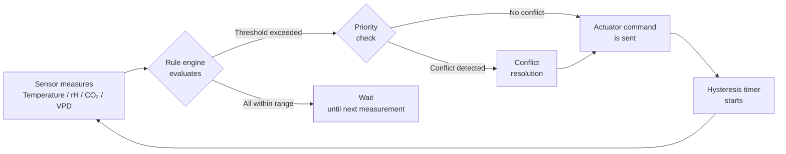
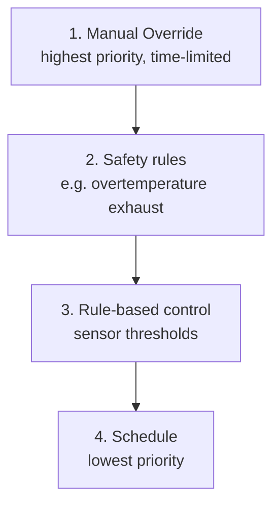

# Umgebungssteuerung & Aktorik

!!! warning "Noch nicht implementiert"
    Diese Funktion ist **spezifiziert aber noch nicht implementiert** (REQ-018). Die Dokumentation beschreibt das geplante Verhalten. Aktuell existiert nur die Home-Assistant-Kommunikationsschicht (Sensor-Daten lesen). Die Regel-Engine, Zeitpläne, Hysterese und Aktor-Steuerung fehlen noch im Code.

Kamerplanter schließt den Regelkreis zwischen Sensorik und Aktorik: Das System misst Temperatur, Luftfeuchtigkeit, CO₂ und VPD, bewertet diese Werte anhand deiner Regeln und steuert dann Geräte wie Lüfter, Befeuchter oder Bewässerungsventile automatisch. Du kannst jederzeit manuell eingreifen und Automatiken temporär übersteuern.

---

## Voraussetzungen

- Mindestens ein Standort (Site/Location) ist eingerichtet — siehe [Standorte & Substrate](locations-substrates.md)
- Sensoren liefern Messwerte — siehe [Sensorik](sensors.md)
- Für automatische Steuerung über Home Assistant: HA-Integration eingerichtet — siehe [Home Assistant Integration](../guides/home-assistant-integration.md)

---

## Der Sensor-Aktuator-Regelkreis

Jede automatische Steuerungsaktion folgt demselben Kreislauf:

<!-- diagram-source: user-described — automatic control loop: sensor reading, rule evaluation, priority check, actuator command, hysteresis timer -->

```mermaid
flowchart LR
    S[Sensor measures<br/>Temperature / rH / CO₂ / VPD] --> E{Rule engine<br/>evaluates}
    E -->|Threshold exceeded| P{Priority<br/>check}
    E -->|All within range| W[Wait<br/>until next measurement]
    P -->|No conflict| A[Actuator command<br/>is sent]
    P -->|Conflict detected| K[Conflict<br/>resolution]
    K --> A
    A --> H[Hysteresis timer<br/>starts]
    H --> S
```

Das System prüft Regeln zyklisch alle 60 Sekunden. Jede ausgeführte Aktion wird in der **Steuerungs-Chronik** mit Zeitstempel, Auslöser und Protokoll dauerhaft gespeichert.

---

## Aktoren anlegen

Ein **Aktor** ist ein steuerbares Gerät, das einer Location zugeordnet wird.

### Neuen Aktor anlegen

1. Navigiere zu **Standorte** > gewünschter Standort > **Aktoren**
2. Klicke auf **Neuer Aktor**
3. Fülle die Pflichtfelder aus:

    | Feld | Beschreibung | Beispiel |
    |------|-------------|---------|
    | **Name** | Beschreibender Name | Abluftventilator Zelt 1 |
    | **Typ** | Art des Geräts | `exhaust_fan` |
    | **Protokoll** | Kommunikationsweg | `home_assistant` |

4. Je nach Protokoll zusätzliche Felder ausfüllen (siehe unten)

### Protokolle im Vergleich

=== "Home Assistant (empfohlen)"
    Kamerplanter sendet Service-Calls an Home Assistant, das die eigentliche Gerätesteuerung übernimmt.

    - **HA Entity ID** eingeben (z.B. `switch.exhaust_fan_zelt1`)
    - Bidirektional: HA meldet Zustandsänderungen zurück
    - Fallback: Bei HA-Ausfall erzeugt das System automatisch manuelle Aufgaben

    !!! info "HA-Integration nicht aktiviert?"
        Wenn keine HA-Integration eingerichtet ist, werden die HA-spezifischen Felder ausgeblendet. Das System zeigt dann nur MQTT und Manuell als Optionen.

=== "MQTT (direkt)"
    Für IoT-Geräte ohne Home-Assistant-Integration.

    - **Command-Topic** eintragen (z.B. `kamerplanter/aktoren/luefter1/set`)
    - **State-Topic** für Rückmeldungen (optional)
    - Geeignet für ESPHome-Geräte, Shelly-Schalter, etc.

=== "Manuell (Fallback)"
    Der Aktor existiert im System, wird aber physisch von Hand gesteuert. Statt Befehle zu senden, erzeugt das System **Aufgaben** (REQ-006), die dir sagen, wann du manuell eingreifen sollst.

    !!! tip "Einstieg ohne Smart-Home"
        Der manuelle Modus ist ideal, wenn du noch kein Smart-Home hast. Du bekommst trotzdem regelbasierte Empfehlungen als Aufgabe: "Befeuchter einschalten — VPD liegt bei 1.8 kPa, Ziel: 1.2 kPa".

### Aktor-Typen

| Typ-Schlüssel | Gerät | Typische Regelgröße |
|----------------|--------|----------------------|
| `light` | Hauptbeleuchtung (dimmbar) | Photoperiode, DLI |
| `exhaust_fan` | Abluftventilator | Temperatur, CO₂, VPD |
| `circulation_fan` | Umluftventilator | Zeitplan |
| `humidifier` | Luftbefeuchter | VPD, Luftfeuchtigkeit |
| `dehumidifier` | Entfeuchter | VPD, Luftfeuchtigkeit |
| `heater` | Heizung | Temperatur |
| `co2_doser` | CO₂-Dosiergerät | CO₂-Konzentration, PPFD |
| `irrigation_valve` | Bewässerungsventil | Substratfeuchte, Zeitplan |
| `dosing_pump` | Dosierpumpe | Zeitplan, EC-Wert |

---

## Zeitpläne einrichten

Zeitpläne sind die einfachste Form der Steuerung — ein Gerät schaltet zu festen Zeiten.

### Neuen Zeitplan anlegen

1. Navigiere zu **Standorte** > Aktor > **Zeitpläne**
2. Klicke auf **Neuer Zeitplan**
3. Wähl den Zeitplan-Typ:

    - **Täglich** — gleiche Zeiten jeden Tag (z.B. Licht 06:00–00:00)
    - **Wöchentlich** — unterschiedliche Zeiten pro Wochentag
    - **Intervall** — alle N Minuten/Stunden (z.B. Bewässerung alle 4h)
    - **Sonnenauf/-untergang** — dynamisch anhand des Standorts

!!! example "Beispiel: 18/6-Lichtprogramm"
    - Typ: Täglich
    - Ein: 06:00 Uhr
    - Aus: 00:00 Uhr
    - Priorität: 10

!!! warning "Wichtig für Kurztagspflanzen"
    Kurztagspflanzen (z.B. Cannabis sativa in Blütephase) reagieren empfindlich auf Lichtunterbrechungen. Die Dunkelphase darf nicht unterbrochen werden. Stelle sicher, dass kein anderer Zeitplan oder keine Sicherheitsregel in die Dunkelphase eingreift.

---

## Regelbasierte Steuerung

Regeln reagieren automatisch auf Sensorwerte. Sie werden nach jeder Messung bewertet.

### Neue Regel anlegen

1. Navigiere zu **Standorte** > gewünschte Location > **Regeln**
2. Klicke auf **Neue Regel**
3. Konfiguriere Bedingung und Aktion:

    | Feld | Beschreibung | Beispiel |
    |------|-------------|---------|
    | **Sensorwert** | Welche Messgröße wird überwacht | VPD |
    | **Bedingung** | Wann soll die Regel auslösen | `>` 1.5 kPa |
    | **Aktion** | Was soll passieren | Befeuchter einschalten |
    | **Sicherheitsregel** | Hohe Priorität, kann nicht deaktiviert werden | Nein |

### Hysterese konfigurieren

Hysterese verhindert, dass ein Aktor zu schnell hin- und herschaltet (Oszillation):

```
Beispiel: VPD-Befeuchter-Regelung

  Einschalten bei: VPD > 1.5 kPa   ← obere Schwelle
  Ausschalten bei: VPD < 1.2 kPa  ← untere Schwelle
  Mindestlaufzeit: 5 Minuten
  Mindestpause:    3 Minuten
```

!!! info "Warum Hysterese wichtig ist"
    Ohne Hysterese würde ein Befeuchter bei VPD = 1.5 kPa im Sekundentakt ein- und ausschalten. Das belastet das Gerät und erzeugt keine stabile Klimazone. Mit Hysterese läuft der Befeuchter solange, bis der VPD-Wert deutlich unter 1.5 kPa gefallen ist.

### Beispiel-Regeln für ein typisches Growzelt

| Regel | Bedingung | Aktion | Typ |
|-------|-----------|--------|-----|
| VPD-Korrektur Befeuchter | VPD > 1.5 kPa | Befeuchter ein | Sensor-Regel |
| VPD-Korrektur Entfeuchter | VPD < 0.8 kPa | Entfeuchter ein | Sensor-Regel |
| Übertemperatur-Abluft | Temperatur > 30°C | Abluft 100% | **Sicherheitsregel** |
| CO₂-Abluft-Kopplung | CO₂-Doser aktiv | Abluft auf 20% | Sensor-Regel |
| Tank-Schutz | Tankfüllstand < 5% | Bewässerung stoppen | Sicherheitsregel |

---

## Phasengebundene Profile

Das System verknüpft Wachstumsphasen (REQ-003) mit Aktor-Einstellungen. Beim Phasenwechsel werden Lichtprogramm und Klimaziele automatisch angepasst.

!!! example "Beispiel: Übergang Vegetativ → Blüte"
    - Photoperiode wechselt von 18/6 auf 12/12
    - VPD-Ziel sinkt von 1.2 kPa auf 1.0 kPa (engere Stomata in der Blüte)
    - CO₂-Ziel steigt von 800 auf 1.000 ppm (höhere Photosyntheserate)

Graduelle Übergänge sind möglich: Das System kann die Photoperiode über 7 Tage von 18h auf 12h reduzieren, statt abrupt umzuschalten.

---

## Das Prioritätssystem

Wenn mehrere Regeln denselben Aktor gleichzeitig ansprechen, gilt folgende Reihenfolge:

<!-- diagram-source: user-described — actuator priority order from manual override down through safety rules, rule-based control, and schedule -->

```mermaid
flowchart TB
    M[1. Manual Override<br/>highest priority, time-limited]
    S[2. Safety rules<br/>e.g. overtemperature exhaust]
    R[3. Rule-based control<br/>sensor thresholds]
    Z[4. Schedule<br/>lowest priority]
    M --> S --> R --> Z
```

!!! warning "Manueller Override läuft ab"
    Ein manueller Override ist standardmäßig für 2 Stunden aktiv. Danach übernimmt wieder die Automatik. Du kannst die Dauer beim Setzen des Overrides anpassen.

---

## Graceful Degradation bei HA-Ausfall

Wenn Home Assistant nicht erreichbar ist:

1. Das System erkennt den Verbindungsabbruch innerhalb von 60 Sekunden
2. Für jeden betroffenen Aktor wird der **Fail-Safe-Zustand** aktiviert:

    | Aktor-Typ | Fail-Safe-Zustand | Begründung |
    |-----------|------------------|-------------|
    | Abluftventilator | EIN (100%) | Übertemperatur verhindern |
    | Heizung | AUS | Brand-/Überhitzungsschutz |
    | Bewässerung | AUS | Überflutungsschutz |
    | CO₂-Doser | AUS | Vergiftungsschutz |
    | Licht | Letzter Zustand | Dunkelphase kritisch |
    | Dosierpumpe | AUS | Überdosierungsschutz |

3. Das System generiert manuelle Aufgaben als Ersatz für die ausgefallene Automatik
4. Nach Wiederherstellung der HA-Verbindung werden alle Fail-Safe-Zustände aufgehoben

---

## Notabschaltung

Für Notfallsituationen gibt es vordefinierte Notabschalt-Szenarien:

!!! danger "Notabschaltung ausführen"
    Navigiere zu **Standorte** > **Notabschaltung** oder nutze den roten Button im Dashboard.

    | Szenario | Aktion |
    |---------|--------|
    | **Wasseraustritt** | Alle Pumpen und Ventile AUS |
    | **CO₂-Leck** | CO₂-Doser AUS, Abluft 100% |
    | **Brand-Alarm** | Alle Stromverbraucher AUS |

---

## Steuerungs-Chronik

Alle Aktionen werden dauerhaft protokolliert. Navigiere zu **Standorte** > Location > **Chronik**, um zu sehen:

- Zeitstempel der Aktion
- Auslöser (Zeitplan, Regel, Phasenwechsel, manuell, Sicherheit, Fallback)
- Aktor und Befehl
- Protokoll (HA, MQTT, Manuell)
- Erfolgsstatus und ggf. Fehlermeldung

---

## Häufige Fragen

??? question "Mein Befeuchter schaltet dauerhaft hin und her — was tun?"
    Das ist ein Zeichen fehlender oder zu enger Hysterese. Öffne die VPD-Befeuchter-Regel und vergrößere den Abstand zwischen Ein- und Ausschaltschwelle. Empfehlung: mindestens 0.3 kPa Abstand. Erhöhe außerdem die Mindestlaufzeit auf 5–10 Minuten.

??? question "Die Regel wird nicht ausgeführt, obwohl der Sensorwert den Schwellwert überschreitet."
    Prüfe folgende Punkte: (1) Ist die Regel aktiv? (2) Ist gerade ein manueller Override aktiv? (3) Befindet sich der Aktor noch in der Mindestpause nach dem letzten Schalten? (4) Greift eine höher priorisierte Regel ein?

??? question "Kamerplanter kann HA nicht erreichen — was passiert mit meinen Pflanzen?"
    Das System aktiviert automatisch die Fail-Safe-Zustände und erzeugt manuelle Aufgaben. Der Abluftventilator läuft z.B. auf 100%, um Übertemperatur zu verhindern. Du wirst über die Benachrichtigungs-Glocke informiert.

??? question "Kann ich Aktoren ohne Home Assistant nutzen?"
    Ja. Wähle als Protokoll MQTT (für direkte IoT-Verbindungen) oder Manuell. Im manuellen Modus erzeugt das System Aufgaben statt direkte Befehle zu senden.

---

## Siehe auch

- [Sensorik einrichten](sensors.md)
- [Wachstumsphasen](growth-phases.md)
- [Home Assistant Integration](../guides/home-assistant-integration.md)
- [VPD-Optimierung](../guides/vpd-optimization.md)
- [Tankmanagement](tanks.md)
