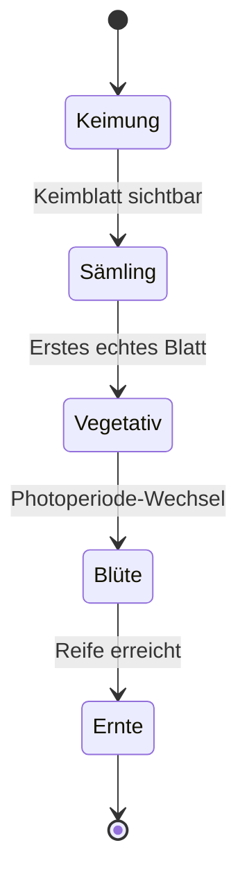

# Wachstumsphasen

Kamerplanter führt jede Pflanze durch definierte Wachstumsphasen: Keimung, Sämling, Vegetativ, Blüte, Ernte. Jede Phase hat eigene VPD-Ziele, Photoperioden-Einstellungen und NPK-Profile.

!!! note "Platzhalter"
    Dieser Inhalt wird in einem folgenden Schritt ausgearbeitet.

## Phasen-Überblick

## Siehe auch

- [Stammdaten](plant-management.md)
- [Dünge-Logik](fertilization.md)
