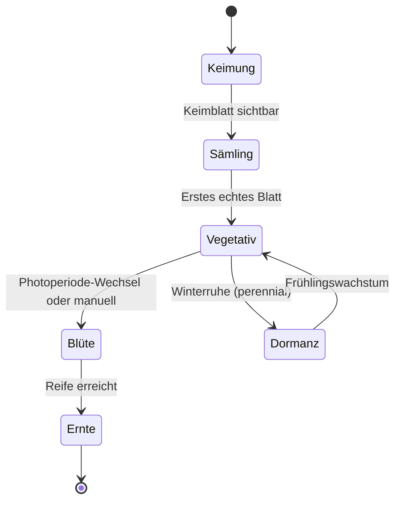

# Wachstumsphasen

Jede Pflanze in Kamerplanter durchläuft eine Abfolge von Wachstumsphasen. Das System passt Empfehlungen für Bewässerung, Düngung, Licht und Umgebungsklima automatisch an die aktuelle Phase an. So stellt Kamerplanter sicher, dass jede Pflanze genau das bekommt, was sie in ihrer aktuellen Entwicklungsstufe braucht.

---

## Voraussetzungen

- Mindestens eine angelegte Pflanze (über Pflanzdurchläufe oder einzeln)
- Sinnvoll: Passende Nährstoffpläne für die jeweiligen Phasen (optional, aber empfohlen)

---

## Die Phasen-Abfolge

Kamerplanter führt jede Pflanze entlang einer festen Phasen-Abfolge. Rückwärts-Übergänge sind nicht möglich — eine Pflanze, die die Blütephase erreicht hat, kann nicht zur vegetativen Phase zurückgehen.

**Erklärung der Phasen:**

| Phase | Beschreibung | Typische Dauer |
|-------|-------------|----------------|
| **Keimung** | Samen keimt, erste Wurzeln und Keimblätter bilden sich | 3–10 Tage |
| **Sämling** | Erste echte Blätter erscheinen, Pflanze ist noch zart | 1–3 Wochen |
| **Vegetativ** | Kräftiges Blatt- und Stammwachstum | 2–8 Wochen |
| **Blüte** | Blütenbildung, Fruchtentwicklung, Aufbau von Aromen und Wirkstoffen | 6–12 Wochen |
| **Ernte** | Pflanze ist erntereif | Erntezeitraum |
| **Dormanz** | Ruhephase für perenniale Pflanzen (z.B. Beerensträucher im Winter) | Saisonal |

!!! note "Nicht alle Phasen sind für jede Pflanze relevant"
    Kräuter wie Basilikum oder Salat haben keine ausgeprägte Blütephase im Sinne von Harzbildung. Für solche Pflanzen konfigurieren die Stammdaten, welche Phasen verfügbar sind und welche übersprungen werden können.

---

## Aktuellen Phasenstand einer Pflanze sehen

1. Navigieren Sie zu **Pflanzen** und öffnen Sie eine Pflanze durch Klick auf ihren Namen.
2. Die Detailseite zeigt oben die aktuelle Phase mit einem farbigen Chip.
3. Der Tab **Wachstumsphasen** zeigt die vollständige Phasenhistorie mit Datum jedes Übergangs.

---

## Eine Phase manuell auslösen

Kamerplanter erkennt nicht automatisch, wann eine Pflanze reif für den nächsten Übergang ist — Sie treffen diese Entscheidung als Gärtner. Das System begleitet Sie dabei mit Informationen und Empfehlungen.

### Schritt 1: Pflanze öffnen

Navigieren Sie zu Ihrer Pflanze und öffnen Sie den Tab **Wachstumsphasen**.

### Schritt 2: Phasenübergang auslösen

Klicken Sie auf **Phase wechseln** (oder den spezifischen Phasennamen, z.B. "Zur Blüte wechseln"). Ein Bestätigungs-Dialog erscheint.

### Schritt 3: Details eingeben

Im Dialog können Sie optionale Details hinterlegen:

- **Datum des Übergangs**: Standardmäßig heute, kann in der Vergangenheit liegen
- **Notizen**: Beobachtungen, die den Übergang begleiten (z.B. "Erste Blütenansätze sichtbar")

### Schritt 4: Bestätigen

Klicken Sie auf **Speichern**. Die Phase wechselt sofort. Die Empfehlungen in der App passen sich automatisch an.

!!! warning "Phasenübergänge sind nicht umkehrbar"
    Sobald eine Pflanze in die nächste Phase gewechselt hat, kann dieser Übergang nicht mehr rückgängig gemacht werden. Überprüfen Sie daher vorher, ob die Pflanze tatsächlich bereit ist.

---

## Batch-Phasenübergang für ganze Gruppen

Wenn Sie mehrere Pflanzen gleichzeitig in die nächste Phase überführen möchten (z.B. 10 Tomaten-Setzlinge gleichzeitig in die vegetative Phase), nutzen Sie Pflanzdurchläufe:

1. Öffnen Sie den entsprechenden **Pflanzdurchlauf** unter **Durchläufe**.
2. Klicken Sie auf **Batch-Phasenwechsel**.
3. Wählen Sie die Zielpflanze(n) und die Zielphase.
4. Bestätigen Sie — alle berechtigten Pflanzen wechseln gleichzeitig.

Mehr dazu: [Pflanzdurchläufe](planting-runs.md)

---

## Phasen-Profile und Empfehlungen verstehen

Jede Phase hat ein eigenes Ressourcen-Profil. Wenn Sie die Detailansicht einer Phase aufrufen (Tab **Wachstumsphasen** → Phase anklicken), sehen Sie die Zielwerte:

### VPD-Zielwert (Dampfdruckdefizit)

Das Dampfdruckdefizit (VPD) beschreibt, wie stark die Luft Feuchtigkeit von den Blättern "zieht". Zu hoch belastet die Pflanze durch Trockenstress, zu niedrig fördert Schimmel.

| Phase | VPD-Ziel |
|-------|---------|
| Keimung / Sämling | 0,4–0,8 kPa |
| Vegetativ | 0,8–1,2 kPa |
| Blüte | 1,0–1,5 kPa |

### Photoperiode

Die Tageslichtlänge (Stunden Licht pro Tag) steuert bei vielen Pflanzen den Übergang in die Blüte.

| Phase | Typische Photoperiode (Kurztagspflanzen) |
|-------|----------------------------------------|
| Vegetativ | 18/6 (18h Licht, 6h Dunkel) |
| Blüte-Einleitung | 12/12 (12h Licht, 12h Dunkel) |

!!! tip "Tipp: Automatische Blüteeinleitung"
    Bei Pflanzen mit hinterlegten Phasen-Definitionen in den Stammdaten zeigt Kamerplanter, ab welcher Tageslichtlänge die Blüte automatisch einsetzt.

### NPK-Profil (Nährstoffverhältnis)

Das Stickstoff-Phosphor-Kalium-Verhältnis ändert sich über die Phasen:

- **Vegetativ**: Viel Stickstoff (N) für Blattwachstum
- **Blüte**: Weniger Stickstoff, mehr Phosphor (P) und Kalium (K)
- **Spätblüte**: Minimaler Stickstoff, hoher PK-Anteil

---

## Perenniale Pflanzen: Dormanz und saisonale Zyklen

Mehrjährige Pflanzen (Zimmerpflanzen, Beerensträucher, Obstbäume) durchlaufen keinen einmaligen Lebenszyklus bis zur Ernte, sondern saisonale Jahreszyklen.

### Dormanz-Phase aktivieren

1. Öffnen Sie die Pflanze und navigieren Sie zu **Wachstumsphasen**.
2. Klicken Sie auf **In Dormanz wechseln** (sichtbar bei perennialen Pflanzen).
3. Bestätigen Sie das Datum des Beginns der Ruhephase.

Während der Dormanz-Phase:
- Werden Düngempfehlungen ausgesetzt
- Werden Bewässerungs-Intervalle verlängert
- Erscheinen saisonale Aufgaben (z.B. "Überwinterungsschutz anbringen")

### Aus der Dormanz zurückkehren

Klicken Sie auf **Wachstum wiederaufnehmen**. Kamerplanter setzt den Zyklus zurück in die vegetative Phase und reaktiviert alle Empfehlungen.

---

## Häufige Fragen

??? question "Was passiert, wenn ich den Phasenübergang zu früh auslöse?"
    Die Empfehlungen passen sich sofort an die neue Phase an. Da Übergänge nicht rückgängig gemacht werden können, empfiehlt sich etwas Geduld und eine gute Beobachtung der Pflanze. Notizen im Phasenübergang helfen später bei der Auswertung.

??? question "Kann ich eigene Phasen definieren?"
    Eigene Phasendefinitionen sind über die Stammdaten der Pflanzenart (Spezies) möglich. Wenden Sie sich an Experten-Einstellungen oder ziehen Sie die Stammdaten-Dokumentation zu Rate.

??? question "Zeigt Kamerplanter an, wann eine Pflanze erntereif ist?"
    Kamerplanter berechnet eine Ernte-Fenster-Vorhersage basierend auf der Anzahl Tage in der Blütephase und den Ernte-Indikatoren (z.B. Trichomfarbe, Pistillfärbung). Diese Prognose ist ein Richtwert — die endgültige Entscheidung treffen Sie.

??? question "Was ist der Unterschied zwischen Flushing und Dormanz?"
    **Flushing** ist eine Erntevorbereitungs-Phase, bei der die Nährstoffzufuhr reduziert wird, bevor die Pflanze geerntet wird. **Dormanz** ist die natürliche Ruhephase mehrjähriger Pflanzen im Winter. Beide Phasen sind im System unterschiedlich und schließen sich gegenseitig aus.

---

## Siehe auch

- [Stammdaten: Pflanzenarten](plant-management.md)
- [Dünge-Logik](fertilization.md)
- [Ernte](harvest.md)
- [Pflanzdurchläufe](planting-runs.md)
