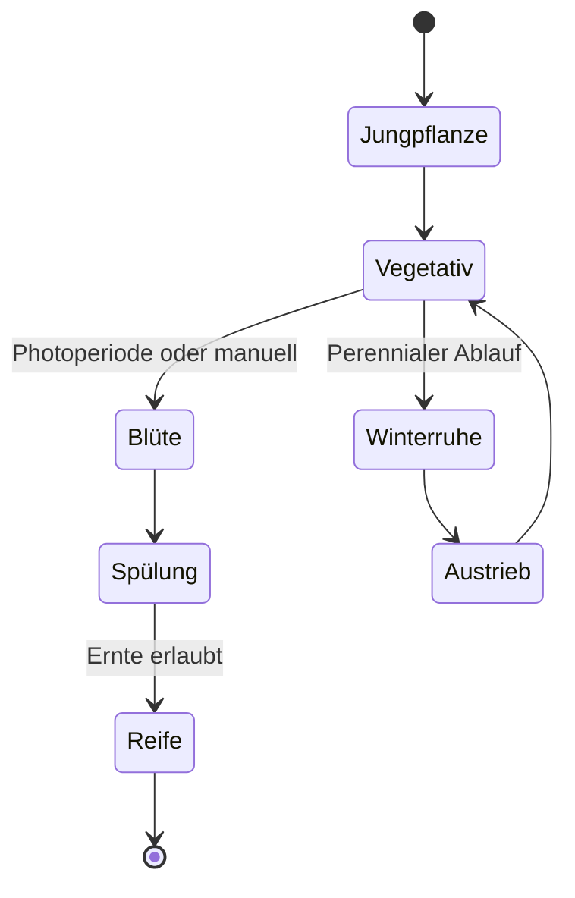

# Wachstumsphasen

Jede Pflanze in Kamerplanter durchläuft eine Abfolge von Wachstumsphasen. Das System passt Empfehlungen für Bewässerung, Düngung, Licht und Umgebungsklima automatisch an die aktuelle Phase an. So stellt Kamerplanter sicher, dass jede Pflanze genau das bekommt, was sie in ihrer aktuellen Entwicklungsstufe braucht.

---

## Voraussetzungen

- Mindestens eine angelegte Pflanze (über Pflanzdurchläufe oder einzeln)
- Sinnvoll: Passende Nährstoffpläne für die jeweiligen Phasen (optional, aber empfohlen)

---

## Die 10 Phasentypen

Kamerplanter bringt zehn vorgefertigte Phasentypen mit. Jede Pflanzenart nutzt nur die für sie sinnvolle Teilmenge — welche das ist, legt der zugewiesene **Phasenablauf** fest (siehe nächster Abschnitt).

<!-- Quelle: src/backend/app/migrations/seed_data/phase_sequences.yaml (phase_definitions) -->

| Phasentyp | Beschreibung | Typische Dauer |
|-----------|-------------|----------------|
| **Keimung** | Samen keimt, erste Wurzeln bilden sich | 7 Tage |
| **Jungpflanze** | Etablierung nach der Keimung, noch zart | 14 Tage |
| **Vegetative Phase** | Aktives Blatt- und Triebwachstum | 45 Tage |
| **Blüte** | Blütenbildung und Bestäubung | 30 Tage |
| **Fruchtentwicklung** | Fruchtbildung nach der Bestäubung | 75 Tage |
| **Reife** | Endreife vor der Ernte | 14 Tage |
| **Winterruhe** (Dormanz) | Ruheperiode für mehrjährige Pflanzen | 120 Tage |
| **Austrieb** | Neuaustrieb nach der Winterruhe | 21 Tage |
| **Blattfall** (Seneszenz) | Laubabwurf, Vorbereitung auf die Ruhephase | 21 Tage |
| **Spülung** (Flushing) | Vorerntespülung mit klarem Wasser | 14 Tage |

Die angegebene Dauer ist ein Richtwert aus der Phasendefinition — einzelne Phasenabläufe können sie überschreiben (siehe unten).

!!! note "„Ernte" ist keine eigene Phase mehr"
    Anders als in früheren Versionen gibt es keine separate Phase namens „Ernte". Stattdessen markiert jede Phasendefinition **innerhalb eines Ablaufs** über das Merkmal „Ernte erlaubt", ob in ihr geerntet werden darf — meist ist das die Phase **Reife**, bei manchen mehrjährigen Kulturen auch **Fruchtentwicklung** direkt. So können auch Pflanzen mit fortlaufender Ernte (z. B. Tomaten, die über Wochen laufend reifen) korrekt abgebildet werden.

---

## Phasenabläufe: Wie eine Art durch die Phasen geführt wird

Ein **Phasenablauf** (Phase Sequence) ist eine geordnete Kette von Phasentypen, die für eine Pflanzenart oder eine Gruppe ähnlicher Arten sinnvoll ist. Kamerplanter liefert 11 vorgefertigte Abläufe mit, zum Beispiel:

| Ablauf | Für | Beispielhafte Phasenkette |
|--------|-----|---------------------------|
| **Indoor-Standard-Zyklus** | Cannabis & ähnliche Indoor-Kulturen | Jungpflanze → Vegetativ → Blüte → Spülung → Reife (Ernte) |
| **Einjährige Erntepflanze** | Salat, Kräuter | Keimung → Jungpflanze → Vegetativ → Reife (Ernte) → Blattfall |
| **Standard Staude** | Mehrjährige Zierpflanzen | Winterruhe → Austrieb → Vegetativ → Blüte → Blattfall (wiederholt sich) |
| **Voller Fruchtzyklus (mehrjährig)** | Obstgehölze mit Fruchtfolge über Jahre | Winterruhe → Austrieb → Vegetativ → Blüte → Fruchtentwicklung → Reife (Ernte) → Blattfall (wiederholt sich) |
| **Zweijährige mit Vernalisation** | Zweijährige Gemüse (z. B. Möhre, Zwiebel zur Samengewinnung) | Keimung → Jungpflanze → Vegetativ → Winterruhe (Kälteperiode) → Blüte → Reife (Ernte) |

<!-- Quelle: src/backend/app/migrations/seed_data/phase_sequences.yaml (phase_sequences) -->

Jeder Ablauf legt pro Phase fest, ob sie **wiederkehrend** ist (mehrjährige Pflanzen durchlaufen den Zyklus erneut), ob sie eine **Endphase** ist (der Ablauf endet dort) und ob in ihr **Ernte erlaubt** ist. Welche Pflanzenart welchen Ablauf nutzt, ist Teil der Lebenszyklus-Konfiguration der Art in den Stammdaten.

<!-- diagram-source: derived from phase_sequences.yaml — indoor_default and perennial_standard sequence patterns -->

```mermaid
stateDiagram-v2
    [*] --> Jungpflanze
    Jungpflanze --> Vegetativ
    Vegetativ --> Blüte : Photoperiode oder manuell
    Blüte --> Spülung
    Spülung --> Reife : Ernte erlaubt
    Reife --> [*]

    Vegetativ --> Winterruhe : Perennialer Ablauf
    Winterruhe --> Austrieb
    Austrieb --> Vegetativ
```

!!! note "Nicht alle Phasen sind für jede Pflanze relevant"
    Kräuter wie Basilikum oder Salat haben keine ausgeprägte Blütephase im Sinne von Harzbildung. Welche Phasen eine Art durchläuft, bestimmt allein ihr zugewiesener Phasenablauf — nicht alle zehn Phasentypen kommen in jedem Ablauf vor.

---

## Phasendefinitionen und -abläufe verwalten

Fortgeschrittene Nutzerinnen und Nutzer können eigene Phasentypen und -abläufe anlegen oder bestehende einsehen:

- **Phasendefinitionen** (`/phasen/definitionen`): Liste aller Phasentypen mit Name, typischer Dauer, Gießintervall und Stresstoleranz. Die zehn mitgelieferten Phasentypen sind als „System"-Einträge markiert und können nicht gelöscht werden, solange sie in einem Ablauf verwendet werden. Eigene Phasentypen lassen sich über **Definition erstellen** ergänzen.
- **Phasenabläufe** (`/phasen/ablaeufe`): Liste aller Phasenabläufe mit Zyklustyp (einjährig, zweijährig, mehrjährig), Anzahl der enthaltenen Phasen und Gesamtdauer. In der Detailansicht eines Ablaufs fügst du Phasen hinzu, änderst ihre Reihenfolge (Pfeile „Nach oben"/„Nach unten") und legst pro Phase fest, ob sie eine **Endphase**, **wiederkehrend** ist oder **Ernte erlaubt**. Bei wiederholenden Abläufen bestimmst du zusätzlich, bei welcher Phase der Zyklus nach der Endphase erneut beginnt.

Beide Seiten findest du in der Navigation unter **Phasen**. Da hier grundlegende Systemdaten bearbeitet werden, sind sie wie andere Stammdaten-Bereiche eher für fortgeschrittene Nutzerinnen und Nutzer gedacht.

### Detailansicht einer Phasendefinition {#phasendefinition-detailansicht}

Öffnest du eine einzelne Phasendefinition aus der Liste, dient die Detailseite gleich zwei Zwecken: Sie ist ein Nachschlagewerk für die Phase selbst (typische Dauer, Gießintervall, Stresstoleranz, Beschreibung) **und** eine Betriebsansicht deiner Pflanzen, die sich gerade in dieser Phase befinden. Neben den Basis-Eigenschaften und den Phasenabläufen, die diese Definition verwenden, zeigt sie zwei weitere Listen:

- **Pflanzen aktuell in dieser Phase**: deine aktiven Pflanzen, die sich gerade in dieser Phase befinden — mit Pflanze, Art, Standort/Platz, dem Datum „In Phase seit" und den seither vergangenen Tagen in Phase. Ein Zähler neben der Überschrift zeigt die Gesamtzahl. Klicke auf eine Zeile, um direkt zur Detailseite dieser Pflanze zu gelangen. Befindet sich aktuell keine deiner Pflanzen in dieser Phase, erscheint stattdessen ein Hinweistext.
- **Arten, die diese Phase durchlaufen**: alle Arten aus dem globalen Katalog, deren Phasenablauf diese Phase enthält — mit wissenschaftlichem Namen, gebräuchlichem Namen und der für die Phase jeweils typischen Dauer. Klicke auf eine Zeile, um zur Detailseite dieser Art zu gelangen. Sind für die Phase keine Arten hinterlegt, erscheint auch hier ein Hinweistext.

!!! tip "Zwei unterschiedliche Blickwinkel auf dieselbe Phase"
    Die erste Liste beantwortet „Um welche meiner Pflanzen muss ich mich gerade kümmern?", die zweite „Welche Arten durchlaufen diese Phase grundsätzlich?". Beide Listen sind unabhängig voneinander: Die erste zeigt nur deine eigenen, aktiven Pflanzen; die zweite den kompletten, mandantenübergreifenden Artenkatalog.

---

## Aktuellen Phasenstand einer Pflanze sehen

1. Navigiere zu **Pflanzen** und öffne eine Pflanze durch Klick auf ihren Namen.
2. Die Detailseite zeigt oben die aktuelle Phase mit einem farbigen Chip.
3. Der Tab **Wachstumsphasen** zeigt die vollständige Phasenhistorie mit Datum jedes Übergangs.

---

## Automatische Phasenübergänge {#automatische-phasenuebergaenge}

Neben dem manuellen Wechsel (siehe unten) kann ein Phasenübergang in einem Phasenablauf auch automatisch ausgelöst werden. Kamerplanter unterstützt drei Auslösearten:

- **Zeitbasiert**: Der Übergang erfolgt automatisch, sobald eine Pflanze eine festgelegte Anzahl von Tagen in ihrer aktuellen Phase verbracht hat.
- **Photoperiodisch**: Der Übergang in die Blüte erfolgt, sobald die maßgebliche Tageslänge (Stunden Licht pro Tag) einen artspezifischen Schwellenwert unterschreitet (Kurztagspflanzen) bzw. überschreitet (Langtagspflanzen). Kamerplanter ermittelt diese Tageslänge auf zwei Wegen: Bei **Indoor-Pflanzen** wird sie aus dem Lichtprogramm des Standorts abgeleitet (Einschalt-/Ausschaltzeit des Kunstlichts, z. B. 12/12 zur Blüteeinleitung). Bei **Outdoor-Pflanzen** wird sie aus der astronomischen Tageslänge am Standort berechnet, wofür GPS-Koordinaten hinterlegt sein müssen (siehe [Standorte und Substrate](locations-substrates.md)). Steht für einen künstlich beleuchteten Standort ein gültiges Lichtprogramm bereit, hat dieses Vorrang — eine künstlich beleuchtete Pflanze erlebt nicht die natürliche Tageslänge.
- **Vernalisationsbasiert**: Bei zweijährigen Pflanzen mit Kälteperiode (z. B. Möhre zur Samengewinnung) zählt Kamerplanter kalte Tage; ist die artspezifische Mindestanzahl erreicht, wird der Übergang aus der Winterruhe in die Blüte automatisch freigegeben.

Bei Pflanzenarten mit einer sogenannten „unbestimmten" (indeterminaten) Wuchsform — dazu zählen z. B. viele Tomaten-, Paprika- und Gurkensorten sowie zahlreiche Zimmerpflanzen — unterdrückt Kamerplanter automatische Weiterschaltungen, sobald die Pflanze ihre stabile, dauerhaft produktive Phase erreicht hat. Statt linear weiter Richtung Fruchtreife und Lebensende zu schalten, bleibt die Pflanze in dieser einen Phase, in der Wachstum, Blüte und Fruchtansatz gleichzeitig weiterlaufen und laufend geerntet werden kann.

!!! note "Teilweise verfügbar: Einstufung als „unbestimmt" (indeterminate)"
    Die Logik zur Erkennung und Unterdrückung der automatischen Weiterschaltung ist vollständig implementiert und für die unbestimmt wachsenden Arten Tomate, Paprika und Gurke bereits aktiviert. Ob eine Art als „bestimmt" (determinate), „unbestimmt" (indeterminate) oder „halb-unbestimmt" (semi-determinate) eingestuft ist, lässt sich aktuell aber noch nicht über die Oberfläche oder die öffentliche API pflegen — die Einstufung ist Teil der Lebenszyklus-Konfiguration und wird für weitere Arten schrittweise ergänzt. <!-- REQ-003 E4 -->

!!! note "Teilweise verfügbar"
    Die Auswertungslogik für automatische Übergänge ist vollständig implementiert. Ob und wie oft dein Kamerplanter-Betreiber die Hintergrundprüfung tatsächlich einplant, hängt von der jeweiligen Installation ab. Verlasse dich sicherheitshalber nicht ausschließlich auf automatische Übergänge — kontrolliere den Phasenstand deiner Pflanzen regelmäßig und löse Übergänge bei Bedarf manuell aus (siehe unten).

---

## Eine Phase manuell auslösen

Du kannst einen Phasenübergang jederzeit manuell auslösen, unabhängig davon, ob für die Phase auch automatische Übergänge konfiguriert sind — zum Beispiel, wenn du eine Pflanze anhand eigener Beobachtung früher oder später als vom System vorgeschlagen umstellen möchtest.

### Schritt 1: Pflanze öffnen

Navigiere zu deiner Pflanze und öffne den Tab **Wachstumsphasen**.

### Schritt 2: Phasenübergang auslösen

Klicke auf **Phase wechseln** (oder den spezifischen Phasennamen, z.B. "Zur Blüte wechseln"). Ein Bestätigungs-Dialog erscheint.

### Schritt 3: Details eingeben

Im Dialog kannst du optionale Details hinterlegen:

- **Datum des Übergangs**: Standardmäßig heute, kann in der Vergangenheit liegen
- **Notizen**: Beobachtungen, die den Übergang begleiten (z.B. "Erste Blütenansätze sichtbar")

### Schritt 4: Bestätigen

Klicke auf **Speichern**. Die Phase wechselt sofort. Die Empfehlungen in der App passen sich automatisch an.

!!! warning "Phasenübergänge sind nicht umkehrbar"
    Sobald eine Pflanze in die nächste Phase gewechselt hat, kann dieser Übergang nicht mehr rückgängig gemacht werden. Überprüfe daher vorher, ob die Pflanze tatsächlich bereit ist.

---

## Batch-Phasenübergang für ganze Gruppen

Gehört eine Pflanze zu einem aktiven Pflanzdurchlauf, teilt sie sich die Phase mit allen anderen Pflanzen dieses Durchlaufs — die Phase wird auf Ebene des Durchlaufs geführt, nicht pro Einzelpflanze. Ein Phasenwechsel wirkt sich deshalb immer auf **alle** Pflanzen des Durchlaufs gleichzeitig aus; eine Auswahl einzelner Pflanzen ist beim Batch-Übergang nicht vorgesehen.

1. Öffne den entsprechenden **Pflanzdurchlauf** unter **Durchläufe**.
2. Klicke auf **Batch-Phasenwechsel**.
3. Wähle die Zielphase (z.B. "Vegetativ" → "Blüte").
4. Bestätige — alle Pflanzen des Durchlaufs wechseln gemeinsam.

Mehr dazu: [Pflanzdurchläufe](planting-runs.md)

### Warum sich einzelne Pflanzen im Durchlauf nicht separat wechseln lassen

Solange eine Pflanze einem aktiven oder geplanten Pflanzdurchlauf angehört, ist ein direkter Phasenwechsel an der Einzelpflanze gesperrt — die App meldet in diesem Fall einen Konflikt (Fehlercode `phase.run_owned`). Der Hintergrund: Durchlauf und Einzelpflanze sollen nicht auseinanderlaufen. Möchtest du eine Pflanze unabhängig von der Gruppe weiterentwickeln, löse sie zuerst aus dem Durchlauf (siehe [Einzelne Pflanzen aus dem Durchlauf lösen](planting-runs.md#einzelne-pflanzen-aus-dem-durchlauf-lösen)) und wechsle danach ihre Phase individuell.

---

## Phasen-Profile und Empfehlungen verstehen

Jede Phase hat ein eigenes Ressourcen-Profil. Wenn du die Detailansicht einer Phase aufrufst (Tab **Wachstumsphasen** → Phase anklicken), siehst du die Zielwerte:

### VPD-Zielwert (Dampfdruckdefizit)

Das Dampfdruckdefizit (VPD) beschreibt, wie stark die Luft Feuchtigkeit von den Blättern "zieht". Zu hoch belastet die Pflanze durch Trockenstress, zu niedrig fördert Schimmel.

| Phase | VPD-Ziel |
|-------|---------|
| Keimung / Jungpflanze | 0,4–0,8 kPa |
| Vegetativ | 0,8–1,2 kPa |
| Blüte | 1,0–1,5 kPa |

### Photoperiode

Die Tageslichtlänge (Stunden Licht pro Tag) steuert bei vielen Pflanzen den Übergang in die Blüte.

| Phase | Typische Photoperiode (Kurztagspflanzen) |
|-------|----------------------------------------|
| Vegetativ | 18/6 (18h Licht, 6h Dunkel) |
| Blüte-Einleitung | 12/12 (12h Licht, 12h Dunkel) |

!!! tip "Tipp: Automatische Blüteeinleitung"
    Bei Pflanzen mit hinterlegten Phasen-Definitionen kann die Blüte photoperiodisch ausgelöst werden — indoor aus dem Lichtprogramm des Standorts, outdoor aus der astronomischen Tageslänge bei hinterlegten GPS-Koordinaten (siehe [Automatische Phasenübergänge](#automatische-phasenuebergaenge)).

### Bewässerungsmenge je Phase {#bewaesserungsmenge-je-phase}

Die empfohlene Gießmenge auf der Pflanzen-Detailseite passt sich automatisch an die aktuelle Phase an:

- **Keimung und Jungpflanze**: häufig, aber wenig Wasser pro Gießvorgang — die junge Wurzel verträgt noch keine großen Mengen.
- **Blüte und Spülung (Flush)**: erhöhtes Volumen.
- **Ruhephase (Winterruhe)**: minimale Wassermenge, nur zur Substraterhaltung.
- **Trockenlagerung** (z. B. ruhende Zwiebeln/Knollen): keine Bewässerung.

Spülung und Ruhephase sind zusätzlich mit dem Chip „**Nur Wasser — kein Dünger**" gekennzeichnet: In diesen Phasen wird zwar gegossen, aber nicht gedüngt — beim Flush, um vor der Ernte Restsalze aus dem Substrat zu waschen, in der Ruhephase, weil das Wachstum pausiert.

Zwei weitere Faktoren wirken auf die vorgeschlagene Menge:

- Die **Staunässe-Toleranz** der Pflanzenart begrenzt die Menge nach oben — staunässe-empfindliche Arten bekommen weniger, tolerante etwas mehr vorgeschlagen.
- Ein am Standort eingerichteter **Live-Bodenfeuchte-Sensor** (siehe [Sensorik](sensors.md)) reduziert die vorgeschlagene Menge automatisch, wenn der Boden bereits feucht ist; ein Hinweistext auf der Detailseite macht das kenntlich.

!!! warning "Noch nicht implementiert"
    Eine zusätzliche, verdunstungsbasierte Anpassung dieser Empfehlung anhand von Live-Wetterdaten ist als Erweiterungspunkt vorbereitet, bezieht aber noch keine echten Wetterdaten ein. <!-- REQ-037 -->

### NPK-Profil (Nährstoffverhältnis) {#npk-profil}

Das Stickstoff-Phosphor-Kalium-Verhältnis ändert sich über die Phasen:

- **Vegetativ**: Viel Stickstoff (N) für Blattwachstum
- **Blüte**: Weniger Stickstoff, mehr Phosphor (P) und Kalium (K)
- **Spätblüte**: Minimaler Stickstoff, hoher PK-Anteil
- **Spülung (Flush) und Ruhephase**: keine Düngung (NPK 0:0:0) — die Nährstoff-Ansicht der Phase zeigt dafür den Chip „**Keine Düngung (Flush / Ruhephase)**".

Jede Phase hat außerdem einen hinterlegten Ziel-pH-Wert für die Nährlösung. Der pH-Wert beeinflusst, wie gut einzelne Mikronährstoffe (Eisen, Mangan, Zink, Kupfer, Bor) von der Pflanze aufgenommen werden können: Außerhalb eines optimalen Fensters von pH 6,0–6,5 sperren sich diese Mikronährstoffe zunehmend aus (Chlorose-Risiko — helle, gelbliche Blattadern), während sich Molybdän gegenläufig verhält und bei steigendem pH besser verfügbar wird. Liegt der Ziel-pH einer Phase außerhalb dieses Fensters, zeigt Kamerplanter das in der Nährstoff-Ansicht der Phase (Tab **Wachstumsphasen** → Phase anklicken) als Warnung „**Spurennährstoffe blockiert (pH-Sperre)**" mit einer laienverständlichen Erklärung an. <!-- REQ-003 E8 -->

### Geplantes und vorzeitiges Schossen unterscheiden

Bei manchen zweijährigen Kulturen (z. B. Blattgemüse wie Spinat oder Salat) kann Hitze- oder Langtag-Stress dazu führen, dass eine Pflanze deutlich früher als geplant Richtung Blüte „schießt" und dadurch ihr Erntefenster verliert. Kamerplanter unterscheidet einen solchen stressbedingten, vorzeitigen Übergang von einem planmäßigen Schossen — etwa der regulären Blüteinleitung im zweiten Standjahr bei zweijährigen Kulturen mit Kälteperiode.

!!! note "Teilweise verfügbar: Kennzeichnung vorzeitiger Übergänge"
    Kamerplanter erkennt und vermerkt einen stressbedingt vorzeitigen Phasenübergang in der Phasenhistorie, unterschieden von einem planmäßigen Übergang; bei Spinat ist ein solcher langtag-getriggerter Schoss-Übergang bereits hinterlegt. Eine eigene Kennzeichnung dafür in der Phasenverlauf-Ansicht der Oberfläche (z. B. ein Hinweis-Chip) gibt es aktuell aber noch nicht. <!-- REQ-003 E6 -->

---

## Perenniale Pflanzen: Dormanz und saisonale Zyklen

Mehrjährige Pflanzen (Zimmerpflanzen, Beerensträucher, Obstbäume) nutzen einen wiederkehrenden Phasenablauf statt eines einmaligen Lebenszyklus bis zur Ernte — sie durchlaufen Winterruhe, Austrieb, Wachstum und Blüte in jährlicher Wiederholung.

### Dormanz-Phase aktivieren

1. Öffne die Pflanze und navigiere zu **Wachstumsphasen**.
2. Klicke auf **In Dormanz wechseln** (sichtbar bei perennialen Pflanzen).
3. Bestätige das Datum des Beginns der Ruhephase.

Während der Winterruhe:
- Werden Düngempfehlungen ausgesetzt
- Werden Bewässerungs-Intervalle verlängert
- Erscheinen saisonale Aufgaben (z.B. "Überwinterungsschutz anbringen")

### Aus der Dormanz zurückkehren

Klicke auf **Wachstum wiederaufnehmen**. Kamerplanter setzt den Zyklus zurück in die vegetative Phase (bzw. Austrieb, je nach zugewiesenem Ablauf) und reaktiviert alle Empfehlungen.

---

## Botanischer Lebenszyklus vs. Anbau-Zyklustyp {#botanischer-lebenszyklus-vs-anbau-zyklustyp}

Manche Pflanzenarten sind botanisch mehrjährig, werden im praktischen Anbau aber wie einjährige Pflanzen behandelt — bekanntestes Beispiel ist die Tomate: Botanisch eine ausdauernde Staude, wird sie wegen ihrer Frostempfindlichkeit in gemäßigten Klimazonen fast immer nach einer Saison entsorgt statt überwintert.

Kamerplanter unterscheidet dafür zwei Felder in der Lebenszyklus-Konfiguration einer Art (Detailseite der Art → Tab **Lebenszyklus-Konfiguration**):

- **Zyklustyp** (`cycle_type`) — der **botanische** Lebenszyklus der Art: Einjährig, Zweijährig oder Mehrjährig.
- **Anbau-Zyklustyp** (`cultivation_cycle_type`) — wie die Art in Kamerplanter **tatsächlich kultiviert** wird. Bleibt das Feld leer, gilt für die Kultur automatisch der botanische Zyklustyp; abweichend gesetzt bildet es Fälle wie die Tomate ab.

### Der Hinweis „Wird als einjährig kultiviert"

Weicht der Anbau-Zyklustyp vom botanischen Zyklustyp ab — konkret: Die Art wird als „Einjährig" kultiviert, obwohl ihr Zyklustyp nicht „Einjährig" ist — zeigt Kamerplanter im Tab **Lebenszyklus-Konfiguration** direkt unterhalb der beiden Zyklustyp-Felder automatisch den Info-Chip **„Wird als einjährig kultiviert"** an.

!!! example "Beispiel: Tomate"
    Tomate ist botanisch mehrjährig, wird aber praktisch fast immer einjährig kultiviert (frostempfindlich, meist ohne Überwinterung). Für die Tomate zeigt Kamerplanter daher den Chip „Wird als einjährig kultiviert" an.

!!! note "Rein informativ, nicht bearbeitbar"
    Der Chip ist ein abgeleiteter Hinweis, der ausschließlich aus **Zyklustyp** und **Anbau-Zyklustyp** berechnet wird — er lässt sich nicht selbst anklicken oder bearbeiten und ist unabhängig von deiner Erfahrungsstufe sichtbar, sobald die Abweichung zutrifft. Um den Hinweis verschwinden zu lassen, änderst du stattdessen eines der beiden zugrunde liegenden Felder. <!-- REQ-001 / REQ-003 -->

---

## Monokarpische Pflanzen: Einmalige Blüte und automatische Kindel-Fortführung {#monokarpische-pflanzen}

Manche Pflanzenarten sind **monokarpisch**: Sie blühen genau einmal in ihrem Leben und sterben danach ab — bekannte Beispiele sind viele Agaven, Bromelien und Guzmanien. In der Lebenszyklus-Konfiguration einer Art ist das als **Blühstrategie „Monokarp (blüht einmal)"** hinterlegt, im Unterschied zu „Polykarp (blüht mehrfach)" bei Pflanzen, die über mehrere Jahre wiederholt blühen.

Für monokarpische Arten bildet Kamerplanter die Fortführung der Kultur **nicht** als neuen Zyklus derselben Pflanze ab, sondern über eine eigenständige Nachfolgepflanze: Sobald eine monokarpische Mutterpflanze automatisch in ihre letzte Blühphase wechselt (Blüte, Fruchtentwicklung oder Reife — je nachdem, wie ihr Phasenablauf endet), erzeugt Kamerplanter automatisch genau eine neue Pflanzeninstanz, das **Kindel** (den klonalen Ableger), und verknüpft es mit der Mutterpflanze.

!!! note "Kein Zyklus-Neustart"
    Die Mutterpflanze wird dabei **nicht** zurückgesetzt und startet auch keinen neuen Anbauzyklus — sie welkt seneszent aus und behält bis zu ihrer Entfernung (siehe [Eine Pflanze entfernen](#pflanze-entfernen)) ihren bisherigen Standort und Platz. Die Fortführung der Kultur geschieht ausschließlich über das neu angelegte Kindel.

Das Kindel übernimmt beim automatischen Anlegen:

- Mandant, Pflanzenart und Sorte der Mutterpflanze
- den Standort der Mutterpflanze — aber **keinen** festen Platz, denn die Mutterpflanze belegt ihren Platz weiter, während sie auswelkt
- als Pflanzdatum das Datum des automatischen Übergangs

Es startet in der Phase **Kindel-Etablierung**, sofern der Phasenablauf der Art eine solche Phase kennt — andernfalls in der ersten Phase des Ablaufs.

In der Detailansicht des Kindels erscheint dafür ein Abstammungs-Link **„Kindel von …"**, der zur Mutterpflanze führt.

!!! tip "Wiederholte Auswertung erzeugt kein zweites Kindel"
    Wird der automatische Übergang für dieselbe Mutterpflanze erneut ausgewertet, legt Kamerplanter kein zweites Kindel und keine doppelte Abstammungsverknüpfung an.

Mehr zur Vermehrungshistorie und den übrigen (manuellen) Vermehrungsmethoden: [Vermehrungsmanagement — Automatische Kindel-Fortführung bei monokarpischen Pflanzen](propagation.md#automatische-kindel-fortfuehrung). <!-- REQ-003 D10 / REQ-017 -->

---

## Eine Pflanze entfernen: Abschlussart und Verlustursache erfassen {#pflanze-entfernen}

Wenn eine Pflanze das Ende ihres Lebenszyklus erreicht hat — sei es durch Ernte, natürliches Absterben oder einen unerwarteten Verlust — entfernst du sie über den Button **Pflanze entfernen** auf ihrer Detailseite. Dabei kannst du optional festhalten, **wie** der Lebenszyklus geendet hat. <!-- REQ-003 E5 -->

### Schritt 1: Detailseite öffnen

Navigiere zu **Pflanzen → Pflanzeninstanzen** und öffne die betreffende Pflanze.

### Schritt 2: Entfernen-Dialog öffnen

Klicke auf **Pflanze entfernen**. Ein Dialog fragt, wie der Lebenszyklus der Pflanze geendet ist.

### Schritt 3: Abschlussart wählen (optional)

| Abschlussart | Bedeutung |
|--------------|-----------|
| Ohne Angabe (einfach entfernen) | Die Pflanze wird ohne Klassifizierung entfernt (bisheriges Verhalten) |
| Geerntet | Planmäßiges Ende nach der Ernte |
| Natürlich abgestorben (Seneszenz) | Planmäßiges Ende am natürlichen Zyklusende |
| Verlust (eingegangen) | Ungeplanter Ausfall — fragt zusätzlich nach der Verlustursache |
| Abgebrochen | Du brichst die Kultur bewusst vorzeitig ab |

!!! tip "Die Angabe ist freiwillig"
    Du kannst den Dialog auch ohne Auswahl bestätigen — die Pflanze wird dann wie bisher einfach als entfernt markiert, ohne dass eine Abschlussart erfasst wird.

### Schritt 4: Bei „Verlust" die Ursache angeben

Wählst du **Verlust (eingegangen)**, musst du zusätzlich eine Verlustursache angeben, bevor du bestätigen kannst:

| Verlustursache | Beispiel |
|----------------|---------|
| Krankheit | Pilzbefall, Wurzelfäule |
| Schädlingsbefall | Spinnmilben, Blattläuse |
| Frost | Unerwarteter Kälteeinbruch |
| Hitze | Hitzestress, Sonnenbrand |
| Trockenheit | Zu selten gegossen |
| Staunässe | Substrat dauerhaft zu nass |
| Vernachlässigung | Längere Abwesenheit ohne Vertretung |
| Mechanischer Schaden | Abgebrochen, umgeknickt |
| Unbekannt | Ursache lässt sich nicht mehr bestimmen |

!!! note "Die aktuelle Wachstumsphase wird eingefroren"
    Klassifizierst du eine Pflanze als „Verlust", friert Kamerplanter ihre aktuelle Wachstumsphase ein: Der offene Phasenhistorie-Eintrag wird geschlossen, aber es findet **kein** automatischer Übergang in eine Blattfall-/Seneszenz-Phase statt. So bleibt erkennbar, in welcher Phase der Verlust tatsächlich aufgetreten ist — eine wichtige Grundlage für die [Verlustursachen-Auswertung](#ueberlebensrate-verlustursachen) weiter unten.

### Schritt 5: Bestätigen

Klicke auf **Pflanze entfernen**. Offene Aufgaben und Pflegeerinnerungen dieser Pflanze werden dabei automatisch aus der Warteschlange entfernt; bereits erledigte oder übersprungene Aufgaben bleiben als Verlauf erhalten. <!-- REQ-022 -->

!!! warning "Nicht rückgängig zu machen"
    Eine entfernte Pflanze lässt sich nicht wieder aktivieren, und die einmal gewählte Abschlussart/Verlustursache lässt sich danach nicht mehr bearbeiten. Prüfe die Angaben daher vor dem Bestätigen.

---

## Überlebensrate und Verlustursachen auswerten {#ueberlebensrate-verlustursachen}

Auf der Übersichtsseite **Pflanzen → Pflanzeninstanzen** zeigt Kamerplanter eine zusammenfassende Auswertung aller angelegten Pflanzen, sobald mindestens eine Pflanze existiert: die **Überlebensrate** — der Anteil aller Pflanzen, die **nicht** als ungeplanter Verlust geendet haben — sowie eine Aufschlüsselung nach Abschlussart, Wachstumsphase und Verlustursache. <!-- REQ-003 G1 -->

!!! note "Was zählt als „überlebt"?"
    Als überlebt gelten geerntete, natürlich abgestorbene (seneszente) und abgebrochene Pflanzen ebenso wie alle noch wachsenden Pflanzen — nur eine Pflanze mit der Abschlussart „Verlust" (eingegangen) zählt als Ausfall. Diese Definition lässt sich in der aktuellen Version nicht umstellen.

Die Auswertung zeigt dieselben Daten zweimal, damit sie auch ohne Diagramm nutzbar ist:

- **Tabelle**: Gesamtzahl, aktive Pflanzen, überlebte Pflanzen und Verluste, dazu je eine Aufschlüsselung nach Abschlussart, Wachstumsphase und Verlustursache.
- **Balkendiagramm**: Verluste visualisiert, umschaltbar zwischen **Nach Phase** (in welcher Wachstumsphase treten die meisten Verluste auf?) und **Nach Ursache** (welche Ursache verursacht die meisten Verluste?).

!!! example "Beispiel"
    Zeigt die Auswertung „Nach Phase" einen deutlichen Ausschlag bei „Jungpflanze", deutet das auf ein systematisches Problem in der frühen Anzuchtphase hin — z. B. zu trockenes oder zu nasses Substrat direkt nach dem Pikieren.

Pflanzen ohne gesetzte Abschlussart (einfach entfernt, ohne Klassifizierung) fließen weiterhin in **Gesamt** und **Aktiv/Überlebt** ein, tauchen aber nicht in den Aufschlüsselungen nach Abschlussart oder Ursache auf.

<!-- Quelle: src/backend/app/domain/models/survival_stats.py, src/frontend/src/pages/pflanzen/SurvivalStatsPanel.tsx, src/frontend/src/pages/pflanzen/TerminationDialog.tsx -->

---

## Häufige Fragen

??? question "Was passiert, wenn ich den Phasenübergang zu früh auslöse?"
    Die Empfehlungen passen sich sofort an die neue Phase an. Da Übergänge nicht rückgängig gemacht werden können, empfiehlt sich etwas Geduld und eine gute Beobachtung der Pflanze. Notizen im Phasenübergang helfen später bei der Auswertung.

??? question "Kann ich eigene Phasen definieren?"
    Ja. Unter **Phasen → Phasendefinitionen** (`/phasen/definitionen`) legst du eigene Phasentypen an, unter **Phasen → Phasenabläufe** (`/phasen/ablaeufe`) kombinierst du sie zu einer eigenen Abfolge für eine oder mehrere Arten.

??? question "Zeigt Kamerplanter an, wann eine Pflanze erntereif ist?"
    Kamerplanter selbst berechnet kein automatisches Erntedatum. Stattdessen trägst du Reife-Beobachtungen ein (z.B. Trichomfarbe, Pistillfärbung, geschätzte Tage bis zur Ernte) — die App sammelt diese im Reife-Verlauf der Pflanze als Entscheidungshilfe. Die endgültige Entscheidung triffst du. Mehr dazu: [Ernte](harvest.md).

??? question "Was ist der Unterschied zwischen Flushing und Dormanz?"
    **Flushing (Spülung)** ist eine Erntevorbereitungs-Phase, bei der die Nährstoffzufuhr reduziert wird, bevor die Pflanze geerntet wird. **Dormanz (Winterruhe)** ist die natürliche Ruhephase mehrjähriger Pflanzen im Winter. Beide sind eigenständige Phasentypen und schließen sich in einem Ablauf gegenseitig aus.

??? question "Kann ich die Abschlussart oder Verlustursache nachträglich ändern?"
    Nein. Die Angabe erfolgt einmalig im Entfernen-Dialog, wenn du die Pflanze entfernst, und lässt sich danach nicht mehr bearbeiten.

??? question "Meine Agave ist in die Blüte gewechselt — muss ich jetzt selbst einen Ableger anlegen?"
    Nein. Bei als monokarpisch eingestuften Arten (Blühstrategie „Monokarp") legt Kamerplanter das Kindel automatisch an, sobald die Pflanze in ihre letzte Blühphase wechselt — du musst nichts manuell auslösen. Die Mutterpflanze bleibt an ihrem Standort und altert seneszent aus; das Kindel führt die Kultur fort. Details: [Monokarpische Pflanzen](#monokarpische-pflanzen).

---

## Siehe auch

- [Stammdaten: Pflanzenarten](plant-management.md)
- [Dünge-Logik](fertilization.md)
- [Ernte](harvest.md)
- [Pflanzdurchläufe](planting-runs.md)
- [Gießprotokoll](watering-log.md#vorgeschlagene-giessmenge) — vorgeschlagene Gießmenge
- [Guides: Nährlösung mischen](../guides/nutrient-mixing.md#flush-ruhephase-ohne-duengung) — Flush/Ruhephase ohne Düngung
- [Vermehrungsmanagement](propagation.md)
