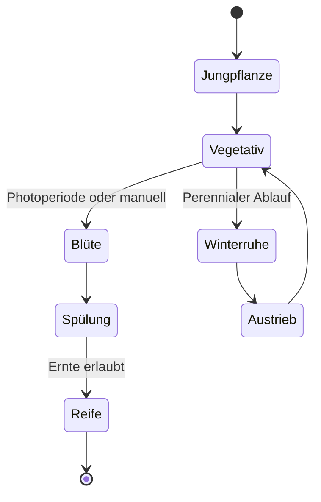

# Wachstumsphasen

Jede Pflanze in Kamerplanter durchläuft eine Abfolge von Wachstumsphasen. Das System passt Empfehlungen für Bewässerung, Düngung, Licht und Umgebungsklima automatisch an die aktuelle Phase an. So stellt Kamerplanter sicher, dass jede Pflanze genau das bekommt, was sie in ihrer aktuellen Entwicklungsstufe braucht.

---

## Voraussetzungen

- Mindestens eine angelegte Pflanze (über Pflanzdurchläufe oder einzeln)
- Sinnvoll: Passende Nährstoffpläne für die jeweiligen Phasen (optional, aber empfohlen)

---

## Die 10 Phasentypen

Kamerplanter bringt zehn vorgefertigte Phasentypen mit. Jede Pflanzenart nutzt nur die für sie sinnvolle Teilmenge — welche das ist, legt der zugewiesene **Phasenablauf** fest (siehe nächster Abschnitt).

<!-- Quelle: src/backend/app/migrations/seed_data/phase_sequences.yaml (phase_definitions) -->

| Phasentyp | Beschreibung | Typische Dauer |
|-----------|-------------|----------------|
| **Keimung** | Samen keimt, erste Wurzeln bilden sich | 7 Tage |
| **Jungpflanze** | Etablierung nach der Keimung, noch zart | 14 Tage |
| **Vegetative Phase** | Aktives Blatt- und Triebwachstum | 45 Tage |
| **Blüte** | Blütenbildung und Bestäubung | 30 Tage |
| **Fruchtentwicklung** | Fruchtbildung nach der Bestäubung | 75 Tage |
| **Reife** | Endreife vor der Ernte | 14 Tage |
| **Winterruhe** (Dormanz) | Ruheperiode für mehrjährige Pflanzen | 120 Tage |
| **Austrieb** | Neuaustrieb nach der Winterruhe | 21 Tage |
| **Blattfall** (Seneszenz) | Laubabwurf, Vorbereitung auf die Ruhephase | 21 Tage |
| **Spülung** (Flushing) | Vorerntespülung mit klarem Wasser | 14 Tage |

Die angegebene Dauer ist ein Richtwert aus der Phasendefinition — einzelne Phasenabläufe können sie überschreiben (siehe unten).

!!! note "„Ernte" ist keine eigene Phase mehr"
    Anders als in früheren Versionen gibt es keine separate Phase namens „Ernte". Stattdessen markiert jede Phasendefinition **innerhalb eines Ablaufs** über das Merkmal „Ernte erlaubt", ob in ihr geerntet werden darf — meist ist das die Phase **Reife**, bei manchen mehrjährigen Kulturen auch **Fruchtentwicklung** direkt. So können auch Pflanzen mit fortlaufender Ernte (z. B. Tomaten, die über Wochen laufend reifen) korrekt abgebildet werden.

---

## Phasenabläufe: Wie eine Art durch die Phasen geführt wird

Ein **Phasenablauf** (Phase Sequence) ist eine geordnete Kette von Phasentypen, die für eine Pflanzenart oder eine Gruppe ähnlicher Arten sinnvoll ist. Kamerplanter liefert 11 vorgefertigte Abläufe mit, zum Beispiel:

| Ablauf | Für | Beispielhafte Phasenkette |
|--------|-----|---------------------------|
| **Indoor-Standard-Zyklus** | Cannabis & ähnliche Indoor-Kulturen | Jungpflanze → Vegetativ → Blüte → Spülung → Reife (Ernte) |
| **Einjährige Erntepflanze** | Salat, Kräuter | Keimung → Jungpflanze → Vegetativ → Reife (Ernte) → Blattfall |
| **Standard Staude** | Mehrjährige Zierpflanzen | Winterruhe → Austrieb → Vegetativ → Blüte → Blattfall (wiederholt sich) |
| **Voller Fruchtzyklus (mehrjährig)** | Obstgehölze mit Fruchtfolge über Jahre | Winterruhe → Austrieb → Vegetativ → Blüte → Fruchtentwicklung → Reife (Ernte) → Blattfall (wiederholt sich) |
| **Zweijährige mit Vernalisation** | Zweijährige Gemüse (z. B. Möhre, Zwiebel zur Samengewinnung) | Keimung → Jungpflanze → Vegetativ → Winterruhe (Kälteperiode) → Blüte → Reife (Ernte) |

<!-- Quelle: src/backend/app/migrations/seed_data/phase_sequences.yaml (phase_sequences) -->

Jeder Ablauf legt pro Phase fest, ob sie **wiederkehrend** ist (mehrjährige Pflanzen durchlaufen den Zyklus erneut), ob sie eine **Endphase** ist (der Ablauf endet dort) und ob in ihr **Ernte erlaubt** ist. Welche Pflanzenart welchen Ablauf nutzt, ist Teil der Lebenszyklus-Konfiguration der Art in den Stammdaten.

<!-- diagram-source: derived from phase_sequences.yaml — indoor_default and perennial_standard sequence patterns -->

```mermaid
stateDiagram-v2
    [*] --> Jungpflanze
    Jungpflanze --> Vegetativ
    Vegetativ --> Blüte : Photoperiode oder manuell
    Blüte --> Spülung
    Spülung --> Reife : Ernte erlaubt
    Reife --> [*]

    Vegetativ --> Winterruhe : Perennialer Ablauf
    Winterruhe --> Austrieb
    Austrieb --> Vegetativ
```

!!! note "Nicht alle Phasen sind für jede Pflanze relevant"
    Kräuter wie Basilikum oder Salat haben keine ausgeprägte Blütephase im Sinne von Harzbildung. Welche Phasen eine Art durchläuft, bestimmt allein ihr zugewiesener Phasenablauf — nicht alle zehn Phasentypen kommen in jedem Ablauf vor.

---

## Phasendefinitionen und -abläufe verwalten

Fortgeschrittene Nutzerinnen und Nutzer können eigene Phasentypen und -abläufe anlegen oder bestehende einsehen:

- **Phasendefinitionen** (`/phasen/definitionen`): Liste aller Phasentypen mit Name, typischer Dauer, Gießintervall und Stresstoleranz. Die zehn mitgelieferten Phasentypen sind als „System"-Einträge markiert und können nicht gelöscht werden, solange sie in einem Ablauf verwendet werden. Eigene Phasentypen lassen sich über **Definition erstellen** ergänzen.
- **Phasenabläufe** (`/phasen/ablaeufe`): Liste aller Phasenabläufe mit Zyklustyp (einjährig, zweijährig, mehrjährig), Anzahl der enthaltenen Phasen und Gesamtdauer. In der Detailansicht eines Ablaufs fügst du Phasen hinzu, änderst ihre Reihenfolge (Pfeile „Nach oben"/„Nach unten") und legst pro Phase fest, ob sie eine **Endphase**, **wiederkehrend** ist oder **Ernte erlaubt**. Bei wiederholenden Abläufen bestimmst du zusätzlich, bei welcher Phase der Zyklus nach der Endphase erneut beginnt.

Beide Seiten findest du in der Navigation unter **Phasen**. Da hier grundlegende Systemdaten bearbeitet werden, sind sie wie andere Stammdaten-Bereiche eher für fortgeschrittene Nutzerinnen und Nutzer gedacht.

---

## Aktuellen Phasenstand einer Pflanze sehen

1. Navigiere zu **Pflanzen** und öffne eine Pflanze durch Klick auf ihren Namen.
2. Die Detailseite zeigt oben die aktuelle Phase mit einem farbigen Chip.
3. Der Tab **Wachstumsphasen** zeigt die vollständige Phasenhistorie mit Datum jedes Übergangs.

---

## Automatische Phasenübergänge {#automatische-phasenuebergaenge}

Neben dem manuellen Wechsel (siehe unten) kann ein Phasenübergang in einem Phasenablauf auch automatisch ausgelöst werden. Kamerplanter unterstützt drei Auslösearten:

- **Zeitbasiert**: Der Übergang erfolgt automatisch, sobald eine Pflanze eine festgelegte Anzahl von Tagen in ihrer aktuellen Phase verbracht hat.
- **Photoperiodisch**: Der Übergang in die Blüte erfolgt, sobald die Tageslänge am Standort der Pflanze einen artspezifischen Schwellenwert unterschreitet (Kurztagspflanzen) bzw. überschreitet (Langtagspflanzen). Dafür müssen für den Standort GPS-Koordinaten hinterlegt sein (siehe [Standorte und Substrate](locations-substrates.md)).
- **Vernalisationsbasiert**: Bei zweijährigen Pflanzen mit Kälteperiode (z. B. Möhre zur Samengewinnung) zählt Kamerplanter kalte Tage; ist die artspezifische Mindestanzahl erreicht, wird der Übergang aus der Winterruhe in die Blüte automatisch freigegeben.

!!! note "Teilweise verfügbar"
    Die Auswertungslogik für automatische Übergänge ist vollständig implementiert. Ob und wie oft dein Kamerplanter-Betreiber die Hintergrundprüfung tatsächlich einplant, hängt von der jeweiligen Installation ab. Verlasse dich sicherheitshalber nicht ausschließlich auf automatische Übergänge — kontrolliere den Phasenstand deiner Pflanzen regelmäßig und löse Übergänge bei Bedarf manuell aus (siehe unten).

---

## Eine Phase manuell auslösen

Du kannst einen Phasenübergang jederzeit manuell auslösen, unabhängig davon, ob für die Phase auch automatische Übergänge konfiguriert sind — zum Beispiel, wenn du eine Pflanze anhand eigener Beobachtung früher oder später als vom System vorgeschlagen umstellen möchtest.

### Schritt 1: Pflanze öffnen

Navigiere zu deiner Pflanze und öffne den Tab **Wachstumsphasen**.

### Schritt 2: Phasenübergang auslösen

Klicke auf **Phase wechseln** (oder den spezifischen Phasennamen, z.B. "Zur Blüte wechseln"). Ein Bestätigungs-Dialog erscheint.

### Schritt 3: Details eingeben

Im Dialog kannst du optionale Details hinterlegen:

- **Datum des Übergangs**: Standardmäßig heute, kann in der Vergangenheit liegen
- **Notizen**: Beobachtungen, die den Übergang begleiten (z.B. "Erste Blütenansätze sichtbar")

### Schritt 4: Bestätigen

Klicke auf **Speichern**. Die Phase wechselt sofort. Die Empfehlungen in der App passen sich automatisch an.

!!! warning "Phasenübergänge sind nicht umkehrbar"
    Sobald eine Pflanze in die nächste Phase gewechselt hat, kann dieser Übergang nicht mehr rückgängig gemacht werden. Überprüfe daher vorher, ob die Pflanze tatsächlich bereit ist.

---

## Batch-Phasenübergang für ganze Gruppen

Gehört eine Pflanze zu einem aktiven Pflanzdurchlauf, teilt sie sich die Phase mit allen anderen Pflanzen dieses Durchlaufs — die Phase wird auf Ebene des Durchlaufs geführt, nicht pro Einzelpflanze. Ein Phasenwechsel wirkt sich deshalb immer auf **alle** Pflanzen des Durchlaufs gleichzeitig aus; eine Auswahl einzelner Pflanzen ist beim Batch-Übergang nicht vorgesehen.

1. Öffne den entsprechenden **Pflanzdurchlauf** unter **Durchläufe**.
2. Klicke auf **Batch-Phasenwechsel**.
3. Wähle die Zielphase (z.B. "Vegetativ" → "Blüte").
4. Bestätige — alle Pflanzen des Durchlaufs wechseln gemeinsam.

Mehr dazu: [Pflanzdurchläufe](planting-runs.md)

### Warum sich einzelne Pflanzen im Durchlauf nicht separat wechseln lassen

Solange eine Pflanze einem aktiven oder geplanten Pflanzdurchlauf angehört, ist ein direkter Phasenwechsel an der Einzelpflanze gesperrt — die App meldet in diesem Fall einen Konflikt (Fehlercode `phase.run_owned`). Der Hintergrund: Durchlauf und Einzelpflanze sollen nicht auseinanderlaufen. Möchtest du eine Pflanze unabhängig von der Gruppe weiterentwickeln, löse sie zuerst aus dem Durchlauf (siehe [Einzelne Pflanzen aus dem Durchlauf lösen](planting-runs.md#einzelne-pflanzen-aus-dem-durchlauf-lösen)) und wechsle danach ihre Phase individuell.

---

## Phasen-Profile und Empfehlungen verstehen

Jede Phase hat ein eigenes Ressourcen-Profil. Wenn du die Detailansicht einer Phase aufrufst (Tab **Wachstumsphasen** → Phase anklicken), siehst du die Zielwerte:

### VPD-Zielwert (Dampfdruckdefizit)

Das Dampfdruckdefizit (VPD) beschreibt, wie stark die Luft Feuchtigkeit von den Blättern "zieht". Zu hoch belastet die Pflanze durch Trockenstress, zu niedrig fördert Schimmel.

| Phase | VPD-Ziel |
|-------|---------|
| Keimung / Jungpflanze | 0,4–0,8 kPa |
| Vegetativ | 0,8–1,2 kPa |
| Blüte | 1,0–1,5 kPa |

### Photoperiode

Die Tageslichtlänge (Stunden Licht pro Tag) steuert bei vielen Pflanzen den Übergang in die Blüte.

| Phase | Typische Photoperiode (Kurztagspflanzen) |
|-------|----------------------------------------|
| Vegetativ | 18/6 (18h Licht, 6h Dunkel) |
| Blüte-Einleitung | 12/12 (12h Licht, 12h Dunkel) |

!!! tip "Tipp: Automatische Blüteeinleitung"
    Bei Pflanzen mit hinterlegten Phasen-Definitionen und einem Standort mit GPS-Koordinaten kann die Blüte photoperiodisch ausgelöst werden (siehe [Automatische Phasenübergänge](#automatische-phasenuebergaenge)).

### NPK-Profil (Nährstoffverhältnis)

Das Stickstoff-Phosphor-Kalium-Verhältnis ändert sich über die Phasen:

- **Vegetativ**: Viel Stickstoff (N) für Blattwachstum
- **Blüte**: Weniger Stickstoff, mehr Phosphor (P) und Kalium (K)
- **Spätblüte**: Minimaler Stickstoff, hoher PK-Anteil

---

## Perenniale Pflanzen: Dormanz und saisonale Zyklen

Mehrjährige Pflanzen (Zimmerpflanzen, Beerensträucher, Obstbäume) nutzen einen wiederkehrenden Phasenablauf statt eines einmaligen Lebenszyklus bis zur Ernte — sie durchlaufen Winterruhe, Austrieb, Wachstum und Blüte in jährlicher Wiederholung.

### Dormanz-Phase aktivieren

1. Öffne die Pflanze und navigiere zu **Wachstumsphasen**.
2. Klicke auf **In Dormanz wechseln** (sichtbar bei perennialen Pflanzen).
3. Bestätige das Datum des Beginns der Ruhephase.

Während der Winterruhe:
- Werden Düngempfehlungen ausgesetzt
- Werden Bewässerungs-Intervalle verlängert
- Erscheinen saisonale Aufgaben (z.B. "Überwinterungsschutz anbringen")

### Aus der Dormanz zurückkehren

Klicke auf **Wachstum wiederaufnehmen**. Kamerplanter setzt den Zyklus zurück in die vegetative Phase (bzw. Austrieb, je nach zugewiesenem Ablauf) und reaktiviert alle Empfehlungen.

---

## Häufige Fragen

??? question "Was passiert, wenn ich den Phasenübergang zu früh auslöse?"
    Die Empfehlungen passen sich sofort an die neue Phase an. Da Übergänge nicht rückgängig gemacht werden können, empfiehlt sich etwas Geduld und eine gute Beobachtung der Pflanze. Notizen im Phasenübergang helfen später bei der Auswertung.

??? question "Kann ich eigene Phasen definieren?"
    Ja. Unter **Phasen → Phasendefinitionen** (`/phasen/definitionen`) legst du eigene Phasentypen an, unter **Phasen → Phasenabläufe** (`/phasen/ablaeufe`) kombinierst du sie zu einer eigenen Abfolge für eine oder mehrere Arten.

??? question "Zeigt Kamerplanter an, wann eine Pflanze erntereif ist?"
    Kamerplanter selbst berechnet kein automatisches Erntedatum. Stattdessen trägst du Reife-Beobachtungen ein (z.B. Trichomfarbe, Pistillfärbung, geschätzte Tage bis zur Ernte) — die App sammelt diese im Reife-Verlauf der Pflanze als Entscheidungshilfe. Die endgültige Entscheidung triffst du. Mehr dazu: [Ernte](harvest.md).

??? question "Was ist der Unterschied zwischen Flushing und Dormanz?"
    **Flushing (Spülung)** ist eine Erntevorbereitungs-Phase, bei der die Nährstoffzufuhr reduziert wird, bevor die Pflanze geerntet wird. **Dormanz (Winterruhe)** ist die natürliche Ruhephase mehrjähriger Pflanzen im Winter. Beide sind eigenständige Phasentypen und schließen sich in einem Ablauf gegenseitig aus.

---

## Siehe auch

- [Stammdaten: Pflanzenarten](plant-management.md)
- [Dünge-Logik](fertilization.md)
- [Ernte](harvest.md)
- [Pflanzdurchläufe](planting-runs.md)
