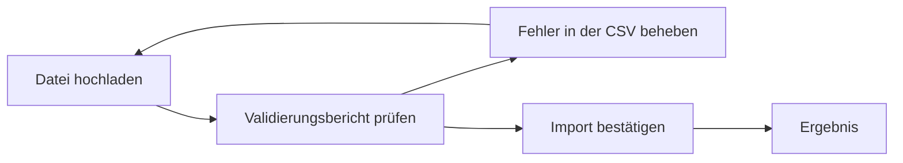

<!-- Quelle: src/frontend/src/pages/stammdaten/ImportPage.tsx, src/backend/app/api/v1/imports/router.py, src/backend/app/domain/services/import_service.py, src/backend/app/domain/engines/{csv_parser,import_engine,row_validator}.py, src/frontend/src/i18n/locales/de/translation.json (pages.import) -->

# Stammdaten-Import

Mit dem Stammdaten-Import legst du Pflanzenarten, Sorten und botanische Familien nicht einzeln von Hand an, sondern in einem Rutsch aus einer CSV-Datei (einer Textdatei mit kommagetrennten Werten). Das lohnt sich vor allem bei der Erstbefüllung deiner Instanz oder wenn du viele Datensätze auf einmal aktualisieren möchtest.

---

## Voraussetzungen

- Du bist angemeldet — der Import steht jedem eingeloggten Benutzerkonto zur Verfügung, es ist keine besondere Rolle erforderlich.
- Deine Datei liegt im **CSV-Format** vor (Komma-, Semikolon- oder Tab-getrennt), UTF-8 oder Latin-1 kodiert.

## Unterstützte Datentypen

| Datentyp | Bezeichnung in der Oberfläche | Eindeutiges Kennzeichen |
|----------|-------------------------------|--------------------------|
| Botanische Art | Pflanzenarten | Wissenschaftlicher Name |
| Sorte | Sorten | Zugehörige Art + Sortenname |
| Botanische Familie | Pflanzenfamilien | Name |

## CSV-Vorlage herunterladen

Damit du nicht rätseln musst, welche Spalten erwartet werden, bietet dir Kamerplanter für jeden Datentyp eine passende Vorlage an:

1. Navigiere zu **Stammdaten → Import**
2. Wähle oben den gewünschten **Datentyp** aus (Pflanzenarten, Sorten oder Pflanzenfamilien)
3. Klicke auf **Vorlage herunterladen**

Es lädt eine CSV-Datei mit genau den Spaltenüberschriften herunter, die für den gewählten Datentyp unterstützt werden. Trage deine Daten zeilenweise darunter ein.

!!! tip "KI-generierte CSV-Daten nutzen"
    Die [KI-Pipeline](../guides/ai-plant-data-pipeline.md) liefert im Abschnitt 8 jedes Pflanzendokuments bereits fertige CSV-Zeilen im passenden Format — diese kannst du direkt in die heruntergeladene Vorlage übernehmen.

### Pflichtfelder je Datentyp

| Datentyp | Pflichtspalten | Weitere unterstützte Spalten |
|----------|----------------|-------------------------------|
| Pflanzenarten | `scientific_name` | `common_name`, `family_name`, `growth_habit`, `cycle_type`, `root_type`, `description`, `container_suitable`, `recommended_container_volume_l`, `min_container_depth_cm`, `mature_height_cm`, `mature_width_cm`, `spacing_cm`, `indoor_suitable`, `balcony_suitable`, `greenhouse_recommended`, `support_required` |
| Sorten | `species_key`, `cultivar_name` | `breeder`, `description`, `traits` |
| Pflanzenfamilien | `name` | `common_name`, `order_name`, `description` |

!!! note "Wissenschaftlicher Name muss dem Muster \"Gattung Art\" folgen"
    Beim Datentyp **Pflanzenarten** muss `scientific_name` mit einem großgeschriebenen Gattungsnamen gefolgt von einem kleingeschriebenen Artepitheton beginnen, z.B. `Solanum lycopersicum`. Weicht der Wert davon ab, meldet der Validierungsbericht einen Fehler.

!!! note "Zwei Spalten mit Sonderrolle: `family_name` und `cycle_type`"
    Beim Anlegen einer **neuen** Art übernimmt Kamerplanter alle in der Vorlage aufgeführten Spalten — mit zwei Ausnahmen:

    - `family_name` wird bestmöglich als **`family_key`** übernommen, also als direkter Schlüsselverweis auf die botanische Familie. Es findet dabei **kein Abgleich mit dem Anzeigenamen** einer bestehenden Familie statt — trage hier den exakten Schlüssel der Zielfamilie ein, nicht nur einen frei formulierten Namen.
    - `cycle_type` wird im Validierungsbericht geprüft, aber **nicht gespeichert** — die Art hat dafür kein passendes Datenfeld. Trage den Lebenszyklus bei Bedarf nachträglich auf der [Artdetailseite](plant-management.md#art-bearbeiten) ein.

    Bei Pflanzenfamilien werden alle vier Spalten vollständig übernommen.

## Datei hochladen

1. Navigiere zu **Stammdaten → Import**
2. Wähle den **Datentyp** (Pflanzenarten, Sorten oder Pflanzenfamilien)
3. Wähle die **Duplikat-Behandlung** (siehe [Umgang mit Duplikaten](#umgang-mit-duplikaten) weiter unten)
4. Klicke auf **CSV-Datei auswählen** und wähle deine ausgefüllte Datei
5. Klicke auf **Hochladen**

Encoding und Trennzeichen (Komma, Semikolon oder Tabulator) erkennt Kamerplanter automatisch — du musst nichts einstellen.

!!! note "Grenzen für den Datei-Upload"
    Eine Import-Datei darf maximal **10 MB** groß sein und höchstens **10.000 Datenzeilen** enthalten. Größere Bestände teilst du am besten in mehrere Dateien auf.

## Der Zwei-Phasen-Workflow

Ein Import läuft immer über zwei getrennte Schritte ab: Zuerst wird deine Datei **geprüft, ohne dass etwas gespeichert wird** (Validierungsbericht), erst danach bestätigst du den eigentlichen Import. So siehst du vorab genau, was passieren würde, und kannst Fehler in deiner Datei korrigieren, bevor irgendetwas in der Datenbank landet.

<!-- diagram-source: user-described — two-phase CSV master-data import flow with a validation-and-fix loop before confirmation -->

### Schritt 1: Hochladen und automatisch prüfen lassen

Sobald du eine Datei hochlädst, prüft Kamerplanter **jede Zeile einzeln** — noch bevor irgendetwas gespeichert wird. Du landest danach automatisch im Schritt **Vorschau**.

### Schritt 2: Validierungsbericht prüfen

Der Validierungsbericht zeigt dir pro Zeile:

- die eingelesenen Rohdaten,
- den Status — **gültig**, **ungültig** oder **Duplikat** —,
- bei Fehlern eine Liste der betroffenen Felder mit Fehlermeldung (als Tooltip auf dem Fehler-Chip).

An dieser Stelle wurde noch **nichts gespeichert**. Enthält deine Datei Fehler, kannst du über **Zurück** zum ersten Schritt zurückkehren, die CSV-Datei außerhalb von Kamerplanter korrigieren und erneut hochladen.

### Schritt 3: Import bestätigen

Bist du mit dem Validierungsbericht zufrieden, klickst du auf **Import bestätigen**. Erst jetzt werden gültige Zeilen tatsächlich als neue Datensätze angelegt (bzw. je nach Duplikat-Behandlung übersprungen oder als Fehler gewertet). Anschließend siehst du das **Ergebnis** mit einer Zusammenfassung.

## Umgang mit Validierungsfehlern

Eine Zeile gilt als **ungültig**, wenn mindestens einer dieser Fälle zutrifft:

- Ein Pflichtfeld ist leer (z.B. `scientific_name` bei Pflanzenarten).
- Der wissenschaftliche Name entspricht nicht dem Muster "Gattung Art".
- Ein Auswahlfeld (z.B. Wuchsform, Wurzeltyp, Container-Eignung) enthält einen Wert, der nicht zu den erlaubten Optionen gehört.
- Die Zelle beginnt mit einem Zeichen, das in Tabellenkalkulationsprogrammen als Formel interpretiert werden könnte (z.B. `=`, `+`, `-`, `@`). Kamerplanter entfernt dieses Zeichen automatisch aus Sicherheitsgründen und weist im Bericht darauf hin.

Ungültige Zeilen werden beim Bestätigen **nicht importiert** und zählen im Ergebnis als "Fehlgeschlagen".

!!! tip "Fehler korrigieren, ohne von vorn zu beginnen"
    Du musst nach einem Fehler nicht sofort von vorn anfangen. Klicke auf **Zurück**, korrigiere die betroffenen Zellen in deiner CSV-Datei und lade sie erneut hoch — der bisherige Job wird dabei verworfen.

### Umgang mit Duplikaten

Existiert bereits ein Datensatz mit demselben eindeutigen Kennzeichen (z.B. derselbe wissenschaftliche Name), markiert der Validierungsbericht die Zeile als **Duplikat**. Wie mit Duplikaten verfahren wird, legst du **vor dem Hochladen** über die **Duplikat-Behandlung** fest:

| Option | Verhalten |
|--------|-----------|
| **Überspringen** | Die Zeile wird beim Bestätigen ignoriert, der bestehende Datensatz bleibt unverändert. |
| **Aktualisieren** | Der bestehende Datensatz wird mit den Werten der CSV-Zeile aktualisiert — leere Zellen überschreiben dabei nie einen vorhandenen Wert. |
| **Fehler melden** | Die Zeile wird als Fehler gewertet, nichts wird gespeichert. |

!!! note "Aktualisieren gilt für Pflanzenarten und Pflanzenfamilien, noch nicht für Sorten"
    Bei den Datentypen **Pflanzenarten** und **Pflanzenfamilien** aktualisiert die Option **Aktualisieren** den bestehenden Datensatz wie oben beschrieben. Für **Sorten** erkennt der Validierungsbericht bislang keine Duplikate — die Option **Aktualisieren** hat für diesen Datentyp deshalb noch keinen Effekt. Bearbeite bestehende Sorten bis auf Weiteres direkt auf der [Artdetailseite](plant-management.md#sorten-verwalten).

## Ergebnis nach dem Import

Nach dem Bestätigen zeigt dir Kamerplanter eine Zusammenfassung mit vier Kennzahlen:

- **Erstellt** — neu angelegte Datensätze
- **Aktualisiert** — aktualisierte Datensätze (siehe Hinweis oben zur Duplikat-Behandlung)
- **Übersprungen** — Duplikate, die laut gewählter Strategie ausgelassen wurden
- **Fehlgeschlagen** — Zeilen, die wegen Validierungsfehlern oder aktiver "Fehler melden"-Strategie nicht importiert wurden

Traten Fehler auf, werden sie zusätzlich als Liste angezeigt. Über **Neuer Import** startest du direkt den nächsten Durchlauf — z.B. um einen weiteren Datentyp zu importieren.

!!! note "Noch keine Übersicht vergangener Importe"
    Aktuell zeigt die Oberfläche nur den gerade laufenden Import-Vorgang. Eine Übersichtsseite mit dem Verlauf früherer Importe steht in der Weboberfläche noch nicht zur Verfügung.

## Häufige Fragen

??? question "Kann ich denselben Import mehrfach bestätigen?"
    Nein. Nach dem Bestätigen ist der Import-Vorgang abgeschlossen. Möchtest du dieselbe Datei erneut verarbeiten (z.B. nach einer Korrektur), lädst du sie über **Neuer Import** erneut hoch.

??? question "Werden beim erneuten Hochladen automatisch Duplikate erkannt?"
    Bei **Pflanzenarten** (wissenschaftlicher Name) und **Pflanzenfamilien** (Name) ja, sofern das eindeutige Kennzeichen bereits in der Datenbank existiert — die Zeile wird dann im Validierungsbericht als Duplikat markiert. Bei **Sorten** erkennt der Validierungsbericht aktuell noch keine Duplikate; jede gültige Sorten-Zeile wird beim Bestätigen als neuer Datensatz angelegt, auch wenn bereits eine gleichnamige Sorte existiert.

??? question "Was passiert, wenn ich die Seite während der Vorschau verlasse?"
    Der noch nicht bestätigte Import-Vorgang geht verloren, es wurde ohnehin noch nichts gespeichert. Lade die Datei erneut hoch.

??? question "Kann ich mit dem Import auch bestehende Nährstoffpläne oder andere Stammdaten importieren?"
    Nein, aktuell unterstützt der CSV-Import ausschließlich Pflanzenarten, Sorten und botanische Familien.

## Siehe auch

- [Stammdaten verwalten](plant-management.md) — Arten, Sorten und Familien manuell anlegen und pflegen
- [Pflanzendaten per KI aufbereiten](../guides/ai-plant-data-pipeline.md) — Fertige CSV-Zeilen für den Import generieren lassen
- [Mischkultur & Fruchtfolge](../guides/companion-planting.md) — Fruchtfolge-Stammdaten für botanische Familien
