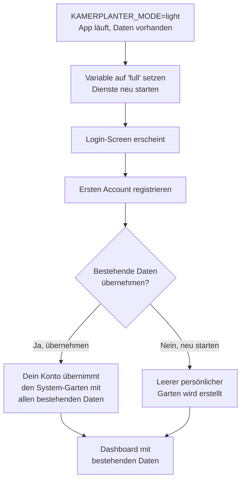

# Light-Modus

Der Light-Modus ist eine Betriebsoption für lokale Kamerplanter-Instanzen, bei der du die App direkt im Browser öffnen kannst — ohne dich einzuloggen oder zu registrieren. Du siehst sofort deine Pflanzen, Aufgaben und den Kalender.

Perfekt für: einen Raspberry Pi im Heimnetzwerk, Docker Compose auf dem Laptop, oder wenn du Kamerplanter einfach ausprobieren möchtest.

---

## Wann solltest du den Light-Modus verwenden?

| Szenario | Light-Modus | Full-Modus |
|----------|:-----------:|:----------:|
| Ich bin allein und brauche kein Login | Empfehlung | Moglich |
| Familie / Haushalt teilt eine Instanz im LAN | Empfehlung | Moglich |
| Ich möchte die App erst ausprobieren | Empfehlung | Moglich |
| Mehrere Personen mit eigenen Konten | Nicht geeignet | Empfehlung |
| Öffentlich erreichbare Instanz (Internet) | **Nicht verwenden** | Empfehlung |
| Gemeinschaftsgarten mit Rollenverwaltung | Nicht geeignet | Empfehlung |

!!! danger "Sicherheitshinweis: Nur für geschlossene Netzwerke"
    Im Light-Modus gibt es keine Authentifizierung. Jeder, der deine Instanz im Netzwerk erreichen kann, hat vollen Lese- und Schreibzugriff. Betreibe den Light-Modus **niemals** auf einer öffentlich erreichbaren Adresse.

    Geeignete Umgebungen: `localhost`, Heimnetzwerk hinter Router-Firewall, Raspberry Pi ohne Port-Forwarding.

---

## Was der Light-Modus verändert

Beim ersten Start im Light-Modus legt das System automatisch einen **System-Benutzer** (Anzeigename: "Gärtner") und einen **System-Garten** (Name: "Mein Garten") an. Alle Pflanzen und Daten gehören diesem Garten.

Die folgende Tabelle zeigt, welche Funktionen je nach Modus sichtbar sind:

| Funktion | Light-Modus | Full-Modus |
|----------|:-----------:|:----------:|
| Login-Screen | Ausgeblendet | Sichtbar |
| Registrierung | Ausgeblendet | Sichtbar |
| Passwort vergessen | Ausgeblendet | Sichtbar |
| Garten-Wechsler (Tenant-Switcher) | Ausgeblendet | Sichtbar |
| Mitgliederverwaltung | Ausgeblendet | Sichtbar |
| Einladungssystem | Ausgeblendet | Sichtbar |
| DSGVO-Einwilligungs-Banner | Ausgeblendet | Sichtbar |
| Datenschutz-Einstellungen | Ausgeblendet | Sichtbar |
| Kontoeinstellungen | Nur Sprache & Erfahrungsstufe | Vollständig |
| Aufgaben-Zuweisung an Personen | Ausgeblendet (nur ein Nutzer) | Sichtbar |
| Onboarding-Wizard | Startet direkt beim ersten Öffnen | Nach Login |
| Pflanzen verwalten | Vollständig | Vollständig |
| Standorte verwalten | Vollständig | Vollständig |
| Pflegeerinnerungen | Vollständig | Vollständig |
| Düngung & Bewässerung | Vollständig | Vollständig |
| Erntemanagement | Vollständig | Vollständig |
| Pflanzenschutz (IPM) | Vollständig | Vollständig |
| Aufgabenplanung | Vollständig | Vollständig |
| Phasensteuerung | Vollständig | Vollständig |
| Stammdaten-Import | Vollständig | Vollständig |

---

## Light-Modus aktivieren

Du aktivierst den Light-Modus über eine einzige Umgebungsvariable in deiner Docker Compose Konfiguration:

```yaml
# docker-compose.yml
services:
  backend:
    environment:
      KAMERPLANTER_MODE: light

  frontend:
    environment:
      VITE_KAMERPLANTER_MODE: light
```

Ein Neustart der Dienste ist nach jeder Änderung erforderlich. Bestehende Daten bleiben dabei erhalten.

!!! note "Standard-Modus"
    Wenn du die Variable nicht setzt, startet Kamerplanter im Full-Modus (`KAMERPLANTER_MODE=full`). Der Full-Modus ist der Standard für Mehrbenutzerbetrieb und SaaS-Installationen.

---

## Modus wechseln

### Upgrade: Light → Full

Du möchtest Kamerplanter mit anderen teilen oder mehrere Konten verwenden? Du kannst jederzeit auf den Full-Modus upgraden.



Nach dem Neustart im Full-Modus siehst du den Login-Screen. Registriere dich — dabei erscheint ein Dialog:

> "Es gibt bestehende Daten (X Pflanzen, Y Standorte). Möchten Sie diese in Ihr Konto übernehmen?"

**Ja, übernehmen:** Dein neues Konto übernimmt den System-Garten mit allen Pflanzen, Standorten und Nährstoffplänen. Du kannst danach weitere Mitglieder einladen.

**Nein, neu starten:** Für dein Konto wird ein leerer persönlicher Garten erstellt. Die alten Daten bleiben in der Datenbank und können über das Admin-Panel eingesehen oder gelöscht werden.

!!! tip "Tipp"
    Wenn du dir unsicher bist, wähle "Ja, übernehmen". Du kannst nachher immer noch Daten löschen — du verlierst aber nichts.

### Downgrade: Full → Light

Du möchtest vom Full-Modus zurück zum Light-Modus wechseln?

!!! warning "Achtung: Nur System-Garten sichtbar"
    Im Light-Modus ist ausschließlich der System-Garten zugänglich. Wenn du im Full-Modus mehrere Gärten oder Nutzerkonten angelegt hast, sind diese im Light-Modus nicht sichtbar. Die Daten gehen **nicht verloren** — sie sind bei einem erneuten Upgrade auf Full wieder vollständig zugänglich.

Ändere die Umgebungsvariable auf `light` und starte die Dienste neu. Das System reaktiviert automatisch den System-Benutzer und den System-Garten. Du landest direkt auf dem Dashboard ohne Login.

### Roundtrip: Light → Full → Light → Full

Ein vollständiger Hin-und-her-Wechsel ist möglich und sicher. Alle Daten bleiben in der Datenbank erhalten. Beim erneuten Upgrade auf Full siehst du wieder den Übernahme-Dialog — du kannst die bestehenden Daten erneut übernehmen.

---

## Haufige Fragen

??? question "Was passiert, wenn mehrere Personen im LAN gleichzeitig auf die Light-Modus-Instanz zugreifen?"
    Alle Geräte im Netzwerk sehen dieselben Daten und arbeiten als derselbe System-Benutzer. Änderungen einer Person sind sofort für alle anderen sichtbar. Es gibt keine Nutzer-Trennung — das ist beabsichtigt für Familien und Haushalte.

??? question "Kann ich im Light-Modus Backups erstellen?"
    Backups werden unabhängig vom Modus über ArangoDB-Backups oder Docker-Volume-Backups erstellt. Der Modus hat keinen Einfluss auf die Backup-Strategie.

??? question "Mein Netzwerk hat eine öffentliche IP — kann ich den Light-Modus trotzdem nutzen?"
    Nur wenn die Instanz ausschließlich intern erreichbar ist (Firewall blockiert den Port nach außen, kein Port-Forwarding). Wenn die Instanz über das Internet erreichbar ist, verwende immer den Full-Modus mit Authentifizierung.

??? question "Ich habe den Light-Modus aktiviert, aber der Login-Screen erscheint noch. Warum?"
    Stelle sicher, dass du sowohl `KAMERPLANTER_MODE=light` (Backend) als auch `VITE_KAMERPLANTER_MODE=light` (Frontend) gesetzt hast und beide Dienste neu gestartet wurden. Das Frontend-Build liest die Variable beim Start aus — ein Neustart des Frontend-Containers ist erforderlich.

??? question "Kann ich im Light-Modus die Sprache und Erfahrungsstufe ändern?"
    Ja. Die **Kontoeinstellungen** sind im Light-Modus eingeschränkt verfügbar: Du kannst Sprache, Zeitzone und Erfahrungsstufe anpassen. Passwort, Sessions und Datenschutz-Einstellungen sind ausgeblendet, weil sie im Light-Modus nicht relevant sind.

---

## Siehe auch

- [Onboarding-Wizard](onboarding.md) — Erste Schritte nach dem Start
- [Standorte & Substrate](locations-substrates.md) — Standorte verwalten
- [Dashboard](dashboard.md) — Überblick über deine Pflanzen
