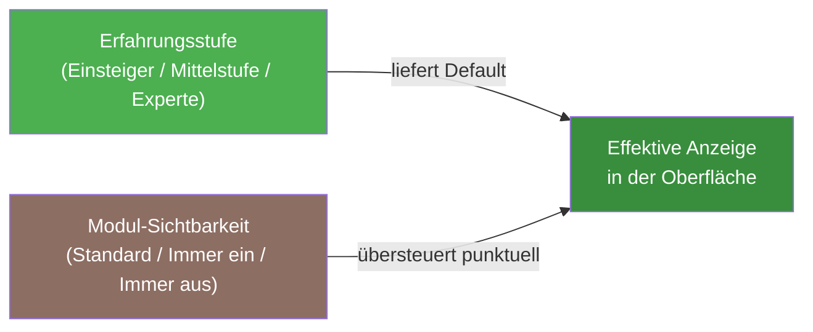

# Module & Funktionen

In den Kontoeinstellungen kannst du unter dem Tab **Module & Funktionen** jeden Navigationsbereich der Seitenleiste — mit Ausnahme der Kern-Module — gezielt ein- oder ausblenden. Das ermöglicht eine aufgeräumte Oberfläche, die genau auf deine Arbeitsweise zugeschnitten ist — unabhängig davon, welche Erfahrungsstufe du gewählt hast.

!!! note "Reine Anzeige-Präferenz"
    Das Ein- und Ausblenden von Modulen ist eine **persönliche Darstellungseinstellung**. Es handelt sich um keine Zugriffskontrolle: Das System speichert weiterhin alle deine Daten, und du kannst ein ausgeblendetes Modul jederzeit wieder einblenden — ohne Datenverlust.

!!! note "Neu: wirklich jeder Navigationsbereich ist steuerbar"
    Bisher ließen sich einige Bereiche der Seitenleiste nicht über diese Einstellungen ausblenden — darunter **KI-Assistent**, **Glossar**, **Überwinterung**, **Phasen** (Definitionen & Abläufe) und **Betriebsmittel & Inventar**. Diese fünf Module sind jetzt genauso steuerbar wie alle anderen nicht-essenziellen Bereiche.

---

## Voraussetzungen

- Du bist als Nutzer angemeldet (oder nutzt den Light-Modus auf einem lokalen Gerät).
- Die Erfahrungsstufe hast du bereits im Onboarding-Wizard oder in den Kontoeinstellungen festgelegt (siehe [Onboarding-Wizard](onboarding.md)).

---

## Einstellungen öffnen

1. Klicke oben rechts auf dein **Profilbild** oder das Nutzer-Symbol.
2. Wähle **Kontoeinstellungen**.
3. Wechsle zum Tab **Module & Funktionen**.

Du siehst eine nach Kategorien gruppierte Liste aller Module, die du ein- oder ausblenden kannst.

---

## Wie Modul-Sichtbarkeit funktioniert

### Drei Zustände pro Modul

Jedes Modul hat drei mögliche Einstellungen:

| Einstellung | Bedeutung |
|-------------|-----------|
| **Folgt Erfahrungsstufe** (Standard) | Die Sichtbarkeit richtet sich nach der gewählten Erfahrungsstufe (Einsteiger / Mittelstufe / Experte). Kein manueller Eingriff. |
| **Immer einblenden** | Das Modul ist sichtbar, auch wenn die Erfahrungsstufe es normalerweise ausblenden würde. Nützlich für einzelne Spezial-Funktionen, die du gezielt nutzen möchtest. |
| **Immer ausblenden** | Das Modul ist ausgeblendet, auch wenn die Erfahrungsstufe es zeigen würde. Ideal, um Funktionen zu verbergen, die du nicht benötigst. |

!!! tip "Tipp: Standard ist immer am flexibelsten"
    Solange du für ein Modul die Einstellung **Folgt Erfahrungsstufe** beibehältst, wirkt sich ein späterer Wechsel der Erfahrungsstufe automatisch auf dieses Modul aus. Nur bei expliziten Übersteuerungen (immer ein/aus) musst du manuell zurücksetzen.

### Was sich beim Ausblenden ändert

Wird ein Modul ausgeblendet, verschwindet es konsistent aus:

- der **Seitenleiste** (Navigationspunkte)
- dem **Dashboard** (zugehörige Widgets und Quick-Actions)
- **Schnellzugriffe** und Verknüpfungen an anderen Stellen

Deine **Daten in diesem Modul bleiben vollständig erhalten**. Wenn du das Modul wieder einblendest, ist der volle Funktionsumfang sofort wieder zugänglich.

### Direkte URL-Aufrufe bei ausgeblendeten Modulen

Rufst du eine Seite eines ausgeblendeten Moduls direkt über eine URL oder einen gespeicherten Link auf, siehst du einen freundlichen Hinweis:

> „Dieses Modul ist ausgeblendet. Möchtest du es wieder aktivieren?"

Mit einem Klick auf **In Einstellungen aktivieren** gelangst du direkt zum Tab „Module & Funktionen". So gehen geteilte oder bookmarkte Links nie verloren.

---

## Ein Modul ein- oder ausblenden

### Schritt 1: Modul in der Liste finden

Die Module sind nach Kategorien in aufklappbaren Bereichen (Akkordeons) gegliedert. Nutze das **Suchfeld** oben, um schnell ein bestimmtes Modul zu finden.

### Schritt 2: Einstellung ändern

Stelle den Schalter neben dem Modul nach Wunsch:

- **Ein** — Modul ist sichtbar (immer einblenden)
- **Aus** — Modul ist ausgeblendet (immer ausblenden)

Ein kleiner Hinweis neben dem Schalter zeigt den aktuellen Effektiv-Zustand: „folgt Erfahrungsstufe: sichtbar" oder „manuell ausgeblendet".

### Schritt 3: Auf Standard zurücksetzen

Um die manuelle Übersteuerung aufzuheben und das Modul wieder der Erfahrungsstufe zu überlassen, klicke auf den Link **Zurücksetzen** neben dem jeweiligen Modul.

Die Änderungen werden sofort gespeichert — ohne separaten Bestätigungs-Button.

!!! example "Beispiel: Zimmerpflanzen-Nutzer blendet Tankmanagement aus"
    Du züchtest ausschließlich Zimmerpflanzen und möchtest Tankmanagement und Erntechargen nicht sehen. Stelle beide Module auf **Immer ausblenden**. Seitenleiste und Dashboard werden sofort aufgeräumter — deine bisherigen Daten in diesen Bereichen bleiben unangetastet.

!!! example "Beispiel: Einsteiger mit Interesse an Pflanzenschutz"
    Du bist Einsteiger, interessierst dich aber für IPM (Integrierter Pflanzenschutz). Stelle das Modul **Pflanzenschutz (IPM)** auf **Immer einblenden**. Es erscheint sofort in der Seitenleiste — ohne dass du deine gesamte Erfahrungsstufe auf „Experte" umstellen musst.

---

## Kern-Module: immer sichtbar

Die folgenden Module sind Grundfunktionen der Anwendung und lassen sich nicht ausblenden. Sie erscheinen im Tab „Module & Funktionen" als fixierte Einträge mit dem Hinweis „Grundfunktion, immer sichtbar":

| Modul | Beschreibung |
|-------|-------------|
| **Dashboard** | Deine persönliche Übersichtsseite |
| **Meine Pflanzen** | Pflanzenverwaltung und -details |
| **Standorte** | Standort- und Substratverwaltung |
| **Einstellungen** | Kontoeinstellungen und Präferenzen |
| **Onboarding** | Einrichtungsassistent |

---

## Verfügbare Module (Übersicht)

Die folgende Tabelle zeigt alle Module, die du ein- oder ausblenden kannst, mit dem jeweils voreingestellten Sichtbarkeits-Default je Erfahrungsstufe. <!-- Quelle: src/frontend/src/config/moduleCatalog.ts -->

| Modul | Kategorie | Standard ab Stufe |
|-------|-----------|:----------------:|
| Kalender | Pflege & Planung | Einsteiger |
| Gießprotokoll | Pflege & Planung | Einsteiger |
| Aufgaben & Workflows | Pflege & Planung | Einsteiger |
| Tagebuch | Pflege & Planung | Einsteiger |
| Düngung & Nährstoffpläne | Düngung & Wasser | Mittelstufe |
| Tankmanagement | Düngung & Wasser | Experte |
| Aquaponik | Düngung & Wasser | Experte |
| Substrate | Düngung & Wasser | Experte |
| Kalkulatoren (VPD/GDD/EC) | Düngung & Wasser | Experte |
| Pflanzenschutz (IPM) | Pflanzenschutz | Experte |
| Ernte & Erntechargen | Ernte | Experte |
| Post-Harvest | Ernte | Experte |
| Pflanzdurchläufe | Anbau | Experte |
| Vermehrung | Anbau | Experte |
| Überwinterung | Anbau | Mittelstufe |
| Phasen (Definitionen & Abläufe) | Anbau | Experte |
| Betriebsmittel & Inventar | Inventar & Ausrüstung | Einsteiger |
| Stammdaten (Arten/Familien/Import) | Stammdaten | Mittelstufe |
| Mischkultur & Fruchtfolge | Stammdaten | Experte |
| Umgebungssteuerung & Aktorik | Automation | Einsteiger |
| KI-Bilderkennung | KI | Mittelstufe |
| KI-Assistent | KI | Einsteiger |
| Glossar | Wissen & Referenz | Einsteiger |

!!! note "Hinweis zur Erfahrungsstufe"
    Der Spalte „Standard ab Stufe" entnimmst du, ab welcher Erfahrungsstufe ein Modul ohne manuelle Übersteuerung sichtbar ist. Auf Stufe „Einsteiger" sind neben den Kern-Modulen zum Beispiel bereits Kalender, Gießprotokoll, Aufgaben & Workflows, Tagebuch, Umgebungssteuerung & Aktorik, Betriebsmittel & Inventar, KI-Assistent und Glossar standardmäßig eingeblendet. Du kannst jedes dieser Module jederzeit manuell übersteuern.

---

## Verhältnis zur Erfahrungsstufe

Die Modul-Sichtbarkeit und die [Erfahrungsstufe](onboarding.md) ergänzen sich, ersetzen sich aber nicht gegenseitig:

- Die **Erfahrungsstufe** steuert, wie viele Details und Felder innerhalb eines Moduls sichtbar sind (z.B. erweiterte EC-Felder, technische Parameter).
- Die **Modul-Sichtbarkeit** steuert, ob ein ganzer Funktionsbereich überhaupt erscheint.

Ein Stufenwechsel beeinflusst automatisch alle Module, bei denen du **keine** manuelle Übersteuerung gesetzt hast. Module, die du explizit ein- oder ausgeblendet hast, bleiben unverändert.

---

## Light-Modus (ohne Login)

Im [Light-Modus](light-mode.md) — wenn Kamerplanter lokal ohne Registrierung betrieben wird — werden deine Modul-Einstellungen im **Browser-Speicher (localStorage)** gesichert. Sie stehen auf dem jeweiligen Gerät sofort zur Verfügung.

Wenn du dich später registrierst oder anmeldest, werden die lokal gespeicherten Einstellungen automatisch in deinen Account übernommen. Du verlierst keine Präferenzen.

---

## Häufige Fragen

??? question "Werden Daten gelöscht, wenn ich ein Modul ausblende?"
    Nein. Das Ausblenden ist eine reine Anzeigepräferenz. Alle Daten im ausgeblendeten Modul bleiben vollständig erhalten. Wenn du das Modul wieder einblendest, siehst du sofort alle bisherigen Einträge.

??? question "Was passiert mit Benachrichtigungen für ausgeblendete Module?"
    Benachrichtigungen (z.B. Pflegeerinnerungen) bleiben unverändert aktiv, auch wenn das zugehörige Modul ausgeblendet ist. Die Modul-Sichtbarkeit beeinflusst ausschließlich die Darstellung in der Oberfläche.

??? question "Kann ich alle Module auf einmal zurücksetzen?"
    Aktuell kannst du Module einzeln oder pro Kategorie auf den Standard zurücksetzen. Eine globale „Alles zurücksetzen"-Funktion ist in Planung.

??? question "Sieht ein anderer Nutzer im selben Garten meine Modul-Einstellungen?"
    Nein. Die Modul-Sichtbarkeit ist eine persönliche Einstellung pro Nutzer. Andere Mitglieder in deinem Garten (Mandanten) haben ihre eigene unabhängige Konfiguration.

??? question "Warum sind manche Module nicht in der Liste?"
    Kern-Module (Dashboard, Meine Pflanzen, Standorte, Einstellungen, Onboarding) sind nicht ausblendbar und erscheinen deshalb nicht als schaltbare Einträge in der Liste.

---

## Siehe auch

- [Onboarding-Wizard](onboarding.md) — Erfahrungsstufe einstellen und Starter-Kit wählen
- [Dashboard](dashboard.md) — Übersicht und Widgets
- [Dashboard personalisieren](dashboard-personalization.md) — Widgets auswählen, anordnen und konfigurieren
- [Mandanten & Gärten](tenants.md) — Mehrere Gärten und Nutzerrollen verwalten
- [Light-Modus](light-mode.md) — Kamerplanter ohne Login betreiben
