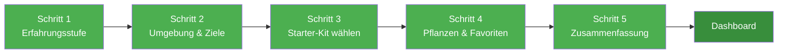

# Onboarding-Wizard

Der Onboarding-Wizard führt dich beim ersten Start durch die Einrichtung von Kamerplanter. In wenigen Schritten legst du deine Erfahrungsstufe fest, wählst ein Starter-Kit und hast sofort deine ersten Pflanzen im System — ohne ein einziges Formular manuell ausfüllen zu müssen.

---

## Was ist ein Starter-Kit?

Ein Starter-Kit ist ein vorkonfiguriertes Anbau-Szenario. Es enthält alle Stammdaten, die du für einen bestimmten Anwendungsfall brauchst: Pflanzenarten, Sorten, vordefinierte Wachstumsphasen und passende Dünge-Vorlagen.

Kamerplanter liefert neun Starter-Kits mit:

| Starter-Kit | Schwierigkeit | Umgebung |
|-------------|:-------------:|:--------:|
| Fensterbrett-Kräuter | Einsteiger | Fensterbrett |
| Zimmerpflanzen-Starter | Einsteiger | Innenraum |
| Haustierfreundliche Zimmerpflanzen | Einsteiger | Innenraum |
| Balkon-Tomaten | Einsteiger | Balkon |
| Gemüsebeet | Mittelstufe | Außen |
| Sukkulenten & Kakteen | Einsteiger | Innenraum |
| Mediterrane Kräuter | Einsteiger | Außen / Balkon |
| Balkon-Chillis | Mittelstufe | Balkon |
| Indoor Growzelt | Fortgeschritten | Growzelt |

!!! tip "Tipp"
    Du kannst den Wizard jederzeit erneut aufrufen — zum Beispiel um ein zweites Szenario hinzuzufügen oder deine Erfahrungsstufe zu ändern. Den Link dazu findest du in den **Kontoeinstellungen** unter dem Punkt **Onboarding-Wizard erneut starten**.

---

## Die fünf Schritte im Überblick

---

## Schritt 1: Erfahrungsstufe wählen

Du wählst eine von drei Stufen, die bestimmt, welche Felder und Menüpunkte du in der gesamten App siehst.

| Stufe | Sichtbare Funktionen | Empfehlung |
|-------|---------------------|------------|
| **Einsteiger** | Kernfunktionen: Pflanzen, Standorte, Aufgaben, Phasen | Erste Schritte mit Kamerplanter |
| **Mittelstufe** | Zusätzlich: Düngung, Tankmanagement, Sensorik | Du hast bereits Erfahrung mit Pflanzenpflege |
| **Experte** | Alle Funktionen: IPM, EC-Budgets, Kalibrierung, Importfunktionen | Professioneller Anbau |

!!! note "Hinweis"
    Die Erfahrungsstufe kannst du jederzeit in den **Kontoeinstellungen** unter **Erfahrungsstufe** anpassen. Du kannst auch einzelne Felder einblenden, ohne die gesamte Stufe zu wechseln.

---

## Schritt 2: Umgebung & Ziele

Du beschreibst kurz, wo und was du anbauen möchtest. Das hilft dem Wizard dabei, passende Starter-Kits vorzuschlagen.

- **Standorttyp:** Fensterbrett, Innenraum, Balkon, Außenbeet, Gewächshaus oder Growzelt
- **Name deines Standorts:** Zum Beispiel "Küchenfenster" oder "Südbalkon" — dieser Name erscheint überall in der App

**Für Mittelstufe und Experten:** Du kannst optional deine Wasserqualität angeben — den EC-Wert und pH-Wert deines Leitungswassers. Das verbessert später die automatische Berechnung von Nährstofflösungen. Du kannst diese Werte auch jederzeit in den Standorteinstellungen nachtragen.

---

## Schritt 3: Starter-Kit wählen

Du siehst alle Starter-Kits, die für deine Umgebung passen. Jede Karte zeigt:

- **Name und Kurzbeschreibung** des Szenarios
- **Schwierigkeitsgrad** (Einsteiger / Mittelstufe / Fortgeschritten)
- **Enthaltene Pflanzenarten** mit Vorschaubildern
- **Toxizitätshinweis**, wenn Pflanzen für Haustiere oder Kinder problematisch sein können

!!! warning "Achtung: Toxizitätshinweis"
    Starter-Kits, die Pflanzen mit Giftigkeitshinweisen enthalten, werden deutlich markiert. Lies den Hinweis, bevor du ein solches Kit auswählst.

Wähle das Kit, das am besten zu dir passt — du kannst es nach dem Wizard nicht mehr automatisch wechseln, aber jederzeit weitere Pflanzen manuell anlegen.

---

## Schritt 4: Pflanzen & Favoriten

Dieser Schritt besteht aus zwei Teilen.

### Teil 4a: Pflanzen auswählen und Favoriten setzen

Du siehst alle Pflanzenarten aus dem gewählten Starter-Kit. Du kannst:

- **Pflanzenanzahl festlegen:** Wie viele Pflanzen soll das System anlegen?
- **Lieblingspflanzen markieren:** Klicke auf das Herz-Symbol neben einer Pflanze, um sie als Favorit zu setzen

Favoriten sind persönliche Schnellzugriffe: Gefilterte Kataloge, Empfehlungen und später deine Einkaufsliste orientieren sich an deinen Favoriten.

### Teil 4b: Nährstoffplan-Favoriten (optional)

Wenn du in Teil 4a Favoriten gesetzt hast, zeigt das System dir passende Nährstoffpläne für deine ausgewählten Pflanzen. Du kannst einen oder mehrere Pläne ebenfalls als Favoriten markieren.

!!! tip "Die Dünger-Kaskade"
    Wenn du einen Nährstoffplan als Favorit markierst, werden automatisch alle darin enthaltenen Düngerprodukte ebenfalls als Favoriten gespeichert. So ist deine persönliche Dünger-Übersicht von Anfang an auf die Produkte gefiltert, die du tatsächlich brauchst — ohne manuelles Durchklicken.

Du kannst Favoriten jederzeit in den jeweiligen Detailansichten (Pflanzenart, Nährstoffplan, Dünger) wieder hinzufügen oder entfernen.

---

## Schritt 5: Zusammenfassung

Bevor der Wizard abschließt, siehst du eine Übersicht aller Entitäten, die Kamerplanter automatisch anlegen wird:

- Dein neuer Standort
- Die angelegten Pflanzeninstanzen mit automatisch generierten Namen (z.B. TOMATE-001, TOMATE-002)
- Den Pflanzdurchlauf, der alle Pflanzen gruppiert
- Gesetzte Favoriten (Pflanzen, Nährstoffpläne, Dünger)
- Erste automatisch generierte Aufgaben aus dem Starter-Kit-Template

Klicke auf **Abschließen**, um alles anzulegen. Der Wizard leitet dich direkt auf dein Dashboard weiter.

---

## Light-Modus: Onboarding ohne Login

Wenn Kamerplanter im Light-Modus betrieben wird (z.B. auf einem Raspberry Pi oder Home-Server), startet der Onboarding-Wizard direkt beim ersten Öffnen der App — ohne Login-Screen, ohne Registrierung.

!!! note "Was ist der Light-Modus?"
    Der Light-Modus ist eine Betriebsoption für lokale Instanzen mit einem Nutzer. Er blendet Login, Tenant-Verwaltung und DSGVO-Einstellungen aus. Mehr dazu auf der Seite [Light-Modus](light-mode.md).

---

## Haufige Fragen

??? question "Kann ich ein Starter-Kit auch ablehnen und alles manuell einrichten?"
    Ja. Im Schritt "Starter-Kit wählen" gibt es die Option **Eigenes Setup** — damit überspringst du die automatische Entitäts-Erstellung und richtest alles über die normalen Menüs ein. Diese Option erscheint besonders dann, wenn kein Kit zu deinem Garten passt.

??? question "Was passiert, wenn mir das gewählte Kit nach dem Wizard nicht mehr passt?"
    Du kannst weitere Pflanzen, Standorte und Nährstoffpläne jederzeit manuell anlegen. Die automatisch erstellten Entitäten kannst du umbenennen, bearbeiten oder löschen wie jede andere Entität in der App.

??? question "Muss ich im Wizard Favoriten setzen?"
    Nein. Die Favoriten-Auswahl in Schritt 4 ist optional. Du kannst sie komplett überspringen und Favoriten später direkt in den Detailansichten setzen.

??? question "Wo finde ich meine gesetzten Favoriten nach dem Wizard?"
    Favorisierte Pflanzenarten erscheinen mit einem Herz-Symbol in der Pflanzenarten-Übersicht. Favorisierte Nährstoffpläne und Dünger sind in den jeweiligen Katalogen durch ein Herz-Symbol gekennzeichnet. Die gefilterte Ansicht "Nur Favoriten" ist über den Filter-Button in diesen Listen verfügbar.

??? question "Kann ich den Wizard mehrfach durchlaufen?"
    Ja. Über **Kontoeinstellungen → Onboarding-Wizard erneut starten** kannst du den Wizard erneut aufrufen. Jeder Durchlauf kann ein weiteres Szenario anlegen, ohne die bestehenden Pflanzen zu verändern.

---

## Siehe auch

- [Stammdaten](plant-management.md) — Pflanzenarten und Sorten manuell anlegen
- [Standorte & Substrate](locations-substrates.md) — Standorte nach dem Wizard anpassen
- [Pflanzdurchläufe](planting-runs.md) — Den angelegten Pflanzdurchlauf verwalten
- [Dünge-Logik](fertilization.md) — Nährstoffpläne und Favoriten im Detail
- [Light-Modus](light-mode.md) — Kamerplanter ohne Login betreiben
